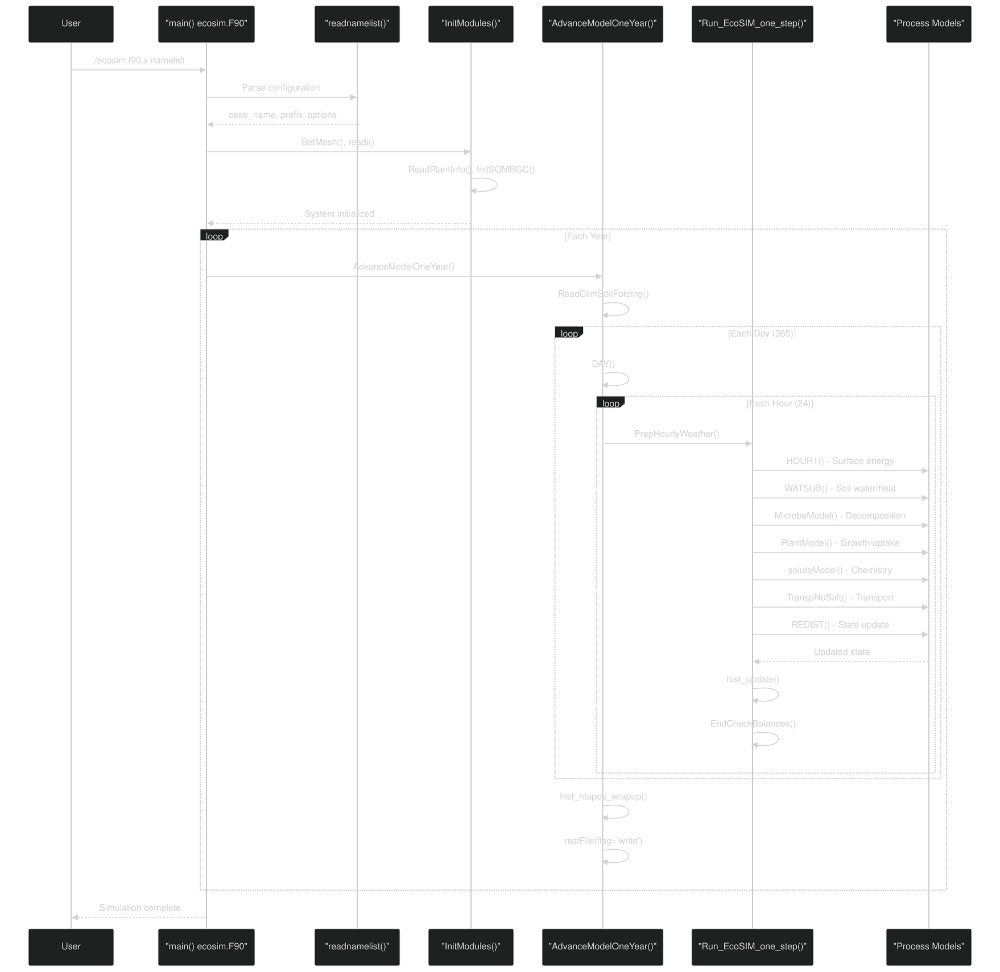

# Overview

Relevant source files

- [.github/workflows/ecosim-ci.yml](https://github.com/jingtao-lbl/EcoSIM/blob/7b8a4cf6/.github/workflows/ecosim-ci.yml)
- [README.md](https://github.com/jingtao-lbl/EcoSIM/blob/7b8a4cf6/README.md)
- [build_EcoSIM.sh](https://github.com/jingtao-lbl/EcoSIM/blob/7b8a4cf6/build_EcoSIM.sh)
- [docker/ubuntu-compiler.dockerfile](https://github.com/jingtao-lbl/EcoSIM/blob/7b8a4cf6/docker/ubuntu-compiler.dockerfile)
- [drivers/ecosim/EcoSIMAPI.F90](https://github.com/jingtao-lbl/EcoSIM/blob/7b8a4cf6/drivers/ecosim/EcoSIMAPI.F90)
- [drivers/ecosim/ecosim.F90](https://github.com/jingtao-lbl/EcoSIM/blob/7b8a4cf6/drivers/ecosim/ecosim.F90)
- [examples/run_dir/blodgett/Blodget.ctrl.namelist](https://github.com/jingtao-lbl/EcoSIM/blob/7b8a4cf6/examples/run_dir/blodgett/Blodget.ctrl.namelist)
- [f90src/APIData/CMakeLists.txt](https://github.com/jingtao-lbl/EcoSIM/blob/7b8a4cf6/f90src/APIData/CMakeLists.txt)
- [f90src/APIs/CMakeLists.txt](https://github.com/jingtao-lbl/EcoSIM/blob/7b8a4cf6/f90src/APIs/CMakeLists.txt)
- [f90src/CMakeLists.txt](https://github.com/jingtao-lbl/EcoSIM/blob/7b8a4cf6/f90src/CMakeLists.txt)
- [python_tools/ParamEditorRice.ipynb](https://github.com/jingtao-lbl/EcoSIM/blob/7b8a4cf6/python_tools/ParamEditorRice.ipynb)

## Purpose and Scope

EcoSIM is a comprehensive biogeochemical modeling system designed to simulate terrestrial ecosystem processes including plant growth, microbial dynamics, soil chemistry, hydrothermal processes, and nutrient cycling. The system originated as a component of the ecosys model and is now maintained as an independent modeling library.

This page provides a high-level orientation to the EcoSIM codebase structure, execution modes, and key components. For detailed build and configuration instructions, see [Getting Started](#2) . For in-depth architectural details, see [System Architecture](#3) . For specific process models, refer to [Biogeochemical Process Models](#4) and [Physical Processes and Transport](#5) .

Sources:  [README.md 1-24](https://github.com/jingtao-lbl/EcoSIM/blob/7b8a4cf6/README.md#L1-L24)  [drivers/ecosim/EcoSIMAPI.F90 1-30](https://github.com/jingtao-lbl/EcoSIM/blob/7b8a4cf6/drivers/ecosim/EcoSIMAPI.F90#L1-L30)

## Repository Structure

EcoSIM is organized into several top-level directories that separate concerns between source code, build infrastructure, testing, and configuration:

Sources:  [f90src/CMakeLists.txt 1-33](https://github.com/jingtao-lbl/EcoSIM/blob/7b8a4cf6/f90src/CMakeLists.txt#L1-L33)  [drivers/ecosim/ecosim.F90 1-28](https://github.com/jingtao-lbl/EcoSIM/blob/7b8a4cf6/drivers/ecosim/ecosim.F90#L1-L28)  [examples/run_dir/blodgett/Blodget.ctrl.namelist 1-10](https://github.com/jingtao-lbl/EcoSIM/blob/7b8a4cf6/examples/run_dir/blodgett/Blodget.ctrl.namelist#L1-L10)

## Execution Modes

EcoSIM supports two primary execution modes, each with a distinct entry point and coupling architecture:

### Standalone Mode

The standalone executable `ecosim.f90.x` provides complete control over simulation configuration through namelist files. The main program resides in `drivers/ecosim/ecosim.F90` and orchestrates simulation setup, timestepping, and output.

Key entry point:  `main()` in [drivers/ecosim/ecosim.F90 1-157](https://github.com/jingtao-lbl/EcoSIM/blob/7b8a4cf6/drivers/ecosim/ecosim.F90#L1-L157)

Core API:  `AdvanceModelOneYear()` in [drivers/ecosim/EcoSIMAPI.F90 321-488](https://github.com/jingtao-lbl/EcoSIM/blob/7b8a4cf6/drivers/ecosim/EcoSIMAPI.F90#L321-L488)

### ATS-Coupled Mode

When compiled with the `ATS_ECOSIM` flag, EcoSIM functions as a biogeochemistry component within the Advanced Terrestrial Simulator framework. The ATS coupler provides initialization and timestep advancement interfaces.

Coupling interface: Defined in `f90src/ATSUtils/` (referenced in system diagrams)

Sources:  [build_EcoSIM.sh 148-158](https://github.com/jingtao-lbl/EcoSIM/blob/7b8a4cf6/build_EcoSIM.sh#L148-L158)  [drivers/ecosim/EcoSIMAPI.F90 32-124](https://github.com/jingtao-lbl/EcoSIM/blob/7b8a4cf6/drivers/ecosim/EcoSIMAPI.F90#L32-L124)

## Core Module Organization

The Fortran source code in `f90src/` is organized into libraries that encapsulate different modeling concerns. The CMake build system compiles these into separate libraries before linking them into the final executable.

| Library Directory | Purpose | Key Modules | 
| --- | --- | --- |
| Utils | Common utilities, timing, file I/O | data_kind_mod, fileUtil, timings | 
| Modelconfig | Configuration flags and parameters | EcoSIMConfig, EcoSIMCtrlDataType | 
| Mesh | Grid and spatial discretization | GridMod, GridConsts | 
| Ecosim_datatype | State and flux data structures | SoilBGCDataType, PlantDataRateType | 
| Modelpars | Model parameters and constants | TracerIDMod, parameter arrays | 
| APIData | API-level data containers | PlantAPIData | 
| APIs | Process model interfaces | PlantAPI, MicBGCAPI, GeochemAPI | 
| Plant_bgc | Plant processes | Growth, phenology, photosynthesis | 
| Microbial_bgc | Microbial transformations | Decomposition, respiration | 
| Geochem | Chemical equilibria | Sorption, precipitation | 
| HydroTherm | Soil physics | Water, heat, snow | 
| Transport | Mass transport | Gas and solute fluxes | 
| IOutils | Input/output | NetCDF readers/writers | 
| Balances | Conservation checks | Mass balance validation | 
| Main | Orchestration logic | Daily/hourly updates | 

Sources:  [f90src/CMakeLists.txt 1-33](https://github.com/jingtao-lbl/EcoSIM/blob/7b8a4cf6/f90src/CMakeLists.txt#L1-L33)  [f90src/APIs/CMakeLists.txt 1-45](https://github.com/jingtao-lbl/EcoSIM/blob/7b8a4cf6/f90src/APIs/CMakeLists.txt#L1-L45)  [f90src/APIData/CMakeLists.txt 1-27](https://github.com/jingtao-lbl/EcoSIM/blob/7b8a4cf6/f90src/APIData/CMakeLists.txt#L1-L27)

## Main Execution Flow

The execution flow follows a hierarchical timestep structure with nested annual, daily, and hourly loops. Each timestep invokes a sequence of process models that update ecosystem state variables.

Entry point:  [drivers/ecosim/ecosim.F90 1-157](https://github.com/jingtao-lbl/EcoSIM/blob/7b8a4cf6/drivers/ecosim/ecosim.F90#L1-L157)

Annual loop:  [drivers/ecosim/EcoSIMAPI.F90 321-488](https://github.com/jingtao-lbl/EcoSIM/blob/7b8a4cf6/drivers/ecosim/EcoSIMAPI.F90#L321-L488)

Hourly step:  [drivers/ecosim/EcoSIMAPI.F90 32-124](https://github.com/jingtao-lbl/EcoSIM/blob/7b8a4cf6/drivers/ecosim/EcoSIMAPI.F90#L32-L124)

Sources:  [drivers/ecosim/ecosim.F90 68-157](https://github.com/jingtao-lbl/EcoSIM/blob/7b8a4cf6/drivers/ecosim/ecosim.F90#L68-L157)  [drivers/ecosim/EcoSIMAPI.F90 321-488](https://github.com/jingtao-lbl/EcoSIM/blob/7b8a4cf6/drivers/ecosim/EcoSIMAPI.F90#L321-L488)

## Process Model Sequence

Within each hourly timestep, process models execute in a specific sequence to maintain numerical stability and ensure proper coupling between physical and biogeochemical processes:

Process sequence implementation:  [drivers/ecosim/EcoSIMAPI.F90 32-124](https://github.com/jingtao-lbl/EcoSIM/blob/7b8a4cf6/drivers/ecosim/EcoSIMAPI.F90#L32-L124)

Key function calls:

- [drivers/ecosim/EcoSIMAPI.F9042](https://github.com/jingtao-lbl/EcoSIM/blob/7b8a4cf6/drivers/ecosim/EcoSIMAPI.F90#L42-L42)`HOUR1()`Surface processes: -
- [drivers/ecosim/EcoSIMAPI.F9051](https://github.com/jingtao-lbl/EcoSIM/blob/7b8a4cf6/drivers/ecosim/EcoSIMAPI.F90#L51-L51)`WATSUB()`Hydrothermal: -
- [drivers/ecosim/EcoSIMAPI.F9059](https://github.com/jingtao-lbl/EcoSIM/blob/7b8a4cf6/drivers/ecosim/EcoSIMAPI.F90#L59-L59)`MicrobeModel()`Microbial: -
- [drivers/ecosim/EcoSIMAPI.F9069](https://github.com/jingtao-lbl/EcoSIM/blob/7b8a4cf6/drivers/ecosim/EcoSIMAPI.F90#L69-L69)`PlantModel()`Plant: -
- [drivers/ecosim/EcoSIMAPI.F9079](https://github.com/jingtao-lbl/EcoSIM/blob/7b8a4cf6/drivers/ecosim/EcoSIMAPI.F90#L79-L79)`soluteModel()`Chemistry: -
- [drivers/ecosim/EcoSIMAPI.F9088](https://github.com/jingtao-lbl/EcoSIM/blob/7b8a4cf6/drivers/ecosim/EcoSIMAPI.F90#L88-L88)`TranspNoSalt()`Transport: -
- [drivers/ecosim/EcoSIMAPI.F90116](https://github.com/jingtao-lbl/EcoSIM/blob/7b8a4cf6/drivers/ecosim/EcoSIMAPI.F90#L116-L116)`REDIST()`Redistribution: -
- [drivers/ecosim/EcoSIMAPI.F90122](https://github.com/jingtao-lbl/EcoSIM/blob/7b8a4cf6/drivers/ecosim/EcoSIMAPI.F90#L122-L122)`EndCheckBalances()`Validation: -

Sources:  [drivers/ecosim/EcoSIMAPI.F90 32-124](https://github.com/jingtao-lbl/EcoSIM/blob/7b8a4cf6/drivers/ecosim/EcoSIMAPI.F90#L32-L124)

## Configuration System

EcoSIM uses Fortran namelists for configuration. The `readnamelist()` function parses multiple namelist groups to configure simulation behavior, model components, and output options.

Key namelist groups:

| Namelist | Purpose | Key Variables | 
| --- | --- | --- |
| ecosim | General configuration | case_name, pft_file_in, grid_file_in, plant_model, microbial_model, soichem_model | 
| ecosim | Forcing data | clm_hour_file_in, clm_day_file_in, forc_periods | 
| ecosim | Solver parameters | NPXS, NPYS, NCYC_LITR, NCYC_SNOW | 
| ecosim | Output control | hist_nhtfrq, hist_mfilt, hist_fincl1, hist_fincl2 | 
| ecosim_time | Time management | rest_opt, rest_frq, stop_option, stop_n | 
| bbgcforc | BGC forcing output | do_bgcforc_write, bgc_fname | 

Namelist parsing:  [drivers/ecosim/EcoSIMAPI.F90 126-318](https://github.com/jingtao-lbl/EcoSIM/blob/7b8a4cf6/drivers/ecosim/EcoSIMAPI.F90#L126-L318)

Example configuration:  [examples/run_dir/blodgett/Blodget.ctrl.namelist 1-68](https://github.com/jingtao-lbl/EcoSIM/blob/7b8a4cf6/examples/run_dir/blodgett/Blodget.ctrl.namelist#L1-L68)

For detailed configuration options, see [Configuration Files](#2.2) .

Sources:  [drivers/ecosim/EcoSIMAPI.F90 126-318](https://github.com/jingtao-lbl/EcoSIM/blob/7b8a4cf6/drivers/ecosim/EcoSIMAPI.F90#L126-L318)  [examples/run_dir/blodgett/Blodget.ctrl.namelist 1-68](https://github.com/jingtao-lbl/EcoSIM/blob/7b8a4cf6/examples/run_dir/blodgett/Blodget.ctrl.namelist#L1-L68)

## Build System

EcoSIM uses CMake for cross-platform compilation. The `build_EcoSIM.sh` wrapper script provides a user-friendly interface with common build options.

Build process overview:

Common build options:

- `--debug`- Enable debug symbols and checks
- `--mpi`- Use MPI compilers
- `--shared`- Build shared libraries
- `--regression_test`- Run tests after build
- `CC=<compiler>``FC=<compiler>`, - Set compilers

Build script:  [build_EcoSIM.sh 1-264](https://github.com/jingtao-lbl/EcoSIM/blob/7b8a4cf6/build_EcoSIM.sh#L1-L264)

Root CMake configuration: Referenced in build script

For detailed build instructions, see [Building EcoSIM](#2.1) . For CMake structure details, see [Build System Details](#8.3) .

Sources:  [build_EcoSIM.sh 1-264](https://github.com/jingtao-lbl/EcoSIM/blob/7b8a4cf6/build_EcoSIM.sh#L1-L264)  [README.md 9-53](https://github.com/jingtao-lbl/EcoSIM/blob/7b8a4cf6/README.md#L9-L53)

## Testing Infrastructure

EcoSIM includes a comprehensive regression test suite to validate model behavior across different scenarios. Tests compare simulation output against baseline files to detect unintended changes.

Test organization:

| Test Category | Location | Purpose | 
| --- | --- | --- |
| Regression baselines | regression-tests/*.regression.baseline.gnu | Expected output values | 
| Test runner | regression-tests/rtest_ecosim.py | Orchestrates test execution | 
| CI workflow | .github/workflows/ecosim-ci.yml | Automated testing | 
| Example cases | examples/run_dir/ | Sample configurations | 

CI pipeline workflow:

CI configuration:  [.github/workflows/ecosim-ci.yml 1-78](https://github.com/jingtao-lbl/EcoSIM/blob/7b8a4cf6/.github/workflows/ecosim-ci.yml#L1-L78)

Regression test flag:  [drivers/ecosim/EcoSIMAPI.F90 491-561](https://github.com/jingtao-lbl/EcoSIM/blob/7b8a4cf6/drivers/ecosim/EcoSIMAPI.F90#L491-L561)

For detailed testing procedures, see [Testing and Validation](#7) .

Sources:  [.github/workflows/ecosim-ci.yml 1-78](https://github.com/jingtao-lbl/EcoSIM/blob/7b8a4cf6/.github/workflows/ecosim-ci.yml#L1-L78)  [build_EcoSIM.sh 261-263](https://github.com/jingtao-lbl/EcoSIM/blob/7b8a4cf6/build_EcoSIM.sh#L261-L263)

## Data Types and Array Conventions

EcoSIM organizes state variables using multi-dimensional arrays with specific dimension suffixes that indicate the variable's spatial organization:

Array suffix conventions:

| Suffix | Dimensions | Purpose | Example | 
| --- | --- | --- | --- |
| _vr | (layer, ny, nx) | Vertical layer arrays | TCS_vr (soil temperature) | 
| _pft | (pft, ny, nx) | Plant functional type arrays | IsPlantActive_pft | 
| _pvr | (pft, layer, ny, nx) | PFT × layer arrays | RootNutUptake_pvr | 
| _col | (ny, nx) | Column-level scalars | ECO_RA_col | 
| _plyr | (pft, canopy_layer, ny, nx) | PFT × canopy layer | CanopyLAIZ_plyr | 

Data structure hierarchy:

Type definitions location:  `f90src/Ecosim_datatype/`

API data structures:  `f90src/APIData/`

For detailed data management, see [Data Type Hierarchy](#6.3) .

Sources:  [drivers/ecosim/EcoSIMAPI.F90 530-557](https://github.com/jingtao-lbl/EcoSIM/blob/7b8a4cf6/drivers/ecosim/EcoSIMAPI.F90#L530-L557) system diagrams

## Key Subsystems Reference

The following subsystems are documented in detail on their respective wiki pages:

- **Plant Biogeochemistry**[Plant Model](#4.1)- Photosynthesis, growth, nutrient uptake, phenology:
- **Microbial Biogeochemistry**[Microbial Model](#4.2)- Decomposition, respiration, mineralization:
- **Soil Chemistry**[Soil Chemistry and Geochemistry](#4.3)- Nutrient speciation, sorption, precipitation:
- **Soil Physics**[Hydro-Thermal Model](#5.1)- Water flow, heat transfer, snow dynamics:
- **Transport**[Transport Processes](#5.2)- Gas and solute movement through soil:
- **ATS Integration**[ATS Integration](#3.2)- Coupling to Advanced Terrestrial Simulator:
- **Input/Output**[Data Management](#6)- Reading forcing data, writing results:
- **Regression Testing**[Testing and Validation](#7)- Validation framework:

Sources: System diagrams, [f90src/CMakeLists.txt 1-33](https://github.com/jingtao-lbl/EcoSIM/blob/7b8a4cf6/f90src/CMakeLists.txt#L1-L33)