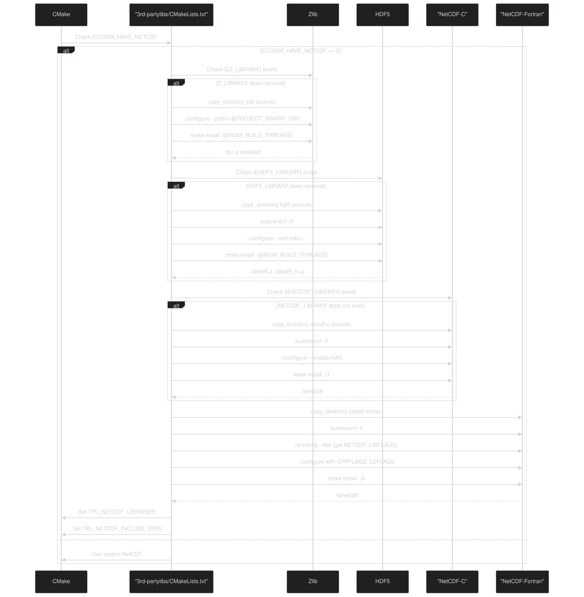

# Building EcoSIM

Relevant source files

- [.github/workflows/ecosim-ci.yml](https://github.com/jingtao-lbl/EcoSIM/blob/7b8a4cf6/.github/workflows/ecosim-ci.yml)
- [3rd-partylibs/CMakeLists.txt](https://github.com/jingtao-lbl/EcoSIM/blob/7b8a4cf6/3rd-partylibs/CMakeLists.txt)
- [CMakeLists.txt](https://github.com/jingtao-lbl/EcoSIM/blob/7b8a4cf6/CMakeLists.txt)
- [README.md](https://github.com/jingtao-lbl/EcoSIM/blob/7b8a4cf6/README.md)
- [build_EcoSIM.sh](https://github.com/jingtao-lbl/EcoSIM/blob/7b8a4cf6/build_EcoSIM.sh)
- [cmake/Modules/add_ecosim_executable.cmake](https://github.com/jingtao-lbl/EcoSIM/blob/7b8a4cf6/cmake/Modules/add_ecosim_executable.cmake)
- [cmake/Modules/set_up_compilers.cmake](https://github.com/jingtao-lbl/EcoSIM/blob/7b8a4cf6/cmake/Modules/set_up_compilers.cmake)
- [cmake/Modules/set_up_platform.cmake](https://github.com/jingtao-lbl/EcoSIM/blob/7b8a4cf6/cmake/Modules/set_up_platform.cmake)
- [docker/ubuntu-compiler.dockerfile](https://github.com/jingtao-lbl/EcoSIM/blob/7b8a4cf6/docker/ubuntu-compiler.dockerfile)
- [drivers/ecosim/CMakeLists.txt](https://github.com/jingtao-lbl/EcoSIM/blob/7b8a4cf6/drivers/ecosim/CMakeLists.txt)
- [drivers/tools/CMakeLists.txt](https://github.com/jingtao-lbl/EcoSIM/blob/7b8a4cf6/drivers/tools/CMakeLists.txt)
- [examples/run_dir/blodgett/Blodget.ctrl.namelist](https://github.com/jingtao-lbl/EcoSIM/blob/7b8a4cf6/examples/run_dir/blodgett/Blodget.ctrl.namelist)
- [python_tools/ParamEditorRice.ipynb](https://github.com/jingtao-lbl/EcoSIM/blob/7b8a4cf6/python_tools/ParamEditorRice.ipynb)
- [tests/example_nl](https://github.com/jingtao-lbl/EcoSIM/blob/7b8a4cf6/tests/example_nl)

## Purpose and Scope

This page provides detailed instructions for building EcoSIM from source, including build system configuration, compiler selection, third-party dependency management, and build options. For information about running simulations after building, see [Running Simulations](#2.3) . For configuration file setup, see [Configuration Files](#2.2) .

## Build Prerequisites

EcoSIM requires the following tools and compilers:

| Component | Requirement | Notes | 
| --- | --- | --- |
| CMake | Version ≥ 3.5 | Build system generator | 
| C Compiler | GCC, Clang, or Intel | C99 standard required | 
| C++ Compiler | G++, Clang++, or Intel | For third-party libraries | 
| Fortran Compiler | gfortran or ifort | Fortran 90/95 support | 
| autoconf/automake | Required | For building third-party libraries | 
| curl | Optional | For NetCDF remote access features | 

The build system will automatically compile the following third-party libraries if they are not found on your system:

- **zlib**- compression library
- **HDF5**- hierarchical data format
- **NetCDF-C**- network common data form (C interface)
- **NetCDF-Fortran**- NetCDF Fortran interface

Sources:  [CMakeLists.txt 3-4](https://github.com/jingtao-lbl/EcoSIM/blob/7b8a4cf6/CMakeLists.txt#L3-L4)  [build_EcoSIM.sh 1-264](https://github.com/jingtao-lbl/EcoSIM/blob/7b8a4cf6/build_EcoSIM.sh#L1-L264)  [.github/workflows/ecosim-ci.yml 14-22](https://github.com/jingtao-lbl/EcoSIM/blob/7b8a4cf6/.github/workflows/ecosim-ci.yml#L14-L22)

## Quick Start

The simplest way to build EcoSIM is using the provided build script:

This will:

The main executable will be available at `./local/bin/ecosim.f90.x` .

Sources:  [README.md 9-21](https://github.com/jingtao-lbl/EcoSIM/blob/7b8a4cf6/README.md#L9-L21)  [build_EcoSIM.sh 189-259](https://github.com/jingtao-lbl/EcoSIM/blob/7b8a4cf6/build_EcoSIM.sh#L189-L259)

## Build Script Options

The `build_EcoSIM.sh` script accepts both environment variables and command-line flags:

### Compiler Selection

### Build Configuration Flags

| Flag | Default | Description | 
| --- | --- | --- |
| --debug | OFF | Enable debug symbols and bounds checking | 
| --mpi | OFF | Use MPI compiler wrappers | 
| --shared | OFF | Build shared libraries instead of static | 
| --verbose | OFF | Enable verbose build output | 
| --sanitize | OFF | Enable address sanitizer | 
| --regression_test | OFF | Run regression tests after build | 
| --clean | - | Remove build directory and exit | 

### Example Build Commands

Sources:  [build_EcoSIM.sh 21-93](https://github.com/jingtao-lbl/EcoSIM/blob/7b8a4cf6/build_EcoSIM.sh#L21-L93)  [README.md 25-53](https://github.com/jingtao-lbl/EcoSIM/blob/7b8a4cf6/README.md#L25-L53)

## Build System Architecture

Build Directory Structure

The build script creates a platform-specific build directory:

Example: `build/Linux-x86_64-double-Debug/`

Sources:  [build_EcoSIM.sh 94-150](https://github.com/jingtao-lbl/EcoSIM/blob/7b8a4cf6/build_EcoSIM.sh#L94-L150)  [CMakeLists.txt 1-258](https://github.com/jingtao-lbl/EcoSIM/blob/7b8a4cf6/CMakeLists.txt#L1-L258)  [cmake/Modules/set_up_platform.cmake 1-151](https://github.com/jingtao-lbl/EcoSIM/blob/7b8a4cf6/cmake/Modules/set_up_platform.cmake#L1-L151)

## CMake Configuration Flow

CMake Variables Set by build_EcoSIM.sh

| Build Script Flag | CMake Variable | Example Value | 
| --- | --- | --- |
| --debug | CMAKE_BUILD_TYPE | Debug | 
| --shared | BUILD_SHARED_LIBS | ON | 
| --sanitize | ADDRESS_SANITIZER | 1 | 
| CC=gcc | CMAKE_C_COMPILER | /usr/bin/gcc | 
| FC=gfortran | CMAKE_Fortran_COMPILER | /usr/bin/gfortran | 
| Darwin OS | APPLE | 1 | 
| Linux OS | LINUX | 1 | 

Sources:  [CMakeLists.txt 6-96](https://github.com/jingtao-lbl/EcoSIM/blob/7b8a4cf6/CMakeLists.txt#L6-L96)  [cmake/Modules/set_up_compilers.cmake 1-100](https://github.com/jingtao-lbl/EcoSIM/blob/7b8a4cf6/cmake/Modules/set_up_compilers.cmake#L1-L100)  [build_EcoSIM.sh 109-150](https://github.com/jingtao-lbl/EcoSIM/blob/7b8a4cf6/build_EcoSIM.sh#L109-L150)

## Compiler Flags

### GNU Compiler Flags

C Compiler (GCC):

- `-std=c99 -Wall -Wpedantic -Wextra`Base flags:
- `-ffpe-trap=invalid,zero,overflow,underflow`Floating-point traps:
- `-fPIC`Position-independent code (for shared libs):

Fortran Compiler (gfortran):

Debug mode:

Release mode:

Key flags:

- `-fdefault-real-8`: Promote default reals to double precision
- `-fdefault-double-8`: Promote double precision to quad precision
- `-fmax-stack-var-size=524288`: Increase stack allocation limit
- `-ffpe-trap=...`: Trap floating-point exceptions for debugging

### Intel Compiler Flags

Host-specific configurations exist for:

- **cori**`-r8 -i4 -align dcommons -auto-scalar`(NERSC):
- **biomes**`-r8 -i4 -align dcommons -auto-scalar`:
- **lawrencium**`-r8 -i4 -align dcommons -auto-scalar`:

Sources:  [cmake/Modules/set_up_compilers.cmake 8-98](https://github.com/jingtao-lbl/EcoSIM/blob/7b8a4cf6/cmake/Modules/set_up_compilers.cmake#L8-L98)

## Third-Party Library Build Process

Library Dependencies:

Build Configuration Details:

zlib:

HDF5:

NetCDF-C:

NetCDF-Fortran:

Sources:  [3rd-partylibs/CMakeLists.txt 1-597](https://github.com/jingtao-lbl/EcoSIM/blob/7b8a4cf6/3rd-partylibs/CMakeLists.txt#L1-L597)

## ATS Integration Mode

EcoSIM can be built as a component within the Advanced Terrestrial Simulator (ATS). This mode changes the build configuration significantly:

ATS-specific CMake Configuration:

Sources:  [CMakeLists.txt 155-220](https://github.com/jingtao-lbl/EcoSIM/blob/7b8a4cf6/CMakeLists.txt#L155-L220)  [build_EcoSIM.sh 148-158](https://github.com/jingtao-lbl/EcoSIM/blob/7b8a4cf6/build_EcoSIM.sh#L148-L158)

## Build Outputs

### Executable Location

After a successful build, executables are installed in two locations:

### Additional Tools

The build also creates utility executables in the same directory:

| Executable | Purpose | 
| --- | --- |
| ecosim.f90.x | Main simulation driver | 
| ClimTransformer.x | Climate data transformation tool | 
| ClimReader.x | Climate file reader utility | 
| SoilManagementReader.x | Soil management data reader | 
| PlantManagementReader.x | Plant management data reader | 
| etimerTest.x | Timer functionality test | 
| NamelistTest.x | Namelist parser test | 
| HFileTest.x | History file test | 
| restartTest.x | Restart file test | 

Sources:  [drivers/ecosim/CMakeLists.txt 1-58](https://github.com/jingtao-lbl/EcoSIM/blob/7b8a4cf6/drivers/ecosim/CMakeLists.txt#L1-L58)  [drivers/tools/CMakeLists.txt 1-119](https://github.com/jingtao-lbl/EcoSIM/blob/7b8a4cf6/drivers/tools/CMakeLists.txt#L1-L119)  [build_EcoSIM.sh 238-259](https://github.com/jingtao-lbl/EcoSIM/blob/7b8a4cf6/build_EcoSIM.sh#L238-L259)

## Platform-Specific Considerations

### macOS (Darwin)

- `.dylib`Library suffix: for shared libraries
- Uses Accelerate framework for BLAS/LAPACK
- `install_name_tool`Special handling for shared library install names using
- `-framework Accelerate`Linker flags:

### Linux

- `.so`Library suffix: for shared libraries
- May require BLAS/LAPACK installation
- `-ldl`Additional linker flag for HDF5/NetCDF:
- `-D_POSIX_C_SOURCE=200809L`POSIX extensions:

### Windows

- Currently limited support
- `.dll`Library suffix:
- Note: MSVC lacks reasonable C99 support

Sources:  [CMakeLists.txt 98-115](https://github.com/jingtao-lbl/EcoSIM/blob/7b8a4cf6/CMakeLists.txt#L98-L115)  [cmake/Modules/set_up_platform.cmake 58-62](https://github.com/jingtao-lbl/EcoSIM/blob/7b8a4cf6/cmake/Modules/set_up_platform.cmake#L58-L62)

## Continuous Integration

The GitHub Actions CI workflow tests the build on multiple platforms:

The CI workflow validates that EcoSIM builds successfully on:

- Ubuntu (latest) with GCC
- Rocky Linux 8.10 with GCC

Sources:  [.github/workflows/ecosim-ci.yml 1-78](https://github.com/jingtao-lbl/EcoSIM/blob/7b8a4cf6/.github/workflows/ecosim-ci.yml#L1-L78)

## Troubleshooting Build Issues

### Common Build Failures

Third-party library configuration fails:

- Check that autoconf and automake are installed
- `build/<platform>/3rd-partylibs/`
- `zlib_config.log``zlib_build.log`,
- `hdf5_config.log``hdf5_build.log`,
- `netcdf_c_config.log``netcdf_c_build.log`,
- `netcdf_fortran_config.log``netcdf_fortran_build.log`,

Review log files in :

Fortran module conflicts:

- `./build_EcoSIM.sh --clean`Clean the build directory:
- Ensure no conflicting modules are loaded (especially on HPC systems)

Compiler not found:

- `CC=gcc FC=gfortran ./build_EcoSIM.sh`Explicitly specify compilers:
- `which gcc``which gfortran`Check compiler availability: ,

Out of memory during compilation:

- `NUM_BUILD_THREADS`[CMakeLists.txt34-35](https://github.com/jingtao-lbl/EcoSIM/blob/7b8a4cf6/CMakeLists.txt#L34-L35)Reduce parallel build threads by editing in
- `--verbose`Use flag to identify memory-intensive compilation units

### Debug Build

To diagnose runtime issues, build with debug symbols and runtime checks:

This enables:

- `-g`Debug symbols ( )
- `-fbounds-check`Array bounds checking ( )
- `-fcheck=all`Runtime checks ( )
- `-fbacktrace`Backtraces on error ( )

Sources:  [cmake/Modules/set_up_compilers.cmake 52-66](https://github.com/jingtao-lbl/EcoSIM/blob/7b8a4cf6/cmake/Modules/set_up_compilers.cmake#L52-L66)  [build_EcoSIM.sh 86-91](https://github.com/jingtao-lbl/EcoSIM/blob/7b8a4cf6/build_EcoSIM.sh#L86-L91)

## Docker Build Environment

For reproducible builds on macOS or systems with incompatible compilers, use the provided Docker environment:

The Docker image includes:

- Ubuntu base
- GCC/G++/gfortran compilers
- CMake, autoconf, automake
- curl, libcurl development headers
- Git, vim, gdb

Sources:  [docker/ubuntu-compiler.dockerfile 1-29](https://github.com/jingtao-lbl/EcoSIM/blob/7b8a4cf6/docker/ubuntu-compiler.dockerfile#L1-L29)  [README.md 55-67](https://github.com/jingtao-lbl/EcoSIM/blob/7b8a4cf6/README.md#L55-L67)