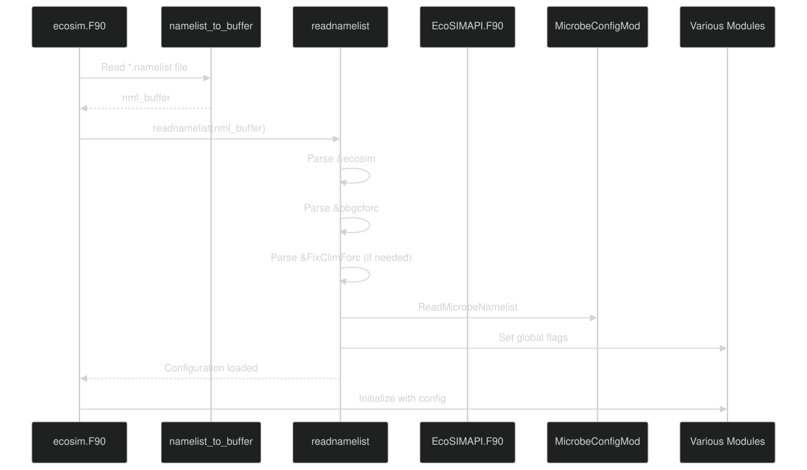

# Configuration Files

Relevant source files

- [drivers/ecosim/EcoSIMAPI.F90](https://github.com/jingtao-lbl/EcoSIM/blob/7b8a4cf6/drivers/ecosim/EcoSIMAPI.F90)
- [drivers/ecosim/ecosim.F90](https://github.com/jingtao-lbl/EcoSIM/blob/7b8a4cf6/drivers/ecosim/ecosim.F90)
- [drivers/tools/ClimReader.F90](https://github.com/jingtao-lbl/EcoSIM/blob/7b8a4cf6/drivers/tools/ClimReader.F90)
- [drivers/tools/ClimTransformer.F90](https://github.com/jingtao-lbl/EcoSIM/blob/7b8a4cf6/drivers/tools/ClimTransformer.F90)
- [examples/run_dir/dryland/dryland.namelist](https://github.com/jingtao-lbl/EcoSIM/blob/7b8a4cf6/examples/run_dir/dryland/dryland.namelist)
- [examples/run_dir/lake/lake.namelist](https://github.com/jingtao-lbl/EcoSIM/blob/7b8a4cf6/examples/run_dir/lake/lake.namelist)
- [examples/run_dir/sample/sample.namelist](https://github.com/jingtao-lbl/EcoSIM/blob/7b8a4cf6/examples/run_dir/sample/sample.namelist)
- [regression-tests/tests/dryland.namelist](https://github.com/jingtao-lbl/EcoSIM/blob/7b8a4cf6/regression-tests/tests/dryland.namelist)
- [regression-tests/tests/lake.namelist](https://github.com/jingtao-lbl/EcoSIM/blob/7b8a4cf6/regression-tests/tests/lake.namelist)
- [regression-tests/tests/sample.namelist](https://github.com/jingtao-lbl/EcoSIM/blob/7b8a4cf6/regression-tests/tests/sample.namelist)

## Purpose and Scope

This page describes the configuration file system used to set up and control EcoSIM simulations. Configuration is managed through Fortran namelist files ( `.namelist` extension) that specify input data files, enable/disable model components, set numerical solver parameters, control simulation timing, and configure output options.

For information about building EcoSIM executables, see [Building EcoSIM](#2.1) . For details on executing simulations and understanding outputs, see [Running Simulations](#2.3) .

## Namelist File Structure

EcoSIM uses Fortran namelist format for configuration. A typical namelist file contains multiple named sections, each controlling different aspects of the simulation:

Sources:  [drivers/ecosim/EcoSIMAPI.F90 126-318](https://github.com/jingtao-lbl/EcoSIM/blob/7b8a4cf6/drivers/ecosim/EcoSIMAPI.F90#L126-L318)  [examples/run_dir/dryland/dryland.namelist](https://github.com/jingtao-lbl/EcoSIM/blob/7b8a4cf6/examples/run_dir/dryland/dryland.namelist)  [examples/run_dir/sample/sample.namelist](https://github.com/jingtao-lbl/EcoSIM/blob/7b8a4cf6/examples/run_dir/sample/sample.namelist)

## Reading Configuration

The configuration reading process is initiated by the main driver and flows through several modules:

Sources:  [drivers/ecosim/ecosim.F90 68-73](https://github.com/jingtao-lbl/EcoSIM/blob/7b8a4cf6/drivers/ecosim/ecosim.F90#L68-L73)  [drivers/ecosim/EcoSIMAPI.F90 126-318](https://github.com/jingtao-lbl/EcoSIM/blob/7b8a4cf6/drivers/ecosim/EcoSIMAPI.F90#L126-L318)

## Core Configuration Namelist (&ecosim)

The `&ecosim` namelist is the primary configuration section containing most simulation parameters. It is read by the `readnamelist` subroutine in [drivers/ecosim/EcoSIMAPI.F90 156-167](https://github.com/jingtao-lbl/EcoSIM/blob/7b8a4cf6/drivers/ecosim/EcoSIMAPI.F90#L156-L167)

### Case Identification

| Parameter | Type | Default | Description | 
| --- | --- | --- | --- |
| case_name | character(36) | - | Unique identifier for this simulation case | 
| prefix | character(80) | - | Directory path prefix for input files | 

### Input File Specifications

| Parameter | Type | Default | Description | 
| --- | --- | --- | --- |
| pft_file_in | character(256) | '' | Plant functional type parameter file (NetCDF) | 
| grid_file_in | character(256) | '' | Grid definition and soil properties (NetCDF) | 
| pft_mgmt_in | character(256) | 'NO' | Plant management schedule file (NetCDF) | 
| soil_mgmt_in | character(256) | 'NO' | Soil management (fertilizer, tillage) file (NetCDF) | 
| clm_hour_file_in | character(256) | '' | Hourly climate forcing file (NetCDF) | 
| clm_day_file_in | character(256) | '' | Daily climate forcing file (NetCDF) | 
| clm_factor_in | character(256) | 'NO' | Climate modification factors (optional) | 
| atm_ghg_in | character(256) | '' | Atmospheric greenhouse gas concentrations | 
| micpar_file_in | character(256) | '' | Microbial parameter file (NetCDF) | 

Sources:  [drivers/ecosim/EcoSIMAPI.F90 158-159](https://github.com/jingtao-lbl/EcoSIM/blob/7b8a4cf6/drivers/ecosim/EcoSIMAPI.F90#L158-L159)  [examples/run_dir/dryland/dryland.namelist 9-16](https://github.com/jingtao-lbl/EcoSIM/blob/7b8a4cf6/examples/run_dir/dryland/dryland.namelist#L9-L16)

### Model Component Toggles

| Parameter | Type | Default | Description | 
| --- | --- | --- | --- |
| plant_model | logical | .true. | Enable plant growth and phenology model | 
| microbial_model | logical | .true. | Enable microbial biogeochemistry | 
| soichem_model | logical | .true. | Enable soil chemistry equilibria | 
| salt_model | logical | .false. | Enable salt transport (requires soichem_model) | 
| snowRedist_model | logical | - | Enable snow redistribution | 
| erosion_model | logical | - | Enable soil erosion (via iErosionMode) | 

Sources:  [drivers/ecosim/EcoSIMAPI.F90 193-195](https://github.com/jingtao-lbl/EcoSIM/blob/7b8a4cf6/drivers/ecosim/EcoSIMAPI.F90#L193-L195)  [examples/run_dir/dryland/dryland.namelist 20-21](https://github.com/jingtao-lbl/EcoSIM/blob/7b8a4cf6/examples/run_dir/dryland/dryland.namelist#L20-L21)

### Simulation Control

| Parameter | Type | Default | Description | 
| --- | --- | --- | --- |
| start_date | character(14) | '18000101000000' | Simulation start (YYYYMMDDhhmmss) | 
| continue_run | logical | .false. | Continue from restart file | 
| finidat | character(256) | '' | Initial condition (restart) file path | 
| forc_periods | integer(27) | varies | Forcing period specification (year ranges, cycles) | 
| grid_mode | integer | 3 | Grid connection mode (1=1D, 2=2D, 3=3D) | 

The `forc_periods` array specifies simulation periods in groups of 9 integers:

- Elements 1-3: Period 1 (start_year, end_year, num_cycles)
- Elements 4-6: Period 2 (start_year, end_year, num_cycles)
- Elements 7-9: Period 3 (start_year, end_year, num_cycles)

A typical spinup-transient configuration:

Sources:  [drivers/ecosim/EcoSIMAPI.F90 156-167](https://github.com/jingtao-lbl/EcoSIM/blob/7b8a4cf6/drivers/ecosim/EcoSIMAPI.F90#L156-L167)  [examples/run_dir/dryland/dryland.namelist 25-28](https://github.com/jingtao-lbl/EcoSIM/blob/7b8a4cf6/examples/run_dir/dryland/dryland.namelist#L25-L28)

### Numerical Solver Parameters

| Parameter | Type | Default | Description | 
| --- | --- | --- | --- |
| NPXS | integer(3) | 30,30,30 | Cycles per hour for water/heat/solute transport | 
| NPYS | integer(3) | 20,20,20 | Cycles per NPXS for gas flux calculations | 
| NCYC_LITR | integer | 20 | Cycles for litter decomposition | 
| NCYC_SNOW | integer | 20 | Cycles for snow physics | 

Higher values increase numerical stability but require more computation time. The three values in `NPXS` and `NPYS` correspond to the three periods defined in `forc_periods` .

Sources:  [drivers/ecosim/EcoSIMAPI.F90 182-183](https://github.com/jingtao-lbl/EcoSIM/blob/7b8a4cf6/drivers/ecosim/EcoSIMAPI.F90#L182-L183)  [examples/run_dir/dryland/dryland.namelist 37-40](https://github.com/jingtao-lbl/EcoSIM/blob/7b8a4cf6/examples/run_dir/dryland/dryland.namelist#L37-L40)

### History Output Configuration

| Parameter | Type | Default | Description | 
| --- | --- | --- | --- |
| hist_mfilt | integer | - | Maximum number of time samples per history file | 
| hist_nhtfrq | integer | - | History write frequency (hours; negative for snapshots) | 
| hist_fincl1 | character array | - | List of variables to include in primary history file | 
| hist_fincl2 | character array | - | List of variables for secondary history file | 
| hist_yrclose | logical | .false. | Close history files at year end | 
| do_budgets | logical | .false. | Include detailed budget diagnostics | 

Example:

Sources:  [drivers/ecosim/EcoSIMAPI.F90 166-167](https://github.com/jingtao-lbl/EcoSIM/blob/7b8a4cf6/drivers/ecosim/EcoSIMAPI.F90#L166-L167)  [examples/run_dir/dryland/dryland.namelist 29-43](https://github.com/jingtao-lbl/EcoSIM/blob/7b8a4cf6/examples/run_dir/dryland/dryland.namelist#L29-L43)

### Atmospheric Composition

| Parameter | Type | Default | Description | 
| --- | --- | --- | --- |
| aco2_ppm | real(r8) | 280.0 | Atmospheric CO₂ concentration (ppm) | 
| ao2_ppm | real(r8) | 0.209e6 | Atmospheric O₂ concentration (ppm) | 
| ach4_ppm | real(r8) | 1.144 | Atmospheric CH₄ concentration (ppm) | 
| an2o_ppm | real(r8) | 0.270 | Atmospheric N₂O concentration (ppm) | 
| anh3_ppm | real(r8) | 5.e-3 | Atmospheric NH₃ concentration (ppm) | 
| atm_co2_fix | real(r8) | -100.0 | Fixed CO₂ override (-100 = use time-varying) | 

Sources:  [drivers/ecosim/EcoSIMAPI.F90 230-239](https://github.com/jingtao-lbl/EcoSIM/blob/7b8a4cf6/drivers/ecosim/EcoSIMAPI.F90#L230-L239)

### Debug and Testing Options

| Parameter | Type | Default | Description | 
| --- | --- | --- | --- |
| lverbose | logical | .false. | Enable verbose console output | 
| do_regression_test | logical | .false. | Run in regression test mode | 
| num_of_simdays | integer | -1 | Limit simulation to N days (testing) | 
| do_timing | logical | .false. | Enable performance timing output | 
| idebug_day | integer | -1 | Enable verbose output for specific day | 
| disp_planttrait | logical | .false. | Display plant traits to console | 

Sources:  [drivers/ecosim/EcoSIMAPI.F90 148-180](https://github.com/jingtao-lbl/EcoSIM/blob/7b8a4cf6/drivers/ecosim/EcoSIMAPI.F90#L148-L180)  [examples/run_dir/dryland/dryland.namelist 18-22](https://github.com/jingtao-lbl/EcoSIM/blob/7b8a4cf6/examples/run_dir/dryland/dryland.namelist#L18-L22)

## Time Control Namelist (&ecosim_time)

The `&ecosim_time` namelist controls simulation duration and restart file frequency:

| Parameter | Type | Default | Description | 
| --- | --- | --- | --- |
| delta_time | real(r8) | 3600.0 | Timestep size (seconds; typically 3600 for hourly) | 
| stop_option | character | 'nyears' | Units for stop_n ('ndays', 'nmonths', 'nyears') | 
| stop_n | integer | - | Number of units to run | 
| rest_opt | character | 'nyears' | Units for restart frequency | 
| rest_frq | integer | 1 | Restart file write frequency | 
| diag_opt | character | 'nsteps' | Diagnostic output frequency units | 
| diag_frq | integer | 1 | Diagnostic output frequency | 

Example:

Sources:  [examples/run_dir/dryland/dryland.namelist 48-57](https://github.com/jingtao-lbl/EcoSIM/blob/7b8a4cf6/examples/run_dir/dryland/dryland.namelist#L48-L57)  [examples/run_dir/sample/sample.namelist 45-53](https://github.com/jingtao-lbl/EcoSIM/blob/7b8a4cf6/examples/run_dir/sample/sample.namelist#L45-L53)

## BGC Forcing Output Namelist (&bbgcforc)

The `&bbgcforc` namelist configures optional biogeochemical forcing data output for model development and analysis:

| Parameter | Type | Default | Description | 
| --- | --- | --- | --- |
| do_bgcforc_write | logical | .false. | Enable BGC forcing output | 
| do_year | integer | -1 | Year to output | 
| do_doy | integer | 0 | Day of year to output | 
| laddband | logical | .false. | Include fertilizer band data | 
| do_layer | integer | 1 | Soil layer to output | 
| bgc_fname | character(64) | 'bbforc.nc' | Output filename | 

Sources:  [drivers/ecosim/EcoSIMAPI.F90 169-275](https://github.com/jingtao-lbl/EcoSIM/blob/7b8a4cf6/drivers/ecosim/EcoSIMAPI.F90#L169-L275)

## Fixed Climate Forcing Namelist (&FixClimForc)

When `fixClime=.true.` in `&ecosim` , this namelist provides constant climate forcing values:

| Parameter | Type | Description | 
| --- | --- | --- |
| airT_C | real(r8) | Air temperature (°C) | 
| Wind_ms | real(r8) | Wind speed (m/s) | 
| vap_Kpa | real(r8) | Vapor pressure (kPa) | 
| Rain_mmhr | real(r8) | Precipitation (mm/hr) | 
| SRAD_Wm2 | real(r8) | Solar radiation (W/m²) | 
| Atm_kPa | real(r8) | Atmospheric pressure (kPa) | 

Sources:  [drivers/ecosim/EcoSIMAPI.F90 173-314](https://github.com/jingtao-lbl/EcoSIM/blob/7b8a4cf6/drivers/ecosim/EcoSIMAPI.F90#L173-L314)

## Configuration Processing Flow

The following diagram shows how configuration data flows from namelist files through the system to control model behavior:

Sources:  [drivers/ecosim/ecosim.F90 70-73](https://github.com/jingtao-lbl/EcoSIM/blob/7b8a4cf6/drivers/ecosim/ecosim.F90#L70-L73)  [drivers/ecosim/EcoSIMAPI.F90 126-318](https://github.com/jingtao-lbl/EcoSIM/blob/7b8a4cf6/drivers/ecosim/EcoSIMAPI.F90#L126-L318)

## Input File Formats

All input files are in NetCDF format. The configuration parameters specify file paths, which are processed by specialized reader modules:

Sources:  [drivers/ecosim/EcoSIMAPI.F90 158-159](https://github.com/jingtao-lbl/EcoSIM/blob/7b8a4cf6/drivers/ecosim/EcoSIMAPI.F90#L158-L159)  [drivers/ecosim/ecosim.F90 90-91](https://github.com/jingtao-lbl/EcoSIM/blob/7b8a4cf6/drivers/ecosim/ecosim.F90#L90-L91)

## Example Configurations

### Dryland Agriculture Simulation

Sources:  [examples/run_dir/dryland/dryland.namelist](https://github.com/jingtao-lbl/EcoSIM/blob/7b8a4cf6/examples/run_dir/dryland/dryland.namelist)

### Lake/Pond Simulation (No Plants)

Sources:  [examples/run_dir/lake/lake.namelist](https://github.com/jingtao-lbl/EcoSIM/blob/7b8a4cf6/examples/run_dir/lake/lake.namelist)

## Configuration Validation

The `readnamelist` subroutine performs several validation and consistency checks:

Sources:  [drivers/ecosim/EcoSIMAPI.F90 280-291](https://github.com/jingtao-lbl/EcoSIM/blob/7b8a4cf6/drivers/ecosim/EcoSIMAPI.F90#L280-L291)

## Configuration to Code Entity Mapping

The following table maps key namelist parameters to the Fortran modules and variables they control:

| Namelist Parameter | Module | Variable/Function | Purpose | 
| --- | --- | --- | --- |
| plant_model | EcoSIMCtrlDataType | plant_model | Flag checked before calling PlantModel() | 
| microbial_model | EcoSIMCtrlDataType | microbial_model | Flag checked before calling MicrobeModel() | 
| soichem_model | EcoSIMCtrlDataType | soichem_model | Flag checked before calling soluteModel() | 
| NPXS | StartsMod | set_ecosim_solver() | Sets subcycling for water/heat/solute | 
| NPYS | StartsMod | set_ecosim_solver() | Sets subcycling for gas transport | 
| hist_mfilt | HistFileMod | hist_htapes_build() | History file buffer size | 
| hist_nhtfrq | HistFileMod | hist_htapes_build() | History write frequency | 
| grid_file_in | readiMod | readi() | Grid and soil data loader | 
| clm_hour_file_in | readsmod | ReadClimSoilForcing() | Climate forcing loader | 
| pft_file_in | PlantInfoMod | ReadPlantInfo() | Plant parameter loader | 
| start_date | EcoSIMConfig | start_date | Simulation start timestamp | 
| forc_periods | EcoSIMCtrlDataType | forc_periods | Period control array | 

Sources:  [drivers/ecosim/EcoSIMAPI.F90 32-318](https://github.com/jingtao-lbl/EcoSIM/blob/7b8a4cf6/drivers/ecosim/EcoSIMAPI.F90#L32-L318)