# Running Simulations

Relevant source files

- [drivers/ecosim/EcoSIMAPI.F90](https://github.com/jingtao-lbl/EcoSIM/blob/7b8a4cf6/drivers/ecosim/EcoSIMAPI.F90)
- [drivers/ecosim/ecosim.F90](https://github.com/jingtao-lbl/EcoSIM/blob/7b8a4cf6/drivers/ecosim/ecosim.F90)
- [f90src/Balances/RedistMod.F90](https://github.com/jingtao-lbl/EcoSIM/blob/7b8a4cf6/f90src/Balances/RedistMod.F90)
- [f90src/Balances/SoilLayerDynMod.F90](https://github.com/jingtao-lbl/EcoSIM/blob/7b8a4cf6/f90src/Balances/SoilLayerDynMod.F90)
- [f90src/Ecosim_datatype/SoilBGCDataType.F90](https://github.com/jingtao-lbl/EcoSIM/blob/7b8a4cf6/f90src/Ecosim_datatype/SoilBGCDataType.F90)
- [f90src/Ecosim_mods/StartsMod.F90](https://github.com/jingtao-lbl/EcoSIM/blob/7b8a4cf6/f90src/Ecosim_mods/StartsMod.F90)
- [f90src/IOutils/HistDataType.F90](https://github.com/jingtao-lbl/EcoSIM/blob/7b8a4cf6/f90src/IOutils/HistDataType.F90)
- [f90src/IOutils/RestartMod.F90](https://github.com/jingtao-lbl/EcoSIM/blob/7b8a4cf6/f90src/IOutils/RestartMod.F90)
- [f90src/ModelDiags/BalancesMod.F90](https://github.com/jingtao-lbl/EcoSIM/blob/7b8a4cf6/f90src/ModelDiags/BalancesMod.F90)
- [f90src/Modelforc/Hour1Mod.F90](https://github.com/jingtao-lbl/EcoSIM/blob/7b8a4cf6/f90src/Modelforc/Hour1Mod.F90)
- [f90src/Plant_bgc/UptakesMod.F90](https://github.com/jingtao-lbl/EcoSIM/blob/7b8a4cf6/f90src/Plant_bgc/UptakesMod.F90)
- [f90src/Transport/Nonsalt/InitNoSaltTransportMod.F90](https://github.com/jingtao-lbl/EcoSIM/blob/7b8a4cf6/f90src/Transport/Nonsalt/InitNoSaltTransportMod.F90)
- [f90src/Transport/Nonsalt/TranspNoSaltDataMod.F90](https://github.com/jingtao-lbl/EcoSIM/blob/7b8a4cf6/f90src/Transport/Nonsalt/TranspNoSaltDataMod.F90)
- [f90src/Transport/Nonsalt/TranspNoSaltFastMod.F90](https://github.com/jingtao-lbl/EcoSIM/blob/7b8a4cf6/f90src/Transport/Nonsalt/TranspNoSaltFastMod.F90)
- [f90src/Transport/Nonsalt/TranspNoSaltMod.F90](https://github.com/jingtao-lbl/EcoSIM/blob/7b8a4cf6/f90src/Transport/Nonsalt/TranspNoSaltMod.F90)
- [f90src/Transport/Nonsalt/TranspNoSaltSlowMod.F90](https://github.com/jingtao-lbl/EcoSIM/blob/7b8a4cf6/f90src/Transport/Nonsalt/TranspNoSaltSlowMod.F90)

This page describes how to execute EcoSIM simulations once the model has been built (see [Building EcoSIM](#2.1) ) and configured (see [Configuration Files](#2.2) ). It covers the execution flow, main simulation loops, output generation, and tools for monitoring and validating simulation results.

For information about the underlying system architecture and module organization, see [System Architecture](#3) .

## Execution Overview

EcoSIM simulations are executed through the main driver program `ecosim.f90.x` , which orchestrates initialization, time-stepping, and output generation. The execution follows a hierarchical time-stepping structure: years → days → hours, with each hourly timestep advancing all biogeochemical and physical processes.

Execution Flow from Startup to Completion

Sources: [drivers/ecosim/ecosim.F90 1-141](https://github.com/jingtao-lbl/EcoSIM/blob/7b8a4cf6/drivers/ecosim/ecosim.F90#L1-L141)  [drivers/ecosim/EcoSIMAPI.F90 321-488](https://github.com/jingtao-lbl/EcoSIM/blob/7b8a4cf6/drivers/ecosim/EcoSIMAPI.F90#L321-L488)

## Main Simulation Driver

The simulation is executed by running the compiled executable with a namelist file:

The main program performs the following initialization sequence:

| Step | Function/Module | Purpose | 
| --- | --- | --- |
| 1 | readnamelist() | Parse namelist configuration | 
| 2 | InitModules() | Initialize all model components | 
| 3 | SetMesh() | Establish spatial grid structure | 
| 4 | readi() | Read soil properties, topography, initial conditions | 
| 5 | hist_htapes_build() | Configure output file structure | 
| 6 | AdvanceModelOneYear() | Enter main simulation loop | 

Sources: [drivers/ecosim/ecosim.F90 57-141](https://github.com/jingtao-lbl/EcoSIM/blob/7b8a4cf6/drivers/ecosim/ecosim.F90#L57-L141)  [drivers/ecosim/EcoSIMAPI.F90 126-318](https://github.com/jingtao-lbl/EcoSIM/blob/7b8a4cf6/drivers/ecosim/EcoSIMAPI.F90#L126-L318)

## Hourly Timestep Execution

Each hour of simulation advances through a fixed sequence of process models. The `Run_EcoSIM_one_step()` function coordinates this execution:

Hourly Process Sequence

Sources: [drivers/ecosim/EcoSIMAPI.F90 32-124](https://github.com/jingtao-lbl/EcoSIM/blob/7b8a4cf6/drivers/ecosim/EcoSIMAPI.F90#L32-L124)

### Process Model Details

Each component in `Run_EcoSIM_one_step()` performs specific calculations:

HOUR1 - Surface Initialization

- Resets hourly flux accumulators
- Updates atmospheric tracer concentrations
- Calculates litter physical properties
- Performs canopy radiation interception
- Handles precipitation interception

Sources: [f90src/Modelforc/Hour1Mod.F90 87-251](https://github.com/jingtao-lbl/EcoSIM/blob/7b8a4cf6/f90src/Modelforc/Hour1Mod.F90#L87-L251)

WATSUB - Soil Water and Heat

- Solves 3D Richards equation for water flow
- Calculates heat conduction and phase change
- Updates soil temperature and moisture profiles
- Handles macropore-micropore exchange

MicrobeModel - Microbial Biogeochemistry

- Organic matter decomposition
- Microbial respiration (CO₂, CH₄ production)
- Nutrient mineralization (N, P release)
- Nitrification and denitrification

PlantModel - Plant Processes

- Photosynthesis and stomatal conductance
- Root water and nutrient uptake
- Carbon allocation and growth
- Plant phenology advancement

soluteModel - Geochemical Equilibria

- NH₄/NH₃ equilibrium
- Phosphorus sorption/desorption
- Carbonate chemistry
- Mineral precipitation/dissolution

TranspNoSalt - Gas and Solute Transport

- Gaseous diffusion (CO₂, O₂, CH₄, N₂O, NH₃)
- Dissolved solute advection
- Ebullition (bubble formation and release)
- Root-mediated transport

REDIST - Mass Redistribution

- Updates all state variables with fluxes
- Performs mass balance checks
- Handles layer dynamics (freeze/thaw, erosion)
- Prepares variables for next timestep

Sources: [drivers/ecosim/EcoSIMAPI.F90 38-122](https://github.com/jingtao-lbl/EcoSIM/blob/7b8a4cf6/drivers/ecosim/EcoSIMAPI.F90#L38-L122)

## Simulation Time Control

The simulation advances through nested time loops controlled by the `etimer` object:

Time control variables in namelist:

| Variable | Type | Description | 
| --- | --- | --- |
| start_date | String | Simulation start date (YYYYMMDDHHMMSS) | 
| ref_date | String | Reference date for time axis | 
| num_of_simdays | Integer | Number of days to simulate (-1 = use forcing file length) | 

Sources: [drivers/ecosim/EcoSIMAPI.F90 428-474](https://github.com/jingtao-lbl/EcoSIM/blob/7b8a4cf6/drivers/ecosim/EcoSIMAPI.F90#L428-L474)  [drivers/ecosim/EcoSIMAPI.F90 126-198](https://github.com/jingtao-lbl/EcoSIM/blob/7b8a4cf6/drivers/ecosim/EcoSIMAPI.F90#L126-L198)

## Output File Generation

EcoSIM generates multiple output file types during execution:

### History Files

History files contain time series of simulated variables written at specified intervals. The output system uses a tape-based architecture:

History Output Architecture

Sources: [f90src/IOutils/HistDataType.F90 46-596](https://github.com/jingtao-lbl/EcoSIM/blob/7b8a4cf6/f90src/IOutils/HistDataType.F90#L46-L596)  [drivers/ecosim/EcoSIMAPI.F90 458-468](https://github.com/jingtao-lbl/EcoSIM/blob/7b8a4cf6/drivers/ecosim/EcoSIMAPI.F90#L458-L468)

### Output File Naming Convention

History files follow this naming pattern:

Where:

- `<case_name>`: Simulation identifier from namelist
- `<tape>``h0``h1`: (primary), (secondary), etc.
- `YYYY-MM-DD-SSSSS`: Date and time-of-day (seconds)

### Key Namelist Variables for Output

| Variable | Default | Description | 
| --- | --- | --- |
| hist_nhtfrq | -24 | Output frequency (negative=hours, positive=timesteps) | 
| hist_mfilt | 1 | Number of time samples per file | 
| hist_fincl1 | ' ' | Variables to include on tape h0 | 
| hist_fincl2 | ' ' | Variables to include on tape h1 | 
| hist_yrclose | .false. | Close files at year end | 

Example configuration:

Sources: [drivers/ecosim/EcoSIMAPI.F90 166-167](https://github.com/jingtao-lbl/EcoSIM/blob/7b8a4cf6/drivers/ecosim/EcoSIMAPI.F90#L166-L167)

### Output Variable Categories

The history data type defines hundreds of output variables organized by dimension:

| Prefix | Dimension | Example Variables | 
| --- | --- | --- |
| h1D_*_col | Column (grid cell) | h1D_ECO_GPP_col, h1D_NBP_col, h1D_tSWC_col | 
| h1D_*_ptc | Plant functional type | h1D_LAI_ptc, h1D_Plant_C_ptc, h1D_TRANSPN_ptc | 
| h2D_*_vr | Vertical profile | h2D_TEMP_vr, h2D_tSOC_vr, h2D_NO3_vr | 
| h2D_*_pvr | Plant × vertical | h2D_RootMassC_pvr, h2D_prtUP_NH4_pvr | 
| h3D_*_vr | 3D complex data | h3D_SOC_Cps_vr, h3D_MicrobActCps_vr | 

Sources: [f90src/IOutils/HistDataType.F90 47-590](https://github.com/jingtao-lbl/EcoSIM/blob/7b8a4cf6/f90src/IOutils/HistDataType.F90#L47-L590)

## Restart and Checkpoint Files

Restart files enable simulation interruption and resumption, storing complete model state.

### Creating Restart Files

Restart file generation is controlled by `etimer` and written when:

Namelist control:

### Restart File Contents

Restart files contain:

| Data Category | Examples | 
| --- | --- |
| Grid structure | Layer depths, areas, connectivity | 
| Soil physics | Temperature, water content, ice content | 
| Soil chemistry | NH₄, NO₃, PO₄, pH, dissolved gases | 
| Organic matter | SOC pools, microbial biomass, litter C/N/P | 
| Plant state | Biomass pools, phenology stage, canopy structure | 
| Auxiliary state | Accumulators, flags, management history | 

Sources: [f90src/IOutils/RestartMod.F90 70-88](https://github.com/jingtao-lbl/EcoSIM/blob/7b8a4cf6/f90src/IOutils/RestartMod.F90#L70-L88)

### Resuming from Restart

To resume a simulation:

The restart logic:

Sources: [drivers/ecosim/EcoSIMAPI.F90 432-443](https://github.com/jingtao-lbl/EcoSIM/blob/7b8a4cf6/drivers/ecosim/EcoSIMAPI.F90#L432-L443)  [f90src/IOutils/RestartMod.F90 70-88](https://github.com/jingtao-lbl/EcoSIM/blob/7b8a4cf6/f90src/IOutils/RestartMod.F90#L70-L88)

## Mass Balance Checking

EcoSIM performs comprehensive mass balance validation at each timestep through the `BalancesMod` module.

Mass Balance Check Workflow

Sources: [f90src/ModelDiags/BalancesMod.F90 37-79](https://github.com/jingtao-lbl/EcoSIM/blob/7b8a4cf6/f90src/ModelDiags/BalancesMod.F90#L37-L79)  [f90src/ModelDiags/BalancesMod.F90 174-313](https://github.com/jingtao-lbl/EcoSIM/blob/7b8a4cf6/f90src/ModelDiags/BalancesMod.F90#L174-L313)

### Enabling Budget Diagnostics

Set in namelist:

When enabled, detailed diagnostics are written to `fort.110` , `fort.111` , etc., reporting:

- Water balance errors exceeding threshold (1e-4 m³)
- Heat balance errors exceeding threshold (1e-6 MJ)
- Tracer mass conservation errors

Example diagnostic output:

Sources: [f90src/ModelDiags/BalancesMod.F90 236-280](https://github.com/jingtao-lbl/EcoSIM/blob/7b8a4cf6/f90src/ModelDiags/BalancesMod.F90#L236-L280)

## Regression Testing

EcoSIM includes a regression testing framework to validate model behavior against reference outputs.

### Running Regression Tests

Configure namelist for regression mode:

Execute:

### Regression Test Output

The `regressiontest()` function writes baseline files containing key state variables:

Variables tracked:

- Root NH₄ uptake flux (first 12 layers)
- Aqueous soil O₂ concentration
- Liquid soil water content
- Soil temperature profile

Sources: [drivers/ecosim/EcoSIMAPI.F90 491-561](https://github.com/jingtao-lbl/EcoSIM/blob/7b8a4cf6/drivers/ecosim/EcoSIMAPI.F90#L491-L561)

### Comparing Against Baselines

Regression test results are compared against stored baselines:

The test suite ( `rtest_ecosim.py` ) automates comparison and reports differences.

Sources: [drivers/ecosim/EcoSIMAPI.F90 491-561](https://github.com/jingtao-lbl/EcoSIM/blob/7b8a4cf6/drivers/ecosim/EcoSIMAPI.F90#L491-L561)

## Monitoring Simulation Progress

### Console Output

EcoSIM provides runtime feedback when verbose mode is enabled:

Typical output shows progress through major subroutines:

### Progress Indicators

The simulation prints:

- Current date/time being simulated
- `lverbose=.true.`Major subroutine entry/exit (when )
- Error messages if mass balance violations exceed tolerances
- `do_timing=.true.`Timer statistics (when )

### Performance Timing

Enable detailed timing:

This generates timing output showing time spent in each major component, useful for identifying performance bottlenecks.

Sources: [drivers/ecosim/EcoSIMAPI.F90 29](https://github.com/jingtao-lbl/EcoSIM/blob/7b8a4cf6/drivers/ecosim/EcoSIMAPI.F90#L29-L29)  [drivers/ecosim/EcoSIMAPI.F90 38-122](https://github.com/jingtao-lbl/EcoSIM/blob/7b8a4cf6/drivers/ecosim/EcoSIMAPI.F90#L38-L122)

## Common Execution Patterns

### Standard Simulation Run

### Multi-Year Transient Simulation

Configure forcing data periods:

The model automatically cycles through forcing data as specified.

### Spin-Up Procedure

Sources: [drivers/ecosim/EcoSIMAPI.F90 206-207](https://github.com/jingtao-lbl/EcoSIM/blob/7b8a4cf6/drivers/ecosim/EcoSIMAPI.F90#L206-L207)  [drivers/ecosim/EcoSIMAPI.F90 370-390](https://github.com/jingtao-lbl/EcoSIM/blob/7b8a4cf6/drivers/ecosim/EcoSIMAPI.F90#L370-L390)

## Error Handling and Diagnostics

### Simulation Termination

The model will abort with error messages if:

- Mass balance errors exceed tolerances
- Invalid input data detected
- Numerical instabilities occur (e.g., negative mass)

Error messages indicate:

- Location in code (file:line)
- Problematic variable values
- Timestep when error occurred

### Debug Output

For detailed debugging, set:

This generates extensive diagnostic files ( `fort.*` ) with intermediate state values.

Sources: [drivers/ecosim/EcoSIMAPI.F90 415-419](https://github.com/jingtao-lbl/EcoSIM/blob/7b8a4cf6/drivers/ecosim/EcoSIMAPI.F90#L415-L419)

## Summary

EcoSIM execution follows a well-defined workflow:

Key execution components:

- [drivers/ecosim/ecosim.F90](https://github.com/jingtao-lbl/EcoSIM/blob/7b8a4cf6/drivers/ecosim/ecosim.F90)Main driver:
- [drivers/ecosim/EcoSIMAPI.F90](https://github.com/jingtao-lbl/EcoSIM/blob/7b8a4cf6/drivers/ecosim/EcoSIMAPI.F90)Core API:
- `Run_EcoSIM_one_step()`Timestep execution:
- [f90src/IOutils/HistDataType.F90](https://github.com/jingtao-lbl/EcoSIM/blob/7b8a4cf6/f90src/IOutils/HistDataType.F90)Output system:
- [f90src/IOutils/RestartMod.F90](https://github.com/jingtao-lbl/EcoSIM/blob/7b8a4cf6/f90src/IOutils/RestartMod.F90)Restart handling: