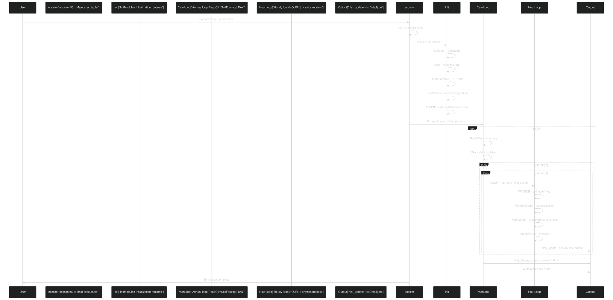

# Getting Started

Relevant source files

- [.github/workflows/ecosim-ci.yml](https://github.com/jingtao-lbl/EcoSIM/blob/7b8a4cf6/.github/workflows/ecosim-ci.yml)
- [README.md](https://github.com/jingtao-lbl/EcoSIM/blob/7b8a4cf6/README.md)
- [build_EcoSIM.sh](https://github.com/jingtao-lbl/EcoSIM/blob/7b8a4cf6/build_EcoSIM.sh)
- [docker/ubuntu-compiler.dockerfile](https://github.com/jingtao-lbl/EcoSIM/blob/7b8a4cf6/docker/ubuntu-compiler.dockerfile)
- [drivers/tools/ClimReader.F90](https://github.com/jingtao-lbl/EcoSIM/blob/7b8a4cf6/drivers/tools/ClimReader.F90)
- [drivers/tools/ClimTransformer.F90](https://github.com/jingtao-lbl/EcoSIM/blob/7b8a4cf6/drivers/tools/ClimTransformer.F90)
- [examples/run_dir/blodgett/Blodget.ctrl.namelist](https://github.com/jingtao-lbl/EcoSIM/blob/7b8a4cf6/examples/run_dir/blodgett/Blodget.ctrl.namelist)
- [examples/run_dir/dryland/dryland.namelist](https://github.com/jingtao-lbl/EcoSIM/blob/7b8a4cf6/examples/run_dir/dryland/dryland.namelist)
- [examples/run_dir/lake/lake.namelist](https://github.com/jingtao-lbl/EcoSIM/blob/7b8a4cf6/examples/run_dir/lake/lake.namelist)
- [examples/run_dir/sample/sample.namelist](https://github.com/jingtao-lbl/EcoSIM/blob/7b8a4cf6/examples/run_dir/sample/sample.namelist)
- [python_tools/ParamEditorRice.ipynb](https://github.com/jingtao-lbl/EcoSIM/blob/7b8a4cf6/python_tools/ParamEditorRice.ipynb)
- [regression-tests/tests/dryland.namelist](https://github.com/jingtao-lbl/EcoSIM/blob/7b8a4cf6/regression-tests/tests/dryland.namelist)
- [regression-tests/tests/lake.namelist](https://github.com/jingtao-lbl/EcoSIM/blob/7b8a4cf6/regression-tests/tests/lake.namelist)
- [regression-tests/tests/sample.namelist](https://github.com/jingtao-lbl/EcoSIM/blob/7b8a4cf6/regression-tests/tests/sample.namelist)

This page provides a practical guide to building, configuring, and running your first EcoSIM simulation. For detailed information about specific subsystems, see [Building EcoSIM](#2.1) , [Configuration Files](#2.2) , and [Running Simulations](#2.3) . For architectural details about how the system is structured, see [System Architecture](#3) .

## System Requirements

EcoSIM requires the following software components:

| Component | Purpose | Version Requirements | 
| --- | --- | --- |
| Fortran Compiler | Compiles F90 source code | gfortran (tested), ifort (experimental) | 
| C/C++ Compiler | Builds third-party dependencies | gcc, g++ | 
| CMake | Build system orchestration | Version 3.0+ | 
| Git | Source code management | For recursive submodule checkout | 
| curl | NetCDF dependency | Development headers required | 

The build system automatically compiles required third-party libraries (NetCDF-C, NetCDF-Fortran, HDF5, zlib) if they are not detected in your environment.

Sources:  [README.md 23](https://github.com/jingtao-lbl/EcoSIM/blob/7b8a4cf6/README.md#L23-L23)  [.github/workflows/ecosim-ci.yml 16-22](https://github.com/jingtao-lbl/EcoSIM/blob/7b8a4cf6/.github/workflows/ecosim-ci.yml#L16-L22)  [docker/ubuntu-compiler.dockerfile 9-25](https://github.com/jingtao-lbl/EcoSIM/blob/7b8a4cf6/docker/ubuntu-compiler.dockerfile#L9-L25)

## Quick Start Workflow

Typical execution time: 5-10 minutes for build, variable for simulation depending on domain size and duration.

Sources:  [README.md 5-23](https://github.com/jingtao-lbl/EcoSIM/blob/7b8a4cf6/README.md#L5-L23)  [build_EcoSIM.sh 189-259](https://github.com/jingtao-lbl/EcoSIM/blob/7b8a4cf6/build_EcoSIM.sh#L189-L259)

## Build System Architecture

The build process is orchestrated by `build_EcoSIM.sh` , which configures CMake and manages compiler selection, build types, and installation paths.

### Build Script Workflow

Sources:  [build_EcoSIM.sh 1-264](https://github.com/jingtao-lbl/EcoSIM/blob/7b8a4cf6/build_EcoSIM.sh#L1-L264)

### Build Directory Structure

The build script creates a platform-specific directory structure:

The script creates symbolic links from `./local/bin/` to the platform-specific build directory for convenient access.

Sources:  [build_EcoSIM.sh 107-259](https://github.com/jingtao-lbl/EcoSIM/blob/7b8a4cf6/build_EcoSIM.sh#L107-L259)

### Compiler Selection

The build script supports multiple compiler configurations:

| Scenario | Environment Variables | CMake Flags | 
| --- | --- | --- |
| Serial build | CC, CXX, FC | -DCMAKE_C_COMPILER, -DCMAKE_CXX_COMPILER, -DCMAKE_Fortran_COMPILER | 
| MPI build (--mpi) | MPICC, MPICXX, MPIF90 | Uses MPI compiler wrappers | 
| ATS coupling | ATS_ECOSIM env variable | -DATS_ECOSIM=1, forces MPI | 

Sources:  [build_EcoSIM.sh 160-187](https://github.com/jingtao-lbl/EcoSIM/blob/7b8a4cf6/build_EcoSIM.sh#L160-L187)

### Build Options Reference

Sources:  [build_EcoSIM.sh 34-49](https://github.com/jingtao-lbl/EcoSIM/blob/7b8a4cf6/build_EcoSIM.sh#L34-L49)  [README.md 26-53](https://github.com/jingtao-lbl/EcoSIM/blob/7b8a4cf6/README.md#L26-L53)

## Configuration System Overview

EcoSIM simulations are configured through Fortran namelist files that specify input data paths, simulation parameters, and output options.

### Namelist Structure

Sources:  [examples/run_dir/sample/sample.namelist 1-57](https://github.com/jingtao-lbl/EcoSIM/blob/7b8a4cf6/examples/run_dir/sample/sample.namelist#L1-L57)  [examples/run_dir/dryland/dryland.namelist 1-58](https://github.com/jingtao-lbl/EcoSIM/blob/7b8a4cf6/examples/run_dir/dryland/dryland.namelist#L1-L58)

### Essential Configuration Parameters

| Parameter | Purpose | Example Values | Location | 
| --- | --- | --- | --- |
| case_name | Simulation identifier | 'sample', 'dryland_maize' | &ecosim | 
| grid_file_in | Soil and topography data | 'sample_grid_20230221.nc' | &ecosim | 
| pft_file_in | Plant functional type parameters | 'ecosim_pftpar_20251018.nc' | &ecosim | 
| clm_hour_file_in | Hourly meteorological forcing | 'sample_clim_200230202.nc' | &ecosim | 
| start_date | Simulation start | '18000101000000' (YYYYMMDDHHMMSS) | &ecosim | 
| forc_periods | Spinup and simulation years | 1980,1989,2,1981,1983,0,1991,2008,0 | &ecosim | 
| NPXS | Water/heat/solute subcycles per hour | 30,30,30 | &ecosim | 
| delta_time | Model timestep in seconds | 3600. (1 hour) | &ecosim_time | 

Sources:  [examples/run_dir/sample/sample.namelist 6-53](https://github.com/jingtao-lbl/EcoSIM/blob/7b8a4cf6/examples/run_dir/sample/sample.namelist#L6-L53)  [examples/run_dir/lake/lake.namelist 6-53](https://github.com/jingtao-lbl/EcoSIM/blob/7b8a4cf6/examples/run_dir/lake/lake.namelist#L6-L53)

### Input File Requirements

Sources:  [examples/run_dir/dryland/dryland.namelist 9-16](https://github.com/jingtao-lbl/EcoSIM/blob/7b8a4cf6/examples/run_dir/dryland/dryland.namelist#L9-L16)  [examples/run_dir/sample/sample.namelist 9-16](https://github.com/jingtao-lbl/EcoSIM/blob/7b8a4cf6/examples/run_dir/sample/sample.namelist#L9-L16)

## Running Your First Simulation

### Step 1: Select a Test Case

EcoSIM provides three example cases in `examples/run_dir/` :

| Case | Description | Complexity | Domain | 
| --- | --- | --- | --- |
| sample | Mixed grassland/forest | Simple | Single column | 
| dryland | Dryland maize agriculture | Medium | Agricultural site | 
| lake | Lake/pond ecosystem | Medium | Aquatic system | 

Sources:  [examples/run_dir/sample/sample.namelist 1](https://github.com/jingtao-lbl/EcoSIM/blob/7b8a4cf6/examples/run_dir/sample/sample.namelist#L1-L1)  [examples/run_dir/dryland/dryland.namelist 1](https://github.com/jingtao-lbl/EcoSIM/blob/7b8a4cf6/examples/run_dir/dryland/dryland.namelist#L1-L1)  [examples/run_dir/lake/lake.namelist 1](https://github.com/jingtao-lbl/EcoSIM/blob/7b8a4cf6/examples/run_dir/lake/lake.namelist#L1-L1)

### Step 2: Prepare the Run Directory

The namelist uses relative paths from the run directory to locate input files.

Sources:  [examples/run_dir/sample/sample.namelist 7-16](https://github.com/jingtao-lbl/EcoSIM/blob/7b8a4cf6/examples/run_dir/sample/sample.namelist#L7-L16)

### Step 3: Edit Configuration (Optional)

For a quick test, modify the simulation duration:

Sources:  [examples/run_dir/sample/sample.namelist 45-53](https://github.com/jingtao-lbl/EcoSIM/blob/7b8a4cf6/examples/run_dir/sample/sample.namelist#L45-L53)

### Step 4: Execute the Simulation

The executable reads the namelist file named `*.namelist` in the current directory. If multiple namelist files exist, you may need to specify which one or ensure only one is present.

Sources:  [README.md 21](https://github.com/jingtao-lbl/EcoSIM/blob/7b8a4cf6/README.md#L21-L21)

### Execution Flow

Sources: Inferred from system architecture diagrams and [examples/run_dir/sample/sample.namelist 25-39](https://github.com/jingtao-lbl/EcoSIM/blob/7b8a4cf6/examples/run_dir/sample/sample.namelist#L25-L39)

## Understanding Output Files

Upon successful execution, EcoSIM generates several output files:

### Output File Types

| File Pattern | Description | Format | Frequency | 
| --- | --- | --- | --- |
| case_name.h0.YYYY-MM-DD.nc | Primary history output | NetCDF | Controlled by hist_nhtfrq, hist_mfilt | 
| case_name.h1.YYYY-MM-DD.nc | Secondary history (if configured) | NetCDF | Optional additional output | 
| case_name.r.YYYY-MM-DD.nc | Restart file | NetCDF | Controlled by rest_opt, rest_frq | 

Sources:  [examples/run_dir/dryland/dryland.namelist 42-43](https://github.com/jingtao-lbl/EcoSIM/blob/7b8a4cf6/examples/run_dir/dryland/dryland.namelist#L42-L43)

### Output Variable Selection

By default, a standard set of variables is written. Additional variables can be requested using `hist_fincl1` :

Variable suffixes indicate dimensionality:

- `_vr`: Vertical layer (1D column)
- `_pft`: Plant functional type
- `_col`: Column-integrated
- `_pvr`: PFT × vertical layer (2D)

Sources:  [examples/run_dir/dryland/dryland.namelist 29-35](https://github.com/jingtao-lbl/EcoSIM/blob/7b8a4cf6/examples/run_dir/dryland/dryland.namelist#L29-L35)

### Output Frequency Configuration

For high-frequency output or large domains, consider increasing `hist_mfilt` or splitting output into multiple files.

Sources:  [examples/run_dir/dryland/dryland.namelist 42-43](https://github.com/jingtao-lbl/EcoSIM/blob/7b8a4cf6/examples/run_dir/dryland/dryland.namelist#L42-L43)  [examples/run_dir/sample/sample.namelist 37-39](https://github.com/jingtao-lbl/EcoSIM/blob/7b8a4cf6/examples/run_dir/sample/sample.namelist#L37-L39)

## Verifying Installation

### Running Regression Tests

The regression test suite validates that the build produces correct results:

Regression tests compare simulation output against baseline files ( `*.regression.baseline.gnu` ) to detect unintended changes in model behavior.

Sources:  [build_EcoSIM.sh 261-263](https://github.com/jingtao-lbl/EcoSIM/blob/7b8a4cf6/build_EcoSIM.sh#L261-L263)  [regression-tests/tests/sample.namelist 1-54](https://github.com/jingtao-lbl/EcoSIM/blob/7b8a4cf6/regression-tests/tests/sample.namelist#L1-L54)

### Test Cases

| Test | Input Location | Baseline | Purpose | 
| --- | --- | --- | --- |
| sample | examples/inputs/sample/ | sample.regression.baseline.gnu | Basic functionality | 
| dryland | examples/inputs/dryland_maize/ | dryland.regression.baseline.gnu | Agricultural system | 
| lake | examples/inputs/Pond/ | lake.regression.baseline.gnu | Aquatic ecosystem | 

Sources:  [regression-tests/tests/sample.namelist 8](https://github.com/jingtao-lbl/EcoSIM/blob/7b8a4cf6/regression-tests/tests/sample.namelist#L8-L8)  [regression-tests/tests/dryland.namelist 8](https://github.com/jingtao-lbl/EcoSIM/blob/7b8a4cf6/regression-tests/tests/dryland.namelist#L8-L8)  [regression-tests/tests/lake.namelist 8](https://github.com/jingtao-lbl/EcoSIM/blob/7b8a4cf6/regression-tests/tests/lake.namelist#L8-L8)

### Continuous Integration

The GitHub Actions workflow automatically builds and tests EcoSIM on multiple platforms:

This ensures cross-platform compatibility and catches build errors early.

Sources:  [.github/workflows/ecosim-ci.yml 1-78](https://github.com/jingtao-lbl/EcoSIM/blob/7b8a4cf6/.github/workflows/ecosim-ci.yml#L1-L78)

## Utility Tools

EcoSIM includes utility programs for preparing input data:

### ClimTransformer

Converts legacy climate file formats to NetCDF:

The tool reads a list of climate files, parses them using `ClimReadMod` , and writes standardized NetCDF output with proper metadata and dimensions.

Sources:  [drivers/tools/ClimTransformer.F90 1-274](https://github.com/jingtao-lbl/EcoSIM/blob/7b8a4cf6/drivers/tools/ClimTransformer.F90#L1-L274)

### ClimReader

Validates climate input files:

Reads and displays climate forcing data for a specified year to verify correct formatting.

Sources:  [drivers/tools/ClimReader.F90 1-33](https://github.com/jingtao-lbl/EcoSIM/blob/7b8a4cf6/drivers/tools/ClimReader.F90#L1-L33)

## Common Issues and Solutions

| Issue | Symptom | Solution | 
| --- | --- | --- |
| Missing submodules | 3rd-partylibs/ is empty | Run git submodule update --init --recursive | 
| Compiler not found | CMake configuration fails | Set CC, CXX, FC environment variables or use command-line arguments | 
| Input file not found | Error reading grid/PFT/climate | Check prefix and file paths in namelist are correct relative to run directory | 
| Namelist syntax error | Fortran runtime error | Verify namelist formatting, ensure all & sections have closing / | 
| Build failure on macOS | Linker errors | Ensure Xcode command-line tools are installed: xcode-select --install | 

Sources:  [README.md 5-23](https://github.com/jingtao-lbl/EcoSIM/blob/7b8a4cf6/README.md#L5-L23)  [build_EcoSIM.sh 34-93](https://github.com/jingtao-lbl/EcoSIM/blob/7b8a4cf6/build_EcoSIM.sh#L34-L93)

## Next Steps

After successfully building and running your first simulation:

Sources: Based on table of contents structure