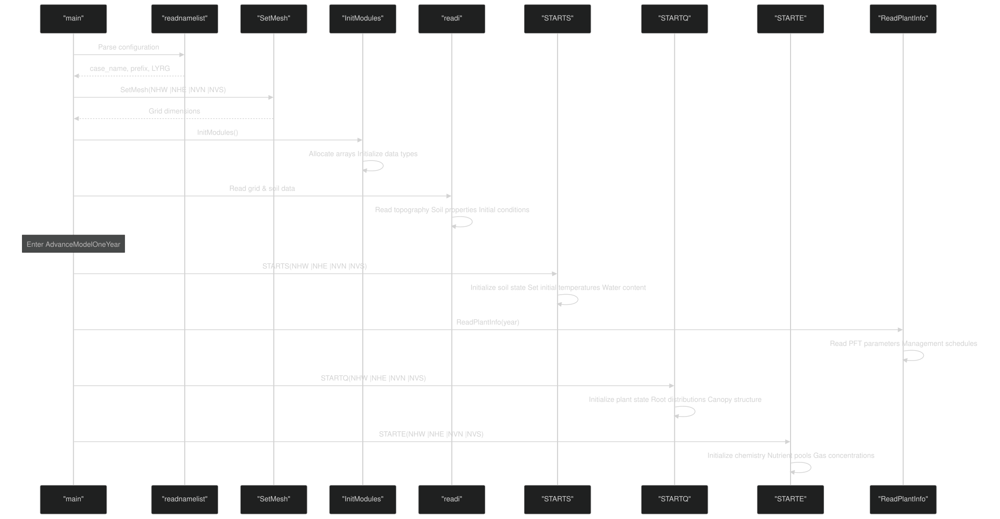

# Core Components and Execution Flow

Relevant source files

- [drivers/ecosim/EcoSIMAPI.F90](https://github.com/jingtao-lbl/EcoSIM/blob/7b8a4cf6/drivers/ecosim/EcoSIMAPI.F90)
- [drivers/ecosim/ecosim.F90](https://github.com/jingtao-lbl/EcoSIM/blob/7b8a4cf6/drivers/ecosim/ecosim.F90)
- [f90src/APIData/CMakeLists.txt](https://github.com/jingtao-lbl/EcoSIM/blob/7b8a4cf6/f90src/APIData/CMakeLists.txt)
- [f90src/APIs/CMakeLists.txt](https://github.com/jingtao-lbl/EcoSIM/blob/7b8a4cf6/f90src/APIs/CMakeLists.txt)
- [f90src/CMakeLists.txt](https://github.com/jingtao-lbl/EcoSIM/blob/7b8a4cf6/f90src/CMakeLists.txt)

## Purpose and Scope

This page documents the core execution architecture of EcoSIM, including the main driver program, initialization sequence, and timestep orchestration. It describes how the simulation progresses from program start through nested temporal loops (yearly, daily, hourly) and the sequence of process model calls within each timestep.

For information about ATS coupling and external integration, see [ATS Integration](#3.2) . For details on CMake build structure and library dependencies, see [Module Organization](#3.3) . For individual process models called during execution, see [Biogeochemical Process Models](#4) and [Physical Processes and Transport](#5) .

## Main Program Structure

The EcoSIM executable begins at `main` in [drivers/ecosim/ecosim.F90 1-157](https://github.com/jingtao-lbl/EcoSIM/blob/7b8a4cf6/drivers/ecosim/ecosim.F90#L1-L157) which serves as the top-level entry point. This program orchestrates the complete simulation workflow from configuration reading through final output.

Sources:  [drivers/ecosim/ecosim.F90 1-157](https://github.com/jingtao-lbl/EcoSIM/blob/7b8a4cf6/drivers/ecosim/ecosim.F90#L1-L157)

### Key Variables and Grid Dimensions

The simulation domain is defined by four boundary indices passed throughout the execution stack:

| Variable | Description | 
| --- | --- |
| NHW | Western horizontal boundary index | 
| NHE | Eastern horizontal boundary index | 
| NVN | Northern vertical boundary index | 
| NVS | Southern vertical boundary index | 

These define the active simulation domain and are initialized by `SetMesh`  [drivers/ecosim/ecosim.F90 86](https://github.com/jingtao-lbl/EcoSIM/blob/7b8a4cf6/drivers/ecosim/ecosim.F90#L86-L86) and passed to all major subroutines.

Sources:  [drivers/ecosim/ecosim.F90 31-35](https://github.com/jingtao-lbl/EcoSIM/blob/7b8a4cf6/drivers/ecosim/ecosim.F90#L31-L35)  [drivers/ecosim/EcoSIMAPI.F90 348-349](https://github.com/jingtao-lbl/EcoSIM/blob/7b8a4cf6/drivers/ecosim/EcoSIMAPI.F90#L348-L349)

## EcoSIMAPI Module

The `EcoSIMAPI` module [drivers/ecosim/EcoSIMAPI.F90](https://github.com/jingtao-lbl/EcoSIM/blob/7b8a4cf6/drivers/ecosim/EcoSIMAPI.F90) provides the core execution interface with three main public subroutines:

### readnamelist

Parses configuration from namelist buffer [drivers/ecosim/EcoSIMAPI.F90 126-318](https://github.com/jingtao-lbl/EcoSIM/blob/7b8a4cf6/drivers/ecosim/EcoSIMAPI.F90#L126-L318) This subroutine processes multiple namelists:

- `ecosim`- Core simulation parameters (model switches, file paths, timestep subcycling)
- `bbgcforc`- BGC forcing writer configuration
- `FixClimForc`- Fixed climate forcing for sensitivity tests

Key configuration variables set:

- `plant_model``microbial_model``soichem_model`, , - Process model switches
- `NPXS``NPYS`, - Subcycling parameters for numerical stability
- `NCYC_LITR``NCYC_SNOW`, - Litter and snow cycling frequencies
- `grid_file_in``pft_file_in``clm_hour_file_in`, , - Input file paths

Sources:  [drivers/ecosim/EcoSIMAPI.F90 126-318](https://github.com/jingtao-lbl/EcoSIM/blob/7b8a4cf6/drivers/ecosim/EcoSIMAPI.F90#L126-L318)

### AdvanceModelOneYear

Main annual simulation loop [drivers/ecosim/EcoSIMAPI.F90 321-488](https://github.com/jingtao-lbl/EcoSIM/blob/7b8a4cf6/drivers/ecosim/EcoSIMAPI.F90#L321-L488) This subroutine executes one year of simulation, containing nested daily and hourly loops.

Sources:  [drivers/ecosim/EcoSIMAPI.F90 321-488](https://github.com/jingtao-lbl/EcoSIM/blob/7b8a4cf6/drivers/ecosim/EcoSIMAPI.F90#L321-L488)

### Run_EcoSIM_one_step

Executes one hourly timestep [drivers/ecosim/EcoSIMAPI.F90 32-124](https://github.com/jingtao-lbl/EcoSIM/blob/7b8a4cf6/drivers/ecosim/EcoSIMAPI.F90#L32-L124) This is the core orchestration routine that calls all process models in sequence.

Sources:  [drivers/ecosim/EcoSIMAPI.F90 32-124](https://github.com/jingtao-lbl/EcoSIM/blob/7b8a4cf6/drivers/ecosim/EcoSIMAPI.F90#L32-L124)

## Initialization Sequence

Initialization occurs in multiple phases before entering the simulation loop:

Sources:  [drivers/ecosim/ecosim.F90 70-114](https://github.com/jingtao-lbl/EcoSIM/blob/7b8a4cf6/drivers/ecosim/ecosim.F90#L70-L114)  [drivers/ecosim/EcoSIMAPI.F90 366-405](https://github.com/jingtao-lbl/EcoSIM/blob/7b8a4cf6/drivers/ecosim/EcoSIMAPI.F90#L366-L405)

### First-Year Initialization Logic

The initialization is year-aware, checking `ymdhs==frectyp%ymdhs0` (current timestamp matches simulation start) to determine when to initialize state variables [drivers/ecosim/EcoSIMAPI.F90 377-405](https://github.com/jingtao-lbl/EcoSIM/blob/7b8a4cf6/drivers/ecosim/EcoSIMAPI.F90#L377-L405) :

- `STARTS`[drivers/ecosim/EcoSIMAPI.F90378-383](https://github.com/jingtao-lbl/EcoSIM/blob/7b8a4cf6/drivers/ecosim/EcoSIMAPI.F90#L378-L383)- Always called on first year
- `ReadPlantInfo`[drivers/ecosim/EcoSIMAPI.F90385-390](https://github.com/jingtao-lbl/EcoSIM/blob/7b8a4cf6/drivers/ecosim/EcoSIMAPI.F90#L385-L390)- Called every year, but active flags restored from checkpoint
- `STARTQ``plant_model=.true.`[drivers/ecosim/EcoSIMAPI.F90394-397](https://github.com/jingtao-lbl/EcoSIM/blob/7b8a4cf6/drivers/ecosim/EcoSIMAPI.F90#L394-L397)- Called only first year if
- `STARTE``soichem_model=.true.`[drivers/ecosim/EcoSIMAPI.F90398-405](https://github.com/jingtao-lbl/EcoSIM/blob/7b8a4cf6/drivers/ecosim/EcoSIMAPI.F90#L398-L405)- Called first year if

Sources:  [drivers/ecosim/EcoSIMAPI.F90 377-405](https://github.com/jingtao-lbl/EcoSIM/blob/7b8a4cf6/drivers/ecosim/EcoSIMAPI.F90#L377-L405)

## Nested Temporal Loop Structure

EcoSIM uses a three-level nested loop structure to advance the simulation through time:

Sources:  [drivers/ecosim/ecosim.F90 123-150](https://github.com/jingtao-lbl/EcoSIM/blob/7b8a4cf6/drivers/ecosim/ecosim.F90#L123-L150)  [drivers/ecosim/EcoSIMAPI.F90 413-485](https://github.com/jingtao-lbl/EcoSIM/blob/7b8a4cf6/drivers/ecosim/EcoSIMAPI.F90#L413-L485)

### Multi-Period Forcing Configuration

The `forc_periods` array configures transient simulations with multiple forcing periods [drivers/ecosim/EcoSIMAPI.F90 206-207](https://github.com/jingtao-lbl/EcoSIM/blob/7b8a4cf6/drivers/ecosim/EcoSIMAPI.F90#L206-L207) :

This represents:

- Period 1: Years 1980-1980, cycle 1 time
- Period 2: Years 1981-1988, cycle 2 times
- Period 3: Years 1989-2008, cycle 1 time

The outer loop [drivers/ecosim/ecosim.F90 123-150](https://github.com/jingtao-lbl/EcoSIM/blob/7b8a4cf6/drivers/ecosim/ecosim.F90#L123-L150) iterates over periods, allowing different climate forcing patterns and solver subcycling parameters for different simulation phases.

Sources:  [drivers/ecosim/ecosim.F90 123-150](https://github.com/jingtao-lbl/EcoSIM/blob/7b8a4cf6/drivers/ecosim/ecosim.F90#L123-L150)  [drivers/ecosim/EcoSIMAPI.F90 206-207](https://github.com/jingtao-lbl/EcoSIM/blob/7b8a4cf6/drivers/ecosim/EcoSIMAPI.F90#L206-L207)

## Hourly Timestep Execution: Run_EcoSIM_one_step

The core orchestration routine [drivers/ecosim/EcoSIMAPI.F90 32-124](https://github.com/jingtao-lbl/EcoSIM/blob/7b8a4cf6/drivers/ecosim/EcoSIMAPI.F90#L32-L124) calls process models in a specific sequence each hour:

Sources:  [drivers/ecosim/EcoSIMAPI.F90 32-124](https://github.com/jingtao-lbl/EcoSIM/blob/7b8a4cf6/drivers/ecosim/EcoSIMAPI.F90#L32-L124)

### Process Model Call Sequence

Each process model is called with grid dimensions and modifies global state arrays. The sequence is:

| Order | Function | Module | Purpose | Conditional | Lines | 
| --- | --- | --- | --- | --- | --- |
| 1 | HOUR1 | Hour1Mod | Surface energy balance initialization | Always | 42 | 
| 2 | WATSUB | WatsubMod | Soil water and heat flux calculations | Always | 51 | 
| 3 | MicrobeModel | MicBGCAPI | Microbial decomposition and respiration | microbial_model | 59 | 
| 4 | PlantModel | PlantMod | Plant growth, photosynthesis, uptake | plant_model | 69 | 
| 5 | soluteModel | GeochemAPI | Chemical equilibria and reactions | soichem_model | 79 | 
| 6 | TranspNoSalt | TranspNoSaltMod | Gas and standard solute transport | Always | 88 | 
| 7 | TranspSalt | TranspSaltMod | Salt-specific transport | salt_model | 98 | 
| 8 | EROSION | ErosionMod | Soil sediment transport | Always | 108 | 
| 9 | REDIST | RedistMod | State variable redistribution | Always | 116 | 
| 10 | DiagSoilGasPressure | SoilDiagsMod | Diagnostic gas pressure | Always | 120 | 
| 11 | EndCheckBalances | BalancesMod | Mass conservation verification | Always | 122 | 

Sources:  [drivers/ecosim/EcoSIMAPI.F90 38-122](https://github.com/jingtao-lbl/EcoSIM/blob/7b8a4cf6/drivers/ecosim/EcoSIMAPI.F90#L38-L122)

### Process Model Switches

The boolean flags controlling process execution are read from namelist [drivers/ecosim/EcoSIMAPI.F90 193-195](https://github.com/jingtao-lbl/EcoSIM/blob/7b8a4cf6/drivers/ecosim/EcoSIMAPI.F90#L193-L195) :

- `plant_model``.true.`- Enables plant biogeochemistry (default: )
- `microbial_model``.true.`- Enables microbial decomposition (default: )
- `soichem_model``.true.`- Enables soil chemistry (default: )
- `salt_model``.false.`- Enables salt transport (default: )

Additionally, `ldo_sp_mode` (prescribed phenology mode) overrides these settings [drivers/ecosim/EcoSIMAPI.F90 285-290](https://github.com/jingtao-lbl/EcoSIM/blob/7b8a4cf6/drivers/ecosim/EcoSIMAPI.F90#L285-L290) :

Sources:  [drivers/ecosim/EcoSIMAPI.F90 193-195](https://github.com/jingtao-lbl/EcoSIM/blob/7b8a4cf6/drivers/ecosim/EcoSIMAPI.F90#L193-L195)  [drivers/ecosim/EcoSIMAPI.F90 285-290](https://github.com/jingtao-lbl/EcoSIM/blob/7b8a4cf6/drivers/ecosim/EcoSIMAPI.F90#L285-L290)

### Timing Instrumentation

When `do_timing=.true.`  [drivers/ecosim/EcoSIMAPI.F90 29](https://github.com/jingtao-lbl/EcoSIM/blob/7b8a4cf6/drivers/ecosim/EcoSIMAPI.F90#L29-L29) the code instruments each process model call with timing measurements [drivers/ecosim/EcoSIMAPI.F90 39-117](https://github.com/jingtao-lbl/EcoSIM/blob/7b8a4cf6/drivers/ecosim/EcoSIMAPI.F90#L39-L117) :

This generates performance profiles for identifying computational bottlenecks.

Sources:  [drivers/ecosim/EcoSIMAPI.F90 29](https://github.com/jingtao-lbl/EcoSIM/blob/7b8a4cf6/drivers/ecosim/EcoSIMAPI.F90#L29-L29)  [drivers/ecosim/EcoSIMAPI.F90 39-117](https://github.com/jingtao-lbl/EcoSIM/blob/7b8a4cf6/drivers/ecosim/EcoSIMAPI.F90#L39-L117)

## Mass Balance and State Update

After all process models execute, two critical steps ensure simulation integrity:

### REDIST: State Redistribution

`REDIST`  [drivers/ecosim/EcoSIMAPI.F90 116](https://github.com/jingtao-lbl/EcoSIM/blob/7b8a4cf6/drivers/ecosim/EcoSIMAPI.F90#L116-L116) updates all soil state variables to reflect fluxes calculated during the timestep. This includes:

- Water content changes from infiltration, drainage, evapotranspiration
- Heat content changes from energy fluxes
- Gas concentrations from production, consumption, transport
- Solute concentrations from uptake, mineralization, transport
- Sediment redistribution from erosion

Sources:  [drivers/ecosim/EcoSIMAPI.F90 114-116](https://github.com/jingtao-lbl/EcoSIM/blob/7b8a4cf6/drivers/ecosim/EcoSIMAPI.F90#L114-L116)

### EndCheckBalances: Mass Conservation

`EndCheckBalances`  [drivers/ecosim/EcoSIMAPI.F90 122](https://github.com/jingtao-lbl/EcoSIM/blob/7b8a4cf6/drivers/ecosim/EcoSIMAPI.F90#L122-L122) verifies mass conservation for all tracked elements (C, N, P, water, energy). If conservation errors exceed tolerance, the simulation aborts with diagnostic information.

Corresponding `BegCheckBalances` is called earlier in the simulation loop to establish the starting state for balance verification.

Sources:  [drivers/ecosim/EcoSIMAPI.F90 122](https://github.com/jingtao-lbl/EcoSIM/blob/7b8a4cf6/drivers/ecosim/EcoSIMAPI.F90#L122-L122)

## Module Dependency and Build Structure

The core execution components are organized into CMake library targets:

Sources:  [f90src/CMakeLists.txt 1-33](https://github.com/jingtao-lbl/EcoSIM/blob/7b8a4cf6/f90src/CMakeLists.txt#L1-L33)  [f90src/APIs/CMakeLists.txt 1-44](https://github.com/jingtao-lbl/EcoSIM/blob/7b8a4cf6/f90src/APIs/CMakeLists.txt#L1-L44)  [f90src/APIData/CMakeLists.txt 1-27](https://github.com/jingtao-lbl/EcoSIM/blob/7b8a4cf6/f90src/APIData/CMakeLists.txt#L1-L27)

### Key Library Organization

The build system [f90src/CMakeLists.txt 1-33](https://github.com/jingtao-lbl/EcoSIM/blob/7b8a4cf6/f90src/CMakeLists.txt#L1-L33) organizes code into hierarchical subdirectories:

Foundation Layers:

- `Utils`- Utility functions, file I/O, error handling
- `Minimath`- Mathematical functions
- `Modelconfig`- Global configuration and constants
- `Mesh`- Grid definition and spatial structure

Data Structures:

- `Ecosim_datatype`- Type definitions for state/flux variables
- `APIData`- Interface data structures for API calls

Process Models:

- `Plant_bgc`- Plant biogeochemical processes
- `Microbial_bgc`- Microbial decomposition models
- `Geochem`- Geochemical equilibria
- `HydroTherm`- Hydrothermal physics

Orchestration:

- `APIs`- High-level interfaces to process models
- `Ecosim_mods`- Core execution modules (HOUR1, DAY, REDIST)
- `Main`- Driver code (EcoSIMAPI)

Support:

- `Transport`- Gas and solute transport
- `Balances`- Mass conservation checking
- `IOutils`- Input/output management

Sources:  [f90src/CMakeLists.txt 1-33](https://github.com/jingtao-lbl/EcoSIM/blob/7b8a4cf6/f90src/CMakeLists.txt#L1-L33)

### APIs Library Target

The `APIs` library [f90src/APIs/CMakeLists.txt 1-44](https://github.com/jingtao-lbl/EcoSIM/blob/7b8a4cf6/f90src/APIs/CMakeLists.txt#L1-L44) provides the primary interfaces to biogeochemical process models:

Source files:

- `PlantAPI.F90`- Plant model interface
- `PlantCanAPI.F90`- Canopy-level plant processes
- `PlantMod.F90`- Plant model orchestration
- `MicBGCAPI.F90`- Microbial biogeochemistry interface
- `PlantAPI4Uptake.F90`- Root nutrient uptake interface
- `GeochemAPI.F90`- Geochemistry interface
- `SurfPhysAPI.F90`- Surface physics interface

This library depends on all major component libraries [f90src/APIs/CMakeLists.txt 14-33](https://github.com/jingtao-lbl/EcoSIM/blob/7b8a4cf6/f90src/APIs/CMakeLists.txt#L14-L33) and is linked into the final executable.

Sources:  [f90src/APIs/CMakeLists.txt 1-44](https://github.com/jingtao-lbl/EcoSIM/blob/7b8a4cf6/f90src/APIs/CMakeLists.txt#L1-L44)

## Configuration and Restart

### Checkpoint/Restart System

EcoSIM supports restarting simulations from saved state:

The restart system ensures exact reproducibility of simulations regardless of how they are subdivided.

Sources:  [drivers/ecosim/ecosim.F90 105-112](https://github.com/jingtao-lbl/EcoSIM/blob/7b8a4cf6/drivers/ecosim/ecosim.F90#L105-L112)  [drivers/ecosim/EcoSIMAPI.F90 434-439](https://github.com/jingtao-lbl/EcoSIM/blob/7b8a4cf6/drivers/ecosim/EcoSIMAPI.F90#L434-L439)  [drivers/ecosim/EcoSIMAPI.F90 465-472](https://github.com/jingtao-lbl/EcoSIM/blob/7b8a4cf6/drivers/ecosim/EcoSIMAPI.F90#L465-L472)

### Regression Testing Integration

The `regressiontest` subroutine [drivers/ecosim/EcoSIMAPI.F90 491-561](https://github.com/jingtao-lbl/EcoSIM/blob/7b8a4cf6/drivers/ecosim/EcoSIMAPI.F90#L491-L561) provides automated validation:

This integrates with the test infrastructure documented in [Regression Test Suite](#7.1) .

Sources:  [drivers/ecosim/EcoSIMAPI.F90 420](https://github.com/jingtao-lbl/EcoSIM/blob/7b8a4cf6/drivers/ecosim/EcoSIMAPI.F90#L420-L420)  [drivers/ecosim/EcoSIMAPI.F90 491-561](https://github.com/jingtao-lbl/EcoSIM/blob/7b8a4cf6/drivers/ecosim/EcoSIMAPI.F90#L491-L561)