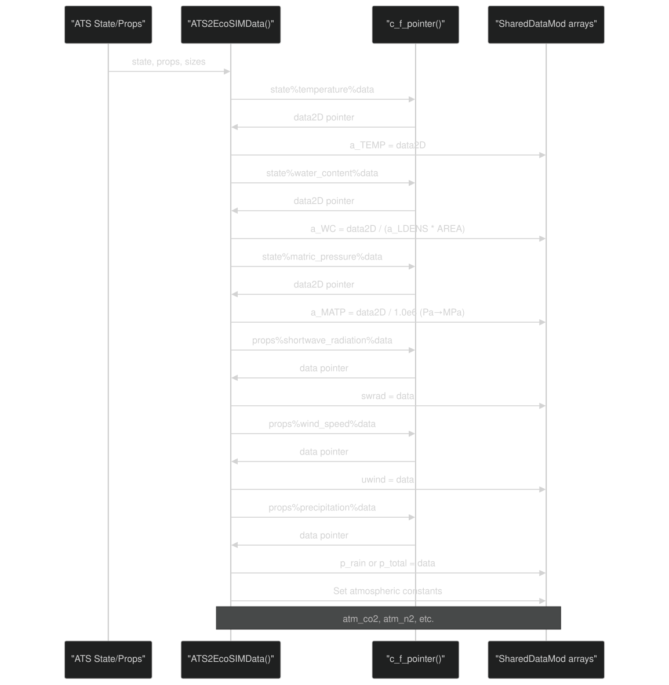
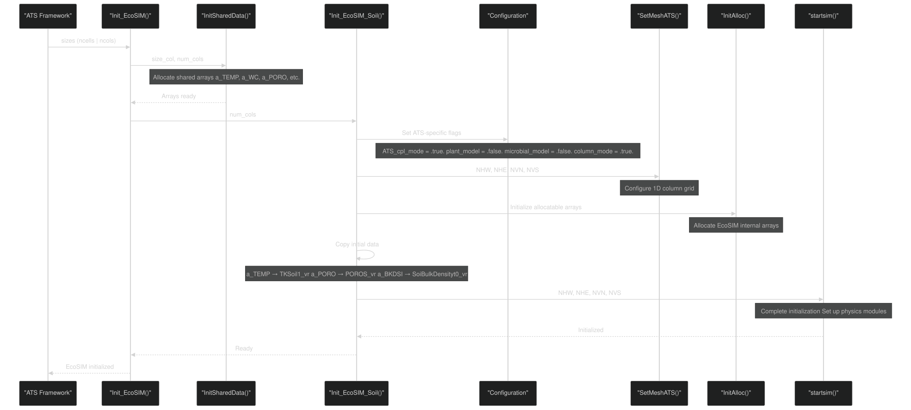

# ATS Integration

Relevant source files

- [drivers/ATSEcoSIM/ATSEcoSIM_test.F90](https://github.com/jingtao-lbl/EcoSIM/blob/7b8a4cf6/drivers/ATSEcoSIM/ATSEcoSIM_test.F90)
- [drivers/ATSEcoSIM/CMakeLists.txt](https://github.com/jingtao-lbl/EcoSIM/blob/7b8a4cf6/drivers/ATSEcoSIM/CMakeLists.txt)
- [f90src/ATSUtils/ATSCPLMod.F90](https://github.com/jingtao-lbl/EcoSIM/blob/7b8a4cf6/f90src/ATSUtils/ATSCPLMod.F90)
- [f90src/ATSUtils/ATSEcoSIMAdvanceMod.F90](https://github.com/jingtao-lbl/EcoSIM/blob/7b8a4cf6/f90src/ATSUtils/ATSEcoSIMAdvanceMod.F90)
- [f90src/ATSUtils/ATSEcoSIMInitMod.F90](https://github.com/jingtao-lbl/EcoSIM/blob/7b8a4cf6/f90src/ATSUtils/ATSEcoSIMInitMod.F90)
- [f90src/ATSUtils/BGC_containers.F90](https://github.com/jingtao-lbl/EcoSIM/blob/7b8a4cf6/f90src/ATSUtils/BGC_containers.F90)
- [f90src/ATSUtils/CMakeLists.txt](https://github.com/jingtao-lbl/EcoSIM/blob/7b8a4cf6/f90src/ATSUtils/CMakeLists.txt)
- [f90src/ATSUtils/SharedDataMod.F90](https://github.com/jingtao-lbl/EcoSIM/blob/7b8a4cf6/f90src/ATSUtils/SharedDataMod.F90)
- [f90src/ATSUtils/c_f_interface_module.F90](https://github.com/jingtao-lbl/EcoSIM/blob/7b8a4cf6/f90src/ATSUtils/c_f_interface_module.F90)

## Purpose and Scope

This document describes the coupling layer that enables EcoSIM to operate as a biogeochemical component within the Advanced Terrestrial Simulator (ATS) framework. The ATS integration system provides bidirectional data exchange, unit conversions, and subcycling capabilities to synchronize EcoSIM's biogeochemical processes with ATS's hydrological and thermal simulations.

For information about standalone EcoSIM execution, see [Running Simulations](#2.3) . For details on the core execution flow when not coupled with ATS, see [Core Components and Execution Flow](#3.1) .

## Architecture Overview

The ATS coupling architecture consists of three primary layers: the C-compatible data container layer, the data transfer layer, and the execution control layer. These layers enable seamless integration between ATS (written in C++) and EcoSIM (written in Fortran).

ATS Integration Architecture : Data flows from ATS through C-compatible containers into Fortran shared arrays, through EcoSIM physics modules (with subcycling), and back to ATS.

Sources: [f90src/ATSUtils/ATSCPLMod.F90 1-312](https://github.com/jingtao-lbl/EcoSIM/blob/7b8a4cf6/f90src/ATSUtils/ATSCPLMod.F90#L1-L312)  [f90src/ATSUtils/ATSEcoSIMAdvanceMod.F90 1-250](https://github.com/jingtao-lbl/EcoSIM/blob/7b8a4cf6/f90src/ATSUtils/ATSEcoSIMAdvanceMod.F90#L1-L250)  [f90src/ATSUtils/SharedDataMod.F90 1-204](https://github.com/jingtao-lbl/EcoSIM/blob/7b8a4cf6/f90src/ATSUtils/SharedDataMod.F90#L1-L204)

## C-Compatible Data Containers

The coupling layer uses specialized data structures defined in `BGC_containers.F90` that are compatible with both C++ and Fortran through the `iso_c_binding` interface. These containers enable safe memory sharing between ATS and EcoSIM.

### Core Container Types

| Type | Purpose | Members | 
| --- | --- | --- |
| BGCSizes | Grid dimensions | ncells_per_col_, num_components, num_columns | 
| BGCState | Time-varying state variables | temperature, water_content, matric_pressure, porosity, subsurface_water_source, surface_water_source, etc. | 
| BGCProperties | Static or slowly-varying properties | shortwave_radiation, air_temperature, wind_speed, precipitation, depth, dz, volume, atmospheric gas concentrations | 
| BGCVectorDouble | 1D array container | size, capacity, data (c_ptr) | 
| BGCMatrixDouble | 2D array container | rows, cols, data (c_ptr) | 
| BGCTensorDouble | 3D array container | rows, cols, procs, data (c_ptr) | 

BGC Container Type Hierarchy : C-compatible structures for data exchange between ATS and EcoSIM.

Sources: [f90src/ATSUtils/BGC_containers.F90 53-208](https://github.com/jingtao-lbl/EcoSIM/blob/7b8a4cf6/f90src/ATSUtils/BGC_containers.F90#L53-L208)

### Container Design Principles

The container structures follow strict design rules documented in [f90src/ATSUtils/BGC_containers.F90 36-50](https://github.com/jingtao-lbl/EcoSIM/blob/7b8a4cf6/f90src/ATSUtils/BGC_containers.F90#L36-L50) :

Sources: [f90src/ATSUtils/BGC_containers.F90 30-208](https://github.com/jingtao-lbl/EcoSIM/blob/7b8a4cf6/f90src/ATSUtils/BGC_containers.F90#L30-L208)

## Data Transfer Layer

Data transfer between ATS and EcoSIM occurs through two primary subroutines in `ATSCPLMod.F90` : `ATS2EcoSIMData` and `EcoSIM2ATSData` . These routines handle pointer dereferencing, array copying, and unit conversions.

### ATS to EcoSIM Transfer

The `ATS2EcoSIMData` subroutine transfers data from ATS state and property containers to EcoSIM's shared data arrays. This involves extracting data from C pointers and populating Fortran allocatable arrays.

ATS to EcoSIM Data Flow : Extracting data from C pointers and converting units.

Key conversions performed during transfer:

| Variable | ATS Units | EcoSIM Units | Conversion | Location | 
| --- | --- | --- | --- | --- |
| matric_pressure | Pa | MPa | ÷ 1.0e6 | f90src/ATSUtils/ATSCPLMod.F90105-107 | 
| bulk_density | kg/m³ | Mg/m³ | ÷ 1.0e3 | f90src/ATSUtils/ATSEcoSIMAdvanceMod.F90127 | 
| water_content | mols | mH₂O | ÷ (liquid_density × area) | f90src/ATSUtils/ATSCPLMod.F9081-83 | 
| vapor_pressure | Pa | MPa or kPa | ÷ 1.0e6 or ÷ 1.0e3 | f90src/ATSUtils/ATSCPLMod.F90146-147 | 
| wind_speed | m/s | m/h | × 3600 | f90src/ATSUtils/ATSCPLMod.F90149-150 | 
| radiation | W/m² | MJ/m²/h | × 0.0036 (implicit) | f90src/ATSUtils/ATSEcoSIMAdvanceMod.F90115-122 | 
| precipitation | m/s | m/h | × 3600 | f90src/ATSUtils/ATSEcoSIMAdvanceMod.F90164-172 | 

The subroutine handles multiple data types:

2D Subsurface Fields (layers × columns):

1D Surface Fields (columns only):

Scalar Constants :

Sources: [f90src/ATSUtils/ATSCPLMod.F90 29-210](https://github.com/jingtao-lbl/EcoSIM/blob/7b8a4cf6/f90src/ATSUtils/ATSCPLMod.F90#L29-L210)  [f90src/ATSUtils/ATSEcoSIMAdvanceMod.F90 92-182](https://github.com/jingtao-lbl/EcoSIM/blob/7b8a4cf6/f90src/ATSUtils/ATSEcoSIMAdvanceMod.F90#L92-L182)

### EcoSIM to ATS Transfer

The `EcoSIM2ATSData` subroutine transfers computed fluxes back to ATS after EcoSIM has advanced its timestep. This primarily involves surface and subsurface source/sink terms.

EcoSIM to ATS Data Flow : Transferring computed fluxes back to ATS.

The implementation uses `c_f_pointer` to write directly to ATS memory:

Sources: [f90src/ATSUtils/ATSCPLMod.F90 213-245](https://github.com/jingtao-lbl/EcoSIM/blob/7b8a4cf6/f90src/ATSUtils/ATSCPLMod.F90#L213-L245)

## Initialization Sequence

EcoSIM initialization for ATS coupling follows a two-stage process: first initializing the shared data structures, then initializing the EcoSIM soil model with ATS-specific configurations.

Initialization Sequence : Two-stage initialization process for ATS coupling.

### Configuration Flags

When operating in ATS coupling mode, specific configuration flags are set in [f90src/ATSUtils/ATSEcoSIMInitMod.F90 45-53](https://github.com/jingtao-lbl/EcoSIM/blob/7b8a4cf6/f90src/ATSUtils/ATSEcoSIMInitMod.F90#L45-L53) :

These flags disable certain EcoSIM features that are either incompatible with ATS coupling or redundant with ATS functionality.

### Grid Configuration

The grid is configured as 1D columns through `SetMeshATS()` with specific boundary conditions:

Sources: [f90src/ATSUtils/ATSCPLMod.F90 263-276](https://github.com/jingtao-lbl/EcoSIM/blob/7b8a4cf6/f90src/ATSUtils/ATSCPLMod.F90#L263-L276)  [f90src/ATSUtils/ATSEcoSIMInitMod.F90 26-136](https://github.com/jingtao-lbl/EcoSIM/blob/7b8a4cf6/f90src/ATSUtils/ATSEcoSIMInitMod.F90#L26-L136)  [f90src/ATSUtils/SharedDataMod.F90 74-164](https://github.com/jingtao-lbl/EcoSIM/blob/7b8a4cf6/f90src/ATSUtils/SharedDataMod.F90#L74-L164)

## Subcycling and Time Integration

EcoSIM uses a subcycling strategy when coupled with ATS, running multiple internal timesteps ( `NPH` ) per ATS timestep. This is necessary because EcoSIM's surface energy balance requires a finer temporal resolution than ATS's subsurface flow timestep.

Subcycling Strategy : Multiple EcoSIM timesteps per ATS timestep with flux accumulation.

### Subcycling Implementation

The subcycling loop is implemented in `RunEcoSIMSurfaceBalance()`  [f90src/ATSUtils/ATSEcoSIMAdvanceMod.F90 204-219](https://github.com/jingtao-lbl/EcoSIM/blob/7b8a4cf6/f90src/ATSUtils/ATSEcoSIMAdvanceMod.F90#L204-L219) :

### Flux Conversion

After subcycling completes, accumulated fluxes are converted from EcoSIM units (per timestep) to ATS units (per second) [f90src/ATSUtils/ATSEcoSIMAdvanceMod.F90 227-235](https://github.com/jingtao-lbl/EcoSIM/blob/7b8a4cf6/f90src/ATSUtils/ATSEcoSIMAdvanceMod.F90#L227-L235) :

The number of subcycles ( `NPH` ) is set by `set_ecosim_solver()` and typically ranges from 10-30 depending on numerical stability requirements.

Sources: [f90src/ATSUtils/ATSEcoSIMAdvanceMod.F90 47-248](https://github.com/jingtao-lbl/EcoSIM/blob/7b8a4cf6/f90src/ATSUtils/ATSEcoSIMAdvanceMod.F90#L47-L248)  [f90src/ATSUtils/ATSCPLMod.F90 249-260](https://github.com/jingtao-lbl/EcoSIM/blob/7b8a4cf6/f90src/ATSUtils/ATSCPLMod.F90#L249-L260)  [f90src/ATSUtils/ATSCPLMod.F90 279-292](https://github.com/jingtao-lbl/EcoSIM/blob/7b8a4cf6/f90src/ATSUtils/ATSCPLMod.F90#L279-L292)

## Key Modules and Functions

This section provides a detailed mapping between system concepts and code entities to facilitate navigation of the ATS coupling implementation.

### Module Hierarchy

Module Dependency Graph : Relationships between ATS coupling modules.

### Primary Functions and Their Roles

| Function | Module | Purpose | Key Lines | 
| --- | --- | --- | --- |
| Init_EcoSIM | ATSCPLMod | Top-level initialization entry point | 263-276 | 
| Run_EcoSIM_one_step | ATSCPLMod | Execute one ATS timestep | 249-260 | 
| ATS2EcoSIMData | ATSCPLMod | Transfer data from ATS to EcoSIM | 29-210 | 
| EcoSIM2ATSData | ATSCPLMod | Transfer data from EcoSIM to ATS | 213-245 | 
| SurfaceEBalance | ATSCPLMod | Wrapper for surface balance calculation | 279-292 | 
| RunEcoSIMSurfaceBalance | ATSEcoSIMAdvanceMod | Main surface balance with subcycling | 47-248 | 
| Init_EcoSIM_Soil | ATSEcoSIMInitMod | Initialize soil properties and configuration | 26-136 | 
| InitSharedData | SharedDataMod | Allocate shared data arrays | 74-164 | 
| DestroySharedData | SharedDataMod | Deallocate shared data arrays | 168-201 | 

### Critical Variables in SharedDataMod

The `SharedDataMod` module defines allocatable arrays that serve as the bridge between ATS and EcoSIM. All arrays prefixed with `a_` represent data from ATS:

Subsurface State Variables (2D: layers × columns) :

- `a_TEMP(:,:)`- Soil temperature [K]
- `a_WC(:,:)`- Water content [mols or mH₂O]
- `a_MATP(:,:)`- Matric pressure [Pa or MPa]
- `a_PORO(:,:)`- Porosity [fraction]
- `a_BKDSI(:,:)`- Bulk density [kg/m³ or Mg/m³]
- `a_LDENS(:,:)`- Liquid density [mols]
- `a_CumDepz2LayBottom_vr(:,:)`- Depth to layer bottom [m]
- `a_dz(:,:)`- Layer thickness [m]
- `a_Volume(:,:)`- Layer volume [m³]
- `a_SSWS(:,:)`- Subsurface water source [varies]
- `a_SSES(:,:)`- Subsurface energy source [varies]

Surface/Atmospheric Variables (1D: columns) :

- `tairc(:)`- Air temperature [K or °C]
- `vpair(:)`- Vapor pressure [Pa or MPa]
- `uwind(:)`- Wind speed [m/s or m/h]
- `swrad(:)`- Shortwave radiation [W/m² or MJ/m²/h]
- `sunrad(:)`- Longwave radiation [W/m² or MJ/m²/h]
- `p_rain(:)`- Precipitation as rain [m/s or m/h]
- `p_snow(:)`- Precipitation as snow [m/s or m/h]
- `surf_w_source(:)`- Surface water source/sink [varies]
- `surf_e_source(:)`- Surface energy source/sink [varies]
- `surf_snow_depth(:)`- Snow depth [m]

Grid Indices (1D: columns) :

- `a_NU(:)`- Upper layer index (typically 1)
- `a_NL(:)`- Lower layer index (bottom layer)

Sources: [f90src/ATSUtils/SharedDataMod.F90 14-72](https://github.com/jingtao-lbl/EcoSIM/blob/7b8a4cf6/f90src/ATSUtils/SharedDataMod.F90#L14-L72)

## Usage Example

A working example of ATS-EcoSIM coupling is provided in the test driver [drivers/ATSEcoSIM/ATSEcoSIM_test.F90 1-154](https://github.com/jingtao-lbl/EcoSIM/blob/7b8a4cf6/drivers/ATSEcoSIM/ATSEcoSIM_test.F90#L1-L154) The basic usage pattern is:

The test driver demonstrates initialization with prescribed values for soil properties, atmospheric forcing, and boundary conditions [drivers/ATSEcoSIM/ATSEcoSIM_test.F90 48-153](https://github.com/jingtao-lbl/EcoSIM/blob/7b8a4cf6/drivers/ATSEcoSIM/ATSEcoSIM_test.F90#L48-L153)

Sources: [drivers/ATSEcoSIM/ATSEcoSIM_test.F90 1-154](https://github.com/jingtao-lbl/EcoSIM/blob/7b8a4cf6/drivers/ATSEcoSIM/ATSEcoSIM_test.F90#L1-L154)

## Build Configuration

The ATS coupling modules are compiled as a separate library ( `ATSUtils_mods` ) in the build system. The CMake configuration [f90src/ATSUtils/CMakeLists.txt 1-38](https://github.com/jingtao-lbl/EcoSIM/blob/7b8a4cf6/f90src/ATSUtils/CMakeLists.txt#L1-L38) includes:

Source Files :

- `SharedDataMod.F90`- Shared data arrays
- `BGC_containers.F90`- C-compatible data structures
- `ATSCPLMod.F90`- Main coupling interface
- `ATSEcoSIMInitMod.F90`- Initialization routines
- `ATSEcoSIMAdvanceMod.F90`- Time-stepping routines
- `c_f_interface_module.F90`- C-Fortran string utilities

Include Dependencies : The library requires headers from multiple EcoSIM modules including Utils, Minimath, Modelconfig, Mesh, Modelpars, Balances, HydroTherm (PhysData, SoilPhys, SurfPhys, SnowPhys), and APIData.

Installation : The library is installed to `${CMAKE_BINARY_DIR}/lib` and optionally to the system installation prefix if enabled.

Sources: [f90src/ATSUtils/CMakeLists.txt 1-38](https://github.com/jingtao-lbl/EcoSIM/blob/7b8a4cf6/f90src/ATSUtils/CMakeLists.txt#L1-L38)  [drivers/ATSEcoSIM/CMakeLists.txt 1-29](https://github.com/jingtao-lbl/EcoSIM/blob/7b8a4cf6/drivers/ATSEcoSIM/CMakeLists.txt#L1-L29)

## Numerical Considerations

### Timestep Synchronization

ATS typically uses adaptive timestepping with variable timestep sizes ranging from seconds to hours. EcoSIM's surface energy balance requires smaller, fixed timesteps (typically 360-1800 seconds). The subcycling mechanism bridges this gap by:

The relationship is: `dt_ATS ≈ NPH × dts_HeatWatTP`

### Data Consistency

The coupling ensures thermodynamic consistency by:

- Using ATS's subsurface temperature and pressure directly (no iteration)
- Computing surface energy balance with EcoSIM's detailed physics
- Returning water and energy sources/sinks that ATS applies as boundary conditions
- Maintaining mass and energy conservation through explicit flux tracking

### NaN Detection

The code includes NaN detection for debugging [f90src/ATSUtils/ATSEcoSIMAdvanceMod.F90 36-45](https://github.com/jingtao-lbl/EcoSIM/blob/7b8a4cf6/f90src/ATSUtils/ATSEcoSIMAdvanceMod.F90#L36-L45) :

This is used to check for invalid values in critical flux variables [f90src/ATSUtils/ATSEcoSIMAdvanceMod.F90 222-241](https://github.com/jingtao-lbl/EcoSIM/blob/7b8a4cf6/f90src/ATSUtils/ATSEcoSIMAdvanceMod.F90#L222-L241)

Sources: [f90src/ATSUtils/ATSEcoSIMAdvanceMod.F90 36-248](https://github.com/jingtao-lbl/EcoSIM/blob/7b8a4cf6/f90src/ATSUtils/ATSEcoSIMAdvanceMod.F90#L36-L248)