# Module Organization

Relevant source files

- [3rd-partylibs/CMakeLists.txt](https://github.com/jingtao-lbl/EcoSIM/blob/7b8a4cf6/3rd-partylibs/CMakeLists.txt)
- [CMakeLists.txt](https://github.com/jingtao-lbl/EcoSIM/blob/7b8a4cf6/CMakeLists.txt)
- [cmake/Modules/add_ecosim_executable.cmake](https://github.com/jingtao-lbl/EcoSIM/blob/7b8a4cf6/cmake/Modules/add_ecosim_executable.cmake)
- [cmake/Modules/set_up_compilers.cmake](https://github.com/jingtao-lbl/EcoSIM/blob/7b8a4cf6/cmake/Modules/set_up_compilers.cmake)
- [cmake/Modules/set_up_platform.cmake](https://github.com/jingtao-lbl/EcoSIM/blob/7b8a4cf6/cmake/Modules/set_up_platform.cmake)
- [drivers/ecosim/CMakeLists.txt](https://github.com/jingtao-lbl/EcoSIM/blob/7b8a4cf6/drivers/ecosim/CMakeLists.txt)
- [drivers/tools/CMakeLists.txt](https://github.com/jingtao-lbl/EcoSIM/blob/7b8a4cf6/drivers/tools/CMakeLists.txt)
- [f90src/APIData/CMakeLists.txt](https://github.com/jingtao-lbl/EcoSIM/blob/7b8a4cf6/f90src/APIData/CMakeLists.txt)
- [f90src/APIs/CMakeLists.txt](https://github.com/jingtao-lbl/EcoSIM/blob/7b8a4cf6/f90src/APIs/CMakeLists.txt)
- [f90src/CMakeLists.txt](https://github.com/jingtao-lbl/EcoSIM/blob/7b8a4cf6/f90src/CMakeLists.txt)
- [tests/example_nl](https://github.com/jingtao-lbl/EcoSIM/blob/7b8a4cf6/tests/example_nl)

This page documents the CMake build structure, library organization, and module dependency relationships within the EcoSIM codebase. It describes how source files are organized into modular libraries, how these libraries depend on each other, and how the build system orchestrates compilation.

For information about build options and compiler selection, see [Building EcoSIM](#2.1) . For detailed CMake internals and cross-platform considerations, see [Build System Details](#8.3) .

## Purpose and Scope

The EcoSIM build system uses CMake to organize approximately 23 separate module libraries, each representing a functional component of the model. This modular organization enables:

- **Separation of concerns**: Each library encapsulates related functionality
- **Explicit dependency management**: Libraries declare their dependencies through CMake
- **Incremental compilation**: Changes to one module only rebuild dependent modules
- **Reusability**: Libraries can be linked into multiple executables (main simulator and utility tools)

This page focuses on the static structure of the build system—how modules are organized and connected. For the runtime execution flow, see [Core Components and Execution Flow](#3.1) .

## CMake Build Hierarchy

The build system follows a hierarchical structure with the root `CMakeLists.txt` delegating to subdirectories.

### Root Build Configuration

Sources : [CMakeLists.txt 1-258](https://github.com/jingtao-lbl/EcoSIM/blob/7b8a4cf6/CMakeLists.txt#L1-L258)  [cmake/Modules/set_up_platform.cmake 1-151](https://github.com/jingtao-lbl/EcoSIM/blob/7b8a4cf6/cmake/Modules/set_up_platform.cmake#L1-L151)  [cmake/Modules/set_up_compilers.cmake 1-101](https://github.com/jingtao-lbl/EcoSIM/blob/7b8a4cf6/cmake/Modules/set_up_compilers.cmake#L1-L101)

The root [CMakeLists.txt 3-79](https://github.com/jingtao-lbl/EcoSIM/blob/7b8a4cf6/CMakeLists.txt#L3-L79) performs these steps:

### ATS vs. Standalone Mode

The build system supports two modes:

| Mode | Variable | Third-Party Libraries | Notes | 
| --- | --- | --- | --- |
| Standalone | ATS_ECOSIM=OFF | Built from 3rd-partylibs/ | Default mode, self-contained | 
| ATS Integration | ATS_ECOSIM=ON | Uses $AMANZI_TPLS_DIR | Links against ATS-provided TPLs | 

[CMakeLists.txt 155-220](https://github.com/jingtao-lbl/EcoSIM/blob/7b8a4cf6/CMakeLists.txt#L155-L220) shows this conditional logic—when `ATS_ECOSIM` is set, paths like `TPL_INSTALL_PREFIX` are used instead of building libraries locally.

Sources : [CMakeLists.txt 155-220](https://github.com/jingtao-lbl/EcoSIM/blob/7b8a4cf6/CMakeLists.txt#L155-L220)  [cmake/Modules/set_up_platform.cmake 64-78](https://github.com/jingtao-lbl/EcoSIM/blob/7b8a4cf6/cmake/Modules/set_up_platform.cmake#L64-L78)

## Library Organization

All Fortran source code resides under `f90src/` , organized into 23 module subdirectories. Each subdirectory builds one static library.

### Module Directory Structure

Sources : [f90src/CMakeLists.txt 1-24](https://github.com/jingtao-lbl/EcoSIM/blob/7b8a4cf6/f90src/CMakeLists.txt#L1-L24)

[f90src/CMakeLists.txt 1-24](https://github.com/jingtao-lbl/EcoSIM/blob/7b8a4cf6/f90src/CMakeLists.txt#L1-L24) adds each subdirectory in dependency order (bottom-up). Each subdirectory's `CMakeLists.txt` follows a consistent pattern:

### Example: APIs Library

The [f90src/APIs/CMakeLists.txt 1-45](https://github.com/jingtao-lbl/EcoSIM/blob/7b8a4cf6/f90src/APIs/CMakeLists.txt#L1-L45) demonstrates this pattern:

The `add_ecosim_library()` function is not shown in the provided files, but based on usage patterns, it likely creates a static library target and configures common properties.

Sources : [f90src/APIs/CMakeLists.txt 1-45](https://github.com/jingtao-lbl/EcoSIM/blob/7b8a4cf6/f90src/APIs/CMakeLists.txt#L1-L45)

## Module Dependency Graph

Each library specifies its dependencies by listing include directories. The build system resolves these into a dependency graph.

### Core Dependency Layers

Sources : [f90src/APIs/CMakeLists.txt 14-33](https://github.com/jingtao-lbl/EcoSIM/blob/7b8a4cf6/f90src/APIs/CMakeLists.txt#L14-L33)  [drivers/ecosim/CMakeLists.txt 8-29](https://github.com/jingtao-lbl/EcoSIM/blob/7b8a4cf6/drivers/ecosim/CMakeLists.txt#L8-L29)

### Detailed Example: APIs Library Dependencies

The APIs library [f90src/APIs/CMakeLists.txt 14-33](https://github.com/jingtao-lbl/EcoSIM/blob/7b8a4cf6/f90src/APIs/CMakeLists.txt#L14-L33) includes 13 directories:

| Dependency | Purpose | 
| --- | --- |
| Utils/ | Error handling, string utilities | 
| Modelconfig/ | Configuration parameters | 
| Minimath/ | Mathematical utilities | 
| Mesh/ | Grid structure definitions | 
| DebugTools/ | Debugging and logging | 
| Modelpars/ | Model parameters | 
| Ecosim_datatype/ | Core data type definitions | 
| APIData/ | API-specific data containers | 
| Plant_bgc/ | Plant biogeochemistry routines | 
| Microbial_bgc/Box_Micmodel | Box-level microbial model | 
| Microbial_bgc/Layers_Micmodel | Layer-based microbial model | 
| HydroTherm/ | Hydro-thermal physics | 
| Disturbances/ | Disturbance event handling | 
| Ecosim_mods/ | Shared state modules | 
| Balances/ | Mass balance checking | 
| Transport/Nonsalt | Non-salt transport | 
| Transport/Salt | Salt transport | 
| Geochem/Box_chem | Box-level chemistry | 
| Geochem/Layers_chem | Layer-based chemistry | 

These include paths allow APIs to compile files like `PlantAPI.F90` that call routines from these modules.

Sources : [f90src/APIs/CMakeLists.txt 14-33](https://github.com/jingtao-lbl/EcoSIM/blob/7b8a4cf6/f90src/APIs/CMakeLists.txt#L14-L33)

## Build Targets

The build system produces multiple executables and libraries.

### Executable Targets

Sources : [drivers/ecosim/CMakeLists.txt 1-58](https://github.com/jingtao-lbl/EcoSIM/blob/7b8a4cf6/drivers/ecosim/CMakeLists.txt#L1-L58)  [drivers/tools/CMakeLists.txt 1-119](https://github.com/jingtao-lbl/EcoSIM/blob/7b8a4cf6/drivers/tools/CMakeLists.txt#L1-L119)

### Main Executable: ecosim.f90.x

[drivers/ecosim/CMakeLists.txt 1-7](https://github.com/jingtao-lbl/EcoSIM/blob/7b8a4cf6/drivers/ecosim/CMakeLists.txt#L1-L7) defines the main simulation executable:

The `add_ecosim_executable()` helper [cmake/Modules/add_ecosim_executable.cmake 1-10](https://github.com/jingtao-lbl/EcoSIM/blob/7b8a4cf6/cmake/Modules/add_ecosim_executable.cmake#L1-L10) links all module libraries:

Here, `ECOSIM_LIBRARIES` contains all 23 module libraries (accumulated via `PARENT_SCOPE` in each subdirectory), and `ECOSIM_TPLS` contains third-party libraries like `netcdff` , `netcdf` , `hdf5_hl` , `hdf5` , `z` .

Sources : [drivers/ecosim/CMakeLists.txt 1-7](https://github.com/jingtao-lbl/EcoSIM/blob/7b8a4cf6/drivers/ecosim/CMakeLists.txt#L1-L7)  [cmake/Modules/add_ecosim_executable.cmake 1-10](https://github.com/jingtao-lbl/EcoSIM/blob/7b8a4cf6/cmake/Modules/add_ecosim_executable.cmake#L1-L10)

### Utility Tools

[drivers/tools/CMakeLists.txt 15-24](https://github.com/jingtao-lbl/EcoSIM/blob/7b8a4cf6/drivers/tools/CMakeLists.txt#L15-L24) creates 9 utility executables, each linking against subsets of the module libraries. For example:

This tool only needs 6 of the 23 libraries, demonstrating modular reuse.

Sources : [drivers/tools/CMakeLists.txt 15-36](https://github.com/jingtao-lbl/EcoSIM/blob/7b8a4cf6/drivers/tools/CMakeLists.txt#L15-L36)

## Include Directory Management

Fortran module files ( `.mod` ) are generated during compilation and must be available when other modules compile. CMake manages this through `target_include_directories()` .

### Include Directory Pattern

Each library specifies include directories for the `.mod` files it depends on. The pattern is:

`CMAKE_BINARY_DIR` points to the build output directory (e.g., `build/` ), where each module subdirectory contains generated `.mod` files.

### Example: Main Executable Includes

[drivers/ecosim/CMakeLists.txt 8-29](https://github.com/jingtao-lbl/EcoSIM/blob/7b8a4cf6/drivers/ecosim/CMakeLists.txt#L8-L29) lists 20 include directories for `ecosim.f90.x` :

This allows `ecosim.F90` to use `USE` statements for modules from these directories.

Sources : [drivers/ecosim/CMakeLists.txt 8-29](https://github.com/jingtao-lbl/EcoSIM/blob/7b8a4cf6/drivers/ecosim/CMakeLists.txt#L8-L29)

## Third-Party Library Management

The `3rd-partylibs/` directory handles external dependencies when not using ATS TPLs.

### Third-Party Build Sequence

Sources : [3rd-partylibs/CMakeLists.txt 1-597](https://github.com/jingtao-lbl/EcoSIM/blob/7b8a4cf6/3rd-partylibs/CMakeLists.txt#L1-L597)

[3rd-partylibs/CMakeLists.txt 74-131](https://github.com/jingtao-lbl/EcoSIM/blob/7b8a4cf6/3rd-partylibs/CMakeLists.txt#L74-L131) builds zlib, [3rd-partylibs/CMakeLists.txt 237-305](https://github.com/jingtao-lbl/EcoSIM/blob/7b8a4cf6/3rd-partylibs/CMakeLists.txt#L237-L305) builds HDF5, [3rd-partylibs/CMakeLists.txt 340-434](https://github.com/jingtao-lbl/EcoSIM/blob/7b8a4cf6/3rd-partylibs/CMakeLists.txt#L340-L434) builds netcdf-c, and [3rd-partylibs/CMakeLists.txt 456-551](https://github.com/jingtao-lbl/EcoSIM/blob/7b8a4cf6/3rd-partylibs/CMakeLists.txt#L456-L551) builds netcdf-fortran. Each uses CMake's `execute_process()` to run `configure` and `make install` .

The built libraries are placed in `${PROJECT_BINARY_DIR}/lib/` and headers in `${PROJECT_BINARY_DIR}/include/` . The root CMakeLists.txt then links these into `ECOSIM_TPLS` for use by all targets.

### ATS Mode TPL Paths

When `ATS_ECOSIM=ON` , [CMakeLists.txt 162-214](https://github.com/jingtao-lbl/EcoSIM/blob/7b8a4cf6/CMakeLists.txt#L162-L214) sets TPL variables directly:

This assumes ATS has already built these libraries in `$AMANZI_TPLS_DIR` .

Sources : [CMakeLists.txt 162-214](https://github.com/jingtao-lbl/EcoSIM/blob/7b8a4cf6/CMakeLists.txt#L162-L214)  [3rd-partylibs/CMakeLists.txt 1-597](https://github.com/jingtao-lbl/EcoSIM/blob/7b8a4cf6/3rd-partylibs/CMakeLists.txt#L1-L597)

## Library Linking Order

The order in which libraries appear in `ECOSIM_LIBRARIES` matters for static linking. Libraries must be listed after their dependents.

### Link Order Resolution

[f90src/CMakeLists.txt 1-24](https://github.com/jingtao-lbl/EcoSIM/blob/7b8a4cf6/f90src/CMakeLists.txt#L1-L24) adds subdirectories in dependency order (bottom-up):

Each `add_subdirectory()` appends its library to `ECOSIM_LIBRARIES` via `PARENT_SCOPE` , so by the time `drivers/` links, the list is in reverse dependency order (most depended-on first, dependents last).

Sources : [f90src/CMakeLists.txt 1-24](https://github.com/jingtao-lbl/EcoSIM/blob/7b8a4cf6/f90src/CMakeLists.txt#L1-L24)

## Platform-Specific Configuration

[cmake/Modules/set_up_platform.cmake 88-148](https://github.com/jingtao-lbl/EcoSIM/blob/7b8a4cf6/cmake/Modules/set_up_platform.cmake#L88-L148) detects the host machine and sets compiler defaults:

| Platform | Detection Pattern | Compiler Override | Notes | 
| --- | --- | --- | --- |
| NERSC Cori | HOSTNAME MATCHES "cori" | Uses $CC, $CXX, $FC from env | HPC system, Intel preferred | 
| Biomes | HOSTNAME MATCHES "biomes" | Uses env vars | Development system | 
| Lawrencium | HOSTNAME MATCHES "[scs]" | Uses env vars | HPC system | 
| NERSC Edison | HOSTNAME MATCHES "edison" | Uses env vars | Legacy HPC system | 
| Default | None | gcc, c++, gfortran | Generic Unix/Linux | 

[cmake/Modules/set_up_compilers.cmake 52-98](https://github.com/jingtao-lbl/EcoSIM/blob/7b8a4cf6/cmake/Modules/set_up_compilers.cmake#L52-L98) then applies compiler-specific flags:

- **GNU Fortran**[set_up_compilers.cmake52-66](https://github.com/jingtao-lbl/EcoSIM/blob/7b8a4cf6/set_up_compilers.cmake#L52-L66)`-fdefault-real-8``-fbounds-check``-ffpe-trap=invalid,zero,overflow,underflow`: , ,
- **Intel Fortran**[set_up_compilers.cmake67-98](https://github.com/jingtao-lbl/EcoSIM/blob/7b8a4cf6/set_up_compilers.cmake#L67-L98)`-r8``-i4``-fpe-all=0`: , , , platform-specific optimization

Sources : [cmake/Modules/set_up_platform.cmake 88-148](https://github.com/jingtao-lbl/EcoSIM/blob/7b8a4cf6/cmake/Modules/set_up_platform.cmake#L88-L148)  [cmake/Modules/set_up_compilers.cmake 52-98](https://github.com/jingtao-lbl/EcoSIM/blob/7b8a4cf6/cmake/Modules/set_up_compilers.cmake#L52-L98)

## Build Configuration Variables

Key CMake variables control build behavior:

| Variable | Default | Purpose | Set In | 
| --- | --- | --- | --- |
| CMAKE_BUILD_TYPE | "Debug" | Controls optimization/debug flags | CMakeLists.txt249-252 | 
| CMAKE_INSTALL_PREFIX | ${PROJECT_BINARY_DIR}/local | Installation directory | CMakeLists.txt25-29 | 
| ATS_ECOSIM | OFF | Enable ATS integration mode | CMakeLists.txt155-220 | 
| BGC | OFF | Enable biogeochemistry features | CMakeLists.txt87-92 | 
| BUILD_SHARED_LIBS | OFF (implied) | Build shared vs static libraries | set_up_platform.cmake9-19 | 
| ECOSIM_LIBRARIES | (accumulated) | List of all module libraries | f90src/CMakeLists.txt29 | 
| ECOSIM_TPLS | (accumulated) | List of third-party libraries | CMakeLists.txt214 | 
| NUMBER_OF_CORES | 4 | Parallel build threads | CMakeLists.txt34-35 | 

Compiler flags are accumulated in `CMAKE_C_FLAGS` , `CMAKE_CXX_FLAGS` , and `CMAKE_Fortran_FLAGS` through multiple stages.

Sources : [CMakeLists.txt 25-255](https://github.com/jingtao-lbl/EcoSIM/blob/7b8a4cf6/CMakeLists.txt#L25-L255)  [f90src/CMakeLists.txt 29](https://github.com/jingtao-lbl/EcoSIM/blob/7b8a4cf6/f90src/CMakeLists.txt#L29-L29)

## Module-to-File Mapping

The following table maps each module library to its source directory and key source files:

| Module Library | Directory | Key Source Files | Primary Purpose | 
| --- | --- | --- | --- |
| Utils | f90src/Utils/ | abortutils.F90, fileUtil.F90 | Error handling, file utilities | 
| Minimath | f90src/Minimath/ | Math utilities | Small mathematical functions | 
| Modelconfig | f90src/Modelconfig/ | FlagsMod.F90, EcoSIMConfig.F90 | Configuration flags | 
| DebugTools | f90src/DebugTools/ | Debug utilities | Debugging and diagnostics | 
| Mesh | f90src/Mesh/ | GridConsts.F90 | Grid structure | 
| Ecosim_datatype | f90src/Ecosim_datatype/ | EcosimDataType.F90 | Core data types | 
| Modelpars | f90src/Modelpars/ | Parameter definitions | Model parameters | 
| APIData | f90src/APIData/ | PlantAPIData.F90 | API data containers | 
| ModelDiags | f90src/ModelDiags/ | Diagnostic output | Diagnostic variables | 
| Disturbances | f90src/Disturbances/ | Disturbance handling | Fire, harvest events | 
| Prescribed_pheno | f90src/Prescribed_pheno/ | Phenology data | Prescribed phenology | 
| Microbial_bgc | f90src/Microbial_bgc/ | Microbial models | Decomposition, respiration | 
| Plant_bgc | f90src/Plant_bgc/ | Plant models | Photosynthesis, growth | 
| Geochem | f90src/Geochem/ | Chemistry models | Chemical equilibria | 
| HydroTherm | f90src/HydroTherm/ | Physics models | Water flow, heat transfer | 
| APIs | f90src/APIs/ | PlantAPI.F90, MicBGCAPI.F90 | Process API interfaces | 
| IOutils | f90src/IOutils/ | I/O routines | NetCDF reading/writing | 
| Ecosim_mods | f90src/Ecosim_mods/ | Shared modules | Shared state variables | 
| Balances | f90src/Balances/ | Mass balance checking | Conservation checks | 
| ATSUtils | f90src/ATSUtils/ | ATS coupling utilities | ATS integration | 
| Modelforc | f90src/Modelforc/ | Forcing data handling | Climate forcing | 
| Transport | f90src/Transport/ | Transport models | Solute/gas transport | 
| Main | f90src/Main/ | Main loop routines | Simulation orchestration | 

Sources : [f90src/CMakeLists.txt 1-24](https://github.com/jingtao-lbl/EcoSIM/blob/7b8a4cf6/f90src/CMakeLists.txt#L1-L24)  [f90src/APIs/CMakeLists.txt 1-9](https://github.com/jingtao-lbl/EcoSIM/blob/7b8a4cf6/f90src/APIs/CMakeLists.txt#L1-L9)  [f90src/APIData/CMakeLists.txt 1-3](https://github.com/jingtao-lbl/EcoSIM/blob/7b8a4cf6/f90src/APIData/CMakeLists.txt#L1-L3)

## Installation Targets

The build system installs binaries, libraries, and headers to `CMAKE_INSTALL_PREFIX` (default: `build/local/` ).

### Install Rules

Each `CMakeLists.txt` includes install directives:

When `make install` runs:

Install can be disabled by setting `CMAKE_INSTALL_PREFIX=INSTALL_DISABLED`  [drivers/ecosim/CMakeLists.txt 47-57](https://github.com/jingtao-lbl/EcoSIM/blob/7b8a4cf6/drivers/ecosim/CMakeLists.txt#L47-L57)

Sources : [drivers/ecosim/CMakeLists.txt 47-57](https://github.com/jingtao-lbl/EcoSIM/blob/7b8a4cf6/drivers/ecosim/CMakeLists.txt#L47-L57)  [f90src/APIs/CMakeLists.txt 39-44](https://github.com/jingtao-lbl/EcoSIM/blob/7b8a4cf6/f90src/APIs/CMakeLists.txt#L39-L44)

## Summary

The EcoSIM build system organizes code into 23 modular libraries with explicit dependency declarations. CMake orchestrates compilation by:

This modular structure enables independent development of components while maintaining clear dependency relationships. The APIs library serves as the integration point, bringing together plant, microbial, and geochemical process models with physics and transport modules.

Sources : [CMakeLists.txt 1-258](https://github.com/jingtao-lbl/EcoSIM/blob/7b8a4cf6/CMakeLists.txt#L1-L258)  [f90src/CMakeLists.txt 1-33](https://github.com/jingtao-lbl/EcoSIM/blob/7b8a4cf6/f90src/CMakeLists.txt#L1-L33)  [3rd-partylibs/CMakeLists.txt 1-597](https://github.com/jingtao-lbl/EcoSIM/blob/7b8a4cf6/3rd-partylibs/CMakeLists.txt#L1-L597)