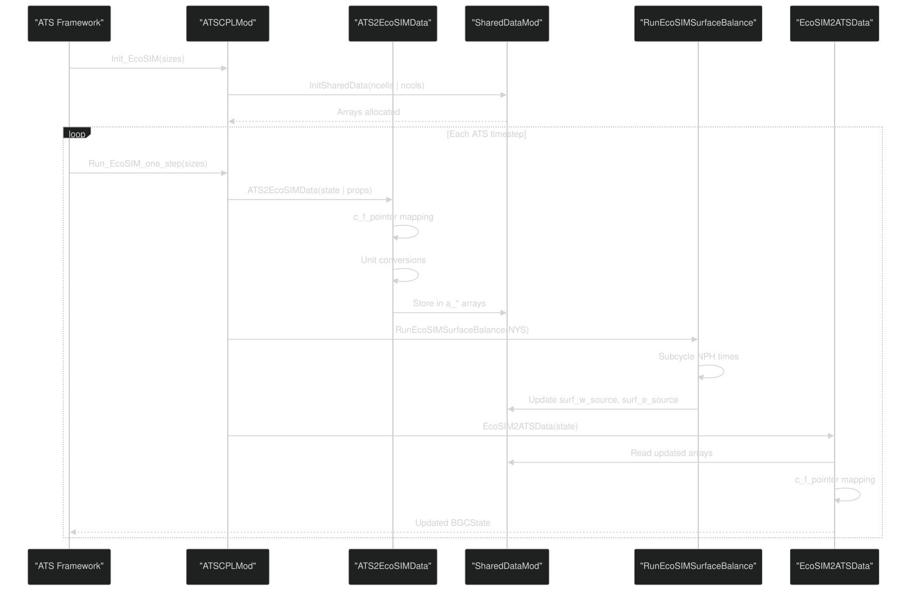

# System Architecture

Relevant source files

- [drivers/ATSEcoSIM/ATSEcoSIM_test.F90](https://github.com/jingtao-lbl/EcoSIM/blob/7b8a4cf6/drivers/ATSEcoSIM/ATSEcoSIM_test.F90)
- [drivers/ATSEcoSIM/CMakeLists.txt](https://github.com/jingtao-lbl/EcoSIM/blob/7b8a4cf6/drivers/ATSEcoSIM/CMakeLists.txt)
- [drivers/ecosim/EcoSIMAPI.F90](https://github.com/jingtao-lbl/EcoSIM/blob/7b8a4cf6/drivers/ecosim/EcoSIMAPI.F90)
- [drivers/ecosim/ecosim.F90](https://github.com/jingtao-lbl/EcoSIM/blob/7b8a4cf6/drivers/ecosim/ecosim.F90)
- [f90src/APIData/CMakeLists.txt](https://github.com/jingtao-lbl/EcoSIM/blob/7b8a4cf6/f90src/APIData/CMakeLists.txt)
- [f90src/APIs/CMakeLists.txt](https://github.com/jingtao-lbl/EcoSIM/blob/7b8a4cf6/f90src/APIs/CMakeLists.txt)
- [f90src/ATSUtils/ATSCPLMod.F90](https://github.com/jingtao-lbl/EcoSIM/blob/7b8a4cf6/f90src/ATSUtils/ATSCPLMod.F90)
- [f90src/ATSUtils/ATSEcoSIMAdvanceMod.F90](https://github.com/jingtao-lbl/EcoSIM/blob/7b8a4cf6/f90src/ATSUtils/ATSEcoSIMAdvanceMod.F90)
- [f90src/ATSUtils/ATSEcoSIMInitMod.F90](https://github.com/jingtao-lbl/EcoSIM/blob/7b8a4cf6/f90src/ATSUtils/ATSEcoSIMInitMod.F90)
- [f90src/ATSUtils/BGC_containers.F90](https://github.com/jingtao-lbl/EcoSIM/blob/7b8a4cf6/f90src/ATSUtils/BGC_containers.F90)
- [f90src/ATSUtils/CMakeLists.txt](https://github.com/jingtao-lbl/EcoSIM/blob/7b8a4cf6/f90src/ATSUtils/CMakeLists.txt)
- [f90src/ATSUtils/SharedDataMod.F90](https://github.com/jingtao-lbl/EcoSIM/blob/7b8a4cf6/f90src/ATSUtils/SharedDataMod.F90)
- [f90src/ATSUtils/c_f_interface_module.F90](https://github.com/jingtao-lbl/EcoSIM/blob/7b8a4cf6/f90src/ATSUtils/c_f_interface_module.F90)
- [f90src/CMakeLists.txt](https://github.com/jingtao-lbl/EcoSIM/blob/7b8a4cf6/f90src/CMakeLists.txt)

## Purpose and Scope

This document describes the overall architectural design of EcoSIM, including its layered structure, operating modes, and module organization. It provides a high-level view of how the major system components interact and how data flows through the system. For detailed information about the timestep orchestration and execution sequence, see [Core Components and Execution Flow](#3.1) . For specifics about the ATS coupling implementation, see [ATS Integration](#3.2) . For build system details, see [Module Organization](#3.3) .

## Architectural Overview

EcoSIM is designed as a modular, layered biogeochemical modeling system that can operate in two modes: as a standalone executable or as a component coupled with the Advanced Terrestrial Simulator (ATS). The architecture follows a clear separation of concerns with distinct layers for user interface, core execution control, process models, data management, and infrastructure.

The system is implemented primarily in Fortran 90 with C/Fortran interoperability for ATS coupling. The modular design allows individual process models (plant, microbial, geochemical, hydrothermal) to be enabled or disabled through configuration flags.

## Operating Modes

### Standalone Mode

Sources:  [drivers/ecosim/ecosim.F90 1-157](https://github.com/jingtao-lbl/EcoSIM/blob/7b8a4cf6/drivers/ecosim/ecosim.F90#L1-L157)  [drivers/ecosim/EcoSIMAPI.F90 321-488](https://github.com/jingtao-lbl/EcoSIM/blob/7b8a4cf6/drivers/ecosim/EcoSIMAPI.F90#L321-L488)

In standalone mode, the `ecosim.F90` driver initializes the system by reading configuration files and calling `InitModules()` . The main simulation loop in `AdvanceModelOneYear()` advances the model through yearly, daily, and hourly timesteps, invoking process models at each hour.

### ATS-Coupled Mode

Sources:  [f90src/ATSUtils/ATSCPLMod.F90 1-313](https://github.com/jingtao-lbl/EcoSIM/blob/7b8a4cf6/f90src/ATSUtils/ATSCPLMod.F90#L1-L313)  [f90src/ATSUtils/ATSEcoSIMAdvanceMod.F90 1-250](https://github.com/jingtao-lbl/EcoSIM/blob/7b8a4cf6/f90src/ATSUtils/ATSEcoSIMAdvanceMod.F90#L1-L250)  [f90src/ATSUtils/SharedDataMod.F90 1-204](https://github.com/jingtao-lbl/EcoSIM/blob/7b8a4cf6/f90src/ATSUtils/SharedDataMod.F90#L1-L204)

In ATS-coupled mode, EcoSIM functions as a component within the larger ATS framework. The `ATSCPLMod` module provides the coupling interface, exchanging data through C-compatible data structures defined in `BGC_containers.F90` . EcoSIM performs subcycling (multiple internal timesteps per ATS timestep) to maintain numerical stability.

## Main Architectural Layers

### Layer 1: User Interface and Configuration

Sources:  [drivers/ecosim/EcoSIMAPI.F90 126-318](https://github.com/jingtao-lbl/EcoSIM/blob/7b8a4cf6/drivers/ecosim/EcoSIMAPI.F90#L126-L318)

The user interface layer handles configuration through namelist files. The `readnamelist()` subroutine [drivers/ecosim/EcoSIMAPI.F90 126-318](https://github.com/jingtao-lbl/EcoSIM/blob/7b8a4cf6/drivers/ecosim/EcoSIMAPI.F90#L126-L318) parses configuration parameters including:

- `case_name``num_of_simdays``continue_run`Simulation control ( , , )
- `plant_model``microbial_model``soichem_model`Model switches ( , , )
- `pft_file_in``grid_file_in``clm_hour_file_in`Input file paths ( , , )
- `NPXS``NPYS``NCYC_LITR``NCYC_SNOW`Solver parameters ( , , , )

### Layer 2: Core Execution Control

Sources:  [drivers/ecosim/ecosim.F90 1-157](https://github.com/jingtao-lbl/EcoSIM/blob/7b8a4cf6/drivers/ecosim/ecosim.F90#L1-L157)  [drivers/ecosim/EcoSIMAPI.F90 32-124](https://github.com/jingtao-lbl/EcoSIM/blob/7b8a4cf6/drivers/ecosim/EcoSIMAPI.F90#L32-L124)  [f90src/ATSUtils/ATSCPLMod.F90 249-260](https://github.com/jingtao-lbl/EcoSIM/blob/7b8a4cf6/f90src/ATSUtils/ATSCPLMod.F90#L249-L260)

The execution control layer orchestrates the simulation. Key functions include:

- **`AdvanceModelOneYear()`**[drivers/ecosim/EcoSIMAPI.F90321-488](https://github.com/jingtao-lbl/EcoSIM/blob/7b8a4cf6/drivers/ecosim/EcoSIMAPI.F90#L321-L488): Manages annual simulation loop with nested daily and hourly iterations
- **`Run_EcoSIM_one_step()`**[drivers/ecosim/EcoSIMAPI.F9032-124](https://github.com/jingtao-lbl/EcoSIM/blob/7b8a4cf6/drivers/ecosim/EcoSIMAPI.F90#L32-L124): Executes one hourly timestep, calling process models sequentially
- **`RunEcoSIMSurfaceBalance()`**[f90src/ATSUtils/ATSEcoSIMAdvanceMod.F9047-248](https://github.com/jingtao-lbl/EcoSIM/blob/7b8a4cf6/f90src/ATSUtils/ATSEcoSIMAdvanceMod.F90#L47-L248): ATS-specific surface balance with subcycling

### Layer 3: Process Model APIs

Sources:  [f90src/APIs/CMakeLists.txt 1-45](https://github.com/jingtao-lbl/EcoSIM/blob/7b8a4cf6/f90src/APIs/CMakeLists.txt#L1-L45)  [drivers/ecosim/EcoSIMAPI.F90 32-124](https://github.com/jingtao-lbl/EcoSIM/blob/7b8a4cf6/drivers/ecosim/EcoSIMAPI.F90#L32-L124)

The API layer provides standardized interfaces to process models. Each API handles:

- Data marshaling from global arrays to local structures
- Calling appropriate process model implementations
- Returning results to global state

The execution order per timestep [drivers/ecosim/EcoSIMAPI.F90 38-117](https://github.com/jingtao-lbl/EcoSIM/blob/7b8a4cf6/drivers/ecosim/EcoSIMAPI.F90#L38-L117) is:

### Layer 4: Data Management

Sources:  [f90src/ATSUtils/SharedDataMod.F90 1-204](https://github.com/jingtao-lbl/EcoSIM/blob/7b8a4cf6/f90src/ATSUtils/SharedDataMod.F90#L1-L204)  [f90src/ATSUtils/BGC_containers.F90 1-209](https://github.com/jingtao-lbl/EcoSIM/blob/7b8a4cf6/f90src/ATSUtils/BGC_containers.F90#L1-L209)  [f90src/ATSUtils/ATSCPLMod.F90 29-245](https://github.com/jingtao-lbl/EcoSIM/blob/7b8a4cf6/f90src/ATSUtils/ATSCPLMod.F90#L29-L245)

The data management layer uses different strategies for the two operating modes:

Standalone Mode: Uses Fortran allocatable arrays with dimension-specific suffixes:

- `_vr``TCS_vr`: Vertical layer dimension (e.g., for soil temperature)
- `_pft``RootDepth_pft`: Plant functional type dimension (e.g., )
- `_col``NU_col`: Column dimension (e.g., for upper soil layer)

ATS-Coupled Mode: Uses intermediate data structures:

- `SharedDataMod``a_``a_TEMP``a_WC``a_PORO`: Arrays with prefix for ATS data (e.g., , , )
- `BGCContainers_module`[f90src/ATSUtils/BGC_containers.F9053-208](https://github.com/jingtao-lbl/EcoSIM/blob/7b8a4cf6/f90src/ATSUtils/BGC_containers.F90#L53-L208)
- `BGCState`: State variables (temperature, water_content, porosity)
- `BGCProperties`: Properties (depth, volume, atmospheric conditions)
- `BGCSizes`: Dimension information (ncells_per_col_, num_columns)

: C-compatible structures :

Data transfer functions perform unit conversions [f90src/ATSUtils/ATSCPLMod.F90 106-139](https://github.com/jingtao-lbl/EcoSIM/blob/7b8a4cf6/f90src/ATSUtils/ATSCPLMod.F90#L106-L139) :

- Pressure: Pa → MPa
- Radiation: W/m² → MJ/m²/h
- Wind speed: m/s → m/h
- Bulk density: kg/m³ → Mg/m³

### Layer 5: Transport and Physics

Sources:  [drivers/ecosim/EcoSIMAPI.F90 86-117](https://github.com/jingtao-lbl/EcoSIM/blob/7b8a4cf6/drivers/ecosim/EcoSIMAPI.F90#L86-L117)

The transport and physics layer handles:

- 3D subsurface water and heat flow
- Surface energy partitioning
- Snow accumulation, melt, and redistribution
- Gas diffusion (CO₂, O₂, CH₄, N₂O)
- Solute advection and diffusion (NH₄, NO₃, PO₄, DOM)

## Data Flow Architecture

### Global Array Organization

The system uses multi-dimensional arrays with consistent indexing conventions:

| Dimension | Symbol | Description | Example Usage | 
| --- | --- | --- | --- |
| Vertical layers | L or NZ | Soil and litter layers, indexed 0 to JZ | TCS_vr(L,NY,NX) | 
| Y-direction | NY | North-south grid cells or columns | NU_col(NY,NX) | 
| X-direction | NX | East-west grid cells | DH_col(NY,NX) | 
| Plant functional type | NZ or N | Plant species/types | IsPlantActive_pft(NZ,NY,NX) | 

Sources:  [f90src/ATSUtils/SharedDataMod.F90 15-70](https://github.com/jingtao-lbl/EcoSIM/blob/7b8a4cf6/f90src/ATSUtils/SharedDataMod.F90#L15-L70)

### ATS Coupling Data Flow

Sources:  [f90src/ATSUtils/ATSCPLMod.F90 29-260](https://github.com/jingtao-lbl/EcoSIM/blob/7b8a4cf6/f90src/ATSUtils/ATSCPLMod.F90#L29-L260)  [f90src/ATSUtils/ATSEcoSIMAdvanceMod.F90 47-248](https://github.com/jingtao-lbl/EcoSIM/blob/7b8a4cf6/f90src/ATSUtils/ATSEcoSIMAdvanceMod.F90#L47-L248)

Key data flow elements:

### Subcycling Mechanism

In ATS-coupled mode, EcoSIM performs multiple internal timesteps per ATS timestep [f90src/ATSUtils/ATSEcoSIMAdvanceMod.F90 205-216](https://github.com/jingtao-lbl/EcoSIM/blob/7b8a4cf6/f90src/ATSUtils/ATSEcoSIMAdvanceMod.F90#L205-L216) :

Sources:  [f90src/ATSUtils/ATSEcoSIMAdvanceMod.F90 205-235](https://github.com/jingtao-lbl/EcoSIM/blob/7b8a4cf6/f90src/ATSUtils/ATSEcoSIMAdvanceMod.F90#L205-L235)

The subcycling parameter `NPH` is set by `set_ecosim_solver()`  [drivers/ecosim/EcoSIMAPI.F90 124](https://github.com/jingtao-lbl/EcoSIM/blob/7b8a4cf6/drivers/ecosim/EcoSIMAPI.F90#L124-L124) and defaults to values that ensure numerical stability of the surface physics calculations.

## Module Dependencies

The CMake build system organizes modules into libraries with clear dependency chains:

Sources:  [f90src/CMakeLists.txt 1-33](https://github.com/jingtao-lbl/EcoSIM/blob/7b8a4cf6/f90src/CMakeLists.txt#L1-L33)  [f90src/APIs/CMakeLists.txt 1-45](https://github.com/jingtao-lbl/EcoSIM/blob/7b8a4cf6/f90src/APIs/CMakeLists.txt#L1-L45)  [f90src/ATSUtils/CMakeLists.txt 1-38](https://github.com/jingtao-lbl/EcoSIM/blob/7b8a4cf6/f90src/ATSUtils/CMakeLists.txt#L1-L38)

Build structure:

- **Base layer:**`Utils``Minimath``Modelconfig`, , provide fundamental functionality
- **Grid layer:**`Mesh``Ecosim_datatype`, define spatial structure and data containers
- **Process layer:**`Plant_bgc``Microbial_bgc``Geochem``HydroTherm`, , , implement physics
- **Interface layer:**`APIs``ATSUtils`, provide standardized access to processes
- **Application layer:**`Main`contains executable drivers

Each subdirectory has a `CMakeLists.txt`  [f90src/ATSUtils/CMakeLists.txt 13-26](https://github.com/jingtao-lbl/EcoSIM/blob/7b8a4cf6/f90src/ATSUtils/CMakeLists.txt#L13-L26) specifying:

- Source files to compile
- Include directories for module dependencies
- Library targets to create

## Execution Model

### Standalone Timestep Hierarchy

Sources:  [drivers/ecosim/EcoSIMAPI.F90 321-488](https://github.com/jingtao-lbl/EcoSIM/blob/7b8a4cf6/drivers/ecosim/EcoSIMAPI.F90#L321-L488)  [drivers/ecosim/EcoSIMAPI.F90 32-124](https://github.com/jingtao-lbl/EcoSIM/blob/7b8a4cf6/drivers/ecosim/EcoSIMAPI.F90#L32-L124)

The standalone execution model uses nested loops:

### ATS-Coupled Timestep

Sources:  [f90src/ATSUtils/ATSCPLMod.F90 249-260](https://github.com/jingtao-lbl/EcoSIM/blob/7b8a4cf6/f90src/ATSUtils/ATSCPLMod.F90#L249-L260)  [f90src/ATSUtils/ATSEcoSIMAdvanceMod.F90 47-248](https://github.com/jingtao-lbl/EcoSIM/blob/7b8a4cf6/f90src/ATSUtils/ATSEcoSIMAdvanceMod.F90#L47-L248)

In ATS-coupled mode, EcoSIM performs only surface physics calculations [f90src/ATSUtils/ATSEcoSIMInitMod.F90 45-53](https://github.com/jingtao-lbl/EcoSIM/blob/7b8a4cf6/f90src/ATSUtils/ATSEcoSIMInitMod.F90#L45-L53) :

- `plant_model = .false.``microbial_model = .false.``soichem_model = .false.`Flags disable full biogeochemistry: , ,
- Focus on surface energy balance and snow dynamics
- Subsurface processes handled by ATS

### Mass Balance Checking

Both operating modes include mass conservation checks:

Sources:  [drivers/ecosim/EcoSIMAPI.F90 122](https://github.com/jingtao-lbl/EcoSIM/blob/7b8a4cf6/drivers/ecosim/EcoSIMAPI.F90#L122-L122)

The `BalancesMod` module tracks mass and energy conservation throughout each timestep, calling `endrun()` if conservation violations exceed tolerance thresholds.

## Configuration Flags

The architecture supports runtime configuration through boolean flags:

| Flag | Module | Effect | 
| --- | --- | --- |
| plant_model | EcoSIMCtrlDataType | Enable/disable plant biogeochemistry | 
| microbial_model | EcoSIMCtrlDataType | Enable/disable microbial processes | 
| soichem_model | EcoSIMCtrlDataType | Enable/disable soil chemistry | 
| salt_model | EcoSIMCtrlDataType | Enable/disable salt transport | 
| ATS_cpl_mode | EcoSIMConfig | Enable ATS coupling mode | 
| column_mode | EcoSIMConfig | Enable 1D column (vs 2D/3D) simulation | 

Sources:  [drivers/ecosim/EcoSIMAPI.F90 193-195](https://github.com/jingtao-lbl/EcoSIM/blob/7b8a4cf6/drivers/ecosim/EcoSIMAPI.F90#L193-L195)  [f90src/ATSUtils/ATSEcoSIMInitMod.F90 45-53](https://github.com/jingtao-lbl/EcoSIM/blob/7b8a4cf6/f90src/ATSUtils/ATSEcoSIMInitMod.F90#L45-L53)

These flags control compilation of specific code paths, allowing the model to be customized for different applications while maintaining a single codebase.