# Plant API and Data Structures

Relevant source files

- [f90src/APIData/PlantAPIData.F90](https://github.com/jingtao-lbl/EcoSIM/blob/7b8a4cf6/f90src/APIData/PlantAPIData.F90)
- [f90src/APIs/PlantAPI.F90](https://github.com/jingtao-lbl/EcoSIM/blob/7b8a4cf6/f90src/APIs/PlantAPI.F90)

## Purpose and Scope

This page documents the Plant Model API interface and the comprehensive data structure hierarchy used to represent plant state variables, fluxes, and parameters in EcoSIM. The PlantAPI provides a standardized interface for exchanging data between the main simulation driver and the plant model subsystem. This includes over 20 specialized data structure types organized by functional categories (photosynthesis, morphology, phenology, biomass, etc.) and hundreds of multi-dimensional arrays that track plant states across PFTs, soil layers, canopy layers, branches, and nodes.

For information about plant growth and allocation processes, see [Plant Growth and Allocation](#4.1.2) . For plant phenology and disturbance modeling, see [Plant Phenology and Disturbances](#4.1.3) .

## PlantAPI Interface Overview

The PlantAPI module provides two main subroutines that marshal data between global state arrays and the localized plant model data structures:

| Function | Purpose | Direction | 
| --- | --- | --- |
| PlantAPISend | Transfers current state from global arrays to plant model structures | Main → Plant Model | 
| PlantAPIRecv | Transfers updated state from plant model structures back to global arrays | Plant Model → Main | 

These functions handle the complexity of mapping between:

- Global multi-dimensional arrays organized by grid cell (NY, NX), soil layer, PFT, etc.
- Localized plant data structures organized into functional categories
- Type conversions and unit transformations as needed

Sources:  [f90src/APIs/PlantAPI.F90 1-44](https://github.com/jingtao-lbl/EcoSIM/blob/7b8a4cf6/f90src/APIs/PlantAPI.F90#L1-L44)

### Data Flow Architecture

Sources:  [f90src/APIs/PlantAPI.F90 48-687](https://github.com/jingtao-lbl/EcoSIM/blob/7b8a4cf6/f90src/APIs/PlantAPI.F90#L48-L687)  [f90src/APIs/PlantAPI.F90 692-1707](https://github.com/jingtao-lbl/EcoSIM/blob/7b8a4cf6/f90src/APIs/PlantAPI.F90#L692-L1707)

## PlantAPISend: Data Transfer to Plant Model

The `PlantAPISend` subroutine packages input data needed by the plant model, including environmental conditions, soil state, and previous timestep plant states.

### Key Data Categories Transferred

### Example Data Transfer Pattern

The following pattern is repeated for hundreds of variables throughout `PlantAPISend` :

The function iterates over:

- Soil layers (L): 0 to NK_col(NY,NX)
- PFTs (NZ): 1 to NP0_col(NY,NX)
- Branches (NB): 1 to MaxNumBranches
- Nodes (K): 0 to MaxNodesPerBranch
- Canopy layers (L): 1 to NumCanopyLayers

Sources:  [f90src/APIs/PlantAPI.F90 702-1707](https://github.com/jingtao-lbl/EcoSIM/blob/7b8a4cf6/f90src/APIs/PlantAPI.F90#L702-L1707)

## PlantAPIRecv: Data Transfer from Plant Model

The `PlantAPIRecv` subroutine transfers computed fluxes, updated state variables, and diagnostic outputs from the plant model back to global arrays for subsequent transport and biogeochemical processes.

### Key Output Categories

### Cumulative Variable Updates

Many variables in `PlantAPIRecv` use accumulation patterns:

This accumulation pattern enables tracking of annual totals and landscape-level aggregations.

Sources:  [f90src/APIs/PlantAPI.F90 48-687](https://github.com/jingtao-lbl/EcoSIM/blob/7b8a4cf6/f90src/APIs/PlantAPI.F90#L48-L687)

## Plant Data Structure Hierarchy

The plant model organizes data into 12 specialized derived types, each with its own initialization and destruction procedures. These structures are defined in `PlantAPIData.F90` .

### Data Structure Type Catalog

| Type | Module Variable | Purpose | Key Dimensions | 
| --- | --- | --- | --- |
| plant_siteinfo_type | plt_site | Site characteristics, grid geometry, global scalars | Scalars, _vr, _pft | 
| plant_photosyns_type | plt_photo | Photosynthesis parameters, Rubisco kinetics, stomatal conductance | _pft, _brch, _node, _zsec | 
| plant_radiation_type | plt_rad | Radiation interception, canopy albedo, PAR absorption | _pft, _col, layer | 
| plant_morph_type | plt_morph | Plant architecture, root/shoot geometry, leaf/stem area | _pft, _brch, _node, _rpvr | 
| plant_pheno_type | plt_pheno | Phenological state, growth stages, thermal time | _pft, _brch | 
| plant_allometry_type | plt_allom | Growth yields, C:N:P ratios, allocation fractions | _pft | 
| plant_biom_type | plt_biom | Biomass pools (structural, nonstructural, nodule) | _pft, _brch, _node, _rpvr | 
| plant_ew_type | plt_ew | Water potential, transpiration, canopy energy balance | _pft, _col, _pvr | 
| plant_bgcrate_type | plt_bgcr | Carbon fluxes (photosynthesis, respiration, litterfall) | _pft, _col, _vr | 
| plant_rbgcrate_type | plt_rbgc | Root BGC (uptake, exudation, gas exchange) | _pft, _pvr, _vr | 
| plant_disturb_type | plt_distb | Harvest, fire, management operations | _pft, _col | 
| plant_soilchem_type | plt_soilchem | Soil chemistry state for plant processes | _vr | 

Sources:  [f90src/APIData/PlantAPIData.F90 1-89](https://github.com/jingtao-lbl/EcoSIM/blob/7b8a4cf6/f90src/APIData/PlantAPIData.F90#L1-L89)  [f90src/APIData/PlantAPIData.F90 90-161](https://github.com/jingtao-lbl/EcoSIM/blob/7b8a4cf6/f90src/APIData/PlantAPIData.F90#L90-L161)  [f90src/APIData/PlantAPIData.F90 163-208](https://github.com/jingtao-lbl/EcoSIM/blob/7b8a4cf6/f90src/APIData/PlantAPIData.F90#L163-L208)  [f90src/APIData/PlantAPIData.F90 210-323](https://github.com/jingtao-lbl/EcoSIM/blob/7b8a4cf6/f90src/APIData/PlantAPIData.F90#L210-L323)  [f90src/APIData/PlantAPIData.F90 325-403](https://github.com/jingtao-lbl/EcoSIM/blob/7b8a4cf6/f90src/APIData/PlantAPIData.F90#L325-L403)  [f90src/APIData/PlantAPIData.F90 405-435](https://github.com/jingtao-lbl/EcoSIM/blob/7b8a4cf6/f90src/APIData/PlantAPIData.F90#L405-L435)  [f90src/APIData/PlantAPIData.F90 437-482](https://github.com/jingtao-lbl/EcoSIM/blob/7b8a4cf6/f90src/APIData/PlantAPIData.F90#L437-L482)  [f90src/APIData/PlantAPIData.F90 484-578](https://github.com/jingtao-lbl/EcoSIM/blob/7b8a4cf6/f90src/APIData/PlantAPIData.F90#L484-L578)  [f90src/APIData/PlantAPIData.F90 580-650](https://github.com/jingtao-lbl/EcoSIM/blob/7b8a4cf6/f90src/APIData/PlantAPIData.F90#L580-L650)  [f90src/APIData/PlantAPIData.F90 652-687](https://github.com/jingtao-lbl/EcoSIM/blob/7b8a4cf6/f90src/APIData/PlantAPIData.F90#L652-L687)  [f90src/APIData/PlantAPIData.F90 689-800](https://github.com/jingtao-lbl/EcoSIM/blob/7b8a4cf6/f90src/APIData/PlantAPIData.F90#L689-L800)

### Data Structure Organization

Sources:  [f90src/APIData/PlantAPIData.F90 1-800](https://github.com/jingtao-lbl/EcoSIM/blob/7b8a4cf6/f90src/APIData/PlantAPIData.F90#L1-L800)

## Multi-dimensional Array Organization

EcoSIM uses a systematic suffix convention to organize multi-dimensional arrays by their spatial and functional dimensions. This enables efficient indexing and clear semantic meaning.

### Array Suffix Convention

| Suffix | Dimension | Index Range | Description | 
| --- | --- | --- | --- |
| _col | Column/Grid | (NY, NX) | Grid cell location | 
| _vr | Vertical/Layer | (L, NY, NX) | Soil layer | 
| _pft | PFT | (NZ, NY, NX) | Plant functional type | 
| _brch | Branch | (NB, NZ, NY, NX) | Plant branch | 
| _node | Node | (K, NB, NZ, NY, NX) | Canopy node on branch | 
| _lnode | Layer-Node | (L, K, NB, NZ, NY, NX) | Canopy layer and node | 
| _pvr | PFT-Vertical | (N, L, NZ, NY, NX) | Root mycorrhizae type, soil layer, PFT | 
| _rpvr | Root-PFT-Vertical | (N, L, NZ, NY, NX) | Mycorrhizae type, soil layer, PFT (root-specific) | 
| _raxs | Root Axis | (N, NR, NZ, NY, NX) | Mycorrhizae type, root axis, PFT | 
| _clyr | Canopy Layer | (L, NY, NX) | Canopy layer | 
| _zsec | Zenith Sector | (N, M, L, NZ, NY, NX) | Zenith angle, azimuth, layer, PFT | 

### Example Variable Naming

Sources:  [f90src/APIs/PlantAPI.F90 60-680](https://github.com/jingtao-lbl/EcoSIM/blob/7b8a4cf6/f90src/APIs/PlantAPI.F90#L60-L680)  [f90src/APIData/PlantAPIData.F90 210-323](https://github.com/jingtao-lbl/EcoSIM/blob/7b8a4cf6/f90src/APIData/PlantAPIData.F90#L210-L323)

### Nested Iteration Pattern

Plant model calculations iterate through nested loops following this general structure:

Sources:  [f90src/APIs/PlantAPI.F90 98-679](https://github.com/jingtao-lbl/EcoSIM/blob/7b8a4cf6/f90src/APIs/PlantAPI.F90#L98-L679)

## Element Indexing for Chemical Composition

Plant biomass pools track multiple chemical elements using the `NumPlantChemElms` dimension (typically 5 elements: C, N, P, H, O).

### Element Pool Organization

### Element Balance Tracking

Element conservation is tracked using balance variables:

Sources:  [f90src/APIs/PlantAPI.F90 67-96](https://github.com/jingtao-lbl/EcoSIM/blob/7b8a4cf6/f90src/APIs/PlantAPI.F90#L67-L96)  [f90src/APIData/PlantAPIData.F90 485-578](https://github.com/jingtao-lbl/EcoSIM/blob/7b8a4cf6/f90src/APIData/PlantAPIData.F90#L485-L578)

## Specialized Index Dimensions

### Canopy Structural Dimensions

The canopy structure uses multiple indexing systems for detailed light interception and morphological representation:

| Dimension | Parameter | Range | Description | 
| --- | --- | --- | --- |
| NumCanopyLayers | L | 1 to 60 | Vertical canopy layers for radiation | 
| NumLeafZenithSectors | N | 1 to 9 | Leaf zenith angle classes [0, π/2] | 
| NumOfSkyAzimuthSects | M | 1 to 12 | Sky azimuth sectors [0, 2π] | 
| MaxNodesPerBranch | K | 0 to 1000 | Nodes per branch (including main stem) | 
| MaxNumBranches | NB | 1 to 200 | Branches per plant | 

### Root System Dimensions

Root architecture uses specialized indexing:

| Dimension | Parameter | Range | Description | 
| --- | --- | --- | --- |
| MaxNumRootAxes | NR | 1 to 100 | Primary root axes | 
| Myco_pft | N | 1 to 3 | Mycorrhizae types (non-mycorrhizal, AM, EM) | 
| NK_col | L | soil layers | Active soil layers for roots | 

Sources:  [f90src/APIData/PlantAPIData.F90 14-29](https://github.com/jingtao-lbl/EcoSIM/blob/7b8a4cf6/f90src/APIData/PlantAPIData.F90#L14-L29)  [f90src/APIData/PlantAPIData.F90 210-323](https://github.com/jingtao-lbl/EcoSIM/blob/7b8a4cf6/f90src/APIData/PlantAPIData.F90#L210-L323)

## Gas and Solute Tracer Indexing

Plant-soil gas exchange uses tracer indices defined in `TracerIDMod` :

The suffix `B` denotes fertilizer band-specific concentrations and fluxes, enabling separate tracking of band vs. bulk soil nutrient uptake.

Sources:  [f90src/APIs/PlantAPI.F90 86-146](https://github.com/jingtao-lbl/EcoSIM/blob/7b8a4cf6/f90src/APIs/PlantAPI.F90#L86-L146)  [f90src/APIs/PlantAPI.F90 518-596](https://github.com/jingtao-lbl/EcoSIM/blob/7b8a4cf6/f90src/APIs/PlantAPI.F90#L518-L596)

## Type-Bound Procedures for Data Management

Each plant data structure type includes type-bound procedures for initialization and cleanup:

This object-oriented pattern ensures:

- Proper allocation of pointer arrays
- Initialization of scalar defaults
- Deallocation to prevent memory leaks
- Consistent API across all plant data structures

Sources:  [f90src/APIData/PlantAPIData.F90 85-88](https://github.com/jingtao-lbl/EcoSIM/blob/7b8a4cf6/f90src/APIData/PlantAPIData.F90#L85-L88)  [f90src/APIData/PlantAPIData.F90 158-161](https://github.com/jingtao-lbl/EcoSIM/blob/7b8a4cf6/f90src/APIData/PlantAPIData.F90#L158-L161)

## Integration with Other Systems

The PlantAPI interfaces with multiple other EcoSIM subsystems:

The PlantAPI serves as the primary interface between plant processes and all other model components, ensuring consistent data flow and element conservation.

Sources:  [f90src/APIs/PlantAPI.F90 1-44](https://github.com/jingtao-lbl/EcoSIM/blob/7b8a4cf6/f90src/APIs/PlantAPI.F90#L1-L44)  [f90src/APIs/PlantAPI.F90 48-687](https://github.com/jingtao-lbl/EcoSIM/blob/7b8a4cf6/f90src/APIs/PlantAPI.F90#L48-L687)  [f90src/APIs/PlantAPI.F90 692-1707](https://github.com/jingtao-lbl/EcoSIM/blob/7b8a4cf6/f90src/APIs/PlantAPI.F90#L692-L1707)