# Plant Growth and Allocation

Relevant source files

- [f90src/APIData/PlantAPIData.F90](https://github.com/jingtao-lbl/EcoSIM/blob/7b8a4cf6/f90src/APIData/PlantAPIData.F90)
- [f90src/APIs/PlantAPI.F90](https://github.com/jingtao-lbl/EcoSIM/blob/7b8a4cf6/f90src/APIs/PlantAPI.F90)
- [f90src/Ecosim_datatype/RootDataType.F90](https://github.com/jingtao-lbl/EcoSIM/blob/7b8a4cf6/f90src/Ecosim_datatype/RootDataType.F90)
- [f90src/IOutils/PlantInfoMod.F90](https://github.com/jingtao-lbl/EcoSIM/blob/7b8a4cf6/f90src/IOutils/PlantInfoMod.F90)
- [f90src/IOutils/readimod.F90](https://github.com/jingtao-lbl/EcoSIM/blob/7b8a4cf6/f90src/IOutils/readimod.F90)
- [f90src/Plant_bgc/GrosubsMod.F90](https://github.com/jingtao-lbl/EcoSIM/blob/7b8a4cf6/f90src/Plant_bgc/GrosubsMod.F90)
- [f90src/Plant_bgc/InitPlantMod.F90](https://github.com/jingtao-lbl/EcoSIM/blob/7b8a4cf6/f90src/Plant_bgc/InitPlantMod.F90)
- [f90src/Plant_bgc/LitterFallMod.F90](https://github.com/jingtao-lbl/EcoSIM/blob/7b8a4cf6/f90src/Plant_bgc/LitterFallMod.F90)
- [f90src/Plant_bgc/PlantBranchMod.F90](https://github.com/jingtao-lbl/EcoSIM/blob/7b8a4cf6/f90src/Plant_bgc/PlantBranchMod.F90)
- [f90src/Plant_bgc/PlantDisturbByTillageMod.F90](https://github.com/jingtao-lbl/EcoSIM/blob/7b8a4cf6/f90src/Plant_bgc/PlantDisturbByTillageMod.F90)
- [f90src/Plant_bgc/PlantDisturbsMod.F90](https://github.com/jingtao-lbl/EcoSIM/blob/7b8a4cf6/f90src/Plant_bgc/PlantDisturbsMod.F90)
- [f90src/Plant_bgc/PlantPhenolMod.F90](https://github.com/jingtao-lbl/EcoSIM/blob/7b8a4cf6/f90src/Plant_bgc/PlantPhenolMod.F90)
- [f90src/Plant_bgc/RootMod.F90](https://github.com/jingtao-lbl/EcoSIM/blob/7b8a4cf6/f90src/Plant_bgc/RootMod.F90)

## Purpose and Scope

This page documents the carbon allocation mechanisms, partition coefficients, and biomass dynamics within EcoSIM's plant model. It covers how photosynthetically fixed carbon is distributed among plant organs (leaves, stems, roots, reproductive structures) and how growth respiration is calculated. For information about the overall plant model structure and data types, see [Plant API and Data Structures](#4.1.1) . For phenological controls on growth and disturbance effects, see [Plant Phenology and Disturbances](#4.1.3) .

## Carbon Allocation Framework

EcoSIM implements a source-sink framework where photosynthetically fixed carbon (the "source") is allocated to various plant organs based on their relative "sink" strengths. Growth is mediated by nonstructural carbon pools that buffer between carbon fixation and structural growth.

### Source-Sink Dynamics

The allocation process operates at multiple hierarchical levels:

Sources:

- [f90src/Plant_bgc/PlantBranchMod.F9035-239](https://github.com/jingtao-lbl/EcoSIM/blob/7b8a4cf6/f90src/Plant_bgc/PlantBranchMod.F90#L35-L239)
- [f90src/Plant_bgc/grosubsMod.F9051-108](https://github.com/jingtao-lbl/EcoSIM/blob/7b8a4cf6/f90src/Plant_bgc/grosubsMod.F90#L51-L108)
- [f90src/APIData/PlantAPIData.F90125-157](https://github.com/jingtao-lbl/EcoSIM/blob/7b8a4cf6/f90src/APIData/PlantAPIData.F90#L125-L157)

### Nonstructural Carbon Pools

Three distinct nonstructural carbon pools mediate allocation:

| Pool | Variable | Location | Function | 
| --- | --- | --- | --- |
| Branch nonstructural C | CanopyNonstElms_brch(ielmc,NB,NZ) | Each branch | Immediate growth substrate | 
| Root nonstructural C | RootMycoNonstElms_rpvr(ielmc,N,L,NZ) | Each root layer | Root growth substrate | 
| Seasonal storage | SeasonalNonstElms_pft(ielmc,NZ) | Whole plant | Long-term storage (perennials) | 

Carbon flows between these pools based on concentration gradients and plant phenological state. The exchange rate is controlled by parameters `XFRX` (maximum remobilizable fraction) and `XFRY` (exchange rate coefficient).

Sources:

- [f90src/Plant_bgc/RootMod.F90253-293](https://github.com/jingtao-lbl/EcoSIM/blob/7b8a4cf6/f90src/Plant_bgc/RootMod.F90#L253-L293)
- [f90src/APIData/PlantAPIData.F90240-290](https://github.com/jingtao-lbl/EcoSIM/blob/7b8a4cf6/f90src/APIData/PlantAPIData.F90#L240-L290)

## Partition Coefficients

The distribution of nonstructural carbon to different organs is governed by the PARTS array, which contains partition coefficients calculated dynamically based on phenological stage, environmental conditions, and nutrient status.

### PARTS Array Structure

Sources:

- [f90src/Plant_bgc/PlantBranchMod.F9024-31](https://github.com/jingtao-lbl/EcoSIM/blob/7b8a4cf6/f90src/Plant_bgc/PlantBranchMod.F90#L24-L31)
- [f90src/Plant_bgc/PlantBranchMod.F9098](https://github.com/jingtao-lbl/EcoSIM/blob/7b8a4cf6/f90src/Plant_bgc/PlantBranchMod.F90#L98-L98)

### Partition Coefficient Calculation

The `CalcPartitionCoeff` subroutine determines PARTS values based on multiple factors. Key logic includes:

The partition coefficients are normalized such that:

This ensures all available carbon is allocated. The actual implementation uses complex phenology-dependent logic encoded in the `CalcPartitionCoeff` function (not fully shown in provided excerpts but referenced extensively).

Sources:

- [f90src/Plant_bgc/PlantBranchMod.F9098](https://github.com/jingtao-lbl/EcoSIM/blob/7b8a4cf6/f90src/Plant_bgc/PlantBranchMod.F90#L98-L98)

## Organ Growth and Biomass Allocation

Once partition coefficients are determined, carbon is allocated to individual organs. Each organ type has specific growth mechanics.

### Branch-Level Allocation

Sources:

- [f90src/Plant_bgc/PlantBranchMod.F9035-239](https://github.com/jingtao-lbl/EcoSIM/blob/7b8a4cf6/f90src/Plant_bgc/PlantBranchMod.F90#L35-L239)

### Leaf Growth

Leaf growth is distributed among nodes (phyllocrons) on each branch. The process involves:

Key variables:

- `LeafStrutElms_brch(NE,NB,NZ)`: Structural elements in leaves
- `LeafArea_node(K,NB,NZ)`: Leaf area of node K
- `CanopyLeafArea_lnode(L,K,NB,NZ)`: Leaf area in layer L, node K

Sources:

- [f90src/Plant_bgc/PlantBranchMod.F90130](https://github.com/jingtao-lbl/EcoSIM/blob/7b8a4cf6/f90src/Plant_bgc/PlantBranchMod.F90#L130-L130)
- [f90src/Plant_bgc/PlantBranchMod.F90206-220](https://github.com/jingtao-lbl/EcoSIM/blob/7b8a4cf6/f90src/Plant_bgc/PlantBranchMod.F90#L206-L220)

### Root Growth

Root growth involves both primary (axial) and secondary (lateral) roots with distinct allocation patterns.

The root allocation includes:

- **Vertical distribution**: Deeper roots when water/nutrients are limiting
- **Mycorrhizal associations**: Secondary mycorrhizal roots for certain PFTs
- **Root hair growth**: Increases effective uptake surface area

Sources:

- [f90src/Plant_bgc/RootMod.F9021-120](https://github.com/jingtao-lbl/EcoSIM/blob/7b8a4cf6/f90src/Plant_bgc/RootMod.F90#L21-L120)
- [f90src/Plant_bgc/RootMod.F90123-206](https://github.com/jingtao-lbl/EcoSIM/blob/7b8a4cf6/f90src/Plant_bgc/RootMod.F90#L123-L206)

### Grain Filling

For grain crops, grain filling occurs post-anthesis:

The `GrainFillOnBranch` subroutine manages grain growth with priority allocation when carbon is limiting.

Sources:

- [f90src/Plant_bgc/PlantBranchMod.F90222](https://github.com/jingtao-lbl/EcoSIM/blob/7b8a4cf6/f90src/Plant_bgc/PlantBranchMod.F90#L222-L222)
- [f90src/APIData/PlantAPIData.F90249-250](https://github.com/jingtao-lbl/EcoSIM/blob/7b8a4cf6/f90src/APIData/PlantAPIData.F90#L249-L250)

## Root-Shoot Interactions

Carbon allocation between roots and shoots is dynamically regulated to maintain nutrient and water balance.

### Carbon Transfer Mechanisms

Key transfer parameters:

- **XFRY**: Rate constant for concentration-gradient-driven exchange (typically 0.10 h⁻¹)
- **XFRX**: Maximum remobilizable fraction from storage (0.80 for most PFTs)
- **FRSV**: Remobilization rate during leafout (0.001-0.01 h⁻¹)
- **ShootRootNonstElmConduts_pft**: Shoot-root conductance for nonstructural elements

Sources:

- [f90src/Plant_bgc/RootMod.F90253-293](https://github.com/jingtao-lbl/EcoSIM/blob/7b8a4cf6/f90src/Plant_bgc/RootMod.F90#L253-L293)
- [f90src/APIData/PlantAPIData.F90563](https://github.com/jingtao-lbl/EcoSIM/blob/7b8a4cf6/f90src/APIData/PlantAPIData.F90#L563-L563)

### Seasonal Storage Dynamics

Perennial plants accumulate carbon in seasonal storage pools:

The storage is located conceptually in roots and woody tissues, with concentration-based equilibration to root layers.

Sources:

- [f90src/Plant_bgc/RootMod.F90265-291](https://github.com/jingtao-lbl/EcoSIM/blob/7b8a4cf6/f90src/Plant_bgc/RootMod.F90#L265-L291)

## Growth Respiration and Yield

Growth consumes carbon for biosynthesis, with respiration rates depending on tissue composition and growth rate.

### Growth Respiration Calculation

The growth respiration coefficient ( `YCO2Gro_brch` ) represents the mass of CO₂ respired per unit of new biomass:

Specific costs vary by organ:

- **Leaves**: Higher cost due to protein/chlorophyll synthesis
- **Stems/stalks**: Lower cost, primarily cellulose/lignin
- **Roots**: Intermediate cost
- **Grains**: High cost due to lipid/protein concentration

The actual respiration flux:

Where `RNonstC4Groth_brch` is the carbon flux to structural growth.

Sources:

- [f90src/Plant_bgc/PlantBranchMod.F9051-112](https://github.com/jingtao-lbl/EcoSIM/blob/7b8a4cf6/f90src/Plant_bgc/PlantBranchMod.F90#L51-L112)

### Maintenance Respiration

In addition to growth respiration, tissues incur maintenance costs:

Maintenance respiration increases exponentially with temperature (Q₁₀ ≈ 2) and scales with active biomass. When carbon supply is insufficient, `RCanMaintDef_CO2_pft` tracks the deficit, potentially triggering senescence.

Sources:

- [f90src/Plant_bgc/PlantBranchMod.F90110-112](https://github.com/jingtao-lbl/EcoSIM/blob/7b8a4cf6/f90src/Plant_bgc/PlantBranchMod.F90#L110-L112)
- [f90src/APIData/PlantAPIData.F90199](https://github.com/jingtao-lbl/EcoSIM/blob/7b8a4cf6/f90src/APIData/PlantAPIData.F90#L199-L199)

## Data Flow: Allocation Process

The complete allocation process from photosynthesis to structural biomass:

Sources:

- [f90src/Plant_bgc/PlantBranchMod.F9035-239](https://github.com/jingtao-lbl/EcoSIM/blob/7b8a4cf6/f90src/Plant_bgc/PlantBranchMod.F90#L35-L239)
- [f90src/Plant_bgc/RootMod.F9021-120](https://github.com/jingtao-lbl/EcoSIM/blob/7b8a4cf6/f90src/Plant_bgc/RootMod.F90#L21-L120)
- [f90src/Plant_bgc/grosubsMod.F9051-108](https://github.com/jingtao-lbl/EcoSIM/blob/7b8a4cf6/f90src/Plant_bgc/grosubsMod.F90#L51-L108)

## Key Variables Summary

### Allocation State Variables

| Variable | Type | Units | Description | 
| --- | --- | --- | --- |
| PARTS_brch(1:NumOfPlantMorphUnits,NB,NZ) | real(r8) | - | Partition coefficients by organ | 
| CanopyNonstElms_brch(NE,NB,NZ) | real(r8) | g d⁻² | Branch nonstructural elements | 
| RootMycoNonstElms_rpvr(NE,N,L,NZ) | real(r8) | g d⁻² | Root nonstructural elements | 
| SeasonalNonstElms_pft(NE,NZ) | real(r8) | g d⁻² | Seasonal storage | 
| canopy_growth_pft(NZ) | real(r8) | gC d⁻² h⁻¹ | Canopy structural C growth rate | 

### Structural Biomass Variables

| Variable | Type | Units | Description | 
| --- | --- | --- | --- |
| LeafStrutElms_brch(NE,NB,NZ) | real(r8) | g d⁻² | Leaf structural elements | 
| PetoleStrutElms_brch(NE,NB,NZ) | real(r8) | g d⁻² | Petiole structural elements | 
| StalkStrutElms_brch(NE,NB,NZ) | real(r8) | g d⁻² | Stalk structural elements | 
| GrainStrutElms_brch(NE,NB,NZ) | real(r8) | g d⁻² | Grain structural elements | 
| RootElms_pft(NE,NZ) | real(r8) | g d⁻² | Total root elements | 

### Morphological Variables

| Variable | Type | Units | Description | 
| --- | --- | --- | --- |
| LeafArea_node(K,NB,NZ) | real(r8) | m² d⁻² | Leaf area per node | 
| RootLenPerPlant_pvr(N,L,NZ) | real(r8) | m plant⁻¹ | Root length per plant | 
| RootAreaPerPlant_pvr(N,L,NZ) | real(r8) | m² plant⁻¹ | Root surface area per plant | 
| CanopyLeafArea_pft(NZ) | real(r8) | m² d⁻² | Total canopy leaf area | 

Sources:

- [f90src/APIData/PlantAPIData.F90217-290](https://github.com/jingtao-lbl/EcoSIM/blob/7b8a4cf6/f90src/APIData/PlantAPIData.F90#L217-L290)
- [f90src/APIs/PlantAPI.F90157-190](https://github.com/jingtao-lbl/EcoSIM/blob/7b8a4cf6/f90src/APIs/PlantAPI.F90#L157-L190)
- [f90src/Ecosim_datatype/RootDataType.F9013-54](https://github.com/jingtao-lbl/EcoSIM/blob/7b8a4cf6/f90src/Ecosim_datatype/RootDataType.F90#L13-L54)