# Plant Phenology and Disturbances

Relevant source files

- [f90src/Ecosim_datatype/RootDataType.F90](https://github.com/jingtao-lbl/EcoSIM/blob/7b8a4cf6/f90src/Ecosim_datatype/RootDataType.F90)
- [f90src/IOutils/PlantInfoMod.F90](https://github.com/jingtao-lbl/EcoSIM/blob/7b8a4cf6/f90src/IOutils/PlantInfoMod.F90)
- [f90src/IOutils/readimod.F90](https://github.com/jingtao-lbl/EcoSIM/blob/7b8a4cf6/f90src/IOutils/readimod.F90)
- [f90src/Plant_bgc/GrosubsMod.F90](https://github.com/jingtao-lbl/EcoSIM/blob/7b8a4cf6/f90src/Plant_bgc/GrosubsMod.F90)
- [f90src/Plant_bgc/InitPlantMod.F90](https://github.com/jingtao-lbl/EcoSIM/blob/7b8a4cf6/f90src/Plant_bgc/InitPlantMod.F90)
- [f90src/Plant_bgc/LitterFallMod.F90](https://github.com/jingtao-lbl/EcoSIM/blob/7b8a4cf6/f90src/Plant_bgc/LitterFallMod.F90)
- [f90src/Plant_bgc/PlantBranchMod.F90](https://github.com/jingtao-lbl/EcoSIM/blob/7b8a4cf6/f90src/Plant_bgc/PlantBranchMod.F90)
- [f90src/Plant_bgc/PlantDisturbByTillageMod.F90](https://github.com/jingtao-lbl/EcoSIM/blob/7b8a4cf6/f90src/Plant_bgc/PlantDisturbByTillageMod.F90)
- [f90src/Plant_bgc/PlantDisturbsMod.F90](https://github.com/jingtao-lbl/EcoSIM/blob/7b8a4cf6/f90src/Plant_bgc/PlantDisturbsMod.F90)
- [f90src/Plant_bgc/PlantPhenolMod.F90](https://github.com/jingtao-lbl/EcoSIM/blob/7b8a4cf6/f90src/Plant_bgc/PlantPhenolMod.F90)
- [f90src/Plant_bgc/RootMod.F90](https://github.com/jingtao-lbl/EcoSIM/blob/7b8a4cf6/f90src/Plant_bgc/RootMod.F90)

## Purpose and Scope

This page documents the phenological life cycle management and disturbance response mechanisms for plants in EcoSIM. Phenology refers to the timing of recurring biological events in the plant life cycle, including germination, emergence, flowering, grain filling, and senescence. Disturbances include both natural (fire, herbivory) and anthropogenic (harvest, tillage, grazing) events that remove plant biomass.

For information about plant growth and carbon allocation mechanisms, see [Plant Growth and Allocation](#4.1.2) . For the overall plant model architecture and data structures, see [Plant API and Data Structures](#4.1.1) .

Sources: [f90src/Plant_bgc/PlantPhenolMod.F90 1-110](https://github.com/jingtao-lbl/EcoSIM/blob/7b8a4cf6/f90src/Plant_bgc/PlantPhenolMod.F90#L1-L110)  [f90src/Plant_bgc/PlantDisturbsMod.F90 1-45](https://github.com/jingtao-lbl/EcoSIM/blob/7b8a4cf6/f90src/Plant_bgc/PlantDisturbsMod.F90#L1-L45)

## Phenological Life Cycle Overview

EcoSIM tracks plant development through discrete phenological stages stored in the `iPlantCalendar_brch` array. Each branch of each plant functional type (PFT) progresses through these stages based on environmental conditions and accumulated thermal time.

### Life Cycle Stages

| Stage ID | Name | Description | 
| --- | --- | --- |
| ipltcal_Emerge | Emergence | Plant has emerged from soil | 
| ipltcal_FloralInit | Floral Initiation | Reproductive development begins | 
| ipltcal_Anthesis | Anthesis | Flowering occurs | 
| ipltcal_GrainFill | Grain Fill | Grain/seed filling in progress | 
| ipltcal_PhysMaturity | Physiological Maturity | Grain fill complete | 

Phenological Stage Flow

Sources: [f90src/Plant_bgc/PlantPhenolMod.F90 42-110](https://github.com/jingtao-lbl/EcoSIM/blob/7b8a4cf6/f90src/Plant_bgc/PlantPhenolMod.F90#L42-L110)  [f90src/Plant_bgc/InitPlantMod.F90 24-106](https://github.com/jingtao-lbl/EcoSIM/blob/7b8a4cf6/f90src/Plant_bgc/InitPlantMod.F90#L24-L106)

## Environmental Controls on Phenology

### Temperature Requirements

Plant development is driven by accumulated thermal time above base temperatures. The model tracks hours above threshold temperatures for critical transitions.

Leafout (Spring Green-up)

- `Hours4Leafout_brch`Controlled by accumulator
- `HourReq4LeafOut_brch`Threshold: (varies by PFT and canopy layer)
- Triggered when accumulated hours exceed requirement

Vernalization

- Cold temperature requirement for some species
- `VRNLI``VRNXI`Parameters: (leafout requirement), (leafoff requirement)
- Set per PFT in plant trait tables

Temperature Functions

Sources: [f90src/IOutils/PlantInfoMod.F90 469-477](https://github.com/jingtao-lbl/EcoSIM/blob/7b8a4cf6/f90src/IOutils/PlantInfoMod.F90#L469-L477)  [f90src/Plant_bgc/PlantPhenolMod.F90 31-36](https://github.com/jingtao-lbl/EcoSIM/blob/7b8a4cf6/f90src/Plant_bgc/PlantPhenolMod.F90#L31-L36)

### Photoperiod Sensitivity

Photoperiod controls the timing of floral initiation in photoperiod-sensitive species.

| Photoperiod Type | Code | Behavior | 
| --- | --- | --- |
| Day Neutral | 0 | No photoperiod response | 
| Short Day | 1 | Floral init when daylength < critical | 
| Long Day | 2 | Floral init when daylength > critical | 

Parameters :

- `CriticPhotoPeriod_pft`: Critical daylength (hours)
- `PhotoPeriodSens_pft`: Sensitivity coefficient
- `iPlantPhotoperiodType_pft`: Type code (0, 1, or 2)

Sources: [f90src/IOutils/PlantInfoMod.F90 538-539](https://github.com/jingtao-lbl/EcoSIM/blob/7b8a4cf6/f90src/IOutils/PlantInfoMod.F90#L538-L539)  [f90src/IOutils/PlantInfoMod.F90 687-688](https://github.com/jingtao-lbl/EcoSIM/blob/7b8a4cf6/f90src/IOutils/PlantInfoMod.F90#L687-L688)

### Water Stress Effects

Water stress triggers drought-deciduous phenology in sensitive PFTs.

Leafoff Thresholds :

- Index 0: Bryophytes (very tolerant)
- Index 1-3: Graminoids, trees (sensitive)

Water Stress Tracking :

- `PSICanopy_pft`: Current canopy water potential (MPa)
- `HoursTooLowPsiCan_pft`: Accumulated hours below threshold
- Used to trigger senescence when prolonged stress occurs

Sources: [f90src/Plant_bgc/PlantPhenolMod.F90 32-36](https://github.com/jingtao-lbl/EcoSIM/blob/7b8a4cf6/f90src/Plant_bgc/PlantPhenolMod.F90#L32-L36)  [f90src/Plant_bgc/PlantPhenolMod.F90 162-165](https://github.com/jingtao-lbl/EcoSIM/blob/7b8a4cf6/f90src/Plant_bgc/PlantPhenolMod.F90#L162-L165)

## Management Schedule Configuration

Management events (planting, harvest, tillage) are specified in NetCDF input files and read during initialization.

### Planting Information

Data Structure :

Parsed Fields :

- `iDayPlanting_pft`: Ordinal day of planting
- `iYearPlanting_pft`: Year of planting
- `PPI_pft`: Plant population at seeding (plants m⁻²)
- `PlantinDepz_pft`: Planting depth (m)

Sources: [f90src/IOutils/PlantInfoMod.F90 108-180](https://github.com/jingtao-lbl/EcoSIM/blob/7b8a4cf6/f90src/IOutils/PlantInfoMod.F90#L108-L180)  [f90src/IOutils/PlantInfoMod.F90 338-419](https://github.com/jingtao-lbl/EcoSIM/blob/7b8a4cf6/f90src/IOutils/PlantInfoMod.F90#L338-L419)

### Harvest and Management Operations

Management Event Format :

Key Parameters :

| Parameter | Description | Units | 
| --- | --- | --- |
| ICUT | Primary harvest type code | - | 
| JCUT | Secondary operation flag | - | 
| HCUT | Cutting height | m | 
| PCUT | Population thinning fraction | - | 
| ECUT11-14 | Fraction removed: leaf, petiole, woody, standing dead (PFT level) | - | 
| ECUT21-24 | Fraction removed: leaf, petiole, woody, standing dead (column level) | - | 

Harvest Type Codes ( `iharvtyp_*` ):

- `-1`: No harvest
- `0`: None this timestep
- `1`: Grain harvest only
- `2`: All above-ground removal
- `3`: Pruning
- `4`: Grazing
- `5`: Fire
- `6`: Herbivory

Sources: [f90src/IOutils/PlantInfoMod.F90 212-335](https://github.com/jingtao-lbl/EcoSIM/blob/7b8a4cf6/f90src/IOutils/PlantInfoMod.F90#L212-L335)

## Phenology State Management

### Main Phenology Update Routine

The `PhenologyUpdate` subroutine in `PlantPhenolMod` is called hourly to update all plant phenological states.

Execution Flow :

Sources: [f90src/Plant_bgc/PlantPhenolMod.F90 43-110](https://github.com/jingtao-lbl/EcoSIM/blob/7b8a4cf6/f90src/Plant_bgc/PlantPhenolMod.F90#L43-L110)  [f90src/Plant_bgc/PlantPhenolMod.F90 113-168](https://github.com/jingtao-lbl/EcoSIM/blob/7b8a4cf6/f90src/Plant_bgc/PlantPhenolMod.F90#L113-L168)

### Branch-Level Phenology

Each branch tracks its own phenological state independently, allowing for differences in timing across the canopy.

Key State Variables per Branch :

Sources: [f90src/Plant_bgc/PlantPhenolMod.F90 113-168](https://github.com/jingtao-lbl/EcoSIM/blob/7b8a4cf6/f90src/Plant_bgc/PlantPhenolMod.F90#L113-L168)  [f90src/Ecosim_datatype/PlantPhaseDataType.F90](https://github.com/jingtao-lbl/EcoSIM/blob/7b8a4cf6/f90src/Ecosim_datatype/PlantPhaseDataType.F90)

## Disturbance Implementation

### Disturbance Processing Pipeline

Sources: [f90src/Plant_bgc/PlantDisturbsMod.F90 139-176](https://github.com/jingtao-lbl/EcoSIM/blob/7b8a4cf6/f90src/Plant_bgc/PlantDisturbsMod.F90#L139-L176)  [f90src/Plant_bgc/PlantDisturbsMod.F90 179-258](https://github.com/jingtao-lbl/EcoSIM/blob/7b8a4cf6/f90src/Plant_bgc/PlantDisturbsMod.F90#L179-L258)

### Harvest Operations

Biomass Partitioning During Harvest :

Cutting Height Implementation :

For harvest types 0-2, if cutting height ( `HCUT` ) is specified:

- `HCUT`Remove all canopy biomass above height
- Iterate through canopy layers from top to bottom
- Accumulate removed biomass until height threshold reached

Sources: [f90src/Plant_bgc/PlantDisturbsMod.F90 1-45](https://github.com/jingtao-lbl/EcoSIM/blob/7b8a4cf6/f90src/Plant_bgc/PlantDisturbsMod.F90#L1-L45)  [f90src/IOutils/PlantInfoMod.F90 293-305](https://github.com/jingtao-lbl/EcoSIM/blob/7b8a4cf6/f90src/IOutils/PlantInfoMod.F90#L293-L305)

### Fire Disturbance

Fire removes biomass through combustion and transfers the remainder to litter.

Fire Module Structure ( `PlantDisturbByFireMod` ):

Fire Parameters :

- `EFIRE`: Combustion efficiency (element-specific)
- Typically: C combustion > N combustion > P combustion
- Residual biomass transferred to litter pools

Sources: [f90src/Plant_bgc/PlantDisturbByFireMod.F90](https://github.com/jingtao-lbl/EcoSIM/blob/7b8a4cf6/f90src/Plant_bgc/PlantDisturbByFireMod.F90) (referenced in PlantDisturbsMod)

### Grazing Disturbance

Grazing simulates continuous or intermittent herbivore consumption.

Grazing Periods :

Management input specifies grazing periods with start/end dates:

- Grazing between day pairs applies daily removal
- `iHarvstType_pft`set for all days in interval
- Removal fractions specify selectivity (leaf > stem)

Grazing Effects :

Sources: [f90src/IOutils/PlantInfoMod.F90 307-328](https://github.com/jingtao-lbl/EcoSIM/blob/7b8a4cf6/f90src/IOutils/PlantInfoMod.F90#L307-L328)  [f90src/Plant_bgc/PlantDisturbByGrazingMod.F90](https://github.com/jingtao-lbl/EcoSIM/blob/7b8a4cf6/f90src/Plant_bgc/PlantDisturbByGrazingMod.F90)

### Tillage Disturbance

Tillage mechanically disrupts plant populations and incorporates residues.

Tillage Operations ( `RemoveBiomByTillage` ):

Stand-Replacing vs. Non-Replacing :

- **Stand-replacing**`jHarvstType_pft = 1`( ): Complete removal, re-seeding required
- **Non-replacing**`jHarvstType_pft = 0`( ): Population thinning only

Sources: [f90src/Plant_bgc/PlantDisturbByTillageMod.F90](https://github.com/jingtao-lbl/EcoSIM/blob/7b8a4cf6/f90src/Plant_bgc/PlantDisturbByTillageMod.F90)  [f90src/Plant_bgc/PlantDisturbsMod.F90 71-86](https://github.com/jingtao-lbl/EcoSIM/blob/7b8a4cf6/f90src/Plant_bgc/PlantDisturbsMod.F90#L71-L86)

## Death and Re-seeding

### Plant Death Triggers

Plants die when critical conditions are sustained:

Death Detection :

Sources: [f90src/Plant_bgc/RootMod.F90 107-111](https://github.com/jingtao-lbl/EcoSIM/blob/7b8a4cf6/f90src/Plant_bgc/RootMod.F90#L107-L111)  [f90src/Plant_bgc/LitterFallMod.F90 18-88](https://github.com/jingtao-lbl/EcoSIM/blob/7b8a4cf6/f90src/Plant_bgc/LitterFallMod.F90#L18-L88)

### Litterfall from Dead Plants

When plants die, biomass is transferred to litter pools over multiple timesteps.

Reset and Litterfall Process :

Sources: [f90src/Plant_bgc/LitterFallMod.F90 18-88](https://github.com/jingtao-lbl/EcoSIM/blob/7b8a4cf6/f90src/Plant_bgc/LitterFallMod.F90#L18-L88)  [f90src/Plant_bgc/LitterFallMod.F90 125-203](https://github.com/jingtao-lbl/EcoSIM/blob/7b8a4cf6/f90src/Plant_bgc/LitterFallMod.F90#L125-L203)

### Re-seeding from Storage

Annual plants can re-seed if sufficient nonstructural storage remains after death.

Re-seeding Conditions :

Re-seeding Process :

Sources: [f90src/Plant_bgc/LitterFallMod.F90 91-122](https://github.com/jingtao-lbl/EcoSIM/blob/7b8a4cf6/f90src/Plant_bgc/LitterFallMod.F90#L91-L122)  [f90src/Plant_bgc/InitPlantMod.F90 24-106](https://github.com/jingtao-lbl/EcoSIM/blob/7b8a4cf6/f90src/Plant_bgc/InitPlantMod.F90#L24-L106)

## Key Module and Function Reference

### Primary Modules

| Module | File | Purpose | 
| --- | --- | --- |
| PlantPhenolMod | PlantPhenolMod.F90 | Main phenology calculations and state updates | 
| PlantDisturbsMod | PlantDisturbsMod.F90 | Disturbance event processing and biomass removal | 
| PlantInfoMod | PlantInfoMod.F90 | Reading management schedules from input files | 
| LitterFallMod | LitterFallMod.F90 | Plant death, litterfall, and re-seeding | 
| InitPlantMod | InitPlantMod.F90 | Plant initialization and trait setup | 

### Critical Functions

Phenology :

- `PhenologyUpdate(I,J)`[PlantPhenolMod.F9043-110](https://github.com/jingtao-lbl/EcoSIM/blob/7b8a4cf6/PlantPhenolMod.F90#L43-L110): Main hourly phenology update
- `set_plant_flags(I,J,NZ)`[PlantPhenolMod.F90171-233](https://github.com/jingtao-lbl/EcoSIM/blob/7b8a4cf6/PlantPhenolMod.F90#L171-L233): Update active/dormant status
- `StagePlantPhenology(I,J,NZ)`[PlantPhenolMod.F90](https://github.com/jingtao-lbl/EcoSIM/blob/7b8a4cf6/PlantPhenolMod.F90): Update growth stage
- `TestPlantEmergence(I,J,NZ)`[PlantPhenolMod.F90](https://github.com/jingtao-lbl/EcoSIM/blob/7b8a4cf6/PlantPhenolMod.F90): Check emergence conditions
- `live_branch_phenology(I,J,NB,NZ)`[PlantPhenolMod.F90](https://github.com/jingtao-lbl/EcoSIM/blob/7b8a4cf6/PlantPhenolMod.F90): Branch-level phenology

Disturbances :

- `RemoveBiomassByDisturbance(I,J,NZ)`[PlantDisturbsMod.F90139-176](https://github.com/jingtao-lbl/EcoSIM/blob/7b8a4cf6/PlantDisturbsMod.F90#L139-L176): Main disturbance processor
- `PlantDisturbance(I,J,NZ)`[PlantDisturbsMod.F90179-258](https://github.com/jingtao-lbl/EcoSIM/blob/7b8a4cf6/PlantDisturbsMod.F90#L179-L258): Route to specific disturbance type
- `RemoveBiomByHarvest(I,J,NZ)`[PlantDisturbsMod.F90](https://github.com/jingtao-lbl/EcoSIM/blob/7b8a4cf6/PlantDisturbsMod.F90): Harvest operations
- `RemoveBiomByTillage(I,J,NZ)`[PlantDisturbByTillageMod.F90](https://github.com/jingtao-lbl/EcoSIM/blob/7b8a4cf6/PlantDisturbByTillageMod.F90): Tillage operations
- `RemoveBiomByFire(I,J,NZ)`[PlantDisturbByFireMod.F90](https://github.com/jingtao-lbl/EcoSIM/blob/7b8a4cf6/PlantDisturbByFireMod.F90): Fire disturbance

Death and Re-seeding :

- `ResetDeadPlant(I,J,NZ)`[LitterFallMod.F9018-88](https://github.com/jingtao-lbl/EcoSIM/blob/7b8a4cf6/LitterFallMod.F90#L18-L88): Process plant death
- `ReSeedPlants(I,J,NZ)`[LitterFallMod.F9091-122](https://github.com/jingtao-lbl/EcoSIM/blob/7b8a4cf6/LitterFallMod.F90#L91-L122): Re-seed from storage
- `LiterFallDeadBranches(I,J,NZ,NumDeadBranches,C4PhotoShootNonstC_brch)`[LitterFallMod.F90](https://github.com/jingtao-lbl/EcoSIM/blob/7b8a4cf6/LitterFallMod.F90): Transfer branch biomass to litter

Input/Output :

- `ReadPlantInfo(yearc,yeari,NHW,NHE,NVN,NVS)`[PlantInfoMod.F9039-60](https://github.com/jingtao-lbl/EcoSIM/blob/7b8a4cf6/PlantInfoMod.F90#L39-L60): Read plant information
- `readplantinginfo(...)`[PlantInfoMod.F90108-180](https://github.com/jingtao-lbl/EcoSIM/blob/7b8a4cf6/PlantInfoMod.F90#L108-L180): Parse planting schedules
- `readplantmgmtinfo(...)`[PlantInfoMod.F90212-335](https://github.com/jingtao-lbl/EcoSIM/blob/7b8a4cf6/PlantInfoMod.F90#L212-L335): Parse management schedules

Sources: [f90src/Plant_bgc/PlantPhenolMod.F90](https://github.com/jingtao-lbl/EcoSIM/blob/7b8a4cf6/f90src/Plant_bgc/PlantPhenolMod.F90)  [f90src/Plant_bgc/PlantDisturbsMod.F90](https://github.com/jingtao-lbl/EcoSIM/blob/7b8a4cf6/f90src/Plant_bgc/PlantDisturbsMod.F90)  [f90src/Plant_bgc/LitterFallMod.F90](https://github.com/jingtao-lbl/EcoSIM/blob/7b8a4cf6/f90src/Plant_bgc/LitterFallMod.F90)  [f90src/IOutils/PlantInfoMod.F90](https://github.com/jingtao-lbl/EcoSIM/blob/7b8a4cf6/f90src/IOutils/PlantInfoMod.F90)

## Integration with Growth Model

Phenology and disturbances interact tightly with the growth and allocation systems:

Phenological Control of Growth :

- `iPlantCalendar_brch`stages gate which growth processes are active
- Before emergence: Only germination and hypocotyl elongation
- Vegetative phase: Leaf and root growth
- Reproductive phase: Grain filling prioritized over vegetative growth

Disturbance Impact on Allocation :

- Biomass removal triggers compensatory growth responses
- Increased allocation to damaged organs (e.g., regrowth after grazing)
- Remobilization of reserves to rebuild lost tissue
- Population thinning affects per-plant resource availability

Feedback Loops :

Sources: [f90src/Plant_bgc/PlantBranchMod.F90 35-239](https://github.com/jingtao-lbl/EcoSIM/blob/7b8a4cf6/f90src/Plant_bgc/PlantBranchMod.F90#L35-L239)  [f90src/Plant_bgc/grosubsMod.F90 51-108](https://github.com/jingtao-lbl/EcoSIM/blob/7b8a4cf6/f90src/Plant_bgc/grosubsMod.F90#L51-L108)  [f90src/Plant_bgc/PlantDisturbsMod.F90 139-176](https://github.com/jingtao-lbl/EcoSIM/blob/7b8a4cf6/f90src/Plant_bgc/PlantDisturbsMod.F90#L139-L176)