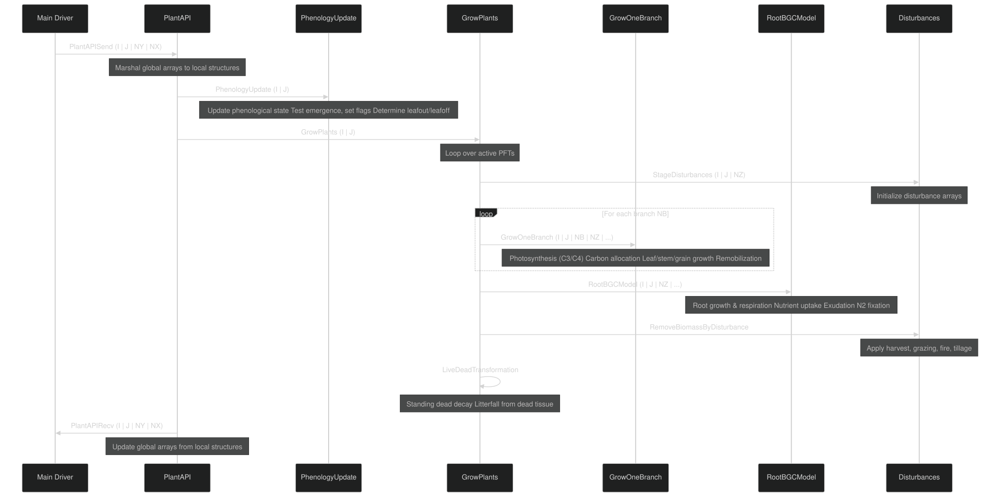

# Plant Model

Relevant source files

- [f90src/APIData/PlantAPIData.F90](https://github.com/jingtao-lbl/EcoSIM/blob/7b8a4cf6/f90src/APIData/PlantAPIData.F90)
- [f90src/APIs/PlantAPI.F90](https://github.com/jingtao-lbl/EcoSIM/blob/7b8a4cf6/f90src/APIs/PlantAPI.F90)
- [f90src/Ecosim_datatype/RootDataType.F90](https://github.com/jingtao-lbl/EcoSIM/blob/7b8a4cf6/f90src/Ecosim_datatype/RootDataType.F90)
- [f90src/IOutils/PlantInfoMod.F90](https://github.com/jingtao-lbl/EcoSIM/blob/7b8a4cf6/f90src/IOutils/PlantInfoMod.F90)
- [f90src/IOutils/readimod.F90](https://github.com/jingtao-lbl/EcoSIM/blob/7b8a4cf6/f90src/IOutils/readimod.F90)
- [f90src/Plant_bgc/GrosubsMod.F90](https://github.com/jingtao-lbl/EcoSIM/blob/7b8a4cf6/f90src/Plant_bgc/GrosubsMod.F90)
- [f90src/Plant_bgc/InitPlantMod.F90](https://github.com/jingtao-lbl/EcoSIM/blob/7b8a4cf6/f90src/Plant_bgc/InitPlantMod.F90)
- [f90src/Plant_bgc/LitterFallMod.F90](https://github.com/jingtao-lbl/EcoSIM/blob/7b8a4cf6/f90src/Plant_bgc/LitterFallMod.F90)
- [f90src/Plant_bgc/PlantBranchMod.F90](https://github.com/jingtao-lbl/EcoSIM/blob/7b8a4cf6/f90src/Plant_bgc/PlantBranchMod.F90)
- [f90src/Plant_bgc/PlantDisturbByTillageMod.F90](https://github.com/jingtao-lbl/EcoSIM/blob/7b8a4cf6/f90src/Plant_bgc/PlantDisturbByTillageMod.F90)
- [f90src/Plant_bgc/PlantDisturbsMod.F90](https://github.com/jingtao-lbl/EcoSIM/blob/7b8a4cf6/f90src/Plant_bgc/PlantDisturbsMod.F90)
- [f90src/Plant_bgc/PlantPhenolMod.F90](https://github.com/jingtao-lbl/EcoSIM/blob/7b8a4cf6/f90src/Plant_bgc/PlantPhenolMod.F90)
- [f90src/Plant_bgc/RootMod.F90](https://github.com/jingtao-lbl/EcoSIM/blob/7b8a4cf6/f90src/Plant_bgc/RootMod.F90)

## Purpose and Scope

The Plant Model simulates terrestrial vegetation dynamics within EcoSIM, including photosynthesis, carbon allocation, tissue growth, phenological development, root-soil interactions, and responses to environmental stresses and management practices. This page provides an architectural overview of the plant modeling system and its integration with soil biogeochemistry and hydro-thermal processes.

For detailed information on specific aspects:

- **Plant API and Data Structures**[4.1.1](#4.1.1): See for data type hierarchies and multi-dimensional array organization
- **Plant Growth and Allocation**[4.1.2](#4.1.2): See for carbon partitioning and biomass dynamics
- **Plant Phenology and Disturbances**[4.1.3](#4.1.3): See for life cycle stages and management operations
- **Root-Soil Biogeochemistry**[4.2](#4.2): See for microbial interactions with plant roots
- **Hydrological Interactions**[5.1](#5.1): See for water uptake and transpiration

## System Architecture

The plant model operates through a layered architecture centered on the `PlantAPI` interface, which marshals data between global arrays and specialized process modules. The system supports multiple Plant Functional Types (PFTs) coexisting in a single grid cell, each with distinct physiological traits, phenological patterns, and morphological characteristics.

### High-Level Component Organization

Sources:  [f90src/APIs/PlantAPI.F90 1-544](https://github.com/jingtao-lbl/EcoSIM/blob/7b8a4cf6/f90src/APIs/PlantAPI.F90#L1-L544)  [f90src/APIData/PlantAPIData.F90 1-1500](https://github.com/jingtao-lbl/EcoSIM/blob/7b8a4cf6/f90src/APIData/PlantAPIData.F90#L1-L1500)  [f90src/Plant_bgc/grosubsMod.F90 1-200](https://github.com/jingtao-lbl/EcoSIM/blob/7b8a4cf6/f90src/Plant_bgc/grosubsMod.F90#L1-L200)

## Core Data Structures

The plant model uses a hierarchical data structure organization defined in `PlantAPIData.F90` . Each data structure encapsulates related state variables and processes:

| Data Structure | Purpose | Key Variables | File Location | 
| --- | --- | --- | --- |
| plant_siteinfo_type | Site-level properties and environmental conditions | PlantPopulation_pft, ALAT, CO2E, DayLenthMax_col | PlantAPIData.F9032-88 | 
| plant_photosyns_type | Photosynthetic machinery and gas exchange | VmaxSpecRubCarboxyRef_pft, CanPStomaResistH2O_pft, LeafIntracellularCO2_pft | PlantAPIData.F9090-161 | 
| plant_radiation_type | Canopy radiation interception and distribution | RadNet2Canopy_pft, LeafAreaZsec_brch, RadPARbyCanopy_pft | PlantAPIData.F90163-208 | 
| plant_morph_type | Plant morphology and dimensional attributes | CanopyLeafArea_pft, RootTotLenPerPlant_pvr, CanopyHeight_pft | PlantAPIData.F90210-331 | 
| plant_biomass_type | Biomass pools for all plant organs | LeafStrutElms_brch, RootElms_pft, SeasonalNonstElms_pft | PlantAPIData.F90333-536 | 
| plant_phenology_type | Phenological state and developmental triggers | iPlantState_pft, Hours4Leafout_brch, doRemobilization_brch | PlantAPIData.F90538-702 | 
| plant_bgcrates_type | Biogeochemical fluxes and transformations | GrossCO2Fix_pft, LitrfallElms_pft, RootN2Fix_pvr | PlantAPIData.F90845-1040 | 
| plant_rootbgc_type | Root-specific biogeochemistry | RootNH4Uptake_pft, trcg_rootml_pvr, RootCO2Autor_pvr | PlantAPIData.F901042-1220 | 

Array Dimension Conventions:

- `_pft(NZ,NY,NX)`: Per plant functional type (PFT), column location
- `_brch(NB,NZ,NY,NX)`: Per branch within PFT
- `_vr(L,NY,NX)`: Per vertical soil layer
- `_pvr(N,L,NZ,NY,NX)`: Per root axis, soil layer, and PFT
- `_node(K,NB,NZ,NY,NX)`: Per node on branch

Sources:  [f90src/APIData/PlantAPIData.F90 1-1500](https://github.com/jingtao-lbl/EcoSIM/blob/7b8a4cf6/f90src/APIData/PlantAPIData.F90#L1-L1500)

## Execution Flow and Timestep Integration

The plant model executes once per hour within the main EcoSIM timestep loop. The entry point is through `PlantAPISend` → `GrowPlants` → `PlantAPIRecv` .

### Hourly Execution Sequence

Sources:  [f90src/APIs/PlantAPI.F90 46-544](https://github.com/jingtao-lbl/EcoSIM/blob/7b8a4cf6/f90src/APIs/PlantAPI.F90#L46-L544)  [f90src/Plant_bgc/grosubsMod.F90 51-108](https://github.com/jingtao-lbl/EcoSIM/blob/7b8a4cf6/f90src/Plant_bgc/grosubsMod.F90#L51-L108)  [f90src/Plant_bgc/PlantPhenolMod.F90 43-110](https://github.com/jingtao-lbl/EcoSIM/blob/7b8a4cf6/f90src/Plant_bgc/PlantPhenolMod.F90#L43-L110)

## Plant Functional Type (PFT) Configuration

Each PFT is characterized by ~200 trait parameters read from NetCDF files and indexed by Köppen climate zone. Plant traits control physiological rates, allocation patterns, and phenological responses.

### PFT Initialization and Trait Loading

Key PFT Trait Categories (see [PlantTraitTableMod](https://github.com/jingtao-lbl/EcoSIM/blob/7b8a4cf6/PlantTraitTableMod) for complete list):

| Category | Example Traits | Variables | 
| --- | --- | --- |
| Photosynthesis | Rubisco activity, Ci:Ca ratio, chlorophyll content | VCMX, VOMX, VCMX4, XKCO2, FCO2 | 
| Morphology | Specific leaf area, branching angle, clumping factor | SLA1, ANGBR, CFI, WDLF | 
| Phenology | Chilling requirement, photoperiod sensitivity, maturity group | CTC, VRNLI, VRNXI, XDL, GROUPX | 
| Allocation | Partitioning coefficients to organs | PARTS_brch (calculated) | 
| Root System | Root radius, porosity, branching frequency | RRAD1M, RRAD2M, PORT, RTFQ | 
| Nutrient Uptake | Vmax and Km for NH4, NO3, PO4 | UPMXZH, UPKMZH, UPMXZN, UPMXZP | 

Sources:  [f90src/IOutils/PlantInfoMod.F90 39-700](https://github.com/jingtao-lbl/EcoSIM/blob/7b8a4cf6/f90src/IOutils/PlantInfoMod.F90#L39-L700)  [f90src/Plant_bgc/InitPlantMod.F90 24-900](https://github.com/jingtao-lbl/EcoSIM/blob/7b8a4cf6/f90src/Plant_bgc/InitPlantMod.F90#L24-L900)

## Key Biogeochemical Processes

### 1. Photosynthesis and Carbon Fixation

The model simulates both C3 and C4 photosynthetic pathways with mechanistic representation of Rubisco kinetics, electron transport, and stomatal conductance. Photosynthesis is calculated at the leaf node level and aggregated to canopy.

C3 Photosynthesis:

- `VcMax`Rubisco-limited carboxylation: × f(Ci, Km)
- `Jmax`Light-limited electron transport: × f(PAR)
- CO2 compensation point accounting for photorespiration

C4 Photosynthesis:

- `VcMax4`PEP carboxylase in mesophyll: × f(Ci)
- Bundle sheath decarboxylation with leakage
- `CPOOL3_node``CPOOL4_node`Separate nonstructural C pools: (mesophyll), (bundle sheath)

Stomatal Regulation: Stomatal conductance responds to leaf water potential ( `PSICanopy_pft` ), vapor pressure deficit, and CO2 concentration via the parameter `CanopyCi2CaRatio_pft` .

Sources:  [f90src/Plant_bgc/PhotoSynsMod.F90](https://github.com/jingtao-lbl/EcoSIM/blob/7b8a4cf6/f90src/Plant_bgc/PhotoSynsMod.F90)  [f90src/Plant_bgc/PlantBranchMod.F90 109-123](https://github.com/jingtao-lbl/EcoSIM/blob/7b8a4cf6/f90src/Plant_bgc/PlantBranchMod.F90#L109-L123)

### 2. Carbon Allocation and Growth

Carbon fixed by photosynthesis enters nonstructural pools and is allocated among competing sinks (leaves, stems, roots, reproductive organs) based on:

Allocation Drivers:

- **Phenological stage:**`iPlantCalendar_brch`Vegetative vs. reproductive (controlled by )
- **Nutrient status:**`CanopyNLimFactor_brch``CanopyPLimFactor_brch`N and P limitation modify allocation ( , )
- **Environmental stress:**`TurgEff4LeafPetolExpansion`Water stress reduces leaf expansion via
- **Source-sink balance:**`CanopyNonstElms_brch`Nonstructural C availability in

Sources:  [f90src/Plant_bgc/PlantBranchMod.F90 98-240](https://github.com/jingtao-lbl/EcoSIM/blob/7b8a4cf6/f90src/Plant_bgc/PlantBranchMod.F90#L98-L240)  [f90src/Plant_bgc/RootMod.F90 21-120](https://github.com/jingtao-lbl/EcoSIM/blob/7b8a4cf6/f90src/Plant_bgc/RootMod.F90#L21-L120)

### 3. Root Dynamics and Nutrient Acquisition

The root system is represented with explicit architecture: primary axes extend vertically, secondary lateral axes branch from primaries. Root growth, respiration, and nutrient uptake are calculated per layer per root type (plant roots vs. mycorrhizae).

Root Structure:

Uptake Kinetics: Michaelis-Menten kinetics with active uptake rates calculated as:

where `Vmax` , `Km` , and `C_min` are PFT-specific traits read from the trait database.

Sources:  [f90src/Plant_bgc/RootMod.F90 21-500](https://github.com/jingtao-lbl/EcoSIM/blob/7b8a4cf6/f90src/Plant_bgc/RootMod.F90#L21-L500)  [f90src/Ecosim_datatype/RootDataType.F90 1-200](https://github.com/jingtao-lbl/EcoSIM/blob/7b8a4cf6/f90src/Ecosim_datatype/RootDataType.F90#L1-L200)

### 4. Phenology and Developmental Transitions

Phenological progression is tracked through growth stages stored in `iPlantCalendar_brch` :

| Growth Stage | Constant | Trigger Condition | 
| --- | --- | --- |
| Germination | ipltcal_Germinate | Planting date + soil temperature threshold | 
| Emergence | ipltcal_Emerge | Hypocotyl reaches soil surface | 
| Vegetative | ipltcal_VegetaGrowth | Post-emergence, pre-floral initiation | 
| Floral Initiation | ipltcal_FloralInit | Photoperiod + thermal time threshold | 
| Flowering | ipltcal_Flowering | Node number reaches NodeNum2InitFloral_brch | 
| Grain Fill | ipltcal_GrainFill | Post-anthesis C allocation to grain | 
| Physiological Maturity | ipltcal_PhysiolMature | Maximum grain mass reached | 
| Senescence | ipltcal_Senescence | Hours after maturity > threshold | 

Leafout/Leafoff Triggers:

- **Spring leafout:**`ChillHours_pft``Hours4Leafout_brch``HourReq4LeafOut_brch`Accumulated chilling hours ( ) + heat units ( > )
- **Autumn leafoff:**`DayLenthCurrent`Photoperiod ( < threshold) or cold temperatures
- **Drought deciduous:**`PSICanopy_pft``PSIMin4LeafOff`Canopy water potential ( < )

Sources:  [f90src/Plant_bgc/PlantPhenolMod.F90 43-700](https://github.com/jingtao-lbl/EcoSIM/blob/7b8a4cf6/f90src/Plant_bgc/PlantPhenolMod.F90#L43-L700)

## Disturbance and Management

The plant model simulates various disturbances and management practices that remove biomass or alter population density.

### Disturbance Types and Implementation

Harvest Operations (controlled by `iHarvstType_pft` , `jHarvstType_pft` ):

- **Grain harvest:**`FracBiomHarvsted`Remove grain, leave straw (configurable via )
- **Forage harvest:**`CanopyHeightCut_pft`Remove above-ground biomass to specified height ( )
- **Tree harvest:**`THIN_pft`Selective thinning ( ) or clear-cut
- **Standing dead removal:**Remove specified fraction of dead biomass

Grazing: Continuous removal over specified period with daily rate determined by animal biomass density

Fire: Combustion efficiency varies by tissue type (leaf > wood) and moisture content, producing CO2, CH4, N2O, NH3 emissions

Sources:  [f90src/Plant_bgc/PlantDisturbsMod.F90 1-500](https://github.com/jingtao-lbl/EcoSIM/blob/7b8a4cf6/f90src/Plant_bgc/PlantDisturbsMod.F90#L1-L500)

## Integration with Soil and Atmosphere

The plant model exchanges fluxes with:

Soil Biogeochemistry (via `PlantAPIRecv` ):

- `LitrfalStrutElms_vr`Litterfall: → soil organic matter pools
- `tRootMycoExud2Soil_vr`Root exudation: → dissolved organic matter
- `trcs_Soil2plant_uptake_vr`Nutrient uptake: ← soil solution
- `RootCO2Emis2Root_vr`Root respiration: → soil CO2

Atmosphere (via surface energy balance):

- `GrossCO2Fix_pft`CO2 fixation: ← atmospheric CO2
- `Transpiration_pft`Transpiration: → latent heat flux
- `GrossResp_pft`Canopy respiration: → atmospheric CO2
- `NH3Dep2Can_pft`NH3 exchange: (bidirectional)

Hydrology (via root water uptake):

- `TWaterPlantRoot2Soil_vr`Water uptake: ← soil water
- Hydraulic redistribution: Passive water movement through roots

Sources:  [f90src/APIs/PlantAPI.F90 48-544](https://github.com/jingtao-lbl/EcoSIM/blob/7b8a4cf6/f90src/APIs/PlantAPI.F90#L48-L544)

## Summary of Key Files

| File | Purpose | Key Subroutines/Types | 
| --- | --- | --- |
| PlantAPI.F90 | API interface for data exchange | PlantAPISend, PlantAPIRecv | 
| PlantAPIData.F90 | Data structure definitions | plant_siteinfo_type, plant_photosyns_type, etc. | 
| grosubsMod.F90 | Main growth orchestrator | GrowPlants, GrowOnePlant | 
| PlantBranchMod.F90 | Branch-level growth and allocation | GrowOneBranch, CalcPartitionCoeff | 
| RootMod.F90 | Root growth and biogeochemistry | RootBGCModel, RootBiochemistry | 
| PlantPhenolMod.F90 | Phenological state transitions | PhenologyUpdate, set_plant_flags | 
| PhotoSynsMod.F90 | Photosynthesis calculations | C3/C4 photosynthesis routines | 
| PlantDisturbsMod.F90 | Disturbances and management | RemoveBiomByHarvest, RemoveBiomByFire | 
| InitPlantMod.F90 | Plant initialization | StartPlants, InitPlantPhenoMorphoBio | 
| PlantInfoMod.F90 | Reading plant traits and management | ReadPlantInfo, ReadPlantTraitsNC |