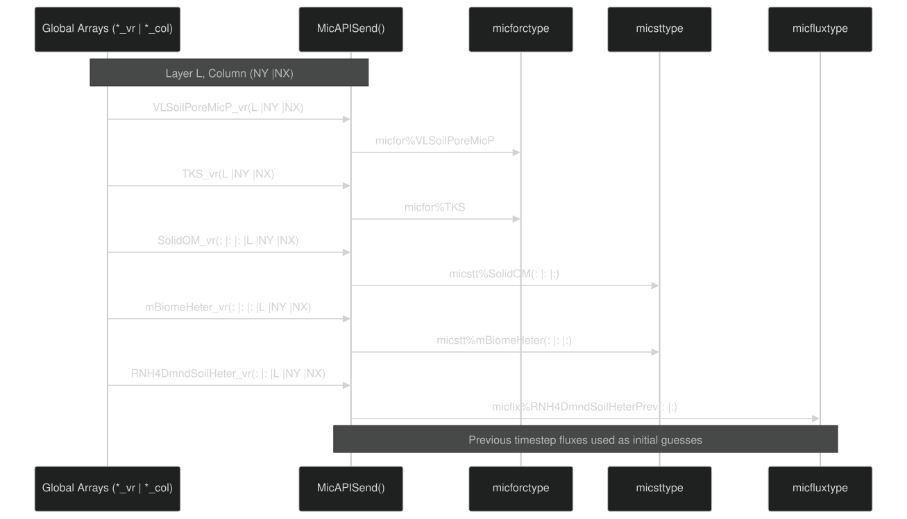
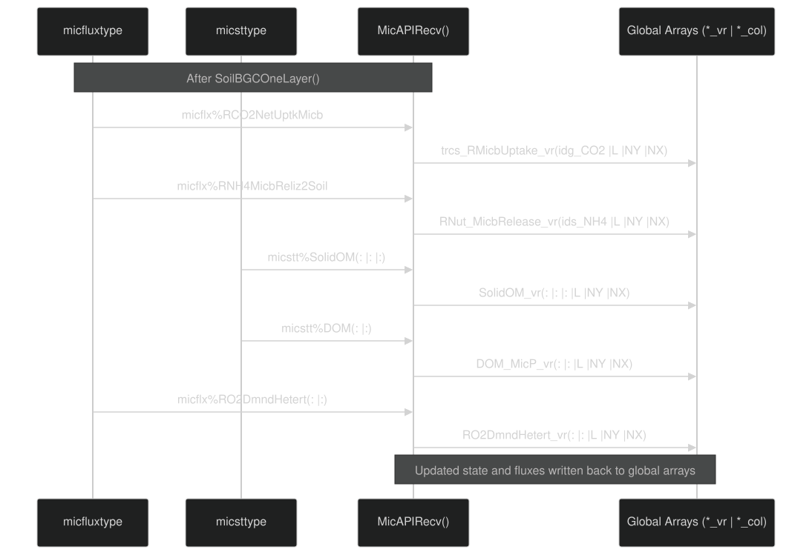
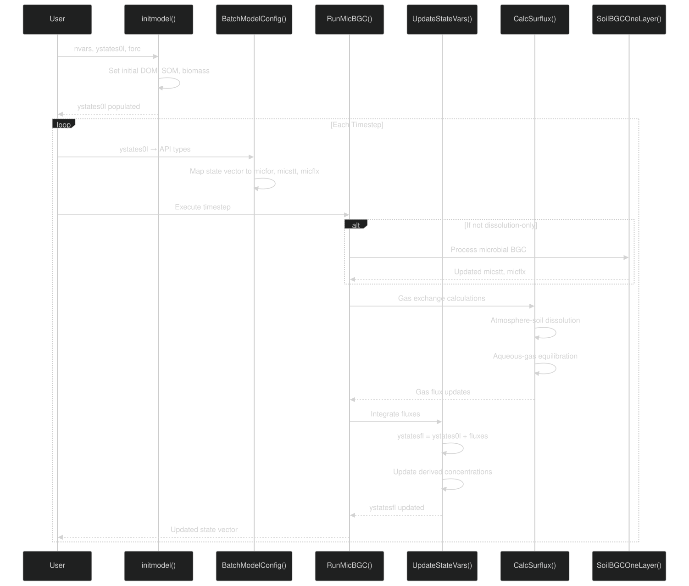

# Microbial API and Batch Processing

Relevant source files

- [drivers/boxsbgc/ForcTypeMod.F90](https://github.com/jingtao-lbl/EcoSIM/blob/7b8a4cf6/drivers/boxsbgc/ForcTypeMod.F90)
- [drivers/boxsbgc/batchmod.F90](https://github.com/jingtao-lbl/EcoSIM/blob/7b8a4cf6/drivers/boxsbgc/batchmod.F90)
- [f90src/APIs/MicBGCAPI.F90](https://github.com/jingtao-lbl/EcoSIM/blob/7b8a4cf6/f90src/APIs/MicBGCAPI.F90)

## Purpose and Scope

This page documents the Microbial Biogeochemistry API ( `MicBGCAPI` ) and the batch processing mode for running soil biogeochemical simulations. The Microbial API provides a clean interface between EcoSIM's global data arrays and the microbial process model core, while batch mode enables standalone testing and incubation experiments without the full hydrological-thermal simulation framework.

For information about the underlying microbial processes and functional groups, see [4.2.2](#4.2.2) . For details on how this API is called from the main simulation driver, see [3.1](#3.1) .

Sources:  [f90src/APIs/MicBGCAPI.F90 1-48](https://github.com/jingtao-lbl/EcoSIM/blob/7b8a4cf6/f90src/APIs/MicBGCAPI.F90#L1-L48)  [drivers/boxsbgc/batchmod.F90 1-29](https://github.com/jingtao-lbl/EcoSIM/blob/7b8a4cf6/drivers/boxsbgc/batchmod.F90#L1-L29)

## Architecture Overview

The Microbial API uses a data marshaling pattern to isolate the microbial model from the rest of EcoSIM. This design enables both integrated simulations and standalone batch mode runs.

### API Layer Architecture

Sources:  [f90src/APIs/MicBGCAPI.F90 40-593](https://github.com/jingtao-lbl/EcoSIM/blob/7b8a4cf6/f90src/APIs/MicBGCAPI.F90#L40-L593)

### Batch Mode Architecture

Sources:  [drivers/boxsbgc/batchmod.F90 31-1279](https://github.com/jingtao-lbl/EcoSIM/blob/7b8a4cf6/drivers/boxsbgc/batchmod.F90#L31-L1279)

## Data Structure Hierarchy

The Microbial API uses three primary data structures to encapsulate forcing, state, and flux information. In batch mode, an additional `forc_type` structure holds all environmental forcing data.

### Core API Data Types

| Type | Module | Purpose | Key Members | 
| --- | --- | --- | --- |
| micforctype | MicForcTypeMod | Environmental forcing and boundary conditions | Temperature, moisture, pH, nutrient availability, diffusivity | 
| micsttype | MicStateTraitTypeMod | State variables for SOM and microbes | DOM pools, solid OM, microbial biomass, nutrient concentrations | 
| micfluxtype | MicFLuxTypeMod | Flux rates and transformation rates | Respiration, mineralization, immobilization, gas production | 
| Microbe_Diag_type | MicrobeDiagTypes | Diagnostic outputs | Temperature sensitivity, water stress, oxygen limitation | 

Sources:  [f90src/APIs/MicBGCAPI.F90 6-43](https://github.com/jingtao-lbl/EcoSIM/blob/7b8a4cf6/f90src/APIs/MicBGCAPI.F90#L6-L43)

### Batch Mode Forcing Type

The `forc_type` structure in batch mode consolidates all environmental and soil properties:

Sources:  [drivers/boxsbgc/ForcTypeMod.F90 16-209](https://github.com/jingtao-lbl/EcoSIM/blob/7b8a4cf6/drivers/boxsbgc/ForcTypeMod.F90#L16-L209)

## Data Marshaling Pattern

The API uses a "Send-Recv" pattern to marshal data between global arrays and local structures. This pattern ensures clean separation of concerns and enables reuse of the core model in different contexts.

### Send Phase: Global Arrays to API Types

The `MicAPISend` subroutine extracts data from multi-dimensional global arrays indexed by `(L,NY,NX)` and populates the API data structures. Key operations include:

Sources:  [f90src/APIs/MicBGCAPI.F90 154-408](https://github.com/jingtao-lbl/EcoSIM/blob/7b8a4cf6/f90src/APIs/MicBGCAPI.F90#L154-L408)

### Recv Phase: API Types to Global Arrays

The `MicAPIRecv` subroutine writes computed results back to global arrays:

Sources:  [f90src/APIs/MicBGCAPI.F90 413-593](https://github.com/jingtao-lbl/EcoSIM/blob/7b8a4cf6/f90src/APIs/MicBGCAPI.F90#L413-L593)

## Batch Processing Workflow

Batch mode enables standalone simulations for testing, parameter calibration, or incubation experiments. It manages a state vector containing all biogeochemical variables and updates them through successive timesteps.

### Variable Identification System

Batch mode uses a flat state vector indexed by variable IDs. The `Initboxbgc` subroutine assigns consecutive integer IDs to all state and flux variables:

Variable ID ranges for major pools:

| Variable Type | ID Range | Description | 
| --- | --- | --- |
| DOM (C,N,P,acetate) | cid_oqc_b to cid_oqa_e | Dissolved organic matter by complex | 
| Sorbed OM | cid_ohc_b to cid_oha_e | Adsorbed organic matter | 
| Solid OM | cid_osc_b to cid_osp_e | Humus pools (jsken × jcplx elements) | 
| Microbial residue | cid_orc_b to cid_orp_e | Dead biomass pools | 
| Heterotrophic biomass | cid_mBiomeHeter_b to _e | Live heterotroph C,N,P | 
| Autotrophic biomass | cid_mBiomeAutor_b to _e | Live autotroph C,N,P | 

Sources:  [drivers/boxsbgc/batchmod.F90 310-505](https://github.com/jingtao-lbl/EcoSIM/blob/7b8a4cf6/drivers/boxsbgc/batchmod.F90#L310-L505)

### Batch Execution Sequence

Sources:  [drivers/boxsbgc/batchmod.F90 43-1279](https://github.com/jingtao-lbl/EcoSIM/blob/7b8a4cf6/drivers/boxsbgc/batchmod.F90#L43-L1279)

### Gas Exchange in Batch Mode

The `CalcSurflux` subroutine computes gas exchange between three domains: atmosphere, soil gas phase, and soil aqueous phase. This implements a two-step process repeated over `NPG` subcycles per timestep:

Key calculations in `CalcSurflux` :

Sources:  [drivers/boxsbgc/batchmod.F90 1281-1670](https://github.com/jingtao-lbl/EcoSIM/blob/7b8a4cf6/drivers/boxsbgc/batchmod.F90#L1281-L1670)

## Layer-by-Layer Processing

The `MicrobeModel` subroutine processes microbial biogeochemistry for each soil layer in nested loops over grid cells and vertical layers:

Layer selection logic:

- **Litter layer**`L == 0`( ): Surface organic layer, processed if present
- **Top soil layer**`L == NU_col(NY,NX)`( ): Always processed as connection to atmosphere
- **Subsurface layers**`0 < L < NU_col`( ): Processed only if volume > threshold
- **Inactive layers**: Fluxes set to zero to prevent numerical issues

Sources:  [f90src/APIs/MicBGCAPI.F90 78-134](https://github.com/jingtao-lbl/EcoSIM/blob/7b8a4cf6/f90src/APIs/MicBGCAPI.F90#L78-L134)

## Integration with Core Model

The API layer calls `SoilBGCOneLayer` from the `MicBGCMod` module, which implements the actual biogeochemical transformations:

The core model receives clean, layer-specific data structures and returns:

Sources:  [f90src/APIs/MicBGCAPI.F90 138-151](https://github.com/jingtao-lbl/EcoSIM/blob/7b8a4cf6/f90src/APIs/MicBGCAPI.F90#L138-L151)  [drivers/boxsbgc/batchmod.F90 1242-1279](https://github.com/jingtao-lbl/EcoSIM/blob/7b8a4cf6/drivers/boxsbgc/batchmod.F90#L1242-L1279)

## Variable Registry and Metadata

Batch mode maintains metadata for all variables to support I/O and diagnostics:

### Variable Metadata Structure

The `getvarlist` subroutine populates metadata arrays:

| Array | Type | Purpose | 
| --- | --- | --- |
| varl(nvars) | character(len=hist_var_str_len) | Short variable name (e.g., "ZNH4S") | 
| varlnml(nvars) | character(len=hist_var_lon_str_len) | Long descriptive name | 
| unitl(nvars) | character(len=hist_unit_str_len) | Units (e.g., "gN d-2 h-1") | 
| vartypes(nvars) | integer | State (var_state_type) or flux (var_flux_type) | 

Example variable definitions:

Sources:  [drivers/boxsbgc/batchmod.F90 659-1240](https://github.com/jingtao-lbl/EcoSIM/blob/7b8a4cf6/drivers/boxsbgc/batchmod.F90#L659-L1240)

## Typical Usage Patterns

### Full EcoSIM Simulation

In the full model, the Microbial API is called from the main timestep loop:

### Batch Mode Incubation

For standalone incubation experiments:

Sources:  [f90src/APIs/MicBGCAPI.F90 55-76](https://github.com/jingtao-lbl/EcoSIM/blob/7b8a4cf6/f90src/APIs/MicBGCAPI.F90#L55-L76)  [drivers/boxsbgc/batchmod.F90 31-1279](https://github.com/jingtao-lbl/EcoSIM/blob/7b8a4cf6/drivers/boxsbgc/batchmod.F90#L31-L1279)