# Microbial Functional Groups and SOM Dynamics

Relevant source files

- [f90src/Microbial_bgc/Box_Micmodel/MicAutoCplxFGMod.F90](https://github.com/jingtao-lbl/EcoSIM/blob/7b8a4cf6/f90src/Microbial_bgc/Box_Micmodel/MicAutoCplxFGMod.F90)
- [f90src/Microbial_bgc/Box_Micmodel/MicBGCFGMod.F90](https://github.com/jingtao-lbl/EcoSIM/blob/7b8a4cf6/f90src/Microbial_bgc/Box_Micmodel/MicBGCFGMod.F90)
- [f90src/Microbial_bgc/Box_Micmodel/MicFluxTypeMod.F90](https://github.com/jingtao-lbl/EcoSIM/blob/7b8a4cf6/f90src/Microbial_bgc/Box_Micmodel/MicFluxTypeMod.F90)
- [f90src/Microbial_bgc/Box_Micmodel/MicForcTypeMod.F90](https://github.com/jingtao-lbl/EcoSIM/blob/7b8a4cf6/f90src/Microbial_bgc/Box_Micmodel/MicForcTypeMod.F90)
- [f90src/Microbial_bgc/Box_Micmodel/MicStateTraitTypeMod.F90](https://github.com/jingtao-lbl/EcoSIM/blob/7b8a4cf6/f90src/Microbial_bgc/Box_Micmodel/MicStateTraitTypeMod.F90)
- [f90src/Microbial_bgc/Box_Micmodel/MicrobeDiagTypes.F90](https://github.com/jingtao-lbl/EcoSIM/blob/7b8a4cf6/f90src/Microbial_bgc/Box_Micmodel/MicrobeDiagTypes.F90)
- [f90src/Microbial_bgc/Layers_Micmodel/InitSOMBGCMod.F90](https://github.com/jingtao-lbl/EcoSIM/blob/7b8a4cf6/f90src/Microbial_bgc/Layers_Micmodel/InitSOMBGCMod.F90)
- [f90src/Modelconfig/EcoSIMConfig.F90](https://github.com/jingtao-lbl/EcoSIM/blob/7b8a4cf6/f90src/Modelconfig/EcoSIMConfig.F90)
- [f90src/Modelpars/MicBGCPars.F90](https://github.com/jingtao-lbl/EcoSIM/blob/7b8a4cf6/f90src/Modelpars/MicBGCPars.F90)
- [f90src/Modelpars/NitroPars.F90](https://github.com/jingtao-lbl/EcoSIM/blob/7b8a4cf6/f90src/Modelpars/NitroPars.F90)

## Purpose and Scope

This page describes the microbial functional groups (guilds) and soil organic matter (SOM) complexes that form the foundation of EcoSIM's decomposition model. It details the heterotrophic and autotrophic microbial guilds, their metabolic capabilities, the organic matter complexes they colonize, and the decomposition processes that transform solid organic matter into dissolved forms and ultimately into CO2, CH4, and mineral nutrients.

For the API interface and batch processing functionality, see [Microbial API and Batch Processing](#4.2.1) . For geochemical nutrient transformations, see [Geochemical Equilibria](#4.3.1) .

## Microbial Functional Groups

EcoSIM represents microbial communities as discrete functional groups (guilds) with distinct metabolic capabilities, substrate preferences, and stoichiometric characteristics. Each guild can contain multiple instances (up to `NumMicbFunGrupsPerCmplx = 7` per complex), though the default configuration uses one instance per guild.

### Heterotrophic Guilds

Heterotrophic microbes obtain carbon and energy from organic compounds. EcoSIM includes seven heterotrophic functional groups, each occupying distinct metabolic niches:


Guild Characteristics:

| Guild ID | Name | Metabolic Mode | Primary Substrates | Products | 
| --- | --- | --- | --- | --- |
| 1 | Aerobic Bacteria | Aerobic respiration | DOC, acetate | CO2 | 
| 2 | Facultative Denitrifiers | Aerobic/Denitrification | DOC, acetate, NO3, NO2, N2O | CO2, N2 | 
| 3 | Aerobic Fungi | Aerobic respiration | DOC, acetate | CO2 | 
| 4 | Fermenters | Fermentation | DOC | Acetate, H2, CO2 | 
| 5 | Acetoclastic Methanogens | Methanogenesis | Acetate | CH4, CO2 | 
| 6 | Aerobic N2 Fixers | N2 fixation (aerobic) | DOC + N2 | Biomass-N | 
| 7 | Anaerobic N2 Fixers | N2 fixation (anaerobic) | DOC + N2 | Biomass-N | 

Sources: [f90src/Modelpars/MicBGCPars.F90 186-193](https://github.com/jingtao-lbl/EcoSIM/blob/7b8a4cf6/f90src/Modelpars/MicBGCPars.F90#L186-L193)  [f90src/Modelpars/MicBGCPars.F90 202-245](https://github.com/jingtao-lbl/EcoSIM/blob/7b8a4cf6/f90src/Modelpars/MicBGCPars.F90#L202-L245)

### Autotrophic Guilds

Autotrophic microbes obtain carbon from CO2 or CH4 and energy from inorganic redox reactions. EcoSIM includes six autotrophic functional groups:


CO2-Fixing Autotrophs: Guilds 1, 2, 5, and 6 fix CO2 into biomass, as indicated by `is_CO2_autotroph` flags [f90src/Modelpars/MicBGCPars.F90 247-250](https://github.com/jingtao-lbl/EcoSIM/blob/7b8a4cf6/f90src/Modelpars/MicBGCPars.F90#L247-L250) Aerobic methanotrophs (3) and ANME-2d (4) use CH4 as their carbon source.

Sources: [f90src/Modelpars/MicBGCPars.F90 195-200](https://github.com/jingtao-lbl/EcoSIM/blob/7b8a4cf6/f90src/Modelpars/MicBGCPars.F90#L195-L200)  [f90src/Modelpars/MicBGCPars.F90 212-217](https://github.com/jingtao-lbl/EcoSIM/blob/7b8a4cf6/f90src/Modelpars/MicBGCPars.F90#L212-L217)  [f90src/Modelpars/MicBGCPars.F90 228-237](https://github.com/jingtao-lbl/EcoSIM/blob/7b8a4cf6/f90src/Modelpars/MicBGCPars.F90#L228-L237)

### Biomass Components and Stoichiometry

Each microbial guild maintains biomass in three components with distinct functions and turnover rates:


Stoichiometric Ratios (bacteria vs. fungi):

| Component | Bacteria N:C | Bacteria P:C | Fungi N:C | Fungi P:C | 
| --- | --- | --- | --- | --- |
| Kinetic | 0.225 | 0.0225 | 0.15 | 0.015 | 
| Structural | 0.135 | 0.0135 | 0.09 | 0.009 | 
| Reserve | 0.189* | 0.0189* | 0.126* | 0.0126* | 

*Reserve ratios calculated as weighted average: `FL(1)*kinetic + FL(2)*structural` where `FL = [0.55, 0.45]`

These ratios are defined in `rNCOMC` and `rPCOMC` arrays [f90src/Modelpars/MicBGCPars.F90 329-365](https://github.com/jingtao-lbl/EcoSIM/blob/7b8a4cf6/f90src/Modelpars/MicBGCPars.F90#L329-L365)

Guild-Specific Biomass Organization:

For heterotrophs, biomass is stored in `mBiomeHeter_vr(NumPlantChemElms, NumLiveHeterBioms, jcplx, L, NY, NX)` where `NumLiveHeterBioms = nlbiomcp * NumHetetr1MicCmplx` . For autotrophs, biomass is stored in `mBiomeAutor_vr(NumPlantChemElms, NumLiveAutoBioms, L, NY, NX)` .

The helper function `get_micb_id(M, NGL)` maps component index `M` and guild index `NGL` to the linear biomass pool index [f90src/Modelpars/MicBGCPars.F90 460-463](https://github.com/jingtao-lbl/EcoSIM/blob/7b8a4cf6/f90src/Modelpars/MicBGCPars.F90#L460-L463)

Sources: [f90src/Modelpars/MicBGCPars.F90 127-128](https://github.com/jingtao-lbl/EcoSIM/blob/7b8a4cf6/f90src/Modelpars/MicBGCPars.F90#L127-L128)  [f90src/Modelpars/MicBGCPars.F90 331-365](https://github.com/jingtao-lbl/EcoSIM/blob/7b8a4cf6/f90src/Modelpars/MicBGCPars.F90#L331-L365)  [f90src/Microbial_bgc/Box_Micmodel/MicrobeDiagTypes.F90 81-121](https://github.com/jingtao-lbl/EcoSIM/blob/7b8a4cf6/f90src/Microbial_bgc/Box_Micmodel/MicrobeDiagTypes.F90#L81-L121)

## SOM Complexes

Organic matter in EcoSIM is organized into five organo-microbial complexes ( `jcplx = 5` ), each colonized by specific microbial guilds and characterized by different decomposition rates.

### Complex Organization


Sources: [f90src/Modelpars/MicBGCPars.F90 136-153](https://github.com/jingtao-lbl/EcoSIM/blob/7b8a4cf6/f90src/Modelpars/MicBGCPars.F90#L136-L153)  [f90src/Microbial_bgc/Layers_Micmodel/InitSOMBGCMod.F90 51-54](https://github.com/jingtao-lbl/EcoSIM/blob/7b8a4cf6/f90src/Microbial_bgc/Layers_Micmodel/InitSOMBGCMod.F90#L51-L54)

### Kinetic Components

Each complex is subdivided into four kinetic components ( `jsken = 4` ) representing different biochemical fractions:


Kinetic Fractions for Common Litter Types:

| Litter Type | Protein | Carbohydrate | Cellulose | Lignin | 
| --- | --- | --- | --- | --- |
| Maize | 0.080 | 0.245 | 0.613 | 0.062 | 
| Wheat | 0.125 | 0.171 | 0.560 | 0.144 | 
| Soybean | 0.138 | 0.426 | 0.316 | 0.120 | 
| Old Straw | 0.075 | 0.125 | 0.550 | 0.250 | 
| Deciduous Forest | 0.070 | 0.410 | 0.360 | 0.160 | 
| Coniferous Forest | 0.070 | 0.250 | 0.380 | 0.300 | 

These fractions are stored in `CFOSC_vr(M, K, L, NY, NX)` and initialized in `InitSurfResiduKinetiComponent`  [f90src/Microbial_bgc/Layers_Micmodel/InitSOMBGCMod.F90 412-501](https://github.com/jingtao-lbl/EcoSIM/blob/7b8a4cf6/f90src/Microbial_bgc/Layers_Micmodel/InitSOMBGCMod.F90#L412-L501)

Decomposition Rate Constants (`SPOSC`):

The specific decomposition rate constants vary by kinetic component and complex type, with litter complexes (1-3) having rates 1.5× higher than soil OM [f90src/Modelpars/MicBGCPars.F90 319-325](https://github.com/jingtao-lbl/EcoSIM/blob/7b8a4cf6/f90src/Modelpars/MicBGCPars.F90#L319-L325)

Sources: [f90src/Modelpars/MicBGCPars.F90 146-149](https://github.com/jingtao-lbl/EcoSIM/blob/7b8a4cf6/f90src/Modelpars/MicBGCPars.F90#L146-L149)  [f90src/Microbial_bgc/Layers_Micmodel/InitSOMBGCMod.F90 428-491](https://github.com/jingtao-lbl/EcoSIM/blob/7b8a4cf6/f90src/Microbial_bgc/Layers_Micmodel/InitSOMBGCMod.F90#L428-L491)

### State Variables per Complex

Each organo-microbial complex maintains multiple state variables representing different forms of organic matter:


Element Indices:

- `ielmc = 1`(carbon)
- `ielmn = 2`(nitrogen)
- `ielmp = 3`(phosphorus)

State Variable Dimensions:

- `SolidOM_vr(NumPlantChemElms, jsken, jcplx, L, NY, NX)`- solid organic matter by element, kinetic component, and complex
- `mBiomeHeter_vr(NumPlantChemElms, NumLiveHeterBioms, jcplx, L, NY, NX)`- heterotrophic biomass
- `mBiomeAutor_vr(NumPlantChemElms, NumLiveAutoBioms, L, NY, NX)`- autotrophic biomass (not complex-specific)
- `DOM_MicP_vr(idom_beg:idom_end, jcplx, L, NY, NX)`- dissolved OM in micropores
- `SorbedOM_vr(idom_beg:idom_end, jcplx, L, NY, NX)`- adsorbed OM

Sources: [f90src/Microbial_bgc/Box_Micmodel/MicStateTraitTypeMod.F90 76-88](https://github.com/jingtao-lbl/EcoSIM/blob/7b8a4cf6/f90src/Microbial_bgc/Box_Micmodel/MicStateTraitTypeMod.F90#L76-L88)  [f90src/Microbial_bgc/Layers_Micmodel/InitSOMBGCMod.F90 166-354](https://github.com/jingtao-lbl/EcoSIM/blob/7b8a4cf6/f90src/Microbial_bgc/Layers_Micmodel/InitSOMBGCMod.F90#L166-L354)

## Decomposition Dynamics

### Process Flow Overview

The decomposition of organic matter proceeds through a series of coupled processes executed within `SoilBGCOneLayer` :


Sources: [f90src/Microbial_bgc/Box_Micmodel/MicBGCFGMod.F90 67-153](https://github.com/jingtao-lbl/EcoSIM/blob/7b8a4cf6/f90src/Microbial_bgc/Box_Micmodel/MicBGCFGMod.F90#L67-L153)

### Environmental Controls

Microbial activity is regulated by temperature, moisture, and substrate availability through multiplicative scalars:

Temperature Sensitivity:

Where `TKSO` varies by process (typically 0.1 for growth, 0.05 for maintenance).

Moisture Sensitivity:

Combined Environmental Scalar:

These scalars are calculated in `StageBGCEnvironCondition` and stored in the `Microbe_State_type`  [f90src/Microbial_bgc/Box_Micmodel/MicrobeDiagTypes.F90 86-87](https://github.com/jingtao-lbl/EcoSIM/blob/7b8a4cf6/f90src/Microbial_bgc/Box_Micmodel/MicrobeDiagTypes.F90#L86-L87)  [f90src/Microbial_bgc/Box_Micmodel/MicrobeDiagTypes.F90 105-110](https://github.com/jingtao-lbl/EcoSIM/blob/7b8a4cf6/f90src/Microbial_bgc/Box_Micmodel/MicrobeDiagTypes.F90#L105-L110)

Sources: [f90src/Microbial_bgc/Box_Micmodel/MicBGCFGMod.F90 259-427](https://github.com/jingtao-lbl/EcoSIM/blob/7b8a4cf6/f90src/Microbial_bgc/Box_Micmodel/MicBGCFGMod.F90#L259-L427)

### Solid Organic Matter Hydrolysis

Solid OM is enzymatically hydrolyzed to DOM at rates determined by specific decomposition constants, microbial activity, and environmental conditions:


Hydrolysis Flux Calculation:

For each kinetic component `M` in complex `K` :

Where:

- `SPOSC(M, K)`= specific decomposition rate [h⁻¹]
- `SolidOMActK(K)``SolidOMCK(K)`/ = fraction of complex colonized by microbes
- `GrowthEnvScalHeter`= environmental scalar
- `FracBulkSOMC(K)`= fraction of total SOM in complex K

This is implemented in `SolidOMDecomposition`  [f90src/Microbial_bgc/Box_Micmodel/MicBGCFGMod.F90 2687-2878](https://github.com/jingtao-lbl/EcoSIM/blob/7b8a4cf6/f90src/Microbial_bgc/Box_Micmodel/MicBGCFGMod.F90#L2687-L2878)

Sources: [f90src/Microbial_bgc/Box_Micmodel/MicrobeDiagTypes.F90 239-241](https://github.com/jingtao-lbl/EcoSIM/blob/7b8a4cf6/f90src/Microbial_bgc/Box_Micmodel/MicrobeDiagTypes.F90#L239-L241)  [f90src/Modelpars/MicBGCPars.F90 319-325](https://github.com/jingtao-lbl/EcoSIM/blob/7b8a4cf6/f90src/Modelpars/MicBGCPars.F90#L319-L325)

### Microbial Substrate Uptake

Heterotrophs take up DOC and acetate following Michaelis-Menten kinetics with competitive inhibition:

DOC Uptake:

Where:

- `VMXO`= maximum specific uptake rate for bacteria [g C g⁻¹ C h⁻¹]
- `OQKM`= half-saturation constant for DOC [g C m⁻³]
- `CDOM(idom_doc)`= DOC concentration [g C m⁻³]
- `OxyLimterHeter`= O2 limitation factor [0-1]
- `FOQC`= competitive uptake fraction (sum across all microbes = 1)

Acetate Uptake:

Acetate has separate kinetics with `OQKA` as the half-saturation constant. Acetoclastic methanogens use `OQKAM` instead.

Competitive Uptake Fractions:

The fraction `FOQC` and `FOQA` are calculated based on relative potential uptake rates:

Where `TFOQC` and `TFOQA` are the sums of all potential uptake rates in the layer.

Sources: [f90src/Microbial_bgc/Box_Micmodel/MicBGCFGMod.F90 1177-1340](https://github.com/jingtao-lbl/EcoSIM/blob/7b8a4cf6/f90src/Microbial_bgc/Box_Micmodel/MicBGCFGMod.F90#L1177-L1340)  [f90src/Modelpars/NitroPars.F90 48-50](https://github.com/jingtao-lbl/EcoSIM/blob/7b8a4cf6/f90src/Modelpars/NitroPars.F90#L48-L50)

### Catabolic and Anabolic Processes

Microbial metabolism partitions substrate carbon between catabolic (energy-generating) and anabolic (growth) pathways:


Growth Efficiency:

The fraction of substrate carbon allocated to growth vs. respiration is determined by growth efficiency parameters:

| Metabolic Mode | Parameter | Efficiency | Reference | 
| --- | --- | --- | --- |
| Aerobic bacteria (DOC) | EO2X | ~0.6 | Energy requirement EOMC | 
| Aerobic fungi | EO2G | ~0.5 | Energy requirement EOMG | 
| Denitrification | ENOX | ~0.3 | Energy requirement EOMD | 
| Fermentation | Variable | ~0.1-0.3 | Energy requirement EOMF | 
| Methanogenesis | Variable | ~0.05-0.1 | Energy requirement EOMH | 

Maintenance Respiration:

In addition to growth respiration, microbes have maintenance costs:

Where `RMOM` is the specific maintenance respiration rate [g C g⁻¹ N h⁻¹].

Anabolic Update:

The function `HeterotrophAnabolicUpdate` integrates all growth fluxes and updates biomass pools [f90src/Microbial_bgc/Box_Micmodel/MicBGCFGMod.F90 3743-3944](https://github.com/jingtao-lbl/EcoSIM/blob/7b8a4cf6/f90src/Microbial_bgc/Box_Micmodel/MicBGCFGMod.F90#L3743-L3944)

Sources: [f90src/Microbial_bgc/Box_Micmodel/MicrobeDiagTypes.F90 128-176](https://github.com/jingtao-lbl/EcoSIM/blob/7b8a4cf6/f90src/Microbial_bgc/Box_Micmodel/MicrobeDiagTypes.F90#L128-L176)  [f90src/Modelpars/NitroPars.F90 82-115](https://github.com/jingtao-lbl/EcoSIM/blob/7b8a4cf6/f90src/Modelpars/NitroPars.F90#L82-L115)

### Nutrient Immobilization and Mineralization

Microbial growth requires balanced C:N:P ratios, leading to either nutrient immobilization (uptake) or mineralization (release):


Nitrogen Demand Calculation:

For guild `N` in complex `K` , the nitrogen demand for growth is:

Where:

- `DOMuptk4GrothHeter(ielmc, N, K)`= carbon uptake for growth
- `rNCOMC(ibiom_kinetic, N, K)`= target N:C ratio for kinetic biomass
- `FCN(N, K)`= nutrient stoichiometry scalar (accounts for deficiencies)
- `rCNDOM(K)`= N:C ratio of the substrate

If `RNiDemand > 0` , nitrogen is immobilized; if `< 0` , nitrogen is mineralized.

Phosphorus follows analogous logic with`rPCOMC`and`FCP`.

Competitive Nutrient Uptake:

When multiple guilds compete for limited nutrients, uptake is partitioned based on relative demand:

This fraction (computed in `SubstrateCompetHeter` ) scales the actual uptake based on total ecosystem demand.

Sources: [f90src/Microbial_bgc/Box_Micmodel/MicBGCFGMod.F90 2063-2372](https://github.com/jingtao-lbl/EcoSIM/blob/7b8a4cf6/f90src/Microbial_bgc/Box_Micmodel/MicBGCFGMod.F90#L2063-L2372)  [f90src/Microbial_bgc/Box_Micmodel/MicrobeDiagTypes.F90 147-172](https://github.com/jingtao-lbl/EcoSIM/blob/7b8a4cf6/f90src/Microbial_bgc/Box_Micmodel/MicrobeDiagTypes.F90#L147-L172)

### Microbial Mortality and Residue Formation

Microbes die due to maintenance deficit (starvation) or predation/environmental stress, forming dead residue that re-enters the decomposition cycle:


Mortality Rate:

The background mortality rate is calculated as:

Where `SPOMC(M)` is the specific death rate for biomass component `M` .

Residue Partitioning:

Dead biomass is partitioned between:

For heterotrophs, residue allocation uses `ORCI(M, K)` fractions [f90src/Modelpars/MicBGCPars.F90 295-296](https://github.com/jingtao-lbl/EcoSIM/blob/7b8a4cf6/f90src/Modelpars/MicBGCPars.F90#L295-L296)

Sources: [f90src/Microbial_bgc/Box_Micmodel/MicBGCFGMod.F90 3743-3944](https://github.com/jingtao-lbl/EcoSIM/blob/7b8a4cf6/f90src/Microbial_bgc/Box_Micmodel/MicBGCFGMod.F90#L3743-L3944)  [f90src/Microbial_bgc/Box_Micmodel/MicrobeDiagTypes.F90 154-167](https://github.com/jingtao-lbl/EcoSIM/blob/7b8a4cf6/f90src/Microbial_bgc/Box_Micmodel/MicrobeDiagTypes.F90#L154-L167)

## Data Type Organization

The microbial and SOM state variables are organized into hierarchical data types:


Type Definitions:

- `Microbe_State_type`[f90src/Microbial_bgc/Box_Micmodel/MicrobeDiagTypes.F9081-121](https://github.com/jingtao-lbl/EcoSIM/blob/7b8a4cf6/f90src/Microbial_bgc/Box_Micmodel/MicrobeDiagTypes.F90#L81-L121)- state variables for microbial biomass
- `Microbe_Flux_type`[f90src/Microbial_bgc/Box_Micmodel/MicrobeDiagTypes.F90123-236](https://github.com/jingtao-lbl/EcoSIM/blob/7b8a4cf6/f90src/Microbial_bgc/Box_Micmodel/MicrobeDiagTypes.F90#L123-L236)- flux rates for microbial processes
- `OMCplx_State_type`[f90src/Microbial_bgc/Box_Micmodel/MicrobeDiagTypes.F90254-271](https://github.com/jingtao-lbl/EcoSIM/blob/7b8a4cf6/f90src/Microbial_bgc/Box_Micmodel/MicrobeDiagTypes.F90#L254-L271)- state variables for OM complexes
- `OMCplx_Flux_type`[f90src/Microbial_bgc/Box_Micmodel/MicrobeDiagTypes.F90238-252](https://github.com/jingtao-lbl/EcoSIM/blob/7b8a4cf6/f90src/Microbial_bgc/Box_Micmodel/MicrobeDiagTypes.F90#L238-L252)- flux rates for OM transformations

Parameter Type:

The `MicParType` in `MicBGCPars.F90` stores all microbial parameters, including:

- `rNCOMC``rPCOMC`Stoichiometric ratios ( , )
- `SPOSC``DOSA``VMXO`Kinetic parameters ( , , )
- `OMCI``ORCI``OQCK``OHCK`Complex fractions ( , , , )
- `JGniH``JGnfH``JGniA``JGnfA`Guild configuration ( , , , )

Sources: [f90src/Microbial_bgc/Box_Micmodel/MicrobeDiagTypes.F90 1-301](https://github.com/jingtao-lbl/EcoSIM/blob/7b8a4cf6/f90src/Microbial_bgc/Box_Micmodel/MicrobeDiagTypes.F90#L1-L301)  [f90src/Modelpars/MicBGCPars.F90 28-115](https://github.com/jingtao-lbl/EcoSIM/blob/7b8a4cf6/f90src/Modelpars/MicBGCPars.F90#L28-L115)

## Key Subroutines

### Main Execution Flow

| Subroutine | Purpose | Location | 
| --- | --- | --- |
| SoilBGCOneLayer | Main entry point for decomposition calculations | f90src/Microbial_bgc/Box_Micmodel/MicBGCFGMod.F9067-153 | 
| StageBGCEnvironCondition | Calculate environmental scalars | f90src/Microbial_bgc/Box_Micmodel/MicBGCFGMod.F90259-427 | 
| ActiveMicrobes | Compute heterotrophic and autotrophic metabolism | f90src/Microbial_bgc/Box_Micmodel/MicBGCFGMod.F90429-716 | 
| SolidOMDecomposition | Hydrolyze solid OM to DOM | f90src/Microbial_bgc/Box_Micmodel/MicBGCFGMod.F902687-2878 | 
| HeterotrophAnabolicUpdate | Update heterotrophic biomass growth | f90src/Microbial_bgc/Box_Micmodel/MicBGCFGMod.F903743-3944 | 
| AutotrophAnabolicUpdate | Update autotrophic biomass growth | f90src/Microbial_bgc/Box_Micmodel/MicAutoCplxFGMod.F90537-789 | 

### Initialization

| Subroutine | Purpose | Location | 
| --- | --- | --- |
| InitSOMBGC | Initialize microbial parameters | f90src/Microbial_bgc/Layers_Micmodel/InitSOMBGCMod.F9038-54 | 
| InitSOMVars | Initialize OM state variables | f90src/Microbial_bgc/Layers_Micmodel/InitSOMBGCMod.F9066-409 | 
| InitSOMProfile | Initialize vertical OM distribution | f90src/Microbial_bgc/Layers_Micmodel/InitSOMBGCMod.F90644-668 | 

### Parameter Configuration

| Subroutine | Purpose | Location | 
| --- | --- | --- |
| Init (MicParType) | Initialize parameter structure | f90src/Modelpars/MicBGCPars.F90120-252 | 
| SetPars (MicParType) | Set parameter values | f90src/Modelpars/MicBGCPars.F90255-390 | 
| initNitroPars | Initialize kinetic parameters | f90src/Modelpars/NitroPars.F90121-195 | 

Sources: [f90src/Microbial_bgc/Box_Micmodel/MicBGCFGMod.F90 1-4415](https://github.com/jingtao-lbl/EcoSIM/blob/7b8a4cf6/f90src/Microbial_bgc/Box_Micmodel/MicBGCFGMod.F90#L1-L4415)  [f90src/Microbial_bgc/Box_Micmodel/MicAutoCplxFGMod.F90 1-2653](https://github.com/jingtao-lbl/EcoSIM/blob/7b8a4cf6/f90src/Microbial_bgc/Box_Micmodel/MicAutoCplxFGMod.F90#L1-L2653)  [f90src/Microbial_bgc/Layers_Micmodel/InitSOMBGCMod.F90 1-802](https://github.com/jingtao-lbl/EcoSIM/blob/7b8a4cf6/f90src/Microbial_bgc/Layers_Micmodel/InitSOMBGCMod.F90#L1-L802)