# Microbial Model

Relevant source files

- [drivers/boxsbgc/ForcTypeMod.F90](https://github.com/jingtao-lbl/EcoSIM/blob/7b8a4cf6/drivers/boxsbgc/ForcTypeMod.F90)
- [drivers/boxsbgc/batchmod.F90](https://github.com/jingtao-lbl/EcoSIM/blob/7b8a4cf6/drivers/boxsbgc/batchmod.F90)
- [f90src/APIs/MicBGCAPI.F90](https://github.com/jingtao-lbl/EcoSIM/blob/7b8a4cf6/f90src/APIs/MicBGCAPI.F90)
- [f90src/Microbial_bgc/Box_Micmodel/MicAutoCplxFGMod.F90](https://github.com/jingtao-lbl/EcoSIM/blob/7b8a4cf6/f90src/Microbial_bgc/Box_Micmodel/MicAutoCplxFGMod.F90)
- [f90src/Microbial_bgc/Box_Micmodel/MicBGCFGMod.F90](https://github.com/jingtao-lbl/EcoSIM/blob/7b8a4cf6/f90src/Microbial_bgc/Box_Micmodel/MicBGCFGMod.F90)
- [f90src/Microbial_bgc/Box_Micmodel/MicFluxTypeMod.F90](https://github.com/jingtao-lbl/EcoSIM/blob/7b8a4cf6/f90src/Microbial_bgc/Box_Micmodel/MicFluxTypeMod.F90)
- [f90src/Microbial_bgc/Box_Micmodel/MicForcTypeMod.F90](https://github.com/jingtao-lbl/EcoSIM/blob/7b8a4cf6/f90src/Microbial_bgc/Box_Micmodel/MicForcTypeMod.F90)
- [f90src/Microbial_bgc/Box_Micmodel/MicStateTraitTypeMod.F90](https://github.com/jingtao-lbl/EcoSIM/blob/7b8a4cf6/f90src/Microbial_bgc/Box_Micmodel/MicStateTraitTypeMod.F90)
- [f90src/Microbial_bgc/Box_Micmodel/MicrobeDiagTypes.F90](https://github.com/jingtao-lbl/EcoSIM/blob/7b8a4cf6/f90src/Microbial_bgc/Box_Micmodel/MicrobeDiagTypes.F90)
- [f90src/Microbial_bgc/Layers_Micmodel/InitSOMBGCMod.F90](https://github.com/jingtao-lbl/EcoSIM/blob/7b8a4cf6/f90src/Microbial_bgc/Layers_Micmodel/InitSOMBGCMod.F90)
- [f90src/Modelconfig/EcoSIMConfig.F90](https://github.com/jingtao-lbl/EcoSIM/blob/7b8a4cf6/f90src/Modelconfig/EcoSIMConfig.F90)
- [f90src/Modelpars/MicBGCPars.F90](https://github.com/jingtao-lbl/EcoSIM/blob/7b8a4cf6/f90src/Modelpars/MicBGCPars.F90)
- [f90src/Modelpars/NitroPars.F90](https://github.com/jingtao-lbl/EcoSIM/blob/7b8a4cf6/f90src/Modelpars/NitroPars.F90)

The Microbial Model simulates microbial functional groups that mediate organic matter decomposition, nutrient cycling, and trace gas fluxes in soil. This page documents the structure, data types, and computational workflow of the microbial biogeochemistry system.

For plant-microbe nutrient competition, see [Plant Model](#4.1) . For soil chemistry interactions, see [Soil Chemistry and Geochemistry](#4.3) . For initialization and parameterization details, see [Microbial Functional Groups and SOM Dynamics](#4.2.2) .

## Overview

The microbial model represents soil biogeochemistry through microbial functional groups organized into organic matter-microbe complexes . Each complex represents a distinct substrate pool (woody litter, fine litter, manure, particulate organic matter, or humus) with its associated microbial community. The model tracks carbon, nitrogen, and phosphorus transformations through microbial metabolism, organic matter decomposition, and nutrient mineralization/immobilization.

Key Features:

- 12 microbial functional groups (7 heterotrophic, 5 autotrophic)
- 5 organic matter complexes
- Explicit representation of microbial biomass (kinetic, structural, reserve pools)
- Multiple organic matter forms (solid, dissolved, sorbed, residual)
- Coupled C-N-P stoichiometry
- Gas production/consumption (CO2, CH4, O2, N2O, NH3, H2)

Sources: [f90src/APIs/MicBGCAPI.F90 1-135](https://github.com/jingtao-lbl/EcoSIM/blob/7b8a4cf6/f90src/APIs/MicBGCAPI.F90#L1-L135)  [f90src/Modelpars/MicBGCPars.F90 1-150](https://github.com/jingtao-lbl/EcoSIM/blob/7b8a4cf6/f90src/Modelpars/MicBGCPars.F90#L1-L150)

## Microbial Functional Groups and Complexes

### Functional Group Organization

The model includes distinct microbial guilds with specialized metabolisms:


Heterotrophic Functional Groups (replicated in each of 5 OM complexes):

- **Aerobic bacteria**: Aerobic decomposition with O2 as electron acceptor
- **Facultative denitrifiers**: Use O2 or NOx (NO3, NO2, N2O) depending on availability
- **Aerobic fungi**: Decompose recalcitrant substrates, produce extracellular enzymes
- **Fermenters**: Produce H2, acetate, and CO2 under anaerobic conditions
- **Acetoclastic methanogens**: Convert acetate to CH4 and CO2
- **Aerobic/Anaerobic N2 fixers**: Fix atmospheric N2 when mineral N is limiting

Autotrophic Functional Groups (single complex shared by all layers):

- **Ammonia oxidizers**: Oxidize NH3 to NO2, produce N2O as byproduct
- **Nitrite oxidizers**: Oxidize NO2 to NO3
- **Aerobic methanotrophs**: Oxidize CH4 to CO2 using O2
- **Anaerobic methane oxidizers (ANME-2d)**: Couple CH4 oxidation to denitrification
- **Hydrogenotrophic methanogens**: Reduce CO2 to CH4 using H2

Sources: [f90src/Modelpars/MicBGCPars.F90 14-27](https://github.com/jingtao-lbl/EcoSIM/blob/7b8a4cf6/f90src/Modelpars/MicBGCPars.F90#L14-L27)  [f90src/Modelpars/MicBGCPars.F90 183-200](https://github.com/jingtao-lbl/EcoSIM/blob/7b8a4cf6/f90src/Modelpars/MicBGCPars.F90#L183-L200)

### Organic Matter Forms

Each complex contains multiple organic matter pools:


Solid Organic Matter ( `SolidOM_vr` ):

- 4 kinetic components per complex: protein, carbohydrates, cellulose, lignin
- Decomposed by extracellular enzymes
- `SolidOMAct_vr`Activity status tracked separately ( )

Dissolved Organic Matter ( `DOM_MicP_vr` ):

- DOC, DON, DOP, and acetate pools
- Directly assimilated by microbes
- Subject to sorption-desorption equilibrium

Microbial Biomass :

- Kinetic (active), structural, and reserve pools
- Separate tracking for heterotrophs and autotrophs
- C:N:P stoichiometry varies by guild

Microbial Residues ( `OMBioResdu_vr` ):

- Dead biomass not yet humified
- Kinetic and recalcitrant fractions

Sources: [f90src/Microbial_bgc/Box_Micmodel/MicStateTraitTypeMod.F90 76-88](https://github.com/jingtao-lbl/EcoSIM/blob/7b8a4cf6/f90src/Microbial_bgc/Box_Micmodel/MicStateTraitTypeMod.F90#L76-L88)  [f90src/Microbial_bgc/Layers_Micmodel/InitSOMBGCMod.F90 165-353](https://github.com/jingtao-lbl/EcoSIM/blob/7b8a4cf6/f90src/Microbial_bgc/Layers_Micmodel/InitSOMBGCMod.F90#L165-L353)

## Data Type Architecture

The microbial model uses three primary data structures that organize forcing data, state variables, and fluxes:

### Forcing Data Structure


The `micforctype` structure ( [f90src/Microbial_bgc/Box_Micmodel/MicForcTypeMod.F90 13-134](https://github.com/jingtao-lbl/EcoSIM/blob/7b8a4cf6/f90src/Microbial_bgc/Box_Micmodel/MicForcTypeMod.F90#L13-L134) ) contains:

- Physical environment: temperature, water content, porosity, matric potential
- Chemical environment: pH, nutrient concentrations, gas concentrations
- Geometric properties: volumes, areas, layer thickness
- Previous timestep fluxes for temporal coupling

Sources: [f90src/Microbial_bgc/Box_Micmodel/MicForcTypeMod.F90 13-134](https://github.com/jingtao-lbl/EcoSIM/blob/7b8a4cf6/f90src/Microbial_bgc/Box_Micmodel/MicForcTypeMod.F90#L13-L134)

### State Data Structure


The `micsttype` structure ( [f90src/Microbial_bgc/Box_Micmodel/MicStateTraitTypeMod.F90 13-93](https://github.com/jingtao-lbl/EcoSIM/blob/7b8a4cf6/f90src/Microbial_bgc/Box_Micmodel/MicStateTraitTypeMod.F90#L13-L93) ) tracks:

- All OM pools: solid, dissolved, sorbed, residual, biomass
- Nutrient concentrations in aqueous and band volumes
- Gas phase and dissolved gas concentrations
- Stoichiometric ratios (C:N:P) for each OM pool
- Microbial activity and biomass distribution

Sources: [f90src/Microbial_bgc/Box_Micmodel/MicStateTraitTypeMod.F90 13-93](https://github.com/jingtao-lbl/EcoSIM/blob/7b8a4cf6/f90src/Microbial_bgc/Box_Micmodel/MicStateTraitTypeMod.F90#L13-L93)

### Flux Data Structure


The `micfluxtype` structure ( [f90src/Microbial_bgc/Box_Micmodel/MicFluxTypeMod.F90 14-198](https://github.com/jingtao-lbl/EcoSIM/blob/7b8a4cf6/f90src/Microbial_bgc/Box_Micmodel/MicFluxTypeMod.F90#L14-L198) ) contains:

- Gas production/consumption for CO2, CH4, O2, N2O, H2, NH3
- Nutrient mineralization/immobilization
- DOM production from decomposition
- Microbial uptake demands by functional group and complex
- OM transformation rates (hydrolysis, humification)
- Nitrogen fixation and nitrification/denitrification

Sources: [f90src/Microbial_bgc/Box_Micmodel/MicFluxTypeMod.F90 14-198](https://github.com/jingtao-lbl/EcoSIM/blob/7b8a4cf6/f90src/Microbial_bgc/Box_Micmodel/MicFluxTypeMod.F90#L14-L198)

## API Interface and Execution Flow

### MicBGCAPI Entry Point

The `MicBGCAPI` module provides the interface between the main model and the microbial biogeochemistry routines:


Key Functions:

- 
`MicrobeModel` ( [f90src/APIs/MicBGCAPI.F90 78-134](https://github.com/jingtao-lbl/EcoSIM/blob/7b8a4cf6/f90src/APIs/MicBGCAPI.F90#L78-L134) ): Main entry point, loops over layers

- Only processes surface litter (L=0) and soil layers (L≥NU)
- Skips intermediate layers to save computation

- 
`MicBGC1Layer` ( [f90src/APIs/MicBGCAPI.F90 138-151](https://github.com/jingtao-lbl/EcoSIM/blob/7b8a4cf6/f90src/APIs/MicBGCAPI.F90#L138-L151) ): Single layer orchestrator

- `MicAPISend`Calls to marshal data
- `SoilBGCOneLayer`Calls for computation
- `MicAPIRecv`Calls to unmarshal results

- 
`MicAPISend` ( [f90src/APIs/MicBGCAPI.F90 154-408](https://github.com/jingtao-lbl/EcoSIM/blob/7b8a4cf6/f90src/APIs/MicBGCAPI.F90#L154-L408) ): Data marshaling

- Copies global arrays to local data structures
- Handles litter layer special cases
- Sets up forcing conditions

- 
`MicAPIRecv` ( [f90src/APIs/MicBGCAPI.F90 413-593](https://github.com/jingtao-lbl/EcoSIM/blob/7b8a4cf6/f90src/APIs/MicBGCAPI.F90#L413-L593) ): Results processing

- Updates global state arrays
- Accumulates diagnostic fluxes
- Handles litter-specific outputs

Sources: [f90src/APIs/MicBGCAPI.F90 78-593](https://github.com/jingtao-lbl/EcoSIM/blob/7b8a4cf6/f90src/APIs/MicBGCAPI.F90#L78-L593)

### Data Marshaling Process

The API layer converts between global multi-dimensional arrays and local structured data:


Send Phase ( [f90src/APIs/MicBGCAPI.F90 154-408](https://github.com/jingtao-lbl/EcoSIM/blob/7b8a4cf6/f90src/APIs/MicBGCAPI.F90#L154-L408) ):

- Extracts layer-specific data from multi-dimensional arrays
- Computes derived quantities (concentrations from masses)
- Handles band vs. non-band nutrient partitioning
- Sets previous timestep fluxes for temporal coupling

Receive Phase ( [f90src/APIs/MicBGCAPI.F90 413-593](https://github.com/jingtao-lbl/EcoSIM/blob/7b8a4cf6/f90src/APIs/MicBGCAPI.F90#L413-L593) ):

- Updates global state arrays with new OM pools
- Accumulates gas production/consumption fluxes
- Updates diagnostic variables
- Handles litter-soil nutrient exchange

Sources: [f90src/APIs/MicBGCAPI.F90 154-593](https://github.com/jingtao-lbl/EcoSIM/blob/7b8a4cf6/f90src/APIs/MicBGCAPI.F90#L154-L593)

## Core Biogeochemical Processes

### Single Layer Computation

The `SoilBGCOneLayer` routine ( [f90src/Microbial_bgc/Box_Micmodel/MicBGCFGMod.F90 67-153](https://github.com/jingtao-lbl/EcoSIM/blob/7b8a4cf6/f90src/Microbial_bgc/Box_Micmodel/MicBGCFGMod.F90#L67-L153) ) orchestrates all microbial processes:


Process Sequence:

Sources: [f90src/Microbial_bgc/Box_Micmodel/MicBGCFGMod.F90 67-153](https://github.com/jingtao-lbl/EcoSIM/blob/7b8a4cf6/f90src/Microbial_bgc/Box_Micmodel/MicBGCFGMod.F90#L67-L153)

### Heterotrophic Decomposition

Heterotrophs decompose organic matter through multiple pathways:


Key Functions:

- 
`ActiveHeterotrophs` : Computes metabolic rates for each heterotrophic guild

- DOC/acetate uptake based on Michaelis-Menten kinetics
- Electron acceptor preference: O2 > NO3 > NO2 > N2O
- Respiration and growth efficiency calculations

- 
`SolidOMDecomposition` ( [f90src/Microbial_bgc/Box_Micmodel/MicBGCFGMod.F90 1565-1689](https://github.com/jingtao-lbl/EcoSIM/blob/7b8a4cf6/f90src/Microbial_bgc/Box_Micmodel/MicBGCFGMod.F90#L1565-L1689) ):

- Hydrolyzes solid OM kinetic components (protein, carbohydrate, cellulose, lignin)
- Enzyme production proportional to active biomass
- Temperature and moisture sensitivity
- Produces DOM (DOC, DON, DOP, acetate)

- 
`HeterotrophAnabolicUpdate` ( [f90src/Microbial_bgc/Box_Micmodel/MicBGCFGMod.F90 2088-2393](https://github.com/jingtao-lbl/EcoSIM/blob/7b8a4cf6/f90src/Microbial_bgc/Box_Micmodel/MicBGCFGMod.F90#L2088-L2393) ):

- Allocates C uptake to biomass growth
- Immobilizes N and P based on microbial C:N:P stoichiometry
- Handles nutrient limitation (remobilizes internal reserves)
- Distributes growth among kinetic, structural, and reserve pools

Sources: [f90src/Microbial_bgc/Box_Micmodel/MicBGCFGMod.F90 1565-1689](https://github.com/jingtao-lbl/EcoSIM/blob/7b8a4cf6/f90src/Microbial_bgc/Box_Micmodel/MicBGCFGMod.F90#L1565-L1689)  [f90src/Microbial_bgc/Box_Micmodel/MicBGCFGMod.F90 2088-2393](https://github.com/jingtao-lbl/EcoSIM/blob/7b8a4cf6/f90src/Microbial_bgc/Box_Micmodel/MicBGCFGMod.F90#L2088-L2393)

### Autotrophic Metabolism

Autotrophs perform specialized oxidation reactions:


Autotrophic Functional Groups:

Sources: [f90src/Microbial_bgc/Box_Micmodel/MicAutoCplxFGMod.F90 224-728](https://github.com/jingtao-lbl/EcoSIM/blob/7b8a4cf6/f90src/Microbial_bgc/Box_Micmodel/MicAutoCplxFGMod.F90#L224-L728)

### Nutrient Competition

Multiple microbial groups compete for limiting nutrients:


Competition Mechanism:

Sources: [f90src/Microbial_bgc/Box_Micmodel/MicBGCFGMod.F90 690-952](https://github.com/jingtao-lbl/EcoSIM/blob/7b8a4cf6/f90src/Microbial_bgc/Box_Micmodel/MicBGCFGMod.F90#L690-L952)  [f90src/Modelpars/NitroPars.F90 38](https://github.com/jingtao-lbl/EcoSIM/blob/7b8a4cf6/f90src/Modelpars/NitroPars.F90#L38-L38)

## Batch Mode Capability

The microbial model can run in standalone "batch" mode for testing or offline simulations:

Key Functions:

- 
`getvarllen` ( [drivers/boxsbgc/batchmod.F90 31-41](https://github.com/jingtao-lbl/EcoSIM/blob/7b8a4cf6/drivers/boxsbgc/batchmod.F90#L31-L41) ):

- Returns total number of state variables
- Used to allocate state vector

- 
`initmodel` ( [drivers/boxsbgc/batchmod.F90 43-91](https://github.com/jingtao-lbl/EcoSIM/blob/7b8a4cf6/drivers/boxsbgc/batchmod.F90#L43-L91) ):

- Sets initial conditions for all OM pools and biomass
- Initializes nutrient concentrations
- Configures forcing data

- 
`BatchModelConfig` ( [drivers/boxsbgc/batchmod.F90 95-305](https://github.com/jingtao-lbl/EcoSIM/blob/7b8a4cf6/drivers/boxsbgc/batchmod.F90#L95-L305) ):

- Converts state vector to structured types
- Sets up forcing conditions
- Marshals previous fluxes

- 
`RunMicBGC` ( [drivers/boxsbgc/batchmod.F90 636-713](https://github.com/jingtao-lbl/EcoSIM/blob/7b8a4cf6/drivers/boxsbgc/batchmod.F90#L636-L713) ):

- Time integration loop
- `SoilBGCOneLayer`Calls at each timestep
- Updates state variables

- 
`UpdateStateVars` ( [drivers/boxsbgc/batchmod.F90 507-634](https://github.com/jingtao-lbl/EcoSIM/blob/7b8a4cf6/drivers/boxsbgc/batchmod.F90#L507-L634) ):

- Computes derivatives (dState/dt)
- Includes gas exchange and aqueous chemistry
- Returns flux vector for ODE solver

State Variable Organization:

The batch mode flattens all state variables into a single 1D array ( `ystates0l` ) with ranges defined by indices:

- `cid_oqc_b:cid_oqc_e`- DOC by complex
- `cid_osc_b:cid_osc_e`- Solid OM carbon (flattened jsken × jcplx)
- `cid_mBiomeHeter_b:cid_mBiomeHeter_e`- Heterotroph biomass (flattened)
- `fid_RNH4DmndSoilHeter_b:fid_RNH4DmndSoilHeter_e`- NH4 demands (flattened)
- etc.

Sources: [drivers/boxsbgc/batchmod.F90 31-713](https://github.com/jingtao-lbl/EcoSIM/blob/7b8a4cf6/drivers/boxsbgc/batchmod.F90#L31-L713)  [drivers/boxsbgc/batchmod.F90 310-505](https://github.com/jingtao-lbl/EcoSIM/blob/7b8a4cf6/drivers/boxsbgc/batchmod.F90#L310-L505)

## Parameter Organization

Microbial parameters are organized in `MicParType` ( [f90src/Modelpars/MicBGCPars.F90 28-115](https://github.com/jingtao-lbl/EcoSIM/blob/7b8a4cf6/f90src/Modelpars/MicBGCPars.F90#L28-L115) ):

| Parameter Category | Key Parameters | File Location | 
| --- | --- | --- |
| Stoichiometry | rNCOMC, rPCOMC - C:N:P ratios by guild | MicBGCPars.F9031-38 | 
| Kinetics | SPOSC - decomposition rate constants | MicBGCPars.F9040 | 
| Initial Allocation | OMCI - initial biomass fractions, ORCI - residue fractions | MicBGCPars.F9029-30 | 
| Michaelis-Menten | OQKM, ZHKM, ZNKM - uptake Km values | NitroPars.F9048-57 | 
| Specific Rates | VMXO, VMXF, VMXNH3Oxi - maximum oxidation rates | NitroPars.F9041-47 | 
| Environmental | DCKI, DCKM0 - decomposition inhibition | NitroPars.F9022-40 | 

Parameter Initialization ( [f90src/Modelpars/MicBGCPars.F90 256-530](https://github.com/jingtao-lbl/EcoSIM/blob/7b8a4cf6/f90src/Modelpars/MicBGCPars.F90#L256-L530) ):

- `micpar_file_in`Default values read from NetCDF file specified by
- Parameters vary by functional group and complex
- Includes temperature response coefficients and pH dependencies

Sources: [f90src/Modelpars/MicBGCPars.F90 28-530](https://github.com/jingtao-lbl/EcoSIM/blob/7b8a4cf6/f90src/Modelpars/MicBGCPars.F90#L28-L530)  [f90src/Modelpars/NitroPars.F90 1-252](https://github.com/jingtao-lbl/EcoSIM/blob/7b8a4cf6/f90src/Modelpars/NitroPars.F90#L1-L252)

## Diagnostic Output

The model provides extensive diagnostics through `Microbe_Diag_type` ( [f90src/Microbial_bgc/Box_Micmodel/MicrobeDiagTypes.F90 273-300](https://github.com/jingtao-lbl/EcoSIM/blob/7b8a4cf6/f90src/Microbial_bgc/Box_Micmodel/MicrobeDiagTypes.F90#L273-L300) ):

| Diagnostic Category | Variables | Description | 
| --- | --- | --- |
| Cumulative Fluxes | tCH4ProdAceto, tCH4ProdH2 | CH4 production pathways | 
|  | tRespGrossHeter, tRO2UptkHeterG | Heterotrophic respiration and O2 uptake | 
|  | tRNH3Oxi, TReduxNO3Soil | Nitrification and denitrification | 
| Limitations | OxyDecompLimiter_vr | O2 limitation on decomposition | 
|  | ROQC4HeterMicActCmpK | Microbial activity by complex | 
|  | FSBSTHeter, FSBSTAutor | Substrate limitation scalars | 
| Temperature/Moisture | TempSensDecomp_vr, MoistSensDecomp_vr | Environmental sensitivities | 
| Stoichiometry | NetNH4Mineralize, NetPO4Mineralize | Net nutrient mineralization | 
| Process Rates | tRHydlySOM, tRHydlyBioReSOM | OM hydrolysis rates by pool | 

Sources: [f90src/Microbial_bgc/Box_Micmodel/MicrobeDiagTypes.F90 14-300](https://github.com/jingtao-lbl/EcoSIM/blob/7b8a4cf6/f90src/Microbial_bgc/Box_Micmodel/MicrobeDiagTypes.F90#L14-L300)