# Geochemical Equilibria

Relevant source files

- [f90src/APIs/GeochemAPI.F90](https://github.com/jingtao-lbl/EcoSIM/blob/7b8a4cf6/f90src/APIs/GeochemAPI.F90)
- [f90src/Geochem/Layers_chem/SoluteMod.F90](https://github.com/jingtao-lbl/EcoSIM/blob/7b8a4cf6/f90src/Geochem/Layers_chem/SoluteMod.F90)

## Purpose and Scope

This page documents the geochemical equilibria calculations in EcoSIM that govern nitrogen and phosphorus speciation, sorption to soil exchange sites, and precipitation/dissolution of mineral phases. These processes control nutrient availability to plants and microbes by partitioning nutrients among aqueous, adsorbed, and precipitated forms based on thermodynamic equilibria.

For information about fertilizer band formation and diffusion dynamics, see [Fertilizer Band Dynamics](#4.3.2) . For transport of chemical species through soil, see [Solute Transport](#5.2.2) .

## Overview

Geochemical equilibria in EcoSIM are calculated hourly for each soil layer to determine the distribution of nitrogen and phosphorus species among solution, exchange, and mineral phases. The system distinguishes between:

- **Band zones**: Localized regions with high nutrient concentrations from fertilizer application
- **Non-band zones**: Bulk soil regions with background nutrient levels

The equilibria calculations account for pH-dependent speciation, competitive sorption to cation and anion exchange sites, and solubility equilibria with multiple mineral phases. All calculations are performed in molar units and converted to mass units for integration with transport and biological uptake processes.

Key Processes:

- NH4+ ⟷ NH3 + H+ speciation and NH4+ sorption to cation exchange sites
- Phosphate speciation (H3PO4 ⟷ H2PO4- ⟷ HPO4-- ⟷ PO4---)
- Phosphate sorption to protonated/deprotonated anion exchange sites
- Precipitation/dissolution of Al, Fe, and Ca phosphate minerals
- Coupling with fertilizer dissolution and urea hydrolysis

Sources: [f90src/APIs/GeochemAPI.F90 1-371](https://github.com/jingtao-lbl/EcoSIM/blob/7b8a4cf6/f90src/APIs/GeochemAPI.F90#L1-L371)  [f90src/Geochem/Layers_chem/SoluteMod.F90 1-1294](https://github.com/jingtao-lbl/EcoSIM/blob/7b8a4cf6/f90src/Geochem/Layers_chem/SoluteMod.F90#L1-L1294)

## Execution Flow

The geochemical equilibria system is invoked through the `soluteModel` subroutine, which iterates over all active soil layers and orchestrates the equilibria calculations.

Workflow Description:

Sources: [f90src/APIs/GeochemAPI.F90 23-150](https://github.com/jingtao-lbl/EcoSIM/blob/7b8a4cf6/f90src/APIs/GeochemAPI.F90#L23-L150)  [f90src/Geochem/Layers_chem/SoluteMod.F90 43-56](https://github.com/jingtao-lbl/EcoSIM/blob/7b8a4cf6/f90src/Geochem/Layers_chem/SoluteMod.F90#L43-L56)

## Data Structures

The geochemical equilibria system uses two primary data structures to manage concentrations and fluxes.

Structure Details:

| Component | Type | Purpose | 
| --- | --- | --- |
| chem_var_type | Input | Contains all concentrations, soil properties, and exchange capacities | 
| solute_flx_type | Output | Stores net transformation rates for all chemical species | 
| Band suffix | Naming | Variables ending in 'B' (e.g., NH4B, H1PO4B) denote band zones | 
| Molar units | Convention | All equilibria calculations use mol/L or mol/kg internally | 
| Flux units | Output | Fluxes are in mol d⁻² h⁻¹, converted to g d⁻² h⁻¹ after equilibria | 

Sources: [f90src/APIs/GeochemAPI.F90 154-256](https://github.com/jingtao-lbl/EcoSIM/blob/7b8a4cf6/f90src/APIs/GeochemAPI.F90#L154-L256)  [f90src/Geochem/Layers_chem/SoluteMod.F90 218-508](https://github.com/jingtao-lbl/EcoSIM/blob/7b8a4cf6/f90src/Geochem/Layers_chem/SoluteMod.F90#L218-L508)

## Nitrogen Equilibria

Nitrogen equilibria calculations handle ammonium (NH4+) speciation, NH4+ sorption to cation exchange sites, and the NH4+ ⟷ NH3 + H+ dissociation equilibrium.

### Nitrogen Transformation Diagram

### Ammonium Sorption

NH4+ sorption to cation exchange sites is calculated using Gapon selectivity coefficients that describe competitive exchange with other cations (Ca2+, Mg2+, K+, Na+, H+, Al3+, Fe3+).

Equilibrium Calculation:

The equilibrium exchangeable NH4+ concentration is computed from:

where:

- `GKC4``GKC4_vr`= Gapon coefficient for Ca-NH4 exchange (stored in )
- Concentrations in square brackets are activities (approximated as concentrations)
- X-Ca is computed from total CEC and all competing cations

The rate of NH4+ sorption/desorption is:

where `TADC0` is an adsorption rate constant.

Implementation:

Surface residue calculations [f90src/Geochem/Layers_chem/SoluteMod.F90 1189-1226](https://github.com/jingtao-lbl/EcoSIM/blob/7b8a4cf6/f90src/Geochem/Layers_chem/SoluteMod.F90#L1189-L1226) :

Soil layer calculations involve similar equilibria but are handled within the full salt chemistry model when `salt_model = .true.` .

Sources: [f90src/Geochem/Layers_chem/SoluteMod.F90 362-393](https://github.com/jingtao-lbl/EcoSIM/blob/7b8a4cf6/f90src/Geochem/Layers_chem/SoluteMod.F90#L362-L393)  [f90src/Geochem/Layers_chem/SoluteMod.F90 1189-1227](https://github.com/jingtao-lbl/EcoSIM/blob/7b8a4cf6/f90src/Geochem/Layers_chem/SoluteMod.F90#L1189-L1227)

### Urea Hydrolysis

Urea hydrolysis to NH3 is catalyzed by urease enzymes produced by soil microbes. The rate depends on urea concentration, microbial biomass, temperature, and optional urease inhibitors.

Rate Equation:

where:

- `DFNSA = [Urea] / ([Urea] + DUKD)`(Michaelis-Menten kinetics)
- `DUKD = DUKM × (1 + COMA / DUKI)`(biomass-dependent Km)
- `COMA`= microbial biomass concentration
- `ZNHUI`= urease inhibitor activity (0-1)
- `TSens4MicbGrwoth`= temperature sensitivity function

Inhibitor activity declines over time:

Sources: [f90src/Geochem/Layers_chem/SoluteMod.F90 139-215](https://github.com/jingtao-lbl/EcoSIM/blob/7b8a4cf6/f90src/Geochem/Layers_chem/SoluteMod.F90#L139-L215)  [f90src/Geochem/Layers_chem/SoluteMod.F90 971-1014](https://github.com/jingtao-lbl/EcoSIM/blob/7b8a4cf6/f90src/Geochem/Layers_chem/SoluteMod.F90#L971-L1014)

## Phosphorus Equilibria

Phosphorus equilibria are more complex than nitrogen, involving multiple speciation states, anion exchange to protonated surface sites, and precipitation/dissolution of various mineral phases.

### Phosphorus Transformation Diagram

### Phosphate Speciation

The distribution of phosphate among H3PO4, H2PO4-, HPO4--, and PO4--- depends on pH and dissociation constants:

Dissociation Equilibria:

The model explicitly tracks H2PO4- and HPO4-- as these are the dominant forms at typical soil pH (4-8). The interconversion flux is calculated as:

where:

This ensures thermodynamic consistency between the two forms.

Sources: [f90src/Geochem/Layers_chem/SoluteMod.F90 1172-1175](https://github.com/jingtao-lbl/EcoSIM/blob/7b8a4cf6/f90src/Geochem/Layers_chem/SoluteMod.F90#L1172-L1175)

### Phosphate Sorption

Phosphate sorption occurs through ligand exchange with protonated and deprotonated hydroxyl groups on mineral surfaces (primarily Fe and Al oxides). The model represents anion exchange sites as:

- `R-O-``XOH_mole_conc``idx_OHe`(deprotonated, , )
- `R-OH``XROH1_mole_conc``idx_OH`(neutral, , )
- `R-OH2+``XROH2_mole_conc``idx_OHp`(protonated, , )

Phosphate anions can displace hydroxyl groups:

The anion exchange capacity ( `XAEC` ) and pH determine the distribution of sites and sorbed phosphate. Band and non-band zones maintain separate exchange site populations.

Sources: [f90src/Geochem/Layers_chem/SoluteMod.F90 424-428](https://github.com/jingtao-lbl/EcoSIM/blob/7b8a4cf6/f90src/Geochem/Layers_chem/SoluteMod.F90#L424-L428)  [f90src/Geochem/Layers_chem/SoluteMod.F90 461-465](https://github.com/jingtao-lbl/EcoSIM/blob/7b8a4cf6/f90src/Geochem/Layers_chem/SoluteMod.F90#L461-L465)

## Mineral Precipitation and Dissolution

Phosphate mineral equilibria control long-term phosphorus availability. The model includes five major mineral phases with distinct solubility products.

### Mineral Phase Table

| Mineral | Formula | Solubility Product | Ksp Variable | Equilibrium Concentration | 
| --- | --- | --- | --- | --- |
| Variscite | AlPO4·2H2O | Al³⁺ × HPO4²⁻ × (OH⁻)² | SYA0P2 | SYA0P2 / (Al³⁺ × (OH⁻)²) | 
| Strengite | FePO4·2H2O | Fe³⁺ × HPO4²⁻ × (OH⁻)² | SYF0P2 | SYF0P2 / (Fe³⁺ × (OH⁻)²) | 
| Brushite | CaHPO4·2H2O | Ca²⁺ × HPO4²⁻ × OH⁻ | SYCAD2 | SYCAD2 / (Ca²⁺ × OH⁻) | 
| Hydroxyapatite | Ca₅(PO₄)₃OH | (Ca²⁺)⁵ × (HPO4²⁻)³ × (OH⁻)⁷ | SYCAH2 | (SYCAH2 / ((Ca²⁺)⁵ × (OH⁻)⁷))^(1/3) | 
| Monocalcium phosphate | Ca(H2PO4)2 | Ca²⁺ × (H2PO4⁻)² | SPCAM | √(SPCAM / Ca²⁺) | 

### Dissolution Rate Calculation

For each mineral, the dissolution/precipitation rate is calculated as:

where:

- `TPD`= dissolution rate constant (units: h⁻¹)
- Negative flux indicates precipitation
- `target_conc`= minimum mineral concentration based on soil organic carbon

Example Implementation  [f90src/Geochem/Layers_chem/SoluteMod.F90 1116-1118](https://github.com/jingtao-lbl/EcoSIM/blob/7b8a4cf6/f90src/Geochem/Layers_chem/SoluteMod.F90#L1116-L1118) :

The target concentration (e.g., `4.0E-08 × ORGC` ) provides a lower bound on mineral content, preventing complete dissolution.

Sources: [f90src/Geochem/Layers_chem/SoluteMod.F90 1110-1158](https://github.com/jingtao-lbl/EcoSIM/blob/7b8a4cf6/f90src/Geochem/Layers_chem/SoluteMod.F90#L1110-L1158)

## Band vs. Non-Band Equilibria

The model distinguishes fertilizer band zones from bulk soil to capture steep concentration gradients near fertilizer placement. Each soil layer can contain both band and non-band regions with independent equilibria.

Key Variables:

| Purpose | Band Variable | Non-Band Variable | Dimension | 
| --- | --- | --- | --- |
| Water volume | VLWatMicPNB, VLWatMicPPB | VLWatMicPNH, VLWatMicPPO | m³ d⁻² | 
| Volume fraction | trcs_VLN_vr(ids_NH4B) | trcs_VLN_vr(ids_NH4) | dimensionless | 
| Aqueous NH4+ | NH4_1p_band_mole_conc | NH4_1p_aque_mole_conc | mol L⁻¹ | 
| Sorbed NH4+ | XNH4_band_mole_conc | XNH4_mole_conc | mol kg⁻¹ | 
| Precipitated P | PrecpB_AlPO4_mole_conc | Precp_AlPO4_mole_conc | mol kg⁻¹ | 

The volume fraction `trcs_VLN_vr(ids_NH4B)` is computed from band geometry:

This fraction is constrained to [0, 0.999] and determines how much of the layer's water and solid mass is allocated to the band zone.

Sources: [f90src/Geochem/Layers_chem/SoluteMod.F90 108-113](https://github.com/jingtao-lbl/EcoSIM/blob/7b8a4cf6/f90src/Geochem/Layers_chem/SoluteMod.F90#L108-L113)  [f90src/Geochem/Layers_chem/SoluteMod.F90 565-575](https://github.com/jingtao-lbl/EcoSIM/blob/7b8a4cf6/f90src/Geochem/Layers_chem/SoluteMod.F90#L565-L575)

## Code Entity Relationships

The following diagram maps the primary code entities involved in geochemical equilibria calculations.

Module Hierarchy:

Sources: [f90src/APIs/GeochemAPI.F90 1-371](https://github.com/jingtao-lbl/EcoSIM/blob/7b8a4cf6/f90src/APIs/GeochemAPI.F90#L1-L371)  [f90src/Geochem/Layers_chem/SoluteMod.F90 1-1294](https://github.com/jingtao-lbl/EcoSIM/blob/7b8a4cf6/f90src/Geochem/Layers_chem/SoluteMod.F90#L1-L1294)

## Unit Conversions and Flux Integration

All equilibria calculations are performed in molar units (mol L⁻¹ for aqueous, mol kg⁻¹ for sorbed/precipitated). Before returning to the main model, fluxes are converted to mass units (g d⁻² h⁻¹) for integration with transport and biological processes.

Conversion Factors:

| Species | Variable | Conversion | Molecular Weight | 
| --- | --- | --- | --- |
| Nitrogen | natomw | mol → g N | 14.007 g/mol | 
| Phosphorus | patomw | mol → g P | 30.974 g/mol | 
| Carbon | catomw | mol → g C | 12.011 g/mol | 

Conversion Implementation  [f90src/Geochem/Layers_chem/SoluteMod.F90 117-132](https://github.com/jingtao-lbl/EcoSIM/blob/7b8a4cf6/f90src/Geochem/Layers_chem/SoluteMod.F90#L117-L132) :

These mass fluxes are subsequently used in:

- [Solute Transport](#5.2.2)Transport modules (see )
- [Mass Redistribution and Balance](#5.3)Mass redistribution (see )
- [Plant API and Data Structures](#4.1.1)Plant uptake calculations (see )

Sources: [f90src/Geochem/Layers_chem/SoluteMod.F90 115-135](https://github.com/jingtao-lbl/EcoSIM/blob/7b8a4cf6/f90src/Geochem/Layers_chem/SoluteMod.F90#L115-L135)  [f90src/APIs/GeochemAPI.F90 267-297](https://github.com/jingtao-lbl/EcoSIM/blob/7b8a4cf6/f90src/APIs/GeochemAPI.F90#L267-L297)

## Integration with Other Processes

The geochemical equilibria system receives inputs from and provides outputs to multiple other model components:

Process Coupling:

Sources: [f90src/APIs/GeochemAPI.F90 23-150](https://github.com/jingtao-lbl/EcoSIM/blob/7b8a4cf6/f90src/APIs/GeochemAPI.F90#L23-L150)  [f90src/Geochem/Layers_chem/SoluteMod.F90 218-508](https://github.com/jingtao-lbl/EcoSIM/blob/7b8a4cf6/f90src/Geochem/Layers_chem/SoluteMod.F90#L218-L508)