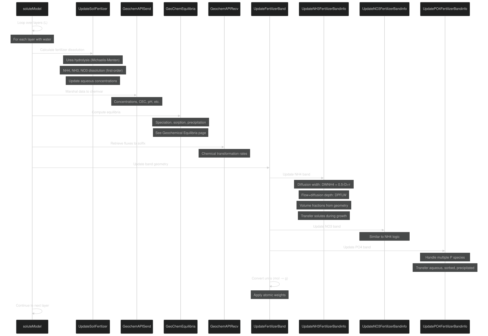

# Fertilizer Band Dynamics

Relevant source files

- [f90src/APIs/GeochemAPI.F90](https://github.com/jingtao-lbl/EcoSIM/blob/7b8a4cf6/f90src/APIs/GeochemAPI.F90)
- [f90src/Geochem/Layers_chem/SoluteMod.F90](https://github.com/jingtao-lbl/EcoSIM/blob/7b8a4cf6/f90src/Geochem/Layers_chem/SoluteMod.F90)

## Purpose and Scope

This page documents the fertilizer band dynamics system in EcoSIM, which models the formation, evolution, and dissolution of localized fertilizer zones in soil. When fertilizers are applied as concentrated bands (rather than broadcast uniformly), they create high-nutrient zones that gradually diffuse into surrounding soil. This system tracks band geometry, calculates diffusion-driven expansion, and manages solute transfer between band and non-band zones.

For information about the chemical equilibria and speciation calculations that occur within each zone, see [Geochemical Equilibria](#4.3.1) . This page focuses specifically on the spatial dynamics and volume partitioning of fertilizer bands.

## Overview of the Band Model

EcoSIM implements a dual-zone model where each soil layer can be partitioned into "band" and "non-band" regions for each nutrient type (NH4, NO3, and PO4). The model tracks:

- **Band geometry**: width and depth (thickness) of fertilizer-enriched zones
- **Volume fractions**: proportion of each layer occupied by band vs. non-band
- **Concentration gradients**: separate solute concentrations in each zone
- **Dynamic evolution**: band spreading via diffusion and water flow

Diagram: Dual-Zone Band Model Structure

Sources: [f90src/Geochem/Layers_chem/SoluteMod.F90 512-612](https://github.com/jingtao-lbl/EcoSIM/blob/7b8a4cf6/f90src/Geochem/Layers_chem/SoluteMod.F90#L512-L612)  [f90src/Geochem/Layers_chem/SoluteMod.F90 615-842](https://github.com/jingtao-lbl/EcoSIM/blob/7b8a4cf6/f90src/Geochem/Layers_chem/SoluteMod.F90#L615-L842)

## Data Structures and State Variables

### Fertilizer Pool Variables

| Variable | Type | Dimensions | Units | Description | 
| --- | --- | --- | --- | --- |
| FertN_mole_soil_vr | Array | (ifert_type, L, NY, NX) | mol d⁻² | Broadcast fertilizer pools (non-band) | 
| FertN_mole_Band_vr | Array | (ifert_type, L, NY, NX) | mol d⁻² | Banded fertilizer pools | 
| ifert_N_nh4 | Index | - | - | NH4 fertilizer type index | 
| ifert_N_nh3 | Index | - | - | NH3 fertilizer type index | 
| ifert_N_urea | Index | - | - | Urea fertilizer type index | 
| ifert_N_no3 | Index | - | - | NO3 fertilizer type index | 

### Band Geometry Variables

| Variable | Dimensions | Units | Description | 
| --- | --- | --- | --- |
| BandWidthNH4_vr | (L, NY, NX) | m | NH4 band width in layer L | 
| BandThicknessNH4_vr | (L, NY, NX) | m | NH4 band thickness in layer L | 
| BandDepthNH4_col | (NY, NX) | m | Total NH4 band depth from surface | 
| ROWSpaceNH4_col | (NY, NX) | m | Row spacing for NH4 band application | 
| iFertNH4Band_col | (NY, NX) | flag | NH4 banding flag (1=banded) | 

Similar variables exist for NO3 ( `BandWidthNO3_vr` , etc.) and PO4 ( `BandWidthPO4_vr` , etc.).

### Volume Fraction Variables

| Variable | Description | 
| --- | --- |
| trcs_VLN_vr(ids_NH4, L, NY, NX) | Fraction of layer in NH4 non-band zone | 
| trcs_VLN_vr(ids_NH4B, L, NY, NX) | Fraction of layer in NH4 band zone | 
| trcs_VLN_vr(ids_NO3, L, NY, NX) | Fraction of layer in NO3 non-band zone | 
| trcs_VLN_vr(ids_NO3B, L, NY, NX) | Fraction of layer in NO3 band zone | 
| trcs_VLN_vr(ids_H1PO4, L, NY, NX) | Fraction of layer in PO4 non-band zone | 
| trcs_VLN_vr(ids_H1PO4B, L, NY, NX) | Fraction of layer in PO4 band zone | 

Note: Volume fractions for band and non-band sum to 1.0 for each nutrient type.

Sources: [f90src/Geochem/Layers_chem/SoluteMod.F90 525-575](https://github.com/jingtao-lbl/EcoSIM/blob/7b8a4cf6/f90src/Geochem/Layers_chem/SoluteMod.F90#L525-L575)  [f90src/Geochem/Layers_chem/SoluteMod.F90 630-680](https://github.com/jingtao-lbl/EcoSIM/blob/7b8a4cf6/f90src/Geochem/Layers_chem/SoluteMod.F90#L630-L680)

## Fertilizer Dissolution

Before band geometry updates, fertilizers dissolve from solid pools into aqueous solution. This occurs via first-order kinetics for most fertilizers and via enzymatic (Michaelis-Menten) kinetics for urea.

### NH4 and NH3 Dissolution

NH4 fertilizer dissolution follows first-order kinetics modified by soil water content:

where:

- `RFertNH4SpecReleaz`: specific dissolution rate constant
- `VLNH4`: volume fraction in non-band zone
- `THETW`: soil water content

NH3 dissolution is similar but independent of water content:

### Urea Hydrolysis

Urea undergoes enzymatic hydrolysis to NH3, governed by Michaelis-Menten kinetics with competitive inhibition:

where:

- `DUKM`: base Michaelis constant
- `DUKI`: inhibition constant
- `COMA`: active microbial biomass concentration
- `ZNHUI`: current inhibitor activity
- `TMicHeterActivity_vr`: total microbial activity
- `TSens4MicbGrwoth_vr`: temperature sensitivity factor

The inhibitor activity declines over time:

Sources: [f90src/Geochem/Layers_chem/SoluteMod.F90 139-215](https://github.com/jingtao-lbl/EcoSIM/blob/7b8a4cf6/f90src/Geochem/Layers_chem/SoluteMod.F90#L139-L215)  [f90src/Geochem/Layers_chem/SoluteMod.F90 334-348](https://github.com/jingtao-lbl/EcoSIM/blob/7b8a4cf6/f90src/Geochem/Layers_chem/SoluteMod.F90#L334-L348)

### NO3 and PO4 Dissolution

NO3 dissolution follows the same first-order pattern as NH4:

Phosphorus fertilizers (superphosphate as monocalcium phosphate, rock phosphate as hydroxyapatite) dissolve via mineral equilibria computed in the geochemistry module (see [Geochemical Equilibria](#4.3.1) ).

Sources: [f90src/Geochem/Layers_chem/SoluteMod.F90 346-348](https://github.com/jingtao-lbl/EcoSIM/blob/7b8a4cf6/f90src/Geochem/Layers_chem/SoluteMod.F90#L346-L348)

## Band Geometry Dynamics

Each nutrient band evolves through diffusion and advection processes. The general pattern is similar for NH4, NO3, and PO4, though specific diffusivity values differ.

Diagram: Band Geometry Update Algorithm (NH4 Example)

Sources: [f90src/Geochem/Layers_chem/SoluteMod.F90 512-612](https://github.com/jingtao-lbl/EcoSIM/blob/7b8a4cf6/f90src/Geochem/Layers_chem/SoluteMod.F90#L512-L612)

### Diffusion-Driven Width Expansion

Band width increases due to lateral diffusion of solutes:

The band width is constrained by the row spacing ( `ROWSpaceNH4_col` ) and has a minimum of 0.025 m.

### Depth Changes from Flow and Diffusion

Band depth changes due to vertical water flow and diffusion:

If the band thickness exceeds the layer depth, the excess is transferred to the next layer. If negative (band moving upward), the deficit is transferred to the previous layer.

Sources: [f90src/Geochem/Layers_chem/SoluteMod.F90 535-556](https://github.com/jingtao-lbl/EcoSIM/blob/7b8a4cf6/f90src/Geochem/Layers_chem/SoluteMod.F90#L535-L556)

### Volume Fraction Calculation

The volume fraction occupied by the band is computed from band geometry:

The band fraction is capped at 0.999 to avoid numerical issues with zero non-band volume.

Sources: [f90src/Geochem/Layers_chem/SoluteMod.F90 566-572](https://github.com/jingtao-lbl/EcoSIM/blob/7b8a4cf6/f90src/Geochem/Layers_chem/SoluteMod.F90#L566-L572)

### PO4 Band Dynamics

PO4 bands follow similar logic with nutrient-specific diffusivity:

The PO4 system tracks both H1PO4 (HPO4²⁻) and H2PO4 (H2PO4⁻) species, with both following the same band geometry. Additional complexity arises from salt model tracking of multiple phosphate complexes (FeHPO4, CaHPO4, etc.) when `salt_model` is enabled.

Sources: [f90src/Geochem/Layers_chem/SoluteMod.F90 615-842](https://github.com/jingtao-lbl/EcoSIM/blob/7b8a4cf6/f90src/Geochem/Layers_chem/SoluteMod.F90#L615-L842)

### NO3 Band Dynamics

NO3 bands use NO3 diffusivity:

NO2 is also tracked alongside NO3 in both band and non-band zones.

Sources: [f90src/Geochem/Layers_chem/SoluteMod.F90 845-938](https://github.com/jingtao-lbl/EcoSIM/blob/7b8a4cf6/f90src/Geochem/Layers_chem/SoluteMod.F90#L845-L938)

## Solute Transfer Between Zones

As band volume fractions change, solutes must be redistributed between band and non-band zones to maintain mass conservation.

### Transfer During Band Growth

When the non-band volume fraction decreases (band expands), solutes are transferred from non-band to band:

This ensures that the total mass remains constant while concentrations equilibrate to the new volume fractions.

Sources: [f90src/Geochem/Layers_chem/SoluteMod.F90 575-590](https://github.com/jingtao-lbl/EcoSIM/blob/7b8a4cf6/f90src/Geochem/Layers_chem/SoluteMod.F90#L575-L590)

### Transfer for Phosphorus Species

Phosphorus transfer is more complex due to multiple species (aqueous, sorbed, precipitated):

When `salt_model` is enabled, additional salt species are also transferred (FeHPO4, CaHPO4, H3PO4, etc.).

Sources: [f90src/Geochem/Layers_chem/SoluteMod.F90 688-754](https://github.com/jingtao-lbl/EcoSIM/blob/7b8a4cf6/f90src/Geochem/Layers_chem/SoluteMod.F90#L688-L754)

### Band Amalgamation

When a band no longer occupies a layer (depth or width becomes zero), all band-zone solutes are merged into the non-band zone:

This prevents computational issues with very small band volumes and simplifies the representation when bands have dissipated.

Sources: [f90src/Geochem/Layers_chem/SoluteMod.F90 591-609](https://github.com/jingtao-lbl/EcoSIM/blob/7b8a4cf6/f90src/Geochem/Layers_chem/SoluteMod.F90#L591-L609)  [f90src/Geochem/Layers_chem/SoluteMod.F90 786-840](https://github.com/jingtao-lbl/EcoSIM/blob/7b8a4cf6/f90src/Geochem/Layers_chem/SoluteMod.F90#L786-L840)

## Execution Flow and Integration

The fertilizer band system integrates with the broader geochemistry calculations through the following execution sequence:

Diagram: Execution Sequence for Fertilizer Band Updates

Sources: [f90src/APIs/GeochemAPI.F90 23-150](https://github.com/jingtao-lbl/EcoSIM/blob/7b8a4cf6/f90src/APIs/GeochemAPI.F90#L23-L150)  [f90src/Geochem/Layers_chem/SoluteMod.F90 61-135](https://github.com/jingtao-lbl/EcoSIM/blob/7b8a4cf6/f90src/Geochem/Layers_chem/SoluteMod.F90#L61-L135)

### Key Function Descriptions

| Function | File | Lines | Description | 
| --- | --- | --- | --- |
| soluteModel | GeochemAPI.F90 | 23-150 | Main entry point; loops over layers, calls subfunctions | 
| UpdateSoilFertlizer | SoluteMod.F90 | 218-508 | Calculates fertilizer dissolution rates and updates concentrations | 
| UreaHydrolysis | SoluteMod.F90 | 139-215 | Michaelis-Menten kinetics for urea → NH3 | 
| GeochemAPISend | GeochemAPI.F90 | 154-256 | Marshals data into chemvar structure for equilibria | 
| GeoChemEquilibria | SoluteMod.F90 | 43-56 | Dispatcher to salt or non-salt equilibria routines | 
| GeochemAPIRecv | GeochemAPI.F90 | 260-369 | Unpacks equilibria results from solflx structure | 
| UpdateFertilizerBand | SoluteMod.F90 | 61-135 | Orchestrates band updates for all nutrients | 
| UpdateNH3FertilizerBandinfo | SoluteMod.F90 | 512-612 | NH4/NH3 band geometry and transfer logic | 
| UpdateNO3FertilizerBandinfo | SoluteMod.F90 | 845-938 | NO3/NO2 band geometry and transfer logic | 
| UpdatePO4FertilizerBandinfo | SoluteMod.F90 | 615-842 | PO4 band geometry and multi-species transfer | 

### Unit Conversions

After geochemical calculations and band updates, fluxes are converted from molar to mass units:

where `natomw` is the nitrogen atomic weight (14 g/mol) and `patomw` is the phosphorus atomic weight (31 g/mol).

Sources: [f90src/Geochem/Layers_chem/SoluteMod.F90 117-132](https://github.com/jingtao-lbl/EcoSIM/blob/7b8a4cf6/f90src/Geochem/Layers_chem/SoluteMod.F90#L117-L132)

## Summary

The fertilizer band dynamics system provides a spatially explicit representation of localized fertilizer applications. Key features include:

This system enables realistic simulation of band fertilizer management practices and their effects on nutrient availability, plant uptake, and environmental losses.

Sources: [f90src/Geochem/Layers_chem/SoluteMod.F90 1-1294](https://github.com/jingtao-lbl/EcoSIM/blob/7b8a4cf6/f90src/Geochem/Layers_chem/SoluteMod.F90#L1-L1294)  [f90src/APIs/GeochemAPI.F90 1-372](https://github.com/jingtao-lbl/EcoSIM/blob/7b8a4cf6/f90src/APIs/GeochemAPI.F90#L1-L372)