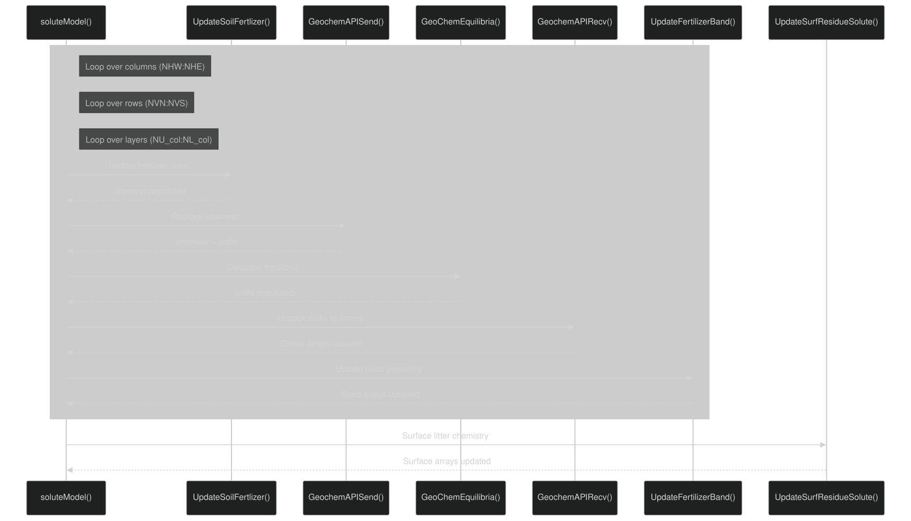

# Soil Chemistry and Geochemistry

Relevant source files

- [f90src/APIs/GeochemAPI.F90](https://github.com/jingtao-lbl/EcoSIM/blob/7b8a4cf6/f90src/APIs/GeochemAPI.F90)
- [f90src/Geochem/Layers_chem/SoluteMod.F90](https://github.com/jingtao-lbl/EcoSIM/blob/7b8a4cf6/f90src/Geochem/Layers_chem/SoluteMod.F90)

## Purpose and Scope

This document describes the soil chemistry and geochemistry system in EcoSIM, which simulates chemical equilibria, nutrient speciation, sorption/desorption, precipitation/dissolution, and fertilizer dynamics in soil. The system handles nitrogen (NH₄⁺, NH₃, NO₃⁻) and phosphorus (HPO₄²⁻, H₂PO₄⁻) transformations driven by pH, cation/anion exchange, and mineral equilibria. It also models fertilizer band formation and diffusion, which is critical for representing banded fertilizer applications commonly used in agriculture.

For microbial nitrogen and phosphorus cycling processes (mineralization, immobilization), see [Microbial Model](#4.2) . For nutrient transport through soil, see [Transport Processes](#5.2) . This document focuses specifically on abiotic chemical transformations and equilibria.

## System Architecture

The geochemistry system is implemented through the `GeochemAPI` module, which orchestrates chemical calculations for each soil layer. The API pattern separates data marshaling from core chemistry calculations, similar to other EcoSIM process modules.

### Overall Geochemistry Workflow

Sources:  [f90src/APIs/GeochemAPI.F90 23-150](https://github.com/jingtao-lbl/EcoSIM/blob/7b8a4cf6/f90src/APIs/GeochemAPI.F90#L23-L150)  [f90src/Geochem/Layers_chem/SoluteMod.F90 43-56](https://github.com/jingtao-lbl/EcoSIM/blob/7b8a4cf6/f90src/Geochem/Layers_chem/SoluteMod.F90#L43-L56)

## Core Geochemical Processes

### Nitrogen Chemistry

The system tracks nitrogen in multiple forms and calculates pH-dependent equilibria between them:

| Nitrogen Form | Variable Prefix | Chemical Species | Notes | 
| --- | --- | --- | --- |
| Ammonium | NH4, ids_NH4 | NH₄⁺ | Sorbed via cation exchange | 
| Ammonia | NH3, idg_NH3 | NH₃ | Gaseous, pH-dependent | 
| Nitrate | NO3, ids_NO3 | NO₃⁻ | Highly mobile anion | 
| Nitrite | NO2, ids_NO2 | NO₂⁻ | Intermediate | 

NH₄⁺/NH₃ Equilibrium
The ammonium-ammonia equilibrium is pH-dependent and drives ammonia volatilization:

Dissociation is calculated using constant `DPN4` with rate `RNH4` :

Sources:  [f90src/Geochem/Layers_chem/SoluteMod.F90 1226](https://github.com/jingtao-lbl/EcoSIM/blob/7b8a4cf6/f90src/Geochem/Layers_chem/SoluteMod.F90#L1226-L1226)
Ammonium Sorption
NH₄⁺ undergoes cation exchange on negatively charged soil surfaces. The system uses Gapon selectivity coefficients to calculate equilibrium between solution and exchangeable forms:

Where:

- `XN4Q_mole_conc`: Equilibrium exchangeable NH₄⁺
- `XCAX`: Exchangeable Ca²⁺ concentration
- `GKC4_vr`: Gapon coefficient for Ca-NH₄ exchange
- `TADC0`: Sorption rate constant
- `RXN4`: Net sorption flux

Sources:  [f90src/Geochem/Layers_chem/SoluteMod.F90 1205-1225](https://github.com/jingtao-lbl/EcoSIM/blob/7b8a4cf6/f90src/Geochem/Layers_chem/SoluteMod.F90#L1205-L1225)
Urea Hydrolysis
Urea fertilizer undergoes enzymatic hydrolysis to ammonia:

The system implements Michaelis-Menten kinetics with inhibition:

Where:

- `DUKM``DUKI`, : Base Km and inhibition constant
- `COMA`: Active biomass concentration
- `DFNSA`: Michaelis-Menten function
- `ZNHUI_vr`: Inhibitor activity (decreases over time)
- `TSens4MicbGrwoth_vr`: Temperature sensitivity

Sources:  [f90src/Geochem/Layers_chem/SoluteMod.F90 139-214](https://github.com/jingtao-lbl/EcoSIM/blob/7b8a4cf6/f90src/Geochem/Layers_chem/SoluteMod.F90#L139-L214)

### Phosphorus Chemistry

Phosphorus chemistry is complex due to pH-dependent speciation, sorption on variable-charge surfaces, and precipitation/dissolution of multiple mineral phases.
Phosphorus Speciation

The system tracks both H₂PO₄⁻ and HPO₄²⁻ forms, with equilibrium:

Sources:  [f90src/Geochem/Layers_chem/SoluteMod.F90 1172-1175](https://github.com/jingtao-lbl/EcoSIM/blob/7b8a4cf6/f90src/Geochem/Layers_chem/SoluteMod.F90#L1172-L1175)
Phosphorus Sorption
Phosphate anions adsorb on positively charged surfaces (protonated Fe/Al hydroxides) through ligand exchange. The system tracks three exchange site types:

| Site Type | Variable | Description | 
| --- | --- | --- |
| R-O⁻ | idx_OHe, XOH_mole_conc | Deprotonated sites | 
| R-OH | idx_OH, XROH1_mole_conc | Neutral sites | 
| R-OH₂⁺ | idx_OHp, XROH2_mole_conc | Protonated sites | 

Sorbed phosphate forms:

- `idx_HPO4`: R-HPO₄ (sorbed HPO₄²⁻)
- `idx_H2PO4`: R-H₂PO₄ (sorbed H₂PO₄⁻)

Sources:  [f90src/Geochem/Layers_chem/SoluteMod.F90 424-428](https://github.com/jingtao-lbl/EcoSIM/blob/7b8a4cf6/f90src/Geochem/Layers_chem/SoluteMod.F90#L424-L428)  [f90src/Geochem/Layers_chem/SoluteMod.F90 461-465](https://github.com/jingtao-lbl/EcoSIM/blob/7b8a4cf6/f90src/Geochem/Layers_chem/SoluteMod.F90#L461-L465)
Phosphorus Mineral Phases
The system models precipitation and dissolution of five phosphate minerals:

Each mineral has a solubility product controlling dissolution:

AlPO₄ (Variscite) :

FePO₄ (Strengite) : Similar formulation with `SYF0P2` and Fe³⁺

CaHPO₄·2H₂O (Dicalcium phosphate) :

Ca(H₂PO₄)₂ (Monocalcium phosphate) : Used to represent superphosphate fertilizer

Ca₅(PO₄)₃OH (Hydroxyapatite) : Used to represent rock phosphate fertilizer

All fluxes include constraints to prevent mineral concentrations from going negative and to limit precipitation by organic carbon content.

Sources:  [f90src/Geochem/Layers_chem/SoluteMod.F90 1116-1158](https://github.com/jingtao-lbl/EcoSIM/blob/7b8a4cf6/f90src/Geochem/Layers_chem/SoluteMod.F90#L1116-L1158)

### Chemical Equilibrium Calculation Methods

The system supports two modes for chemical equilibrium calculations:

| Mode | Condition | Handler | 
| --- | --- | --- |
| Salt model | salt_model = .true. | SaltChemEquilibria() | 
| Non-salt model | salt_model = .false. | NoSaltChemEquilibria() | 

The salt model tracks full speciation of major ions (Ca²⁺, Mg²⁺, Na⁺, K⁺, Al³⁺, Fe³⁺, SO₄²⁻, Cl⁻, CO₃²⁻, HCO₃⁻) and their complexes. The non-salt model uses a simplified approach focusing on N and P species.

Sources:  [f90src/Geochem/Layers_chem/SoluteMod.F90 50-54](https://github.com/jingtao-lbl/EcoSIM/blob/7b8a4cf6/f90src/Geochem/Layers_chem/SoluteMod.F90#L50-L54)

## Fertilizer Band Dynamics

### Band Geometry Concept

When fertilizers are applied in bands (common practice for NH₄⁺, NO₃⁻, and PO₄³⁻), the model tracks a "band zone" and "non-band zone" separately. This allows representation of localized high nutrient concentrations near application points.

Key variables for each nutrient band:

NH₄⁺/NH₃ Band :

- `BandWidthNH4_vr(L,NY,NX)`: Band width in layer L
- `BandThicknessNH4_vr(L,NY,NX)`: Band thickness in layer L
- `BandDepthNH4_col(NY,NX)`: Total band depth
- `ROWSpaceNH4_col(NY,NX)`: Row spacing (max band width)
- `trcs_VLN_vr(ids_NH4,L,NY,NX)`: Volume fraction of non-band
- `trcs_VLN_vr(ids_NH4B,L,NY,NX)`: Volume fraction of band

NO₃⁻ Band : Similar with `NO3` suffix

PO₄³⁻ Band : Similar with `PO4` suffix

Sources:  [f90src/Geochem/Layers_chem/SoluteMod.F90 512-612](https://github.com/jingtao-lbl/EcoSIM/blob/7b8a4cf6/f90src/Geochem/Layers_chem/SoluteMod.F90#L512-L612)  [f90src/Geochem/Layers_chem/SoluteMod.F90 615-842](https://github.com/jingtao-lbl/EcoSIM/blob/7b8a4cf6/f90src/Geochem/Layers_chem/SoluteMod.F90#L615-L842)  [f90src/Geochem/Layers_chem/SoluteMod.F90 845-938](https://github.com/jingtao-lbl/EcoSIM/blob/7b8a4cf6/f90src/Geochem/Layers_chem/SoluteMod.F90#L845-L938)

### Band Width and Depth Dynamics

Fertilizer bands expand due to diffusion and water flow. The width increases by:

Depth increases due to vertical water flow and diffusion:

Sources:  [f90src/Geochem/Layers_chem/SoluteMod.F90 78](https://github.com/jingtao-lbl/EcoSIM/blob/7b8a4cf6/f90src/Geochem/Layers_chem/SoluteMod.F90#L78-L78)  [f90src/Geochem/Layers_chem/SoluteMod.F90 535-556](https://github.com/jingtao-lbl/EcoSIM/blob/7b8a4cf6/f90src/Geochem/Layers_chem/SoluteMod.F90#L535-L556)

### Volume Fraction Calculation

The fraction of soil volume occupied by the band is:

This ensures:

- Band fraction ≤ 0.999 (prevents numerical issues)
- Non-band + band = 1.0
- Both NH₄⁺ and NH₃ use same volume fractions

Sources:  [f90src/Geochem/Layers_chem/SoluteMod.F90 566-575](https://github.com/jingtao-lbl/EcoSIM/blob/7b8a4cf6/f90src/Geochem/Layers_chem/SoluteMod.F90#L566-L575)

### Mass Transfer Between Band and Non-Band

When band volume changes, solutes are transferred proportionally:

Sources:  [f90src/Geochem/Layers_chem/SoluteMod.F90 575-590](https://github.com/jingtao-lbl/EcoSIM/blob/7b8a4cf6/f90src/Geochem/Layers_chem/SoluteMod.F90#L575-L590)

### Band Amalgamation

If a band shrinks to zero size (depth or width becomes zero), it merges back into the non-band zone:

Sources:  [f90src/Geochem/Layers_chem/SoluteMod.F90 591-609](https://github.com/jingtao-lbl/EcoSIM/blob/7b8a4cf6/f90src/Geochem/Layers_chem/SoluteMod.F90#L591-L609)

## Data Structures and Variable Organization

### Chemical Variable Type (chem_var_type)

The `chem_var_type` contains all state variables needed for chemistry calculations:

| Category | Example Variables | Description | 
| --- | --- | --- |
| pH and ionic strength | PH, TBION_soil | Soil pH and total ionic strength | 
| Water volumes | VLWatMicPM, VLWatMicPNH, VLWatMicPPO | Water volume in micropores, NH₄ zone, PO₄ zone | 
| Soil mass | SoilMicPMassLayer, BKVLNH, BKVLPO | Soil mass for sorption calculations | 
| Exchange capacity | XCEC, XAEC | Cation and anion exchange capacity | 
| Metal oxides | CAL, CFE, CCA | Aluminum, iron, calcium oxide content | 
| Major cations (salt model) | ZCA, ZMG, ZNA, ZKA, ZAL, ZFE | Ca²⁺, Mg²⁺, Na⁺, K⁺, Al³⁺, Fe³⁺ | 
| Major anions (salt model) | ZSO4, ZCL, ZCO3, ZHCO3 | SO₄²⁻, Cl⁻, CO₃²⁻, HCO₃⁻ | 
| Complexes (salt model) | ZALOH1-4, ZFEOH1-4, ZCAO, ZMGO | Metal hydroxide complexes | 
| Phosphate complexes | ZFE1P, ZFE2P, ZCA0P, ZCA1P, ZCA2P | Metal-phosphate complexes | 
| Nitrate | ZNO3S, ZNO3B | NO₃⁻ in soil and band | 
| CO₂ | CO2S | Dissolved CO₂ | 
| Exchangeable | XHY, XAL, XFE, XCA, XMG, XNA, XKA | Exchangeable cations | 
| Gapon coefficients | GKC4, GKCA, GKCH, GKCM, GKCK, GKCN | Selectivity coefficients | 
| Band fractions | VLNH4, VLNHB, VLNO3, VLNOB, VLPO4, VLPOB | Volume fractions | 

Sources:  [f90src/APIs/GeochemAPI.F90 154-255](https://github.com/jingtao-lbl/EcoSIM/blob/7b8a4cf6/f90src/APIs/GeochemAPI.F90#L154-L255)

### Solute Flux Type (solute_flx_type)

The `solute_flx_type` contains all fluxes calculated by chemistry:

| Flux Category | Variable Pattern | Units | Description | 
| --- | --- | --- | --- |
| NH₄⁺ transformations | TRChem_NH4_soil_mole, TRChem_NH4_band_soil_mole | mol d⁻² h⁻¹ | NH₄⁺ dissolution/precipitation | 
| NH₃ transformations | TRChem_NH3_soil_mole, TRChem_NH3_band_soil | mol d⁻² h⁻¹ | NH₃ dissolution/volatilization | 
| PO₄ speciation | TRChem_H1PO4_soil, TRChem_H2PO4_soil | mol d⁻² h⁻¹ | HPO₄²⁻ and H₂PO₄⁻ dissolution | 
| NH₄⁺ sorption | TRChem_NH4_sorbed_soil, TRChem_NH4_sorbed_band_soil | mol d⁻² h⁻¹ | Cation exchange | 
| PO₄ sorption | TRChem_RHPO4_sorbed_soil, TRChem_RH2PO4_sorbed_soil | mol d⁻² h⁻¹ | Anion exchange (non-band) | 
| PO₄ sorption (band) | TRChem_RHPO4_sorbed_band_soil, TRChem_RH2PO4_sorbed_band_soil | mol d⁻² h⁻¹ | Anion exchange (band) | 
| P mineral precipitation | TRChem_AlPO4_precip_soil, TRChem_FePO4_precip_soil, etc. | mol d⁻² h⁻¹ | Mineral dissolution (-) / precipitation (+) | 
| CO₂ production | TRChem_CO2_gchem_soil | mol d⁻² h⁻¹ | CO₂ from carbonate reactions | 
| Salt ions (if enabled) | TRChem_Al_3p_soil, TRChem_Fe_3p_soil, etc. | mol d⁻² h⁻¹ | Major ion transformations | 
| Water | TRH2O_soil | g d⁻² h⁻¹ | Water produced/consumed | 
| Ionic strength | TBION_soil | mol L⁻¹ | Total ionic strength | 
| Aqueous chemistry CO₂ | TRAquaChem_CO2_soil | mol d⁻² h⁻¹ | CO₂ from aqueous reactions | 

These fluxes are computed in `GeoChemEquilibria()` and then received into global state arrays via `GeochemAPIRecv()` .

Sources:  [f90src/APIs/GeochemAPI.F90 260-369](https://github.com/jingtao-lbl/EcoSIM/blob/7b8a4cf6/f90src/APIs/GeochemAPI.F90#L260-L369)

## Execution Flow

### Main Loop Structure

Sources:  [f90src/APIs/GeochemAPI.F90 95-149](https://github.com/jingtao-lbl/EcoSIM/blob/7b8a4cf6/f90src/APIs/GeochemAPI.F90#L95-L149)

### Detailed Fertilizer Processing

Within `UpdateSoilFertlizer()` , the following sequence occurs:

### Unit Conversions

Chemistry calculations are performed in molar units (mol d⁻² h⁻¹), but EcoSIM uses mass units (g d⁻² h⁻¹) for transport. `UpdateFertilizerBand()` performs conversions:

Where:

- `catomw`: Carbon atomic weight (12.0)
- `natomw`: Nitrogen atomic weight (14.0)
- `patomw`: Phosphorus atomic weight (31.0)

Sources:  [f90src/Geochem/Layers_chem/SoluteMod.F90 117-132](https://github.com/jingtao-lbl/EcoSIM/blob/7b8a4cf6/f90src/Geochem/Layers_chem/SoluteMod.F90#L117-L132)

## Surface Residue Chemistry

Surface litter (layer 0) undergoes similar chemistry but with some differences:

Sources:  [f90src/Geochem/Layers_chem/SoluteMod.F90 941-1292](https://github.com/jingtao-lbl/EcoSIM/blob/7b8a4cf6/f90src/Geochem/Layers_chem/SoluteMod.F90#L941-L1292)

## Integration with Transport

The geochemistry module produces source/sink terms that are used by the transport system:

| Array | Description | Used By | 
| --- | --- | --- |
| trcn_RprodChem_soil_vr(ids,L,NY,NX) | Solute production from chemistry | Solute transport TranspNoSaltMod | 
| trcn_RProdChem_band_soil_vr(ids,L,NY,NX) | Solute production in bands | Solute transport | 
| trcx_TRSoilChem_vr(idx,L,NY,NX) | Exchangeable changes | Exchange site updates | 
| trcp_RChem_soil_vr(idsp,L,NY,NX) | Precipitate changes | Mineral pool updates | 
| TProd_CO2_geochem_soil_vr(L,NY,NX) | CO₂ production | Gas transport TranspNoSaltMod | 
| TProd_gas_NH3_geochem_vr(L,NY,NX) | NH₃ gas production | Gas transport | 

These arrays are zeroed at the start of each timestep and accumulated by chemistry, then used by transport to update concentrations.

Sources:  [f90src/APIs/GeochemAPI.F90 269-297](https://github.com/jingtao-lbl/EcoSIM/blob/7b8a4cf6/f90src/APIs/GeochemAPI.F90#L269-L297)

## Key Parameters and Constants

The geochemistry system relies on numerous equilibrium constants and rate parameters:

| Parameter | Variable/Value | Description | 
| --- | --- | --- |
| Water dissociation | DPH2O | Kw = 10⁻¹⁴ at 25°C | 
| NH₄⁺ dissociation | DPN4 | pKa ≈ 9.25 | 
| H₂PO₄⁻ dissociation | DPH2P | pKa = 7.20 | 
| Urea hydrolysis Km | DUKM | Base Michaelis constant | 
| Urea inhibition | DUKI | Inhibitor sensitivity | 
| Al(OH)₃ solubility | SPALO | Controls Al³⁺ speciation | 
| Fe(OH)₃ solubility | SPFEO | Controls Fe³⁺ speciation | 
| AlPO₄ solubility | SYA0P2 | Derived from SPALO | 
| FePO₄ solubility | SYF0P2 | Derived from SPFEO | 
| CaHPO₄ solubility | SYCAD2 | Dicalcium phosphate | 
| Ca(H₂PO₄)₂ solubility | SPCAM | Monocalcium phosphate | 
| Apatite solubility | SYCAH2 | Hydroxyapatite | 
| CaCO₃ dissociation | DPCO3 | pKa ≈ 10.3 | 
| Sorption rate | TADC0 | Rate constant for adsorption | 
| Dissolution rate | TPD | Rate constant for minerals | 
| Speciation rate | TSL | Rate constant for aqueous reactions | 
| NH₄⁺ fertilizer release | RFertNH4SpecReleaz | First-order rate | 
| NH₃ fertilizer release | RFertNH3SpecReleaz | First-order rate | 
| NO₃⁻ fertilizer release | RFertNO3SpecReleaz | First-order rate | 
| Urea hydrolysis rate | RFertUreaSpecHydrol | Specific rate constant | 

These parameters are defined in various parameter modules and used throughout the chemistry calculations.

Sources:  [f90src/Geochem/Layers_chem/SoluteMod.F90 1-27](https://github.com/jingtao-lbl/EcoSIM/blob/7b8a4cf6/f90src/Geochem/Layers_chem/SoluteMod.F90#L1-L27)