# Biogeochemical Process Models

Relevant source files

- [drivers/boxsbgc/ForcTypeMod.F90](https://github.com/jingtao-lbl/EcoSIM/blob/7b8a4cf6/drivers/boxsbgc/ForcTypeMod.F90)
- [drivers/boxsbgc/batchmod.F90](https://github.com/jingtao-lbl/EcoSIM/blob/7b8a4cf6/drivers/boxsbgc/batchmod.F90)
- [f90src/APIData/PlantAPIData.F90](https://github.com/jingtao-lbl/EcoSIM/blob/7b8a4cf6/f90src/APIData/PlantAPIData.F90)
- [f90src/APIs/GeochemAPI.F90](https://github.com/jingtao-lbl/EcoSIM/blob/7b8a4cf6/f90src/APIs/GeochemAPI.F90)
- [f90src/APIs/MicBGCAPI.F90](https://github.com/jingtao-lbl/EcoSIM/blob/7b8a4cf6/f90src/APIs/MicBGCAPI.F90)
- [f90src/APIs/PlantAPI.F90](https://github.com/jingtao-lbl/EcoSIM/blob/7b8a4cf6/f90src/APIs/PlantAPI.F90)
- [f90src/Geochem/Layers_chem/SoluteMod.F90](https://github.com/jingtao-lbl/EcoSIM/blob/7b8a4cf6/f90src/Geochem/Layers_chem/SoluteMod.F90)

## Purpose and Scope

This page provides an overview of the biogeochemical process models that form the simulation core of EcoSIM. These models simulate the cycling of carbon, nitrogen, phosphorus, and other elements through terrestrial ecosystems. EcoSIM integrates three major biogeochemical process models:

For detailed information about each model:

- [Plant Model](#4.1)Plant processes are documented in
- [Microbial Model](#4.2)Microbial processes are documented in
- [Soil Chemistry and Geochemistry](#4.3)Geochemical processes are documented in

For information about physical processes (water flow, heat transfer, transport), see [Physical Processes and Transport](#5) .

## Three Core Process Models

EcoSIM's biogeochemical simulation is organized around three specialized process models, each implemented through a dedicated API module:

| Process Model | API Module | Primary Functions | Key State Variables | 
| --- | --- | --- | --- |
| Plant Model | PlantAPI.F90 | Photosynthesis, growth allocation, root uptake, litterfall | Canopy biomass, root biomass, leaf area, nutrient concentrations | 
| Microbial Model | MicBGCAPI.F90 | Organic matter decomposition, respiration, nutrient mineralization | Microbial biomass (heterotrophs, autotrophs), SOM pools, DOM | 
| Geochemistry Model | GeochemAPI.F90 | Chemical equilibria, sorption/desorption, precipitation/dissolution | NH4, NO3, PO4 speciation, pH, exchangeable cations | 

Each model operates on a common set of soil layers and exchanges fluxes of carbon, nutrients, water, and gases with the other models and the physical environment.

Sources:  [f90src/APIs/PlantAPI.F90 1-48](https://github.com/jingtao-lbl/EcoSIM/blob/7b8a4cf6/f90src/APIs/PlantAPI.F90#L1-L48)  [f90src/APIs/MicBGCAPI.F90 1-51](https://github.com/jingtao-lbl/EcoSIM/blob/7b8a4cf6/f90src/APIs/MicBGCAPI.F90#L1-L51)  [f90src/APIs/GeochemAPI.F90 1-20](https://github.com/jingtao-lbl/EcoSIM/blob/7b8a4cf6/f90src/APIs/GeochemAPI.F90#L1-L20)

## API Architecture and Communication Pattern

### API Send-Recv Pattern

All three biogeochemical models follow a consistent API communication pattern that marshals data between the global EcoSIM state arrays and local model-specific data structures:

Sources:  [f90src/APIs/PlantAPI.F90 48-97](https://github.com/jingtao-lbl/EcoSIM/blob/7b8a4cf6/f90src/APIs/PlantAPI.F90#L48-L97)  [f90src/APIs/MicBGCAPI.F90 154-408](https://github.com/jingtao-lbl/EcoSIM/blob/7b8a4cf6/f90src/APIs/MicBGCAPI.F90#L154-L408)  [f90src/APIs/GeochemAPI.F90 154-256](https://github.com/jingtao-lbl/EcoSIM/blob/7b8a4cf6/f90src/APIs/GeochemAPI.F90#L154-L256)

### Key API Functions

Each API module implements two primary interface functions:

Plant API:

- `PlantAPISend(I,J,NY,NX)`[f90src/APIs/PlantAPI.F90693-1186](https://github.com/jingtao-lbl/EcoSIM/blob/7b8a4cf6/f90src/APIs/PlantAPI.F90#L693-L1186)- Copies global state to plant-specific data structures
- `PlantAPIRecv(I,J,NY,NX)`[f90src/APIs/PlantAPI.F9048-556](https://github.com/jingtao-lbl/EcoSIM/blob/7b8a4cf6/f90src/APIs/PlantAPI.F90#L48-L556)- Updates global state with plant model outputs

Microbial BGC API:

- `MicAPISend(I,J,L,NY,NX,micfor,micstt,micflx)`[f90src/APIs/MicBGCAPI.F90154-408](https://github.com/jingtao-lbl/EcoSIM/blob/7b8a4cf6/f90src/APIs/MicBGCAPI.F90#L154-L408)- Populates microbial forcing and state structures
- `MicAPIRecv(I,J,L,NY,NX,micfor,micstt,micflx,naqfdiag,nmicdiag)`[f90src/APIs/MicBGCAPI.F90413-499](https://github.com/jingtao-lbl/EcoSIM/blob/7b8a4cf6/f90src/APIs/MicBGCAPI.F90#L413-L499)- Returns microbial fluxes to global arrays

Geochemistry API:

- `GeochemAPISend(L,NY,NX,chemvar,solflx)`[f90src/APIs/GeochemAPI.F90154-256](https://github.com/jingtao-lbl/EcoSIM/blob/7b8a4cf6/f90src/APIs/GeochemAPI.F90#L154-L256)- Prepares chemistry state variables
- `GeochemAPIRecv(L,NY,NX,solflx)`[f90src/APIs/GeochemAPI.F90260-369](https://github.com/jingtao-lbl/EcoSIM/blob/7b8a4cf6/f90src/APIs/GeochemAPI.F90#L260-L369)- Updates nutrient concentrations and chemical fluxes

Sources:  [f90src/APIs/PlantAPI.F90 41-42](https://github.com/jingtao-lbl/EcoSIM/blob/7b8a4cf6/f90src/APIs/PlantAPI.F90#L41-L42)  [f90src/APIs/MicBGCAPI.F90 154-408](https://github.com/jingtao-lbl/EcoSIM/blob/7b8a4cf6/f90src/APIs/MicBGCAPI.F90#L154-L408)  [f90src/APIs/GeochemAPI.F90 154-369](https://github.com/jingtao-lbl/EcoSIM/blob/7b8a4cf6/f90src/APIs/GeochemAPI.F90#L154-L369)

## Biogeochemical Process Flow

### Sequential Execution Within Timestep

The biogeochemical models are called sequentially within each hourly timestep, with each model reading the current state and updating fluxes that affect subsequent models:

This sequence ensures that:

Sources:  [f90src/APIs/MicBGCAPI.F90 78-134](https://github.com/jingtao-lbl/EcoSIM/blob/7b8a4cf6/f90src/APIs/MicBGCAPI.F90#L78-L134)  [f90src/APIs/GeochemAPI.F90 23-150](https://github.com/jingtao-lbl/EcoSIM/blob/7b8a4cf6/f90src/APIs/GeochemAPI.F90#L23-L150)

## Layer-by-Layer Processing

### Microbial Model Layer Iteration

The microbial model processes each soil layer independently, allowing for vertical heterogeneity in decomposition rates, oxygen availability, and nutrient transformations:

Layer 0 represents the surface litter layer, while layers `NU_col` through `NL_col` represent mineral soil layers. Inactive layers (frozen, dry, or above the active soil surface) are skipped.

Sources:  [f90src/APIs/MicBGCAPI.F90 100-134](https://github.com/jingtao-lbl/EcoSIM/blob/7b8a4cf6/f90src/APIs/MicBGCAPI.F90#L100-L134)  [f90src/APIs/MicBGCAPI.F90 138-151](https://github.com/jingtao-lbl/EcoSIM/blob/7b8a4cf6/f90src/APIs/MicBGCAPI.F90#L138-L151)

### Geochemistry Model Layer Iteration

The geochemistry model similarly processes each active mineral soil layer, solving for chemical equilibria in both micropore and macropore (band) zones:

The model distinguishes between:

- **Micropore (non-band) zone**: Bulk soil solution
- **Macropore (band) zone**: Localized fertilizer bands with high nutrient concentrations

Sources:  [f90src/APIs/GeochemAPI.F90 95-150](https://github.com/jingtao-lbl/EcoSIM/blob/7b8a4cf6/f90src/APIs/GeochemAPI.F90#L95-L150)  [f90src/APIs/GeochemAPI.F90 132-140](https://github.com/jingtao-lbl/EcoSIM/blob/7b8a4cf6/f90src/APIs/GeochemAPI.F90#L132-L140)

## Data Type Hierarchy

### Plant Model Data Structures

The plant model uses a hierarchical set of derived types organized by functional area:

These types are instantiated as module-level variables in `PlantAPIData` (e.g., `plt_site` , `plt_photo` , `plt_rad` , etc.) and populated by `PlantAPISend` before each plant model call.

Sources:  [f90src/APIData/PlantAPIData.F90 32-88](https://github.com/jingtao-lbl/EcoSIM/blob/7b8a4cf6/f90src/APIData/PlantAPIData.F90#L32-L88)  [f90src/APIData/PlantAPIData.F90 90-161](https://github.com/jingtao-lbl/EcoSIM/blob/7b8a4cf6/f90src/APIData/PlantAPIData.F90#L90-L161)  [f90src/APIData/PlantAPIData.F90 163-208](https://github.com/jingtao-lbl/EcoSIM/blob/7b8a4cf6/f90src/APIData/PlantAPIData.F90#L163-L208)

### Microbial Model Data Structures

The microbial model uses three primary types for forcing, state, and fluxes:

The types are defined in separate modules:

- `MicForcTypeMod`[f90src/APIs/MicBGCAPI.F909](https://github.com/jingtao-lbl/EcoSIM/blob/7b8a4cf6/f90src/APIs/MicBGCAPI.F90#L9-L9)- Forcing data
- `MicStateTraitTypeMod`[f90src/APIs/MicBGCAPI.F907](https://github.com/jingtao-lbl/EcoSIM/blob/7b8a4cf6/f90src/APIs/MicBGCAPI.F90#L7-L7)- State variables
- `MicFLuxTypeMod`[f90src/APIs/MicBGCAPI.F906](https://github.com/jingtao-lbl/EcoSIM/blob/7b8a4cf6/f90src/APIs/MicBGCAPI.F90#L6-L6)- Flux rates

Sources:  [f90src/APIs/MicBGCAPI.F90 6-11](https://github.com/jingtao-lbl/EcoSIM/blob/7b8a4cf6/f90src/APIs/MicBGCAPI.F90#L6-L11)  [f90src/APIs/MicBGCAPI.F90 40-43](https://github.com/jingtao-lbl/EcoSIM/blob/7b8a4cf6/f90src/APIs/MicBGCAPI.F90#L40-L43)

### Geochemistry Model Data Structures

The geochemistry model uses two primary types:

These are defined in `SoluteChemDataType` and `AqueChemDatatype` modules and are instantiated locally within the `soluteModel` subroutine.

Sources:  [f90src/APIs/GeochemAPI.F90 4-8](https://github.com/jingtao-lbl/EcoSIM/blob/7b8a4cf6/f90src/APIs/GeochemAPI.F90#L4-L8)  [f90src/APIs/GeochemAPI.F90 36-37](https://github.com/jingtao-lbl/EcoSIM/blob/7b8a4cf6/f90src/APIs/GeochemAPI.F90#L36-L37)

## Coupling Between Process Models

### Material Exchange

The three biogeochemical models are tightly coupled through shared state variables and fluxes:

Key coupling mechanisms:

Sources:  [f90src/APIs/PlantAPI.F90 86-149](https://github.com/jingtao-lbl/EcoSIM/blob/7b8a4cf6/f90src/APIs/PlantAPI.F90#L86-L149)  [f90src/APIs/MicBGCAPI.F90 454-499](https://github.com/jingtao-lbl/EcoSIM/blob/7b8a4cf6/f90src/APIs/MicBGCAPI.F90#L454-L499)  [f90src/APIs/GeochemAPI.F90 260-369](https://github.com/jingtao-lbl/EcoSIM/blob/7b8a4cf6/f90src/APIs/GeochemAPI.F90#L260-L369)

## Batch Mode for Testing

EcoSIM provides a batch mode specifically for testing the microbial biogeochemistry model in isolation. This mode is useful for model development, parameter calibration, and understanding decomposition dynamics without the complexity of the full ecosystem model.

### Batch Mode Architecture

The batch mode:

- [drivers/boxsbgc/ForcTypeMod.F90216-334](https://github.com/jingtao-lbl/EcoSIM/blob/7b8a4cf6/drivers/boxsbgc/ForcTypeMod.F90#L216-L334)Reads initial conditions from NetCDF files
- [drivers/boxsbgc/batchmod.F9095-305](https://github.com/jingtao-lbl/EcoSIM/blob/7b8a4cf6/drivers/boxsbgc/batchmod.F90#L95-L305)Configures a single soil layer with specified forcing
- Runs the microbial BGC model repeatedly with controlled inputs
- Outputs time series of SOM pools, microbial biomass, and nutrient transformations

Sources:  [drivers/boxsbgc/batchmod.F90 26-28](https://github.com/jingtao-lbl/EcoSIM/blob/7b8a4cf6/drivers/boxsbgc/batchmod.F90#L26-L28)  [drivers/boxsbgc/batchmod.F90 43-91](https://github.com/jingtao-lbl/EcoSIM/blob/7b8a4cf6/drivers/boxsbgc/batchmod.F90#L43-L91)  [drivers/boxsbgc/ForcTypeMod.F90 16-209](https://github.com/jingtao-lbl/EcoSIM/blob/7b8a4cf6/drivers/boxsbgc/ForcTypeMod.F90#L16-L209)

## Summary

EcoSIM's biogeochemical process models form the scientific core of the terrestrial ecosystem simulator:

- **Three specialized models**(plant, microbial, geochemistry) handle different aspects of biogeochemical cycling
- **Consistent API pattern**(Send → Process → Recv) ensures clean separation between global state and model-specific logic
- **Layer-by-layer processing**allows vertical heterogeneity in soil processes
- **Tight coupling**through shared state variables enables realistic representation of ecosystem feedbacks
- **Batch mode capability**facilitates model testing and development

The sequential execution within each timestep ensures causal consistency: soil physics sets the stage, microbes decompose and mineralize, plants photosynthesize and take up nutrients, chemistry equilibrates, and transport redistributes materials. This modular architecture allows each process model to be developed, tested, and improved independently while maintaining integration within the full ecosystem model.

Sources:  [f90src/APIs/PlantAPI.F90 1-48](https://github.com/jingtao-lbl/EcoSIM/blob/7b8a4cf6/f90src/APIs/PlantAPI.F90#L1-L48)  [f90src/APIs/MicBGCAPI.F90 1-151](https://github.com/jingtao-lbl/EcoSIM/blob/7b8a4cf6/f90src/APIs/MicBGCAPI.F90#L1-L151)  [f90src/APIs/GeochemAPI.F90 1-150](https://github.com/jingtao-lbl/EcoSIM/blob/7b8a4cf6/f90src/APIs/GeochemAPI.F90#L1-L150)  [drivers/boxsbgc/batchmod.F90 1-42](https://github.com/jingtao-lbl/EcoSIM/blob/7b8a4cf6/drivers/boxsbgc/batchmod.F90#L1-L42)