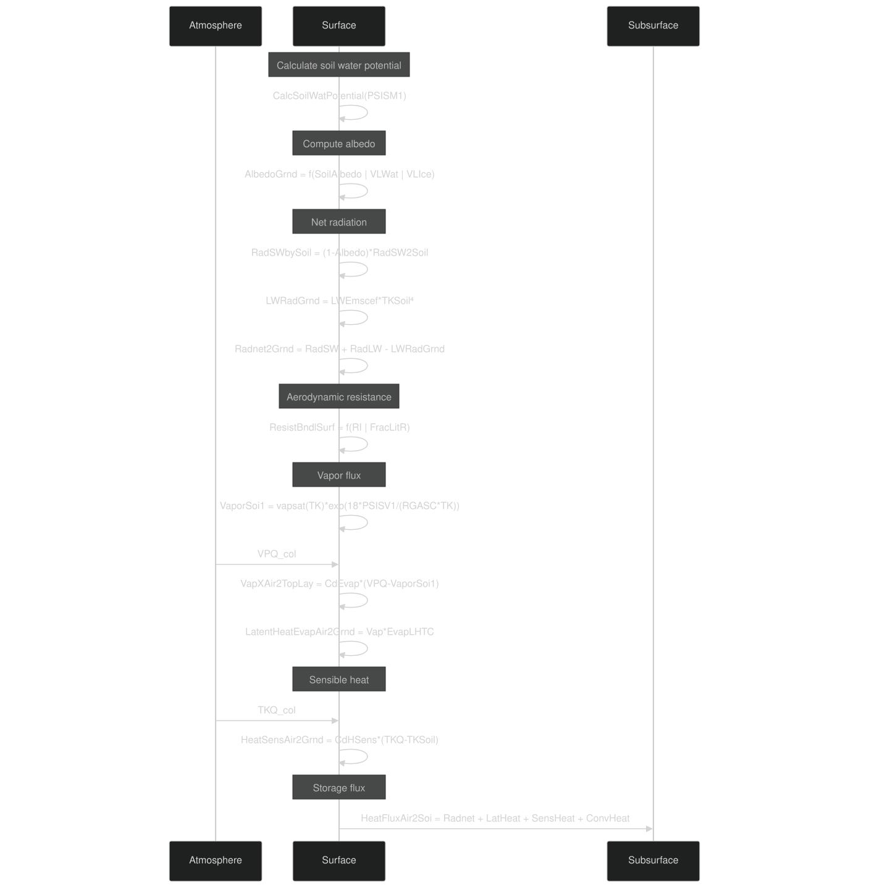

# Surface Energy Balance

Relevant source files

- [f90src/HydroTherm/SnowPhys/SnowBalanceMod.F90](https://github.com/jingtao-lbl/EcoSIM/blob/7b8a4cf6/f90src/HydroTherm/SnowPhys/SnowBalanceMod.F90)
- [f90src/HydroTherm/SnowPhys/SnowPhysMod.F90](https://github.com/jingtao-lbl/EcoSIM/blob/7b8a4cf6/f90src/HydroTherm/SnowPhys/SnowPhysMod.F90)
- [f90src/HydroTherm/SoilPhys/WatsubMod.F90](https://github.com/jingtao-lbl/EcoSIM/blob/7b8a4cf6/f90src/HydroTherm/SoilPhys/WatsubMod.F90)
- [f90src/HydroTherm/SurfPhys/SurfLitterPhysMod.F90](https://github.com/jingtao-lbl/EcoSIM/blob/7b8a4cf6/f90src/HydroTherm/SurfPhys/SurfLitterPhysMod.F90)
- [f90src/HydroTherm/SurfPhys/SurfPhysMod.F90](https://github.com/jingtao-lbl/EcoSIM/blob/7b8a4cf6/f90src/HydroTherm/SurfPhys/SurfPhysMod.F90)

## Purpose and Scope

This page documents the surface energy balance calculations in EcoSIM, which compute the partitioning of energy fluxes at the land-atmosphere interface. The surface energy balance determines how incoming solar and atmospheric radiation is partitioned into reflected radiation, emitted longwave radiation, sensible heat exchange with the atmosphere, latent heat from evapotranspiration, and heat conducted into the subsurface.

The surface energy balance is solved for three distinct surface types: bare soil, snow-covered surfaces, and litter-covered surfaces. Each surface type has unique albedo, emissivity, and resistance properties that affect energy partitioning.

For subsurface heat and water transport following energy balance calculations, see [Hydro-Thermal Model](#5.1) . For snow-specific physics including albedo and phase changes, see [Snow Model](#5.1.2) . For plant canopy energy exchange, see [Plant Model](#4.1) .

## Overview of Energy Balance Components

The surface energy balance equation at each grid cell is:

Rnet = H + LE + G

Where:

- **Rnet**= Net radiation (shortwave + longwave)
- **H**= Sensible heat flux to atmosphere
- **LE**= Latent heat flux (evaporation/sublimation)
- **G**= Ground heat flux into subsurface

Sources:  [f90src/HydroTherm/SurfPhys/SurfPhysMod.F90 427-601](https://github.com/jingtao-lbl/EcoSIM/blob/7b8a4cf6/f90src/HydroTherm/SurfPhys/SurfPhysMod.F90#L427-L601)

## Surface Type Partitioning

EcoSIM partitions each grid cell into fractions representing different surface conditions that affect energy balance calculations:

The snow fraction is calculated as:

Where `MinSnowDepth` is the minimum depth for full snow cover. This provides a smooth transition from snow-free to fully snow-covered conditions.

Sources:  [f90src/HydroTherm/SurfPhys/SurfPhysMod.F90 238-254](https://github.com/jingtao-lbl/EcoSIM/blob/7b8a4cf6/f90src/HydroTherm/SurfPhys/SurfPhysMod.F90#L238-L254)

## Radiation Budget Calculation

### Shortwave Radiation

Shortwave radiation at the ground surface is partitioned among snow, bare soil, and litter-covered surfaces:

Albedo varies by surface type:

- **Snow**: Calculated in snow model (age and temperature dependent)
- **Bare Soil**`SoilAlbedo_col`: (soil texture dependent)
- **Wet Soil**: Adjusted for water/ice content (water=0.06, ice=0.30)
- **Litter**: Assumed similar to soil

Sources:  [f90src/HydroTherm/SurfPhys/SurfPhysMod.F90 275-337](https://github.com/jingtao-lbl/EcoSIM/blob/7b8a4cf6/f90src/HydroTherm/SurfPhys/SurfPhysMod.F90#L275-L337)  [f90src/HydroTherm/SurfPhys/SurfPhysMod.F90 486-517](https://github.com/jingtao-lbl/EcoSIM/blob/7b8a4cf6/f90src/HydroTherm/SurfPhys/SurfPhysMod.F90#L486-L517)

### Longwave Radiation

Longwave radiation exchange includes both incoming atmospheric radiation and emitted surface radiation:

The Stefan-Boltzmann constant is converted to units of MJ/(m² K⁴ h):

Where `LWEmscef` includes emissivity, Stefan-Boltzmann constant, area, and time step scaling.

Sources:  [f90src/HydroTherm/SurfPhys/SurfPhysMod.F90 275-314](https://github.com/jingtao-lbl/EcoSIM/blob/7b8a4cf6/f90src/HydroTherm/SurfPhys/SurfPhysMod.F90#L275-L314)  [f90src/HydroTherm/SurfPhys/SurfPhysMod.F90 511-516](https://github.com/jingtao-lbl/EcoSIM/blob/7b8a4cf6/f90src/HydroTherm/SurfPhys/SurfPhysMod.F90#L511-L516)

## Aerodynamic Resistances

Turbulent heat fluxes depend on aerodynamic resistances that control exchange between the surface and atmosphere:

The canopy boundary layer resistance includes wind speed attenuation:

Vapor diffusion through litter includes porosity limitation:

Where `POROQ` is the tortuosity factor.

Sources:  [f90src/HydroTherm/SurfPhys/SurfPhysMod.F90 339-423](https://github.com/jingtao-lbl/EcoSIM/blob/7b8a4cf6/f90src/HydroTherm/SurfPhys/SurfPhysMod.F90#L339-L423)  [f90src/HydroTherm/SurfPhys/SurfPhysMod.F90 533-547](https://github.com/jingtao-lbl/EcoSIM/blob/7b8a4cf6/f90src/HydroTherm/SurfPhys/SurfPhysMod.F90#L533-L547)

## Sensible Heat Flux

Sensible heat flux represents convective heat transfer driven by temperature differences:

The Richardson number accounts for atmospheric stability:

Sources:  [f90src/HydroTherm/SurfPhys/SurfPhysMod.F90 537-597](https://github.com/jingtao-lbl/EcoSIM/blob/7b8a4cf6/f90src/HydroTherm/SurfPhys/SurfPhysMod.F90#L537-L597)

## Latent Heat Flux

Latent heat flux represents energy consumed (evaporation) or released (condensation) during phase changes:

The surface vapor pressure includes osmotic and matric potential effects:

Evaporation is limited by available water:

Sources:  [f90src/HydroTherm/SurfPhys/SurfPhysMod.F90 551-598](https://github.com/jingtao-lbl/EcoSIM/blob/7b8a4cf6/f90src/HydroTherm/SurfPhys/SurfPhysMod.F90#L551-L598)

## Surface Energy Balance Solution

The complete energy balance for bare soil surfaces is solved in `SoilSRFEnerbyBalanceM` :

Sources:  [f90src/HydroTherm/SurfPhys/SurfPhysMod.F90 427-601](https://github.com/jingtao-lbl/EcoSIM/blob/7b8a4cf6/f90src/HydroTherm/SurfPhys/SurfPhysMod.F90#L427-L601)

## Integration with Snow and Litter Models

When snow or litter is present, energy balance is calculated for multiple surface layers:

The main orchestration routine `AtmLandSurfExchangeM` sequences these calculations:

Sources:  [f90src/HydroTherm/SurfPhys/SurfPhysMod.F90 652-759](https://github.com/jingtao-lbl/EcoSIM/blob/7b8a4cf6/f90src/HydroTherm/SurfPhys/SurfPhysMod.F90#L652-L759)

## Key Data Structures and Variables

### Global Arrays (Column-Level)

| Variable | Description | Units | 
| --- | --- | --- |
| RadSWGrnd_col(NY,NX) | Shortwave radiation at ground | MJ/m²/h | 
| LWRadSky_col(NY,NX) | Longwave radiation from sky | MJ/m²/h | 
| LWRadCanGPrev_col(NY,NX) | Longwave from canopy | MJ/m²/h | 
| TairK_col(NY,NX) | Air temperature | K | 
| VPQ_col(NY,NX) | Canopy vapor pressure | MPa | 
| HeatFlx2Grnd_col(NY,NX) | Net heat flux to ground | MJ | 
| VapXAir2GSurf_col(NY,NX) | Vapor flux to surface | Mg H₂O | 
| FracSurfAsSnow_col(NY,NX) | Snow-covered fraction | - | 
| FracSurfByLitR_col(NY,NX) | Litter-covered fraction | - | 
| ResistAreodynOverSoil_col(NY,NX) | Aerodynamic resistance | h/m | 

### Surface Radiation Variables

| Variable | Description | Units | 
| --- | --- | --- |
| RadSW2Sno_col(NY,NX) | Shortwave to snow | MJ | 
| RadSW2Soil_col(NY,NX) | Shortwave to bare soil | MJ | 
| RadSW2LitR_col(NY,NX) | Shortwave to litter | MJ | 
| LWRad2Snow_col(NY,NX) | Longwave to snow | MJ | 
| LWEmscefSnow_col(NY,NX) | Snow emission coefficient | MJ/K⁴ | 
| LWEmscefSoil_col(NY,NX) | Soil emission coefficient | MJ/K⁴ | 

### Energy Flux Components

| Variable | Description | Units | 
| --- | --- | --- |
| Radnet2Grnd | Net radiation | MJ | 
| HeatSensAir2Grnd | Sensible heat flux | MJ | 
| LatentHeatEvapAir2Grnd | Latent heat flux | MJ | 
| HeatSensVapAir2Grnd | Convective heat with vapor | MJ | 
| HeatFluxAir2Soi | Total heat into soil | MJ | 

### Physical Constants

| Constant | Value | Description | 
| --- | --- | --- |
| SoilEmisivity | 0.97 | Soil surface emissivity | 
| SnowEmisivity | 0.97 | Snow surface emissivity | 
| SurfLitREmisivity | 0.97 | Litter surface emissivity | 
| LitRSurfResistance | 0.0139 h/m | Litter boundary layer resistance | 
| RACX | 0.0139 h/m | Min canopy boundary layer resistance | 

Sources:  [f90src/HydroTherm/SurfPhys/SurfPhysMod.F90 1-74](https://github.com/jingtao-lbl/EcoSIM/blob/7b8a4cf6/f90src/HydroTherm/SurfPhys/SurfPhysMod.F90#L1-L74)  [f90src/HydroTherm/SurfPhys/SurfPhysMod.F90 56-66](https://github.com/jingtao-lbl/EcoSIM/blob/7b8a4cf6/f90src/HydroTherm/SurfPhys/SurfPhysMod.F90#L56-L66)

## Execution Flow

The surface energy balance is executed within the main hydro-thermal timestep loop in `watsub` :

Within each iteration, `RunSurfacePhysModelM` calls:

Sources:  [f90src/HydroTherm/SoilPhys/WatsubMod.F90 82-204](https://github.com/jingtao-lbl/EcoSIM/blob/7b8a4cf6/f90src/HydroTherm/SoilPhys/WatsubMod.F90#L82-L204)  [f90src/HydroTherm/SurfPhys/SurfPhysMod.F90 113-170](https://github.com/jingtao-lbl/EcoSIM/blob/7b8a4cf6/f90src/HydroTherm/SurfPhys/SurfPhysMod.F90#L113-L170)