# Snow Model

Relevant source files

- [f90src/HydroTherm/SnowPhys/SnowBalanceMod.F90](https://github.com/jingtao-lbl/EcoSIM/blob/7b8a4cf6/f90src/HydroTherm/SnowPhys/SnowBalanceMod.F90)
- [f90src/HydroTherm/SnowPhys/SnowPhysMod.F90](https://github.com/jingtao-lbl/EcoSIM/blob/7b8a4cf6/f90src/HydroTherm/SnowPhys/SnowPhysMod.F90)
- [f90src/HydroTherm/SoilPhys/WatsubMod.F90](https://github.com/jingtao-lbl/EcoSIM/blob/7b8a4cf6/f90src/HydroTherm/SoilPhys/WatsubMod.F90)
- [f90src/HydroTherm/SurfPhys/SurfLitterPhysMod.F90](https://github.com/jingtao-lbl/EcoSIM/blob/7b8a4cf6/f90src/HydroTherm/SurfPhys/SurfLitterPhysMod.F90)
- [f90src/HydroTherm/SurfPhys/SurfPhysMod.F90](https://github.com/jingtao-lbl/EcoSIM/blob/7b8a4cf6/f90src/HydroTherm/SurfPhys/SurfPhysMod.F90)

## Purpose and Scope

The Snow Model simulates multi-layer snowpack physics within EcoSIM, including snow accumulation, compaction, phase changes (melt/freeze), and energy/water exchange with the atmosphere and underlying soil/litter surfaces. This page documents the snow physics algorithms, layer structure, and integration with the broader hydro-thermal system.

For surface energy balance calculations that drive snow processes, see [Surface Energy Balance](#5.1.1) . For subsurface water flow beneath snow, see [Subsurface Flow](#5.1.3) . For snow chemistry transport, see [Solute Transport](#5.2.2) .

## Snow Model Architecture

The snow model uses a fixed multi-layer structure with up to `JS=5` layers, tracking dry snow water equivalent, liquid water, and ice separately in each layer. The model operates within the surface physics iteration loop, solving energy and mass balance at sub-hourly timesteps ( `XNPS` iterations per hour).

### Key Modules

Sources:  [f90src/HydroTherm/SnowPhys/SnowPhysMod.F90 1-54](https://github.com/jingtao-lbl/EcoSIM/blob/7b8a4cf6/f90src/HydroTherm/SnowPhys/SnowPhysMod.F90#L1-L54)  [f90src/HydroTherm/SnowPhys/SnowBalanceMod.F90 1-40](https://github.com/jingtao-lbl/EcoSIM/blob/7b8a4cf6/f90src/HydroTherm/SnowPhys/SnowBalanceMod.F90#L1-L40)  [f90src/HydroTherm/SurfPhys/SurfPhysMod.F90 1-75](https://github.com/jingtao-lbl/EcoSIM/blob/7b8a4cf6/f90src/HydroTherm/SurfPhys/SurfPhysMod.F90#L1-L75)

## Snow Layer Structure

The snow model divides the snowpack into up to 5 layers with predefined maximum depths. Each layer tracks three components: dry snow water equivalent, liquid water, and ice.

### Layer Organization

Sources:  [f90src/HydroTherm/SnowPhys/SnowPhysMod.F90 56-147](https://github.com/jingtao-lbl/EcoSIM/blob/7b8a4cf6/f90src/HydroTherm/SnowPhys/SnowPhysMod.F90#L56-L147)  [f90src/HydroTherm/SnowPhys/SnowPhysMod.F90 264-303](https://github.com/jingtao-lbl/EcoSIM/blob/7b8a4cf6/f90src/HydroTherm/SnowPhys/SnowPhysMod.F90#L264-L303)

### Layer Initialization

The `InitSnowLayers` subroutine initializes the snow profile from an initial snow depth:

| Parameter | Variable | Description | 
| --- | --- | --- |
| Snow depth | SnowDepth_col(NY,NX) | Total snow height [m] | 
| Layer reference depths | cumSnowDepzRef_col | Fixed: 0.05, 0.15, 0.30, 0.60, 1.00 m | 
| Initial density | NewSnowDens_col(NY,NX) | Fresh snow density [Mg m⁻³], default 0.10 | 
| Layer thickness | SnowThickL_snvr(L,NY,NX) | Actual thickness in each layer [m] | 
| Dry snow WE | VLDrySnoWE_snvr(L,NY,NX) | Dry snow water equivalent [m³] | 
| Temperature | TKSnow_snvr(L,NY,NX) | Layer temperature [K] | 

Sources:  [f90src/HydroTherm/SnowPhys/SnowPhysMod.F90 56-147](https://github.com/jingtao-lbl/EcoSIM/blob/7b8a4cf6/f90src/HydroTherm/SnowPhys/SnowPhysMod.F90#L56-L147)

## Snow-Atmosphere Energy Exchange

The snow model solves energy balance at the top snow layer surface, computing net radiation, sensible heat, latent heat (evaporation/sublimation), and phase change.

### Energy Balance Components

The energy balance is solved in `SnowAtmosExchangeMM` :

Albedo calculation (modified based on `mod_snow_albedo` ):

- Base albedo increases with snow age
- Reduced by snow temperature > freezing
- Reduced by dust/debris content

Vapor exchange:

Sources:  [f90src/HydroTherm/SnowPhys/SnowPhysMod.F90 756-848](https://github.com/jingtao-lbl/EcoSIM/blob/7b8a4cf6/f90src/HydroTherm/SnowPhys/SnowPhysMod.F90#L756-L848)  [f90src/HydroTherm/SurfPhys/SurfPhysMod.F90 275-314](https://github.com/jingtao-lbl/EcoSIM/blob/7b8a4cf6/f90src/HydroTherm/SurfPhys/SurfPhysMod.F90#L275-L314)

## Internal Snow Dynamics

Within the snowpack, water and heat are transported between layers through liquid water percolation, vapor diffusion, and thermal conduction.

### Water and Heat Fluxes

### Liquid Water Percolation

Water percolates through air-filled pore space in each layer:

Water moves only through unfrozen pore space, with retention based on snow density.

Sources:  [f90src/HydroTherm/SnowPhys/SnowPhysMod.F90 288-316](https://github.com/jingtao-lbl/EcoSIM/blob/7b8a4cf6/f90src/HydroTherm/SnowPhys/SnowPhysMod.F90#L288-L316)

### Vapor Diffusion

Water vapor diffuses through air-filled porosity driven by temperature gradients:

Vapor transport includes latent heat:

Sources:  [f90src/HydroTherm/SnowPhys/SnowPhysMod.F90 329-351](https://github.com/jingtao-lbl/EcoSIM/blob/7b8a4cf6/f90src/HydroTherm/SnowPhys/SnowPhysMod.F90#L329-L351)

### Heat Conduction

Thermal conductivity varies with snow density (J. Glaciol. 43:26-41):

Heat conduction between layers:

Sources:  [f90src/HydroTherm/SnowPhys/SnowPhysMod.F90 287-388](https://github.com/jingtao-lbl/EcoSIM/blob/7b8a4cf6/f90src/HydroTherm/SnowPhys/SnowPhysMod.F90#L287-L388)

### Phase Change

Freeze-thaw is determined by snowpack temperature relative to freezing point:

Sources:  [f90src/HydroTherm/SnowPhys/SnowPhysMod.F90 658-695](https://github.com/jingtao-lbl/EcoSIM/blob/7b8a4cf6/f90src/HydroTherm/SnowPhys/SnowPhysMod.F90#L658-L695)

## Snow-Surface Interactions

The bottom snow layer exchanges water, vapor, and heat with the underlying litter and soil surfaces.

### Exchange Pathways

### Water Partitioning to Soil

Water from the bottom snow layer is partitioned to micropores and macropores based on soil structure:

Remaining water goes to litter if present:

Sources:  [f90src/HydroTherm/SnowPhys/SnowPhysMod.F90 409-425](https://github.com/jingtao-lbl/EcoSIM/blob/7b8a4cf6/f90src/HydroTherm/SnowPhys/SnowPhysMod.F90#L409-L425)

### Vapor Exchange with Soil

Vapor diffusion between snow and soil depends on matric potential and temperature:

Sources:  [f90src/HydroTherm/SnowPhys/SnowPhysMod.F90 426-448](https://github.com/jingtao-lbl/EcoSIM/blob/7b8a4cf6/f90src/HydroTherm/SnowPhys/SnowPhysMod.F90#L426-L448)  [f90src/HydroTherm/SnowPhys/SnowPhysMod.F90 1012-1117](https://github.com/jingtao-lbl/EcoSIM/blob/7b8a4cf6/f90src/HydroTherm/SnowPhys/SnowPhysMod.F90#L1012-L1117)

## Snow Compaction and Layering

Snow density increases over time due to metamorphism and overburden pressure. The model also redistributes snow mass between layers to maintain appropriate layer thicknesses.

### Snow Compression

Snow density changes are calculated in `UpdateSnowLayerL` :

- `DDENS1`: Temperature-driven metamorphism (low density only)
- `DDENS2`: Viscous compression under overburden weight
- `CVISC`: Viscosity parameter (temperature and density dependent)
- `VOLSWI`: Accumulated snow water equivalent above layer L

Sources:  [f90src/HydroTherm/SnowPhys/SnowBalanceMod.F90 446-462](https://github.com/jingtao-lbl/EcoSIM/blob/7b8a4cf6/f90src/HydroTherm/SnowPhys/SnowBalanceMod.F90#L446-L462)

### Layer Redistribution

The `SnowpackLayering` subroutine redistributes snow when layers exceed or fall below their target volumes:

| Condition | Action | Method | 
| --- | --- | --- |
| Layer L volume > max | Expand into L+1 | Transfer excess to next layer | 
| Layer L volume < max and L+1 exists | Shrink/merge | Incorporate L+1 into L | 
| Layer empty | Reset | Set all masses to zero | 

Transfer fraction calculation:

Sources:  [f90src/HydroTherm/SnowPhys/SnowBalanceMod.F90 514-686](https://github.com/jingtao-lbl/EcoSIM/blob/7b8a4cf6/f90src/HydroTherm/SnowPhys/SnowBalanceMod.F90#L514-L686)

## Execution Flow

The snow model integrates into the surface physics iteration loop within `watsub` :

Sources:  [f90src/HydroTherm/SoilPhys/WatsubMod.F90 82-204](https://github.com/jingtao-lbl/EcoSIM/blob/7b8a4cf6/f90src/HydroTherm/SoilPhys/WatsubMod.F90#L82-L204)  [f90src/HydroTherm/SnowPhys/SnowPhysMod.F90 491-750](https://github.com/jingtao-lbl/EcoSIM/blob/7b8a4cf6/f90src/HydroTherm/SnowPhys/SnowPhysMod.F90#L491-L750)

## Key Data Structures

### Snow State Variables

| Variable | Dimensions | Units | Description | 
| --- | --- | --- | --- |
| VLDrySnoWE_snvr(L,NY,NX) | (JS,JY,JX) | m³ | Dry snow water equivalent volume | 
| VLWatSnow_snvr(L,NY,NX) | (JS,JY,JX) | m³ | Liquid water volume | 
| VLIceSnow_snvr(L,NY,NX) | (JS,JY,JX) | m³ | Ice volume | 
| TKSnow_snvr(L,NY,NX) | (JS,JY,JX) | K | Layer temperature | 
| SnoDens_snvr(L,NY,NX) | (JS,JY,JX) | Mg m⁻³ | Snow density | 
| SnowThickL_snvr(L,NY,NX) | (JS,JY,JX) | m | Layer thickness | 
| VLHeatCapSnow_snvr(L,NY,NX) | (JS,JY,JX) | MJ K⁻¹ | Volumetric heat capacity | 
| H2OVapDifsc_snvr(L,NY,NX) | (JS,JY,JX) | m² h⁻¹ | Vapor diffusivity | 

### Column Aggregates

| Variable | Dimensions | Units | Description | 
| --- | --- | --- | --- |
| SnowDepth_col(NY,NX) | (JY,JX) | m | Total snow depth | 
| VcumDrySnoWE_col(NY,NX) | (JY,JX) | m³ | Total dry snow WE | 
| VcumWatSnow_col(NY,NX) | (JY,JX) | m³ | Total liquid water | 
| VcumIceSnow_col(NY,NX) | (JY,JX) | m³ | Total ice | 
| VcumSnowWE_col(NY,NX) | (JY,JX) | m³ | Total snow water equivalent | 
| NewSnowDens_col(NY,NX) | (JY,JX) | Mg m⁻³ | Fresh snow density | 
| FracSurfAsSnow_col(NY,NX) | (JY,JX) | - | Fraction of surface as snow | 

### Flux Variables

| Variable | Dimensions | Units | Description | 
| --- | --- | --- | --- |
| SnoXfer2SnoLay_snvr(L,NY,NX) | (JS,JY,JX) | m³ | Snow transfer to layer | 
| WatXfer2SnoLay_snvr(L,NY,NX) | (JS,JY,JX) | m³ | Water transfer to layer | 
| IceXfer2SnoLay_snvr(L,NY,NX) | (JS,JY,JX) | m³ | Ice transfer to layer | 
| HeatXfer2SnoLay_snvr(L,NY,NX) | (JS,JY,JX) | MJ | Heat transfer to layer | 
| XPhaseChangeHeatL_snvr(L,NY,NX) | (JS,JY,JX) | MJ | Latent heat from phase change | 
| WatConvSno2MicP_snvr(L,NY,NX) | (JS,JY,JX) | m³ | Water flux snow→soil micropores | 
| WatConvSno2MacP_snvr(L,NY,NX) | (JS,JY,JX) | m³ | Water flux snow→soil macropores | 
| WatConvSno2LitR_snvr(L,NY,NX) | (JS,JY,JX) | m³ | Water flux snow→litter | 

Sources:  [f90src/HydroTherm/SnowPhys/SnowPhysMod.F90 1-54](https://github.com/jingtao-lbl/EcoSIM/blob/7b8a4cf6/f90src/HydroTherm/SnowPhys/SnowPhysMod.F90#L1-L54)  [f90src/HydroTherm/SnowPhys/SnowBalanceMod.F90 1-40](https://github.com/jingtao-lbl/EcoSIM/blob/7b8a4cf6/f90src/HydroTherm/SnowPhys/SnowBalanceMod.F90#L1-L40)

## Configuration Parameters

Key parameters controlling snow physics:

| Parameter | Value | Location | Description | 
| --- | --- | --- | --- |
| JS | 5 | GridConsts | Maximum number of snow layers | 
| XNPS | Variable | EcoSIMSolverPar | Sub-iterations per hour for snow | 
| VLHeatCapSnoMin | Variable | PhysPars | Minimum heat capacity for active layer | 
| MinSnowDepth | Variable | SnowDataType | Minimum depth for full snow cover | 
| SnowEmisivity | 0.97 | SurfPhysMod | Snow surface emissivity | 
| TFICE | 273.15 K | EcosimConst | Freezing point temperature | 
| LtHeatIceMelt | Variable | PhysPars | Latent heat of ice melting | 
| DENSICE | 0.92 | EcosimConst | Ice density [Mg m⁻³] | 

Sources:  [f90src/HydroTherm/SurfPhys/SurfPhysMod.F90 59-65](https://github.com/jingtao-lbl/EcoSIM/blob/7b8a4cf6/f90src/HydroTherm/SurfPhys/SurfPhysMod.F90#L59-L65)  [f90src/HydroTherm/SnowPhys/SnowPhysMod.F90 64-66](https://github.com/jingtao-lbl/EcoSIM/blob/7b8a4cf6/f90src/HydroTherm/SnowPhys/SnowPhysMod.F90#L64-L66)