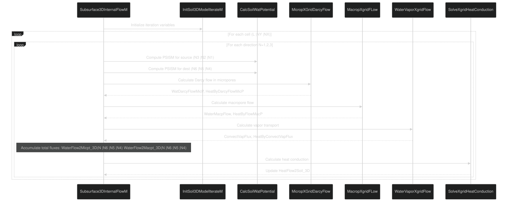

# Subsurface Flow

Relevant source files

- [f90src/HydroTherm/SnowPhys/SnowBalanceMod.F90](https://github.com/jingtao-lbl/EcoSIM/blob/7b8a4cf6/f90src/HydroTherm/SnowPhys/SnowBalanceMod.F90)
- [f90src/HydroTherm/SnowPhys/SnowPhysMod.F90](https://github.com/jingtao-lbl/EcoSIM/blob/7b8a4cf6/f90src/HydroTherm/SnowPhys/SnowPhysMod.F90)
- [f90src/HydroTherm/SoilPhys/WatsubMod.F90](https://github.com/jingtao-lbl/EcoSIM/blob/7b8a4cf6/f90src/HydroTherm/SoilPhys/WatsubMod.F90)
- [f90src/HydroTherm/SurfPhys/SurfLitterPhysMod.F90](https://github.com/jingtao-lbl/EcoSIM/blob/7b8a4cf6/f90src/HydroTherm/SurfPhys/SurfLitterPhysMod.F90)
- [f90src/HydroTherm/SurfPhys/SurfPhysMod.F90](https://github.com/jingtao-lbl/EcoSIM/blob/7b8a4cf6/f90src/HydroTherm/SurfPhys/SurfPhysMod.F90)

## Purpose and Scope

This page documents EcoSIM's 3D subsurface water flow model, which simulates water movement through soil layers accounting for both micropore and macropore flow, vapor transport, and heat advection. The model implements a dual-porosity structure and computes water fluxes in three dimensions using Darcy's law and macropore flow equations. For surface processes, see [Surface Energy Balance](#5.1.1) . For snow physics, see [Snow Model](#5.1.2) . For solute transport through soil, see [Solute Transport](#5.2.2) .

## Overview

The subsurface flow model is implemented primarily in `WatsubMod.F90` and executes through the `watsub` subroutine, which orchestrates multiple internal time steps ( `NPH` iterations) to solve coupled water and heat transfer equations. The model uses a 3D grid structure with flow computed in horizontal (east-west, north-south) and vertical directions.

Sources:  [f90src/HydroTherm/SoilPhys/WatsubMod.F90 82-204](https://github.com/jingtao-lbl/EcoSIM/blob/7b8a4cf6/f90src/HydroTherm/SoilPhys/WatsubMod.F90#L82-L204)

## Dual-Porosity Structure

EcoSIM employs a dual-porosity representation where soil pore space is partitioned into micropores and macropores. This structure captures the different hydraulic behaviors of matrix flow (slow, diffusive) versus preferential flow (fast, advective).

### Micropore-Macropore Partitioning

| Variable | Description | Units | 
| --- | --- | --- |
| VLMicP_vr(L,NY,NX) | Micropore volume in layer L | m³ | 
| VLWatMicP_vr(L,NY,NX) | Water volume in micropores | m³ | 
| VLiceMicP_vr(L,NY,NX) | Ice volume in micropores | m³ | 
| VLairMicP_vr(L,NY,NX) | Air volume in micropores | m³ | 
| VLMacP_vr(L,NY,NX) | Macropore volume in layer L | m³ | 
| VLWatMacP_vr(L,NY,NX) | Water volume in macropores | m³ | 
| VLiceMacP_vr(L,NY,NX) | Ice volume in macropores | m³ | 
| SoilFracAsMicP_vr(L,NY,NX) | Fraction of soil as micropores | - | 
| SoilFracAsMacP_vr(L,NY,NX) | Fraction of soil as macropores | - | 

The micropore volume accounts for clay swelling effects:

Sources:  [f90src/HydroTherm/SoilPhys/WatsubMod.F90 311-482](https://github.com/jingtao-lbl/EcoSIM/blob/7b8a4cf6/f90src/HydroTherm/SoilPhys/WatsubMod.F90#L311-L482)

## 3D Grid Structure and Flow Directions

The model computes water flow between adjacent grid cells in three orthogonal directions. Each grid cell is identified by indices `(L, NY, NX)` representing vertical layer, north-south position, and east-west position.

### Grid Cell Connectivity

The code loops through directions using index `N` :

- `N=iWestEastDirection=1`: Flow in east-west direction
- `N=iNorthSouthDirection=2`: Flow in north-south direction
- `N=iVerticalDirection=3`: Flow in vertical direction

Destination cell indices are computed as `(N6, N5, N4)` :

Sources:  [f90src/HydroTherm/SoilPhys/WatsubMod.F90 560-760](https://github.com/jingtao-lbl/EcoSIM/blob/7b8a4cf6/f90src/HydroTherm/SoilPhys/WatsubMod.F90#L560-L760)

## Subsurface Flow Computation Algorithm

The core 3D flow computation occurs in `Subsurface3DInternalFlowM` , which calculates water and heat fluxes between all adjacent grid cells for each time step iteration.

### Main Flow Computation Sequence

Sources:  [f90src/HydroTherm/SoilPhys/WatsubMod.F90 560-760](https://github.com/jingtao-lbl/EcoSIM/blob/7b8a4cf6/f90src/HydroTherm/SoilPhys/WatsubMod.F90#L560-L760)

## Flow Types

Three distinct types of water transport occur simultaneously in the subsurface:

### Micropore Darcy Flow

Micropore flow follows Darcy's law based on matric potential gradients and hydraulic conductivity. This is the primary mechanism for water movement in the soil matrix.

Key Function:  `MicropXGridDarcyFlow(N,N1,N2,N3,N4,N5,N6,THETA1,THETAL,...)`

The function computes:

Flux calculation:

The flow is constrained by:

- Available water in source cell
- Available pore space in destination cell
- Hydraulic conductivity (reduced by rainfall kinetic energy at surface)

Sources:  [f90src/HydroTherm/SoilPhys/WatsubMod.F90 670-673](https://github.com/jingtao-lbl/EcoSIM/blob/7b8a4cf6/f90src/HydroTherm/SoilPhys/WatsubMod.F90#L670-L673)

### Macropore Flow

Macropore flow represents rapid preferential flow through large pores and cracks, driven primarily by gravity with hydraulic conductivity computed separately from micropores.

Key Function:  `MacropXgridFLow(N,N1,N2,N3,N4,N5,N6,WaterMacpFlow,HeatByFlowMacP,LInvalidMacP)`

Macropore hydraulic conductance ( `AVCNHL_3D` ) is pre-computed during initialization:

Macropore flow can be disabled ( `LInvalidMacP` ) under certain conditions to prevent numerical instability.

Sources:  [f90src/HydroTherm/SoilPhys/WatsubMod.F90 545-551](https://github.com/jingtao-lbl/EcoSIM/blob/7b8a4cf6/f90src/HydroTherm/SoilPhys/WatsubMod.F90#L545-L551)  [f90src/HydroTherm/SoilPhys/WatsubMod.F90 674](https://github.com/jingtao-lbl/EcoSIM/blob/7b8a4cf6/f90src/HydroTherm/SoilPhys/WatsubMod.F90#L674-L674)

### Water Vapor Flow

Water vapor transport occurs through air-filled pore space, driven by vapor pressure gradients. This is particularly important in dry soils and at high temperatures.

Key Function:  `WaterVaporXgridFlow(M,N,N1,N2,N3,N4,N5,N6,PSISV1,PSISVL,ConvectVapFlux,HeatByConvectVapFlux)`

Vapor flux depends on:

- `VapSrc = vapsat(TKSoil1_vr) * exp(18*PSISV1/(RGASC*TKSoil1_vr))`Vapor pressure at source:
- `VapDest = vapsat(TKSoil1_vr) * exp(18*PSISVL/(RGASC*TKSoil1_vr))`Vapor pressure at destination:
- Vapor conductance through air-filled pore space
- Film thickness on particle surfaces

Convective heat flux accompanies vapor transport: `HeatByConvectVapFlux = ConvectVapFlux * (cpw*T + EvapLHTC)`

Sources:  [f90src/HydroTherm/SoilPhys/WatsubMod.F90 676](https://github.com/jingtao-lbl/EcoSIM/blob/7b8a4cf6/f90src/HydroTherm/SoilPhys/WatsubMod.F90#L676-L676)

## Boundary Conditions

The subsurface flow model handles multiple boundary conditions including surface infiltration, lateral boundaries, bottom drainage, and interactions with water tables.

### Boundary Types and Implementation

### Top Surface Infiltration

Surface infiltration is computed in `RunSurfacePhysModelM` and enters the top soil layer through:

- `Qinfl2MicP_col(NY,NX)`: Infiltration to micropores
- `Qinfl2MacP_col(NY,NX)`: Infiltration to macropores

These fluxes are added to the top layer flux arrays:

Sources:  [f90src/HydroTherm/SoilPhys/WatsubMod.F90 155-157](https://github.com/jingtao-lbl/EcoSIM/blob/7b8a4cf6/f90src/HydroTherm/SoilPhys/WatsubMod.F90#L155-L157)

### Water Table Boundaries

The model supports both natural and artificial (tile drainage) water tables:

| Variable | Description | Purpose | 
| --- | --- | --- |
| ExtWaterTable_col(NY,NX) | Natural water table depth | External boundary condition | 
| TileWaterTable_col(NY,NX) | Tile drain depth | Artificial drainage | 
| FracLayVolBelowExtWTBL_vr(L,NY,NX) | Fraction of layer below natural WT | Determines water exchange | 
| FracLayVolBelowTileWTBL_vr(L,NY,NX) | Fraction of layer below tile WT | Determines drainage rate | 

Water table exchange is computed as:

Sources:  [f90src/HydroTherm/SoilPhys/WatsubMod.F90 459-471](https://github.com/jingtao-lbl/EcoSIM/blob/7b8a4cf6/f90src/HydroTherm/SoilPhys/WatsubMod.F90#L459-L471)

### Lateral Boundary Conditions

Lateral boundaries (east, west, north, south edges of the domain) are handled by:

The code explicitly checks boundary positions:

Sources:  [f90src/HydroTherm/SoilPhys/WatsubMod.F90 606-612](https://github.com/jingtao-lbl/EcoSIM/blob/7b8a4cf6/f90src/HydroTherm/SoilPhys/WatsubMod.F90#L606-L612)

### Bottom Drainage

Bottom drainage occurs through:

- `QDrain_col(NY,NX)`: Total drainage flux from bottom of profile
- `QDischarg2WTBL_col(NY,NX)`: Discharge to external water table

These are computed in `XBoundaryFlowM` based on hydraulic gradient and drainage properties.

Sources:  [f90src/HydroTherm/SoilPhys/WatsubMod.F90 763-940](https://github.com/jingtao-lbl/EcoSIM/blob/7b8a4cf6/f90src/HydroTherm/SoilPhys/WatsubMod.F90#L763-L940)

## Time Stepping and Iteration Scheme

The subsurface flow model uses a sub-hourly time stepping scheme with multiple iterations to ensure numerical stability and mass conservation.

### Iteration Structure

| Parameter | Description | Typical Value | 
| --- | --- | --- |
| dts_HeatWatTP | Time step for heat/water calculation | 1/NPH hours | 
| NPH | Number of sub-hourly iterations | Configurable, often 4-10 | 
| dts_wat | Reciprocal time step for flux limiting | 1/dts_HeatWatTP | 

### State Variable Updates

The model maintains multiple versions of state variables:

- `VLWatMicP_vr`: Original state (start of hour)
- `VLWatMicP1_vr`: Current state (updated each iteration)
- `VLWatMicP2_vr`: Temporary state for next iteration

Within each iteration `M` :

Sources:  [f90src/HydroTherm/SoilPhys/WatsubMod.F90 127-177](https://github.com/jingtao-lbl/EcoSIM/blob/7b8a4cf6/f90src/HydroTherm/SoilPhys/WatsubMod.F90#L127-L177)

## Mass Conservation

Mass conservation is rigorously enforced through the `checkMassBalance` subroutine, which verifies that:

If `|ΔMass| > 1e-4` , the simulation aborts with an error.

The check accounts for:

- `VLWatMicP1_vr`Water in micropores:
- `VLWatMacP1_vr`Water in macropores:
- `(VLiceMicP1_vr + VLiceMacP1_vr) * DENSICE`Ice (converted to water equivalent):
- All boundary fluxes
- `TWaterPlantRoot2SoilX_col`Plant root water uptake:

Sources:  [f90src/HydroTherm/SoilPhys/WatsubMod.F90 208-269](https://github.com/jingtao-lbl/EcoSIM/blob/7b8a4cf6/f90src/HydroTherm/SoilPhys/WatsubMod.F90#L208-L269)

## Key Data Structures

### Primary State Arrays

All state variables follow the naming convention `Variable_vr(L,NY,NX)` for layer-indexed 3D arrays:

| Array | Description | Units | 
| --- | --- | --- |
| VLWatMicP_vr(L,NY,NX) | Micropore water volume | m³ | 
| VLWatMacP_vr(L,NY,NX) | Macropore water volume | m³ | 
| VLiceMicP_vr(L,NY,NX) | Micropore ice volume | m³ | 
| VLiceMacP_vr(L,NY,NX) | Macropore ice volume | m³ | 
| TKSoil1_vr(L,NY,NX) | Soil temperature | K | 
| PSISoilMatricP_vr(L,NY,NX) | Matric potential | MPa | 
| PSISoilOsmotic_vr(L,NY,NX) | Osmotic potential | MPa | 

### Flux Arrays

Flux arrays store water and heat transfers between cells, indexed by `(N,L,NY,NX)` where `N` is the flow direction:

| Array | Description | Units | 
| --- | --- | --- |
| WaterFlow2Micpt_3D(N,L,NY,NX) | Micropore water flux | m³/timestep | 
| WaterFlow2Macpt_3D(N,L,NY,NX) | Macropore water flux | m³/timestep | 
| HeatFlow2Soil_3D(N,L,NY,NX) | Heat flux | MJ/timestep | 
| WaterFlow2MicPM_3D(M,N,L,NY,NX) | Micropore flux for iteration M | m³/timestep | 

### Grid Geometry

| Array | Description | Units | 
| --- | --- | --- |
| DLYR_3D(N,L,NY,NX) | Distance between cells in direction N | m | 
| AREA_3D(N,L,NY,NX) | Interface area in direction N | m² | 
| VGeomLayer_vr(L,NY,NX) | Layer volume | m³ | 
| CumDepz2LayBottom_vr(L,NY,NX) | Cumulative depth to layer bottom | m | 

Sources:  [f90src/HydroTherm/SoilPhys/WatsubMod.F90 311-482](https://github.com/jingtao-lbl/EcoSIM/blob/7b8a4cf6/f90src/HydroTherm/SoilPhys/WatsubMod.F90#L311-L482)