# Hydro-Thermal Model

Relevant source files

- [f90src/HydroTherm/SnowPhys/SnowBalanceMod.F90](https://github.com/jingtao-lbl/EcoSIM/blob/7b8a4cf6/f90src/HydroTherm/SnowPhys/SnowBalanceMod.F90)
- [f90src/HydroTherm/SnowPhys/SnowPhysMod.F90](https://github.com/jingtao-lbl/EcoSIM/blob/7b8a4cf6/f90src/HydroTherm/SnowPhys/SnowPhysMod.F90)
- [f90src/HydroTherm/SoilPhys/WatsubMod.F90](https://github.com/jingtao-lbl/EcoSIM/blob/7b8a4cf6/f90src/HydroTherm/SoilPhys/WatsubMod.F90)
- [f90src/HydroTherm/SurfPhys/SurfLitterPhysMod.F90](https://github.com/jingtao-lbl/EcoSIM/blob/7b8a4cf6/f90src/HydroTherm/SurfPhys/SurfLitterPhysMod.F90)
- [f90src/HydroTherm/SurfPhys/SurfPhysMod.F90](https://github.com/jingtao-lbl/EcoSIM/blob/7b8a4cf6/f90src/HydroTherm/SurfPhys/SurfPhysMod.F90)

## Purpose and Scope

The Hydro-Thermal Model is the core physical process engine in EcoSIM that couples soil water movement, heat transfer, and snow dynamics in a fully integrated framework. This system solves Richards equation for 3D water flow, conducts heat transfer calculations, and simulates multi-layer snowpack dynamics with phase changes. The model operates at sub-hourly timesteps (NPH iterations per hour) to ensure numerical stability.

This page provides an overview of the coupled hydro-thermal system. For detailed information on specific components, see:

- [Surface Energy Balance](#5.1.1)Surface energy partitioning:
- [Snow Model](#5.1.2)Snow layer physics and albedo:
- [Subsurface Flow](#5.1.3)Richards equation and 3D flow:
- [Transport Processes](#5.2)Gas and solute movement:

## Model Architecture

The Hydro-Thermal Model consists of three tightly coupled components that exchange water, heat, and state information at each iteration:

Sources:  [f90src/HydroTherm/SoilPhys/WatsubMod.F90 82-204](https://github.com/jingtao-lbl/EcoSIM/blob/7b8a4cf6/f90src/HydroTherm/SoilPhys/WatsubMod.F90#L82-L204)  [f90src/HydroTherm/SurfPhys/SurfPhysMod.F90 113-170](https://github.com/jingtao-lbl/EcoSIM/blob/7b8a4cf6/f90src/HydroTherm/SurfPhys/SurfPhysMod.F90#L113-L170)  [f90src/HydroTherm/SnowPhys/SnowPhysMod.F90 491-569](https://github.com/jingtao-lbl/EcoSIM/blob/7b8a4cf6/f90src/HydroTherm/SnowPhys/SnowPhysMod.F90#L491-L569)

## Execution Flow

The `watsub` subroutine is the main driver, called once per hourly timestep from the overall EcoSIM timestep loop. It performs NPH sub-hourly iterations to ensure numerical stability:

Sources:  [f90src/HydroTherm/SoilPhys/WatsubMod.F90 82-204](https://github.com/jingtao-lbl/EcoSIM/blob/7b8a4cf6/f90src/HydroTherm/SoilPhys/WatsubMod.F90#L82-L204)  [f90src/HydroTherm/SoilPhys/WatsubMod.F90 127-177](https://github.com/jingtao-lbl/EcoSIM/blob/7b8a4cf6/f90src/HydroTherm/SoilPhys/WatsubMod.F90#L127-L177)

## Surface Partitioning and Energy Balance

The land surface is partitioned into three components whose coverage fractions vary dynamically: snowpack, surface litter, and bare soil. Each component exchanges energy with the atmosphere through distinct pathways:

Key Variables:

- `FracSurfAsSnow_col(NY,NX)`: Snow cover fraction = min(1, sqrt(SnowDepth/MinSnowDepth))
- `FracSurfSnoFree_col(NY,NX)`: Non-snow fraction = 1 - FracSurfAsSnow_col
- `FracSurfByLitR_col(NY,NX)`: Litter-covered fraction of snow-free area
- `FracSurfBareSoil_col(NY,NX)`: Bare soil fraction of snow-free area

Sources:  [f90src/HydroTherm/SurfPhys/SurfPhysMod.F90 238-254](https://github.com/jingtao-lbl/EcoSIM/blob/7b8a4cf6/f90src/HydroTherm/SurfPhys/SurfPhysMod.F90#L238-L254)  [f90src/HydroTherm/SurfPhys/SurfPhysMod.F90 275-336](https://github.com/jingtao-lbl/EcoSIM/blob/7b8a4cf6/f90src/HydroTherm/SurfPhys/SurfPhysMod.F90#L275-L336)

## Snow Layer Structure

The snow model maintains up to JS=5 discrete layers with varying thickness. Each layer tracks dry snow, liquid water, and ice separately:

Reference Depths:  `cumSnowDepzRef_col = [0.05, 0.15, 0.30, 0.60, 1.00]` m

Sources:  [f90src/HydroTherm/SnowPhys/SnowPhysMod.F90 56-147](https://github.com/jingtao-lbl/EcoSIM/blob/7b8a4cf6/f90src/HydroTherm/SnowPhys/SnowPhysMod.F90#L56-L147)  [f90src/HydroTherm/SnowPhys/SnowPhysMod.F90 65](https://github.com/jingtao-lbl/EcoSIM/blob/7b8a4cf6/f90src/HydroTherm/SnowPhys/SnowPhysMod.F90#L65-L65)

## Subsurface Flow Mechanisms

The model simulates three parallel flow pathways through the soil profile:

Key Functions:

- `MicropXGridDarcyFlow()`[f90src/HydroTherm/SoilPhys/WatsubMod.F90670](https://github.com/jingtao-lbl/EcoSIM/blob/7b8a4cf6/f90src/HydroTherm/SoilPhys/WatsubMod.F90#L670-L670): Darcy flux in micropores
- `MacropXgridFLow()`[f90src/HydroTherm/SoilPhys/WatsubMod.F90674](https://github.com/jingtao-lbl/EcoSIM/blob/7b8a4cf6/f90src/HydroTherm/SoilPhys/WatsubMod.F90#L674-L674): Gravity-driven macropore flow
- `WaterVaporXgridFlow()`[f90src/HydroTherm/SoilPhys/WatsubMod.F90676](https://github.com/jingtao-lbl/EcoSIM/blob/7b8a4cf6/f90src/HydroTherm/SoilPhys/WatsubMod.F90#L676-L676): Vapor transport by diffusion
- `SolveXgridHeatConduction()`[f90src/HydroTherm/SoilPhys/WatsubMod.F90688](https://github.com/jingtao-lbl/EcoSIM/blob/7b8a4cf6/f90src/HydroTherm/SoilPhys/WatsubMod.F90#L688-L688): Thermal conduction

Sources:  [f90src/HydroTherm/SoilPhys/WatsubMod.F90 560-760](https://github.com/jingtao-lbl/EcoSIM/blob/7b8a4cf6/f90src/HydroTherm/SoilPhys/WatsubMod.F90#L560-L760)  [f90src/HydroTherm/SoilPhys/WatsubMod.F90 670-689](https://github.com/jingtao-lbl/EcoSIM/blob/7b8a4cf6/f90src/HydroTherm/SoilPhys/WatsubMod.F90#L670-L689)

## Data Structures and State Variables

### Primary State Variables

The model tracks water and heat in multiple phases and compartments:

| Variable | Dimension | Units | Description | 
| --- | --- | --- | --- |
| VLWatMicP_vr(L,NY,NX) | Soil layer | m³ | Liquid water in micropores | 
| VLiceMicP_vr(L,NY,NX) | Soil layer | m³ | Ice in micropores | 
| VLWatMacP_vr(L,NY,NX) | Soil layer | m³ | Liquid water in macropores | 
| VLiceMacP_vr(L,NY,NX) | Soil layer | m³ | Ice in macropores | 
| TKS_vr(L,NY,NX) | Soil layer | K | Soil temperature | 
| VLDrySnoWE_snvr(L,NY,NX) | Snow layer | Mg | Dry snow water equivalent | 
| VLWatSnow_snvr(L,NY,NX) | Snow layer | m³ | Liquid water in snow | 
| VLIceSnow_snvr(L,NY,NX) | Snow layer | m³ | Ice in snow | 
| TKSnow_snvr(L,NY,NX) | Snow layer | K | Snow temperature | 

### Flux Variables

Fluxes are computed at each iteration M and accumulated:

| Variable | Dimension | Units | Description | 
| --- | --- | --- | --- |
| WaterFlow2Micpt_3D(N,L,NY,NX) | Direction×Layer | m³/h | Water flux to micropores | 
| WaterFlow2Macpt_3D(N,L,NY,NX) | Direction×Layer | m³/h | Water flux to macropores | 
| HeatFlow2Soil_3D(N,L,NY,NX) | Direction×Layer | MJ/h | Total heat flux | 
| Qinflx2Soil_col(NY,NX) | Column | m³/h | Total infiltration | 
| QDrain_col(NY,NX) | Column | m³/h | Tile drainage | 
| QDischarg2WTBL_col(NY,NX) | Column | m³/h | Discharge to water table | 

Sources:  [f90src/HydroTherm/SoilPhys/WatsubMod.F90 311-482](https://github.com/jingtao-lbl/EcoSIM/blob/7b8a4cf6/f90src/HydroTherm/SoilPhys/WatsubMod.F90#L311-L482)  [f90src/HydroTherm/SurfPhys/SurfPhysMod.F90 174-234](https://github.com/jingtao-lbl/EcoSIM/blob/7b8a4cf6/f90src/HydroTherm/SurfPhys/SurfPhysMod.F90#L174-L234)

## Time Stepping and Numerical Scheme

The model uses operator splitting to separate fast surface processes from slower subsurface processes:

Time Step Parameters:

- `dts_HeatWatTP`: Main hydro-thermal timestep = 1.0 hour
- `dts_wat = 1/dts_HeatWatTP`: Inverse for water calculations
- `dts_sno = 1/dts_HeatWatTP`: Inverse for snow calculations
- `NPH`: Number of sub-hourly iterations (typically 4-8)
- `NPS`: Number of snow pack iterations (typically 4-8)
- `NPR`: Number of litter iterations (typically 4-8)

Sources:  [f90src/HydroTherm/SoilPhys/WatsubMod.F90 127-177](https://github.com/jingtao-lbl/EcoSIM/blob/7b8a4cf6/f90src/HydroTherm/SoilPhys/WatsubMod.F90#L127-L177)  [f90src/HydroTherm/SnowPhys/SnowPhysMod.F90 550-557](https://github.com/jingtao-lbl/EcoSIM/blob/7b8a4cf6/f90src/HydroTherm/SnowPhys/SnowPhysMod.F90#L550-L557)

## Integration with Biogeochemical Models

The Hydro-Thermal Model provides environmental drivers to biogeochemical processes:

Coupling Variables:

- `TWaterPlantRoot2SoilPrev_vr(L,NY,NX)`[f90src/HydroTherm/SoilPhys/WatsubMod.F90368](https://github.com/jingtao-lbl/EcoSIM/blob/7b8a4cf6/f90src/HydroTherm/SoilPhys/WatsubMod.F90#L368-L368)Plant model extracts water via
- `TKS_vr`Microbial processes respond to and water content
- `FracAirFilledSoilPore_vr(L,NY,NX)`[f90src/HydroTherm/SoilPhys/WatsubMod.F90404](https://github.com/jingtao-lbl/EcoSIM/blob/7b8a4cf6/f90src/HydroTherm/SoilPhys/WatsubMod.F90#L404-L404)Gas transport depends on

Sources:  [f90src/HydroTherm/SoilPhys/WatsubMod.F90 311-482](https://github.com/jingtao-lbl/EcoSIM/blob/7b8a4cf6/f90src/HydroTherm/SoilPhys/WatsubMod.F90#L311-L482)

## Key Parameters and Constants

Physical constants used throughout the hydro-thermal calculations:

| Parameter | Value | Units | Description | 
| --- | --- | --- | --- |
| cpw | 4.19E-3 | MJ/(Mg K) | Specific heat of water | 
| cpi | 2.09E-3 | MJ/(Mg K) | Specific heat of ice | 
| cps | 2.09E-3 | MJ/(Mg K) | Specific heat of snow | 
| cpo | 2.51E-3 | MJ/(Mg K) | Specific heat of organic matter | 
| EvapLHTC | 2.51 | MJ/Mg | Latent heat of vaporization | 
| LtHeatIceMelt | 0.335 | MJ/Mg | Latent heat of fusion | 
| DENSICE | 0.92 | Mg/m³ | Ice density | 
| Tref | 273.15 | K | Reference temperature (0°C) | 
| TFice | 273.15 | K | Freezing point | 
| stefboltz_const | 2.04E-7 | MJ/(m² K⁴ h) | Stefan-Boltzmann constant | 

Sources:  [f90src/minimath/EcosimConst.F90](https://github.com/jingtao-lbl/EcoSIM/blob/7b8a4cf6/f90src/minimath/EcosimConst.F90)  [f90src/HydroTherm/SurfPhys/SurfPhysMod.F90 59-65](https://github.com/jingtao-lbl/EcoSIM/blob/7b8a4cf6/f90src/HydroTherm/SurfPhys/SurfPhysMod.F90#L59-L65)

## Conservation Checks

The model enforces strict mass and energy conservation at each iteration:

The `checkMassBalance()` function [f90src/HydroTherm/SoilPhys/WatsubMod.F90 208-269](https://github.com/jingtao-lbl/EcoSIM/blob/7b8a4cf6/f90src/HydroTherm/SoilPhys/WatsubMod.F90#L208-L269) verifies that:

- Water mass is conserved to within 1e-4 tolerance
- All inputs and outputs are properly accounted
- No spurious sources or sinks exist

Sources:  [f90src/HydroTherm/SoilPhys/WatsubMod.F90 208-269](https://github.com/jingtao-lbl/EcoSIM/blob/7b8a4cf6/f90src/HydroTherm/SoilPhys/WatsubMod.F90#L208-L269)  [f90src/HydroTherm/SoilPhys/WatsubMod.F90 233-263](https://github.com/jingtao-lbl/EcoSIM/blob/7b8a4cf6/f90src/HydroTherm/SoilPhys/WatsubMod.F90#L233-L263)