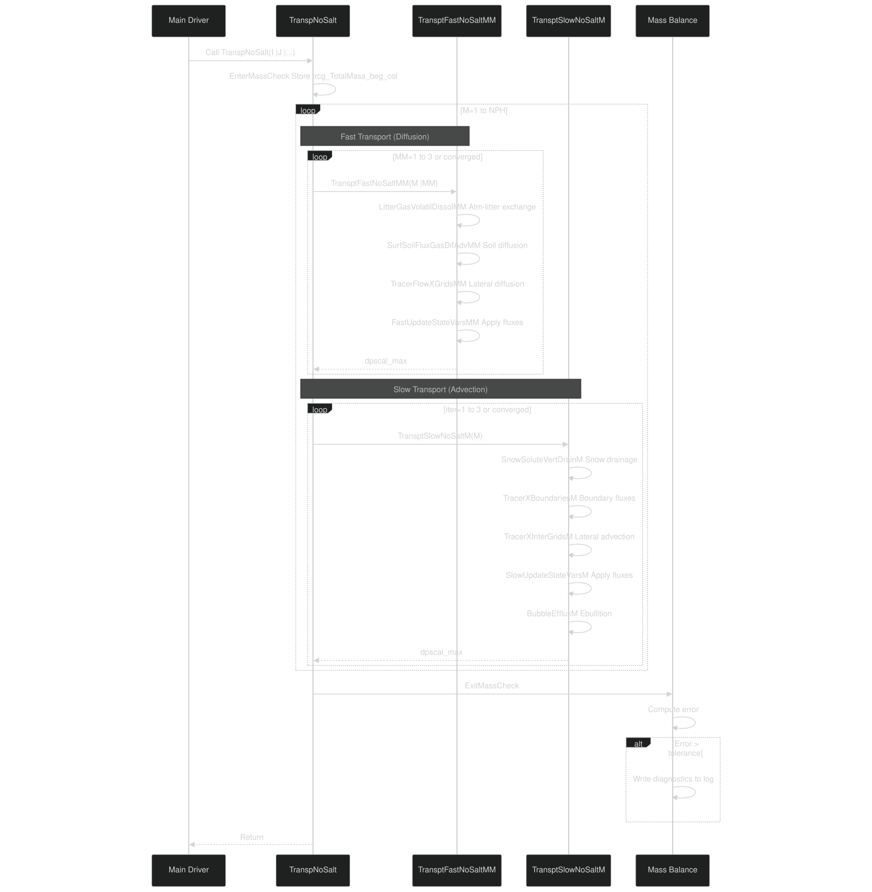

# Gas Transport

Relevant source files

- [f90src/Balances/RedistMod.F90](https://github.com/jingtao-lbl/EcoSIM/blob/7b8a4cf6/f90src/Balances/RedistMod.F90)
- [f90src/Balances/SoilLayerDynMod.F90](https://github.com/jingtao-lbl/EcoSIM/blob/7b8a4cf6/f90src/Balances/SoilLayerDynMod.F90)
- [f90src/Ecosim_datatype/SoilBGCDataType.F90](https://github.com/jingtao-lbl/EcoSIM/blob/7b8a4cf6/f90src/Ecosim_datatype/SoilBGCDataType.F90)
- [f90src/Ecosim_mods/StartsMod.F90](https://github.com/jingtao-lbl/EcoSIM/blob/7b8a4cf6/f90src/Ecosim_mods/StartsMod.F90)
- [f90src/IOutils/HistDataType.F90](https://github.com/jingtao-lbl/EcoSIM/blob/7b8a4cf6/f90src/IOutils/HistDataType.F90)
- [f90src/IOutils/RestartMod.F90](https://github.com/jingtao-lbl/EcoSIM/blob/7b8a4cf6/f90src/IOutils/RestartMod.F90)
- [f90src/ModelDiags/BalancesMod.F90](https://github.com/jingtao-lbl/EcoSIM/blob/7b8a4cf6/f90src/ModelDiags/BalancesMod.F90)
- [f90src/Modelforc/Hour1Mod.F90](https://github.com/jingtao-lbl/EcoSIM/blob/7b8a4cf6/f90src/Modelforc/Hour1Mod.F90)
- [f90src/Plant_bgc/UptakesMod.F90](https://github.com/jingtao-lbl/EcoSIM/blob/7b8a4cf6/f90src/Plant_bgc/UptakesMod.F90)
- [f90src/Transport/Nonsalt/InitNoSaltTransportMod.F90](https://github.com/jingtao-lbl/EcoSIM/blob/7b8a4cf6/f90src/Transport/Nonsalt/InitNoSaltTransportMod.F90)
- [f90src/Transport/Nonsalt/TranspNoSaltDataMod.F90](https://github.com/jingtao-lbl/EcoSIM/blob/7b8a4cf6/f90src/Transport/Nonsalt/TranspNoSaltDataMod.F90)
- [f90src/Transport/Nonsalt/TranspNoSaltFastMod.F90](https://github.com/jingtao-lbl/EcoSIM/blob/7b8a4cf6/f90src/Transport/Nonsalt/TranspNoSaltFastMod.F90)
- [f90src/Transport/Nonsalt/TranspNoSaltMod.F90](https://github.com/jingtao-lbl/EcoSIM/blob/7b8a4cf6/f90src/Transport/Nonsalt/TranspNoSaltMod.F90)
- [f90src/Transport/Nonsalt/TranspNoSaltSlowMod.F90](https://github.com/jingtao-lbl/EcoSIM/blob/7b8a4cf6/f90src/Transport/Nonsalt/TranspNoSaltSlowMod.F90)

## Purpose and Scope

This page describes the gas transport system in EcoSIM, which simulates the movement of gases (CO2, O2, CH4, N2, N2O, NH3, H2, and Ar) through soil, litter, and snow layers. The system accounts for gaseous diffusion, advection with water flow, ebullition (bubble release), and phase transitions between gaseous and dissolved states. For solute transport of non-gaseous species (NH4, NO3, PO4, DOM), see [Solute Transport](#5.2.2) . For water flow driving advective transport, see [Subsurface Flow](#5.1.3) .

Sources:  [f90src/Transport/Nonsalt/TranspNoSaltMod.F90 1-550](https://github.com/jingtao-lbl/EcoSIM/blob/7b8a4cf6/f90src/Transport/Nonsalt/TranspNoSaltMod.F90#L1-L550)

## Overview of Gas Transport System

EcoSIM tracks gases in three phases:

- **Gaseous phase**in soil/litter air-filled pores
- **Dissolved phase**in soil/litter water (micropores and macropores)
- **Root-stored phase**within plant aerenchyma tissue

The transport system uses a split operator approach with fast and slow transport substeps to handle processes operating at different timescales.

Sources:  [f90src/Transport/Nonsalt/TranspNoSaltMod.F90 65-155](https://github.com/jingtao-lbl/EcoSIM/blob/7b8a4cf6/f90src/Transport/Nonsalt/TranspNoSaltMod.F90#L65-L155)  [f90src/Ecosim_datatype/SoilBGCDataType.F90 1-100](https://github.com/jingtao-lbl/EcoSIM/blob/7b8a4cf6/f90src/Ecosim_datatype/SoilBGCDataType.F90#L1-L100)  [f90src/Balances/RedistMod.F90 217-243](https://github.com/jingtao-lbl/EcoSIM/blob/7b8a4cf6/f90src/Balances/RedistMod.F90#L217-L243)

## Gas Species and Tracer Indices

EcoSIM tracks eight gas species, each identified by a tracer index:

| Gas Species | Tracer ID | Molecular Weight | Primary Sources | Primary Sinks | 
| --- | --- | --- | --- | --- |
| CO2 | idg_CO2 | 12.01 g/mol (C) | Respiration, root release | Photosynthesis, diffusion to atmosphere | 
| O2 | idg_O2 | 32.0 g/mol (O2) | Diffusion from atmosphere | Respiration, chemical oxidation | 
| CH4 | idg_CH4 | 12.01 g/mol (C) | Methanogenesis | Methanotrophy, ebullition, diffusion | 
| N2 | idg_N2 | 28.0 g/mol (N2) | Denitrification | N2 fixation | 
| N2O | idg_N2O | 28.0 g/mol (N) | Nitrification, denitrification | Denitrification, diffusion to atmosphere | 
| NH3 | idg_NH3 | 14.0 g/mol (N) | Volatilization, urea hydrolysis | Plant uptake, nitrification | 
| H2 | idg_H2 | 2.0 g/mol (H2) | Fermentation | Methanogenesis | 
| Ar | idg_AR | 39.95 g/mol | Diffusion from atmosphere | Conservative tracer (inert) | 

A special tracer `idg_NH3B` tracks NH4+ (ammonium ion) that equilibrates with NH3 based on pH.

Sources:  [f90src/Ecosim_mods/StartsMod.F90 130-141](https://github.com/jingtao-lbl/EcoSIM/blob/7b8a4cf6/f90src/Ecosim_mods/StartsMod.F90#L130-L141)  [f90src/IOutils/HistDataType.F90 425-433](https://github.com/jingtao-lbl/EcoSIM/blob/7b8a4cf6/f90src/IOutils/HistDataType.F90#L425-L433)

## Gas Phase Representation

### State Variables

For each gas species `idg` and soil layer `L` , three primary state variables track mass:

Gas concentration in air: `trcg_gascl_vr(idg,L,NY,NX)` [g m-3] = `trcg_gasml_vr / VLsoiAirP_vr`

Sources:  [f90src/Ecosim_datatype/SoilBGCDataType.F90 14-38](https://github.com/jingtao-lbl/EcoSIM/blob/7b8a4cf6/f90src/Ecosim_datatype/SoilBGCDataType.F90#L14-L38)  [f90src/Transport/Nonsalt/TranspNoSaltDataMod.F90 1-50](https://github.com/jingtao-lbl/EcoSIM/blob/7b8a4cf6/f90src/Transport/Nonsalt/TranspNoSaltDataMod.F90#L1-L50)

### Dissolution and Volatilization

Phase equilibrium between gas and dissolved phases follows Henry's Law:

Solubility coefficient : `trcs_solcoef_col(idg,NY,NX)` [dimensionless]

Computed in `CalGasSolubility`  [f90src/Modelforc/Hour1Mod.F90 187](https://github.com/jingtao-lbl/EcoSIM/blob/7b8a4cf6/f90src/Modelforc/Hour1Mod.F90#L187-L187) :

Where `gas_solubility(idg, T)` is a temperature-dependent Henry's Law constant.

Equilibration (when `do_instequil = .true.` ): `ForceGasAquaEquil`  [f90src/Modelforc/Hour1Mod.F90 200](https://github.com/jingtao-lbl/EcoSIM/blob/7b8a4cf6/f90src/Modelforc/Hour1Mod.F90#L200-L200) instantly equilibrates gas and dissolved phases within each layer.

Sources:  [f90src/Modelforc/Hour1Mod.F90 182-201](https://github.com/jingtao-lbl/EcoSIM/blob/7b8a4cf6/f90src/Modelforc/Hour1Mod.F90#L182-L201)  [f90src/Ecosim_mods/StartsMod.F90 143-145](https://github.com/jingtao-lbl/EcoSIM/blob/7b8a4cf6/f90src/Ecosim_mods/StartsMod.F90#L143-L145)

## Transport Mechanisms

### Diffusion

Gas diffusion through soil air follows Fick's Law with tortuosity adjustments for soil structure:

Effective diffusivity :

where:

- `D_0`= molecular diffusion coefficient in free air
- `ε_air`= air-filled porosity
- `ε_total`= total porosity

Implementation in `SurfSoilFluxGasDifAdvMM`  [f90src/Transport/Nonsalt/TranspNoSaltFastMod.F90 300-450](https://github.com/jingtao-lbl/EcoSIM/blob/7b8a4cf6/f90src/Transport/Nonsalt/TranspNoSaltFastMod.F90#L300-L450) computes diffusive fluxes between adjacent layers and to the atmosphere.

Surface emission via diffusion: `GasDiff2Surf_flx_col(idg,NY,NX)` [g d-2 h-1]

Sources:  [f90src/Transport/Nonsalt/TranspNoSaltFastMod.F90 300-450](https://github.com/jingtao-lbl/EcoSIM/blob/7b8a4cf6/f90src/Transport/Nonsalt/TranspNoSaltFastMod.F90#L300-L450)

### Advection

Dissolved gases are transported with water flow. For each direction `N` (1=horizontal-X, 2=horizontal-Y, 3=vertical):

Micropore advection : `trcs_TransptMicP_3D(idg,N,L,NY,NX)` [g d-2] Macropore advection : `trcs_TransptMacP_3D(idg,N,L,NY,NX)` [g d-2]

Advective flux = water flux × concentration, computed in `TransptSlowNoSaltM`  [f90src/Transport/Nonsalt/TranspNoSaltSlowMod.F90 42-102](https://github.com/jingtao-lbl/EcoSIM/blob/7b8a4cf6/f90src/Transport/Nonsalt/TranspNoSaltSlowMod.F90#L42-L102)

Sources:  [f90src/Transport/Nonsalt/TranspNoSaltSlowMod.F90 42-102](https://github.com/jingtao-lbl/EcoSIM/blob/7b8a4cf6/f90src/Transport/Nonsalt/TranspNoSaltSlowMod.F90#L42-L102)  [f90src/Ecosim_datatype/SoilBGCDataType.F90 50-52](https://github.com/jingtao-lbl/EcoSIM/blob/7b8a4cf6/f90src/Ecosim_datatype/SoilBGCDataType.F90#L50-L52)

### Ebullition (Bubble Release)

When dissolved gas concentration exceeds saturation (typically in anaerobic, high-production zones), gas forms bubbles that rise and escape:

Ebullition flux : `trcg_ebu_flx_col(idg,NY,NX)` [g d-2 h-1]

Triggered when gas pressure in pore space exceeds threshold. Implementation in `BubbleEffluxM`  [f90src/Transport/Nonsalt/TranspNoSaltSlowMod.F90 150-300](https://github.com/jingtao-lbl/EcoSIM/blob/7b8a4cf6/f90src/Transport/Nonsalt/TranspNoSaltSlowMod.F90#L150-L300)

Ebullition is particularly important for CH4 and CO2 in saturated soils.

Sources:  [f90src/Transport/Nonsalt/TranspNoSaltSlowMod.F90 150-300](https://github.com/jingtao-lbl/EcoSIM/blob/7b8a4cf6/f90src/Transport/Nonsalt/TranspNoSaltSlowMod.F90#L150-L300)  [f90src/IOutils/HistDataType.F90 169-171](https://github.com/jingtao-lbl/EcoSIM/blob/7b8a4cf6/f90src/IOutils/HistDataType.F90#L169-L171)

### Micropore-Macropore Exchange

Water and dissolved gases exchange between micropores (matrix) and macropores (preferential flow paths):

Exchange flux computed based on concentration differences and exchange coefficient proportional to macropore volume fraction.

Sources:  [f90src/Transport/Nonsalt/TranspNoSaltSlowMod.F90 200-400](https://github.com/jingtao-lbl/EcoSIM/blob/7b8a4cf6/f90src/Transport/Nonsalt/TranspNoSaltSlowMod.F90#L200-L400)

## Implementation Architecture

### Split-Operator Approach: Fast vs Slow Transport

The transport system uses operator splitting to separately handle fast (diffusion, dissolution) and slow (advection, ebullition) processes:

Rationale : Gas diffusion and dissolution equilibrate much faster than advection, so they require tighter coupling and more frequent updates within each hydrological timestep.

Sources:  [f90src/Transport/Nonsalt/TranspNoSaltMod.F90 46-156](https://github.com/jingtao-lbl/EcoSIM/blob/7b8a4cf6/f90src/Transport/Nonsalt/TranspNoSaltMod.F90#L46-L156)

### Fast Transport Iteration

`TransptFastNoSaltMM`  [f90src/Transport/Nonsalt/TranspNoSaltFastMod.F90 35-91](https://github.com/jingtao-lbl/EcoSIM/blob/7b8a4cf6/f90src/Transport/Nonsalt/TranspNoSaltFastMod.F90#L35-L91) performs:

Iterates up to 3 times until `dpscal_max < 0.01` (convergence tolerance).

Sources:  [f90src/Transport/Nonsalt/TranspNoSaltFastMod.F90 35-91](https://github.com/jingtao-lbl/EcoSIM/blob/7b8a4cf6/f90src/Transport/Nonsalt/TranspNoSaltFastMod.F90#L35-L91)

### Slow Transport Iteration

`TransptSlowNoSaltM`  [f90src/Transport/Nonsalt/TranspNoSaltSlowMod.F90 42-102](https://github.com/jingtao-lbl/EcoSIM/blob/7b8a4cf6/f90src/Transport/Nonsalt/TranspNoSaltSlowMod.F90#L42-L102) performs:

Iterates up to 3 times for convergence.

Sources:  [f90src/Transport/Nonsalt/TranspNoSaltSlowMod.F90 42-102](https://github.com/jingtao-lbl/EcoSIM/blob/7b8a4cf6/f90src/Transport/Nonsalt/TranspNoSaltSlowMod.F90#L42-L102)

## Key Data Structures and Arrays

### Primary State Arrays

Located in `SoilBGCDataType.F90` :

| Array | Dimensions | Units | Description | 
| --- | --- | --- | --- |
| trcg_gasml_vr | (idg, 0:JZ, JY, JX) | g d-2 | Gas mass in air-filled pores | 
| trcs_solml_vr | (ids, 0:JZ, JY, JX) | g d-2 | Dissolved mass in micropore water | 
| trcs_soHml_vr | (ids, 1:JZ, JY, JX) | g d-2 | Dissolved mass in macropore water | 
| trcg_gascl_vr | (idg, 0:JZ, JY, JX) | g m-3 | Gas concentration in air | 
| trc_solcl_vr | (ids, 0:JZ, JY, JX) | g m-3 | Dissolved concentration in water | 

Note: Layer 0 = litter layer, Layers 1:JZ = soil layers

Sources:  [f90src/Ecosim_datatype/SoilBGCDataType.F90 14-38](https://github.com/jingtao-lbl/EcoSIM/blob/7b8a4cf6/f90src/Ecosim_datatype/SoilBGCDataType.F90#L14-L38)

### Flux Arrays

Located in `SoilBGCDataType.F90` and `ChemTranspDataType.F90` :

| Array | Dimensions | Units | Description | 
| --- | --- | --- | --- |
| SurfGasEmiss_flx_col | (idg, JY, JX) | g d-2 h-1 | Total surface emission | 
| GasDiff2Surf_flx_col | (idg, JY, JX) | g d-2 h-1 | Diffusive emission | 
| trcg_ebu_flx_col | (idg, JY, JX) | g d-2 h-1 | Ebullition emission | 
| Gas_WetDeposit_flx_col | (idg, JY, JX) | g d-2 h-1 | Wet deposition input | 
| GasHydroLoss_flx_col | (idg, JY, JX) | g d-2 h-1 | Hydrological loss (drainage) | 
| RGasNetProd_col | (idg, JY, JX) | g d-2 h-1 | Net biogeochemical production | 
| trcs_TransptMicP_3D | (ids, 1:3, 1:JZ+1, JY, JX) | g d-2 | Micropore transport flux (3D) | 
| Gas_AdvDif_Flx_3D | (idg, 1:3, 1:JZ+1, JY, JX) | g d-2 | Gas advection-diffusion flux (3D) | 

Sources:  [f90src/Ecosim_datatype/SoilBGCDataType.F90 45-90](https://github.com/jingtao-lbl/EcoSIM/blob/7b8a4cf6/f90src/Ecosim_datatype/SoilBGCDataType.F90#L45-L90)  [f90src/IOutils/HistDataType.F90 166-187](https://github.com/jingtao-lbl/EcoSIM/blob/7b8a4cf6/f90src/IOutils/HistDataType.F90#L166-L187)

### Temporary Transport Arrays

Located in `TranspNoSaltDataMod.F90` :

| Array | Purpose | 
| --- | --- |
| WaterFlow2SoilMM_3D | Water flow for fast iteration coupling | 
| RGasAtmDisol2SoilM_col | Atmospheric dissolution flux at iteration M | 
| GasDiff2Surf_fast_flx_col | Fast transport surface flux | 
| trcs_solml2_vr, trcg_gasml2_vr | Temporary state arrays for iteration | 

Sources:  [f90src/Transport/Nonsalt/TranspNoSaltDataMod.F90 1-100](https://github.com/jingtao-lbl/EcoSIM/blob/7b8a4cf6/f90src/Transport/Nonsalt/TranspNoSaltDataMod.F90#L1-L100)

## Numerical Solution Approach

### Flux Limiting and Mass Conservation

To ensure mass conservation and prevent negative concentrations, the code uses flux limiters:

Flux limiter function : `flux_mass_limiter(flux, mass_available, scaling_factor)` adjusts outgoing fluxes to not exceed available mass.

Dribbling mechanism : When uptake/consumption would drive concentration negative, excess demand is stored in `trcs_solml_drib_vr` and satisfied gradually over subsequent timesteps.

Implementation in `SubstrateDribbling`  [f90src/Transport/Nonsalt/TranspNoSaltSlowMod.F90 130-135](https://github.com/jingtao-lbl/EcoSIM/blob/7b8a4cf6/f90src/Transport/Nonsalt/TranspNoSaltSlowMod.F90#L130-L135) :

Sources:  [f90src/Transport/Nonsalt/TranspNoSaltSlowMod.F90 104-148](https://github.com/jingtao-lbl/EcoSIM/blob/7b8a4cf6/f90src/Transport/Nonsalt/TranspNoSaltSlowMod.F90#L104-L148)  [f90src/minimathmod.F90](https://github.com/jingtao-lbl/EcoSIM/blob/7b8a4cf6/f90src/minimathmod.F90#LNaN-LNaN)

### Convergence and Iteration

Both fast and slow transport use iterative solution with convergence check:

Scaling parameter  `pscal(idg)` : Adjusts flux magnitude if mass conservation would be violated Damping parameter  `dpscal(idg)` : Convergence indicator, approaches 0 as solution converges

Sources:  [f90src/Transport/Nonsalt/TranspNoSaltFastMod.F90 50-84](https://github.com/jingtao-lbl/EcoSIM/blob/7b8a4cf6/f90src/Transport/Nonsalt/TranspNoSaltFastMod.F90#L50-L84)  [f90src/Transport/Nonsalt/TranspNoSaltSlowMod.F90 58-97](https://github.com/jingtao-lbl/EcoSIM/blob/7b8a4cf6/f90src/Transport/Nonsalt/TranspNoSaltSlowMod.F90#L58-L97)

## Boundary Conditions

### Atmospheric Boundary

Upper boundary : Atmosphere acts as infinite reservoir with fixed concentration.

Atmospheric concentrations set in `SetAtmsTracerConc`  [f90src/Modelforc/Hour1Mod.F90 276-315](https://github.com/jingtao-lbl/EcoSIM/blob/7b8a4cf6/f90src/Modelforc/Hour1Mod.F90#L276-L315) :

Concentrations adjusted for:

- `PBOT_col`Atmospheric pressure
- `TairK`Air temperature

Sources:  [f90src/Modelforc/Hour1Mod.F90 276-315](https://github.com/jingtao-lbl/EcoSIM/blob/7b8a4cf6/f90src/Modelforc/Hour1Mod.F90#L276-L315)  [f90src/Ecosim_mods/StartsMod.F90 130-141](https://github.com/jingtao-lbl/EcoSIM/blob/7b8a4cf6/f90src/Ecosim_mods/StartsMod.F90#L130-L141)

### Lower Boundary

Bottom boundary at layer `NL_col(NY,NX)` :

- **Zero gradient**: Default assumption - no flux across bottom
- **Drainage loss**`GasHydroLoss_flx_col`: Dissolved gases lost with draining water:

Implemented in `XBoundaryFluxMM`  [f90src/Transport/Nonsalt/TranspNoSaltFastMod.F90 1200-1300](https://github.com/jingtao-lbl/EcoSIM/blob/7b8a4cf6/f90src/Transport/Nonsalt/TranspNoSaltFastMod.F90#L1200-L1300) and `TracerXBoundariesM`  [f90src/Transport/Nonsalt/TranspNoSaltSlowMod.F90 500-600](https://github.com/jingtao-lbl/EcoSIM/blob/7b8a4cf6/f90src/Transport/Nonsalt/TranspNoSaltSlowMod.F90#L500-L600)

Sources:  [f90src/Transport/Nonsalt/TranspNoSaltFastMod.F90 1200-1300](https://github.com/jingtao-lbl/EcoSIM/blob/7b8a4cf6/f90src/Transport/Nonsalt/TranspNoSaltFastMod.F90#L1200-L1300)

### Lateral Boundaries

Horizontal boundaries : Grid cells can exchange gases laterally.

Lateral flux arrays:

- `Gas_AdvDif_FlxMM_2DH(idg,1:2,1:2,NY,NX)`- Fast transport
- `trcs_transpFlxM_2DH(idg,1:2,1:2,NY,NX)`- Slow transport

Directions: (1,:) = west-east, (2,:) = south-north Indices: (:,1) = incoming, (:,2) = outgoing

Sources:  [f90src/Transport/Nonsalt/TranspNoSaltDataMod.F90 17-19](https://github.com/jingtao-lbl/EcoSIM/blob/7b8a4cf6/f90src/Transport/Nonsalt/TranspNoSaltDataMod.F90#L17-L19)

## Mass Balance and Error Tracking

### Mass Balance Framework

Mass conservation check performed at each timestep:

Mass balance equation :

Where:

- `Mass_end``trcg_TotalMass_col``SummarizeTracers`= (from )
- `Mass_beg``trcg_TotalMass_beg_col`=
- `SurfEmission``SurfGasEmiss_flx_col`= (ebullition + diffusion + wet deposition)
- `HydroLoss``GasHydroLoss_flx_col`=
- `NetProd``RGasNetProd_col`=
- `PlantUptake``trcs_Soil2plant_uptake_col`=

Sources:  [f90src/Transport/Nonsalt/TranspNoSaltMod.F90 123-250](https://github.com/jingtao-lbl/EcoSIM/blob/7b8a4cf6/f90src/Transport/Nonsalt/TranspNoSaltMod.F90#L123-L250)  [f90src/ModelDiags/BalancesMod.F90 37-78](https://github.com/jingtao-lbl/EcoSIM/blob/7b8a4cf6/f90src/ModelDiags/BalancesMod.F90#L37-L78)

### Error Tracking Arrays

Located in `BalanceCheckDataType` and `AqueChemDatatype` :

| Array | Dimensions | Units | Description | 
| --- | --- | --- | --- |
| trcg_mass_cumerr_col | (idg, JY, JX) | g d-2 | Cumulative mass error | 
| trcg_TotalMass_beg_col | (idg, JY, JX) | g d-2 | Initial total mass (gas+dissolved+root) | 
| trcg_soilMass_beg_col | (idg, JY, JX) | g d-2 | Initial soil mass | 
| trcg_rootMass_beg_col | (idg, JY, JX) | g d-2 | Initial root-stored mass | 
| trcg_snowMass_beg_col | (idg, JY, JX) | g d-2 | Initial snow mass | 

Cumulative error reported in history output: `h1D_trcg_*_cumerr_col` variables.

Sources:  [f90src/ModelDiags/BalancesMod.F90 65-77](https://github.com/jingtao-lbl/EcoSIM/blob/7b8a4cf6/f90src/ModelDiags/BalancesMod.F90#L65-L77)  [f90src/IOutils/HistDataType.F90 136-142](https://github.com/jingtao-lbl/EcoSIM/blob/7b8a4cf6/f90src/IOutils/HistDataType.F90#L136-L142)

### Error Reporting

When mass error exceeds tolerance ( `abs(errmass) > 1e-5` ), detailed diagnostics written to file unit 121:

Implementation in `ExitMassCheck`  [f90src/Transport/Nonsalt/TranspNoSaltMod.F90 198-243](https://github.com/jingtao-lbl/EcoSIM/blob/7b8a4cf6/f90src/Transport/Nonsalt/TranspNoSaltMod.F90#L198-L243)

Sources:  [f90src/Transport/Nonsalt/TranspNoSaltMod.F90 198-243](https://github.com/jingtao-lbl/EcoSIM/blob/7b8a4cf6/f90src/Transport/Nonsalt/TranspNoSaltMod.F90#L198-L243)

## Computational Workflow

### Complete Transport Sequence

Sources:  [f90src/Transport/Nonsalt/TranspNoSaltMod.F90 46-156](https://github.com/jingtao-lbl/EcoSIM/blob/7b8a4cf6/f90src/Transport/Nonsalt/TranspNoSaltMod.F90#L46-L156)

Key References:

- [f90src/Transport/Nonsalt/TranspNoSaltMod.F901-550](https://github.com/jingtao-lbl/EcoSIM/blob/7b8a4cf6/f90src/Transport/Nonsalt/TranspNoSaltMod.F90#L1-L550)- Main transport controller
- [f90src/Transport/Nonsalt/TranspNoSaltFastMod.F901-500](https://github.com/jingtao-lbl/EcoSIM/blob/7b8a4cf6/f90src/Transport/Nonsalt/TranspNoSaltFastMod.F90#L1-L500)- Fast (diffusive) transport
- [f90src/Transport/Nonsalt/TranspNoSaltSlowMod.F901-800](https://github.com/jingtao-lbl/EcoSIM/blob/7b8a4cf6/f90src/Transport/Nonsalt/TranspNoSaltSlowMod.F90#L1-L800)- Slow (advective) transport
- [f90src/Ecosim_datatype/SoilBGCDataType.F901-200](https://github.com/jingtao-lbl/EcoSIM/blob/7b8a4cf6/f90src/Ecosim_datatype/SoilBGCDataType.F90#L1-L200)- Gas state variable definitions
- [f90src/Transport/Nonsalt/TranspNoSaltDataMod.F901-100](https://github.com/jingtao-lbl/EcoSIM/blob/7b8a4cf6/f90src/Transport/Nonsalt/TranspNoSaltDataMod.F90#L1-L100)- Transport working arrays
- [f90src/Modelforc/Hour1Mod.F90182-201](https://github.com/jingtao-lbl/EcoSIM/blob/7b8a4cf6/f90src/Modelforc/Hour1Mod.F90#L182-L201)- Gas solubility and equilibration
- [f90src/ModelDiags/BalancesMod.F9037-300](https://github.com/jingtao-lbl/EcoSIM/blob/7b8a4cf6/f90src/ModelDiags/BalancesMod.F90#L37-L300)- Mass balance checking