# Solute Transport

Relevant source files

- [f90src/Balances/RedistMod.F90](https://github.com/jingtao-lbl/EcoSIM/blob/7b8a4cf6/f90src/Balances/RedistMod.F90)
- [f90src/Balances/SoilLayerDynMod.F90](https://github.com/jingtao-lbl/EcoSIM/blob/7b8a4cf6/f90src/Balances/SoilLayerDynMod.F90)
- [f90src/Ecosim_datatype/SoilBGCDataType.F90](https://github.com/jingtao-lbl/EcoSIM/blob/7b8a4cf6/f90src/Ecosim_datatype/SoilBGCDataType.F90)
- [f90src/Ecosim_mods/StartsMod.F90](https://github.com/jingtao-lbl/EcoSIM/blob/7b8a4cf6/f90src/Ecosim_mods/StartsMod.F90)
- [f90src/IOutils/HistDataType.F90](https://github.com/jingtao-lbl/EcoSIM/blob/7b8a4cf6/f90src/IOutils/HistDataType.F90)
- [f90src/IOutils/RestartMod.F90](https://github.com/jingtao-lbl/EcoSIM/blob/7b8a4cf6/f90src/IOutils/RestartMod.F90)
- [f90src/ModelDiags/BalancesMod.F90](https://github.com/jingtao-lbl/EcoSIM/blob/7b8a4cf6/f90src/ModelDiags/BalancesMod.F90)
- [f90src/Modelforc/Hour1Mod.F90](https://github.com/jingtao-lbl/EcoSIM/blob/7b8a4cf6/f90src/Modelforc/Hour1Mod.F90)
- [f90src/Plant_bgc/UptakesMod.F90](https://github.com/jingtao-lbl/EcoSIM/blob/7b8a4cf6/f90src/Plant_bgc/UptakesMod.F90)
- [f90src/Transport/Nonsalt/InitNoSaltTransportMod.F90](https://github.com/jingtao-lbl/EcoSIM/blob/7b8a4cf6/f90src/Transport/Nonsalt/InitNoSaltTransportMod.F90)
- [f90src/Transport/Nonsalt/TranspNoSaltDataMod.F90](https://github.com/jingtao-lbl/EcoSIM/blob/7b8a4cf6/f90src/Transport/Nonsalt/TranspNoSaltDataMod.F90)
- [f90src/Transport/Nonsalt/TranspNoSaltFastMod.F90](https://github.com/jingtao-lbl/EcoSIM/blob/7b8a4cf6/f90src/Transport/Nonsalt/TranspNoSaltFastMod.F90)
- [f90src/Transport/Nonsalt/TranspNoSaltMod.F90](https://github.com/jingtao-lbl/EcoSIM/blob/7b8a4cf6/f90src/Transport/Nonsalt/TranspNoSaltMod.F90)
- [f90src/Transport/Nonsalt/TranspNoSaltSlowMod.F90](https://github.com/jingtao-lbl/EcoSIM/blob/7b8a4cf6/f90src/Transport/Nonsalt/TranspNoSaltSlowMod.F90)

## Purpose and Scope

This page documents the transport of dissolved chemical species (solutes) through soil micropores and macropores in EcoSIM. Solutes include dissolved organic matter (DOM), dissolved nutrients (NH4⁺, NO3⁻, H2PO4⁻), and dissolved organic nutrients (DON, DOP). For gaseous species transport, see [Gas Transport](#5.2.1) . For the overall transport framework including mass redistribution, see [Mass Redistribution and Balance](#5.3) .

Solute transport is coupled with water flow and accounts for advection, diffusion, micropore-macropore exchange, surface runoff, and subsurface lateral flow. The implementation uses a dual-porosity framework with separate treatment of fast (gaseous) and slow (nutrient) processes through iterative schemes.

Sources:  [f90src/Transport/Nonsalt/TranspNoSaltMod.F90 1-70](https://github.com/jingtao-lbl/EcoSIM/blob/7b8a4cf6/f90src/Transport/Nonsalt/TranspNoSaltMod.F90#L1-L70)

## Transport Framework

EcoSIM implements solute transport using a segregated approach that separates fast volatile processes from slower nutrient transport processes. The main entry point `TranspNoSalt` orchestrates multiple nested iteration loops to achieve convergence.

Figure 1: Solute Transport Execution Flow

The fast iteration handles volatile species that equilibrate quickly, while the slow iteration addresses DOM and nutrient transport coupled with water flow.

Sources:  [f90src/Transport/Nonsalt/TranspNoSaltMod.F90 65-155](https://github.com/jingtao-lbl/EcoSIM/blob/7b8a4cf6/f90src/Transport/Nonsalt/TranspNoSaltMod.F90#L65-L155)  [f90src/Transport/Nonsalt/TranspNoSaltFastMod.F90 35-91](https://github.com/jingtao-lbl/EcoSIM/blob/7b8a4cf6/f90src/Transport/Nonsalt/TranspNoSaltFastMod.F90#L35-L91)  [f90src/Transport/Nonsalt/TranspNoSaltSlowMod.F90 42-102](https://github.com/jingtao-lbl/EcoSIM/blob/7b8a4cf6/f90src/Transport/Nonsalt/TranspNoSaltSlowMod.F90#L42-L102)

## Solute Species and Data Structures

EcoSIM transports multiple classes of solutes organized by their chemical characteristics. The model uses a tracer ID system to index different species.

### Tracer Categories

| Tracer Category | Species | Tracer IDs | Storage Variables | 
| --- | --- | --- | --- |
| Volatile Gases | CO2, CH4, O2, N2, N2O, NH3, H2, Ar | idg_beg:idg_NH3 | trcg_gasml_vr, trcs_solml_vr | 
| Dissolved Nutrients | NH4⁺, NO3⁻, NO2⁻, H2PO4⁻, HPO4²⁻, urea | ids_nut_beg:ids_nuts_end | trcs_solml_vr | 
| Dissolved Organic Matter | DOC, DON, DOP, acetate | idom_beg:idom_end | DOM_MicP_vr, DOM_MacP_vr | 
| Exchangeable Nutrients | NH4⁺-band, NO3⁻-band, PO4-band | ids_NH4B:ids_H1PO4B | trcs_solml_vr | 

### State Variable Storage

Solutes are stored in layer-specific arrays with separate accounting for micropores and macropores:

Figure 2: Solute Storage Data Structures

The dimension `D` in flux arrays represents direction (1=horizontal-X, 2=horizontal-Y, 3=vertical), `K` is the litter/SOM complex index, and `ids` / `idom` are tracer indices.

Sources:  [f90src/Ecosim_datatype/SoilBGCDataType.F90 1-50](https://github.com/jingtao-lbl/EcoSIM/blob/7b8a4cf6/f90src/Ecosim_datatype/SoilBGCDataType.F90#L1-L50)  [f90src/Transport/Nonsalt/TranspNoSaltDataMod.F90 1-40](https://github.com/jingtao-lbl/EcoSIM/blob/7b8a4cf6/f90src/Transport/Nonsalt/TranspNoSaltDataMod.F90#L1-L40)

## Transport Mechanisms

### Advection with Water Flow

Solute advection is driven by water fluxes through micropores and macropores. The advective flux is calculated as the product of water flux and solute concentration:

$$\text{Flux}_{\text{adv}} = Q \times C$$

where $Q$ is water flux [m³ d⁻² h⁻¹] and $C$ is solute concentration [g m⁻³].

Figure 3: Advective Transport Pathways

Sources:  [f90src/Transport/Nonsalt/TranspNoSaltSlowMod.F90 460-580](https://github.com/jingtao-lbl/EcoSIM/blob/7b8a4cf6/f90src/Transport/Nonsalt/TranspNoSaltSlowMod.F90#L460-L580)

### Diffusion

Diffusive transport occurs due to concentration gradients. For nutrients in micropores, the diffusive flux follows Fick's law with tortuosity correction:

$$\text{Flux} {\text{diff}} = -D {\text{eff}} \times \frac{\Delta C}{\Delta z}$$

where $D_{\text{eff}} = D_0 \times \theta^{10/3} / \phi^2$ is the effective diffusivity accounting for water content ($\theta$) and porosity ($\phi$).

Sources:  [f90src/Transport/Nonsalt/TranspNoSaltSlowMod.F90 600-720](https://github.com/jingtao-lbl/EcoSIM/blob/7b8a4cf6/f90src/Transport/Nonsalt/TranspNoSaltSlowMod.F90#L600-L720)

### Micropore-Macropore Exchange

Solutes exchange between micropores and macropores based on concentration gradients and water flow. The exchange is particularly important during preferential flow events when macropores conduct significant water.

Figure 4: Micropore-Macropore Exchange

The exchange flux is calculated in `CalcMicroMacroExchange` considering the water flux between pore domains and the concentration difference.

Sources:  [f90src/Transport/Nonsalt/TranspNoSaltSlowMod.F90 800-950](https://github.com/jingtao-lbl/EcoSIM/blob/7b8a4cf6/f90src/Transport/Nonsalt/TranspNoSaltSlowMod.F90#L800-L950)

## Dissolved Organic Matter (DOM) Transport

DOM transport requires special handling due to its multiple fractions and interactions with solid organic matter. DOM is tracked separately for different litter/SOM complexes.

Figure 5: DOM Transport and Transformations

DOM is transported separately for each complex ( `K=1:jcplx` ) and chemical element ( `idom` includes DOC, DON, DOP, acetate). The transport considers both micropore and macropore pathways.

Sources:  [f90src/Transport/Nonsalt/TranspNoSaltSlowMod.F90 130-190](https://github.com/jingtao-lbl/EcoSIM/blob/7b8a4cf6/f90src/Transport/Nonsalt/TranspNoSaltSlowMod.F90#L130-L190)  [f90src/Ecosim_datatype/SoilBGCDataType.F90 14-30](https://github.com/jingtao-lbl/EcoSIM/blob/7b8a4cf6/f90src/Ecosim_datatype/SoilBGCDataType.F90#L14-L30)

## Boundary Conditions and External Fluxes

### Surface Boundary

The surface boundary receives inputs from precipitation, irrigation, and atmospheric deposition, and loses solutes through surface runoff and gas emissions.

| Input Flux | Variable | Description | 
| --- | --- | --- |
| Wet deposition (gases) | Gas_WetDeposit_flx_col(idg,NY,NX) | Dissolved gases in precipitation [g d⁻² h⁻¹] | 
| Precipitation nutrients | NH4_rain_mole_conc, NO3_rain_mole_conc | Nutrient concentrations in rain [mol m⁻³] | 
| Irrigation solutes | NH4_irrig_mole_conc, NO3_irrig_mole_conc | Applied with irrigation [mol m⁻³] | 
| Fertilizer inputs | Applied to bands via FertilizerMod | Point source additions | 

| Output Flux | Variable | Description | 
| --- | --- | --- |
| Surface runoff | trcs_SurfRunoff_flx_col(ids,NY,NX) | Solute loss in runoff [g d⁻² h⁻¹] | 
| Gas emission | SurfGasEmiss_flx_col(idg,NY,NX) | Surface to atmosphere [g d⁻² h⁻¹] | 
| DOM runoff | DOM_SurfRunoff_flx_col(idom,K,NY,NX) | DOM in surface water [g d⁻² h⁻¹] | 

Sources:  [f90src/Balances/RedistMod.F90 374-500](https://github.com/jingtao-lbl/EcoSIM/blob/7b8a4cf6/f90src/Balances/RedistMod.F90#L374-L500)  [f90src/Transport/Nonsalt/TranspNoSaltSlowMod.F90 200-280](https://github.com/jingtao-lbl/EcoSIM/blob/7b8a4cf6/f90src/Transport/Nonsalt/TranspNoSaltSlowMod.F90#L200-L280)

### Lateral Boundaries

Lateral fluxes occur between adjacent grid cells through both surface and subsurface pathways:

Figure 6: Lateral Transport Between Grid Cells

Sources:  [f90src/Transport/Nonsalt/TranspNoSaltSlowMod.F90 300-400](https://github.com/jingtao-lbl/EcoSIM/blob/7b8a4cf6/f90src/Transport/Nonsalt/TranspNoSaltSlowMod.F90#L300-L400)  [f90src/Balances/RedistMod.F90 120-157](https://github.com/jingtao-lbl/EcoSIM/blob/7b8a4cf6/f90src/Balances/RedistMod.F90#L120-L157)

### Lower Boundary

The lower boundary at the bottom of the soil column ( `NK_col(NY,NX)` ) can act as:

The drainage flux is:

$$\text{Drainage flux} = Q_{\text{drain}} \times C_{\text{bottom}}$$

where `QDrain_col(NY,NX)` is the drainage water flux and the concentration is from the bottom active layer.

Sources:  [f90src/Balances/RedistMod.F90 210-340](https://github.com/jingtao-lbl/EcoSIM/blob/7b8a4cf6/f90src/Balances/RedistMod.F90#L210-L340)

## Iteration and Convergence Scheme

The transport solver uses nested iteration loops to achieve numerical stability and convergence:

Figure 7: Nested Iteration Structure

### Scaling Factors

During each iteration, the model calculates a scaling factor `pscal(ids)` that limits mass changes to prevent numerical instability. If a tracer would be depleted or exceed physically reasonable bounds, the scaling factor reduces all fluxes proportionally:

$$\text{pscal}(ids) = \min\left(1.0, \frac{M_{\text{available}}}{M_{\text{sink}}}\right)$$

The cumulative scaling factor `dpscal(ids)` tracks total adjustments across iterations and determines convergence.

Sources:  [f90src/Transport/Nonsalt/TranspNoSaltMod.F90 175-260](https://github.com/jingtao-lbl/EcoSIM/blob/7b8a4cf6/f90src/Transport/Nonsalt/TranspNoSaltMod.F90#L175-L260)  [f90src/Transport/Nonsalt/TranspNoSaltSlowMod.F90 60-100](https://github.com/jingtao-lbl/EcoSIM/blob/7b8a4cf6/f90src/Transport/Nonsalt/TranspNoSaltSlowMod.F90#L60-L100)

## Key Implementation Modules

### TranspNoSaltMod.F90

Main transport orchestration module providing:

- `TranspNoSalt()``REDIST()`: Primary entry point called from
- `EnterMassCheck()`: Initialize mass balance tracking
- `ExitMassCheck()`: Verify mass conservation and report errors
- Coordinates fast and slow iteration loops

Sources:  [f90src/Transport/Nonsalt/TranspNoSaltMod.F90 46-155](https://github.com/jingtao-lbl/EcoSIM/blob/7b8a4cf6/f90src/Transport/Nonsalt/TranspNoSaltMod.F90#L46-L155)

### TranspNoSaltSlowMod.F90

Handles nutrient and DOM transport:

- `TransptSlowNoSaltM()`: Main slow iteration driver
- `SnowSoluteVertDrainM()`: Vertical drainage through snowpack layers
- `SurfaceSoluteFluxM()`: Surface boundary condition application
- `TracerXBoundariesM()`: Exchange across domain boundaries
- `TracerXInterGridsM()`: Inter-grid cell transport
- `SlowUpdateStateVarsM()`: Update solute masses with computed fluxes

Sources:  [f90src/Transport/Nonsalt/TranspNoSaltSlowMod.F90 1-150](https://github.com/jingtao-lbl/EcoSIM/blob/7b8a4cf6/f90src/Transport/Nonsalt/TranspNoSaltSlowMod.F90#L1-L150)

### TranspNoSaltFastMod.F90

Handles fast gas transport with aqueous dissolution:

- `TransptFastNoSaltMM()`: Main fast iteration driver
- `LitterGasVolatilDissolMM()`: Gas exchange at litter-atmosphere interface
- `SurfSoilFluxGasDifAdvMM()`: Gas diffusion/advection in top soil
- `FastUpdateStateVarsMM()`: Update gas masses in gas and dissolved phases

Sources:  [f90src/Transport/Nonsalt/TranspNoSaltFastMod.F90 1-100](https://github.com/jingtao-lbl/EcoSIM/blob/7b8a4cf6/f90src/Transport/Nonsalt/TranspNoSaltFastMod.F90#L1-L100)

### TranspNoSaltDataMod.F90

Defines data structures for transport calculations:

- `_flxM``_flxMM`Temporary storage arrays for fluxes ( , suffixes)
- `errmass_fast``errmass_slow`Error tracking arrays ( , )
- `_2_vr`Iteration-specific copies of state variables ( suffix)

Sources:  [f90src/Transport/Nonsalt/TranspNoSaltDataMod.F90 1-80](https://github.com/jingtao-lbl/EcoSIM/blob/7b8a4cf6/f90src/Transport/Nonsalt/TranspNoSaltDataMod.F90#L1-L80)

## Mass Conservation and Balance Checking

Rigorous mass balance checks are performed to ensure transport accuracy:

Figure 8: Mass Balance Verification Workflow

The balance check equation for each tracer is:

$$\text{Error} = -\Delta M + F_{\text{emit}} + F_{\text{hydro}} + F_{\text{BGC}} + F_{\text{drib}}$$

where:

- $\Delta M$ = change in total mass (litter + snow + soil)
- $F_{\text{emit}}$ = surface emissions
- $F_{\text{hydro}}$ = hydrological losses (runoff + drainage)
- $F_{\text{BGC}}$ = net biogeochemical production
- $F_{\text{drib}}$ = numerical dribble correction

Errors exceeding `1.e-5` g d⁻² are logged with detailed diagnostic information showing mass changes in different compartments.

Sources:  [f90src/Transport/Nonsalt/TranspNoSaltMod.F90 120-250](https://github.com/jingtao-lbl/EcoSIM/blob/7b8a4cf6/f90src/Transport/Nonsalt/TranspNoSaltMod.F90#L120-L250)  [f90src/ModelDiags/BalancesMod.F90 174-290](https://github.com/jingtao-lbl/EcoSIM/blob/7b8a4cf6/f90src/ModelDiags/BalancesMod.F90#L174-L290)

## Interaction with Biogeochemical Processes

Solute transport is tightly coupled with biogeochemical transformations (see [Microbial Model](#4.2) and [Soil Chemistry and Geochemistry](#4.3) ):

Figure 9: Transport-BGC Coupling

Transport and BGC are solved sequentially within each iteration:

This operator splitting approach is stable when time steps are small and allows modular development of transport and BGC components.

Sources:  [f90src/Transport/Nonsalt/TranspNoSaltSlowMod.F90 104-145](https://github.com/jingtao-lbl/EcoSIM/blob/7b8a4cf6/f90src/Transport/Nonsalt/TranspNoSaltSlowMod.F90#L104-L145)  [f90src/Plant_bgc/UptakesMod.F90 40-210](https://github.com/jingtao-lbl/EcoSIM/blob/7b8a4cf6/f90src/Plant_bgc/UptakesMod.F90#L40-L210)