# Transport Processes

Relevant source files

- [f90src/Balances/RedistMod.F90](https://github.com/jingtao-lbl/EcoSIM/blob/7b8a4cf6/f90src/Balances/RedistMod.F90)
- [f90src/Balances/SoilLayerDynMod.F90](https://github.com/jingtao-lbl/EcoSIM/blob/7b8a4cf6/f90src/Balances/SoilLayerDynMod.F90)
- [f90src/Ecosim_datatype/SoilBGCDataType.F90](https://github.com/jingtao-lbl/EcoSIM/blob/7b8a4cf6/f90src/Ecosim_datatype/SoilBGCDataType.F90)
- [f90src/Ecosim_mods/StartsMod.F90](https://github.com/jingtao-lbl/EcoSIM/blob/7b8a4cf6/f90src/Ecosim_mods/StartsMod.F90)
- [f90src/IOutils/HistDataType.F90](https://github.com/jingtao-lbl/EcoSIM/blob/7b8a4cf6/f90src/IOutils/HistDataType.F90)
- [f90src/IOutils/RestartMod.F90](https://github.com/jingtao-lbl/EcoSIM/blob/7b8a4cf6/f90src/IOutils/RestartMod.F90)
- [f90src/ModelDiags/BalancesMod.F90](https://github.com/jingtao-lbl/EcoSIM/blob/7b8a4cf6/f90src/ModelDiags/BalancesMod.F90)
- [f90src/Modelforc/Hour1Mod.F90](https://github.com/jingtao-lbl/EcoSIM/blob/7b8a4cf6/f90src/Modelforc/Hour1Mod.F90)
- [f90src/Plant_bgc/UptakesMod.F90](https://github.com/jingtao-lbl/EcoSIM/blob/7b8a4cf6/f90src/Plant_bgc/UptakesMod.F90)
- [f90src/Transport/Nonsalt/InitNoSaltTransportMod.F90](https://github.com/jingtao-lbl/EcoSIM/blob/7b8a4cf6/f90src/Transport/Nonsalt/InitNoSaltTransportMod.F90)
- [f90src/Transport/Nonsalt/TranspNoSaltDataMod.F90](https://github.com/jingtao-lbl/EcoSIM/blob/7b8a4cf6/f90src/Transport/Nonsalt/TranspNoSaltDataMod.F90)
- [f90src/Transport/Nonsalt/TranspNoSaltFastMod.F90](https://github.com/jingtao-lbl/EcoSIM/blob/7b8a4cf6/f90src/Transport/Nonsalt/TranspNoSaltFastMod.F90)
- [f90src/Transport/Nonsalt/TranspNoSaltMod.F90](https://github.com/jingtao-lbl/EcoSIM/blob/7b8a4cf6/f90src/Transport/Nonsalt/TranspNoSaltMod.F90)
- [f90src/Transport/Nonsalt/TranspNoSaltSlowMod.F90](https://github.com/jingtao-lbl/EcoSIM/blob/7b8a4cf6/f90src/Transport/Nonsalt/TranspNoSaltSlowMod.F90)

## Purpose and Scope

This document describes the transport mechanisms for gases and solutes in EcoSIM's subsurface system. Transport processes handle the movement of chemical tracers through soil layers via diffusion, advection, and dispersion, accounting for the dual-porosity structure of micropores and macropores. For information about soil water movement that drives advective transport, see [Subsurface Flow](#5.1.3) . For information about mass redistribution and layer dynamics, see [Mass Redistribution and Balance](#5.3) .

## Transport System Architecture

EcoSIM implements a comprehensive transport system that handles both gaseous and aqueous tracers through a dual-porosity soil structure. The system distinguishes between fast processes (gas diffusion and dissolution) and slow processes (solute advection with water flow and DOM transport).

Sources:  [f90src/Transport/Nonsalt/TranspNoSaltMod.F90 1-300](https://github.com/jingtao-lbl/EcoSIM/blob/7b8a4cf6/f90src/Transport/Nonsalt/TranspNoSaltMod.F90#L1-L300)  [f90src/Transport/Nonsalt/TranspNoSaltFastMod.F90 1-100](https://github.com/jingtao-lbl/EcoSIM/blob/7b8a4cf6/f90src/Transport/Nonsalt/TranspNoSaltFastMod.F90#L1-L100)  [f90src/Transport/Nonsalt/TranspNoSaltSlowMod.F90 1-100](https://github.com/jingtao-lbl/EcoSIM/blob/7b8a4cf6/f90src/Transport/Nonsalt/TranspNoSaltSlowMod.F90#L1-L100)

### Tracer Classification

EcoSIM tracks multiple chemical species through the transport system, organized by phase and mobility:

| Tracer Type | ID Range | Examples | Transport Mode | 
| --- | --- | --- | --- |
| Gases | idg_beg:idg_end | CO2, O2, CH4, N2O, NH3, H2, Ar | Fast diffusion + dissolution | 
| Aqueous nutrients | ids_nut_beg:ids_nuts_end | NH4, NO3, H2PO4, HPO4 | Slow advection with water | 
| DOM | idom_beg:idom_end | DOC, DON, DOP | Slow advection + dispersion | 
| Aqueous gases | idg_beg:idg_NH3 | Dissolved forms | Slow advection | 

Sources:  [f90src/Ecosim_datatype/TracerIDMod.F90](https://github.com/jingtao-lbl/EcoSIM/blob/7b8a4cf6/f90src/Ecosim_datatype/TracerIDMod.F90)  [f90src/Ecosim_datatype/SoilBGCDataType.F90 1-50](https://github.com/jingtao-lbl/EcoSIM/blob/7b8a4cf6/f90src/Ecosim_datatype/SoilBGCDataType.F90#L1-L50)

## Dual-Porosity Structure

The transport system operates on a dual-porosity framework where soil layers contain both micropores and macropores with distinct flow characteristics and tracer concentrations.

Sources:  [f90src/Ecosim_datatype/SoilBGCDataType.F90 20-25](https://github.com/jingtao-lbl/EcoSIM/blob/7b8a4cf6/f90src/Ecosim_datatype/SoilBGCDataType.F90#L20-L25)  [f90src/Ecosim_datatype/SoilWaterDataType.F90](https://github.com/jingtao-lbl/EcoSIM/blob/7b8a4cf6/f90src/Ecosim_datatype/SoilWaterDataType.F90)  [f90src/Transport/Nonsalt/TranspNoSaltDataMod.F90 1-50](https://github.com/jingtao-lbl/EcoSIM/blob/7b8a4cf6/f90src/Transport/Nonsalt/TranspNoSaltDataMod.F90#L1-L50)

### Micropore vs Macropore Characteristics

Micropores (matrix flow):

- Smaller pore spaces within soil aggregates
- Slower water movement driven by matric potential gradients
- Contains majority of dissolved solutes and DOM
- Gas exchange via dissolution/volatilization
- `VLMicP_vr``trcs_solml_vr``trcg_gasml_vr`Variables: , ,

Macropores (preferential flow):

- Larger pore spaces, cracks, and root channels
- Faster water movement during high-intensity rainfall
- Rapid transport of solutes bypassing matrix
- `VFLWX`Exchange with micropores controlled by parameter
- `VLMacP_vr``trcs_soHml_vr``WaterFlowSoiMacP_3D`Variables: , ,

Sources:  [f90src/Transport/Nonsalt/TranspNoSaltDataMod.F90 10-11](https://github.com/jingtao-lbl/EcoSIM/blob/7b8a4cf6/f90src/Transport/Nonsalt/TranspNoSaltDataMod.F90#L10-L11)  [f90src/Balances/SoilLayerDynMod.F90 56-70](https://github.com/jingtao-lbl/EcoSIM/blob/7b8a4cf6/f90src/Balances/SoilLayerDynMod.F90#L56-L70)

## Fast Transport: Gas Diffusion and Dissolution

Fast transport processes handle gaseous diffusion through air-filled pore spaces and gas dissolution/volatilization at the air-water interface. These processes occur on shorter timescales than water movement.

Sources:  [f90src/Transport/Nonsalt/TranspNoSaltFastMod.F90 35-91](https://github.com/jingtao-lbl/EcoSIM/blob/7b8a4cf6/f90src/Transport/Nonsalt/TranspNoSaltFastMod.F90#L35-L91)  [f90src/Modelforc/Hour1Mod.F90 276-315](https://github.com/jingtao-lbl/EcoSIM/blob/7b8a4cf6/f90src/Modelforc/Hour1Mod.F90#L276-L315)

### Gas Diffusion Implementation

Gas diffusion follows Fick's law with tortuosity correction based on air-filled porosity:

Key Function:  `TransptFastNoSaltMM`  [f90src/Transport/Nonsalt/TranspNoSaltFastMod.F90 35-91](https://github.com/jingtao-lbl/EcoSIM/blob/7b8a4cf6/f90src/Transport/Nonsalt/TranspNoSaltFastMod.F90#L35-L91)

The diffusion coefficient is modified by:

- `VLsoiAirP_vr`Air-filled porosity ( )
- Tortuosity factor (empirical relationship)
- Temperature correction (Arrhenius-type)

Iteration scheme:

Sources:  [f90src/Transport/Nonsalt/TranspNoSaltFastMod.F90 35-91](https://github.com/jingtao-lbl/EcoSIM/blob/7b8a4cf6/f90src/Transport/Nonsalt/TranspNoSaltFastMod.F90#L35-L91)

### Gas Dissolution and Volatilization

The air-water interface in each layer exchanges gases according to Henry's law equilibrium:

Dissolution flux calculation:

Where:

- `k_exchange`= mass transfer coefficient dependent on turbulence
- `C_gas`= gas concentration in air phase
- `H`= Henry's law constant (temperature-dependent)
- `C_aqueous`= dissolved gas concentration

Implementation:  `LitterGasVolatilDissolMM` handles surface litter exchange with atmosphere, accounting for wet deposition and canopy interception.

Sources:  [f90src/Transport/Nonsalt/TranspNoSaltFastMod.F90 61](https://github.com/jingtao-lbl/EcoSIM/blob/7b8a4cf6/f90src/Transport/Nonsalt/TranspNoSaltFastMod.F90#L61-L61)  [f90src/Modelforc/Hour1Mod.F90 306-311](https://github.com/jingtao-lbl/EcoSIM/blob/7b8a4cf6/f90src/Modelforc/Hour1Mod.F90#L306-L311)

## Slow Transport: Advection and Dispersion

Slow transport processes move dissolved solutes and DOM with water flow through micropores and macropores. These processes are coupled to the hydrological timestep.

Sources:  [f90src/Transport/Nonsalt/TranspNoSaltSlowMod.F90 42-102](https://github.com/jingtao-lbl/EcoSIM/blob/7b8a4cf6/f90src/Transport/Nonsalt/TranspNoSaltSlowMod.F90#L42-L102)

### Advection Implementation

Solute advection follows water flow with concentration maintained during transport:

Algorithm:  `TransptSlowNoSaltM`  [f90src/Transport/Nonsalt/TranspNoSaltSlowMod.F90 42-102](https://github.com/jingtao-lbl/EcoSIM/blob/7b8a4cf6/f90src/Transport/Nonsalt/TranspNoSaltSlowMod.F90#L42-L102)

Mass flux calculation:

Where `pscal` is a scaling factor to prevent negative concentrations.

Sources:  [f90src/Transport/Nonsalt/TranspNoSaltSlowMod.F90 42-102](https://github.com/jingtao-lbl/EcoSIM/blob/7b8a4cf6/f90src/Transport/Nonsalt/TranspNoSaltSlowMod.F90#L42-L102)

### Micropore-Macropore Exchange

Exchange between micropore and macropore domains is controlled by local hydraulic conditions:

Exchange flux:

Where:

- `VFLWX = 0.5`[f90src/Transport/Nonsalt/TranspNoSaltDataMod.F9011](https://github.com/jingtao-lbl/EcoSIM/blob/7b8a4cf6/f90src/Transport/Nonsalt/TranspNoSaltDataMod.F90#L11-L11)- default exchange coefficient
- `XFRS * total_volume`[f90src/Transport/Nonsalt/TranspNoSaltDataMod.F9010](https://github.com/jingtao-lbl/EcoSIM/blob/7b8a4cf6/f90src/Transport/Nonsalt/TranspNoSaltDataMod.F90#L10-L10)Exchange volume limited by

This mechanism allows:

- Rapid preferential flow through macropores during infiltration
- Gradual equilibration with micropore matrix
- Bypass flow for surface-applied chemicals

Sources:  [f90src/Transport/Nonsalt/TranspNoSaltDataMod.F90 10-11](https://github.com/jingtao-lbl/EcoSIM/blob/7b8a4cf6/f90src/Transport/Nonsalt/TranspNoSaltDataMod.F90#L10-L11)

### DOM Transport Specifics

Dissolved organic matter (DOM) transport includes additional complexity:

DOM components:

- `idom_beg:idom_end`Organized by chemical element: C, N, P (via )
- `K`Organized by litter complex: woody, fine, manure (via index )
- `DOM_MicP_vr(idom,K,L,NY,NX)`Tracked separately:

Transport mechanisms:

Iteration scheme: DOM uses same slow transport iteration as nutrients with separate convergence tracking via `dpscal_dom`  [f90src/Transport/Nonsalt/TranspNoSaltSlowMod.F90 93-95](https://github.com/jingtao-lbl/EcoSIM/blob/7b8a4cf6/f90src/Transport/Nonsalt/TranspNoSaltSlowMod.F90#L93-L95)

Sources:  [f90src/Transport/Nonsalt/TranspNoSaltSlowMod.F90 93-96](https://github.com/jingtao-lbl/EcoSIM/blob/7b8a4cf6/f90src/Transport/Nonsalt/TranspNoSaltSlowMod.F90#L93-L96)  [f90src/Ecosim_datatype/SoilBGCDataType.F90 19](https://github.com/jingtao-lbl/EcoSIM/blob/7b8a4cf6/f90src/Ecosim_datatype/SoilBGCDataType.F90#L19-L19)

## Surface Boundary Conditions

Transport processes at the surface involve exchange with atmosphere, precipitation input, and surface runoff.

Sources:  [f90src/Balances/RedistMod.F90 374-501](https://github.com/jingtao-lbl/EcoSIM/blob/7b8a4cf6/f90src/Balances/RedistMod.F90#L374-L501)  [f90src/Transport/Nonsalt/TranspNoSaltMod.F90 123-230](https://github.com/jingtao-lbl/EcoSIM/blob/7b8a4cf6/f90src/Transport/Nonsalt/TranspNoSaltMod.F90#L123-L230)

### Wet Deposition

Precipitation and irrigation deliver tracers to the surface:

Gas dissolution in precipitation:

Calculated for all gases in [f90src/Balances/RedistMod.F90 430-436](https://github.com/jingtao-lbl/EcoSIM/blob/7b8a4cf6/f90src/Balances/RedistMod.F90#L430-L436)

Nutrient inputs:

- `NH4_rain_mole_conc`NH4 from rain:
- `NO3_rain_mole_conc`NO3 from rain:
- `H2PO4_rain_mole_conc + HPO4_rain_mole_conc`PO4 from rain:
- Similar for irrigation sources

Applied in `HandleSurfaceBoundary`  [f90src/Balances/RedistMod.F90 374-501](https://github.com/jingtao-lbl/EcoSIM/blob/7b8a4cf6/f90src/Balances/RedistMod.F90#L374-L501)

Sources:  [f90src/Balances/RedistMod.F90 430-461](https://github.com/jingtao-lbl/EcoSIM/blob/7b8a4cf6/f90src/Balances/RedistMod.F90#L430-L461)

### Gas Emissions

Surface gas emissions combine multiple pathways:

Total emission flux:

Calculated in `ExitMassCheck`  [f90src/Transport/Nonsalt/TranspNoSaltMod.F90 164-165](https://github.com/jingtao-lbl/EcoSIM/blob/7b8a4cf6/f90src/Transport/Nonsalt/TranspNoSaltMod.F90#L164-L165)

Ebullition (bubble flux): Rapid gas release when dissolved gas concentration exceeds solubility limit. Implementation in `BubbleEffluxM` handles:

- Supersaturation detection
- Bubble formation threshold
- Release to atmosphere
- Partitioning among gas species

Sources:  [f90src/Transport/Nonsalt/TranspNoSaltMod.F90 164-165](https://github.com/jingtao-lbl/EcoSIM/blob/7b8a4cf6/f90src/Transport/Nonsalt/TranspNoSaltMod.F90#L164-L165)  [f90src/Transport/Nonsalt/TranspNoSaltSlowMod.F90](https://github.com/jingtao-lbl/EcoSIM/blob/7b8a4cf6/f90src/Transport/Nonsalt/TranspNoSaltSlowMod.F90)

## Numerical Implementation

### Iteration and Convergence

Transport uses nested iteration schemes to achieve mass conservation:

Fast transport iteration (gases):

- [f90src/Transport/Nonsalt/TranspNoSaltFastMod.F9055](https://github.com/jingtao-lbl/EcoSIM/blob/7b8a4cf6/f90src/Transport/Nonsalt/TranspNoSaltFastMod.F90#L55-L55)Maximum 3 iterations
- `dpscal_max > 1.e-2`[f90src/Transport/Nonsalt/TranspNoSaltFastMod.F9055](https://github.com/jingtao-lbl/EcoSIM/blob/7b8a4cf6/f90src/Transport/Nonsalt/TranspNoSaltFastMod.F90#L55-L55)Convergence criterion:
- `dpscal(idg)`Scaling factor prevents negative concentrations
- `dpscal = dpscal * (1 - pscal)`[f90src/Transport/Nonsalt/TranspNoSaltFastMod.F9077-82](https://github.com/jingtao-lbl/EcoSIM/blob/7b8a4cf6/f90src/Transport/Nonsalt/TranspNoSaltFastMod.F90#L77-L82)Updated each iteration:

Slow transport iteration (solutes, DOM):

- [f90src/Transport/Nonsalt/TranspNoSaltSlowMod.F9063](https://github.com/jingtao-lbl/EcoSIM/blob/7b8a4cf6/f90src/Transport/Nonsalt/TranspNoSaltSlowMod.F90#L63-L63)Maximum 3 iterations
- Separate convergence for nutrients and DOM
- `dpscal_max > 1.e-2`[f90src/Transport/Nonsalt/TranspNoSaltSlowMod.F9063](https://github.com/jingtao-lbl/EcoSIM/blob/7b8a4cf6/f90src/Transport/Nonsalt/TranspNoSaltSlowMod.F90#L63-L63)Convergence criterion:

Sub-iteration within hydrology: The transport is called within the water flow iteration loop ( `NPH` ) to maintain coupling between water movement and solute transport.

Sources:  [f90src/Transport/Nonsalt/TranspNoSaltFastMod.F90 50-85](https://github.com/jingtao-lbl/EcoSIM/blob/7b8a4cf6/f90src/Transport/Nonsalt/TranspNoSaltFastMod.F90#L50-L85)  [f90src/Transport/Nonsalt/TranspNoSaltSlowMod.F90 63-97](https://github.com/jingtao-lbl/EcoSIM/blob/7b8a4cf6/f90src/Transport/Nonsalt/TranspNoSaltSlowMod.F90#L63-L97)

### Mass Conservation and Balance Checking

Comprehensive mass balance checks ensure conservation throughout transport:

Sources:  [f90src/Transport/Nonsalt/TranspNoSaltMod.F90 65-120](https://github.com/jingtao-lbl/EcoSIM/blob/7b8a4cf6/f90src/Transport/Nonsalt/TranspNoSaltMod.F90#L65-L120)  [f90src/Transport/Nonsalt/TranspNoSaltMod.F90 123-243](https://github.com/jingtao-lbl/EcoSIM/blob/7b8a4cf6/f90src/Transport/Nonsalt/TranspNoSaltMod.F90#L123-L243)

Mass balance equation:

Where:

- `ΔMass = trcs_mass_now - trcs_mass_beg`
- `SurfEmission`includes ebullition, diffusion, and wet deposition
- `HydroLoss`includes drainage and runoff
- `NetProduction`includes biogeochemical sources minus sinks
- `Dribble`accounts for numerical round-off

Error reporting: If `|error| > 1.e-5` , detailed diagnostics are written showing:

- Initial and final mass by compartment (litter, snow, soil)
- Individual flux components
- Mass change in each compartment
- Net flux to each compartment

Implementation in `ExitMassCheck`  [f90src/Transport/Nonsalt/TranspNoSaltMod.F90 123-243](https://github.com/jingtao-lbl/EcoSIM/blob/7b8a4cf6/f90src/Transport/Nonsalt/TranspNoSaltMod.F90#L123-L243)

Sources:  [f90src/Transport/Nonsalt/TranspNoSaltMod.F90 123-243](https://github.com/jingtao-lbl/EcoSIM/blob/7b8a4cf6/f90src/Transport/Nonsalt/TranspNoSaltMod.F90#L123-L243)

### Substrate Dribbling

To prevent negative concentrations due to numerical round-off, EcoSIM implements a "dribbling" mechanism:

Concept: When a sink term would cause negative mass, the excess consumption is stored in a "dribble" pool and released gradually in subsequent timesteps.

Implementation:

Used throughout slow transport updates [f90src/Transport/Nonsalt/TranspNoSaltSlowMod.F90 115-145](https://github.com/jingtao-lbl/EcoSIM/blob/7b8a4cf6/f90src/Transport/Nonsalt/TranspNoSaltSlowMod.F90#L115-L145)

Tracked variables:

- `trcs_solml_drib_vr(ids,L)`- dribble pool for each solute and layer
- `DOM_MicP_drib_vr(idom,K,L)`- dribble pool for DOM

This ensures:

- Strict non-negativity of all concentrations
- Mass conservation over longer timescales
- Numerical stability in BGC-transport coupling

Sources:  [f90src/Transport/Nonsalt/TranspNoSaltSlowMod.F90 115-145](https://github.com/jingtao-lbl/EcoSIM/blob/7b8a4cf6/f90src/Transport/Nonsalt/TranspNoSaltSlowMod.F90#L115-L145)  [f90src/Balances/RedistMod.F90](https://github.com/jingtao-lbl/EcoSIM/blob/7b8a4cf6/f90src/Balances/RedistMod.F90)

## Transport Data Structures

### Primary State Variables

| Variable | Dimensions | Units | Description | 
| --- | --- | --- | --- |
| trcg_gasml_vr | (idg,0:JZ,JY,JX) | g d⁻² | Gas mass in air-filled micropores | 
| trcs_solml_vr | (ids,0:JZ,JY,JX) | g d⁻² | Solute mass in micropore water | 
| trcs_soHml_vr | (ids,1:JZ,JY,JX) | g d⁻² | Solute mass in macropore water | 
| DOM_MicP_vr | (idom,K,0:JZ,JY,JX) | g d⁻² | DOM mass in micropore by litter complex | 
| trcg_solsml_snvr | (idg,1:JS,JY,JX) | g d⁻² | Dissolved gas in snow layers | 

Note: Layer 0 is surface litter; layers 1 to JZ are soil layers.

Sources:  [f90src/Ecosim_datatype/SoilBGCDataType.F90 22-38](https://github.com/jingtao-lbl/EcoSIM/blob/7b8a4cf6/f90src/Ecosim_datatype/SoilBGCDataType.F90#L22-L38)

### Flux Variables

| Variable | Dimensions | Units | Description | 
| --- | --- | --- | --- |
| WaterFlowSoiMicP_3D | (3,0:JZ1,JY,JX) | m³ d⁻² | Water flux through micropores (3 directions) | 
| WaterFlowSoiMacP_3D | (3,1:JZ1,JY,JX) | m³ d⁻² | Water flux through macropores (3 directions) | 
| Gas_AdvDif_Flx_3D | (idg,3,0:JZ1,JY,JX) | g d⁻² | Gas diffusion flux (3 directions) | 
| DOM_MicpTranspFlxM_3D | (idom,K,3,0:JZ1,JY,JX) | g d⁻² | DOM flux through micropores | 
| trcs_TransptMicP_3D | (ids,3,0:JZ1,JY,JX) | g d⁻² | Solute flux through micropores | 
| trcs_TransptMacP_3D | (ids,3,1:JZ1,JY,JX) | g d⁻² | Solute flux through macropores | 

Direction index (1st or 2nd dimension):

- 1 = X-direction (horizontal)
- 2 = Y-direction (horizontal)
- 3 = Z-direction (vertical)

Sources:  [f90src/Ecosim_datatype/SoilBGCDataType.F90](https://github.com/jingtao-lbl/EcoSIM/blob/7b8a4cf6/f90src/Ecosim_datatype/SoilBGCDataType.F90)  [f90src/Ecosim_datatype/ChemTranspDataType.F90](https://github.com/jingtao-lbl/EcoSIM/blob/7b8a4cf6/f90src/Ecosim_datatype/ChemTranspDataType.F90)

### Boundary and Interface Fluxes

| Variable | Dimensions | Units | Description | 
| --- | --- | --- | --- |
| SurfGasEmiss_flx_col | (idg,JY,JX) | g d⁻² h⁻¹ | Total gas emission to atmosphere | 
| trcg_ebu_flx_col | (idg,JY,JX) | g d⁻² h⁻¹ | Ebullition (bubble) flux | 
| GasDiff2Surf_flx_col | (idg,JY,JX) | g d⁻² h⁻¹ | Diffusive gas flux to surface | 
| Gas_WetDeposit_flx_col | (idg,JY,JX) | g d⁻² h⁻¹ | Wet deposition from precipitation | 
| trcn_SurfRunoff_flx_col | (ids,JY,JX) | g d⁻² h⁻¹ | Nutrient loss via surface runoff | 
| trcs_drainage_flx_col | (ids,JY,JX) | g d⁻² h⁻¹ | Drainage loss at bottom boundary | 
| DOM_SurfRunoff_flx_col | (idom,K,JY,JX) | g d⁻² h⁻¹ | DOM loss via surface runoff | 

Sources:  [f90src/Ecosim_datatype/SoilBGCDataType.F90 29-38](https://github.com/jingtao-lbl/EcoSIM/blob/7b8a4cf6/f90src/Ecosim_datatype/SoilBGCDataType.F90#L29-L38)  [f90src/Ecosim_datatype/ChemTranspDataType.F90](https://github.com/jingtao-lbl/EcoSIM/blob/7b8a4cf6/f90src/Ecosim_datatype/ChemTranspDataType.F90)

## Integration with Other Subsystems

### Coupling with Hydrology

Transport is tightly coupled to the soil water module:

Transport is called after water flow solution within the hydrology iteration loop.

Sources:  [f90src/Transport/Nonsalt/TranspNoSaltMod.F90 1-47](https://github.com/jingtao-lbl/EcoSIM/blob/7b8a4cf6/f90src/Transport/Nonsalt/TranspNoSaltMod.F90#L1-L47)

### Coupling with Biogeochemistry

Biogeochemical processes provide source and sink terms:

Gaseous tracers:

- `RGasNetProd_col(idg_CO2)`- CO2 from respiration
- `RGasNetProd_col(idg_O2)`- O2 consumption
- `RGasNetProd_col(idg_CH4)`- CH4 from methanogenesis
- `RGasNetProd_col(idg_N2O)`- N2O from nitrification/denitrification
- `RGasNetProd_col(idg_NH3)`- NH3 volatilization

Solute tracers:

- `RBGCSrcSoluteM_vr(ids,L)`- biogeochemical source
- `RBGCSinkSoluteM_vr(ids,L)`- biogeochemical sink

Applied in `ApplyFastSourceSink` and `ApplySlowSourceSink`  [f90src/Transport/Nonsalt/TranspNoSaltFastMod.F90 93-120](https://github.com/jingtao-lbl/EcoSIM/blob/7b8a4cf6/f90src/Transport/Nonsalt/TranspNoSaltFastMod.F90#L93-L120)  [f90src/Transport/Nonsalt/TranspNoSaltSlowMod.F90 104-145](https://github.com/jingtao-lbl/EcoSIM/blob/7b8a4cf6/f90src/Transport/Nonsalt/TranspNoSaltSlowMod.F90#L104-L145)

Sources:  [f90src/Transport/Nonsalt/TranspNoSaltFastMod.F90 93-120](https://github.com/jingtao-lbl/EcoSIM/blob/7b8a4cf6/f90src/Transport/Nonsalt/TranspNoSaltFastMod.F90#L93-L120)  [f90src/Transport/Nonsalt/TranspNoSaltSlowMod.F90 104-145](https://github.com/jingtao-lbl/EcoSIM/blob/7b8a4cf6/f90src/Transport/Nonsalt/TranspNoSaltSlowMod.F90#L104-L145)

### Coupling with Plant Uptake

Plant roots extract nutrients and exchange gases:

Root nutrient uptake:

- `trcs_Soil2plant_uptake_col(ids_NH4)`- NH4 uptake
- `trcs_Soil2plant_uptake_col(ids_NO3)`- NO3 uptake
- `trcs_Soil2plant_uptake_col(ids_H2PO4)`- PO4 uptake

Root gas exchange:

- `RootCO2Ar2Soil_vr(L)`- CO2 release from respiration
- `RootO2_TotSink_col`- O2 consumption
- Plant-mediated transport through aerenchyma (for wetland species)

Root fluxes are accumulated from plant model and applied as layer-specific source/sink terms.

Sources:  [f90src/Transport/Nonsalt/TranspNoSaltMod.F90 191-194](https://github.com/jingtao-lbl/EcoSIM/blob/7b8a4cf6/f90src/Transport/Nonsalt/TranspNoSaltMod.F90#L191-L194)  [f90src/Plant_bgc/UptakesMod.F90](https://github.com/jingtao-lbl/EcoSIM/blob/7b8a4cf6/f90src/Plant_bgc/UptakesMod.F90)

### Coupling with Redistribution

The redistribution module ( `RedistMod` ) orchestrates transport within the overall simulation sequence:

Called each hour in the main simulation loop [f90src/Modelforc/Hour1Mod.F90](https://github.com/jingtao-lbl/EcoSIM/blob/7b8a4cf6/f90src/Modelforc/Hour1Mod.F90)

Within `REDIST` , transport results are:

Sources:  [f90src/Balances/RedistMod.F90 74-156](https://github.com/jingtao-lbl/EcoSIM/blob/7b8a4cf6/f90src/Balances/RedistMod.F90#L74-L156)  [f90src/Modelforc/Hour1Mod.F90](https://github.com/jingtao-lbl/EcoSIM/blob/7b8a4cf6/f90src/Modelforc/Hour1Mod.F90)

## Key Module Interactions

Key subroutines:

Sources:  [f90src/Transport/Nonsalt/TranspNoSaltMod.F90 46-156](https://github.com/jingtao-lbl/EcoSIM/blob/7b8a4cf6/f90src/Transport/Nonsalt/TranspNoSaltMod.F90#L46-L156)  [f90src/Transport/Nonsalt/TranspNoSaltFastMod.F90 35-91](https://github.com/jingtao-lbl/EcoSIM/blob/7b8a4cf6/f90src/Transport/Nonsalt/TranspNoSaltFastMod.F90#L35-L91)  [f90src/Transport/Nonsalt/TranspNoSaltSlowMod.F90 42-102](https://github.com/jingtao-lbl/EcoSIM/blob/7b8a4cf6/f90src/Transport/Nonsalt/TranspNoSaltSlowMod.F90#L42-L102)