# Mass Redistribution and Balance

Relevant source files

- [f90src/APIs/GeochemAPI.F90](https://github.com/jingtao-lbl/EcoSIM/blob/7b8a4cf6/f90src/APIs/GeochemAPI.F90)
- [f90src/Balances/RedistMod.F90](https://github.com/jingtao-lbl/EcoSIM/blob/7b8a4cf6/f90src/Balances/RedistMod.F90)
- [f90src/Balances/SoilLayerDynMod.F90](https://github.com/jingtao-lbl/EcoSIM/blob/7b8a4cf6/f90src/Balances/SoilLayerDynMod.F90)
- [f90src/Ecosim_datatype/SoilBGCDataType.F90](https://github.com/jingtao-lbl/EcoSIM/blob/7b8a4cf6/f90src/Ecosim_datatype/SoilBGCDataType.F90)
- [f90src/Ecosim_mods/StartsMod.F90](https://github.com/jingtao-lbl/EcoSIM/blob/7b8a4cf6/f90src/Ecosim_mods/StartsMod.F90)
- [f90src/Geochem/Layers_chem/SoluteMod.F90](https://github.com/jingtao-lbl/EcoSIM/blob/7b8a4cf6/f90src/Geochem/Layers_chem/SoluteMod.F90)
- [f90src/IOutils/HistDataType.F90](https://github.com/jingtao-lbl/EcoSIM/blob/7b8a4cf6/f90src/IOutils/HistDataType.F90)
- [f90src/IOutils/RestartMod.F90](https://github.com/jingtao-lbl/EcoSIM/blob/7b8a4cf6/f90src/IOutils/RestartMod.F90)
- [f90src/ModelDiags/BalancesMod.F90](https://github.com/jingtao-lbl/EcoSIM/blob/7b8a4cf6/f90src/ModelDiags/BalancesMod.F90)
- [f90src/Modelforc/Hour1Mod.F90](https://github.com/jingtao-lbl/EcoSIM/blob/7b8a4cf6/f90src/Modelforc/Hour1Mod.F90)
- [f90src/Plant_bgc/UptakesMod.F90](https://github.com/jingtao-lbl/EcoSIM/blob/7b8a4cf6/f90src/Plant_bgc/UptakesMod.F90)
- [f90src/Transport/Nonsalt/InitNoSaltTransportMod.F90](https://github.com/jingtao-lbl/EcoSIM/blob/7b8a4cf6/f90src/Transport/Nonsalt/InitNoSaltTransportMod.F90)
- [f90src/Transport/Nonsalt/TranspNoSaltDataMod.F90](https://github.com/jingtao-lbl/EcoSIM/blob/7b8a4cf6/f90src/Transport/Nonsalt/TranspNoSaltDataMod.F90)
- [f90src/Transport/Nonsalt/TranspNoSaltFastMod.F90](https://github.com/jingtao-lbl/EcoSIM/blob/7b8a4cf6/f90src/Transport/Nonsalt/TranspNoSaltFastMod.F90)
- [f90src/Transport/Nonsalt/TranspNoSaltMod.F90](https://github.com/jingtao-lbl/EcoSIM/blob/7b8a4cf6/f90src/Transport/Nonsalt/TranspNoSaltMod.F90)
- [f90src/Transport/Nonsalt/TranspNoSaltSlowMod.F90](https://github.com/jingtao-lbl/EcoSIM/blob/7b8a4cf6/f90src/Transport/Nonsalt/TranspNoSaltSlowMod.F90)

## Purpose and Scope

This page documents the mass redistribution and balance checking systems in EcoSIM. After transport and biogeochemical processes calculate fluxes each timestep, the `redist` module updates all state variables (water, heat, carbon, nutrients, gases) and verifies mass conservation. This includes handling cross-grid lateral transport, erosion, sediment deposition, layer thickness adjustments, and detailed mass balance diagnostics.

For information about the transport processes that calculate fluxes prior to redistribution, see [Transport Processes](#5.2) . For details on the hydro-thermal model that provides water and heat fluxes, see [Hydro-Thermal Model](#5.1) .

## Redistribution Workflow

The `redist` subroutine in `RedistMod.F90` orchestrates the complete state variable update and mass balance verification sequence executed each hour.

### Main Execution Sequence

Sources:  [f90src/Balances/RedistMod.F90 74-156](https://github.com/jingtao-lbl/EcoSIM/blob/7b8a4cf6/f90src/Balances/RedistMod.F90#L74-L156)

### Key State Variables Updated

The redistribution process updates numerous state variable arrays organized by dimension:

| Variable Pattern | Dimensions | Description | Example Variables | 
| --- | --- | --- | --- |
| *_col(NY,NX) | Column (2D) | Column-integrated values | WatMass_col, HeatStore_col | 
| *_vr(L,NY,NX) | Vertical layer (3D) | Layer-specific soil properties | VLWatMicP_vr, TKS_vr, trcg_gasml_vr | 
| *_pvr(N,L,NZ,NY,NX) | Plant-vertical (5D) | Root uptake by plant type and layer | PopuRootMycoC_pvr | 
| *_snvr(L,NY,NX) | Snow layer (3D) | Snow layer properties | VLWatSnow_snvr, TKSnow_snvr | 
| *_2DH(dir,dir,NY,NX) | 2D Horizontal flux | Lateral fluxes between grids | XGridSurfRunoff_2DH | 

Sources:  [f90src/Balances/RedistMod.F90 1-60](https://github.com/jingtao-lbl/EcoSIM/blob/7b8a4cf6/f90src/Balances/RedistMod.F90#L1-L60)  [f90src/Ecosim_datatype/SoilBGCDataType.F90 1-200](https://github.com/jingtao-lbl/EcoSIM/blob/7b8a4cf6/f90src/Ecosim_datatype/SoilBGCDataType.F90#L1-L200)

## Mass Balance Checking System

The `BalancesMod` implements comprehensive mass conservation verification for water, heat, and all chemical tracers. Checks are performed at the beginning and end of each hourly timestep.

### Balance Check Workflow

Sources:  [f90src/ModelDiags/BalancesMod.F90 37-79](https://github.com/jingtao-lbl/EcoSIM/blob/7b8a4cf6/f90src/ModelDiags/BalancesMod.F90#L37-L79)  [f90src/ModelDiags/BalancesMod.F90 174-290](https://github.com/jingtao-lbl/EcoSIM/blob/7b8a4cf6/f90src/ModelDiags/BalancesMod.F90#L174-L290)

### Balance Check Components
Water Balance
Water conservation verifies:

Where:

- **Inputs:**`PrecAtm_col``Irrigation_col``QWatIntLaterFlow_col`Precipitation ( ), irrigation ( ), lateral inflow ( )
- **Outputs:**`VapXAir2GSurf_col``QVegET_col``QRunSurf_col``QDrain_col``QDischarg2WTBL_col`Evapotranspiration ( , ), runoff ( ), drainage ( ), discharge ( )
- **Storage:**Canopy water, snow, litter water, soil water (micropores + macropores)

Implementation:  [f90src/ModelDiags/BalancesMod.F90 206-234](https://github.com/jingtao-lbl/EcoSIM/blob/7b8a4cf6/f90src/ModelDiags/BalancesMod.F90#L206-L234)
Component Water Balances

Sources:  [f90src/ModelDiags/BalancesMod.F90 113-145](https://github.com/jingtao-lbl/EcoSIM/blob/7b8a4cf6/f90src/ModelDiags/BalancesMod.F90#L113-L145)
Heat Balance
Heat conservation equation:

Key variables:

- `HeatStore_col`: Total heat storage (canopy + snow + litter + soil)
- `Eco_NetRad_col`: Net radiation
- `Eco_Heat_Latent_col`: Latent heat flux
- `Eco_Heat_Sens_col`: Sensible heat flux
- `THeatSoiThaw_col``THeatSnowThaw_col`, : Phase change heat

Implementation:  [f90src/ModelDiags/BalancesMod.F90 148-171](https://github.com/jingtao-lbl/EcoSIM/blob/7b8a4cf6/f90src/ModelDiags/BalancesMod.F90#L148-L171)  [f90src/ModelDiags/BalancesMod.F90 231-234](https://github.com/jingtao-lbl/EcoSIM/blob/7b8a4cf6/f90src/ModelDiags/BalancesMod.F90#L231-L234)
Tracer Mass Balance
For gaseous tracers (CO₂, CH₄, O₂, N₂, N₂O, NH₃, H₂, Ar):

Key arrays:

- `trcg_TotalMass_beg_col(idg,NY,NX)`: Initial tracer mass
- `SurfGasEmiss_all_flx_col(idg,NY,NX)`: Surface emission (ebullition + diffusion)
- `GasHydroLoss_flx_col(idg,NY,NX)`: Loss via drainage
- `RGasNetProd_col(idg,NY,NX)`: Net biogeochemical production
- `trcs_Soil2plant_uptake_col(idg,NY,NX)`: Plant uptake

Implementation:  [f90src/Transport/Nonsalt/TranspNoSaltMod.F90 123-243](https://github.com/jingtao-lbl/EcoSIM/blob/7b8a4cf6/f90src/Transport/Nonsalt/TranspNoSaltMod.F90#L123-L243)

### Error Reporting

Mass balance violations exceeding tolerance thresholds trigger detailed diagnostic output:

| Component | Tolerance | Action | 
| --- | --- | --- |
| Water | 1×10⁻⁴ m³ | Write detailed diagnostics to unit 110 | 
| Heat | 1×10⁻⁶ MJ | Write diagnostics and continue | 
| Tracers | 1×10⁻⁴ g | Write diagnostics to unit 121 | 
| Critical errors | > threshold × 10 | Call endrun() to abort simulation | 

Sources:  [f90src/ModelDiags/BalancesMod.F90 236-290](https://github.com/jingtao-lbl/EcoSIM/blob/7b8a4cf6/f90src/ModelDiags/BalancesMod.F90#L236-L290)

## Surface Boundary Updates

The `HandleSurfaceBoundary` subroutine processes all surface boundary fluxes and updates surface layer state variables.

### Surface Flux Processing

Sources:  [f90src/Balances/RedistMod.F90 374-505](https://github.com/jingtao-lbl/EcoSIM/blob/7b8a4cf6/f90src/Balances/RedistMod.F90#L374-L505)

### Surface Tracer Updates

Surface layer (layer 0 = litter) tracers are updated with biogeochemical production/consumption terms:

Sources:  [f90src/Balances/RedistMod.F90 343-371](https://github.com/jingtao-lbl/EcoSIM/blob/7b8a4cf6/f90src/Balances/RedistMod.F90#L343-L371)

## Soil Layer Dynamics and Grid Updates

The `UpdateSoilGrids` subroutine dynamically adjusts soil layer thicknesses based on water table changes, freeze-thaw processes, erosion, and organic matter accumulation.

### Grid Update Workflow

Sources:  [f90src/Balances/SoilLayerDynMod.F90 1-93](https://github.com/jingtao-lbl/EcoSIM/blob/7b8a4cf6/f90src/Balances/SoilLayerDynMod.F90#L1-L93)  [f90src/Balances/RedistMod.F90 147](https://github.com/jingtao-lbl/EcoSIM/blob/7b8a4cf6/f90src/Balances/RedistMod.F90#L147-L147)

### Layer Redistribution Algorithm

When layer thickness changes, all state variables must be redistributed. The algorithm handles three cases:
Case 1: Inner Node Redistribution (iInnerNode)
State variables are redistributed proportionally by mass:

For layers that split or merge:

- **Split:**Distribute mass proportionally to new layer volumes
- **Merge:**Sum masses from contributing layers

Implementation:  [f90src/Balances/SoilLayerDynMod.F90 56-600](https://github.com/jingtao-lbl/EcoSIM/blob/7b8a4cf6/f90src/Balances/SoilLayerDynMod.F90#L56-L600)
Case 2: Pond Shrinkage (iPondShrink)
When ponded water infiltrates:

- Transfer water, heat, and dissolved tracers from pond (layer 0) to upper soil
- Adjust surface elevation
- Update NU_col (top active layer index)

Case 3: Pond Growth (iPondGrow)
When water table rises above surface:

- Create or expand pond layer
- Transfer soil water and tracers to pond
- Update surface boundary conditions

### State Variables Redistributed

The redistribution process handles numerous variable types:

| Variable Type | Array Pattern | Redistribution Method | 
| --- | --- | --- |
| Water content | VLWatMicP_vr(L,NY,NX) | Volume-weighted | 
| Ice content | VLiceMicP_vr(L,NY,NX) | Volume-weighted | 
| Temperature | TKS_vr(L,NY,NX) | Heat-capacity weighted | 
| Gaseous tracers | trcg_gasml_vr(idg,L,NY,NX) | Mass-conserving | 
| Dissolved tracers | trcs_solml_vr(ids,L,NY,NX) | Mass-conserving | 
| Soil organic matter | SolidOMAct_vr(ielem,ipool,L,NY,NX) | Mass-conserving | 
| Microbial biomass | MicrobC_vr(imic,L,NY,NX) | Mass-conserving | 
| Root biomass | PopuRootMycoC_pvr(N,L,NZ,NY,NX) | Mass-conserving per PFT | 

Sources:  [f90src/Balances/SoilLayerDynMod.F90 100-800](https://github.com/jingtao-lbl/EcoSIM/blob/7b8a4cf6/f90src/Balances/SoilLayerDynMod.F90#L100-L800)

## Cross-Grid Transport

The `XGridTranspt` subroutine handles lateral transport of water, heat, and tracers between adjacent grid cells.

### Lateral Flux Structure

Sources:  [f90src/Balances/RedistMod.F90 125](https://github.com/jingtao-lbl/EcoSIM/blob/7b8a4cf6/f90src/Balances/RedistMod.F90#L125-L125)  [f90src/Modelforc/Hour1Mod.F90 318-424](https://github.com/jingtao-lbl/EcoSIM/blob/7b8a4cf6/f90src/Modelforc/Hour1Mod.F90#L318-L424)

### Lateral Transport Arrays

Lateral fluxes are stored in 2D horizontal arrays with directional indexing:

Key lateral flux arrays:

| Array | Units | Description | 
| --- | --- | --- |
| XGridSurfRunoff_2DH(1:2,1:2,NY,NX) | m³ h⁻¹ | Surface water runoff | 
| HeatXGridBySurfRunoff_2DH(1:2,1:2,NY,NX) | MJ h⁻¹ | Heat in surface runoff | 
| DOM_FloXSurRunoff_2DH(idom,jcplx,1:2,1:2,NY,NX) | g h⁻¹ | Dissolved organic matter | 
| trcg_FloXSurRunoff_2D(idg,1:2,1:2,NY,NX) | g h⁻¹ | Gaseous tracers | 
| trcn_FloXSurRunoff_2D(ids,1:2,1:2,NY,NX) | g h⁻¹ | Nutrient tracers | 

Sources:  [f90src/Modelforc/Hour1Mod.F90 330-364](https://github.com/jingtao-lbl/EcoSIM/blob/7b8a4cf6/f90src/Modelforc/Hour1Mod.F90#L330-L364)

### Lateral Transport Algorithm

For each hour:

The flux direction indicator `IFLB_2DH(dir1,dir2,NY,NX)` tracks flow direction:

- Positive: Flow into cell
- Negative: Flow out of cell
- Zero: No flow

Sources:  [f90src/Modelforc/Hour1Mod.F90 330-364](https://github.com/jingtao-lbl/EcoSIM/blob/7b8a4cf6/f90src/Modelforc/Hour1Mod.F90#L330-L364)

## Erosion and Sediment Handling

Soil erosion and sediment transport are handled when the erosion mode is activated ( `iErosionMode.EQ.ieros_frzthaweros` or `ieros_frzthawsomeros` ).

### Erosion Components

Sources:  [f90src/Modelforc/Hour1Mod.F90 154-155](https://github.com/jingtao-lbl/EcoSIM/blob/7b8a4cf6/f90src/Modelforc/Hour1Mod.F90#L154-L155)  [f90src/Balances/RedistMod.F90 113](https://github.com/jingtao-lbl/EcoSIM/blob/7b8a4cf6/f90src/Balances/RedistMod.F90#L113-L113)  [f90src/Balances/RedistMod.F90 133](https://github.com/jingtao-lbl/EcoSIM/blob/7b8a4cf6/f90src/Balances/RedistMod.F90#L133-L133)

### Erosion Flux Arrays

Erosion fluxes are tracked in 2D horizontal arrays:

Sources:  [f90src/Modelforc/Hour1Mod.F90 392-422](https://github.com/jingtao-lbl/EcoSIM/blob/7b8a4cf6/f90src/Modelforc/Hour1Mod.F90#L392-L422)

### Sediment Deposition

The `SinkSediments` subroutine calculates settling velocities and removes sediment from surface water:

Sources:  [f90src/Balances/RedistMod.F90 113](https://github.com/jingtao-lbl/EcoSIM/blob/7b8a4cf6/f90src/Balances/RedistMod.F90#L113-L113)

## Output Variable Updates

After all state variables are updated, the `UpdateOutputVars` subroutine computes diagnostic variables for output files.

### Diagnostic Variable Categories

Sources:  [f90src/Balances/RedistMod.F90 160-272](https://github.com/jingtao-lbl/EcoSIM/blob/7b8a4cf6/f90src/Balances/RedistMod.F90#L160-L272)

### Key Output Calculations
Surface Gas Emissions
Total surface emission includes multiple pathways:
Energy Fluxes
Energy fluxes are accumulated from individual components:
Carbon Budgets
Net ecosystem exchange and cumulative fluxes:

Sources:  [f90src/Balances/RedistMod.F90 217-234](https://github.com/jingtao-lbl/EcoSIM/blob/7b8a4cf6/f90src/Balances/RedistMod.F90#L217-L234)
Soil Moisture Output
Volumetric water and ice content normalized by porosity:

Sources:  [f90src/Balances/RedistMod.F90 256-269](https://github.com/jingtao-lbl/EcoSIM/blob/7b8a4cf6/f90src/Balances/RedistMod.F90#L256-L269)

## Numerical Considerations

### Mass Conservation Enforcement

Several mechanisms ensure strict mass conservation:
Dribbling Algorithm
When a sink term would produce negative mass, the flux is stored in a "dribble" accumulator:

When mass becomes available, accumulated dribble is applied:

Sources:  [f90src/Transport/Nonsalt/TranspNoSaltSlowMod.F90 115](https://github.com/jingtao-lbl/EcoSIM/blob/7b8a4cf6/f90src/Transport/Nonsalt/TranspNoSaltSlowMod.F90#L115-L115)  [f90src/Transport/Nonsalt/TranspNoSaltSlowMod.F90 132](https://github.com/jingtao-lbl/EcoSIM/blob/7b8a4cf6/f90src/Transport/Nonsalt/TranspNoSaltSlowMod.F90#L132-L132)

### Numerical Stability

To maintain stability:

- **Minimum thresholds**`ZEROS``ZEROS2`: State variables below or are set to zero
- **Safe division**`safe_adb(numerator, denominator)`: prevents division by zero
- **Flux scaling**: When fluxes would violate conservation, scaling factors < 1.0 are applied
- **Time sub-stepping**: Fast processes may use multiple internal iterations per hour

Sources:  [f90src/Balances/RedistMod.F90 256-272](https://github.com/jingtao-lbl/EcoSIM/blob/7b8a4cf6/f90src/Balances/RedistMod.F90#L256-L272)  [f90src/minimath/minimathmod.F90 1-100](https://github.com/jingtao-lbl/EcoSIM/blob/7b8a4cf6/f90src/minimath/minimathmod.F90#L1-L100)

## Summary

The mass redistribution and balance system in EcoSIM provides:

The `redist` subroutine coordinates these operations each hour, ensuring physically consistent state updates and strict mass conservation before the next timestep begins.

Sources:  [f90src/Balances/RedistMod.F90 1-1500](https://github.com/jingtao-lbl/EcoSIM/blob/7b8a4cf6/f90src/Balances/RedistMod.F90#L1-L1500)  [f90src/ModelDiags/BalancesMod.F90 1-400](https://github.com/jingtao-lbl/EcoSIM/blob/7b8a4cf6/f90src/ModelDiags/BalancesMod.F90#L1-L400)  [f90src/Balances/SoilLayerDynMod.F90 1-800](https://github.com/jingtao-lbl/EcoSIM/blob/7b8a4cf6/f90src/Balances/SoilLayerDynMod.F90#L1-L800)