# Physical Processes and Transport

Relevant source files

- [f90src/Balances/RedistMod.F90](https://github.com/jingtao-lbl/EcoSIM/blob/7b8a4cf6/f90src/Balances/RedistMod.F90)
- [f90src/Balances/SoilLayerDynMod.F90](https://github.com/jingtao-lbl/EcoSIM/blob/7b8a4cf6/f90src/Balances/SoilLayerDynMod.F90)
- [f90src/Ecosim_datatype/SoilBGCDataType.F90](https://github.com/jingtao-lbl/EcoSIM/blob/7b8a4cf6/f90src/Ecosim_datatype/SoilBGCDataType.F90)
- [f90src/Ecosim_mods/StartsMod.F90](https://github.com/jingtao-lbl/EcoSIM/blob/7b8a4cf6/f90src/Ecosim_mods/StartsMod.F90)
- [f90src/HydroTherm/SnowPhys/SnowBalanceMod.F90](https://github.com/jingtao-lbl/EcoSIM/blob/7b8a4cf6/f90src/HydroTherm/SnowPhys/SnowBalanceMod.F90)
- [f90src/HydroTherm/SnowPhys/SnowPhysMod.F90](https://github.com/jingtao-lbl/EcoSIM/blob/7b8a4cf6/f90src/HydroTherm/SnowPhys/SnowPhysMod.F90)
- [f90src/HydroTherm/SoilPhys/WatsubMod.F90](https://github.com/jingtao-lbl/EcoSIM/blob/7b8a4cf6/f90src/HydroTherm/SoilPhys/WatsubMod.F90)
- [f90src/HydroTherm/SurfPhys/SurfLitterPhysMod.F90](https://github.com/jingtao-lbl/EcoSIM/blob/7b8a4cf6/f90src/HydroTherm/SurfPhys/SurfLitterPhysMod.F90)
- [f90src/HydroTherm/SurfPhys/SurfPhysMod.F90](https://github.com/jingtao-lbl/EcoSIM/blob/7b8a4cf6/f90src/HydroTherm/SurfPhys/SurfPhysMod.F90)
- [f90src/IOutils/HistDataType.F90](https://github.com/jingtao-lbl/EcoSIM/blob/7b8a4cf6/f90src/IOutils/HistDataType.F90)
- [f90src/IOutils/RestartMod.F90](https://github.com/jingtao-lbl/EcoSIM/blob/7b8a4cf6/f90src/IOutils/RestartMod.F90)
- [f90src/ModelDiags/BalancesMod.F90](https://github.com/jingtao-lbl/EcoSIM/blob/7b8a4cf6/f90src/ModelDiags/BalancesMod.F90)
- [f90src/Modelforc/Hour1Mod.F90](https://github.com/jingtao-lbl/EcoSIM/blob/7b8a4cf6/f90src/Modelforc/Hour1Mod.F90)
- [f90src/Plant_bgc/UptakesMod.F90](https://github.com/jingtao-lbl/EcoSIM/blob/7b8a4cf6/f90src/Plant_bgc/UptakesMod.F90)
- [f90src/Transport/Nonsalt/InitNoSaltTransportMod.F90](https://github.com/jingtao-lbl/EcoSIM/blob/7b8a4cf6/f90src/Transport/Nonsalt/InitNoSaltTransportMod.F90)
- [f90src/Transport/Nonsalt/TranspNoSaltDataMod.F90](https://github.com/jingtao-lbl/EcoSIM/blob/7b8a4cf6/f90src/Transport/Nonsalt/TranspNoSaltDataMod.F90)
- [f90src/Transport/Nonsalt/TranspNoSaltFastMod.F90](https://github.com/jingtao-lbl/EcoSIM/blob/7b8a4cf6/f90src/Transport/Nonsalt/TranspNoSaltFastMod.F90)
- [f90src/Transport/Nonsalt/TranspNoSaltMod.F90](https://github.com/jingtao-lbl/EcoSIM/blob/7b8a4cf6/f90src/Transport/Nonsalt/TranspNoSaltMod.F90)
- [f90src/Transport/Nonsalt/TranspNoSaltSlowMod.F90](https://github.com/jingtao-lbl/EcoSIM/blob/7b8a4cf6/f90src/Transport/Nonsalt/TranspNoSaltSlowMod.F90)

## Purpose and Scope

This page documents the physical processes that govern energy, water, and mass transport in EcoSIM. These processes form the physical foundation upon which biogeochemical transformations occur. The content includes:

- Surface energy partitioning and atmospheric exchange
- Snow layer dynamics and phase changes
- Coupled subsurface water and heat flow
- Gas and solute transport through soil profiles
- Mass redistribution, erosion, and conservation checks

For biogeochemical process models that depend on these physical drivers, see [Biogeochemical Process Models](#4) . For data structures that store physical state variables, see [Data Management](#6) .

## System Architecture

The physical processes in EcoSIM are organized into several coupled subsystems that operate at hourly timesteps with internal subcycling for numerical stability:


Sources:  [f90src/HydroTherm/SurfPhys/SurfPhysMod.F90 1-885](https://github.com/jingtao-lbl/EcoSIM/blob/7b8a4cf6/f90src/HydroTherm/SurfPhys/SurfPhysMod.F90#L1-L885)  [f90src/HydroTherm/SoilPhys/WatsubMod.F90 1-500](https://github.com/jingtao-lbl/EcoSIM/blob/7b8a4cf6/f90src/HydroTherm/SoilPhys/WatsubMod.F90#L1-L500)  [f90src/Transport/Nonsalt/TranspNoSaltMod.F90 1-200](https://github.com/jingtao-lbl/EcoSIM/blob/7b8a4cf6/f90src/Transport/Nonsalt/TranspNoSaltMod.F90#L1-L200)  [f90src/Balances/RedistMod.F90 1-160](https://github.com/jingtao-lbl/EcoSIM/blob/7b8a4cf6/f90src/Balances/RedistMod.F90#L1-L160)

## Surface Energy Balance

The surface energy balance is solved at each hourly timestep to partition incoming radiation and determine fluxes of sensible heat, latent heat (evapotranspiration), and ground heat storage. The system accounts for snow cover, surface litter, and bare soil fractions.

### Energy Balance Components

Radiation Balance:

Where albedo (α) depends on surface composition (water, ice, soil, litter). Short-wave and long-wave radiation are partitioned among snow, litter, and soil surfaces based on fractional coverage.

Heat Flux Partitioning:

- **H**: Sensible heat flux (atmosphere-surface)
- **λE**: Latent heat flux (evaporation/condensation)
- **G**: Ground heat flux (conduction into soil/snow)
- **ΔS**: Storage term (phase changes, heat capacity changes)

### Key Code Entities

| Entity | Purpose | Key Variables | 
| --- | --- | --- |
| StageSurfacePhysModel | Initialize surface fractions, resistances, radiation | FracSurfAsSnow_col, FracSurfByLitR_col | 
| RunSurfacePhysModelM | Execute surface energy balance for subcycle M | HeatFluxAir2Soi, VapXAir2TopLay | 
| SoilSRFEnerbyBalanceM | Bare soil surface energy partition | Radnet2Grnd, LatentHeatEvapAir2Grnd | 
| SurfLitREnergyBalanceM | Litter layer energy balance | HeatFluxAir2LitR, VapXAir2LitR | 
| SurfaceRadiation | Calculate radiation fluxes | RadSW2Sno_col, LWRad2Soil_col | 
| SurfaceResistances | Aerodynamic and surface resistances | CanopyBndlResist_col, ResistanceLitRLay | 

Surface Fraction Calculation:


Sources:  [f90src/HydroTherm/SurfPhys/SurfPhysMod.F90 113-170](https://github.com/jingtao-lbl/EcoSIM/blob/7b8a4cf6/f90src/HydroTherm/SurfPhys/SurfPhysMod.F90#L113-L170)  [f90src/HydroTherm/SurfPhys/SurfPhysMod.F90 238-254](https://github.com/jingtao-lbl/EcoSIM/blob/7b8a4cf6/f90src/HydroTherm/SurfPhys/SurfPhysMod.F90#L238-L254)  [f90src/HydroTherm/SurfPhys/SurfPhysMod.F90 275-314](https://github.com/jingtao-lbl/EcoSIM/blob/7b8a4cf6/f90src/HydroTherm/SurfPhys/SurfPhysMod.F90#L275-L314)

### Aerodynamic Resistance

Boundary layer resistances control the rate of heat and vapor exchange between surfaces and the atmosphere. The code computes:

Above-Canopy Resistance: Based on wind speed, surface roughness, and stability (Richardson number).

Canopy-to-Ground Resistance: Exponential wind profile attenuation through canopy:

where `ALFZ = 2.0 * (1.0 - FracSWRad2Grnd_col)` accounts for canopy interception.

Soil/Litter Vapor Resistance: Includes both aerodynamic resistance and pore-space diffusion limitation:

where `DFVR` is the porosity-tortuosity limitation factor.

Sources:  [f90src/HydroTherm/SurfPhys/SurfPhysMod.F90 339-423](https://github.com/jingtao-lbl/EcoSIM/blob/7b8a4cf6/f90src/HydroTherm/SurfPhys/SurfPhysMod.F90#L339-L423)

## Snow Model

EcoSIM uses a multi-layer snow model with up to `JS=5` layers. Each layer tracks dry snow (water equivalent), liquid water, and ice independently. The model resolves:

- **Energy balance**at the snow surface and within layers
- **Phase changes**(freezing/thawing) based on energy availability
- **Water percolation**through the snowpack driven by gravity and capillarity
- **Layer compaction and redistribution**as snow accumulates or melts

### Snow Layer Structure


Sources:  [f90src/HydroTherm/SnowPhys/SnowPhysMod.F90 56-147](https://github.com/jingtao-lbl/EcoSIM/blob/7b8a4cf6/f90src/HydroTherm/SnowPhys/SnowPhysMod.F90#L56-L147)  [f90src/HydroTherm/SnowPhys/SnowPhysMod.F90 209-461](https://github.com/jingtao-lbl/EcoSIM/blob/7b8a4cf6/f90src/HydroTherm/SnowPhys/SnowPhysMod.F90#L209-L461)

### Snow Energy and Water Balance

The snow model is solved with internal subcycling ( `XNPS` iterations within each hourly timestep) for numerical stability:

Energy Balance per Layer:

Water Balance per Layer:

Phase Change Logic:

- `TKSnow > TFICE`If and ice present: melting occurs
- `TKSnow < TFICE`If and liquid water present: freezing occurs
- `EvapLHTC`Latent heat of fusion ( ) is exchanged with layer heat capacity

### Key Code Entities for Snow

| Entity | Purpose | Location | 
| --- | --- | --- |
| InitSnowLayers | Initialize JS snow layers based on depth | f90src/HydroTherm/SnowPhys/SnowPhysMod.F9056-147 | 
| StageSnowModel | Set up snow properties before iteration | f90src/HydroTherm/SnowPhys/SnowPhysMod.F9046 | 
| SolveSnowpackM | Main snow physics solver for subcycle M | f90src/HydroTherm/SnowPhys/SnowPhysMod.F9049 | 
| SnowPackIterationMM | Inter-layer fluxes of water, heat, vapor | f90src/HydroTherm/SnowPhys/SnowPhysMod.F90209-461 | 
| SnowMassUpdate | Update snow state variables after fluxes | f90src/HydroTherm/SnowPhys/SnowBalanceMod.F9056-131 | 
| SnowpackLayering | Redistribute snow among layers | f90src/HydroTherm/SnowPhys/SnowBalanceMod.F9037 | 

Snow Thermal Conductivity: Following J. Glaciol. 43:26-41, thermal conductivity depends on snow density:

where `DENSW` is bulk density (dry snow + water + ice) limited to 0.6 g/cm³.

Sources:  [f90src/HydroTherm/SnowPhys/SnowPhysMod.F90 209-398](https://github.com/jingtao-lbl/EcoSIM/blob/7b8a4cf6/f90src/HydroTherm/SnowPhys/SnowPhysMod.F90#L209-L398)

### Snow-Soil Interaction

The bottom snow layer (L=JS or the lowest active layer) exchanges water, heat, and vapor with the surface litter and soil:


Sources:  [f90src/HydroTherm/SnowPhys/SnowPhysMod.F90 404-461](https://github.com/jingtao-lbl/EcoSIM/blob/7b8a4cf6/f90src/HydroTherm/SnowPhys/SnowPhysMod.F90#L404-L461)

## Subsurface Hydro-Thermal Model

The `watsub` subroutine is the main driver for coupled soil water and heat transport. It operates with `NPH` internal iterations per hour to resolve fast processes and coupling between water flow, heat transfer, and phase changes.

### Execution Flow


Sources:  [f90src/HydroTherm/SoilPhys/WatsubMod.F90 82-204](https://github.com/jingtao-lbl/EcoSIM/blob/7b8a4cf6/f90src/HydroTherm/SoilPhys/WatsubMod.F90#L82-L204)

### 3D Water Flow

Water flow in soil is computed using Richards equation in three dimensions with separate treatment of micropore and macropore flow:

Micropore Flow (Darcy's Law):

where:

- `K(θ)`is hydraulic conductivity (function of water content)
- `ψ`is matric potential (function of water content via retention curve)
- `z`is elevation (gravitational potential)

Macropore Flow: Macropores fill preferentially when micropores are saturated and drain rapidly under gravity. The model uses a dual-porosity approach where macropores exchange water with micropores.

### Key Entities for Subsurface Flow

| Module/Function | Purpose | Key Variables | 
| --- | --- | --- |
| Subsurface3DInternalFlowM | 3D water and heat flow within grid cell | WaterFlow2Micpt_3D, HeatFlow2Soili_3D | 
| XBoundaryFlowM | Lateral flow across grid cell boundaries | QWatIntLaterFlow_col | 
| CalcSoilWatPotential | Compute matric potential from water content | PSISoilMatricP_vr | 
| ComputeHydraulicCond | Compute K(θ) using soil texture | HydroCond_3D | 
| UpdateSoilMoistTemp | Update moisture and temperature after fluxes | VLWatMicP1_vr, TKS_vr | 

Dual-Porosity Structure:


Sources:  [f90src/HydroTherm/SoilPhys/WatsubMod.F90 1-500](https://github.com/jingtao-lbl/EcoSIM/blob/7b8a4cf6/f90src/HydroTherm/SoilPhys/WatsubMod.F90#L1-L500)

### Heat Transfer

Soil heat transfer is computed simultaneously with water flow, accounting for:

Conduction:

where thermal conductivity `λ` depends on soil texture, water content, and ice content.

Advection:

where `c_w` is specific heat of water and `q_water` is water flux.

Phase Change: Latent heat is released/absorbed during freezing/thawing:

Heat Capacity: Volumetric heat capacity is the sum of contributions from solid, water, ice, and organic matter:

Sources:  [f90src/HydroTherm/SoilPhys/WatsubMod.F90 311-500](https://github.com/jingtao-lbl/EcoSIM/blob/7b8a4cf6/f90src/HydroTherm/SoilPhys/WatsubMod.F90#L311-L500)

## Transport Processes

Gas and solute transport occur after the water and heat flow are resolved. The transport module ( `TranspNoSalt` ) handles movement of dissolved and gaseous species through advection, diffusion, and source/sink terms.

### Transport Architecture


Sources:  [f90src/Transport/Nonsalt/TranspNoSaltMod.F90 1-200](https://github.com/jingtao-lbl/EcoSIM/blob/7b8a4cf6/f90src/Transport/Nonsalt/TranspNoSaltMod.F90#L1-L200)

### Gas Transport

Gases (CO2, O2, CH4, N2O, N2, Ar, H2, NH3) are transported through soil air-filled pores and dissolved in water. The model accounts for:

Diffusion in Air-Filled Pores:

where effective diffusivity accounts for porosity and tortuosity:

Dissolution/Volatilization: Gas-water equilibrium is computed using Henry's law:

where `K_H` is the temperature-dependent Henry's constant.

Plant-Mediated Transport: Plants provide a pathway for gas exchange between deep soil layers and atmosphere through root aerenchyma:

### Solute Transport

Dissolved species (NH4⁺, NO3⁻, PO4³⁻, DOC, DON, DOP) move with water flow and by diffusion:

Advection:

Diffusion:

where effective diffusivity in water-filled pores is much lower than gas diffusivity.

Sorption: Many solutes (especially NH4⁺ and PO4³⁻) sorb to soil particles, which retards their movement:

### Key Transport Entities

| Module/Function | Purpose | Species | 
| --- | --- | --- |
| TransptFastNoSaltM | Fast gas transport in macropores | CO2, O2, CH4, N2O, N2, Ar, H2, NH3 | 
| TransptSlowNoSaltM | Slow solute transport in micropores | NH4, NO3, PO4, DOM, Acetate | 
| BubbleEffluxM | Ebullition when gases supersaturate | CH4, CO2, Ar (bubbling) | 
| Gas3DiffuseM | 3D gas diffusion within soil | All gases | 
| Solute3DiffuseM | 3D solute diffusion | All solutes | 
| ConvectGasMacPL | Gas advection with water in macropores | All gases | 
| ConvectSoluteMicPL | Solute advection with water | All solutes | 

Gas Transport Schematic:


Sources:  [f90src/Transport/Nonsalt/TranspNoSaltFastMod.F90 1-500](https://github.com/jingtao-lbl/EcoSIM/blob/7b8a4cf6/f90src/Transport/Nonsalt/TranspNoSaltFastMod.F90#L1-L500)  [f90src/Transport/Nonsalt/TranspNoSaltSlowMod.F90 1-500](https://github.com/jingtao-lbl/EcoSIM/blob/7b8a4cf6/f90src/Transport/Nonsalt/TranspNoSaltSlowMod.F90#L1-L500)

### Ebullition (Bubble Formation)

When dissolved gases exceed saturation, bubbles form and escape rapidly to the atmosphere. This is particularly important for methane in waterlogged soils:


Sources:  [f90src/Transport/Nonsalt/TranspNoSaltSlowMod.F90 40-100](https://github.com/jingtao-lbl/EcoSIM/blob/7b8a4cf6/f90src/Transport/Nonsalt/TranspNoSaltSlowMod.F90#L40-L100)

## Mass Redistribution and Balance

After all physical and transport processes, the `redist` module updates state variables and performs mass conservation checks. This includes:

- **State variable updates**from computed fluxes
- **Erosion and sediment transport**
- **Soil layer dynamics**(compression, expansion, addition/removal)
- **Mass balance verification**for water, heat, C, N, P, and all traced species

### Redistribution Workflow


Sources:  [f90src/Balances/RedistMod.F90 74-156](https://github.com/jingtao-lbl/EcoSIM/blob/7b8a4cf6/f90src/Balances/RedistMod.F90#L74-L156)

### Mass Balance Checks

EcoSIM performs comprehensive mass balance checks at multiple timesteps:

Hourly Balance (BegCheckBalances/EndCheckBalances):

- `WaterErr_col = (Mass_beg + Precip - ET - Runoff - Drain - Discharge) - Mass_end`Water:
- `HeatErr_col = (Heat_beg + RadNet - LE - H - G) - Heat_end`Heat:
- `Mass_beg + Production - Consumption - Transport = Mass_end`Tracers: For each gas/solute, verify

Daily Balance:

- Cumulative error from hourly checks
- Plant C/N/P balance
- Soil organic matter balance

Annual Balance:

- Long-term drift detection
- Ecosystem C/N/P budget closure

| Function | Purpose | Tolerance | 
| --- | --- | --- |
| BegCheckBalances | Store initial masses at hour start | N/A | 
| EndCheckBalances | Verify closure, halt if error > tol | 1e-4 for water | 
| SummarizeTracerMass | Sum tracer masses across all pools | N/A | 
| SummarizeTracers | Detailed tracer inventory | N/A | 
| checkMassBalance | Within-watsub iteration check | 1e-4 | 

Mass Balance Logic:


Sources:  [f90src/ModelDiags/BalancesMod.F90 37-79](https://github.com/jingtao-lbl/EcoSIM/blob/7b8a4cf6/f90src/ModelDiags/BalancesMod.F90#L37-L79)  [f90src/ModelDiags/BalancesMod.F90 208-270](https://github.com/jingtao-lbl/EcoSIM/blob/7b8a4cf6/f90src/ModelDiags/BalancesMod.F90#L208-L270)

### Soil Layer Dynamics

Soil layers can be added, removed, or modified due to:

Erosion: Surface layer removal when sediment is lost. Deposition: Surface layer addition when sediment accumulates. Compression: Layer thinning due to ice formation or compaction. Expansion: Layer thickening due to thawing or organic matter addition.

The `UpdateSoilGrids` function adjusts layer boundaries while conserving mass and energy:


Sources:  [f90src/Balances/SoilLayerDynMod.F90 1-500](https://github.com/jingtao-lbl/EcoSIM/blob/7b8a4cf6/f90src/Balances/SoilLayerDynMod.F90#L1-L500)

## Summary of Key Data Flows

The table below summarizes the primary data flows through the physical process modules:

| Source | Destination | Variables | Module | 
| --- | --- | --- | --- |
| Climate forcing | Surface physics | RadSWGrnd_col, TairK_col, PREC_col | SurfPhysMod | 
| Surface physics | Snow model | RadSW2Sno_col, LWRad2Snow_col, VapXAir2Sno_col | SnowPhysMod | 
| Snow model | Soil surface | CumWatFlx2SoiMicP, cumSnoHeatFlow2Soil | WatsubMod | 
| Soil surface | Subsurface | WaterFlow2Micpt_3D, HeatFlow2Soili_3D | WatsubMod | 
| Subsurface | Transport | VLWatMicP1_vr, VLairMicP1_vr, TKS_vr | TranspNoSaltMod | 
| Transport | Redist | trcg_gasml_vr, trcs_solml_vr | RedistMod | 
| Redist | Balance check | All state variables | BalancesMod | 

Sources:  [f90src/HydroTherm/SurfPhys/SurfPhysMod.F90 1-885](https://github.com/jingtao-lbl/EcoSIM/blob/7b8a4cf6/f90src/HydroTherm/SurfPhys/SurfPhysMod.F90#L1-L885)  [f90src/HydroTherm/SnowPhys/SnowPhysMod.F90 1-1000](https://github.com/jingtao-lbl/EcoSIM/blob/7b8a4cf6/f90src/HydroTherm/SnowPhys/SnowPhysMod.F90#L1-L1000)  [f90src/HydroTherm/SoilPhys/WatsubMod.F90 1-500](https://github.com/jingtao-lbl/EcoSIM/blob/7b8a4cf6/f90src/HydroTherm/SoilPhys/WatsubMod.F90#L1-L500)  [f90src/Transport/Nonsalt/TranspNoSaltMod.F90 1-200](https://github.com/jingtao-lbl/EcoSIM/blob/7b8a4cf6/f90src/Transport/Nonsalt/TranspNoSaltMod.F90#L1-L200)  [f90src/Balances/RedistMod.F90 1-160](https://github.com/jingtao-lbl/EcoSIM/blob/7b8a4cf6/f90src/Balances/RedistMod.F90#L1-L160)