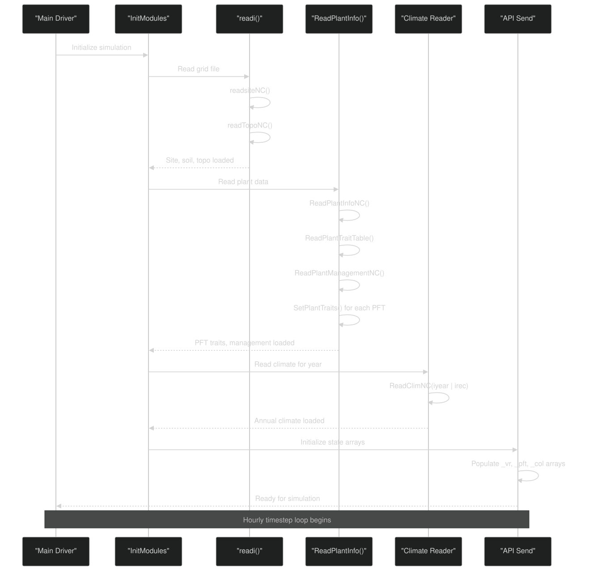

# Input System

Relevant source files

- [drivers/tools/ClimReader.F90](https://github.com/jingtao-lbl/EcoSIM/blob/7b8a4cf6/drivers/tools/ClimReader.F90)
- [drivers/tools/ClimTransformer.F90](https://github.com/jingtao-lbl/EcoSIM/blob/7b8a4cf6/drivers/tools/ClimTransformer.F90)
- [examples/run_dir/dryland/dryland.namelist](https://github.com/jingtao-lbl/EcoSIM/blob/7b8a4cf6/examples/run_dir/dryland/dryland.namelist)
- [examples/run_dir/lake/lake.namelist](https://github.com/jingtao-lbl/EcoSIM/blob/7b8a4cf6/examples/run_dir/lake/lake.namelist)
- [examples/run_dir/sample/sample.namelist](https://github.com/jingtao-lbl/EcoSIM/blob/7b8a4cf6/examples/run_dir/sample/sample.namelist)
- [f90src/Ecosim_datatype/RootDataType.F90](https://github.com/jingtao-lbl/EcoSIM/blob/7b8a4cf6/f90src/Ecosim_datatype/RootDataType.F90)
- [f90src/IOutils/PlantInfoMod.F90](https://github.com/jingtao-lbl/EcoSIM/blob/7b8a4cf6/f90src/IOutils/PlantInfoMod.F90)
- [f90src/IOutils/readimod.F90](https://github.com/jingtao-lbl/EcoSIM/blob/7b8a4cf6/f90src/IOutils/readimod.F90)
- [f90src/Plant_bgc/GrosubsMod.F90](https://github.com/jingtao-lbl/EcoSIM/blob/7b8a4cf6/f90src/Plant_bgc/GrosubsMod.F90)
- [f90src/Plant_bgc/InitPlantMod.F90](https://github.com/jingtao-lbl/EcoSIM/blob/7b8a4cf6/f90src/Plant_bgc/InitPlantMod.F90)
- [f90src/Plant_bgc/LitterFallMod.F90](https://github.com/jingtao-lbl/EcoSIM/blob/7b8a4cf6/f90src/Plant_bgc/LitterFallMod.F90)
- [f90src/Plant_bgc/PlantBranchMod.F90](https://github.com/jingtao-lbl/EcoSIM/blob/7b8a4cf6/f90src/Plant_bgc/PlantBranchMod.F90)
- [f90src/Plant_bgc/PlantDisturbByTillageMod.F90](https://github.com/jingtao-lbl/EcoSIM/blob/7b8a4cf6/f90src/Plant_bgc/PlantDisturbByTillageMod.F90)
- [f90src/Plant_bgc/PlantDisturbsMod.F90](https://github.com/jingtao-lbl/EcoSIM/blob/7b8a4cf6/f90src/Plant_bgc/PlantDisturbsMod.F90)
- [f90src/Plant_bgc/PlantPhenolMod.F90](https://github.com/jingtao-lbl/EcoSIM/blob/7b8a4cf6/f90src/Plant_bgc/PlantPhenolMod.F90)
- [f90src/Plant_bgc/RootMod.F90](https://github.com/jingtao-lbl/EcoSIM/blob/7b8a4cf6/f90src/Plant_bgc/RootMod.F90)
- [regression-tests/tests/dryland.namelist](https://github.com/jingtao-lbl/EcoSIM/blob/7b8a4cf6/regression-tests/tests/dryland.namelist)
- [regression-tests/tests/lake.namelist](https://github.com/jingtao-lbl/EcoSIM/blob/7b8a4cf6/regression-tests/tests/lake.namelist)
- [regression-tests/tests/sample.namelist](https://github.com/jingtao-lbl/EcoSIM/blob/7b8a4cf6/regression-tests/tests/sample.namelist)

## Purpose and Scope

The Input System manages the reading and initialization of all data required to configure and drive EcoSIM simulations. This includes site characteristics, soil properties, climate forcing, plant functional types, and management schedules. The system transforms external data files (primarily NetCDF format) into internal data structures used throughout the simulation.

For information about model output and history files, see [Output System](#6.2) . For details on the internal data type hierarchy, see [Data Type Hierarchy](#6.3) .

## Overview

EcoSIM's input system reads data from multiple sources at initialization and during runtime to configure the simulation domain, biogeochemical parameters, and external forcing:

Sources:  [f90src/IOutils/PlantInfoMod.F90 1-60](https://github.com/jingtao-lbl/EcoSIM/blob/7b8a4cf6/f90src/IOutils/PlantInfoMod.F90#L1-L60)  [f90src/IOutils/readimod.F90 1-103](https://github.com/jingtao-lbl/EcoSIM/blob/7b8a4cf6/f90src/IOutils/readimod.F90#L1-L103)  [examples/run_dir/dryland/dryland.namelist 1-58](https://github.com/jingtao-lbl/EcoSIM/blob/7b8a4cf6/examples/run_dir/dryland/dryland.namelist#L1-L58)

## Input File Types and Configuration

### Namelist Configuration Files

Namelist files control simulation behavior and specify paths to all other input files. The primary namelist groups are:

| Namelist Group | Purpose | Key Variables | 
| --- | --- | --- |
| ecosim | Main configuration | case_name, prefix, file paths, model toggles | 
| ecosim_time | Time control | start_date, stop_option, delta_time | 
| regression_test | Testing configuration | cells, write_regression_output | 

Example namelist structure:

The `forc_periods` array specifies simulation phases: spinup years (start, end, cycles), transient years, and final simulation period.

Sources:  [examples/run_dir/dryland/dryland.namelist 1-58](https://github.com/jingtao-lbl/EcoSIM/blob/7b8a4cf6/examples/run_dir/dryland/dryland.namelist#L1-L58)  [examples/run_dir/sample/sample.namelist 1-57](https://github.com/jingtao-lbl/EcoSIM/blob/7b8a4cf6/examples/run_dir/sample/sample.namelist#L1-L57)  [examples/run_dir/lake/lake.namelist 1-57](https://github.com/jingtao-lbl/EcoSIM/blob/7b8a4cf6/examples/run_dir/lake/lake.namelist#L1-L57)

### Grid and Soil Data Files

The grid file ( `grid_file_in` ) contains site characteristics, soil physical and chemical properties, and topographic information organized by topographic units ( `ntopou` dimension):

The `readi` subroutine in [f90src/IOutils/readimod.F90 62-103](https://github.com/jingtao-lbl/EcoSIM/blob/7b8a4cf6/f90src/IOutils/readimod.F90#L62-L103) orchestrates grid data reading:

Key grid variables read:

- **Site data**[f90src/IOutils/readimod.F90216-241](https://github.com/jingtao-lbl/EcoSIM/blob/7b8a4cf6/f90src/IOutils/readimod.F90#L216-L241)`ALATG``ALTIG``ATCAG``IETYPG`: (latitude), (altitude), (mean annual temperature), (Köppen climate zone), water table configuration
- **Topography**[f90src/IOutils/readimod.F90370-432](https://github.com/jingtao-lbl/EcoSIM/blob/7b8a4cf6/f90src/IOutils/readimod.F90#L370-L432)`ASPX``SL0``DPTHSX``CDPTH``BKDSI`: (aspect), (slope), (initial snow depth), layer depths ( ), bulk density ( )
- **Soil physics**[f90src/IOutils/readimod.F90434-442](https://github.com/jingtao-lbl/EcoSIM/blob/7b8a4cf6/f90src/IOutils/readimod.F90#L434-L442)`FC``WP``SCNV``SCNH``CSAND``CSILT`: field capacity ( ), wilting point ( ), hydraulic conductivity ( , ), texture ( , )
- **Soil chemistry**[f90src/IOutils/readimod.F90444-495](https://github.com/jingtao-lbl/EcoSIM/blob/7b8a4cf6/f90src/IOutils/readimod.F90#L444-L495)`CORGC``CORGN``CORGP``CNH4``CNO3``CPO4`: pH, organic matter ( , , ), mineral nutrients ( , , ), exchangeable cations, Gapon coefficients

Sources:  [f90src/IOutils/readimod.F90 62-103](https://github.com/jingtao-lbl/EcoSIM/blob/7b8a4cf6/f90src/IOutils/readimod.F90#L62-L103)  [f90src/IOutils/readimod.F90 181-337](https://github.com/jingtao-lbl/EcoSIM/blob/7b8a4cf6/f90src/IOutils/readimod.F90#L181-L337)  [f90src/IOutils/readimod.F90 341-756](https://github.com/jingtao-lbl/EcoSIM/blob/7b8a4cf6/f90src/IOutils/readimod.F90#L341-L756)

### Climate Forcing Data

Climate forcing files provide hourly meteorological data required for surface energy balance and biogeochemical process calculations:

Climate data is read annually and accessed hourly during simulation. The system supports both transient and constant climate modes specified in the namelist.

Sources:  [drivers/tools/ClimTransformer.F90 1-300](https://github.com/jingtao-lbl/EcoSIM/blob/7b8a4cf6/drivers/tools/ClimTransformer.F90#L1-L300)  [drivers/tools/ClimReader.F90 1-33](https://github.com/jingtao-lbl/EcoSIM/blob/7b8a4cf6/drivers/tools/ClimReader.F90#L1-L33)

## Plant Input System

### Plant Functional Type Parameters

Plant traits are read from a database file ( `pft_file_in` ) containing parameters for numerous plant functional types. The system uses Köppen climate zones and PFT identifiers to select appropriate parameter sets:

The `ReadPlantInfo` subroutine [f90src/IOutils/PlantInfoMod.F90 39-60](https://github.com/jingtao-lbl/EcoSIM/blob/7b8a4cf6/f90src/IOutils/PlantInfoMod.F90#L39-L60) coordinates plant data reading:

Key trait reading functions:

Example trait assignment [f90src/IOutils/PlantInfoMod.F90 659-670](https://github.com/jingtao-lbl/EcoSIM/blob/7b8a4cf6/f90src/IOutils/PlantInfoMod.F90#L659-L670) :

Traits are post-processed to calculate derived quantities [f90src/IOutils/PlantInfoMod.F90 444-463](https://github.com/jingtao-lbl/EcoSIM/blob/7b8a4cf6/f90src/IOutils/PlantInfoMod.F90#L444-L463) :

Sources:  [f90src/IOutils/PlantInfoMod.F90 39-106](https://github.com/jingtao-lbl/EcoSIM/blob/7b8a4cf6/f90src/IOutils/PlantInfoMod.F90#L39-L106)  [f90src/IOutils/PlantInfoMod.F90 422-481](https://github.com/jingtao-lbl/EcoSIM/blob/7b8a4cf6/f90src/IOutils/PlantInfoMod.F90#L422-L481)  [f90src/IOutils/PlantInfoMod.F90 631-776](https://github.com/jingtao-lbl/EcoSIM/blob/7b8a4cf6/f90src/IOutils/PlantInfoMod.F90#L631-L776)

### Plant Management Data

Management files ( `pft_mgmt_in` ) specify planting dates, harvest schedules, and disturbance events for each PFT:

Management data reading  [f90src/IOutils/PlantInfoMod.F90 338-419](https://github.com/jingtao-lbl/EcoSIM/blob/7b8a4cf6/f90src/IOutils/PlantInfoMod.F90#L338-L419) :

The `ReadPlantManagementNC` function handles both constant and transient management:

- **Constant mode**`pft_dflag=0`( ): Planting read once, management applied annually
- **Transient mode**`pft_dflag=1``2`( or ): Management varies by year matching forcing data

Key management variables:

- **Planting**[f90src/IOutils/PlantInfoMod.F90108-180](https://github.com/jingtao-lbl/EcoSIM/blob/7b8a4cf6/f90src/IOutils/PlantInfoMod.F90#L108-L180)`iDayPlanting_pft``PPI_pft``PlantinDepz_pft`: , (population), (depth)
- **Harvest**[f90src/IOutils/PlantInfoMod.F90212-335](https://github.com/jingtao-lbl/EcoSIM/blob/7b8a4cf6/f90src/IOutils/PlantInfoMod.F90#L212-L335)`iHarvstType_pft``FracBiomHarvsted``THIN_pft`: (type code), (removal fractions for leaf/wood/grain), (population thinning)

Harvest types include:

- 0: No harvest
- 1: Mechanical harvest
- 2: Grazing
- 3: Fire
- 4: Herbivore browsing

Sources:  [f90src/IOutils/PlantInfoMod.F90 108-180](https://github.com/jingtao-lbl/EcoSIM/blob/7b8a4cf6/f90src/IOutils/PlantInfoMod.F90#L108-L180)  [f90src/IOutils/PlantInfoMod.F90 212-335](https://github.com/jingtao-lbl/EcoSIM/blob/7b8a4cf6/f90src/IOutils/PlantInfoMod.F90#L212-L335)  [f90src/IOutils/PlantInfoMod.F90 338-419](https://github.com/jingtao-lbl/EcoSIM/blob/7b8a4cf6/f90src/IOutils/PlantInfoMod.F90#L338-L419)

## Data Flow Architecture

### Input Processing Sequence

Sources:  [f90src/IOutils/readimod.F90 62-103](https://github.com/jingtao-lbl/EcoSIM/blob/7b8a4cf6/f90src/IOutils/readimod.F90#L62-L103)  [f90src/IOutils/PlantInfoMod.F90 39-106](https://github.com/jingtao-lbl/EcoSIM/blob/7b8a4cf6/f90src/IOutils/PlantInfoMod.F90#L39-L106)

### Internal Array Organization

EcoSIM uses a consistent naming convention for state arrays:

| Suffix | Dimension | Meaning | Example | 
| --- | --- | --- | --- |
| _vr | (L,NY,NX) | Vertical layer, per column | CNH4_vr(1:JZ,NY,NX) | 
| _col | (NY,NX) | Column-level (2D grid) | ALAT_col(NY,NX) | 
| _pft | (NZ,NY,NX) | Per plant functional type | PlantPopulation_pft(NZ,NY,NX) | 
| _pvr | (N,L,NZ,NY,NX) | Per root/myco type, layer, PFT | RootVH2O_pvr(ipltroot,L,NZ) | 
| _brch | (NB,NZ,NY,NX) | Per branch, PFT | LeafStrutElms_brch(ielmc,NB,NZ) | 

Grid variable initialization example  [f90src/IOutils/readimod.F90 282-320](https://github.com/jingtao-lbl/EcoSIM/blob/7b8a4cf6/f90src/IOutils/readimod.F90#L282-L320) :

Sources:  [f90src/IOutils/readimod.F90 282-335](https://github.com/jingtao-lbl/EcoSIM/blob/7b8a4cf6/f90src/IOutils/readimod.F90#L282-L335)

### Data Validation and Error Handling

Input validation occurs at multiple stages:

Example validation [f90src/IOutils/PlantInfoMod.F90 139-148](https://github.com/jingtao-lbl/EcoSIM/blob/7b8a4cf6/f90src/IOutils/PlantInfoMod.F90#L139-L148) :

Sources:  [f90src/IOutils/PlantInfoMod.F90 139-148](https://github.com/jingtao-lbl/EcoSIM/blob/7b8a4cf6/f90src/IOutils/PlantInfoMod.F90#L139-L148)  [f90src/IOutils/readimod.F90 263-264](https://github.com/jingtao-lbl/EcoSIM/blob/7b8a4cf6/f90src/IOutils/readimod.F90#L263-L264)

## Utility Tools

### Climate Data Transformation

The `ClimTransformer` tool converts between climate data formats [drivers/tools/ClimTransformer.F90 1-300](https://github.com/jingtao-lbl/EcoSIM/blob/7b8a4cf6/drivers/tools/ClimTransformer.F90#L1-L300) :

Reads ASCII or legacy binary climate files and writes NetCDF format compatible with EcoSIM.

### Climate Data Inspection

The `ClimReader` tool validates climate files [drivers/tools/ClimReader.F90 1-33](https://github.com/jingtao-lbl/EcoSIM/blob/7b8a4cf6/drivers/tools/ClimReader.F90#L1-L33) :

Reads and displays climate data for a specified year to verify file integrity.

Sources:  [drivers/tools/ClimTransformer.F90 1-300](https://github.com/jingtao-lbl/EcoSIM/blob/7b8a4cf6/drivers/tools/ClimTransformer.F90#L1-L300)  [drivers/tools/ClimReader.F90 1-33](https://github.com/jingtao-lbl/EcoSIM/blob/7b8a4cf6/drivers/tools/ClimReader.F90#L1-L33)

## Summary

The EcoSIM Input System provides a flexible, modular framework for configuring simulations across diverse ecosystems. Key design features include:

- **NetCDF-based data storage**for efficient I/O and self-describing metadata
- **Hierarchical organization**separating site, PFT, and management data
- **Climate zone-aware trait selection**for realistic parameterization
- **Transient and constant input modes**supporting both idealized and historical simulations
- **Consistent array naming conventions**facilitating code navigation and maintenance

The system is designed for extensibility, allowing new input variables and PFT traits to be added with minimal code changes by leveraging the modular reader architecture and standardized data structures.