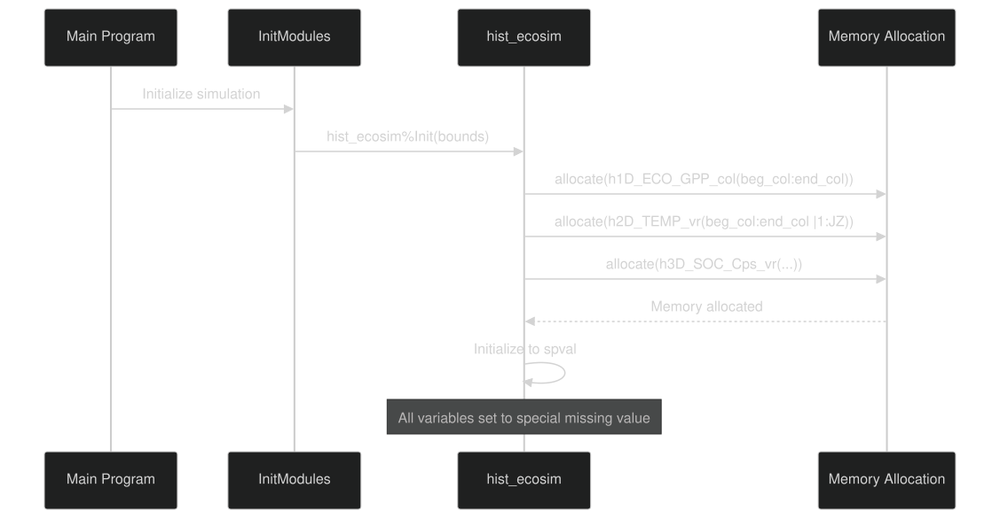
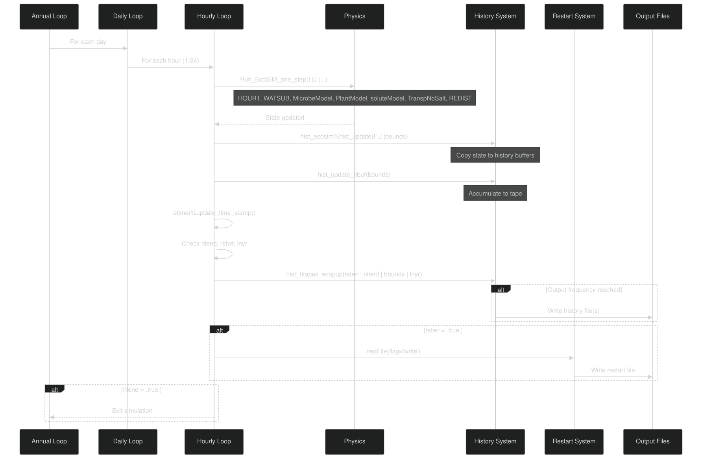

# Output System

Relevant source files

- [drivers/ecosim/EcoSIMAPI.F90](https://github.com/jingtao-lbl/EcoSIM/blob/7b8a4cf6/drivers/ecosim/EcoSIMAPI.F90)
- [drivers/ecosim/ecosim.F90](https://github.com/jingtao-lbl/EcoSIM/blob/7b8a4cf6/drivers/ecosim/ecosim.F90)
- [f90src/Balances/RedistMod.F90](https://github.com/jingtao-lbl/EcoSIM/blob/7b8a4cf6/f90src/Balances/RedistMod.F90)
- [f90src/Balances/SoilLayerDynMod.F90](https://github.com/jingtao-lbl/EcoSIM/blob/7b8a4cf6/f90src/Balances/SoilLayerDynMod.F90)
- [f90src/Ecosim_datatype/SoilBGCDataType.F90](https://github.com/jingtao-lbl/EcoSIM/blob/7b8a4cf6/f90src/Ecosim_datatype/SoilBGCDataType.F90)
- [f90src/Ecosim_mods/StartsMod.F90](https://github.com/jingtao-lbl/EcoSIM/blob/7b8a4cf6/f90src/Ecosim_mods/StartsMod.F90)
- [f90src/IOutils/HistDataType.F90](https://github.com/jingtao-lbl/EcoSIM/blob/7b8a4cf6/f90src/IOutils/HistDataType.F90)
- [f90src/IOutils/RestartMod.F90](https://github.com/jingtao-lbl/EcoSIM/blob/7b8a4cf6/f90src/IOutils/RestartMod.F90)
- [f90src/ModelDiags/BalancesMod.F90](https://github.com/jingtao-lbl/EcoSIM/blob/7b8a4cf6/f90src/ModelDiags/BalancesMod.F90)
- [f90src/Modelforc/Hour1Mod.F90](https://github.com/jingtao-lbl/EcoSIM/blob/7b8a4cf6/f90src/Modelforc/Hour1Mod.F90)
- [f90src/Plant_bgc/UptakesMod.F90](https://github.com/jingtao-lbl/EcoSIM/blob/7b8a4cf6/f90src/Plant_bgc/UptakesMod.F90)
- [f90src/Transport/Nonsalt/InitNoSaltTransportMod.F90](https://github.com/jingtao-lbl/EcoSIM/blob/7b8a4cf6/f90src/Transport/Nonsalt/InitNoSaltTransportMod.F90)
- [f90src/Transport/Nonsalt/TranspNoSaltDataMod.F90](https://github.com/jingtao-lbl/EcoSIM/blob/7b8a4cf6/f90src/Transport/Nonsalt/TranspNoSaltDataMod.F90)
- [f90src/Transport/Nonsalt/TranspNoSaltFastMod.F90](https://github.com/jingtao-lbl/EcoSIM/blob/7b8a4cf6/f90src/Transport/Nonsalt/TranspNoSaltFastMod.F90)
- [f90src/Transport/Nonsalt/TranspNoSaltMod.F90](https://github.com/jingtao-lbl/EcoSIM/blob/7b8a4cf6/f90src/Transport/Nonsalt/TranspNoSaltMod.F90)
- [f90src/Transport/Nonsalt/TranspNoSaltSlowMod.F90](https://github.com/jingtao-lbl/EcoSIM/blob/7b8a4cf6/f90src/Transport/Nonsalt/TranspNoSaltSlowMod.F90)

## Purpose and Scope

This document describes the output system in EcoSIM, which encompasses two primary mechanisms for data persistence: history files for time-series diagnostics and restart files for simulation checkpointing. History files capture user-selected variables at configurable frequencies for post-processing and analysis, while restart files preserve complete model state to enable continuation of interrupted simulations.

For information about reading input data into the model, see [Input System](#6.1) . For details on the underlying data type organization, see [Data Type Hierarchy](#6.3) .

## System Overview

EcoSIM's output system operates on two parallel tracks:

Both systems integrate tightly with the main timestepping loop and use NetCDF I/O through the PIO (Parallel I/O) library interface.

Sources:  [f90src/IOutils/HistDataType.F90 1-596](https://github.com/jingtao-lbl/EcoSIM/blob/7b8a4cf6/f90src/IOutils/HistDataType.F90#L1-L596)  [drivers/ecosim/EcoSIMAPI.F90 458-472](https://github.com/jingtao-lbl/EcoSIM/blob/7b8a4cf6/drivers/ecosim/EcoSIMAPI.F90#L458-L472)  [f90src/IOutils/RestartMod.F90 70-88](https://github.com/jingtao-lbl/EcoSIM/blob/7b8a4cf6/f90src/IOutils/RestartMod.F90#L70-L88)

## History File System

### Data Structure Organization

The history system centers on the `histdata_type` derived type, which contains pointers to hundreds of diagnostic variables organized by dimensionality and domain:

Variable Naming Conventions:

| Pattern | Description | Example | 
| --- | --- | --- |
| h1D_*_col | Column-integrated scalar | h1D_ECO_GPP_col (GPP, gC/m²/h) | 
| h1D_*_ptc | Per-PFT scalar | h1D_LAI_ptc (leaf area index) | 
| h2D_*_vr | Vertical profile by layer | h2D_TEMP_vr (soil temperature, °C) | 
| h2D_*_pvr | Per-PFT vertical profile | h2D_RootMassC_pvr (root C by layer) | 
| h3D_*_vr | 3D array (layers × pools × complex) | h3D_SOC_Cps_vr (SOC by pool) | 

Sources:  [f90src/IOutils/HistDataType.F90 46-594](https://github.com/jingtao-lbl/EcoSIM/blob/7b8a4cf6/f90src/IOutils/HistDataType.F90#L46-L594)

### Initialization and Memory Allocation

History variables are allocated during initialization based on grid dimensions:

The `init_hist_data` procedure allocates all history variable arrays and initializes them to `spval` (special value indicating no data):

Sources:  [f90src/IOutils/HistDataType.F90 599-840](https://github.com/jingtao-lbl/EcoSIM/blob/7b8a4cf6/f90src/IOutils/HistDataType.F90#L599-L840)

### History Update Workflow

Variables are accumulated every timestep through the `hist_update` method, which is called after each hourly physics calculation:

Key Update Functions:

- **`hist_update(I,J,bounds)`**: Main update routine called every timestep. Copies current model state into history variable pointers.
- **`hist_update_hbuf(bounds)`**: Accumulates history variables into tape buffers, applying time-averaging if configured.
- **`hist_htapes_wrapup(rstwr, nlend, bounds, lnyr)`**: Writes buffered data to NetCDF files when output frequency is reached.

Sources:  [f90src/IOutils/HistDataType.F90 592-594](https://github.com/jingtao-lbl/EcoSIM/blob/7b8a4cf6/f90src/IOutils/HistDataType.F90#L592-L594)  [drivers/ecosim/EcoSIMAPI.F90 458-468](https://github.com/jingtao-lbl/EcoSIM/blob/7b8a4cf6/drivers/ecosim/EcoSIMAPI.F90#L458-L468)

### Variable Categories and Examples

The history system tracks variables across all major model components:

Carbon Cycle:

- `h1D_ECO_GPP_col`: Gross primary production (gC/m²/h)
- `h1D_Eco_NPP_CumYr_col`: Net primary production cumulative (gC/m²/yr)
- `h1D_Eco_HR_CumYr_col`: Heterotrophic respiration cumulative (gC/m²/yr)
- `h1D_NBP_col`: Net biome production (gC/m²/h)
- `h2D_tSOC_vr`: Total soil organic carbon by layer (gC/m²)

Nitrogen Cycle:

- `h1D_NET_N_MIN_col`: Net N mineralization (gN/m²/h)
- `h2D_NH4_vr`: Ammonium concentration by layer (gN/m³)
- `h2D_NO3_vr`: Nitrate concentration by layer (gN/m³)
- `h1D_N2O_SEMIS_FLX_col`: N₂O surface emission (gN/m²/h)

Hydrology:

- `h1D_ECO_ET_col`: Evapotranspiration (m³/m²/h)
- `h1D_RUNOFF_FLX_col`: Surface runoff (m³/m²/h)
- `h1D_Qdrain_col`: Drainage flux (m³/m²/h)
- `h2D_ThetaH2OZ_vr`: Volumetric water content by layer (m³/m³)

Plant States:

- `h1D_LAI_ptc`: Leaf area index by PFT (m²/m²)
- `h1D_Plant_C_ptc`: Total plant carbon by PFT (gC/m²)
- `h2D_RootMassC_pvr`: Root carbon by layer and PFT (gC/m²)

Sources:  [f90src/IOutils/HistDataType.F90 47-590](https://github.com/jingtao-lbl/EcoSIM/blob/7b8a4cf6/f90src/IOutils/HistDataType.F90#L47-L590)

### History File Configuration

Output is configured through the namelist system:

| Namelist Variable | Purpose | Example | 
| --- | --- | --- |
| hist_nhtfrq | Output frequency | -24 (daily), 1 (hourly) | 
| hist_mfilt | Files per tape | 30 (30 days per file) | 
| hist_fincl1 | Variables for tape 1 | 'GPP','LAI','TEMP' | 
| hist_fincl2 | Variables for tape 2 | Additional diagnostics | 
| hist_yrclose | Close file at year end | .true. or .false. | 

File Naming Convention:

- `{casename}`: User-specified case identifier
- `{tape}`: Tape number (0, 1, 2, ...)
- `{YYYY-MM-DD-SSSSS}`: Date and seconds since reference

Sources:  [drivers/ecosim/EcoSIMAPI.F90 166-167](https://github.com/jingtao-lbl/EcoSIM/blob/7b8a4cf6/drivers/ecosim/EcoSIMAPI.F90#L166-L167)

## Restart System

### Purpose and Checkpoint Strategy

Restart files preserve complete model state at specific intervals, enabling:

### Restart File Writing

The restart system determines write timing through the `etimer` object:

Sources:  [drivers/ecosim/EcoSIMAPI.F90 462-472](https://github.com/jingtao-lbl/EcoSIM/blob/7b8a4cf6/drivers/ecosim/EcoSIMAPI.F90#L462-L472)  [f90src/IOutils/RestartMod.F90 70-88](https://github.com/jingtao-lbl/EcoSIM/blob/7b8a4cf6/f90src/IOutils/RestartMod.F90#L70-L88)

### State Variables Written to Restart

Restart files contain complete model state across all subsystems:

Soil Physical State:

- `VLWatMicP_vr`: Micropore water volume (m³/m²)
- `VLiceMicP_vr`: Micropore ice volume (m³/m²)
- `TKS_vr`: Soil temperature (K)
- `SoilBulkDensity_vr`: Bulk density (Mg/m³)

Soil Biogeochemical State:

- `SoilOrgM_vr`: Soil organic matter by element (g/m²)
- `OMBioResdu_vr`: Microbial biomass by pool (g/m²)
- `SolidOM_vr`: Solid OM by pool and element (g/m²)
- `trcg_gasml_vr`: Gas mass in soil air (g/m²)
- `trcs_solml_vr`: Solute mass in soil water (g/m²)

Plant State:

- `CanopyLeafC_brch`: Leaf carbon by branch (gC/m²)
- `CanopyStalkC_brch`: Stem carbon by branch (gC/m²)
- `RootMycoC_rpvr`: Root carbon by layer (gC/m²)
- `PopuActvStemNode_brch`: Active stem nodes
- `iPlantCalendar_brch`: Phenology stage flags

Snow State:

- `VLDrySnoWE_snvr`: Dry snow water equivalent (m³/m²)
- `VLWatSnow_snvr`: Liquid water in snow (m³/m²)
- `TKSnow_snvr`: Snow temperature (K)

Checkpoint Metadata:

- Current simulation date and time
- Model configuration flags
- Grid dimensions

Sources:  [f90src/IOutils/RestartMod.F90 90-900](https://github.com/jingtao-lbl/EcoSIM/blob/7b8a4cf6/f90src/IOutils/RestartMod.F90#L90-L900)

### Restart File Reading

Reading restart files occurs during initialization for continue/branch runs:

Key Functions:

- **`restFile_getfile(fnamer, path)`**`finidat`: Resolves restart filename from namelist variable or constructs from run type.
- **`restFile_read(bounds, fnamer)`**: Opens NetCDF file and reads all variables into appropriate data structures.
- **`get_restart_date(yr, mon, day, tod)`**: Extracts simulation date from restart file to resume at correct time.

Sources:  [f90src/IOutils/RestartMod.F90 70-88](https://github.com/jingtao-lbl/EcoSIM/blob/7b8a4cf6/f90src/IOutils/RestartMod.F90#L70-L88)  [drivers/ecosim/ecosim.F90 79-87](https://github.com/jingtao-lbl/EcoSIM/blob/7b8a4cf6/drivers/ecosim/ecosim.F90#L79-L87)

### Restart Configuration

Restart behavior is controlled through namelist parameters:

| Parameter | Purpose | Values | 
| --- | --- | --- |
| continue_run | Continue from previous run | .true. / .false. | 
| finidat | Restart file path | Full path or '' for cold start | 
| restartFileFullPath | Alternative restart path | For branch runs | 
| brnch_retain_casename | Keep original case name | .true. / .false. | 
| restart_out | Write restart at end | .true. / .false. | 

Sources:  [drivers/ecosim/EcoSIMAPI.F90 191-206](https://github.com/jingtao-lbl/EcoSIM/blob/7b8a4cf6/drivers/ecosim/EcoSIMAPI.F90#L191-L206)

## Output Timing and Control Flow

The complete output system integrates with the main simulation loop:

Timing Logic:

Sources:  [drivers/ecosim/EcoSIMAPI.F90 428-486](https://github.com/jingtao-lbl/EcoSIM/blob/7b8a4cf6/drivers/ecosim/EcoSIMAPI.F90#L428-L486)

## File Formats and Structure

Both history and restart files use NetCDF format with CF conventions:

### History File Structure

### Restart File Structure

Sources:  [f90src/IOutils/HistFileMod.F90](https://github.com/jingtao-lbl/EcoSIM/blob/7b8a4cf6/f90src/IOutils/HistFileMod.F90)  [f90src/IOutils/RestartMod.F90 90-500](https://github.com/jingtao-lbl/EcoSIM/blob/7b8a4cf6/f90src/IOutils/RestartMod.F90#L90-L500)

## Mass Balance Checking and Diagnostics

The output system includes integrated mass balance verification through the `BalancesMod` module:

Balance Check Variables:

- `WaterErr_col`: Water mass error (m³/m²)
- `HeatErr_col`: Energy balance error (MJ/m²)
- `trcg_mass_cumerr_col`: Gas tracer cumulative error (g/m²)

These diagnostics can be written to history files by including them in `hist_fincl` namelist variables.

Sources:  [f90src/ModelDiags/BalancesMod.F90 37-79](https://github.com/jingtao-lbl/EcoSIM/blob/7b8a4cf6/f90src/ModelDiags/BalancesMod.F90#L37-L79)  [f90src/ModelDiags/BalancesMod.F90 174-254](https://github.com/jingtao-lbl/EcoSIM/blob/7b8a4cf6/f90src/ModelDiags/BalancesMod.F90#L174-L254)

## Key Modules and Functions Reference

| Module | Key Functions | Purpose | 
| --- | --- | --- |
| HistDataType | init_hist_data, hist_update | History variable management | 
| HistFileMod | hist_htapes_build, hist_htapes_wrapup | NetCDF file I/O for history | 
| RestartMod | restFile, restFile_write, restFile_read | Restart file I/O | 
| BalancesMod | BegCheckBalances, EndCheckBalances | Mass conservation checks | 
| EcoSIMAPI | AdvanceModelOneYear | Main loop with output calls | 
| ncdio_pio | NetCDF interface | Low-level NetCDF operations | 

Sources:  [f90src/IOutils/HistDataType.F90 1-100](https://github.com/jingtao-lbl/EcoSIM/blob/7b8a4cf6/f90src/IOutils/HistDataType.F90#L1-L100)  [f90src/IOutils/RestartMod.F90 1-100](https://github.com/jingtao-lbl/EcoSIM/blob/7b8a4cf6/f90src/IOutils/RestartMod.F90#L1-L100)  [drivers/ecosim/EcoSIMAPI.F90 321-488](https://github.com/jingtao-lbl/EcoSIM/blob/7b8a4cf6/drivers/ecosim/EcoSIMAPI.F90#L321-L488)