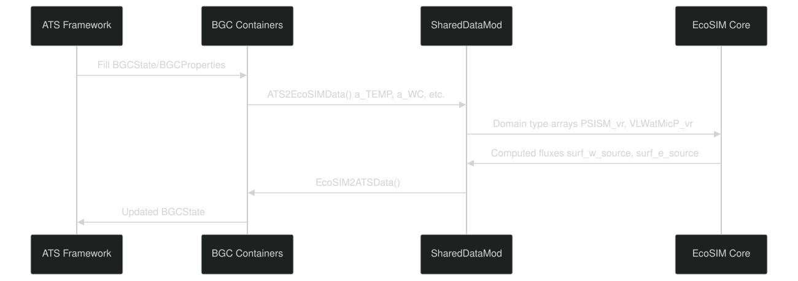
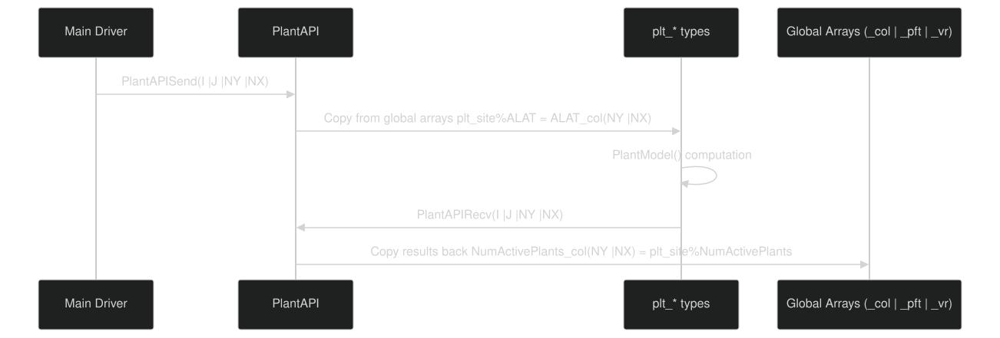

# Data Type Hierarchy

Relevant source files

- [drivers/ATSEcoSIM/ATSEcoSIM_test.F90](https://github.com/jingtao-lbl/EcoSIM/blob/7b8a4cf6/drivers/ATSEcoSIM/ATSEcoSIM_test.F90)
- [drivers/ATSEcoSIM/CMakeLists.txt](https://github.com/jingtao-lbl/EcoSIM/blob/7b8a4cf6/drivers/ATSEcoSIM/CMakeLists.txt)
- [f90src/APIData/PlantAPIData.F90](https://github.com/jingtao-lbl/EcoSIM/blob/7b8a4cf6/f90src/APIData/PlantAPIData.F90)
- [f90src/APIs/PlantAPI.F90](https://github.com/jingtao-lbl/EcoSIM/blob/7b8a4cf6/f90src/APIs/PlantAPI.F90)
- [f90src/ATSUtils/ATSCPLMod.F90](https://github.com/jingtao-lbl/EcoSIM/blob/7b8a4cf6/f90src/ATSUtils/ATSCPLMod.F90)
- [f90src/ATSUtils/ATSEcoSIMAdvanceMod.F90](https://github.com/jingtao-lbl/EcoSIM/blob/7b8a4cf6/f90src/ATSUtils/ATSEcoSIMAdvanceMod.F90)
- [f90src/ATSUtils/ATSEcoSIMInitMod.F90](https://github.com/jingtao-lbl/EcoSIM/blob/7b8a4cf6/f90src/ATSUtils/ATSEcoSIMInitMod.F90)
- [f90src/ATSUtils/BGC_containers.F90](https://github.com/jingtao-lbl/EcoSIM/blob/7b8a4cf6/f90src/ATSUtils/BGC_containers.F90)
- [f90src/ATSUtils/CMakeLists.txt](https://github.com/jingtao-lbl/EcoSIM/blob/7b8a4cf6/f90src/ATSUtils/CMakeLists.txt)
- [f90src/ATSUtils/SharedDataMod.F90](https://github.com/jingtao-lbl/EcoSIM/blob/7b8a4cf6/f90src/ATSUtils/SharedDataMod.F90)
- [f90src/ATSUtils/c_f_interface_module.F90](https://github.com/jingtao-lbl/EcoSIM/blob/7b8a4cf6/f90src/ATSUtils/c_f_interface_module.F90)
- [f90src/Balances/RedistMod.F90](https://github.com/jingtao-lbl/EcoSIM/blob/7b8a4cf6/f90src/Balances/RedistMod.F90)
- [f90src/Balances/SoilLayerDynMod.F90](https://github.com/jingtao-lbl/EcoSIM/blob/7b8a4cf6/f90src/Balances/SoilLayerDynMod.F90)
- [f90src/Ecosim_datatype/SoilBGCDataType.F90](https://github.com/jingtao-lbl/EcoSIM/blob/7b8a4cf6/f90src/Ecosim_datatype/SoilBGCDataType.F90)
- [f90src/Ecosim_mods/StartsMod.F90](https://github.com/jingtao-lbl/EcoSIM/blob/7b8a4cf6/f90src/Ecosim_mods/StartsMod.F90)
- [f90src/IOutils/HistDataType.F90](https://github.com/jingtao-lbl/EcoSIM/blob/7b8a4cf6/f90src/IOutils/HistDataType.F90)
- [f90src/IOutils/RestartMod.F90](https://github.com/jingtao-lbl/EcoSIM/blob/7b8a4cf6/f90src/IOutils/RestartMod.F90)
- [f90src/ModelDiags/BalancesMod.F90](https://github.com/jingtao-lbl/EcoSIM/blob/7b8a4cf6/f90src/ModelDiags/BalancesMod.F90)
- [f90src/Modelforc/Hour1Mod.F90](https://github.com/jingtao-lbl/EcoSIM/blob/7b8a4cf6/f90src/Modelforc/Hour1Mod.F90)
- [f90src/Plant_bgc/UptakesMod.F90](https://github.com/jingtao-lbl/EcoSIM/blob/7b8a4cf6/f90src/Plant_bgc/UptakesMod.F90)
- [f90src/Transport/Nonsalt/InitNoSaltTransportMod.F90](https://github.com/jingtao-lbl/EcoSIM/blob/7b8a4cf6/f90src/Transport/Nonsalt/InitNoSaltTransportMod.F90)
- [f90src/Transport/Nonsalt/TranspNoSaltDataMod.F90](https://github.com/jingtao-lbl/EcoSIM/blob/7b8a4cf6/f90src/Transport/Nonsalt/TranspNoSaltDataMod.F90)
- [f90src/Transport/Nonsalt/TranspNoSaltFastMod.F90](https://github.com/jingtao-lbl/EcoSIM/blob/7b8a4cf6/f90src/Transport/Nonsalt/TranspNoSaltFastMod.F90)
- [f90src/Transport/Nonsalt/TranspNoSaltMod.F90](https://github.com/jingtao-lbl/EcoSIM/blob/7b8a4cf6/f90src/Transport/Nonsalt/TranspNoSaltMod.F90)
- [f90src/Transport/Nonsalt/TranspNoSaltSlowMod.F90](https://github.com/jingtao-lbl/EcoSIM/blob/7b8a4cf6/f90src/Transport/Nonsalt/TranspNoSaltSlowMod.F90)

## Purpose and Scope

This document describes the hierarchical organization of data structures in EcoSIM, including C-compatible containers for ATS coupling, API-level data structures, and internal domain-specific data types. This page focuses on the type definitions and their relationships , not the I/O operations (see [Input System](#6.1) and [Output System](#6.2) for file reading/writing).

The data type system in EcoSIM is organized into three main layers:

## Overview of Data Type Organization

Diagram: Three-tier data type hierarchy showing data flow from external interfaces through API layers to internal domain types

Sources: [f90src/ATSUtils/BGC_containers.F90 1-209](https://github.com/jingtao-lbl/EcoSIM/blob/7b8a4cf6/f90src/ATSUtils/BGC_containers.F90#L1-L209)  [f90src/APIData/PlantAPIData.F90 1-700](https://github.com/jingtao-lbl/EcoSIM/blob/7b8a4cf6/f90src/APIData/PlantAPIData.F90#L1-L700)  [f90src/ATSUtils/SharedDataMod.F90 1-204](https://github.com/jingtao-lbl/EcoSIM/blob/7b8a4cf6/f90src/ATSUtils/SharedDataMod.F90#L1-L204)  [f90src/Ecosim_datatype/SoilBGCDataType.F90 1-50](https://github.com/jingtao-lbl/EcoSIM/blob/7b8a4cf6/f90src/Ecosim_datatype/SoilBGCDataType.F90#L1-L50)

## BGC Container Types (C-Compatible)

For integration with the Advanced Terrestrial Simulator (ATS), EcoSIM defines C-compatible container types using Fortran's `bind(c)` attribute. These types enable data exchange across the C/Fortran language boundary.

### Core Container Structures

| Type | Purpose | Key Members | 
| --- | --- | --- |
| BGCVectorDouble | 1D double array | size, capacity, data (c_ptr) | 
| BGCMatrixDouble | 2D double array | rows, cols, data (c_ptr) | 
| BGCTensorDouble | 3D double array | rows, cols, procs, data (c_ptr) | 
| BGCSizes | Grid dimensions | ncells_per_col_, num_components, num_columns | 
| BGCState | State variables | temperature, water_content, porosity, etc. | 
| BGCProperties | Properties | liquid_saturation, shortwave_radiation, etc. | 

Sources: [f90src/ATSUtils/BGC_containers.F90 77-201](https://github.com/jingtao-lbl/EcoSIM/blob/7b8a4cf6/f90src/ATSUtils/BGC_containers.F90#L77-L201)

### BGCState Structure

The `BGCState` type contains all state variables passed from ATS to EcoSIM:

Diagram: BGCState structure showing different field dimensionalities

Sources: [f90src/ATSUtils/BGC_containers.F90 145-162](https://github.com/jingtao-lbl/EcoSIM/blob/7b8a4cf6/f90src/ATSUtils/BGC_containers.F90#L145-L162)

### Data Transfer Functions

Two key subroutines handle data transfer between ATS and EcoSIM:

Diagram: Data flow sequence between ATS and EcoSIM through container types

Sources: [f90src/ATSUtils/ATSCPLMod.F90 29-245](https://github.com/jingtao-lbl/EcoSIM/blob/7b8a4cf6/f90src/ATSUtils/ATSCPLMod.F90#L29-L245)

### Pointer Conversion Pattern

The BGC containers use C pointers that must be converted to Fortran arrays using `c_f_pointer` :

Sources: [f90src/ATSUtils/ATSCPLMod.F90 61-63](https://github.com/jingtao-lbl/EcoSIM/blob/7b8a4cf6/f90src/ATSUtils/ATSCPLMod.F90#L61-L63)

## SharedDataMod Arrays

The `SharedDataMod` module provides temporary storage arrays with the `a_` prefix convention for ATS-coupled simulations:

| Array Name | Fortran Type | Purpose | 
| --- | --- | --- |
| a_TEMP | real(r8), allocatable(:,:) | Temperature [K] | 
| a_WC | real(r8), allocatable(:,:) | Water content [m³/m³] | 
| a_PORO | real(r8), allocatable(:,:) | Porosity [-] | 
| a_MATP | real(r8), allocatable(:,:) | Matric pressure [Pa] | 
| a_BKDSI | real(r8), allocatable(:,:) | Bulk density [kg/m³] | 
| a_CumDepz2LayBottom_vr | real(r8), allocatable(:,:) | Depth to layer bottom [m] | 
| a_CORGC/N/P | real(r8), allocatable(:,:) | Organic C/N/P content | 
| tairc | real(r8), allocatable(:) | Air temperature [°C] | 
| uwind | real(r8), allocatable(:) | Wind speed [m/s] | 
| p_rain, p_snow | real(r8), allocatable(:) | Precipitation [m/s] | 
| surf_w_source | real(r8), allocatable(:) | Surface water flux [m/s] | 
| surf_e_source | real(r8), allocatable(:) | Surface energy flux [W/m²] | 

Sources: [f90src/ATSUtils/SharedDataMod.F90 15-71](https://github.com/jingtao-lbl/EcoSIM/blob/7b8a4cf6/f90src/ATSUtils/SharedDataMod.F90#L15-L71)  [f90src/ATSUtils/ATSCPLMod.F90 61-209](https://github.com/jingtao-lbl/EcoSIM/blob/7b8a4cf6/f90src/ATSUtils/ATSCPLMod.F90#L61-L209)

## API Data Types

API data types organize state variables and parameters for individual process models. These types serve as interfaces between the main driver and specialized model components.

### Plant API Data Hierarchy

The plant model uses an extensive hierarchy of derived types defined in `PlantAPIData.F90` :

Diagram: Plant API data type hierarchy showing specialized sub-types

Sources: [f90src/APIData/PlantAPIData.F90 31-700](https://github.com/jingtao-lbl/EcoSIM/blob/7b8a4cf6/f90src/APIData/PlantAPIData.F90#L31-L700)

### Multi-Dimensional Array Patterns in Plant Data

Plant data types use consistent suffix conventions to indicate array dimensionality:

| Suffix | Dimensions | Example | Meaning | 
| --- | --- | --- | --- |
| _col | (NY, NX) | CanopyLeafArea_col | Column-level (grid cell) | 
| _pft | (NZ, NY, NX) | CanopyHeight_pft | Per plant functional type | 
| _brch | (NB, NZ, NY, NX) | LeafAreaLive_brch | Per branch | 
| _node | (K, NB, NZ, NY, NX) | LeafArea_node | Per node on branch | 
| _vr | (L, NY, NX) | totRootLenDens_vr | Vertical layer | 
| _pvr | (L, NZ, NY, NX) | RootN2Fix_pvr | Per PFT per layer | 
| _rpvr | (N, L, NZ, NY, NX) | RootMycoMassElm_pvr | Per root type per PFT per layer | 
| _clyr | (CL, NY, NX) | tCanLeafC_clyr | Canopy layer | 

Where:

- NY, NX = grid coordinates
- NZ = plant functional type index
- NB = branch index
- K = node index
- L = soil layer index
- N = root/mycorrhizae type
- CL = canopy layer

Sources: [f90src/APIData/PlantAPIData.F90 210-600](https://github.com/jingtao-lbl/EcoSIM/blob/7b8a4cf6/f90src/APIData/PlantAPIData.F90#L210-L600)  [f90src/APIs/PlantAPI.F90 48-600](https://github.com/jingtao-lbl/EcoSIM/blob/7b8a4cf6/f90src/APIs/PlantAPI.F90#L48-L600)

### API Send/Receive Pattern

Process APIs use a send/receive pattern to transfer data:

Diagram: API data exchange pattern for process model isolation

Sources: [f90src/APIs/PlantAPI.F90 48-700](https://github.com/jingtao-lbl/EcoSIM/blob/7b8a4cf6/f90src/APIs/PlantAPI.F90#L48-L700)

## Internal Domain Data Types

Internal data types are organized by physical/biogeochemical domain. Each domain has its own module defining related variables.

### Soil Biogeochemistry Data Types

The `SoilBGCDataType` module defines arrays for soil chemical and biological state variables:

Diagram: Soil BGC data type organization showing major variable categories

Sources: [f90src/Ecosim_datatype/SoilBGCDataType.F90 1-100](https://github.com/jingtao-lbl/EcoSIM/blob/7b8a4cf6/f90src/Ecosim_datatype/SoilBGCDataType.F90#L1-L100)

### Tracer Data Organization

Chemical tracers use specialized indexing defined in `TracerIDMod` :

| Tracer Category | Index Range | Examples | 
| --- | --- | --- |
| Gases (idg_*) | idg_beg:idg_end | idg_CO2, idg_CH4, idg_O2, idg_NH3 | 
| Solutes (ids_*) | ids_beg:ids_end | ids_NH4, ids_NO3, ids_H2PO4 | 
| DOM (idom_*) | idom_beg:idom_end | idom_doc, idom_don, idom_dop | 
| Elements (ielm*) | - | ielmc (C), ielmn (N), ielmp (P) | 

Tracer arrays follow these patterns:

- `trcg_gasml_vr(idg, L, NY, NX)`- Gaseous tracer mass in soil gas phase
- `trcs_solml_vr(ids, L, NY, NX)`- Solute mass in micropore solution
- `trcs_soHml_vr(ids, L, NY, NX)`- Solute mass in macropore solution
- `trcg_root_vr(idg, L, NY, NX)`- Tracer mass in plant roots

Sources: [f90src/Ecosim_datatype/SoilBGCDataType.F90 14-40](https://github.com/jingtao-lbl/EcoSIM/blob/7b8a4cf6/f90src/Ecosim_datatype/SoilBGCDataType.F90#L14-L40)  [f90src/Transport/Nonsalt/TranspNoSaltMod.F90 1-100](https://github.com/jingtao-lbl/EcoSIM/blob/7b8a4cf6/f90src/Transport/Nonsalt/TranspNoSaltMod.F90#L1-L100)

### Vertical Layer Index Convention

The vertical layer indexing follows this convention:

Key grid variables:

- `NU_col(NY,NX)`- Index of current soil surface layer
- `NL_col(NY,NX)`- Index of lowest active soil layer
- `NK_col(NY,NX)`- Index of hydrologically active bottom layer

Sources: [f90src/Ecosim_datatype/GridDataType.F90](https://github.com/jingtao-lbl/EcoSIM/blob/7b8a4cf6/f90src/Ecosim_datatype/GridDataType.F90)  [f90src/Balances/RedistMod.F90 104-140](https://github.com/jingtao-lbl/EcoSIM/blob/7b8a4cf6/f90src/Balances/RedistMod.F90#L104-L140)

## Domain-Specific Data Type Modules

### Complete List of Domain Types

Diagram: Complete organization of domain-specific data type modules

Sources: [f90src/Ecosim_datatype/](https://github.com/jingtao-lbl/EcoSIM/blob/7b8a4cf6/f90src/Ecosim_datatype/) (various files), [f90src/Balances/RedistMod.F90 1-50](https://github.com/jingtao-lbl/EcoSIM/blob/7b8a4cf6/f90src/Balances/RedistMod.F90#L1-L50)  [f90src/Transport/Nonsalt/TranspNoSaltMod.F90 15-40](https://github.com/jingtao-lbl/EcoSIM/blob/7b8a4cf6/f90src/Transport/Nonsalt/TranspNoSaltMod.F90#L15-L40)

### Key Data Type Usage Patterns

Most EcoSIM subroutines follow this pattern:

Example from `TranspNoSaltMod` :

Sources: [f90src/Transport/Nonsalt/TranspNoSaltMod.F90 1-40](https://github.com/jingtao-lbl/EcoSIM/blob/7b8a4cf6/f90src/Transport/Nonsalt/TranspNoSaltMod.F90#L1-L40)

## History/Output Data Types

The `HistDataType` module defines pointers to output variables with the `h1D_` , `h2D_` , `h3D_` prefix convention:

| Prefix | Dimensions | Example | Purpose | 
| --- | --- | --- | --- |
| h1D_ | Column-level scalar | h1D_NBP_col | Net biome productivity | 
| h2D_ | Column + vertical | h2D_tSOC_vr | Total SOC by layer | 
| h3D_ | Column + vertical + complex | h3D_SOC_Cps_vr | SOC by component and layer | 

These pointers reference either instantaneous values or accumulated fluxes, and are written to NetCDF output files via the history file system.

Sources: [f90src/IOutils/HistDataType.F90 46-400](https://github.com/jingtao-lbl/EcoSIM/blob/7b8a4cf6/f90src/IOutils/HistDataType.F90#L46-L400)

## Data Flow Through the Hierarchy

Diagram: Complete data flow from input through processing to output

Sources: [f90src/APIs/PlantAPI.F90 48-700](https://github.com/jingtao-lbl/EcoSIM/blob/7b8a4cf6/f90src/APIs/PlantAPI.F90#L48-L700)  [f90src/Balances/RedistMod.F90 74-156](https://github.com/jingtao-lbl/EcoSIM/blob/7b8a4cf6/f90src/Balances/RedistMod.F90#L74-L156)  [f90src/IOutils/HistDataType.F90 1-100](https://github.com/jingtao-lbl/EcoSIM/blob/7b8a4cf6/f90src/IOutils/HistDataType.F90#L1-L100)  [f90src/ATSUtils/ATSCPLMod.F90 213-245](https://github.com/jingtao-lbl/EcoSIM/blob/7b8a4cf6/f90src/ATSUtils/ATSCPLMod.F90#L213-L245)