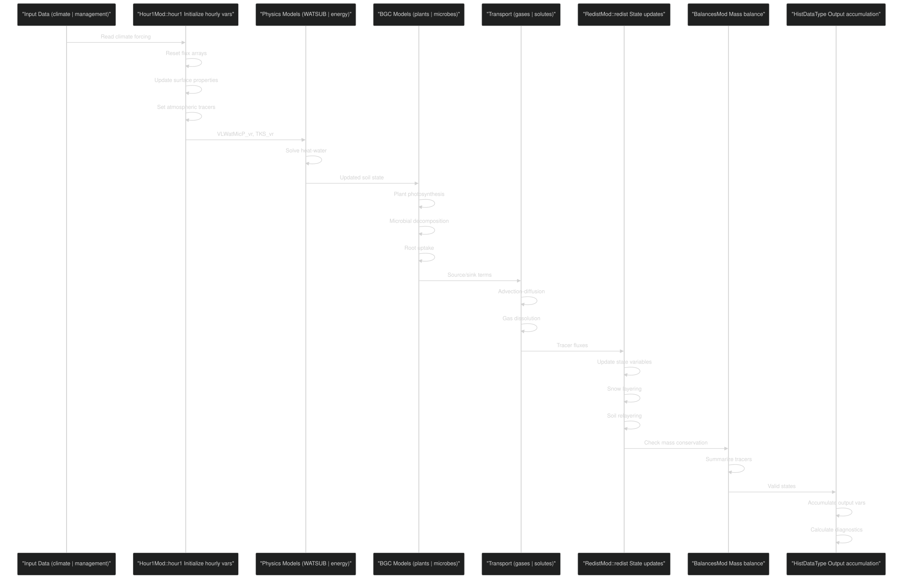
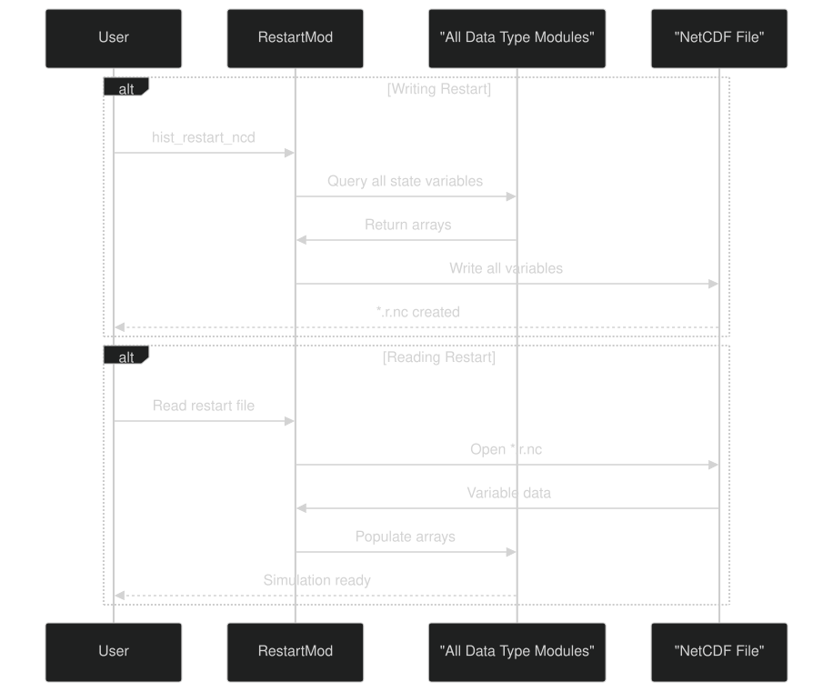

# Data Management

Relevant source files

- [f90src/Balances/RedistMod.F90](https://github.com/jingtao-lbl/EcoSIM/blob/7b8a4cf6/f90src/Balances/RedistMod.F90)
- [f90src/Balances/SoilLayerDynMod.F90](https://github.com/jingtao-lbl/EcoSIM/blob/7b8a4cf6/f90src/Balances/SoilLayerDynMod.F90)
- [f90src/Ecosim_datatype/RootDataType.F90](https://github.com/jingtao-lbl/EcoSIM/blob/7b8a4cf6/f90src/Ecosim_datatype/RootDataType.F90)
- [f90src/Ecosim_datatype/SoilBGCDataType.F90](https://github.com/jingtao-lbl/EcoSIM/blob/7b8a4cf6/f90src/Ecosim_datatype/SoilBGCDataType.F90)
- [f90src/Ecosim_mods/StartsMod.F90](https://github.com/jingtao-lbl/EcoSIM/blob/7b8a4cf6/f90src/Ecosim_mods/StartsMod.F90)
- [f90src/IOutils/HistDataType.F90](https://github.com/jingtao-lbl/EcoSIM/blob/7b8a4cf6/f90src/IOutils/HistDataType.F90)
- [f90src/IOutils/PlantInfoMod.F90](https://github.com/jingtao-lbl/EcoSIM/blob/7b8a4cf6/f90src/IOutils/PlantInfoMod.F90)
- [f90src/IOutils/RestartMod.F90](https://github.com/jingtao-lbl/EcoSIM/blob/7b8a4cf6/f90src/IOutils/RestartMod.F90)
- [f90src/IOutils/readimod.F90](https://github.com/jingtao-lbl/EcoSIM/blob/7b8a4cf6/f90src/IOutils/readimod.F90)
- [f90src/ModelDiags/BalancesMod.F90](https://github.com/jingtao-lbl/EcoSIM/blob/7b8a4cf6/f90src/ModelDiags/BalancesMod.F90)
- [f90src/Modelforc/Hour1Mod.F90](https://github.com/jingtao-lbl/EcoSIM/blob/7b8a4cf6/f90src/Modelforc/Hour1Mod.F90)
- [f90src/Plant_bgc/GrosubsMod.F90](https://github.com/jingtao-lbl/EcoSIM/blob/7b8a4cf6/f90src/Plant_bgc/GrosubsMod.F90)
- [f90src/Plant_bgc/InitPlantMod.F90](https://github.com/jingtao-lbl/EcoSIM/blob/7b8a4cf6/f90src/Plant_bgc/InitPlantMod.F90)
- [f90src/Plant_bgc/LitterFallMod.F90](https://github.com/jingtao-lbl/EcoSIM/blob/7b8a4cf6/f90src/Plant_bgc/LitterFallMod.F90)
- [f90src/Plant_bgc/PlantBranchMod.F90](https://github.com/jingtao-lbl/EcoSIM/blob/7b8a4cf6/f90src/Plant_bgc/PlantBranchMod.F90)
- [f90src/Plant_bgc/PlantDisturbByTillageMod.F90](https://github.com/jingtao-lbl/EcoSIM/blob/7b8a4cf6/f90src/Plant_bgc/PlantDisturbByTillageMod.F90)
- [f90src/Plant_bgc/PlantDisturbsMod.F90](https://github.com/jingtao-lbl/EcoSIM/blob/7b8a4cf6/f90src/Plant_bgc/PlantDisturbsMod.F90)
- [f90src/Plant_bgc/PlantPhenolMod.F90](https://github.com/jingtao-lbl/EcoSIM/blob/7b8a4cf6/f90src/Plant_bgc/PlantPhenolMod.F90)
- [f90src/Plant_bgc/RootMod.F90](https://github.com/jingtao-lbl/EcoSIM/blob/7b8a4cf6/f90src/Plant_bgc/RootMod.F90)
- [f90src/Plant_bgc/UptakesMod.F90](https://github.com/jingtao-lbl/EcoSIM/blob/7b8a4cf6/f90src/Plant_bgc/UptakesMod.F90)
- [f90src/Transport/Nonsalt/InitNoSaltTransportMod.F90](https://github.com/jingtao-lbl/EcoSIM/blob/7b8a4cf6/f90src/Transport/Nonsalt/InitNoSaltTransportMod.F90)
- [f90src/Transport/Nonsalt/TranspNoSaltDataMod.F90](https://github.com/jingtao-lbl/EcoSIM/blob/7b8a4cf6/f90src/Transport/Nonsalt/TranspNoSaltDataMod.F90)
- [f90src/Transport/Nonsalt/TranspNoSaltFastMod.F90](https://github.com/jingtao-lbl/EcoSIM/blob/7b8a4cf6/f90src/Transport/Nonsalt/TranspNoSaltFastMod.F90)
- [f90src/Transport/Nonsalt/TranspNoSaltMod.F90](https://github.com/jingtao-lbl/EcoSIM/blob/7b8a4cf6/f90src/Transport/Nonsalt/TranspNoSaltMod.F90)
- [f90src/Transport/Nonsalt/TranspNoSaltSlowMod.F90](https://github.com/jingtao-lbl/EcoSIM/blob/7b8a4cf6/f90src/Transport/Nonsalt/TranspNoSaltSlowMod.F90)

## Purpose and Scope

This page provides an overview of how EcoSIM organizes, stores, and manages data throughout the simulation. It covers the data type hierarchy, array organization conventions, and the flow of data through the model during execution. For detailed information about reading input files, see [Input System](#6.1) . For information about writing output and restart files, see [Output System](#6.2) . For the complete data type structure, see [Data Type Hierarchy](#6.3) .

## Data Organization Philosophy

EcoSIM organizes data using a modular Fortran type system where each scientific domain (soil biogeochemistry, plant traits, hydrology, etc.) has dedicated data type modules. Data arrays are multi-dimensional, indexed by spatial location (columns), vertical layers, plant functional types (PFTs), and other domain-specific indices. This organization allows efficient memory layout while maintaining clear separation of concerns between different model components.

Sources:  [f90src/Ecosim_datatype/SoilBGCDataType.F90 1-50](https://github.com/jingtao-lbl/EcoSIM/blob/7b8a4cf6/f90src/Ecosim_datatype/SoilBGCDataType.F90#L1-L50)  [f90src/Ecosim_datatype/GridDataType.F90 1-50](https://github.com/jingtao-lbl/EcoSIM/blob/7b8a4cf6/f90src/Ecosim_datatype/GridDataType.F90#L1-L50)

## Multi-Dimensional Array Structure

Sources:  [f90src/IOutils/HistDataType.F90 46-590](https://github.com/jingtao-lbl/EcoSIM/blob/7b8a4cf6/f90src/IOutils/HistDataType.F90#L46-L590)  [f90src/Ecosim_datatype/SoilBGCDataType.F90 1-100](https://github.com/jingtao-lbl/EcoSIM/blob/7b8a4cf6/f90src/Ecosim_datatype/SoilBGCDataType.F90#L1-L100)

### Naming Conventions

EcoSIM follows systematic naming conventions for arrays:

| Suffix | Meaning | Example | Dimensions | 
| --- | --- | --- | --- |
| _col | Column-level | WatMass_col | (NY,NX) | 
| _vr | Vertical layer | TKS_vr | (0:JZ,NY,NX) | 
| _pft | Plant functional type | LAI_pft | (NZ,NY,NX) | 
| _pvr | PFT by layer | RootC_pvr | (L,NZ,NY,NX) | 
| _rpvr | Root axes by PFT by layer | RootRadius_rpvr | (NR,L,NZ,NY,NX) | 
| _snvr | Snow layer | VLWatSnow_snvr | (LS,NY,NX) | 
| _2D / _2DH | Horizontal fluxes | XGridSurfRunoff_2DH | (2,2,NY,NX) | 
| _3D | Directional fluxes | WaterFlowSoiMicP_3D | (3,L,NY,NX) | 

The prefix `h1D_` , `h2D_` , `h3D_` on output variables indicates history output dimensionality.

Sources:  [f90src/IOutils/HistDataType.F90 46-590](https://github.com/jingtao-lbl/EcoSIM/blob/7b8a4cf6/f90src/IOutils/HistDataType.F90#L46-L590)

### Key Grid Parameters

Sources:  [f90src/Ecosim_datatype/GridDataType.F90 1-200](https://github.com/jingtao-lbl/EcoSIM/blob/7b8a4cf6/f90src/Ecosim_datatype/GridDataType.F90#L1-L200)

## Data Type Module Hierarchy

EcoSIM organizes data types into domain-specific modules:

Sources:  [f90src/Ecosim_datatype/SoilBGCDataType.F90 1-30](https://github.com/jingtao-lbl/EcoSIM/blob/7b8a4cf6/f90src/Ecosim_datatype/SoilBGCDataType.F90#L1-L30)  [f90src/Ecosim_datatype/GridDataType.F90 1-30](https://github.com/jingtao-lbl/EcoSIM/blob/7b8a4cf6/f90src/Ecosim_datatype/GridDataType.F90#L1-L30)  [f90src/IOutils/HistDataType.F90 1-45](https://github.com/jingtao-lbl/EcoSIM/blob/7b8a4cf6/f90src/IOutils/HistDataType.F90#L1-L45)

## Data Flow During a Timestep

The following diagram shows how data flows through EcoSIM during one hourly timestep:

Sources:  [f90src/Modelforc/Hour1Mod.F90 87-250](https://github.com/jingtao-lbl/EcoSIM/blob/7b8a4cf6/f90src/Modelforc/Hour1Mod.F90#L87-L250)  [f90src/Balances/RedistMod.F90 74-156](https://github.com/jingtao-lbl/EcoSIM/blob/7b8a4cf6/f90src/Balances/RedistMod.F90#L74-L156)  [f90src/ModelDiags/BalancesMod.F90 37-79](https://github.com/jingtao-lbl/EcoSIM/blob/7b8a4cf6/f90src/ModelDiags/BalancesMod.F90#L37-L79)

### Detailed Data Management Operations

Sources:  [f90src/Modelforc/Hour1Mod.F90 254-315](https://github.com/jingtao-lbl/EcoSIM/blob/7b8a4cf6/f90src/Modelforc/Hour1Mod.F90#L254-L315)  [f90src/Balances/RedistMod.F90 74-156](https://github.com/jingtao-lbl/EcoSIM/blob/7b8a4cf6/f90src/Balances/RedistMod.F90#L74-L156)  [f90src/ModelDiags/BalancesMod.F90 37-275](https://github.com/jingtao-lbl/EcoSIM/blob/7b8a4cf6/f90src/ModelDiags/BalancesMod.F90#L37-L275)

## Input Data Management

EcoSIM reads input data from multiple sources during initialization and runtime:

| Input Type | Module | File Format | Frequency | 
| --- | --- | --- | --- |
| Grid/soil properties | readiMod | NetCDF | Once at startup | 
| Plant functional types | PlantInfoMod | NetCDF | Once at startup | 
| Plant management | PlantInfoMod | NetCDF | Annual | 
| Climate forcing | Hour1Mod | NetCDF/ASCII | Hourly | 
| Restart state | RestartMod | NetCDF | Once at startup (optional) | 

Input Data Flow:

Sources:  [f90src/IOutils/readimod.F90 1-100](https://github.com/jingtao-lbl/EcoSIM/blob/7b8a4cf6/f90src/IOutils/readimod.F90#L1-L100)  [f90src/IOutils/PlantInfoMod.F90 39-106](https://github.com/jingtao-lbl/EcoSIM/blob/7b8a4cf6/f90src/IOutils/PlantInfoMod.F90#L39-L106)  [f90src/Modelforc/Hour1Mod.F90 87-250](https://github.com/jingtao-lbl/EcoSIM/blob/7b8a4cf6/f90src/Modelforc/Hour1Mod.F90#L87-L250)  [f90src/IOutils/RestartMod.F90 1-100](https://github.com/jingtao-lbl/EcoSIM/blob/7b8a4cf6/f90src/IOutils/RestartMod.F90#L1-L100)

## Output Data Management

EcoSIM manages output through the history file system:

### History Data Type Structure

The `histdata_type` defined in `HistDataType.F90` contains hundreds of pointer arrays for output variables. Each array corresponds to a potential output field.

Sources:  [f90src/IOutils/HistDataType.F90 46-596](https://github.com/jingtao-lbl/EcoSIM/blob/7b8a4cf6/f90src/IOutils/HistDataType.F90#L46-L596)

### Example History Variables

Sources:  [f90src/IOutils/HistDataType.F90 47-590](https://github.com/jingtao-lbl/EcoSIM/blob/7b8a4cf6/f90src/IOutils/HistDataType.F90#L47-L590)

## Data Type Conventions and Best Practices

### Pointer vs Allocatable Arrays

EcoSIM primarily uses pointer arrays in derived types, which allows for flexible memory management and the ability to create multiple references to the same data.

### Array Bounds and Indexing

Layer indices typically start at 0 (surface litter) or 1 (first soil layer):

Sources:  [f90src/Ecosim_datatype/SoilBGCDataType.F90 1-100](https://github.com/jingtao-lbl/EcoSIM/blob/7b8a4cf6/f90src/Ecosim_datatype/SoilBGCDataType.F90#L1-L100)  [f90src/Ecosim_datatype/GridDataType.F90 1-200](https://github.com/jingtao-lbl/EcoSIM/blob/7b8a4cf6/f90src/Ecosim_datatype/GridDataType.F90#L1-L200)

### Special Value Handling

EcoSIM uses special values for missing/invalid data:

Sources:  [f90src/IOutils/HistDataType.F90 6-614](https://github.com/jingtao-lbl/EcoSIM/blob/7b8a4cf6/f90src/IOutils/HistDataType.F90#L6-L614)

## Mass Balance and Data Integrity

EcoSIM implements comprehensive mass balance checking to ensure data integrity:

Sources:  [f90src/ModelDiags/BalancesMod.F90 37-275](https://github.com/jingtao-lbl/EcoSIM/blob/7b8a4cf6/f90src/ModelDiags/BalancesMod.F90#L37-L275)

### Mass Balance Data Structures

Sources:  [f90src/ModelDiags/BalancesMod.F90 1-50](https://github.com/jingtao-lbl/EcoSIM/blob/7b8a4cf6/f90src/ModelDiags/BalancesMod.F90#L1-L50)

## Data Persistence and Restart Capability

EcoSIM supports simulation continuation through restart files that store complete model state:

### Restart File Contents

| Component | Variables | Purpose | 
| --- | --- | --- |
| Grid state | NU_col, NL_col, layer thicknesses | Grid configuration | 
| Soil physics | VLWatMicP_vr, TKS_vr, POROS_vr | Physical state | 
| Soil BGC | SoilOrgM_vr, organic matter pools | Biogeochemical state | 
| Plant state | LAI_pft, biomass pools | Vegetation state | 
| Tracers | All gas and solute pools | Chemical state | 
| Accumulators | Cumulative fluxes | Continuous budgets | 

Sources:  [f90src/IOutils/RestartMod.F90 1-100](https://github.com/jingtao-lbl/EcoSIM/blob/7b8a4cf6/f90src/IOutils/RestartMod.F90#L1-L100)

### Restart Workflow

Sources:  [f90src/IOutils/RestartMod.F90 1-200](https://github.com/jingtao-lbl/EcoSIM/blob/7b8a4cf6/f90src/IOutils/RestartMod.F90#L1-L200)

## Summary

EcoSIM's data management system is built on:

For implementation details on reading input data, see [Input System](#6.1) . For details on generating output and managing history files, see [Output System](#6.2) . For the complete catalog of data types and their relationships, see [Data Type Hierarchy](#6.3) .

Sources:  [f90src/IOutils/HistDataType.F90 1-596](https://github.com/jingtao-lbl/EcoSIM/blob/7b8a4cf6/f90src/IOutils/HistDataType.F90#L1-L596)  [f90src/Ecosim_datatype/SoilBGCDataType.F90 1-100](https://github.com/jingtao-lbl/EcoSIM/blob/7b8a4cf6/f90src/Ecosim_datatype/SoilBGCDataType.F90#L1-L100)  [f90src/Modelforc/Hour1Mod.F90 87-250](https://github.com/jingtao-lbl/EcoSIM/blob/7b8a4cf6/f90src/Modelforc/Hour1Mod.F90#L87-L250)  [f90src/Balances/RedistMod.F90 74-156](https://github.com/jingtao-lbl/EcoSIM/blob/7b8a4cf6/f90src/Balances/RedistMod.F90#L74-L156)  [f90src/ModelDiags/BalancesMod.F90 37-275](https://github.com/jingtao-lbl/EcoSIM/blob/7b8a4cf6/f90src/ModelDiags/BalancesMod.F90#L37-L275)