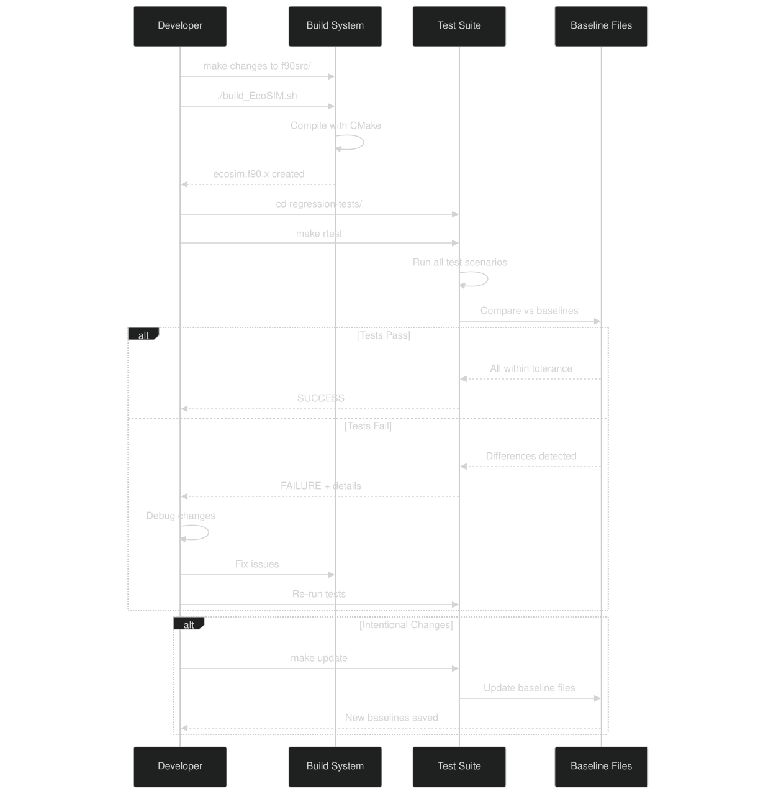

# Regression Test Suite

Relevant source files

- [regression-tests/Makefile](https://github.com/jingtao-lbl/EcoSIM/blob/7b8a4cf6/regression-tests/Makefile)
- [regression-tests/tests/blodgett.regression.baseline.gnu](https://github.com/jingtao-lbl/EcoSIM/blob/7b8a4cf6/regression-tests/tests/blodgett.regression.baseline.gnu)
- [regression-tests/tests/dryland.regression.baseline.gnu](https://github.com/jingtao-lbl/EcoSIM/blob/7b8a4cf6/regression-tests/tests/dryland.regression.baseline.gnu)
- [regression-tests/tests/lake.regression.baseline.gnu](https://github.com/jingtao-lbl/EcoSIM/blob/7b8a4cf6/regression-tests/tests/lake.regression.baseline.gnu)
- [regression-tests/tests/sample.regression.baseline.gnu](https://github.com/jingtao-lbl/EcoSIM/blob/7b8a4cf6/regression-tests/tests/sample.regression.baseline.gnu)

## Purpose and Scope

The Regression Test Suite validates that EcoSIM produces consistent, scientifically correct results across code changes, compiler versions, and platforms. This system compares simulation outputs against pre-computed baseline files to detect unintended behavioral changes. The test suite ensures model stability during development and prevents regression errors from entering the codebase.

For information about the build system infrastructure, see [Build System Details](#8.3) . For continuous integration workflows, see [Continuous Integration](#7.2) .

## Test Scenarios

The regression test suite includes four distinct scenarios that exercise different EcoSIM configurations and environmental conditions:

| Test Name | Description | Key Features | 
| --- | --- | --- |
| sample | Minimal test case for rapid validation | Small grid, short duration, basic physics | 
| dryland | Agricultural/upland terrestrial ecosystem | Active plant growth, unsaturated soil conditions | 
| lake | Aquatic/wetland ecosystem | Saturated conditions, limited oxygen availability | 
| blodgett | Forest ecosystem at Blodgett Forest site | Multi-layer canopy, complex carbon cycling | 

Each test scenario validates specific physical and biogeochemical processes under representative environmental conditions.

Sources:  [regression-tests/tests/sample.regression.baseline.gnu](https://github.com/jingtao-lbl/EcoSIM/blob/7b8a4cf6/regression-tests/tests/sample.regression.baseline.gnu)  [regression-tests/tests/dryland.regression.baseline.gnu](https://github.com/jingtao-lbl/EcoSIM/blob/7b8a4cf6/regression-tests/tests/dryland.regression.baseline.gnu)  [regression-tests/tests/lake.regression.baseline.gnu](https://github.com/jingtao-lbl/EcoSIM/blob/7b8a4cf6/regression-tests/tests/lake.regression.baseline.gnu)  [regression-tests/tests/blodgett.regression.baseline.gnu](https://github.com/jingtao-lbl/EcoSIM/blob/7b8a4cf6/regression-tests/tests/blodgett.regression.baseline.gnu)

## Baseline File Format

Baseline files ( `.regression.baseline.gnu` ) contain expected statistical summaries of key state variables and fluxes. Each variable entry includes:

### Structure Components

- **Variable header**: Name and physical units in brackets
- **Category**: Distinguishes between state variables (stocks) and flux variables (rates)
- **Statistical summary**: Minimum, maximum, and mean across all grid cells
- **Cell samples**: Values at specific cell indices for spatial variability verification

### Example Baseline Entry

From the dryland scenario:

This format allows detection of both global changes (via min/max/mean) and local changes (via specific cell values).

Sources:  [regression-tests/tests/sample.regression.baseline.gnu 1-37](https://github.com/jingtao-lbl/EcoSIM/blob/7b8a4cf6/regression-tests/tests/sample.regression.baseline.gnu#L1-L37)  [regression-tests/tests/dryland.regression.baseline.gnu 1-37](https://github.com/jingtao-lbl/EcoSIM/blob/7b8a4cf6/regression-tests/tests/dryland.regression.baseline.gnu#L1-L37)

## Regression Test Architecture

Workflow Description:

Sources:  [regression-tests/Makefile 1-70](https://github.com/jingtao-lbl/EcoSIM/blob/7b8a4cf6/regression-tests/Makefile#L1-L70)  [regression-tests/tests/sample.regression.baseline.gnu 1-37](https://github.com/jingtao-lbl/EcoSIM/blob/7b8a4cf6/regression-tests/tests/sample.regression.baseline.gnu#L1-L37)

## Running Regression Tests

### Basic Test Execution

The test suite is executed through the Makefile in the `regression-tests/` directory:

Sources:  [regression-tests/Makefile 19-24](https://github.com/jingtao-lbl/EcoSIM/blob/7b8a4cf6/regression-tests/Makefile#L19-L24)

### Test Manager Options

The `rtest_ecosim.py` script provides additional control:

| Option | Description | 
| --- | --- |
| --executable PATH | Path to ecosim.f90.x executable | 
| --compiler COMPILER | Compiler used for baseline selection (gnu, intel) | 
| --backtrace | Enable stack traces for debugging | 
| --check-only | Re-check existing results without running simulations | 
| --update-baseline | Update baseline files with new results | 

### Test Execution Locations

The default executable path is `../local/bin/ecosim.f90.x` , which corresponds to the standard installation location after running `build_EcoSIM.sh` .

Sources:  [regression-tests/Makefile 5-14](https://github.com/jingtao-lbl/EcoSIM/blob/7b8a4cf6/regression-tests/Makefile#L5-L14)  [regression-tests/Makefile 21-24](https://github.com/jingtao-lbl/EcoSIM/blob/7b8a4cf6/regression-tests/Makefile#L21-L24)

## Updating Baseline Files

### When to Update Baselines

Baselines should be updated when:

Baselines should not be updated for unintended behavioral changes or bugs.

### Update Command

Sources:  [regression-tests/Makefile 21-22](https://github.com/jingtao-lbl/EcoSIM/blob/7b8a4cf6/regression-tests/Makefile#L21-L22)

### Baseline Naming Convention

Baseline files follow the pattern:

Examples:

- `tests/sample.regression.baseline.gnu`
- `tests/dryland.regression.baseline.intel`

This convention allows compiler-specific baselines when numerical results differ due to compiler optimizations or floating-point handling.

Sources:  [regression-tests/tests/sample.regression.baseline.gnu](https://github.com/jingtao-lbl/EcoSIM/blob/7b8a4cf6/regression-tests/tests/sample.regression.baseline.gnu)  [regression-tests/tests/dryland.regression.baseline.gnu](https://github.com/jingtao-lbl/EcoSIM/blob/7b8a4cf6/regression-tests/tests/dryland.regression.baseline.gnu)

## Validated Variables

The regression test suite validates four primary variable categories across all scenarios:

### State Variables

| Variable | Units | Physical Meaning | 
| --- | --- | --- |
| aqueous soil O2 | g m⁻³ | Dissolved oxygen concentration in soil water | 
| liquid soil water | m³ m⁻³ | Volumetric water content | 
| soil temperature | °C | Soil temperature | 

### Flux Variables

| Variable | Units | Physical Meaning | 
| --- | --- | --- |
| NH4_UPTK | g m⁻³ h⁻¹ | Ammonium uptake rate by plants | 

These variables span critical biogeochemical processes: hydrology, thermal dynamics, redox conditions, and nutrient cycling. Together they provide comprehensive coverage of EcoSIM's core functionality.

Sources:  [regression-tests/tests/sample.regression.baseline.gnu 1-36](https://github.com/jingtao-lbl/EcoSIM/blob/7b8a4cf6/regression-tests/tests/sample.regression.baseline.gnu#L1-L36)  [regression-tests/tests/dryland.regression.baseline.gnu 1-36](https://github.com/jingtao-lbl/EcoSIM/blob/7b8a4cf6/regression-tests/tests/dryland.regression.baseline.gnu#L1-L36)  [regression-tests/tests/lake.regression.baseline.gnu 1-36](https://github.com/jingtao-lbl/EcoSIM/blob/7b8a4cf6/regression-tests/tests/lake.regression.baseline.gnu#L1-L36)

## Test Scenario Characteristics

### Sample Test

A minimal validation scenario designed for rapid testing during development:

Characteristics:

- Moderate water content (27.6% mean)
- Variable temperatures (-0.92°C to 12.1°C) indicating freeze-thaw cycles
- Active nutrient uptake (NH4_UPTK max: 7.2×10⁻⁶ g m⁻³ h⁻¹)

Sources:  [regression-tests/tests/sample.regression.baseline.gnu 19-26](https://github.com/jingtao-lbl/EcoSIM/blob/7b8a4cf6/regression-tests/tests/sample.regression.baseline.gnu#L19-L26)  [regression-tests/tests/sample.regression.baseline.gnu 28-35](https://github.com/jingtao-lbl/EcoSIM/blob/7b8a4cf6/regression-tests/tests/sample.regression.baseline.gnu#L28-L35)

### Dryland Test

Represents upland terrestrial ecosystems with unsaturated conditions:

Characteristics:

- High water content variability (7.5% to 88.7%)
- Warm temperatures (17.9°C to 27.4°C)
- High nutrient uptake rates (NH4_UPTK max: 2.7×10⁻³ g m⁻³ h⁻¹)
- Aerobic conditions (O2 > 0.035 g m⁻³)

Sources:  [regression-tests/tests/dryland.regression.baseline.gnu 19-35](https://github.com/jingtao-lbl/EcoSIM/blob/7b8a4cf6/regression-tests/tests/dryland.regression.baseline.gnu#L19-L35)

### Lake Test

Validates saturated aquatic/wetland conditions:

Characteristics:

- Near-saturation (91.7% mean water content)
- Low oxygen availability (max: 0.47 g m⁻³)
- Minimal nutrient uptake (NH4_UPTK max: 2.6×10⁻⁷ g m⁻³ h⁻¹)
- Warm conditions (26.3°C to 33.5°C)

Sources:  [regression-tests/tests/lake.regression.baseline.gnu 19-35](https://github.com/jingtao-lbl/EcoSIM/blob/7b8a4cf6/regression-tests/tests/lake.regression.baseline.gnu#L19-L35)

### Blodgett Test

Forest ecosystem with complex carbon cycling:

Characteristics:

- Consistently moist (71.8% to 92.0% water content)
- Moderate temperatures (11.8°C to 29.1°C)
- Low nutrient uptake (NH4_UPTK max: 4.0×10⁻⁷ g m⁻³ h⁻¹)
- Well-oxygenated soils (O2: 0.016 to 7.6 g m⁻³)

Sources:  [regression-tests/tests/blodgett.regression.baseline.gnu 19-35](https://github.com/jingtao-lbl/EcoSIM/blob/7b8a4cf6/regression-tests/tests/blodgett.regression.baseline.gnu#L19-L35)

## Integration with Build System

### Makefile Targets

The Makefile provides standardized test execution commands that integrate with the build system. Tests automatically locate the executable at `../local/bin/ecosim.f90.x` and apply compiler-specific baselines.

Sources:  [regression-tests/Makefile 1-70](https://github.com/jingtao-lbl/EcoSIM/blob/7b8a4cf6/regression-tests/Makefile#L1-L70)

### Clean Targets

The `clobber` target removes:

- `*.cdl.nc`: NetCDF CDL dumps
- `*.output.nc`: Simulation outputs
- `*.bak`: Backup files
- `*.stdout`: Execution logs
- `*.regression`: Test result files

Sources:  [regression-tests/Makefile 55-67](https://github.com/jingtao-lbl/EcoSIM/blob/7b8a4cf6/regression-tests/Makefile#L55-L67)

## Test Coverage Analysis

The regression test suite includes infrastructure for analyzing test coverage (currently focused on the test manager itself):

This generates detailed metrics on which code paths are exercised during testing, helping identify untested functionality.

Sources:  [regression-tests/Makefile 38-46](https://github.com/jingtao-lbl/EcoSIM/blob/7b8a4cf6/regression-tests/Makefile#L38-L46)

## Development Workflow

### Typical Development Cycle

### Best Practices

Sources:  [regression-tests/Makefile 19-30](https://github.com/jingtao-lbl/EcoSIM/blob/7b8a4cf6/regression-tests/Makefile#L19-L30)