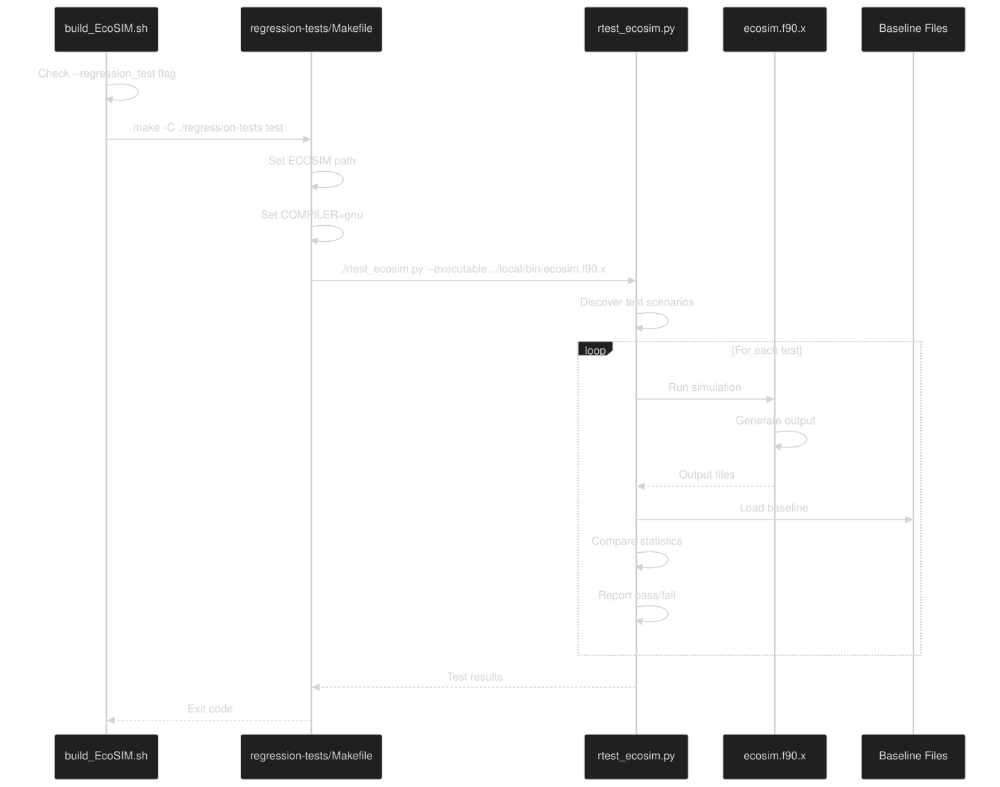

# Continuous Integration

Relevant source files

- [.github/workflows/ecosim-ci.yml](https://github.com/jingtao-lbl/EcoSIM/blob/7b8a4cf6/.github/workflows/ecosim-ci.yml)
- [README.md](https://github.com/jingtao-lbl/EcoSIM/blob/7b8a4cf6/README.md)
- [build_EcoSIM.sh](https://github.com/jingtao-lbl/EcoSIM/blob/7b8a4cf6/build_EcoSIM.sh)
- [docker/ubuntu-compiler.dockerfile](https://github.com/jingtao-lbl/EcoSIM/blob/7b8a4cf6/docker/ubuntu-compiler.dockerfile)
- [examples/run_dir/blodgett/Blodget.ctrl.namelist](https://github.com/jingtao-lbl/EcoSIM/blob/7b8a4cf6/examples/run_dir/blodgett/Blodget.ctrl.namelist)
- [python_tools/ParamEditorRice.ipynb](https://github.com/jingtao-lbl/EcoSIM/blob/7b8a4cf6/python_tools/ParamEditorRice.ipynb)
- [regression-tests/Makefile](https://github.com/jingtao-lbl/EcoSIM/blob/7b8a4cf6/regression-tests/Makefile)
- [regression-tests/tests/blodgett.regression.baseline.gnu](https://github.com/jingtao-lbl/EcoSIM/blob/7b8a4cf6/regression-tests/tests/blodgett.regression.baseline.gnu)
- [regression-tests/tests/dryland.regression.baseline.gnu](https://github.com/jingtao-lbl/EcoSIM/blob/7b8a4cf6/regression-tests/tests/dryland.regression.baseline.gnu)
- [regression-tests/tests/lake.regression.baseline.gnu](https://github.com/jingtao-lbl/EcoSIM/blob/7b8a4cf6/regression-tests/tests/lake.regression.baseline.gnu)
- [regression-tests/tests/sample.regression.baseline.gnu](https://github.com/jingtao-lbl/EcoSIM/blob/7b8a4cf6/regression-tests/tests/sample.regression.baseline.gnu)

## Purpose and Scope

This document describes the Continuous Integration (CI) infrastructure for EcoSIM, which automatically validates code changes through compilation and regression testing across multiple platforms. The CI system ensures that changes to the codebase do not introduce compilation errors or alter model behavior unexpectedly.

For information about the regression test suite itself, see [Regression Test Suite](#7.1) . For build system details, see [Building EcoSIM](#2.1) and [Build System Details](#8.3) .

## CI Architecture Overview

The EcoSIM CI system consists of three main components: GitHub Actions workflows that orchestrate the process, the build script that compiles the code, and the regression test framework that validates model behavior.

Sources:  [.github/workflows/ecosim-ci.yml 1-78](https://github.com/jingtao-lbl/EcoSIM/blob/7b8a4cf6/.github/workflows/ecosim-ci.yml#L1-L78)  [build_EcoSIM.sh 1-264](https://github.com/jingtao-lbl/EcoSIM/blob/7b8a4cf6/build_EcoSIM.sh#L1-L264)  [regression-tests/Makefile 1-70](https://github.com/jingtao-lbl/EcoSIM/blob/7b8a4cf6/regression-tests/Makefile#L1-L70)

## GitHub Actions Workflow Configuration

The CI workflow is defined in `.github/workflows/ecosim-ci.yml` and triggers on three events: workflow dispatch (manual), push to the repository, and pull requests.

### Workflow Structure

Sources:  [.github/workflows/ecosim-ci.yml 1-78](https://github.com/jingtao-lbl/EcoSIM/blob/7b8a4cf6/.github/workflows/ecosim-ci.yml#L1-L78)

### CI Jobs

The workflow defines two parallel jobs that test different Linux distributions:

| Job Name | Platform | Compiler Suite | Key Purpose | 
| --- | --- | --- | --- |
| build-ubuntu | ubuntu-latest | GCC (gfortran, gcc, g++) | Tests on Debian-based systems | 
| build-rocky | rockylinux/rockylinux:8.10 (container) | GCC (gfortran, gcc, g++) | Tests on RHEL-based systems | 

### Package Installation

Each job installs required dependencies before building:

Ubuntu Dependencies:

- `gfortran``cmake`Compilers: ,
- `libcurl4``libcurl4-gnutls-dev``curl`Libraries: , ,
- `autoconf``automake`Build tools: ,

[.github/workflows/ecosim-ci.yml 16-22](https://github.com/jingtao-lbl/EcoSIM/blob/7b8a4cf6/.github/workflows/ecosim-ci.yml#L16-L22)

Rocky Linux Dependencies:

- `gcc-gfortran``gcc-c++`Compilers: ,
- `cmake``which``git`Tools: , ,
- `curl``curl-devel`Libraries: ,
- `autoconf``automake``libtool``libxml2-devel`Build tools: , , ,

[.github/workflows/ecosim-ci.yml 49-62](https://github.com/jingtao-lbl/EcoSIM/blob/7b8a4cf6/.github/workflows/ecosim-ci.yml#L49-L62)

### Repository Checkout

Both jobs use `actions/checkout@v4` with `submodules: recursive` to ensure third-party dependencies in the `3rd-partylibs/` directory are cloned:

[.github/workflows/ecosim-ci.yml 24-26](https://github.com/jingtao-lbl/EcoSIM/blob/7b8a4cf6/.github/workflows/ecosim-ci.yml#L24-L26)  [.github/workflows/ecosim-ci.yml 64-66](https://github.com/jingtao-lbl/EcoSIM/blob/7b8a4cf6/.github/workflows/ecosim-ci.yml#L64-L66)

Sources:  [.github/workflows/ecosim-ci.yml 1-78](https://github.com/jingtao-lbl/EcoSIM/blob/7b8a4cf6/.github/workflows/ecosim-ci.yml#L1-L78)

## Build Process in CI

The CI system invokes `build_EcoSIM.sh` with explicit compiler paths to ensure consistent builds across platforms.

### Build Command

[.github/workflows/ecosim-ci.yml 32](https://github.com/jingtao-lbl/EcoSIM/blob/7b8a4cf6/.github/workflows/ecosim-ci.yml#L32-L32)  [.github/workflows/ecosim-ci.yml 72](https://github.com/jingtao-lbl/EcoSIM/blob/7b8a4cf6/.github/workflows/ecosim-ci.yml#L72-L72)

### Build Script Configuration for CI

The build script accepts command-line arguments that CI can use:

| Argument | Default in CI | Purpose | 
| --- | --- | --- |
| CC=<path> | Result of which gcc | Set C compiler | 
| CXX=<path> | Result of which g++ | Set C++ compiler | 
| FC=<path> | Result of which gfortran | Set Fortran compiler | 
| --regression_test | Not used in workflow | Enable regression tests after build | 
| --debug | Not set (Release mode) | Enable debug build | 
| --mpi | Not set | Enable MPI support | 

The CI workflow currently builds in Release mode without MPI, which represents the standard standalone configuration. [build_EcoSIM.sh 34-49](https://github.com/jingtao-lbl/EcoSIM/blob/7b8a4cf6/build_EcoSIM.sh#L34-L49)

### Build Stages

Sources:  [build_EcoSIM.sh 94-264](https://github.com/jingtao-lbl/EcoSIM/blob/7b8a4cf6/build_EcoSIM.sh#L94-L264)

### Error Handling

The build script checks return codes at each critical stage and aborts on failure:

[build_EcoSIM.sh 217-220](https://github.com/jingtao-lbl/EcoSIM/blob/7b8a4cf6/build_EcoSIM.sh#L217-L220)  [build_EcoSIM.sh 225-228](https://github.com/jingtao-lbl/EcoSIM/blob/7b8a4cf6/build_EcoSIM.sh#L225-L228)  [build_EcoSIM.sh 233-236](https://github.com/jingtao-lbl/EcoSIM/blob/7b8a4cf6/build_EcoSIM.sh#L233-L236)

Sources:  [build_EcoSIM.sh 1-264](https://github.com/jingtao-lbl/EcoSIM/blob/7b8a4cf6/build_EcoSIM.sh#L1-L264)

## Regression Testing in CI

The regression test infrastructure validates that model outputs match established baselines. While the current CI workflow does not explicitly invoke regression tests, the build script supports the `--regression_test` flag for local testing.

### Test Execution Flow

Sources:  [build_EcoSIM.sh 261-263](https://github.com/jingtao-lbl/EcoSIM/blob/7b8a4cf6/build_EcoSIM.sh#L261-L263)  [regression-tests/Makefile 1-70](https://github.com/jingtao-lbl/EcoSIM/blob/7b8a4cf6/regression-tests/Makefile#L1-L70)

### Regression Test Baselines

The test suite includes baseline files for four test scenarios, all compiled with GNU compilers:

| Baseline File | Test Scenario | Variables Tracked | 
| --- | --- | --- |
| sample.regression.baseline.gnu | Small test case | NH4_UPTK, aqueous soil O2, liquid soil water, soil temperature | 
| dryland.regression.baseline.gnu | Dryland agriculture | Same variables, different ranges | 
| lake.regression.baseline.gnu | Lake/wetland system | Same variables, waterlogged conditions | 
| blodgett.regression.baseline.gnu | Forest ecosystem | Same variables, forest conditions | 

Each baseline file contains statistical summaries (min, max, mean) and cell-specific values for comparison. [regression-tests/tests/sample.regression.baseline.gnu 1-37](https://github.com/jingtao-lbl/EcoSIM/blob/7b8a4cf6/regression-tests/tests/sample.regression.baseline.gnu#L1-L37)  [regression-tests/tests/dryland.regression.baseline.gnu 1-37](https://github.com/jingtao-lbl/EcoSIM/blob/7b8a4cf6/regression-tests/tests/dryland.regression.baseline.gnu#L1-L37)  [regression-tests/tests/lake.regression.baseline.gnu 1-37](https://github.com/jingtao-lbl/EcoSIM/blob/7b8a4cf6/regression-tests/tests/lake.regression.baseline.gnu#L1-L37)  [regression-tests/tests/blodgett.regression.baseline.gnu 1-37](https://github.com/jingtao-lbl/EcoSIM/blob/7b8a4cf6/regression-tests/tests/blodgett.regression.baseline.gnu#L1-L37)

### Baseline File Format

Example from `sample.regression.baseline.gnu` :

[regression-tests/tests/sample.regression.baseline.gnu 1-8](https://github.com/jingtao-lbl/EcoSIM/blob/7b8a4cf6/regression-tests/tests/sample.regression.baseline.gnu#L1-L8)

Sources:  [regression-tests/tests/sample.regression.baseline.gnu 1-37](https://github.com/jingtao-lbl/EcoSIM/blob/7b8a4cf6/regression-tests/tests/sample.regression.baseline.gnu#L1-L37)  [regression-tests/tests/dryland.regression.baseline.gnu 1-37](https://github.com/jingtao-lbl/EcoSIM/blob/7b8a4cf6/regression-tests/tests/dryland.regression.baseline.gnu#L1-L37)  [regression-tests/tests/lake.regression.baseline.gnu 1-37](https://github.com/jingtao-lbl/EcoSIM/blob/7b8a4cf6/regression-tests/tests/lake.regression.baseline.gnu#L1-L37)  [regression-tests/tests/blodgett.regression.baseline.gnu 1-37](https://github.com/jingtao-lbl/EcoSIM/blob/7b8a4cf6/regression-tests/tests/blodgett.regression.baseline.gnu#L1-L37)

### Makefile Targets

The `regression-tests/Makefile` provides several targets for test management:

| Target | Command | Purpose | 
| --- | --- | --- |
| test | make test | Run both meta-tests and regression tests | 
| rtest | make rtest | Run regression tests only | 
| rcheck | make rcheck | Recheck existing results without running simulations | 
| update | make update | Update baseline files with new results | 
| mtest | make mtest | Run meta-tests for the test framework itself | 
| clean | make clean | Remove temporary files | 
| clobber | make clobber | Remove all generated files | 

[regression-tests/Makefile 19-67](https://github.com/jingtao-lbl/EcoSIM/blob/7b8a4cf6/regression-tests/Makefile#L19-L67)

### Test Invocation

[regression-tests/Makefile 21-30](https://github.com/jingtao-lbl/EcoSIM/blob/7b8a4cf6/regression-tests/Makefile#L21-L30)

Sources:  [regression-tests/Makefile 1-70](https://github.com/jingtao-lbl/EcoSIM/blob/7b8a4cf6/regression-tests/Makefile#L1-L70)

## Platform Coverage

The CI system tests compilation and basic functionality on two Linux distributions representing the major Linux families.

### Platform Matrix

Sources:  [.github/workflows/ecosim-ci.yml 10-78](https://github.com/jingtao-lbl/EcoSIM/blob/7b8a4cf6/.github/workflows/ecosim-ci.yml#L10-L78)

### Compiler Support

Currently, CI only tests with GNU compilers (GCC). The codebase mentions Intel compiler compatibility but does not test it in CI:

[README.md 23](https://github.com/jingtao-lbl/EcoSIM/blob/7b8a4cf6/README.md#L23-L23)

Sources:  [README.md 1-68](https://github.com/jingtao-lbl/EcoSIM/blob/7b8a4cf6/README.md#L1-L68)  [.github/workflows/ecosim-ci.yml 1-78](https://github.com/jingtao-lbl/EcoSIM/blob/7b8a4cf6/.github/workflows/ecosim-ci.yml#L1-L78)

## Running CI Locally

Developers can replicate CI builds locally using either native compilation or Docker containers.

### Native Local Build

To run the same build that CI executes:

To include regression tests:

[build_EcoSIM.sh 68-69](https://github.com/jingtao-lbl/EcoSIM/blob/7b8a4cf6/build_EcoSIM.sh#L68-L69)  [README.md 11-23](https://github.com/jingtao-lbl/EcoSIM/blob/7b8a4cf6/README.md#L11-L23)

### Docker-based Local Testing

The repository includes a Dockerfile for Ubuntu-based testing in a containerized environment:

[README.md 55-66](https://github.com/jingtao-lbl/EcoSIM/blob/7b8a4cf6/README.md#L55-L66)  [docker/ubuntu-compiler.dockerfile 1-29](https://github.com/jingtao-lbl/EcoSIM/blob/7b8a4cf6/docker/ubuntu-compiler.dockerfile#L1-L29)

### Docker Container Contents

The Ubuntu compiler image includes:

[docker/ubuntu-compiler.dockerfile 2-24](https://github.com/jingtao-lbl/EcoSIM/blob/7b8a4cf6/docker/ubuntu-compiler.dockerfile#L2-L24)

Sources:  [README.md 55-67](https://github.com/jingtao-lbl/EcoSIM/blob/7b8a4cf6/README.md#L55-L67)  [docker/ubuntu-compiler.dockerfile 1-29](https://github.com/jingtao-lbl/EcoSIM/blob/7b8a4cf6/docker/ubuntu-compiler.dockerfile#L1-L29)  [build_EcoSIM.sh 1-264](https://github.com/jingtao-lbl/EcoSIM/blob/7b8a4cf6/build_EcoSIM.sh#L1-L264)

## Manual Regression Test Execution

Beyond the build script's integrated testing, developers can manually run regression tests with fine-grained control.

### Direct Test Invocation

[regression-tests/Makefile 19-30](https://github.com/jingtao-lbl/EcoSIM/blob/7b8a4cf6/regression-tests/Makefile#L19-L30)

### Test Framework Components

Sources:  [regression-tests/Makefile 1-70](https://github.com/jingtao-lbl/EcoSIM/blob/7b8a4cf6/regression-tests/Makefile#L1-L70)  [examples/run_dir/blodgett/Blodget.ctrl.namelist 1-6](https://github.com/jingtao-lbl/EcoSIM/blob/7b8a4cf6/examples/run_dir/blodgett/Blodget.ctrl.namelist#L1-L6)

### Regression Test Namelist Configuration

Test scenarios can be configured to output regression data via the `&regression_test` namelist block:

[examples/run_dir/blodgett/Blodget.ctrl.namelist 1-3](https://github.com/jingtao-lbl/EcoSIM/blob/7b8a4cf6/examples/run_dir/blodgett/Blodget.ctrl.namelist#L1-L3)

Combined with the main `&ecosim` namelist parameter:

[examples/run_dir/blodgett/Blodget.ctrl.namelist 7](https://github.com/jingtao-lbl/EcoSIM/blob/7b8a4cf6/examples/run_dir/blodgett/Blodget.ctrl.namelist#L7-L7)

Sources:  [examples/run_dir/blodgett/Blodget.ctrl.namelist 1-68](https://github.com/jingtao-lbl/EcoSIM/blob/7b8a4cf6/examples/run_dir/blodgett/Blodget.ctrl.namelist#L1-L68)

## Continuous Integration Limitations

### Current Scope

The CI system currently focuses on:

- **Compilation validation**: Ensures code compiles on multiple platforms
- **Build artifact generation**: Creates executables successfully
- **Platform compatibility**: Tests Debian and RHEL-based systems

### Not Currently Automated

The following are not automatically executed in the CI workflow:

### Potential Enhancements

To extend CI capabilities, developers could modify the workflow to:

This would enable automatic regression testing by adding a single flag. [build_EcoSIM.sh 261-263](https://github.com/jingtao-lbl/EcoSIM/blob/7b8a4cf6/build_EcoSIM.sh#L261-L263)

Sources:  [.github/workflows/ecosim-ci.yml 1-78](https://github.com/jingtao-lbl/EcoSIM/blob/7b8a4cf6/.github/workflows/ecosim-ci.yml#L1-L78)  [build_EcoSIM.sh 261-263](https://github.com/jingtao-lbl/EcoSIM/blob/7b8a4cf6/build_EcoSIM.sh#L261-L263)

## Troubleshooting CI Failures

### Common Failure Scenarios

| Failure Type | Location | Cause | Solution | 
| --- | --- | --- | --- |
| Package installation fails | package-install step | Repository unavailable | Retry workflow | 
| Submodule checkout fails | actions/checkout step | Git network issue | Check submodule URLs | 
| CMake configuration fails | cmake command | Missing dependencies | Review third-party library build logs | 
| Compilation fails | make command | Code syntax error | Review compiler output | 
| Installation fails | make install | Permission or path issue | Check installation directory | 

### Build Log Analysis

Failed CI runs generate logs that can be accessed through the GitHub Actions interface. Key sections to examine:

### Commented Debug Sections

The workflow includes commented-out debug sections that can be enabled for troubleshooting:

[.github/workflows/ecosim-ci.yml 34-38](https://github.com/jingtao-lbl/EcoSIM/blob/7b8a4cf6/.github/workflows/ecosim-ci.yml#L34-L38)  [.github/workflows/ecosim-ci.yml 74-77](https://github.com/jingtao-lbl/EcoSIM/blob/7b8a4cf6/.github/workflows/ecosim-ci.yml#L74-L77)

These can be uncommented to capture third-party library configuration logs even when the build fails.

Sources:  [.github/workflows/ecosim-ci.yml 1-78](https://github.com/jingtao-lbl/EcoSIM/blob/7b8a4cf6/.github/workflows/ecosim-ci.yml#L1-L78)  [build_EcoSIM.sh 217-236](https://github.com/jingtao-lbl/EcoSIM/blob/7b8a4cf6/build_EcoSIM.sh#L217-L236)