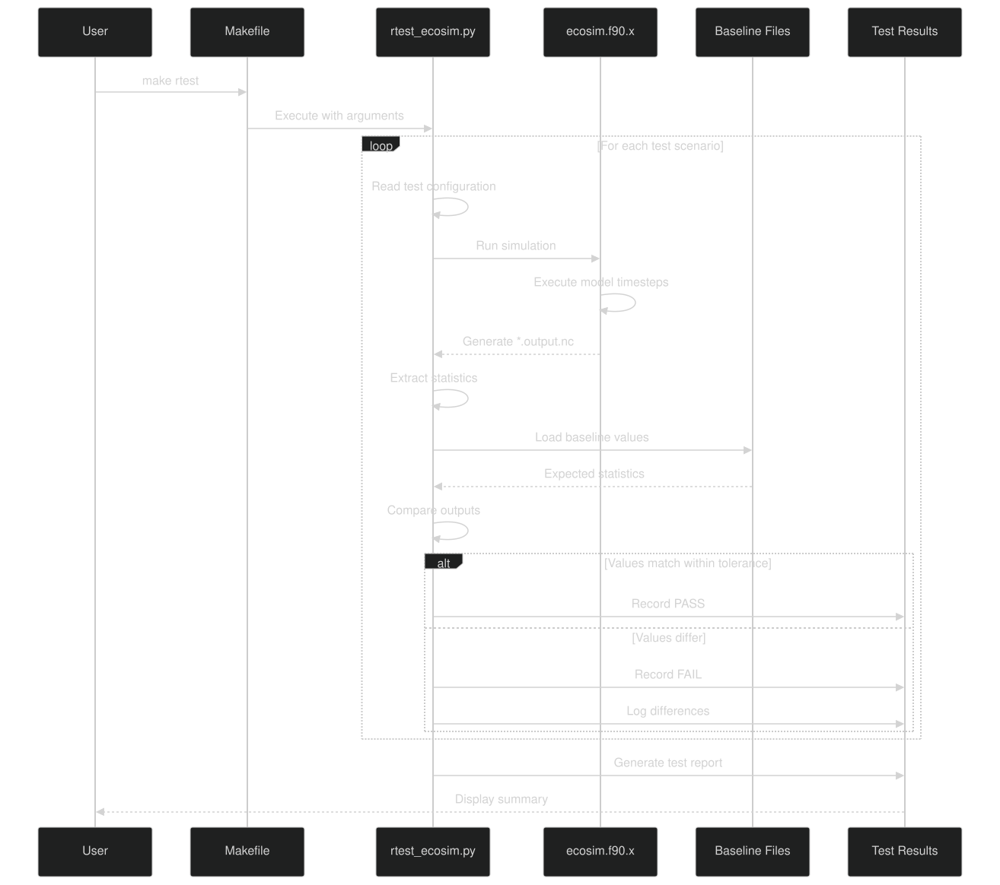

# Testing and Validation

Relevant source files

- [regression-tests/Makefile](https://github.com/jingtao-lbl/EcoSIM/blob/7b8a4cf6/regression-tests/Makefile)
- [regression-tests/tests/blodgett.regression.baseline.gnu](https://github.com/jingtao-lbl/EcoSIM/blob/7b8a4cf6/regression-tests/tests/blodgett.regression.baseline.gnu)
- [regression-tests/tests/dryland.regression.baseline.gnu](https://github.com/jingtao-lbl/EcoSIM/blob/7b8a4cf6/regression-tests/tests/dryland.regression.baseline.gnu)
- [regression-tests/tests/lake.regression.baseline.gnu](https://github.com/jingtao-lbl/EcoSIM/blob/7b8a4cf6/regression-tests/tests/lake.regression.baseline.gnu)
- [regression-tests/tests/sample.regression.baseline.gnu](https://github.com/jingtao-lbl/EcoSIM/blob/7b8a4cf6/regression-tests/tests/sample.regression.baseline.gnu)

## Purpose and Scope

This document describes the testing and validation infrastructure for EcoSIM, including the regression test suite, baseline file format, test execution procedures, and quality assurance mechanisms. The testing framework ensures that model behavior remains consistent across code changes and platform configurations.

For information about building the executable that gets tested, see [Building EcoSIM](#2.1) . For details on the continuous integration system that automates testing, see [Continuous Integration](#7.2) . For specifics on the regression test scenarios and baseline management, see [Regression Test Suite](#7.1) .

## Testing Philosophy

EcoSIM employs a regression testing strategy based on numerical reproducibility. Each test scenario runs the model and compares output variables against known baseline values. Tests verify that:

## Testing Infrastructure Architecture

Testing Infrastructure Architecture : The test system consists of a Python-based test manager ( `rtest_ecosim.py` ) that orchestrates execution of multiple test scenarios, compares outputs against compiler-specific baselines, and generates diagnostic reports.

Sources: [regression-tests/Makefile 1-70](https://github.com/jingtao-lbl/EcoSIM/blob/7b8a4cf6/regression-tests/Makefile#L1-L70)  [regression-tests/tests/sample.regression.baseline.gnu 1-37](https://github.com/jingtao-lbl/EcoSIM/blob/7b8a4cf6/regression-tests/tests/sample.regression.baseline.gnu#L1-L37)

## Test Execution Workflow

Test Execution Sequence : The test manager iterates through scenarios, executes the model, extracts output statistics, and compares them against baseline values to determine pass/fail status.

Sources: [regression-tests/Makefile 19-30](https://github.com/jingtao-lbl/EcoSIM/blob/7b8a4cf6/regression-tests/Makefile#L19-L30)

## Makefile Targets

The testing infrastructure provides several Makefile targets for different testing workflows:

| Target | Command | Purpose | 
| --- | --- | --- |
| test | make test | Run all tests (mtest + rtest) | 
| rtest | make rtest | Execute regression tests with current baselines | 
| update | make update | Update baseline files from current run | 
| rcheck | make rcheck | Re-check existing results without re-running model | 
| mtest | make mtest | Run meta-tests for test manager itself | 
| test-coverage | make test-coverage | Generate code coverage reports | 
| clean | make clean | Remove temporary files | 
| clobber | make clobber | Remove all generated files | 

Sources: [regression-tests/Makefile 19-69](https://github.com/jingtao-lbl/EcoSIM/blob/7b8a4cf6/regression-tests/Makefile#L19-L69)

### Common Testing Commands

Sources: [regression-tests/Makefile 5-30](https://github.com/jingtao-lbl/EcoSIM/blob/7b8a4cf6/regression-tests/Makefile#L5-L30)

## Baseline File Format

Baseline files follow a structured text format that records expected statistical properties of model outputs. Each baseline file is compiler-specific (e.g., `.gnu` , `.intel` ) to account for platform-dependent numerical precision.

### Baseline Structure

Baseline File Format : Each variable section contains category, global statistics (min/max/mean), and cell-specific values for deterministic comparison.

Sources: [regression-tests/tests/sample.regression.baseline.gnu 1-37](https://github.com/jingtao-lbl/EcoSIM/blob/7b8a4cf6/regression-tests/tests/sample.regression.baseline.gnu#L1-L37)

### Example Baseline Entry

From [regression-tests/tests/sample.regression.baseline.gnu 1-9](https://github.com/jingtao-lbl/EcoSIM/blob/7b8a4cf6/regression-tests/tests/sample.regression.baseline.gnu#L1-L9) :

This format enables:

- **Global statistics**verify overall model behavior
- **Cell-specific values**catch localized numerical differences
- **Scientific notation**ensures precision across magnitude ranges
- **Unit documentation**clarifies physical interpretation

Sources: [regression-tests/tests/sample.regression.baseline.gnu 1-9](https://github.com/jingtao-lbl/EcoSIM/blob/7b8a4cf6/regression-tests/tests/sample.regression.baseline.gnu#L1-L9)

## Test Scenarios

EcoSIM includes multiple test scenarios representing different ecosystem types and model configurations:

| Scenario | Ecosystem Type | Key Features | Baseline File | 
| --- | --- | --- | --- |
| sample | Generic test | Minimal configuration, fast execution | sample.regression.baseline.gnu | 
| dryland | Arid ecosystem | Low moisture, high temperature | dryland.regression.baseline.gnu | 
| lake | Aquatic system | Saturated conditions, low O2 | lake.regression.baseline.gnu | 
| blodgett | Forest site | Real-world location, complex vegetation | blodgett.regression.baseline.gnu | 

Sources: [regression-tests/tests/sample.regression.baseline.gnu 1-37](https://github.com/jingtao-lbl/EcoSIM/blob/7b8a4cf6/regression-tests/tests/sample.regression.baseline.gnu#L1-L37)  [regression-tests/tests/dryland.regression.baseline.gnu 1-37](https://github.com/jingtao-lbl/EcoSIM/blob/7b8a4cf6/regression-tests/tests/dryland.regression.baseline.gnu#L1-L37)  [regression-tests/tests/lake.regression.baseline.gnu 1-37](https://github.com/jingtao-lbl/EcoSIM/blob/7b8a4cf6/regression-tests/tests/lake.regression.baseline.gnu#L1-L37)  [regression-tests/tests/blodgett.regression.baseline.gnu 1-37](https://github.com/jingtao-lbl/EcoSIM/blob/7b8a4cf6/regression-tests/tests/blodgett.regression.baseline.gnu#L1-L37)

### Variable Categories in Baselines

Each test scenario validates multiple variables across two categories:

State Variables (instantaneous values):

- `liquid soil water (m^3 m^-3)`- volumetric water content
- `soil temperature (oC)`- thermal state
- `aqueous soil O2 (g m^3)`- dissolved oxygen concentration

Flux Variables (rates):

- `NH4_UPTK (g m^-3 h^-1)`- ammonium uptake rate

Sources: [regression-tests/tests/sample.regression.baseline.gnu 1-37](https://github.com/jingtao-lbl/EcoSIM/blob/7b8a4cf6/regression-tests/tests/sample.regression.baseline.gnu#L1-L37)

## Baseline Value Comparison

The test system compares outputs across scenarios to ensure physical consistency:

### Soil Temperature Ranges by Scenario

| Scenario | Min (°C) | Max (°C) | Mean (°C) | 
| --- | --- | --- | --- |
| sample | -0.92 | 12.11 | 3.14 | 
| dryland | 17.86 | 27.41 | 24.01 | 
| lake | 26.32 | 33.49 | 31.54 | 
| blodgett | 11.76 | 29.11 | 19.77 | 

These ranges reflect:

- **sample**: Cold conditions with near-freezing temperatures
- **dryland**: Warm, stable thermal regime
- **lake**: High thermal inertia from water saturation
- **blodgett**: Temperate forest with seasonal variation

Sources: [regression-tests/tests/sample.regression.baseline.gnu 28-35](https://github.com/jingtao-lbl/EcoSIM/blob/7b8a4cf6/regression-tests/tests/sample.regression.baseline.gnu#L28-L35)  [regression-tests/tests/dryland.regression.baseline.gnu 28-35](https://github.com/jingtao-lbl/EcoSIM/blob/7b8a4cf6/regression-tests/tests/dryland.regression.baseline.gnu#L28-L35)  [regression-tests/tests/lake.regression.baseline.gnu 28-35](https://github.com/jingtao-lbl/EcoSIM/blob/7b8a4cf6/regression-tests/tests/lake.regression.baseline.gnu#L28-L35)  [regression-tests/tests/blodgett.regression.baseline.gnu 28-35](https://github.com/jingtao-lbl/EcoSIM/blob/7b8a4cf6/regression-tests/tests/blodgett.regression.baseline.gnu#L28-L35)

### Liquid Soil Water Content by Scenario

| Scenario | Min | Max | Mean | 
| --- | --- | --- | --- |
| sample | 0.000 | 0.754 | 0.276 | 
| dryland | 0.075 | 0.887 | 0.680 | 
| lake | 1.0e-14 | 1.000 | 0.917 | 
| blodgett | 0.718 | 0.920 | 0.799 | 

Observations:

- **lake**shows near-saturation (mean = 0.917)
- **dryland**paradoxically shows high water content (0.680) - likely deeper profile
- **blodgett**maintains consistent moisture (narrow range 0.718-0.920)
- **sample**shows dry conditions (mean = 0.276)

Sources: [regression-tests/tests/sample.regression.baseline.gnu 19-26](https://github.com/jingtao-lbl/EcoSIM/blob/7b8a4cf6/regression-tests/tests/sample.regression.baseline.gnu#L19-L26)  [regression-tests/tests/dryland.regression.baseline.gnu 19-26](https://github.com/jingtao-lbl/EcoSIM/blob/7b8a4cf6/regression-tests/tests/dryland.regression.baseline.gnu#L19-L26)  [regression-tests/tests/lake.regression.baseline.gnu 19-26](https://github.com/jingtao-lbl/EcoSIM/blob/7b8a4cf6/regression-tests/tests/lake.regression.baseline.gnu#L19-L26)  [regression-tests/tests/blodgett.regression.baseline.gnu 19-26](https://github.com/jingtao-lbl/EcoSIM/blob/7b8a4cf6/regression-tests/tests/blodgett.regression.baseline.gnu#L19-L26)

## Updating Baselines

When model improvements or bug fixes intentionally change output values, baselines must be updated:

### Baseline Update Workflow

Baseline Update Process : Developers must verify that output differences are intentional before updating baseline files and committing them to version control.

Sources: [regression-tests/Makefile 21-22](https://github.com/jingtao-lbl/EcoSIM/blob/7b8a4cf6/regression-tests/Makefile#L21-L22)

## Test Manager Features

The `rtest_ecosim.py` script provides comprehensive test management capabilities:

### Command Line Arguments

| Argument | Purpose | 
| --- | --- |
| --executable PATH | Path to ecosim.f90.x binary | 
| --compiler NAME | Compiler identifier (gnu, intel) for baseline selection | 
| --update-baseline | Generate new baseline files from current run | 
| --check-only | Re-check existing results without re-running model | 
| --backtrace | Enable detailed error diagnostics | 

Sources: [regression-tests/Makefile 12-30](https://github.com/jingtao-lbl/EcoSIM/blob/7b8a4cf6/regression-tests/Makefile#L12-L30)

### Test Execution Options

Sources: [regression-tests/Makefile 19-30](https://github.com/jingtao-lbl/EcoSIM/blob/7b8a4cf6/regression-tests/Makefile#L19-L30)

## Code Coverage Analysis

EcoSIM supports code coverage analysis using Python's `coverage` tool:

The coverage analysis:

Sources: [regression-tests/Makefile 38-46](https://github.com/jingtao-lbl/EcoSIM/blob/7b8a4cf6/regression-tests/Makefile#L38-L46)

### Coverage Workflow

Code Coverage Pipeline : Separate coverage files are generated for different test suites, then combined for comprehensive analysis.

Sources: [regression-tests/Makefile 38-46](https://github.com/jingtao-lbl/EcoSIM/blob/7b8a4cf6/regression-tests/Makefile#L38-L46)

## Quality Assurance Procedures

### Pre-Commit Checks

Before committing code changes, developers should:

Sources: [regression-tests/Makefile 19-34](https://github.com/jingtao-lbl/EcoSIM/blob/7b8a4cf6/regression-tests/Makefile#L19-L34)

### Test File Cleanup

The `clean` target removes backup files ( `*~` ), while `clobber` additionally removes:

- `*.cdl.nc``*.output.nc`NetCDF outputs ( , )
- `*.bak`Backup files ( )
- `*.stdout`Standard output logs ( )
- `*.regression`Regression result files ( )

Sources: [regression-tests/Makefile 55-66](https://github.com/jingtao-lbl/EcoSIM/blob/7b8a4cf6/regression-tests/Makefile#L55-L66)

## Integration with Build System

The testing infrastructure integrates with the CMake build system:

Build-Test Integration : The test system expects the executable at `../local/bin/ecosim.f90.x` relative to the `regression-tests/` directory, matching the standard installation location.

Sources: [regression-tests/Makefile 5-14](https://github.com/jingtao-lbl/EcoSIM/blob/7b8a4cf6/regression-tests/Makefile#L5-L14)

## Compiler-Specific Testing

EcoSIM maintains separate baseline files for different compilers to account for numerical precision differences:

| Compiler | Baseline Suffix | Example | 
| --- | --- | --- |
| GNU (gfortran) | .gnu | sample.regression.baseline.gnu | 
| Intel (ifort) | .intel | sample.regression.baseline.intel | 

This separation ensures:

- **Numerical consistency**within each compiler
- **Cross-platform validation**across compiler families
- **Precision tolerance**appropriate to each toolchain

Sources: [regression-tests/Makefile 6-10](https://github.com/jingtao-lbl/EcoSIM/blob/7b8a4cf6/regression-tests/Makefile#L6-L10)  [regression-tests/tests/sample.regression.baseline.gnu 1-37](https://github.com/jingtao-lbl/EcoSIM/blob/7b8a4cf6/regression-tests/tests/sample.regression.baseline.gnu#L1-L37)

## Test Result Interpretation

### Pass Criteria

A test passes when:

### Failure Investigation

When tests fail, investigate in this order:

Sources: [regression-tests/Makefile 13-14](https://github.com/jingtao-lbl/EcoSIM/blob/7b8a4cf6/regression-tests/Makefile#L13-L14)

## Test Maintenance

### Adding New Test Scenarios

To add a new test scenario:

### Baseline Versioning

Baseline files are version-controlled alongside code:

- Tracked in Git for full history
- Updated atomically with code changes
- Reviewed in pull requests for correctness

Sources: [regression-tests/Makefile 21-22](https://github.com/jingtao-lbl/EcoSIM/blob/7b8a4cf6/regression-tests/Makefile#L21-L22)