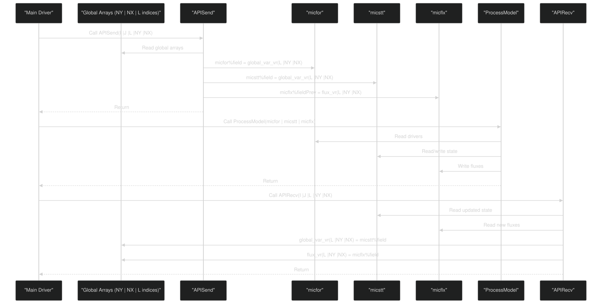

# Adding New Process Models

Relevant source files

- [drivers/boxsbgc/ForcTypeMod.F90](https://github.com/jingtao-lbl/EcoSIM/blob/7b8a4cf6/drivers/boxsbgc/ForcTypeMod.F90)
- [drivers/boxsbgc/batchmod.F90](https://github.com/jingtao-lbl/EcoSIM/blob/7b8a4cf6/drivers/boxsbgc/batchmod.F90)
- [f90src/APIData/PlantAPIData.F90](https://github.com/jingtao-lbl/EcoSIM/blob/7b8a4cf6/f90src/APIData/PlantAPIData.F90)
- [f90src/APIs/MicBGCAPI.F90](https://github.com/jingtao-lbl/EcoSIM/blob/7b8a4cf6/f90src/APIs/MicBGCAPI.F90)
- [f90src/APIs/PlantAPI.F90](https://github.com/jingtao-lbl/EcoSIM/blob/7b8a4cf6/f90src/APIs/PlantAPI.F90)

This page provides a guide for implementing new biogeochemical process models in EcoSIM. It covers the architectural patterns, data structures, and integration procedures required to add a custom process (e.g., a new decomposition mechanism, a specialized chemical reaction, or an alternative plant physiology model).

For information about the existing process models themselves (plant, microbial, geochemical), see [Biogeochemical Process Models](#4) . For details on the overall system architecture, see [System Architecture](#3) .

## Architectural Pattern

EcoSIM process models follow a standardized three-layer architecture that separates data representation from computation:

Key Components:

Sources: [f90src/APIs/PlantAPI.F90 1-100](https://github.com/jingtao-lbl/EcoSIM/blob/7b8a4cf6/f90src/APIs/PlantAPI.F90#L1-L100)  [f90src/APIs/MicBGCAPI.F90 1-150](https://github.com/jingtao-lbl/EcoSIM/blob/7b8a4cf6/f90src/APIs/MicBGCAPI.F90#L1-L150)

## Data Structure Design

### Type Hierarchy

Each process model requires three data type categories:

Sources:  [f90src/APIData/PlantAPIData.F90 31-88](https://github.com/jingtao-lbl/EcoSIM/blob/7b8a4cf6/f90src/APIData/PlantAPIData.F90#L31-L88)  [f90src/APIs/MicBGCAPI.F90 6-10](https://github.com/jingtao-lbl/EcoSIM/blob/7b8a4cf6/f90src/APIs/MicBGCAPI.F90#L6-L10)

### Example: Microbial Model Data Types

The microbial BGC model demonstrates the complete pattern:

| Type | Module | Purpose | Key Fields | 
| --- | --- | --- | --- |
| micforctype | MicForcTypeMod | Environmental drivers | TKS, PSISoilMatricP, VLWatMicP, POROS | 
| micsttype | MicStateTraitTypeMod | Pool sizes and traits | DOM, SolidOM, mBiomeHeter, mBiomeAutor | 
| micfluxtype | MicFLuxTypeMod | Process rates | RNH4DmndSoilHeter, RO2DmndHetert, tRHydlySOM | 

Field Naming Conventions:

- Forcing: Physical properties (TKS = temperature, POROS = porosity)
- State: Mass/concentration pools (DOM = dissolved organic matter)
- Flux: Rate variables with R prefix (R = rate per hour)

Sources: [f90src/APIs/MicBGCAPI.F90 40-43](https://github.com/jingtao-lbl/EcoSIM/blob/7b8a4cf6/f90src/APIs/MicBGCAPI.F90#L40-L43)  [drivers/boxsbgc/batchmod.F90 95-108](https://github.com/jingtao-lbl/EcoSIM/blob/7b8a4cf6/drivers/boxsbgc/batchmod.F90#L95-L108)

## API Implementation Pattern

### The Send-Recv Protocol

### Implementation: APISend

The `APISend` subroutine populates local data structures from global arrays:

Key code locations:

- [f90src/APIs/MicBGCAPI.F90176-241](https://github.com/jingtao-lbl/EcoSIM/blob/7b8a4cf6/f90src/APIs/MicBGCAPI.F90#L176-L241)Forcing setup:
- [f90src/APIs/MicBGCAPI.F90286-368](https://github.com/jingtao-lbl/EcoSIM/blob/7b8a4cf6/f90src/APIs/MicBGCAPI.F90#L286-L368)State setup:
- [f90src/APIs/MicBGCAPI.F90370-405](https://github.com/jingtao-lbl/EcoSIM/blob/7b8a4cf6/f90src/APIs/MicBGCAPI.F90#L370-L405)Flux initialization:

### Implementation: APIRecv

The `APIRecv` subroutine writes results back to global arrays:

Critical patterns:

Example from microbial model:

Sources: [f90src/APIs/MicBGCAPI.F90 413-593](https://github.com/jingtao-lbl/EcoSIM/blob/7b8a4cf6/f90src/APIs/MicBGCAPI.F90#L413-L593)

## Process Model Entry Point

### Main Model Function

Each process model provides a main entry point that is called within the hourly timestep loop:

Plant model equivalent:

- `PlantAPI::PlantAPISend/PlantAPIRecv`Entry: called from main driver
- No explicit layer loop (handles all PFTs and layers internally)

Sources: [f90src/APIs/MicBGCAPI.F90 78-134](https://github.com/jingtao-lbl/EcoSIM/blob/7b8a4cf6/f90src/APIs/MicBGCAPI.F90#L78-L134)  [f90src/APIs/PlantAPI.F90 48-150](https://github.com/jingtao-lbl/EcoSIM/blob/7b8a4cf6/f90src/APIs/PlantAPI.F90#L48-L150)

### Layer-Specific Processing

The `MicBGC1Layer` pattern demonstrates how to structure single-layer computations:

Sources: [f90src/APIs/MicBGCAPI.F90 138-151](https://github.com/jingtao-lbl/EcoSIM/blob/7b8a4cf6/f90src/APIs/MicBGCAPI.F90#L138-L151)

## Integration Steps

### Step-by-Step Guide

To add a new process model to EcoSIM:

### Detailed Steps

Step 1: Define Data Types

Create three type definitions in `f90src/APIData/NewModelData.F90` :

Sources: [f90src/APIData/PlantAPIData.F90 31-88](https://github.com/jingtao-lbl/EcoSIM/blob/7b8a4cf6/f90src/APIData/PlantAPIData.F90#L31-L88)  [f90src/APIData/PlantAPIData.F90 90-161](https://github.com/jingtao-lbl/EcoSIM/blob/7b8a4cf6/f90src/APIData/PlantAPIData.F90#L90-L161)

Step 2: Implement API Module

Create `f90src/APIs/NewModelAPI.F90` :

Sources: [f90src/APIs/MicBGCAPI.F90 1-77](https://github.com/jingtao-lbl/EcoSIM/blob/7b8a4cf6/f90src/APIs/MicBGCAPI.F90#L1-L77)  [f90src/APIs/PlantAPI.F90 1-44](https://github.com/jingtao-lbl/EcoSIM/blob/7b8a4cf6/f90src/APIs/PlantAPI.F90#L1-L44)

Step 3: Add Global Arrays

In appropriate DataType module (e.g., `f90src/DataType/NewProcessDataType.F90` ):

Sources: [f90src/DataType/SoilBGCDataType.F90 1-100](https://github.com/jingtao-lbl/EcoSIM/blob/7b8a4cf6/f90src/DataType/SoilBGCDataType.F90#L1-L100)  [f90src/DataType/PlantDataRateType.F90 1-50](https://github.com/jingtao-lbl/EcoSIM/blob/7b8a4cf6/f90src/DataType/PlantDataRateType.F90#L1-L50)

Step 4: Integrate into Main Driver

In `f90src/main/EcoSIMAPI.F90` or equivalent:

Sources: [f90src/main/EcoSIMAPI.F90 100-200](https://github.com/jingtao-lbl/EcoSIM/blob/7b8a4cf6/f90src/main/EcoSIMAPI.F90#L100-L200)

Step 5: Register History Output

In `f90src/utils/EcoSIMHistMod.F90` , add variables to history file definitions:

Sources: [f90src/utils/EcoSIMHistMod.F90 1-100](https://github.com/jingtao-lbl/EcoSIM/blob/7b8a4cf6/f90src/utils/EcoSIMHistMod.F90#L1-L100)

## Example: Microbial Model Architecture

### Complete Data Flow

### Module Organization

| Module | File | Purpose | Public Interface | 
| --- | --- | --- | --- |
| MicForcTypeMod | f90src/APIData/ | Forcing data type | micforctype, Init, Destroy | 
| MicStateTraitTypeMod | f90src/APIData/ | State data type | micsttype, Init, Destroy | 
| MicFLuxTypeMod | f90src/APIData/ | Flux data type | micfluxtype, Init, Destroy | 
| MicBGCAPI | f90src/APIs/ | API layer | MicrobeModel, MicAPI_Init, MicAPI_cleanup | 
| MicBGCMod | f90src/microbial_bgc/ | Core computation | SoilBGCOneLayer | 
| MicrobialDataType | f90src/DataType/ | Global arrays | All _vr arrays | 

Sources: [f90src/APIs/MicBGCAPI.F90 1-77](https://github.com/jingtao-lbl/EcoSIM/blob/7b8a4cf6/f90src/APIs/MicBGCAPI.F90#L1-L77)  [f90src/APIs/MicBGCAPI.F90 154-408](https://github.com/jingtao-lbl/EcoSIM/blob/7b8a4cf6/f90src/APIs/MicBGCAPI.F90#L154-L408)

### Initialization Sequence

Code implementation at [f90src/APIs/MicBGCAPI.F90 55-64](https://github.com/jingtao-lbl/EcoSIM/blob/7b8a4cf6/f90src/APIs/MicBGCAPI.F90#L55-L64) :

Cleanup at [f90src/APIs/MicBGCAPI.F90 66-76](https://github.com/jingtao-lbl/EcoSIM/blob/7b8a4cf6/f90src/APIs/MicBGCAPI.F90#L66-L76) :

## Batch Mode Support

### Purpose

Batch mode enables standalone testing of process models without the full EcoSIM infrastructure. This is useful for:

- Unit testing individual processes
- Parameter sensitivity analysis
- Model validation against laboratory data
- Debugging without spatial complexity

### Architecture

### Implementation Pattern

The batch mode requires defining variable mappings between state vector indices and model variables:

Step 1: Define State Vector Layout

Example at [drivers/boxsbgc/batchmod.F90 310-505](https://github.com/jingtao-lbl/EcoSIM/blob/7b8a4cf6/drivers/boxsbgc/batchmod.F90#L310-L505)

Step 2: Configure from State Vector

Example at [drivers/boxsbgc/batchmod.F90 95-305](https://github.com/jingtao-lbl/EcoSIM/blob/7b8a4cf6/drivers/boxsbgc/batchmod.F90#L95-L305)

Step 3: Update State Vector

Example at [drivers/boxsbgc/batchmod.F90 507-655](https://github.com/jingtao-lbl/EcoSIM/blob/7b8a4cf6/drivers/boxsbgc/batchmod.F90#L507-L655)

### Running Batch Tests

Create a simple driver that calls:

Sources: [drivers/boxsbgc/batchmod.F90 1-700](https://github.com/jingtao-lbl/EcoSIM/blob/7b8a4cf6/drivers/boxsbgc/batchmod.F90#L1-L700)

## Common Patterns and Best Practices

### Memory Management

Always implement paired Init/Destroy methods:

### Array Indexing

Follow EcoSIM conventions for multi-dimensional arrays:

- **Layer index**: L = 0 (litter), 1 to NL (soil layers)
- **Column index**: NY, NX (row, column in 2D grid)
- **PFT index**: NZ = 1 to NP0_col(NY,NX)
- **Element index**: NE = 1 to NumPlantChemElms (usually C, N, P)

Example: `SolidOM_vr(NE, M, K, L, NY, NX)` where:

- NE = element (C/N/P)
- M = kinetic component (protein/carbohydrate/cellulose/lignin)
- K = SOM complex
- L = layer
- NY, NX = spatial indices

### Flux Sign Conventions

- **Positive flux**: Into the pool/process (uptake, production)
- **Negative flux**: Out of the pool/process (loss, consumption)
- **Rate variables**: Prefix with 'R' (e.g., RNH4Uptake, RCO2Emission)

### Error Handling

Use the abort utilities for critical errors:

Sources: [f90src/APIs/MicBGCAPI.F90 15](https://github.com/jingtao-lbl/EcoSIM/blob/7b8a4cf6/f90src/APIs/MicBGCAPI.F90#L15-L15)  [drivers/boxsbgc/batchmod.F90 3](https://github.com/jingtao-lbl/EcoSIM/blob/7b8a4cf6/drivers/boxsbgc/batchmod.F90#L3-L3)

This guide provides the foundation for adding new process models to EcoSIM. For questions about specific biogeochemical formulations, consult the relevant process model documentation in sections [4.1](#4.1) (Plant), [4.2](#4.2) (Microbial), and [4.3](#4.3) (Geochemistry).