# Build System Details

Relevant source files

- [.github/workflows/ecosim-ci.yml](https://github.com/jingtao-lbl/EcoSIM/blob/7b8a4cf6/.github/workflows/ecosim-ci.yml)
- [3rd-partylibs/CMakeLists.txt](https://github.com/jingtao-lbl/EcoSIM/blob/7b8a4cf6/3rd-partylibs/CMakeLists.txt)
- [CMakeLists.txt](https://github.com/jingtao-lbl/EcoSIM/blob/7b8a4cf6/CMakeLists.txt)
- [README.md](https://github.com/jingtao-lbl/EcoSIM/blob/7b8a4cf6/README.md)
- [build_EcoSIM.sh](https://github.com/jingtao-lbl/EcoSIM/blob/7b8a4cf6/build_EcoSIM.sh)
- [cmake/Modules/add_ecosim_executable.cmake](https://github.com/jingtao-lbl/EcoSIM/blob/7b8a4cf6/cmake/Modules/add_ecosim_executable.cmake)
- [cmake/Modules/set_up_compilers.cmake](https://github.com/jingtao-lbl/EcoSIM/blob/7b8a4cf6/cmake/Modules/set_up_compilers.cmake)
- [cmake/Modules/set_up_platform.cmake](https://github.com/jingtao-lbl/EcoSIM/blob/7b8a4cf6/cmake/Modules/set_up_platform.cmake)
- [docker/ubuntu-compiler.dockerfile](https://github.com/jingtao-lbl/EcoSIM/blob/7b8a4cf6/docker/ubuntu-compiler.dockerfile)
- [drivers/ecosim/CMakeLists.txt](https://github.com/jingtao-lbl/EcoSIM/blob/7b8a4cf6/drivers/ecosim/CMakeLists.txt)
- [drivers/tools/CMakeLists.txt](https://github.com/jingtao-lbl/EcoSIM/blob/7b8a4cf6/drivers/tools/CMakeLists.txt)
- [examples/run_dir/blodgett/Blodget.ctrl.namelist](https://github.com/jingtao-lbl/EcoSIM/blob/7b8a4cf6/examples/run_dir/blodgett/Blodget.ctrl.namelist)
- [python_tools/ParamEditorRice.ipynb](https://github.com/jingtao-lbl/EcoSIM/blob/7b8a4cf6/python_tools/ParamEditorRice.ipynb)
- [tests/example_nl](https://github.com/jingtao-lbl/EcoSIM/blob/7b8a4cf6/tests/example_nl)

## Purpose and Scope

This document provides an in-depth technical reference for EcoSIM's CMake-based build system, targeted at developers who need to understand, debug, or extend the build infrastructure. It covers the CMake configuration hierarchy, compiler flag management, third-party library integration, platform-specific adaptations, and build variant handling.

For instructions on simply building EcoSIM as a user, see [Building EcoSIM](#2.1) . For information on the module organization and library structure that the build system creates, see [Module Organization](#3.3) .

Sources:  [CMakeLists.txt 1-258](https://github.com/jingtao-lbl/EcoSIM/blob/7b8a4cf6/CMakeLists.txt#L1-L258)  [build_EcoSIM.sh 1-264](https://github.com/jingtao-lbl/EcoSIM/blob/7b8a4cf6/build_EcoSIM.sh#L1-L264)

## Build System Architecture

EcoSIM uses a layered build system that combines CMake configuration files with a shell script wrapper ( `build_EcoSIM.sh` ) to provide both flexibility and ease of use. The architecture follows this hierarchy:

The build process separates configuration (CMake) from invocation (shell script), allowing developers to either use the convenient wrapper or directly invoke CMake for more control.

Sources:  [CMakeLists.txt 1-258](https://github.com/jingtao-lbl/EcoSIM/blob/7b8a4cf6/CMakeLists.txt#L1-L258)  [build_EcoSIM.sh 94-215](https://github.com/jingtao-lbl/EcoSIM/blob/7b8a4cf6/build_EcoSIM.sh#L94-L215)  [drivers/ecosim/CMakeLists.txt 1-58](https://github.com/jingtao-lbl/EcoSIM/blob/7b8a4cf6/drivers/ecosim/CMakeLists.txt#L1-L58)

## CMake Configuration Flow

### Root CMakeLists.txt Structure

The root CMake file orchestrates the entire build through a carefully ordered sequence:

This flow ensures that platform detection happens before compiler selection, and compiler configuration happens after language enablement.

Sources:  [CMakeLists.txt 3-258](https://github.com/jingtao-lbl/EcoSIM/blob/7b8a4cf6/CMakeLists.txt#L3-L258)

## Compiler Configuration System

### Platform Detection and Defaults

The `set_up_platform.cmake` module establishes platform-specific defaults before compiler configuration:

| Platform | Library Suffix | NEED_LAPACK | Special Handling | 
| --- | --- | --- | --- |
| macOS (APPLE=1) | .dylib | FALSE | Accelerate framework linked | 
| Linux (LINUX=1) | .so | FALSE | Adds -ldl for dynamic linking | 
| Windows (WIN32=1) | .dll | N/A | Limited support | 

The module also sets default paths for third-party libraries based on whether the build is standalone or part of ATS:

Sources:  [cmake/Modules/set_up_platform.cmake 1-151](https://github.com/jingtao-lbl/EcoSIM/blob/7b8a4cf6/cmake/Modules/set_up_platform.cmake#L1-L151)

### Compiler Flag Configuration

The `set_up_compilers.cmake` module applies compiler-specific flags based on `CMAKE_<LANG>_COMPILER_ID` :

GCC/gfortran Configuration:

| Build Type | C Flags | Fortran Flags | 
| --- | --- | --- |
| Debug | -std=c99 -Wall -Wpedantic -g -fbounds-check -fcheck=all | -W -Wall -fbounds-check -pedantic -fcheck=all -g -fbacktrace | 
| Release | -std=c99 -Wall -O2 | -std=gnu -pedantic -finit-local-zero -O2 | 

Common Fortran flags across build types:

- `-fdefault-real-8 -fdefault-double-8`- Promote default real/double precision
- `-ffpe-trap=invalid,zero,overflow,underflow`- Trap floating point exceptions
- `-ffree-line-length-none`- Allow long source lines
- `-fmax-stack-var-size=524288`- Increase stack variable limit

Intel Compiler Configuration:

The system detects specific HPC systems (Cori, Edison, Lawrencium) and applies optimized flags:

Sources:  [cmake/Modules/set_up_compilers.cmake 1-101](https://github.com/jingtao-lbl/EcoSIM/blob/7b8a4cf6/cmake/Modules/set_up_compilers.cmake#L1-L101)

## Third-Party Library Management

The build system can either use system-provided libraries (when building with ATS) or automatically build them from source (standalone mode). The `3rd-partylibs/CMakeLists.txt` orchestrates this process.

### Library Build Sequence

### Build Configuration Details

Each third-party library is built with specific options to ensure compatibility:

zlib Configuration:

HDF5 Configuration:

NetCDF-C Configuration:

NetCDF-Fortran Configuration:

Build logs are written to `${CMAKE_CURRENT_BINARY_DIR}/<library>_config.log` and `<library>_build.log` for debugging.

Sources:  [3rd-partylibs/CMakeLists.txt 74-597](https://github.com/jingtao-lbl/EcoSIM/blob/7b8a4cf6/3rd-partylibs/CMakeLists.txt#L74-L597)

## Build Script Wrapper (build_EcoSIM.sh)

The shell script provides a user-friendly interface to CMake with preset configurations:

### Command-Line Options

| Option | Effect | CMake Flag | 
| --- | --- | --- |
| --debug | Enable debug build | -DCMAKE_BUILD_TYPE=Debug | 
| --mpi | Use MPI compilers | Sets CMAKE_C_COMPILER=${MPICC}, etc. | 
| --shared | Build shared libraries | -DBUILD_SHARED_LIBS=ON | 
| --sanitize | Enable address sanitizer | -DADDRESS_SANITIZER=1 | 
| --regression_test | Run tests after build | Invokes make -C ./regression-tests test | 
| CC=<path> | Set C compiler | -DCMAKE_C_COMPILER=<path> | 
| FC=<path> | Set Fortran compiler | -DCMAKE_Fortran_COMPILER=<path> | 
| --clean | Remove build artifacts | rm -rf ./build ./local | 

### Build Directory Naming

The script creates descriptive build directories based on configuration:

For ATS integration builds, `BUILDDIR` is set to `./` to use a flat structure.

### Symlink Management

After a successful build, the script creates convenience symlinks:

This allows users to simply run `./local/bin/ecosim.f90.x` without remembering the specific build directory.

Sources:  [build_EcoSIM.sh 21-264](https://github.com/jingtao-lbl/EcoSIM/blob/7b8a4cf6/build_EcoSIM.sh#L21-L264)

## Platform-Specific Handling

### Supported HPC Systems

The build system recognizes specific HPC environments and applies optimizations:

Sources:  [cmake/Modules/set_up_platform.cmake 88-148](https://github.com/jingtao-lbl/EcoSIM/blob/7b8a4cf6/cmake/Modules/set_up_platform.cmake#L88-L148)

### macOS-Specific Handling

On macOS, additional steps are required for shared library installation:

The Accelerate framework is automatically linked for BLAS/LAPACK functionality:

Sources:  [CMakeLists.txt 100-115](https://github.com/jingtao-lbl/EcoSIM/blob/7b8a4cf6/CMakeLists.txt#L100-L115)  [3rd-partylibs/CMakeLists.txt 294-303](https://github.com/jingtao-lbl/EcoSIM/blob/7b8a4cf6/3rd-partylibs/CMakeLists.txt#L294-L303)

## Executable and Library Targets

### Main Executable: ecosim.f90.x

The primary executable is built through `drivers/ecosim/CMakeLists.txt` :

The `add_ecosim_executable` helper function (defined in `cmake/Modules/add_ecosim_executable.cmake` ) automatically links against all EcoSIM libraries and third-party dependencies.

### Utility Tools

Additional tools are built through `drivers/tools/CMakeLists.txt` :

| Executable | Purpose | Source File | 
| --- | --- | --- |
| ClimTransformer.x | Climate data preprocessing | ClimTransformer.F90 | 
| ClimReader.x | Climate file diagnostics | ClimReader.F90 | 
| PlantManagementReader.x | Plant management file reader | PlantManagementReader.F90 | 
| SoilManagementReader.x | Soil management file reader | SoilManagementReader.F90 | 
| NamelistTest.x | Namelist parser testing | NamelistTest.F90 | 
| HFileTest.x | History file testing | HFileTest.F90 | 
| restartTest.x | Restart file testing | restartTest.F90 | 

Each tool has its own include directory requirements but shares the same linking strategy.

Sources:  [drivers/ecosim/CMakeLists.txt 1-58](https://github.com/jingtao-lbl/EcoSIM/blob/7b8a4cf6/drivers/ecosim/CMakeLists.txt#L1-L58)  [drivers/tools/CMakeLists.txt 1-119](https://github.com/jingtao-lbl/EcoSIM/blob/7b8a4cf6/drivers/tools/CMakeLists.txt#L1-L119)  [cmake/Modules/add_ecosim_executable.cmake 1-10](https://github.com/jingtao-lbl/EcoSIM/blob/7b8a4cf6/cmake/Modules/add_ecosim_executable.cmake#L1-L10)

## Build Variants and Configuration

### ATS Integration Mode

When building as part of the Advanced Terrestrial Simulator (ATS), the build system switches to integration mode:

In CMake, this triggers alternative third-party library paths:

The `-fPIC` flag is critical for creating position-independent code that can be linked into ATS.

Sources:  [build_EcoSIM.sh 148-158](https://github.com/jingtao-lbl/EcoSIM/blob/7b8a4cf6/build_EcoSIM.sh#L148-L158)  [CMakeLists.txt 155-220](https://github.com/jingtao-lbl/EcoSIM/blob/7b8a4cf6/CMakeLists.txt#L155-L220)

### Precision Control

While the build script has a `precision` parameter, the Fortran compiler flags enforce double precision globally:

This promotes all default `real` and `double precision` declarations to 64-bit, ensuring numerical consistency across the codebase.

Sources:  [cmake/Modules/set_up_compilers.cmake 61](https://github.com/jingtao-lbl/EcoSIM/blob/7b8a4cf6/cmake/Modules/set_up_compilers.cmake#L61-L61)

## Installation and Packaging

### Install Targets

The CMake configuration defines install targets for binaries, libraries, and headers:

The default install prefix is:

This creates a local installation within the build directory, making the build self-contained.

### RPaths for Relocatable Binaries

To ensure executables can find their shared libraries after installation:

This embeds the correct library search paths directly into the executables.

Sources:  [CMakeLists.txt 117-120](https://github.com/jingtao-lbl/EcoSIM/blob/7b8a4cf6/CMakeLists.txt#L117-L120)  [drivers/ecosim/CMakeLists.txt 47-57](https://github.com/jingtao-lbl/EcoSIM/blob/7b8a4cf6/drivers/ecosim/CMakeLists.txt#L47-L57)

## Continuous Integration

### GitHub Actions Workflow

The `.github/workflows/ecosim-ci.yml` defines automated testing on two Linux distributions:

Ubuntu Build Job:

Rocky Linux Build Job:

The CI workflow tests both modern and older Linux distributions to ensure broad compatibility. All third-party libraries are built from source, validating the entire dependency chain.

Sources:  [.github/workflows/ecosim-ci.yml 1-78](https://github.com/jingtao-lbl/EcoSIM/blob/7b8a4cf6/.github/workflows/ecosim-ci.yml#L1-L78)

### Docker Support

A development container is provided for reproducible builds:

Usage:

Sources:  [docker/ubuntu-compiler.dockerfile 1-29](https://github.com/jingtao-lbl/EcoSIM/blob/7b8a4cf6/docker/ubuntu-compiler.dockerfile#L1-L29)

## Debugging Build Issues

### Build Log Locations

When third-party library builds fail, detailed logs are written to:

Error logs are written to parallel `*_errors.log` files for quick diagnosis.

### Common Build Variables

Key CMake variables for debugging:

| Variable | Purpose | Set By | 
| --- | --- | --- |
| CMAKE_C_COMPILER | C compiler path | Environment or platform module | 
| CMAKE_Fortran_COMPILER | Fortran compiler path | Environment or platform module | 
| CMAKE_BUILD_TYPE | Debug/Release | build_EcoSIM.sh or user | 
| PROJECT_BINARY_DIR | Build root directory | CMake | 
| TPL_INSTALL_PREFIX | ATS TPL location | ATS environment | 
| ECOSIM_TPLS | Linked TPL libraries | 3rd-partylibs module | 
| ECOSIM_LIBRARIES | EcoSIM internal libraries | f90src modules | 

### Verbose Build Output

To see full compiler commands:

Or use the CMake option:

Sources:  [3rd-partylibs/CMakeLists.txt 31-109](https://github.com/jingtao-lbl/EcoSIM/blob/7b8a4cf6/3rd-partylibs/CMakeLists.txt#L31-L109)

## Extending the Build System

### Adding New Executables

To add a new executable to the build:

The `add_ecosim_executable` function automatically handles linking.

### Adding New Libraries

New Fortran libraries are added through the `f90src/` subdirectory structure. Each library module has its own `CMakeLists.txt` that typically follows this pattern:

### Adding Compiler-Specific Flags

To add flags for a specific compiler:

Sources:  [drivers/tools/CMakeLists.txt 14-24](https://github.com/jingtao-lbl/EcoSIM/blob/7b8a4cf6/drivers/tools/CMakeLists.txt#L14-L24)  [cmake/Modules/set_up_compilers.cmake 52-98](https://github.com/jingtao-lbl/EcoSIM/blob/7b8a4cf6/cmake/Modules/set_up_compilers.cmake#L52-L98)

## Build System Variables Reference

### Critical CMake Variables

### Build Script Variables

Sources:  [CMakeLists.txt 6-35](https://github.com/jingtao-lbl/EcoSIM/blob/7b8a4cf6/CMakeLists.txt#L6-L35)  [build_EcoSIM.sh 21-43](https://github.com/jingtao-lbl/EcoSIM/blob/7b8a4cf6/build_EcoSIM.sh#L21-L43)