# Developer Guide

Relevant source files

- [3rd-partylibs/CMakeLists.txt](https://github.com/jingtao-lbl/EcoSIM/blob/7b8a4cf6/3rd-partylibs/CMakeLists.txt)
- [CMakeLists.txt](https://github.com/jingtao-lbl/EcoSIM/blob/7b8a4cf6/CMakeLists.txt)
- [cmake/Modules/add_ecosim_executable.cmake](https://github.com/jingtao-lbl/EcoSIM/blob/7b8a4cf6/cmake/Modules/add_ecosim_executable.cmake)
- [cmake/Modules/set_up_compilers.cmake](https://github.com/jingtao-lbl/EcoSIM/blob/7b8a4cf6/cmake/Modules/set_up_compilers.cmake)
- [cmake/Modules/set_up_platform.cmake](https://github.com/jingtao-lbl/EcoSIM/blob/7b8a4cf6/cmake/Modules/set_up_platform.cmake)
- [drivers/ecosim/CMakeLists.txt](https://github.com/jingtao-lbl/EcoSIM/blob/7b8a4cf6/drivers/ecosim/CMakeLists.txt)
- [drivers/tools/CMakeLists.txt](https://github.com/jingtao-lbl/EcoSIM/blob/7b8a4cf6/drivers/tools/CMakeLists.txt)
- [f90src/APIData/CMakeLists.txt](https://github.com/jingtao-lbl/EcoSIM/blob/7b8a4cf6/f90src/APIData/CMakeLists.txt)
- [f90src/APIs/CMakeLists.txt](https://github.com/jingtao-lbl/EcoSIM/blob/7b8a4cf6/f90src/APIs/CMakeLists.txt)
- [f90src/CMakeLists.txt](https://github.com/jingtao-lbl/EcoSIM/blob/7b8a4cf6/f90src/CMakeLists.txt)
- [tests/example_nl](https://github.com/jingtao-lbl/EcoSIM/blob/7b8a4cf6/tests/example_nl)

This section provides technical resources for developers who want to extend, modify, or contribute to the EcoSIM codebase. It covers the build system architecture, code organization patterns, coding conventions, and procedures for adding new process models.

Scope : This page provides a high-level overview of the development environment and codebase structure. For specific topics:

- [Adding New Process Models](#8.1)To add new biogeochemical processes, see
- [Code Style and Conventions](#8.2)For coding standards and naming conventions, see
- [Build System Details](#8.3)For detailed build system configuration, see
- [Testing and Validation](#7)For testing procedures, see

## Development Environment Overview

EcoSIM is implemented primarily in Fortran 90/95 with a CMake-based build system. The codebase is organized into modular libraries that can be built independently and linked together. Development requires familiarity with Fortran, CMake, and NetCDF file formats.

Required Tools:

- Fortran compiler (GNU gfortran ≥4.8 or Intel ifort)
- C/C++ compiler (for third-party libraries)
- CMake ≥3.5
- Git (for version control)
- NetCDF library (or built automatically from included sources)

Sources: [CMakeLists.txt 1-10](https://github.com/jingtao-lbl/EcoSIM/blob/7b8a4cf6/CMakeLists.txt#L1-L10)  [cmake/Modules/set_up_compilers.cmake 1-100](https://github.com/jingtao-lbl/EcoSIM/blob/7b8a4cf6/cmake/Modules/set_up_compilers.cmake#L1-L100)

## Repository Structure

Sources: [f90src/CMakeLists.txt 1-33](https://github.com/jingtao-lbl/EcoSIM/blob/7b8a4cf6/f90src/CMakeLists.txt#L1-L33)  [CMakeLists.txt 246-257](https://github.com/jingtao-lbl/EcoSIM/blob/7b8a4cf6/CMakeLists.txt#L246-L257)

## Build System Architecture

The build system uses a hierarchical CMake structure where each subdirectory contains its own `CMakeLists.txt` that defines local targets and dependencies.

### CMake File Hierarchy

Key Configuration Files:

- [CMakeLists.txt1-258](https://github.com/jingtao-lbl/EcoSIM/blob/7b8a4cf6/CMakeLists.txt#L1-L258)- Root build configuration, project declaration, TPL handling
- [cmake/Modules/set_up_platform.cmake1-151](https://github.com/jingtao-lbl/EcoSIM/blob/7b8a4cf6/cmake/Modules/set_up_platform.cmake#L1-L151)- Platform detection and library path setup
- [cmake/Modules/set_up_compilers.cmake1-100](https://github.com/jingtao-lbl/EcoSIM/blob/7b8a4cf6/cmake/Modules/set_up_compilers.cmake#L1-L100)- Compiler flags and optimization levels
- [cmake/Modules/add_ecosim_executable.cmake1-10](https://github.com/jingtao-lbl/EcoSIM/blob/7b8a4cf6/cmake/Modules/add_ecosim_executable.cmake#L1-L10)- Helper macro for executable targets

Sources: [CMakeLists.txt 1-258](https://github.com/jingtao-lbl/EcoSIM/blob/7b8a4cf6/CMakeLists.txt#L1-L258)  [cmake/Modules/set_up_platform.cmake 1-151](https://github.com/jingtao-lbl/EcoSIM/blob/7b8a4cf6/cmake/Modules/set_up_platform.cmake#L1-L151)  [cmake/Modules/set_up_compilers.cmake 1-100](https://github.com/jingtao-lbl/EcoSIM/blob/7b8a4cf6/cmake/Modules/set_up_compilers.cmake#L1-L100)

### Third-Party Library Management

EcoSIM automatically builds required third-party libraries if they are not found on the system. This process is managed in [3rd-partylibs/CMakeLists.txt 1-597](https://github.com/jingtao-lbl/EcoSIM/blob/7b8a4cf6/3rd-partylibs/CMakeLists.txt#L1-L597)

Dependency Chain:

The build system:

Build Control Variables:

- `ATS_ECOSIM`- Set when building as part of ATS (uses external TPLs)
- `TPL_INSTALL_PREFIX`- Path to pre-built third-party libraries
- `BUILD_SHARED_LIBS`- Build shared (.so) vs static (.a) libraries
- `CMAKE_BUILD_TYPE`- Debug or Release mode

Sources: [3rd-partylibs/CMakeLists.txt 1-597](https://github.com/jingtao-lbl/EcoSIM/blob/7b8a4cf6/3rd-partylibs/CMakeLists.txt#L1-L597)  [CMakeLists.txt 155-220](https://github.com/jingtao-lbl/EcoSIM/blob/7b8a4cf6/CMakeLists.txt#L155-L220)

## Module Organization and Dependencies

### Library Hierarchy

Each subdirectory in `f90src/` produces a library target. Libraries must be built in dependency order, which is encoded in [f90src/CMakeLists.txt 1-33](https://github.com/jingtao-lbl/EcoSIM/blob/7b8a4cf6/f90src/CMakeLists.txt#L1-L33)

Build Order (from [f90src/CMakeLists.txt 1-23](https://github.com/jingtao-lbl/EcoSIM/blob/7b8a4cf6/f90src/CMakeLists.txt#L1-L23) ):

Sources: [f90src/CMakeLists.txt 1-33](https://github.com/jingtao-lbl/EcoSIM/blob/7b8a4cf6/f90src/CMakeLists.txt#L1-L33)

### Adding a New Library Module

To add a new library module to the build system:

Sources: [f90src/APIs/CMakeLists.txt 1-45](https://github.com/jingtao-lbl/EcoSIM/blob/7b8a4cf6/f90src/APIs/CMakeLists.txt#L1-L45)  [f90src/APIData/CMakeLists.txt 1-27](https://github.com/jingtao-lbl/EcoSIM/blob/7b8a4cf6/f90src/APIData/CMakeLists.txt#L1-L27)

## Compiler Configuration

### Compiler Flags by Build Type

The build system supports two build types configured via `CMAKE_BUILD_TYPE` :

Debug Mode (default):

- `-g -fbacktrace -fcheck=all -fbounds-check -Wall -pedantic`GNU Fortran:
- `-g -debug -r8 -i4 -fpe-all=0 -check all`Intel Fortran:
- Enables array bounds checking, floating-point exception traps
- Disables optimization

Release Mode:

- `-O2 -finit-local-zero`GNU Fortran:
- `-O2 -mp1 -r8 -i4`Intel Fortran:
- Optimized for performance
- Minimal runtime checking

Common Flags:

- `-fdefault-real-8 -fdefault-double-8`- Default 8-byte reals (GNU)
- `-r8 -i4`- 8-byte reals, 4-byte integers (Intel)
- `-cpp`- Enable C preprocessor (GNU)
- `-ffpe-trap=invalid,zero,overflow,underflow`- Floating-point traps (GNU)

Sources: [cmake/Modules/set_up_compilers.cmake 52-98](https://github.com/jingtao-lbl/EcoSIM/blob/7b8a4cf6/cmake/Modules/set_up_compilers.cmake#L52-L98)

### Platform-Specific Configuration

The build system detects specific HPC platforms and applies custom settings:

| Platform | Detection | Compiler | Settings | 
| --- | --- | --- | --- |
| NERSC Cori | HOSTNAME MATCHES "cori" | Intel | Uses $CC, $FC, $CXX from environment | 
| NERSC Edison | HOSTNAME MATCHES "edison" | Intel/GNU | Platform-specific optimization flags | 
| NCAR Yellowstone | HOSTNAME MATCHES "yslogin" | Intel | Parallel build with 4 threads | 
| LBL Lawrencium | HOSTNAME MATCHES "[scs]" | Intel | Standard Intel flags | 
| Generic | Default | GNU gfortran | Standard GNU flags | 

Sources: [cmake/Modules/set_up_platform.cmake 88-147](https://github.com/jingtao-lbl/EcoSIM/blob/7b8a4cf6/cmake/Modules/set_up_platform.cmake#L88-L147)  [cmake/Modules/set_up_compilers.cmake 70-97](https://github.com/jingtao-lbl/EcoSIM/blob/7b8a4cf6/cmake/Modules/set_up_compilers.cmake#L70-L97)

## Creating Executables

### Main Simulation Executable

The primary executable `ecosim.f90.x` is built from [drivers/ecosim/CMakeLists.txt 1-58](https://github.com/jingtao-lbl/EcoSIM/blob/7b8a4cf6/drivers/ecosim/CMakeLists.txt#L1-L58) :

Linking Process:

Sources: [drivers/ecosim/CMakeLists.txt 1-58](https://github.com/jingtao-lbl/EcoSIM/blob/7b8a4cf6/drivers/ecosim/CMakeLists.txt#L1-L58)  [cmake/Modules/add_ecosim_executable.cmake 1-10](https://github.com/jingtao-lbl/EcoSIM/blob/7b8a4cf6/cmake/Modules/add_ecosim_executable.cmake#L1-L10)

### Utility Tools

Additional utility executables are built from [drivers/tools/CMakeLists.txt 1-119](https://github.com/jingtao-lbl/EcoSIM/blob/7b8a4cf6/drivers/tools/CMakeLists.txt#L1-L119) :

- `ClimTransformer.x`- Climate data format converter
- `ClimReader.x`- Climate file reader/validator
- `SoilManagementReader.x`- Soil management data reader
- `PlantManagementReader.x`- Plant management data reader
- `etimerTest.x`- Timer functionality test
- `restartTest.x`- Restart file functionality test
- `NamelistTest.x`- Namelist parser test
- `HFileTest.x`- History file test

Each tool is built independently with minimal dependencies, typically only linking `Utils` , `Mesh` , `Modelconfig` , and `IOutils` libraries.

Sources: [drivers/tools/CMakeLists.txt 1-119](https://github.com/jingtao-lbl/EcoSIM/blob/7b8a4cf6/drivers/tools/CMakeLists.txt#L1-L119)

## Development Workflow

### Building from Source

Basic build sequence:

Using build script (recommended):

The build script provides a simplified interface and automatically handles compiler detection and third-party library building.

Sources: [CMakeLists.txt 1-258](https://github.com/jingtao-lbl/EcoSIM/blob/7b8a4cf6/CMakeLists.txt#L1-L258)

### Testing Changes

Testing commands:

For detailed testing procedures, see [Testing and Validation](#7) .

Sources: Based on overall architecture understanding

### Debugging Techniques

1. Enable Debug Build: Set `CMAKE_BUILD_TYPE=Debug` to enable bounds checking, floating-point traps, and debug symbols.

2. Compiler Diagnostics: GNU Fortran debug flags include:

- `-fbacktrace`- Backtrace on errors
- `-fcheck=all`- Array bounds, pointer checks
- `-ffpe-trap=invalid,zero,overflow,underflow`- Catch floating-point errors

3. Add Diagnostic Output: Use modules from `DebugTools/` subdirectory for conditional debug output.

4. Check Mass Balance: The `Balances/` module provides mass conservation checks. Errors indicate numerical issues or bugs.

5. NetCDF Output Inspection: Use `ncdump` to inspect output files:

Sources: [cmake/Modules/set_up_compilers.cmake 52-65](https://github.com/jingtao-lbl/EcoSIM/blob/7b8a4cf6/cmake/Modules/set_up_compilers.cmake#L52-L65)

## Code Organization Patterns

### Module Naming Conventions

EcoSIM follows these naming patterns:

| Pattern | Purpose | Example | 
| --- | --- | --- |
| *Mod.F90 | Main module files | WatsubMod.F90, SnowPhysMod.F90 | 
| *API.F90 | API interface modules | PlantAPI.F90, MicBGCAPI.F90 | 
| *Data.F90 | Data structure definitions | PlantAPIData.F90, GridDataType.F90 | 
| *Type.F90 | Type-only modules | HistDataType.F90 | 
| *utils.F90 | Utility collections | IOutils, abortutils | 

### API Pattern

All major process models follow the API pattern:

Key APIs:

- [PlantAPI.F90](https://github.com/jingtao-lbl/EcoSIM/blob/7b8a4cf6/PlantAPI.F90)- Plant growth and allocation
- [MicBGCAPI.F90](https://github.com/jingtao-lbl/EcoSIM/blob/7b8a4cf6/MicBGCAPI.F90)- Microbial biogeochemistry
- [GeochemAPI.F90](https://github.com/jingtao-lbl/EcoSIM/blob/7b8a4cf6/GeochemAPI.F90)- Geochemical equilibria
- [SurfPhysAPI.F90](https://github.com/jingtao-lbl/EcoSIM/blob/7b8a4cf6/SurfPhysAPI.F90)- Surface energy balance

For details on adding new process models, see [Adding New Process Models](#8.1) .

Sources: [f90src/APIs/CMakeLists.txt 1-45](https://github.com/jingtao-lbl/EcoSIM/blob/7b8a4cf6/f90src/APIs/CMakeLists.txt#L1-L45)

### Data Structure Hierarchy

Array Naming Conventions:

- `_vr``THETAU_vr`suffix: Vertical layer dimension (e.g., )
- `_col``LAI_col`suffix: Column/grid cell dimension (e.g., )
- `_pft``GPP_pft`suffix: Plant functional type dimension (e.g., )

Sources: Based on data structure patterns in the codebase

## Continuous Integration

EcoSIM uses GitHub Actions for automated testing. The CI workflow:

CI Configuration:

- `.github/workflows/ecosim-ci.yml`Workflow definition:
- `regression-tests/rtest_ecosim.py`Test runner:
- `regression-tests/*.regression.baseline.*`Baseline files:

For details on CI configuration and updating baselines, see [Continuous Integration](#7.2) .

Sources: Based on testing architecture

## Quick Reference: Common Tasks

### Add a New Subroutine to Existing Module

### Add a New Module File

### Add a New Process Model

See [Adding New Process Models](#8.1) for detailed procedure. Summary:

### Change Compiler Flags

Edit [cmake/Modules/set_up_compilers.cmake 1-100](https://github.com/jingtao-lbl/EcoSIM/blob/7b8a4cf6/cmake/Modules/set_up_compilers.cmake#L1-L100) and rebuild:

### Add Third-Party Dependency

Sources: [cmake/Modules/set_up_compilers.cmake 1-100](https://github.com/jingtao-lbl/EcoSIM/blob/7b8a4cf6/cmake/Modules/set_up_compilers.cmake#L1-L100)  [3rd-partylibs/CMakeLists.txt 1-597](https://github.com/jingtao-lbl/EcoSIM/blob/7b8a4cf6/3rd-partylibs/CMakeLists.txt#L1-L597)

Next Steps:

- [Adding New Process Models](#8.1)Review for extending biogeochemical functionality
- [Code Style and Conventions](#8.2)Consult before contributing code
- [Build System Details](#8.3)Study for advanced build configuration
- [Testing and Validation](#7)Run regression tests ( ) before committing changes