# Repository Structure

Relevant source files

- [LICENSE](https://github.com/jingtao-lbl/E3SM/blob/389f40b9/LICENSE)
- [README.md](https://github.com/jingtao-lbl/E3SM/blob/389f40b9/README.md)
- [cime_config/config_grids.xml](https://github.com/jingtao-lbl/E3SM/blob/389f40b9/cime_config/config_grids.xml)
- [components/mpas-albany-landice/cime_config/config_compsets.xml](https://github.com/jingtao-lbl/E3SM/blob/389f40b9/components/mpas-albany-landice/cime_config/config_compsets.xml)
- [components/mpas-ocean/cime_config/buildnml](https://github.com/jingtao-lbl/E3SM/blob/389f40b9/components/mpas-ocean/cime_config/buildnml)
- [components/mpas-ocean/cime_config/config_component.xml](https://github.com/jingtao-lbl/E3SM/blob/389f40b9/components/mpas-ocean/cime_config/config_component.xml)
- [components/mpas-ocean/cime_config/config_compsets.xml](https://github.com/jingtao-lbl/E3SM/blob/389f40b9/components/mpas-ocean/cime_config/config_compsets.xml)
- [components/mpas-seaice/bld/build-namelist](https://github.com/jingtao-lbl/E3SM/blob/389f40b9/components/mpas-seaice/bld/build-namelist)
- [components/mpas-seaice/bld/build-namelist-group-list](https://github.com/jingtao-lbl/E3SM/blob/389f40b9/components/mpas-seaice/bld/build-namelist-group-list)
- [components/mpas-seaice/bld/build-namelist-section](https://github.com/jingtao-lbl/E3SM/blob/389f40b9/components/mpas-seaice/bld/build-namelist-section)
- [components/mpas-seaice/bld/namelist_files/namelist_defaults_mpassi.xml](https://github.com/jingtao-lbl/E3SM/blob/389f40b9/components/mpas-seaice/bld/namelist_files/namelist_defaults_mpassi.xml)
- [components/mpas-seaice/bld/namelist_files/namelist_definition_mpassi.xml](https://github.com/jingtao-lbl/E3SM/blob/389f40b9/components/mpas-seaice/bld/namelist_files/namelist_definition_mpassi.xml)
- [components/mpas-seaice/cime_config/buildnml](https://github.com/jingtao-lbl/E3SM/blob/389f40b9/components/mpas-seaice/cime_config/buildnml)
- [components/mpas-seaice/cime_config/config_component.xml](https://github.com/jingtao-lbl/E3SM/blob/389f40b9/components/mpas-seaice/cime_config/config_component.xml)
- [components/mpas-seaice/cime_config/config_compsets.xml](https://github.com/jingtao-lbl/E3SM/blob/389f40b9/components/mpas-seaice/cime_config/config_compsets.xml)
- [components/mpas-seaice/src/Makefile](https://github.com/jingtao-lbl/E3SM/blob/389f40b9/components/mpas-seaice/src/Makefile)
- [components/mpas-seaice/src/Makefile.icepack](https://github.com/jingtao-lbl/E3SM/blob/389f40b9/components/mpas-seaice/src/Makefile.icepack)
- [components/mpas-seaice/src/Registry.xml](https://github.com/jingtao-lbl/E3SM/blob/389f40b9/components/mpas-seaice/src/Registry.xml)
- [components/mpas-seaice/src/analysis_members/mpas_seaice_temperatures.F](https://github.com/jingtao-lbl/E3SM/blob/389f40b9/components/mpas-seaice/src/analysis_members/mpas_seaice_temperatures.F)
- [components/mpas-seaice/src/model_forward/mpas_seaice_core.F](https://github.com/jingtao-lbl/E3SM/blob/389f40b9/components/mpas-seaice/src/model_forward/mpas_seaice_core.F)
- [components/mpas-seaice/src/seaice.cmake](https://github.com/jingtao-lbl/E3SM/blob/389f40b9/components/mpas-seaice/src/seaice.cmake)
- [components/mpas-seaice/src/shared/Makefile](https://github.com/jingtao-lbl/E3SM/blob/389f40b9/components/mpas-seaice/src/shared/Makefile)
- [components/mpas-seaice/src/shared/mpas_seaice_column.F](https://github.com/jingtao-lbl/E3SM/blob/389f40b9/components/mpas-seaice/src/shared/mpas_seaice_column.F)
- [components/mpas-seaice/src/shared/mpas_seaice_constants.F](https://github.com/jingtao-lbl/E3SM/blob/389f40b9/components/mpas-seaice/src/shared/mpas_seaice_constants.F)
- [components/mpas-seaice/src/shared/mpas_seaice_forcing.F](https://github.com/jingtao-lbl/E3SM/blob/389f40b9/components/mpas-seaice/src/shared/mpas_seaice_forcing.F)
- [components/mpas-seaice/src/shared/mpas_seaice_icepack.F](https://github.com/jingtao-lbl/E3SM/blob/389f40b9/components/mpas-seaice/src/shared/mpas_seaice_icepack.F)
- [components/mpas-seaice/src/shared/mpas_seaice_initialize.F](https://github.com/jingtao-lbl/E3SM/blob/389f40b9/components/mpas-seaice/src/shared/mpas_seaice_initialize.F)
- [components/mpas-seaice/src/shared/mpas_seaice_mesh.F](https://github.com/jingtao-lbl/E3SM/blob/389f40b9/components/mpas-seaice/src/shared/mpas_seaice_mesh.F)
- [components/mpas-seaice/src/shared/mpas_seaice_prescribed.F](https://github.com/jingtao-lbl/E3SM/blob/389f40b9/components/mpas-seaice/src/shared/mpas_seaice_prescribed.F)
- [components/mpas-seaice/src/shared/mpas_seaice_time_integration.F](https://github.com/jingtao-lbl/E3SM/blob/389f40b9/components/mpas-seaice/src/shared/mpas_seaice_time_integration.F)
- [components/mpas-seaice/src/shared/mpas_seaice_triangle_quadrature.F](https://github.com/jingtao-lbl/E3SM/blob/389f40b9/components/mpas-seaice/src/shared/mpas_seaice_triangle_quadrature.F)
- [components/mpas-seaice/src/shared/mpas_seaice_velocity_solver.F](https://github.com/jingtao-lbl/E3SM/blob/389f40b9/components/mpas-seaice/src/shared/mpas_seaice_velocity_solver.F)
- [components/mpas-seaice/src/shared/mpas_seaice_velocity_solver_constitutive_relation.F](https://github.com/jingtao-lbl/E3SM/blob/389f40b9/components/mpas-seaice/src/shared/mpas_seaice_velocity_solver_constitutive_relation.F)
- [components/mpas-seaice/src/shared/mpas_seaice_velocity_solver_pwl.F](https://github.com/jingtao-lbl/E3SM/blob/389f40b9/components/mpas-seaice/src/shared/mpas_seaice_velocity_solver_pwl.F)
- [components/mpas-seaice/src/shared/mpas_seaice_velocity_solver_variational.F](https://github.com/jingtao-lbl/E3SM/blob/389f40b9/components/mpas-seaice/src/shared/mpas_seaice_velocity_solver_variational.F)
- [components/mpas-seaice/src/shared/mpas_seaice_velocity_solver_variational_shared.F](https://github.com/jingtao-lbl/E3SM/blob/389f40b9/components/mpas-seaice/src/shared/mpas_seaice_velocity_solver_variational_shared.F)
- [components/mpas-seaice/src/shared/mpas_seaice_velocity_solver_wachspress.F](https://github.com/jingtao-lbl/E3SM/blob/389f40b9/components/mpas-seaice/src/shared/mpas_seaice_velocity_solver_wachspress.F)
- [components/mpas-seaice/src/shared/mpas_seaice_velocity_solver_weak.F](https://github.com/jingtao-lbl/E3SM/blob/389f40b9/components/mpas-seaice/src/shared/mpas_seaice_velocity_solver_weak.F)

This page provides an overview of how the E3SM codebase is organized, including the top-level directory layout, major subsystems, and the organization of model components, configuration files, and build infrastructure. For information about the concepts used throughout E3SM (compsets, grids, PE layouts, etc.), see [Key Concepts and Terminology](#1.2) .

## Purpose and Scope

This document describes the physical organization of files and directories in the E3SM repository, explaining where to find specific types of code and configuration. It covers:

- Top-level directory structure
- Model component organization
- Configuration system file locations
- Build and compilation infrastructure
- External dependencies

## Top-Level Directory Structure

The E3SM repository is organized into several major top-level directories, each serving a distinct purpose in the model infrastructure.

Sources: README.md, high-level architecture diagrams, file path analysis

## Model Component Directory Structure

Each model component follows a standardized organization pattern with source code, configuration files, and build scripts.

### MPAS Components Structure

MPAS-based components (Ocean, Sea Ice, Land Ice) share a common directory structure. The following diagram illustrates the organization using MPAS-Seaice as an example:

Key Source Files:

- [components/mpas-seaice/src/shared/mpas_seaice_velocity_solver.F1-33](https://github.com/jingtao-lbl/E3SM/blob/389f40b9/components/mpas-seaice/src/shared/mpas_seaice_velocity_solver.F#L1-L33)- Velocity solver implementation
- [components/mpas-seaice/src/shared/mpas_seaice_icepack.F1-53](https://github.com/jingtao-lbl/E3SM/blob/389f40b9/components/mpas-seaice/src/shared/mpas_seaice_icepack.F#L1-L53)- Icepack physics integration
- [components/mpas-seaice/src/shared/mpas_seaice_forcing.F1-31](https://github.com/jingtao-lbl/E3SM/blob/389f40b9/components/mpas-seaice/src/shared/mpas_seaice_forcing.F#L1-L31)- Forcing module
- [components/mpas-seaice/src/shared/mpas_seaice_initialize.F1-33](https://github.com/jingtao-lbl/E3SM/blob/389f40b9/components/mpas-seaice/src/shared/mpas_seaice_initialize.F#L1-L33)- Initialization routines
- [components/mpas-seaice/src/model_forward/mpas_seaice_core.F1-3](https://github.com/jingtao-lbl/E3SM/blob/389f40b9/components/mpas-seaice/src/model_forward/mpas_seaice_core.F#L1-L3)- Core entry point
- [components/mpas-seaice/src/Registry.xml1-10](https://github.com/jingtao-lbl/E3SM/blob/389f40b9/components/mpas-seaice/src/Registry.xml#L1-L10)- MPAS Registry defining dimensions and variables

Sources: components/mpas-seaice/src/ file paths, components/mpas-ocean/cime_config/ file paths

## Component Build and Configuration Infrastructure

Each component contains three critical subdirectories for CIME integration and build configuration:

### Component CIME Configuration Directory

Located at `components/<component>/cime_config/` , this directory contains:

| File | Purpose | 
| --- | --- |
| buildnml | Python script that generates runtime namelists | 
| config_component.xml | Defines component-specific case variables | 
| config_compsets.xml | Defines component sets (compsets) for this component | 
| buildexe | Script for building the component executable | 

Example:  [components/mpas-seaice/cime_config/buildnml 1-52](https://github.com/jingtao-lbl/E3SM/blob/389f40b9/components/mpas-seaice/cime_config/buildnml#L1-L52) is a Python script that constructs MPAS-Seaice namelists and stream files based on grid, compset, and user settings.

Sources: components/mpas-seaice/cime_config/buildnml, components/mpas-ocean/cime_config/buildnml, components/mpas-seaice/cime_config/config_component.xml

### Component Build Directory

Located at `components/<component>/bld/` , this directory contains:

| File/Directory | Purpose | 
| --- | --- |
| build-namelist | Perl script for detailed namelist generation | 
| namelist_files/ | XML files with namelist definitions and defaults | 
| build-namelist-section | Perl code snippets for namelist groups | 

Example:  [components/mpas-seaice/bld/build-namelist 1-74](https://github.com/jingtao-lbl/E3SM/blob/389f40b9/components/mpas-seaice/bld/build-namelist#L1-L74) is a Perl script that reads XML defaults and generates Fortran namelists for MPAS-Seaice.

Sources: components/mpas-seaice/bld/build-namelist, components/mpas-seaice/bld/namelist_files/, components/mpas-seaice/bld/build-namelist-section

### Namelist Definition System

Example:  [components/mpas-seaice/bld/namelist_files/namelist_defaults_mpassi.xml 1-10](https://github.com/jingtao-lbl/E3SM/blob/389f40b9/components/mpas-seaice/bld/namelist_files/namelist_defaults_mpassi.xml#L1-L10) contains default values that vary by grid resolution and compset.

Example:  [components/mpas-seaice/bld/namelist_files/namelist_definition_mpassi.xml 1-50](https://github.com/jingtao-lbl/E3SM/blob/389f40b9/components/mpas-seaice/bld/namelist_files/namelist_definition_mpassi.xml#L1-L50) defines valid values and documentation for each namelist variable.

Sources: components/mpas-seaice/bld/namelist_files/namelist_defaults_mpassi.xml, components/mpas-seaice/bld/namelist_files/namelist_definition_mpassi.xml

## MPAS Registry System

MPAS components use a code generation system based on `Registry.xml` files that define the model's data structures, dimensions, and I/O streams.

Example:  [components/mpas-seaice/src/Registry.xml 1-158](https://github.com/jingtao-lbl/E3SM/blob/389f40b9/components/mpas-seaice/src/Registry.xml#L1-L158) defines dimensions like:

- `nCells`- number of grid cells
- `nCategories``config_nCategories`- ice thickness categories (from namelist)
- `nIceLayers``config_nIceLayers`- vertical ice layers (from namelist)
- `nBioLayers`- biogeochemistry vertical levels

Sources: components/mpas-seaice/src/Registry.xml

## Global Configuration Directory

The `cime_config/` directory at the repository root contains E3SM-wide configuration files:

Key Files:

- [cime_config/config_grids.xml1-50](https://github.com/jingtao-lbl/E3SM/blob/389f40b9/cime_config/config_grids.xml#L1-L50)`ne4_oQU480`- Defines all supported grid configurations with aliases like mapping to component-specific grids
- [Machine Configuration](#2.1)Machine configuration files define supported HPC systems (see )
- [cime_config/tests.py](https://github.com/jingtao-lbl/E3SM/blob/389f40b9/cime_config/tests.py)- Defines test suites and test cases

Sources: cime_config/config_grids.xml

### Grid Definition Format

Grid specifications in [cime_config/config_grids.xml 9-25](https://github.com/jingtao-lbl/E3SM/blob/389f40b9/cime_config/config_grids.xml#L9-L25) use the format:

Where:

- `a%`= atmosphere grid
- `l%`= land grid
- `oi%`= ocean/ice grid
- `r%`= river grid
- `m%`= mask grid
- `g%`= glacier/land-ice grid
- `w%`= wave grid

Example:  [cime_config/config_grids.xml 716-724](https://github.com/jingtao-lbl/E3SM/blob/389f40b9/cime_config/config_grids.xml#L716-L724) defines the `ne4_oQU480` grid alias:

- `ne4np4`Atmosphere: (4-element spectral element)
- `ne4np4`Land:
- `oQU480`Ocean/Ice: (480km quasi-uniform MPAS mesh)
- `r05`River: (0.5 degree)

Sources: cime_config/config_grids.xml

## Driver and Coupling Infrastructure

E3SM provides two driver implementations for component coupling:

MCT Driver: Located in `driver-mct/` , uses the Model Coupling Toolkit for structured grid coupling.

MOAB Driver: Located in `driver-moab/` , uses MOAB mesh database for unstructured mesh coupling with exact intersection calculations.

Sources: High-level architecture diagrams, driver directory analysis

## CIME Framework Directory

The `cime/` directory contains the Common Infrastructure for Modeling the Earth:

Key Scripts:

- `cime/scripts/create_newcase`- Creates a new case directory
- `cime/scripts/case.setup`- Configures the case
- `cime/scripts/case.build`- Builds the model executables
- `cime/scripts/case.submit`- Submits the model run to the batch system

Key Python Modules:

- `cime/utils/perl5lib/Build/Config.pm`- Configuration file parsing
- `cime/utils/perl5lib/Build/NamelistDefinition.pm`- Namelist definition handling
- `cime/utils/perl5lib/Build/NamelistDefaults.pm`- Default value selection
- `cime/utils/perl5lib/Build/Namelist.pm`- Namelist generation

Sources: CIME directory structure, build-namelist Perl scripts

## External Dependencies

The `externals/` directory contains external libraries used by E3SM:

| Directory | Purpose | 
| --- | --- |
| mct/ | Model Coupling Toolkit for component coupling | 
| moab/ | MOAB mesh database for unstructured grids | 
| scorpio/ | Parallel I/O library (formerly PIO) | 
| kokkos/ | Performance portability library for GPUs | 

These are typically managed as git submodules or external repositories.

Sources: High-level architecture diagrams, externals directory references

## Component Set Configuration Files

Component set (compset) definitions are distributed across component-specific files:

### Ocean Component Sets

[components/mpas-ocean/cime_config/config_compsets.xml 1-20](https://github.com/jingtao-lbl/E3SM/blob/389f40b9/components/mpas-ocean/cime_config/config_compsets.xml#L1-L20) defines ocean-focused compsets:

- `CMPASO-*`compsets: Ocean with data sea ice
- `GMPAS-*`compsets: Coupled ocean and prognostic sea ice
- `GPMPAS-*`compsets: Ocean, sea ice, and land

Sources: components/mpas-ocean/cime_config/config_compsets.xml

### Sea Ice Component Sets

[components/mpas-seaice/cime_config/config_compsets.xml 1-20](https://github.com/jingtao-lbl/E3SM/blob/389f40b9/components/mpas-seaice/cime_config/config_compsets.xml#L1-L20) defines sea ice test compsets:

- `DTESTM-*`compsets: Sea ice testing configurations with data ocean

Sources: components/mpas-seaice/cime_config/config_compsets.xml

## Build System Organization

E3SM uses CMake as the primary build system with component-specific build files:

### Component CMake Files

Each component provides a `.cmake` file defining its build configuration:

[components/mpas-seaice/src/seaice.cmake 1-6](https://github.com/jingtao-lbl/E3SM/blob/389f40b9/components/mpas-seaice/src/seaice.cmake#L1-L6) specifies:

- `CPPDEFS`- C preprocessor definitions
- `INCLUDES`- Include directories for compilation

Sources: components/mpas-seaice/src/seaice.cmake

### Makefile Integration

Some components also provide traditional Makefiles:

[components/mpas-seaice/src/Makefile.icepack 1-2](https://github.com/jingtao-lbl/E3SM/blob/389f40b9/components/mpas-seaice/src/Makefile.icepack#L1-L2) defines Icepack physics package compilation.

Sources: components/mpas-seaice/src/Makefile.icepack

## Summary: Navigating the Repository

### Finding Component Source Code

- `components/eam/src/`Atmosphere:
- `components/mpas-ocean/src/`Ocean:
- `components/mpas-seaice/src/`Sea Ice:
- `components/elm/src/`Land:

### Finding Configuration Files

- `cime_config/config_grids.xml`Grid definitions:
- `cime_config/machines/`Machine definitions:
- `components/<component>/cime_config/config_compsets.xml`Component compsets:
- `components/<component>/bld/namelist_files/namelist_defaults_<component>.xml`Namelist defaults:

### Finding Build Scripts

- `cime/scripts/`User scripts:
- `components/<component>/cime_config/buildnml`Component buildnml:
- `components/<component>/src/<component>.cmake`CMake configuration:

Sources: Repository structure analysis, all file paths referenced