# Key Concepts and Terminology

Relevant source files

- [cime_config/allactive/config_pesall.xml](https://github.com/jingtao-lbl/E3SM/blob/389f40b9/cime_config/allactive/config_pesall.xml)
- [cime_config/config_grids.xml](https://github.com/jingtao-lbl/E3SM/blob/389f40b9/cime_config/config_grids.xml)
- [cime_config/customize/provenance.py](https://github.com/jingtao-lbl/E3SM/blob/389f40b9/cime_config/customize/provenance.py)
- [cime_config/machines/Depends.oneapi-ifx.cmake](https://github.com/jingtao-lbl/E3SM/blob/389f40b9/cime_config/machines/Depends.oneapi-ifx.cmake)
- [cime_config/machines/Depends.oneapi-ifxgpu.cmake](https://github.com/jingtao-lbl/E3SM/blob/389f40b9/cime_config/machines/Depends.oneapi-ifxgpu.cmake)
- [cime_config/machines/cmake_macros/gnu_WSL2.cmake](https://github.com/jingtao-lbl/E3SM/blob/389f40b9/cime_config/machines/cmake_macros/gnu_WSL2.cmake)
- [cime_config/machines/cmake_macros/gnu_gcp10.cmake](https://github.com/jingtao-lbl/E3SM/blob/389f40b9/cime_config/machines/cmake_macros/gnu_gcp10.cmake)
- [cime_config/machines/cmake_macros/gnu_gcp12.cmake](https://github.com/jingtao-lbl/E3SM/blob/389f40b9/cime_config/machines/cmake_macros/gnu_gcp12.cmake)
- [cime_config/machines/cmake_macros/gnugpu_polaris.cmake](https://github.com/jingtao-lbl/E3SM/blob/389f40b9/cime_config/machines/cmake_macros/gnugpu_polaris.cmake)
- [cime_config/machines/cmake_macros/gnugpu_weaver.cmake](https://github.com/jingtao-lbl/E3SM/blob/389f40b9/cime_config/machines/cmake_macros/gnugpu_weaver.cmake)
- [cime_config/machines/cmake_macros/intel_quartz.cmake](https://github.com/jingtao-lbl/E3SM/blob/389f40b9/cime_config/machines/cmake_macros/intel_quartz.cmake)
- [cime_config/machines/cmake_macros/intel_ruby.cmake](https://github.com/jingtao-lbl/E3SM/blob/389f40b9/cime_config/machines/cmake_macros/intel_ruby.cmake)
- [cime_config/machines/cmake_macros/nvidia_polaris.cmake](https://github.com/jingtao-lbl/E3SM/blob/389f40b9/cime_config/machines/cmake_macros/nvidia_polaris.cmake)
- [cime_config/machines/cmake_macros/nvidiagpu_polaris.cmake](https://github.com/jingtao-lbl/E3SM/blob/389f40b9/cime_config/machines/cmake_macros/nvidiagpu_polaris.cmake)
- [cime_config/machines/cmake_macros/oneapi-ifx_aurora.cmake](https://github.com/jingtao-lbl/E3SM/blob/389f40b9/cime_config/machines/cmake_macros/oneapi-ifx_aurora.cmake)
- [cime_config/machines/cmake_macros/oneapi-ifxgpu_aurora.cmake](https://github.com/jingtao-lbl/E3SM/blob/389f40b9/cime_config/machines/cmake_macros/oneapi-ifxgpu_aurora.cmake)
- [cime_config/machines/config_batch.xml](https://github.com/jingtao-lbl/E3SM/blob/389f40b9/cime_config/machines/config_batch.xml)
- [cime_config/machines/config_machines.xml](https://github.com/jingtao-lbl/E3SM/blob/389f40b9/cime_config/machines/config_machines.xml)
- [cime_config/machines/config_pio.xml](https://github.com/jingtao-lbl/E3SM/blob/389f40b9/cime_config/machines/config_pio.xml)
- [cime_config/machines/syslog.alvarez](https://github.com/jingtao-lbl/E3SM/blob/389f40b9/cime_config/machines/syslog.alvarez)
- [cime_config/machines/syslog.pm-cpu](https://github.com/jingtao-lbl/E3SM/blob/389f40b9/cime_config/machines/syslog.pm-cpu)
- [cime_config/machines/syslog.pm-gpu](https://github.com/jingtao-lbl/E3SM/blob/389f40b9/cime_config/machines/syslog.pm-gpu)
- [components/eam/cime_config/config_pes.xml](https://github.com/jingtao-lbl/E3SM/blob/389f40b9/components/eam/cime_config/config_pes.xml)
- [components/eamxx/cmake/machine-files/lassen.cmake](https://github.com/jingtao-lbl/E3SM/blob/389f40b9/components/eamxx/cmake/machine-files/lassen.cmake)
- [components/eamxx/cmake/machine-files/muller-cpu.cmake](https://github.com/jingtao-lbl/E3SM/blob/389f40b9/components/eamxx/cmake/machine-files/muller-cpu.cmake)
- [components/eamxx/cmake/machine-files/muller-gpu.cmake](https://github.com/jingtao-lbl/E3SM/blob/389f40b9/components/eamxx/cmake/machine-files/muller-gpu.cmake)
- [components/eamxx/cmake/machine-files/quartz-intel.cmake](https://github.com/jingtao-lbl/E3SM/blob/389f40b9/components/eamxx/cmake/machine-files/quartz-intel.cmake)
- [components/eamxx/cmake/machine-files/quartz.cmake](https://github.com/jingtao-lbl/E3SM/blob/389f40b9/components/eamxx/cmake/machine-files/quartz.cmake)
- [components/eamxx/cmake/machine-files/ruby-intel.cmake](https://github.com/jingtao-lbl/E3SM/blob/389f40b9/components/eamxx/cmake/machine-files/ruby-intel.cmake)
- [components/eamxx/cmake/machine-files/ruby.cmake](https://github.com/jingtao-lbl/E3SM/blob/389f40b9/components/eamxx/cmake/machine-files/ruby.cmake)
- [components/eamxx/cmake/machine-files/weaver.cmake](https://github.com/jingtao-lbl/E3SM/blob/389f40b9/components/eamxx/cmake/machine-files/weaver.cmake)
- [components/eamxx/scripts/machines_specs.py](https://github.com/jingtao-lbl/E3SM/blob/389f40b9/components/eamxx/scripts/machines_specs.py)
- [components/eamxx/scripts/update-all-pip](https://github.com/jingtao-lbl/E3SM/blob/389f40b9/components/eamxx/scripts/update-all-pip)
- [components/elm/cime_config/config_pes.xml](https://github.com/jingtao-lbl/E3SM/blob/389f40b9/components/elm/cime_config/config_pes.xml)
- [components/elm/cime_config/testdefs/testmods_dirs/elm/erosion/shell_commands](https://github.com/jingtao-lbl/E3SM/blob/389f40b9/components/elm/cime_config/testdefs/testmods_dirs/elm/erosion/shell_commands)
- [components/elm/cime_config/testdefs/testmods_dirs/elm/erosion/user_nl_elm](https://github.com/jingtao-lbl/E3SM/blob/389f40b9/components/elm/cime_config/testdefs/testmods_dirs/elm/erosion/user_nl_elm)
- [components/mpas-albany-landice/cime_config/config_compsets.xml](https://github.com/jingtao-lbl/E3SM/blob/389f40b9/components/mpas-albany-landice/cime_config/config_compsets.xml)
- [components/mpas-albany-landice/cime_config/config_pes.xml](https://github.com/jingtao-lbl/E3SM/blob/389f40b9/components/mpas-albany-landice/cime_config/config_pes.xml)
- [components/mpas-ocean/cime_config/buildnml](https://github.com/jingtao-lbl/E3SM/blob/389f40b9/components/mpas-ocean/cime_config/buildnml)
- [components/mpas-ocean/cime_config/config_component.xml](https://github.com/jingtao-lbl/E3SM/blob/389f40b9/components/mpas-ocean/cime_config/config_component.xml)
- [components/mpas-ocean/cime_config/config_compsets.xml](https://github.com/jingtao-lbl/E3SM/blob/389f40b9/components/mpas-ocean/cime_config/config_compsets.xml)
- [components/mpas-ocean/cime_config/config_pes.xml](https://github.com/jingtao-lbl/E3SM/blob/389f40b9/components/mpas-ocean/cime_config/config_pes.xml)
- [components/mpas-seaice/bld/build-namelist](https://github.com/jingtao-lbl/E3SM/blob/389f40b9/components/mpas-seaice/bld/build-namelist)
- [components/mpas-seaice/bld/build-namelist-group-list](https://github.com/jingtao-lbl/E3SM/blob/389f40b9/components/mpas-seaice/bld/build-namelist-group-list)
- [components/mpas-seaice/bld/build-namelist-section](https://github.com/jingtao-lbl/E3SM/blob/389f40b9/components/mpas-seaice/bld/build-namelist-section)
- [components/mpas-seaice/bld/namelist_files/namelist_defaults_mpassi.xml](https://github.com/jingtao-lbl/E3SM/blob/389f40b9/components/mpas-seaice/bld/namelist_files/namelist_defaults_mpassi.xml)
- [components/mpas-seaice/bld/namelist_files/namelist_definition_mpassi.xml](https://github.com/jingtao-lbl/E3SM/blob/389f40b9/components/mpas-seaice/bld/namelist_files/namelist_definition_mpassi.xml)
- [components/mpas-seaice/cime_config/buildnml](https://github.com/jingtao-lbl/E3SM/blob/389f40b9/components/mpas-seaice/cime_config/buildnml)
- [components/mpas-seaice/cime_config/config_component.xml](https://github.com/jingtao-lbl/E3SM/blob/389f40b9/components/mpas-seaice/cime_config/config_component.xml)
- [components/mpas-seaice/cime_config/config_compsets.xml](https://github.com/jingtao-lbl/E3SM/blob/389f40b9/components/mpas-seaice/cime_config/config_compsets.xml)
- [components/mpas-seaice/cime_config/config_pes.xml](https://github.com/jingtao-lbl/E3SM/blob/389f40b9/components/mpas-seaice/cime_config/config_pes.xml)
- [components/mpas-seaice/src/Makefile](https://github.com/jingtao-lbl/E3SM/blob/389f40b9/components/mpas-seaice/src/Makefile)
- [components/mpas-seaice/src/Makefile.icepack](https://github.com/jingtao-lbl/E3SM/blob/389f40b9/components/mpas-seaice/src/Makefile.icepack)
- [components/mpas-seaice/src/Registry.xml](https://github.com/jingtao-lbl/E3SM/blob/389f40b9/components/mpas-seaice/src/Registry.xml)
- [components/mpas-seaice/src/analysis_members/mpas_seaice_temperatures.F](https://github.com/jingtao-lbl/E3SM/blob/389f40b9/components/mpas-seaice/src/analysis_members/mpas_seaice_temperatures.F)
- [components/mpas-seaice/src/model_forward/mpas_seaice_core.F](https://github.com/jingtao-lbl/E3SM/blob/389f40b9/components/mpas-seaice/src/model_forward/mpas_seaice_core.F)
- [components/mpas-seaice/src/seaice.cmake](https://github.com/jingtao-lbl/E3SM/blob/389f40b9/components/mpas-seaice/src/seaice.cmake)
- [components/mpas-seaice/src/shared/Makefile](https://github.com/jingtao-lbl/E3SM/blob/389f40b9/components/mpas-seaice/src/shared/Makefile)
- [components/mpas-seaice/src/shared/mpas_seaice_column.F](https://github.com/jingtao-lbl/E3SM/blob/389f40b9/components/mpas-seaice/src/shared/mpas_seaice_column.F)
- [components/mpas-seaice/src/shared/mpas_seaice_constants.F](https://github.com/jingtao-lbl/E3SM/blob/389f40b9/components/mpas-seaice/src/shared/mpas_seaice_constants.F)
- [components/mpas-seaice/src/shared/mpas_seaice_forcing.F](https://github.com/jingtao-lbl/E3SM/blob/389f40b9/components/mpas-seaice/src/shared/mpas_seaice_forcing.F)
- [components/mpas-seaice/src/shared/mpas_seaice_icepack.F](https://github.com/jingtao-lbl/E3SM/blob/389f40b9/components/mpas-seaice/src/shared/mpas_seaice_icepack.F)
- [components/mpas-seaice/src/shared/mpas_seaice_initialize.F](https://github.com/jingtao-lbl/E3SM/blob/389f40b9/components/mpas-seaice/src/shared/mpas_seaice_initialize.F)
- [components/mpas-seaice/src/shared/mpas_seaice_mesh.F](https://github.com/jingtao-lbl/E3SM/blob/389f40b9/components/mpas-seaice/src/shared/mpas_seaice_mesh.F)
- [components/mpas-seaice/src/shared/mpas_seaice_prescribed.F](https://github.com/jingtao-lbl/E3SM/blob/389f40b9/components/mpas-seaice/src/shared/mpas_seaice_prescribed.F)
- [components/mpas-seaice/src/shared/mpas_seaice_time_integration.F](https://github.com/jingtao-lbl/E3SM/blob/389f40b9/components/mpas-seaice/src/shared/mpas_seaice_time_integration.F)
- [components/mpas-seaice/src/shared/mpas_seaice_triangle_quadrature.F](https://github.com/jingtao-lbl/E3SM/blob/389f40b9/components/mpas-seaice/src/shared/mpas_seaice_triangle_quadrature.F)
- [components/mpas-seaice/src/shared/mpas_seaice_velocity_solver.F](https://github.com/jingtao-lbl/E3SM/blob/389f40b9/components/mpas-seaice/src/shared/mpas_seaice_velocity_solver.F)
- [components/mpas-seaice/src/shared/mpas_seaice_velocity_solver_constitutive_relation.F](https://github.com/jingtao-lbl/E3SM/blob/389f40b9/components/mpas-seaice/src/shared/mpas_seaice_velocity_solver_constitutive_relation.F)
- [components/mpas-seaice/src/shared/mpas_seaice_velocity_solver_pwl.F](https://github.com/jingtao-lbl/E3SM/blob/389f40b9/components/mpas-seaice/src/shared/mpas_seaice_velocity_solver_pwl.F)
- [components/mpas-seaice/src/shared/mpas_seaice_velocity_solver_variational.F](https://github.com/jingtao-lbl/E3SM/blob/389f40b9/components/mpas-seaice/src/shared/mpas_seaice_velocity_solver_variational.F)
- [components/mpas-seaice/src/shared/mpas_seaice_velocity_solver_variational_shared.F](https://github.com/jingtao-lbl/E3SM/blob/389f40b9/components/mpas-seaice/src/shared/mpas_seaice_velocity_solver_variational_shared.F)
- [components/mpas-seaice/src/shared/mpas_seaice_velocity_solver_wachspress.F](https://github.com/jingtao-lbl/E3SM/blob/389f40b9/components/mpas-seaice/src/shared/mpas_seaice_velocity_solver_wachspress.F)
- [components/mpas-seaice/src/shared/mpas_seaice_velocity_solver_weak.F](https://github.com/jingtao-lbl/E3SM/blob/389f40b9/components/mpas-seaice/src/shared/mpas_seaice_velocity_solver_weak.F)
- [share/util/shr_infnan_mod.F90.in](https://github.com/jingtao-lbl/E3SM/blob/389f40b9/share/util/shr_infnan_mod.F90.in)

## Purpose and Scope

This page defines fundamental concepts and terminology used throughout the E3SM codebase. Understanding these concepts is essential for configuring, building, and running E3SM simulations. This page focuses on the abstract concepts themselves; for details on how to configure specific aspects of the model, see [Configuration System](#2) , [Machine Configuration](#2.1) , [Component Sets and PE Layouts](#2.3) , and [Namelist System](#2.5) .

## Component Sets (Compsets)

A compset (component set) is a string identifier that specifies which model components are active and what configuration options they use. Compsets follow a structured naming convention that encodes both the scientific scenario and the technical configuration.

### Compset Naming Convention

### Component Type Prefixes

| Prefix | Meaning | Example | 
| --- | --- | --- |
| S* | Stub (inactive) component | SLND, SOCN | 
| D* | Data component (prescribed forcing) | DATM, DOCN | 
| X* | Dead component (no computation) | XOCN | 
| Active name | Prognostic component | EAM, MPASO, ELM | 

### Example Compset Breakdown

The compset `2000_DATM%JRA_ELM%SPBC_MPASSI_MPASO%DATMFORCED_MOSART_SGLC_SWAV` means:

- `2000`: Present-day forcing (year 2000)
- `DATM%JRA`: Data atmosphere with JRA-55 forcing
- `ELM%SPBC`: E3SM Land Model with specific biogeochemistry configuration
- `MPASSI`: Active MPAS sea ice model
- `MPASO%DATMFORCED`: Active MPAS ocean with data atmosphere forcing
- `MOSART`: Active river routing model
- `SGLC`: Stub land ice
- `SWAV`: Stub wave model

Sources:  [cime_config/config_grids.xml 1-26](https://github.com/jingtao-lbl/E3SM/blob/389f40b9/cime_config/config_grids.xml#L1-L26)  [components/mpas-ocean/cime_config/config_compsets.xml 1-100](https://github.com/jingtao-lbl/E3SM/blob/389f40b9/components/mpas-ocean/cime_config/config_compsets.xml#L1-L100)

## Grids and Resolution

A grid defines the spatial discretization for each model component. E3SM uses different grid types for different components, and the coupling infrastructure handles data exchange between these grids.

### Grid Naming Convention

Grid names follow the pattern: `a%name_l%name_oi%name_r%name_m%mask_g%name_w%name`

### Common Grid Types

| Grid Component | Type | Examples | 
| --- | --- | --- |
| Atmosphere (spectral element) | ne<N> | ne4, ne30, ne120 | 
| Atmosphere (lat-lon) | Degrees | T62, 1.9x2.5, 0.9x1.25 | 
| Ocean/Ice (MPAS) | Unstructured | oEC60to30v3, EC30to60E2r2 | 
| River | Resolution code | r05 (0.5°), rx1 (1°) | 

### Grid Aliases

E3SM uses aliases as shorthand for full grid specifications. For example:

- `ne30_oECv3`Alias:
- `a%ne30np4_l%ne30np4_oi%oEC60to30v3_r%r05_m%oEC60to30v3_g%null_w%null`Expands to:

The `config_grids.xml` file defines these aliases and can restrict them to specific compsets using `compset` and `not_compset` attributes.

Sources:  [cime_config/config_grids.xml 1-50](https://github.com/jingtao-lbl/E3SM/blob/389f40b9/cime_config/config_grids.xml#L1-L50)  [cime_config/config_grids.xml 200-600](https://github.com/jingtao-lbl/E3SM/blob/389f40b9/cime_config/config_grids.xml#L200-L600)

## PE Layouts and Parallelization

A PE (Processing Element) layout defines how computational work is distributed across processors and threads. E3SM uses a hybrid MPI + OpenMP parallelization strategy.

### PE Layout Components

### PE Layout Notation

| Notation | Meaning | 
| --- | --- |
| ntasks_atm=256 | Atmosphere uses 256 MPI tasks | 
| nthrds_atm=2 | Each atmosphere task uses 2 OpenMP threads | 
| rootpe_atm=0 | Atmosphere tasks start at MPI rank 0 | 
| ntasks_atm=-4 | Atmosphere uses 4 nodes × MAX_MPITASKS_PER_NODE | 

### Concurrency Models

Sequential Execution:

- All components share the same MPI tasks
- `rootpe=0`for all components
- `ntasks`identical across components

Concurrent Execution:

- Components use different MPI task ranges
- `rootpe`values offset to avoid overlap
- `rootpe_atm=0``rootpe_ocn=1000`Example: , (ocean starts after atmosphere)

Hybrid Model:

- Some components sequential, others concurrent
- Typical for coupled ocean-ice systems

### PE Size Qualifiers

The `pesize` attribute provides pre-defined layout templates:

| Qualifier | Description | 
| --- | --- |
| any | Default layout | 
| S | Small (development/testing) | 
| M | Medium | 
| L | Large (production) | 
| XL | Extra large | 
| T | Threaded test configuration | 

Sources:  [cime_config/allactive/config_pesall.xml 1-100](https://github.com/jingtao-lbl/E3SM/blob/389f40b9/cime_config/allactive/config_pesall.xml#L1-L100)  [cime_config/allactive/config_pesall.xml 367-450](https://github.com/jingtao-lbl/E3SM/blob/389f40b9/cime_config/allactive/config_pesall.xml#L367-L450)  [cime_config/machines/config_machines.xml 169-170](https://github.com/jingtao-lbl/E3SM/blob/389f40b9/cime_config/machines/config_machines.xml#L169-L170)

## Namelists

Namelists are Fortran-format text files that control runtime behavior without recompilation. E3SM uses a sophisticated namelist generation system.

### Namelist Hierarchy

### Namelist File Types

| File Type | Purpose | Location | 
| --- | --- | --- |
| namelist_defaults_*.xml | Default values per component | components/*/bld/namelist_files/ | 
| namelist_definition_*.xml | Variable definitions and docs | components/*/bld/namelist_files/ | 
| user_nl_* | User overrides | $CASEROOT/ | 
| *_in or *.nml | Final generated namelists | $RUNDIR/ | 

### Namelist Generation Process

The `buildnml` script generates final namelists by:

Example from MPAS-Ocean:

Sources:  [components/mpas-ocean/cime_config/buildnml 1-100](https://github.com/jingtao-lbl/E3SM/blob/389f40b9/components/mpas-ocean/cime_config/buildnml#L1-L100)  [components/mpas-seaice/bld/namelist_files/namelist_defaults_mpassi.xml 1-70](https://github.com/jingtao-lbl/E3SM/blob/389f40b9/components/mpas-seaice/bld/namelist_files/namelist_defaults_mpassi.xml#L1-L70)  [components/mpas-seaice/bld/namelist_files/namelist_definition_mpassi.xml 1-65](https://github.com/jingtao-lbl/E3SM/blob/389f40b9/components/mpas-seaice/bld/namelist_files/namelist_definition_mpassi.xml#L1-L65)

## MPAS-Specific Concepts

MPAS (Model for Prediction Across Scales) components use unique configuration systems.

### Registry.xml

The Registry is an XML file that defines the data structures, dimensions, and variables for MPAS components. It serves as metadata for code generation and I/O.

Key Registry elements:

| Element | Purpose | Example | 
| --- | --- | --- |
| <dims> | Define array dimensions | nCells, nIceLayers, nCategories | 
| <nml_record> | Define namelist variables | config_dt, config_use_column_physics | 
| <var_struct> | Define field arrays | iceAreaCategory, seaSurfaceTemperature | 
| <stream> | Define I/O streams | output, restart, forcing_data | 

### Streams

Streams configure input/output for MPAS components. They specify:

- Which variables to read/write
- File names and paths
- Temporal frequency (e.g., monthly, daily, every timestep)
- I/O mode (input, output, input+output)

Example stream configuration:

Sources:  [components/mpas-seaice/src/Registry.xml 1-100](https://github.com/jingtao-lbl/E3SM/blob/389f40b9/components/mpas-seaice/src/Registry.xml#L1-L100)  [components/mpas-seaice/cime_config/buildnml 50-60](https://github.com/jingtao-lbl/E3SM/blob/389f40b9/components/mpas-seaice/cime_config/buildnml#L50-L60)  [components/mpas-seaice/bld/build-namelist 1-50](https://github.com/jingtao-lbl/E3SM/blob/389f40b9/components/mpas-seaice/bld/build-namelist#L1-L50)

## Case and Directory Structure

A case represents a fully configured model experiment. Each case has its own directory structure.

### Key Directories and Variables

### Important Path Variables

| Variable | Description | Typical Value | 
| --- | --- | --- |
| CASEROOT | Case directory created by create_newcase | ~/cases/my_case | 
| SRCROOT | E3SM source code root | ~/E3SM | 
| EXEROOT | Build/executable directory | $CIME_OUTPUT_ROOT/$CASE/bld | 
| RUNDIR | Run directory | $CIME_OUTPUT_ROOT/$CASE/run | 
| DIN_LOC_ROOT | Input data root | /path/to/inputdata | 
| DOUT_S_ROOT | Short-term archive | $CIME_OUTPUT_ROOT/archive/$CASE | 

Sources:  [components/mpas-ocean/cime_config/buildnml 24-55](https://github.com/jingtao-lbl/E3SM/blob/389f40b9/components/mpas-ocean/cime_config/buildnml#L24-L55)  [components/mpas-seaice/cime_config/buildnml 24-50](https://github.com/jingtao-lbl/E3SM/blob/389f40b9/components/mpas-seaice/cime_config/buildnml#L24-L50)

## Build-Time vs Runtime Configuration

E3SM distinguishes between build-time (compile-time) and runtime configuration.

### Build-Time Configuration

Build-time options are compiled into the executable and require rebuilding if changed.

| Aspect | Examples | Configuration Method | 
| --- | --- | --- |
| Component selection | Active vs. stub components | Compset definition | 
| Physics packages | SHOC vs. CLUBB turbulence | CAM_CONFIG_OPTS | 
| Grid resolution | ne30, ne120 | Grid selection | 
| Compiler flags | Optimization level, debugging | cmake_macros/*.cmake | 
| Libraries | NetCDF, PIO version | Machine environment setup | 

Key files:  `config_compsets.xml` , `cmake_macros/` , `buildnml` scripts (generate build-dependent defaults)

### Runtime Configuration

Runtime options can be changed between runs without rebuilding .

| Aspect | Examples | Configuration Method | 
| --- | --- | --- |
| Timestep | dt=1800 vs dt=3600 | Namelists | 
| Physics switches | Enable/disable processes | Namelists | 
| I/O frequency | Monthly vs. daily output | Streams (MPAS) or namelists | 
| Restart behavior | Cold start vs. restart | RUN_TYPE XML variable | 
| Run duration | Number of simulation years | STOP_OPTION, STOP_N | 

Key files:  `user_nl_*` , `*_in` namelists, `env_run.xml`

### Configuration Flow

Sources:  [components/mpas-seaice/bld/build-namelist 1-100](https://github.com/jingtao-lbl/E3SM/blob/389f40b9/components/mpas-seaice/bld/build-namelist#L1-L100)  [components/mpas-ocean/cime_config/buildnml 350-400](https://github.com/jingtao-lbl/E3SM/blob/389f40b9/components/mpas-ocean/cime_config/buildnml#L350-L400)

## Machine-Specific Configuration

Machine configuration defines how E3SM interfaces with specific HPC systems.

### Machine Configuration Components

### Key Machine Configuration Elements

| Element | Purpose | Example | 
| --- | --- | --- |
| MACH | Machine identifier | pm-cpu, anvil, compy | 
| COMPILERS | Supported compilers | gnu,intel,nvidia | 
| MAX_MPITASKS_PER_NODE | Max MPI tasks per node | 128 (pm-cpu), 64 (theta) | 
| BATCH_SYSTEM | Job scheduler type | nersc_slurm, cobalt_theta | 
| mpirun | MPI launch command | srun, mpiexec, bsub | 
| module_system | Environment modules | Load compiler, MPI, NetCDF | 

### Example: Perlmutter CPU Configuration

From [config_machines.xml 147-295](https://github.com/jingtao-lbl/E3SM/blob/389f40b9/config_machines.xml#L147-L295) :

Sources:  [cime_config/machines/config_machines.xml 147-295](https://github.com/jingtao-lbl/E3SM/blob/389f40b9/cime_config/machines/config_machines.xml#L147-L295)  [cime_config/machines/config_batch.xml 272-296](https://github.com/jingtao-lbl/E3SM/blob/389f40b9/cime_config/machines/config_batch.xml#L272-L296)

## Summary Reference Table

| Concept | Key Files | Primary Purpose | 
| --- | --- | --- |
| Compsets | config_compsets.xml | Define which components are active | 
| Grids | config_grids.xml | Define spatial resolution | 
| PE Layouts | config_pesall.xml, config_pes.xml | Define parallel decomposition | 
| Namelists | namelist_defaults_*.xml, user_nl_* | Control runtime behavior | 
| Registry | Registry.xml (MPAS only) | Define MPAS data structures | 
| Streams | streams.* files (MPAS only) | Configure MPAS I/O | 
| Machines | config_machines.xml | Define HPC system properties | 
| Batch | config_batch.xml | Configure job submission | 
| Build | cmake_macros/*.cmake | Set compiler flags | 

Sources:  [cime_config/config_grids.xml 1-50](https://github.com/jingtao-lbl/E3SM/blob/389f40b9/cime_config/config_grids.xml#L1-L50)  [cime_config/allactive/config_pesall.xml 1-50](https://github.com/jingtao-lbl/E3SM/blob/389f40b9/cime_config/allactive/config_pesall.xml#L1-L50)  [cime_config/machines/config_machines.xml 1-100](https://github.com/jingtao-lbl/E3SM/blob/389f40b9/cime_config/machines/config_machines.xml#L1-L100)