# E3SM Overview

Relevant source files

- [LICENSE](https://github.com/jingtao-lbl/E3SM/blob/389f40b9/LICENSE)
- [README.md](https://github.com/jingtao-lbl/E3SM/blob/389f40b9/README.md)
- [driver-mct/cime_config/buildexe](https://github.com/jingtao-lbl/E3SM/blob/389f40b9/driver-mct/cime_config/buildexe)
- [driver-mct/cime_config/buildnml](https://github.com/jingtao-lbl/E3SM/blob/389f40b9/driver-mct/cime_config/buildnml)
- [driver-mct/cime_config/config_component.xml](https://github.com/jingtao-lbl/E3SM/blob/389f40b9/driver-mct/cime_config/config_component.xml)
- [driver-mct/cime_config/config_component_cesm.xml](https://github.com/jingtao-lbl/E3SM/blob/389f40b9/driver-mct/cime_config/config_component_cesm.xml)
- [driver-mct/cime_config/config_compsets.xml](https://github.com/jingtao-lbl/E3SM/blob/389f40b9/driver-mct/cime_config/config_compsets.xml)
- [driver-mct/cime_config/config_pes.xml](https://github.com/jingtao-lbl/E3SM/blob/389f40b9/driver-mct/cime_config/config_pes.xml)
- [driver-mct/cime_config/namelist_definition_drv.xml](https://github.com/jingtao-lbl/E3SM/blob/389f40b9/driver-mct/cime_config/namelist_definition_drv.xml)
- [driver-mct/cime_config/testdefs/testlist_drv.xml](https://github.com/jingtao-lbl/E3SM/blob/389f40b9/driver-mct/cime_config/testdefs/testlist_drv.xml)
- [driver-mct/cime_config/user_nl_cpl](https://github.com/jingtao-lbl/E3SM/blob/389f40b9/driver-mct/cime_config/user_nl_cpl)
- [driver-mct/main/CMakeLists.txt](https://github.com/jingtao-lbl/E3SM/blob/389f40b9/driver-mct/main/CMakeLists.txt)
- [driver-mct/main/cime_comp_mod.F90](https://github.com/jingtao-lbl/E3SM/blob/389f40b9/driver-mct/main/cime_comp_mod.F90)
- [driver-mct/main/component_mod.F90](https://github.com/jingtao-lbl/E3SM/blob/389f40b9/driver-mct/main/component_mod.F90)
- [driver-mct/main/component_type_mod.F90](https://github.com/jingtao-lbl/E3SM/blob/389f40b9/driver-mct/main/component_type_mod.F90)
- [driver-mct/main/cplcomp_exchange_mod.F90](https://github.com/jingtao-lbl/E3SM/blob/389f40b9/driver-mct/main/cplcomp_exchange_mod.F90)
- [driver-mct/main/map_glc2lnd_mod.F90](https://github.com/jingtao-lbl/E3SM/blob/389f40b9/driver-mct/main/map_glc2lnd_mod.F90)
- [driver-mct/main/map_lnd2glc_mod.F90](https://github.com/jingtao-lbl/E3SM/blob/389f40b9/driver-mct/main/map_lnd2glc_mod.F90)
- [driver-mct/main/mrg_mod.F90](https://github.com/jingtao-lbl/E3SM/blob/389f40b9/driver-mct/main/mrg_mod.F90)
- [driver-mct/main/prep_aoflux_mod.F90](https://github.com/jingtao-lbl/E3SM/blob/389f40b9/driver-mct/main/prep_aoflux_mod.F90)
- [driver-mct/main/prep_atm_mod.F90](https://github.com/jingtao-lbl/E3SM/blob/389f40b9/driver-mct/main/prep_atm_mod.F90)
- [driver-mct/main/prep_glc_mod.F90](https://github.com/jingtao-lbl/E3SM/blob/389f40b9/driver-mct/main/prep_glc_mod.F90)
- [driver-mct/main/prep_ice_mod.F90](https://github.com/jingtao-lbl/E3SM/blob/389f40b9/driver-mct/main/prep_ice_mod.F90)
- [driver-mct/main/prep_lnd_mod.F90](https://github.com/jingtao-lbl/E3SM/blob/389f40b9/driver-mct/main/prep_lnd_mod.F90)
- [driver-mct/main/prep_ocn_mod.F90](https://github.com/jingtao-lbl/E3SM/blob/389f40b9/driver-mct/main/prep_ocn_mod.F90)
- [driver-mct/main/prep_rof_mod.F90](https://github.com/jingtao-lbl/E3SM/blob/389f40b9/driver-mct/main/prep_rof_mod.F90)
- [driver-mct/main/seq_diag_mct.F90](https://github.com/jingtao-lbl/E3SM/blob/389f40b9/driver-mct/main/seq_diag_mct.F90)
- [driver-mct/main/seq_domain_mct.F90](https://github.com/jingtao-lbl/E3SM/blob/389f40b9/driver-mct/main/seq_domain_mct.F90)
- [driver-mct/main/seq_flux_mct.F90](https://github.com/jingtao-lbl/E3SM/blob/389f40b9/driver-mct/main/seq_flux_mct.F90)
- [driver-mct/main/seq_frac_mct.F90](https://github.com/jingtao-lbl/E3SM/blob/389f40b9/driver-mct/main/seq_frac_mct.F90)
- [driver-mct/main/seq_hist_mod.F90](https://github.com/jingtao-lbl/E3SM/blob/389f40b9/driver-mct/main/seq_hist_mod.F90)
- [driver-mct/main/seq_io_mod.F90](https://github.com/jingtao-lbl/E3SM/blob/389f40b9/driver-mct/main/seq_io_mod.F90)
- [driver-mct/main/seq_map_mod.F90](https://github.com/jingtao-lbl/E3SM/blob/389f40b9/driver-mct/main/seq_map_mod.F90)
- [driver-mct/main/seq_map_type_mod.F90](https://github.com/jingtao-lbl/E3SM/blob/389f40b9/driver-mct/main/seq_map_type_mod.F90)
- [driver-mct/main/seq_rest_mod.F90](https://github.com/jingtao-lbl/E3SM/blob/389f40b9/driver-mct/main/seq_rest_mod.F90)
- [driver-mct/shr/CMakeLists.txt](https://github.com/jingtao-lbl/E3SM/blob/389f40b9/driver-mct/shr/CMakeLists.txt)
- [driver-mct/shr/glc_elevclass_mod.F90](https://github.com/jingtao-lbl/E3SM/blob/389f40b9/driver-mct/shr/glc_elevclass_mod.F90)
- [driver-mct/shr/seq_cdata_mod.F90](https://github.com/jingtao-lbl/E3SM/blob/389f40b9/driver-mct/shr/seq_cdata_mod.F90)
- [driver-mct/shr/seq_comm_mct.F90](https://github.com/jingtao-lbl/E3SM/blob/389f40b9/driver-mct/shr/seq_comm_mct.F90)
- [driver-mct/shr/seq_drydep_mod.F90](https://github.com/jingtao-lbl/E3SM/blob/389f40b9/driver-mct/shr/seq_drydep_mod.F90)
- [driver-mct/shr/seq_flds_mod.F90](https://github.com/jingtao-lbl/E3SM/blob/389f40b9/driver-mct/shr/seq_flds_mod.F90)
- [driver-mct/shr/seq_infodata_mod.F90](https://github.com/jingtao-lbl/E3SM/blob/389f40b9/driver-mct/shr/seq_infodata_mod.F90)
- [driver-mct/shr/seq_io_read_mod.F90](https://github.com/jingtao-lbl/E3SM/blob/389f40b9/driver-mct/shr/seq_io_read_mod.F90)
- [driver-mct/shr/seq_timemgr_mod.F90](https://github.com/jingtao-lbl/E3SM/blob/389f40b9/driver-mct/shr/seq_timemgr_mod.F90)
- [driver-mct/shr/shr_expr_parser_mod.F90](https://github.com/jingtao-lbl/E3SM/blob/389f40b9/driver-mct/shr/shr_expr_parser_mod.F90)
- [driver-mct/shr/shr_fire_emis_mod.F90](https://github.com/jingtao-lbl/E3SM/blob/389f40b9/driver-mct/shr/shr_fire_emis_mod.F90)
- [driver-mct/shr/shr_megan_mod.F90](https://github.com/jingtao-lbl/E3SM/blob/389f40b9/driver-mct/shr/shr_megan_mod.F90)
- [driver-mct/unit_test/CMakeLists.txt](https://github.com/jingtao-lbl/E3SM/blob/389f40b9/driver-mct/unit_test/CMakeLists.txt)
- [driver-mct/unit_test/avect_wrapper_test/CMakeLists.txt](https://github.com/jingtao-lbl/E3SM/blob/389f40b9/driver-mct/unit_test/avect_wrapper_test/CMakeLists.txt)
- [driver-mct/unit_test/avect_wrapper_test/test_avect_wrapper.pf](https://github.com/jingtao-lbl/E3SM/blob/389f40b9/driver-mct/unit_test/avect_wrapper_test/test_avect_wrapper.pf)
- [driver-mct/unit_test/glc_elevclass_test/test_glc_elevclass.pf](https://github.com/jingtao-lbl/E3SM/blob/389f40b9/driver-mct/unit_test/glc_elevclass_test/test_glc_elevclass.pf)
- [driver-mct/unit_test/map_glc2lnd_test/test_map_glc2lnd.pf](https://github.com/jingtao-lbl/E3SM/blob/389f40b9/driver-mct/unit_test/map_glc2lnd_test/test_map_glc2lnd.pf)
- [driver-mct/unit_test/seq_map_test/CMakeLists.txt](https://github.com/jingtao-lbl/E3SM/blob/389f40b9/driver-mct/unit_test/seq_map_test/CMakeLists.txt)
- [driver-mct/unit_test/seq_map_test/test_seq_map.pf](https://github.com/jingtao-lbl/E3SM/blob/389f40b9/driver-mct/unit_test/seq_map_test/test_seq_map.pf)
- [driver-mct/unit_test/stubs/CMakeLists.txt](https://github.com/jingtao-lbl/E3SM/blob/389f40b9/driver-mct/unit_test/stubs/CMakeLists.txt)
- [driver-mct/unit_test/utils/CMakeLists.txt](https://github.com/jingtao-lbl/E3SM/blob/389f40b9/driver-mct/unit_test/utils/CMakeLists.txt)
- [driver-mct/unit_test/utils/avect_wrapper_mod.F90](https://github.com/jingtao-lbl/E3SM/blob/389f40b9/driver-mct/unit_test/utils/avect_wrapper_mod.F90)
- [driver-mct/unit_test/utils/mct_wrapper_mod.F90](https://github.com/jingtao-lbl/E3SM/blob/389f40b9/driver-mct/unit_test/utils/mct_wrapper_mod.F90)
- [driver-mct/unit_test/utils/simple_map_mod.F90](https://github.com/jingtao-lbl/E3SM/blob/389f40b9/driver-mct/unit_test/utils/simple_map_mod.F90)

## Purpose and Scope

This page provides a high-level introduction to the Energy Exascale Earth System Model (E3SM) codebase architecture, focusing on the driver system, component coupling infrastructure, and overall code organization. It covers the fundamental structure that enables multiple Earth system components (atmosphere, ocean, sea ice, land, etc.) to run together as a coupled model.

For detailed information on specific topics, see:

- [Configuration System](#2)Configuration and build systems:
- [Model Components](#3)Individual model components:
- [Coupling Infrastructure](#4)Component coupling details:
- [Testing and Validation](#5)Testing framework:
- [HPC Execution and Performance](#6)HPC execution:

Sources:  [README.md 1-82](https://github.com/jingtao-lbl/E3SM/blob/389f40b9/README.md#L1-L82)  [driver-mct/main/cime_comp_mod.F90 1-50](https://github.com/jingtao-lbl/E3SM/blob/389f40b9/driver-mct/main/cime_comp_mod.F90#L1-L50)

## Model Overview

E3SM is a fully coupled Earth system model designed for high-performance computing applications. The model integrates multiple prognostic components representing different parts of the Earth system, coordinated through a central driver/coupler. The codebase is located at [https://github.com/E3SM-Project/E3SM](https://github.com/E3SM-Project/E3SM) and uses the Common Infrastructure for Modeling the Earth (CIME) framework for configuration, build, and runtime management.

At runtime, E3SM produces a single executable ( `e3sm.exe` ) that contains all active and data components linked together, with the driver managing execution sequencing and data exchange between components.

Sources:  [README.md 5-20](https://github.com/jingtao-lbl/E3SM/blob/389f40b9/README.md#L5-L20)  [driver-mct/cime_config/buildexe 48-50](https://github.com/jingtao-lbl/E3SM/blob/389f40b9/driver-mct/cime_config/buildexe#L48-L50)

## Multi-Component Architecture

E3SM consists of the following component classes, each representing a physical domain:

Component Types and Interfaces

Each component class has four possible implementations:

- **Active/Prognostic**: Full physics model (e.g., EAM for atmosphere, MPAS-Ocean)
- Data (D* )**: Reads forcing data from files (e.g., DATM, DOCN)
- Stub (S* )**: Minimal placeholder that does nothing (e.g., SATM, SLND)
- Dead (X* )**: Returns analytic/prescribed values (e.g., XATM, XOCN)

Components communicate with the coupler through standardized MCT (Model Coupling Toolkit) interfaces defined in [driver-mct/main/cime_comp_mod.F90 50-58](https://github.com/jingtao-lbl/E3SM/blob/389f40b9/driver-mct/main/cime_comp_mod.F90#L50-L58) :

- `atm_init_mct``atm_run_mct``atm_final_mct`, ,
- `lnd_init_mct``lnd_run_mct``lnd_final_mct`, ,
- `ocn_init_mct``ocn_run_mct``ocn_final_mct`, ,
- `ice_init_mct``ice_run_mct``ice_final_mct`, ,
- Similar patterns for ROF, GLC, WAV, ESP, IAC

Sources:  [driver-mct/cime_config/config_component.xml 12-18](https://github.com/jingtao-lbl/E3SM/blob/389f40b9/driver-mct/cime_config/config_component.xml#L12-L18)  [driver-mct/main/cime_comp_mod.F90 50-58](https://github.com/jingtao-lbl/E3SM/blob/389f40b9/driver-mct/main/cime_comp_mod.F90#L50-L58)  [driver-mct/cime_config/config_compsets.xml 1-17](https://github.com/jingtao-lbl/E3SM/blob/389f40b9/driver-mct/cime_config/config_compsets.xml#L1-L17)

## Component Classes and Communication

The driver manages component identifiers and MPI communicators for each component:

E3SM supports multi-instance configurations where multiple copies of a component can run simultaneously, each with its own MPI communicator. The number of instances is controlled by compile-time preprocessor definitions ( `NUM_COMP_INST_ATM` , `NUM_COMP_INST_LND` , etc.) set during build.

Sources:  [driver-mct/shr/seq_comm_mct.F90 70-92](https://github.com/jingtao-lbl/E3SM/blob/389f40b9/driver-mct/shr/seq_comm_mct.F90#L70-L92)  [driver-mct/shr/seq_comm_mct.F90 117-158](https://github.com/jingtao-lbl/E3SM/blob/389f40b9/driver-mct/shr/seq_comm_mct.F90#L117-L158)  [driver-mct/unit_test/CMakeLists.txt 3-13](https://github.com/jingtao-lbl/E3SM/blob/389f40b9/driver-mct/unit_test/CMakeLists.txt#L3-L13)

## Driver System and Main Program

The E3SM driver coordinates component initialization, execution, and data exchange. The main entry points are:

The driver's time-stepping loop ( [driver-mct/main/cime_comp_mod.F90 200-213](https://github.com/jingtao-lbl/E3SM/blob/389f40b9/driver-mct/main/cime_comp_mod.F90#L200-L213) ) repeatedly:

Sources:  [driver-mct/main/cime_comp_mod.F90 200-247](https://github.com/jingtao-lbl/E3SM/blob/389f40b9/driver-mct/main/cime_comp_mod.F90#L200-L247)  [driver-mct/main/cime_comp_mod.F90 1-18](https://github.com/jingtao-lbl/E3SM/blob/389f40b9/driver-mct/main/cime_comp_mod.F90#L1-L18)

## Field Exchange and Coupling

Components exchange data through MCT attribute vectors (aVects) containing named fields. The field naming convention is defined in [driver-mct/shr/seq_flds_mod.F90 1-113](https://github.com/jingtao-lbl/E3SM/blob/389f40b9/driver-mct/shr/seq_flds_mod.F90#L1-L113) :

Field Naming Convention:

- **State prefix**`Sa_``Sl_``Si_``So_``Sx_`: , , , , (atmosphere, land, ice, ocean, coupler)
- **Flux prefix**`Faxa_``Foxx_``Fioi_`
- `Faxa_lwdn`Example: = longwave down from atmosphere
- `Foxx_taux`Example: = zonal wind stress computed in coupler

: , , , etc. (from-to-component)

Key Attribute Vectors:

- `a2x_ax(:)`: Atmosphere to coupler, on atmosphere grid
- `x2a_ax(:)`: Coupler to atmosphere, on atmosphere grid
- `l2x_lx(:)`: Land to coupler, on land grid
- `x2l_lx(:)`: Coupler to land, on land grid
- `o2x_ox(:)`: Ocean to coupler, on ocean grid
- `x2o_ox(:)`: Coupler to ocean, on ocean grid
- Similar patterns for ice, runoff, glacier, wave components

The prep modules ( [driver-mct/main/prep_atm_mod.F90](https://github.com/jingtao-lbl/E3SM/blob/389f40b9/driver-mct/main/prep_atm_mod.F90)  [driver-mct/main/prep_ocn_mod.F90](https://github.com/jingtao-lbl/E3SM/blob/389f40b9/driver-mct/main/prep_ocn_mod.F90) etc.) handle:

Sources:  [driver-mct/shr/seq_flds_mod.F90 1-113](https://github.com/jingtao-lbl/E3SM/blob/389f40b9/driver-mct/shr/seq_flds_mod.F90#L1-L113)  [driver-mct/shr/seq_flds_mod.F90 176-265](https://github.com/jingtao-lbl/E3SM/blob/389f40b9/driver-mct/shr/seq_flds_mod.F90#L176-L265)

## CIME Framework Integration

E3SM uses the CIME (Common Infrastructure for Modeling the Earth) framework for:

Key CIME Concepts:

- **Component Set (COMPSET)**`WCYCL1850`: Defines which components are active/data/stub (e.g., = fully coupled with 1850 forcing)
- **Grid**`ne30_oECv3`: Specifies resolution for each component (e.g., = 1° atmosphere, MPAS ocean)
- **PE Layout**: Distribution of MPI tasks and OpenMP threads per component
- **Case**: A configured instance ready to build and run

The driver reads runtime configuration from `drv_in` namelist file generated by [driver-mct/cime_config/buildnml 1-441](https://github.com/jingtao-lbl/E3SM/blob/389f40b9/driver-mct/cime_config/buildnml#L1-L441) using XML definitions from [driver-mct/cime_config/namelist_definition_drv.xml 1-1800](https://github.com/jingtao-lbl/E3SM/blob/389f40b9/driver-mct/cime_config/namelist_definition_drv.xml#L1-L1800)

Sources:  [driver-mct/cime_config/buildnml 1-50](https://github.com/jingtao-lbl/E3SM/blob/389f40b9/driver-mct/cime_config/buildnml#L1-L50)  [driver-mct/cime_config/buildexe 1-61](https://github.com/jingtao-lbl/E3SM/blob/389f40b9/driver-mct/cime_config/buildexe#L1-L61)  [driver-mct/cime_config/config_component.xml 1-50](https://github.com/jingtao-lbl/E3SM/blob/389f40b9/driver-mct/cime_config/config_component.xml#L1-L50)

## Repository Organization

The E3SM repository is organized as follows:

| Directory | Purpose | Key Files | 
| --- | --- | --- |
| cime/ | CIME framework infrastructure | Case management scripts, XML schemas | 
| driver-mct/ | MCT-based driver/coupler | main/cime_comp_mod.F90, shr/seq_*.F90 | 
| driver-moab/ | MOAB-based driver (alternative) | Advanced unstructured mesh coupling | 
| components/eam/ | E3SM Atmosphere Model | EAM physics, HOMME/FV dynamics | 
| components/elm/ | E3SM Land Model | Land surface, biogeochemistry | 
| components/mpas-ocean/ | MPAS-Ocean | Ocean physics on unstructured mesh | 
| components/mpas-seaice/ | MPAS-Seaice | Sea ice physics with Icepack | 
| components/mosart/ | MOSART River Routing | River transport model | 
| components/mpas-albany-landice/ | MALI Land Ice | Ice sheet dynamics (MPAS+Albany) | 
| externals/ | External libraries | MCT, MOAB, Pio, ESMF interfaces | 
| share/ | Shared utilities | shr_kind_mod, shr_const_mod, etc. | 

Driver Source Structure:

Sources:  [driver-mct/main/cime_comp_mod.F90 1-50](https://github.com/jingtao-lbl/E3SM/blob/389f40b9/driver-mct/main/cime_comp_mod.F90#L1-L50)  [driver-mct/shr/seq_flds_mod.F90 1-50](https://github.com/jingtao-lbl/E3SM/blob/389f40b9/driver-mct/shr/seq_flds_mod.F90#L1-L50)  [driver-mct/cime_config/buildnml 1-20](https://github.com/jingtao-lbl/E3SM/blob/389f40b9/driver-mct/cime_config/buildnml#L1-L20)

## Component Coupling Workflow

The following diagram shows how data flows between components during a coupled time step:

Key Coupling Operations:

The coupling sequence can be configured via the `cpl_seq_option` namelist variable to support different coupling strategies (e.g., concurrent vs. sequential component execution).

Sources:  [driver-mct/main/cime_comp_mod.F90 200-247](https://github.com/jingtao-lbl/E3SM/blob/389f40b9/driver-mct/main/cime_comp_mod.F90#L200-L247)  [driver-mct/main/prep_atm_mod.F90 1-50](https://github.com/jingtao-lbl/E3SM/blob/389f40b9/driver-mct/main/prep_atm_mod.F90#L1-L50)  [driver-mct/main/prep_ocn_mod.F90 1-50](https://github.com/jingtao-lbl/E3SM/blob/389f40b9/driver-mct/main/prep_ocn_mod.F90#L1-L50)

## Key Data Structures

seq_infodata_type ( [driver-mct/shr/seq_infodata_mod.F90 69-175](https://github.com/jingtao-lbl/E3SM/blob/389f40b9/driver-mct/shr/seq_infodata_mod.F90#L69-L175) ): Container for model configuration and metadata:

- Model version, case name, start type (startup/branch/continue)
- Calendar type, orbital parameters
- `atm_c2_ocn``lnd_c2_rof`Component coupling flags (e.g., , )
- Grid names, domain information
- Budget/diagnostic flags

seq_timemgr_type ( [driver-mct/shr/seq_timemgr_mod.F90 1-50](https://github.com/jingtao-lbl/E3SM/blob/389f40b9/driver-mct/shr/seq_timemgr_mod.F90#L1-L50) ): Manages clocks and alarms:

- `EClock_d``EClock_a``EClock_o`Driver clock ( ) and component clocks ( , , etc.)
- Alarms for component execution, restart, history output
- Time advancement and synchronization

mct_aVect (MCT library): Attribute vectors storing field data:

- Dynamically sized arrays of real and integer attributes
- `Faxa_lwdn``So_t`Named fields (e.g., , ) accessible by index
- Distributed across MPI processes following domain decomposition

Sources:  [driver-mct/shr/seq_infodata_mod.F90 69-175](https://github.com/jingtao-lbl/E3SM/blob/389f40b9/driver-mct/shr/seq_infodata_mod.F90#L69-L175)  [driver-mct/shr/seq_timemgr_mod.F90 1-100](https://github.com/jingtao-lbl/E3SM/blob/389f40b9/driver-mct/shr/seq_timemgr_mod.F90#L1-L100)  [driver-mct/main/cime_comp_mod.F90 250-300](https://github.com/jingtao-lbl/E3SM/blob/389f40b9/driver-mct/main/cime_comp_mod.F90#L250-L300)

## Next Steps

For more detailed information, continue to:

- [Repository Structure](#1.1)for detailed file organization
- [Key Concepts and Terminology](#1.2)for definitions of compsets, grids, PE layouts, etc.
- [Configuration System](#2)for XML-based configuration details
- [Model Components](#3)for individual component documentation
- [Coupling Infrastructure](#4)for mapping, flux calculations, and data exchange
- [Testing and Validation](#5)for the test suite framework

Sources:  [README.md 1-82](https://github.com/jingtao-lbl/E3SM/blob/389f40b9/README.md#L1-L82)  [driver-mct/main/cime_comp_mod.F90 1-600](https://github.com/jingtao-lbl/E3SM/blob/389f40b9/driver-mct/main/cime_comp_mod.F90#L1-L600)