# Machine Configuration

Relevant source files

- [.gitignore](https://github.com/jingtao-lbl/E3SM/blob/389f40b9/.gitignore)
- [cime_config/allactive/config_pesall.xml](https://github.com/jingtao-lbl/E3SM/blob/389f40b9/cime_config/allactive/config_pesall.xml)
- [cime_config/customize/provenance.py](https://github.com/jingtao-lbl/E3SM/blob/389f40b9/cime_config/customize/provenance.py)
- [cime_config/machines/Depends.oneapi-ifx.cmake](https://github.com/jingtao-lbl/E3SM/blob/389f40b9/cime_config/machines/Depends.oneapi-ifx.cmake)
- [cime_config/machines/Depends.oneapi-ifxgpu.cmake](https://github.com/jingtao-lbl/E3SM/blob/389f40b9/cime_config/machines/Depends.oneapi-ifxgpu.cmake)
- [cime_config/machines/cmake_macros/gnu_WSL2.cmake](https://github.com/jingtao-lbl/E3SM/blob/389f40b9/cime_config/machines/cmake_macros/gnu_WSL2.cmake)
- [cime_config/machines/cmake_macros/gnu_gcp10.cmake](https://github.com/jingtao-lbl/E3SM/blob/389f40b9/cime_config/machines/cmake_macros/gnu_gcp10.cmake)
- [cime_config/machines/cmake_macros/gnu_gcp12.cmake](https://github.com/jingtao-lbl/E3SM/blob/389f40b9/cime_config/machines/cmake_macros/gnu_gcp12.cmake)
- [cime_config/machines/cmake_macros/gnugpu_polaris.cmake](https://github.com/jingtao-lbl/E3SM/blob/389f40b9/cime_config/machines/cmake_macros/gnugpu_polaris.cmake)
- [cime_config/machines/cmake_macros/gnugpu_weaver.cmake](https://github.com/jingtao-lbl/E3SM/blob/389f40b9/cime_config/machines/cmake_macros/gnugpu_weaver.cmake)
- [cime_config/machines/cmake_macros/intel_quartz.cmake](https://github.com/jingtao-lbl/E3SM/blob/389f40b9/cime_config/machines/cmake_macros/intel_quartz.cmake)
- [cime_config/machines/cmake_macros/intel_ruby.cmake](https://github.com/jingtao-lbl/E3SM/blob/389f40b9/cime_config/machines/cmake_macros/intel_ruby.cmake)
- [cime_config/machines/cmake_macros/nvidia_polaris.cmake](https://github.com/jingtao-lbl/E3SM/blob/389f40b9/cime_config/machines/cmake_macros/nvidia_polaris.cmake)
- [cime_config/machines/cmake_macros/nvidiagpu_polaris.cmake](https://github.com/jingtao-lbl/E3SM/blob/389f40b9/cime_config/machines/cmake_macros/nvidiagpu_polaris.cmake)
- [cime_config/machines/cmake_macros/oneapi-ifx_aurora.cmake](https://github.com/jingtao-lbl/E3SM/blob/389f40b9/cime_config/machines/cmake_macros/oneapi-ifx_aurora.cmake)
- [cime_config/machines/cmake_macros/oneapi-ifxgpu_aurora.cmake](https://github.com/jingtao-lbl/E3SM/blob/389f40b9/cime_config/machines/cmake_macros/oneapi-ifxgpu_aurora.cmake)
- [cime_config/machines/config_batch.xml](https://github.com/jingtao-lbl/E3SM/blob/389f40b9/cime_config/machines/config_batch.xml)
- [cime_config/machines/config_machines.xml](https://github.com/jingtao-lbl/E3SM/blob/389f40b9/cime_config/machines/config_machines.xml)
- [cime_config/machines/config_pio.xml](https://github.com/jingtao-lbl/E3SM/blob/389f40b9/cime_config/machines/config_pio.xml)
- [cime_config/machines/syslog.alvarez](https://github.com/jingtao-lbl/E3SM/blob/389f40b9/cime_config/machines/syslog.alvarez)
- [cime_config/machines/syslog.pm-cpu](https://github.com/jingtao-lbl/E3SM/blob/389f40b9/cime_config/machines/syslog.pm-cpu)
- [cime_config/machines/syslog.pm-gpu](https://github.com/jingtao-lbl/E3SM/blob/389f40b9/cime_config/machines/syslog.pm-gpu)
- [components/eam/cime_config/config_pes.xml](https://github.com/jingtao-lbl/E3SM/blob/389f40b9/components/eam/cime_config/config_pes.xml)
- [components/eamxx/cmake/machine-files/lassen.cmake](https://github.com/jingtao-lbl/E3SM/blob/389f40b9/components/eamxx/cmake/machine-files/lassen.cmake)
- [components/eamxx/cmake/machine-files/muller-cpu.cmake](https://github.com/jingtao-lbl/E3SM/blob/389f40b9/components/eamxx/cmake/machine-files/muller-cpu.cmake)
- [components/eamxx/cmake/machine-files/muller-gpu.cmake](https://github.com/jingtao-lbl/E3SM/blob/389f40b9/components/eamxx/cmake/machine-files/muller-gpu.cmake)
- [components/eamxx/cmake/machine-files/quartz-intel.cmake](https://github.com/jingtao-lbl/E3SM/blob/389f40b9/components/eamxx/cmake/machine-files/quartz-intel.cmake)
- [components/eamxx/cmake/machine-files/quartz.cmake](https://github.com/jingtao-lbl/E3SM/blob/389f40b9/components/eamxx/cmake/machine-files/quartz.cmake)
- [components/eamxx/cmake/machine-files/ruby-intel.cmake](https://github.com/jingtao-lbl/E3SM/blob/389f40b9/components/eamxx/cmake/machine-files/ruby-intel.cmake)
- [components/eamxx/cmake/machine-files/ruby.cmake](https://github.com/jingtao-lbl/E3SM/blob/389f40b9/components/eamxx/cmake/machine-files/ruby.cmake)
- [components/eamxx/cmake/machine-files/weaver.cmake](https://github.com/jingtao-lbl/E3SM/blob/389f40b9/components/eamxx/cmake/machine-files/weaver.cmake)
- [components/eamxx/scripts/machines_specs.py](https://github.com/jingtao-lbl/E3SM/blob/389f40b9/components/eamxx/scripts/machines_specs.py)
- [components/eamxx/scripts/update-all-pip](https://github.com/jingtao-lbl/E3SM/blob/389f40b9/components/eamxx/scripts/update-all-pip)
- [components/elm/cime_config/config_pes.xml](https://github.com/jingtao-lbl/E3SM/blob/389f40b9/components/elm/cime_config/config_pes.xml)
- [components/elm/cime_config/testdefs/testmods_dirs/elm/erosion/shell_commands](https://github.com/jingtao-lbl/E3SM/blob/389f40b9/components/elm/cime_config/testdefs/testmods_dirs/elm/erosion/shell_commands)
- [components/elm/cime_config/testdefs/testmods_dirs/elm/erosion/user_nl_elm](https://github.com/jingtao-lbl/E3SM/blob/389f40b9/components/elm/cime_config/testdefs/testmods_dirs/elm/erosion/user_nl_elm)
- [components/homme/cmake/machineFiles/anlworkstation.cmake](https://github.com/jingtao-lbl/E3SM/blob/389f40b9/components/homme/cmake/machineFiles/anlworkstation.cmake)
- [components/mpas-albany-landice/cime_config/config_pes.xml](https://github.com/jingtao-lbl/E3SM/blob/389f40b9/components/mpas-albany-landice/cime_config/config_pes.xml)
- [components/mpas-ocean/cime_config/config_pes.xml](https://github.com/jingtao-lbl/E3SM/blob/389f40b9/components/mpas-ocean/cime_config/config_pes.xml)
- [components/mpas-seaice/cime_config/config_pes.xml](https://github.com/jingtao-lbl/E3SM/blob/389f40b9/components/mpas-seaice/cime_config/config_pes.xml)
- [share/util/shr_infnan_mod.F90.in](https://github.com/jingtao-lbl/E3SM/blob/389f40b9/share/util/shr_infnan_mod.F90.in)

## Purpose and Scope

This document describes E3SM's machine configuration system, which defines how the model builds and runs on different HPC platforms. Machine configuration specifies compilers, batch schedulers, MPI libraries, module environments, file system paths, and parallel execution parameters for each supported machine.

For information about PE (processing element) layouts and processor decomposition, see [Component Sets and PE Layouts](#2.3) . For compiler flags and build-time options, see [Build System](#2.4) . For job execution and batch queue policies, see [Supported Machines](#6.1) .

## Machine Configuration System Overview

E3SM's machine configuration is defined through a hierarchy of XML files and machine-specific CMake macros. The system is managed by CIME (Common Infrastructure for Modeling Earth) and provides portability across diverse HPC architectures.

Machine Configuration File Hierarchy

Sources:  [cime_config/machines/config_machines.xml 1-145](https://github.com/jingtao-lbl/E3SM/blob/389f40b9/cime_config/machines/config_machines.xml#L1-L145)  [cime_config/machines/config_batch.xml 1-57](https://github.com/jingtao-lbl/E3SM/blob/389f40b9/cime_config/machines/config_batch.xml#L1-L57)  [cime_config/machines/config_pio.xml 1-10](https://github.com/jingtao-lbl/E3SM/blob/389f40b9/cime_config/machines/config_pio.xml#L1-L10)

## config_machines.xml Structure

The `config_machines.xml` file is the primary source of machine-specific information. Each `<machine>` entry defines a complete HPC platform configuration.

Key Elements in Machine Definition

Sources:  [cime_config/machines/config_machines.xml 59-145](https://github.com/jingtao-lbl/E3SM/blob/389f40b9/cime_config/machines/config_machines.xml#L59-L145)  [cime_config/machines/config_machines.xml 147-295](https://github.com/jingtao-lbl/E3SM/blob/389f40b9/cime_config/machines/config_machines.xml#L147-L295)

### Machine Identification

Machines are identified by the `MACH` attribute and optionally by `NODENAME_REGEX` for automatic detection:

| Machine Name | Detection Method | Example Hosts | 
| --- | --- | --- |
| pm-cpu | $ENV{NERSC_HOST}:perlmutter | Perlmutter CPU nodes | 
| pm-gpu | $ENV{NERSC_HOST}:perlmutter | Perlmutter GPU nodes | 
| theta | Machine name | Theta at ALCF | 
| anvil | Machine name | Anvil at LCRC | 
| crusher | Machine name | Crusher at OLCF | 

Sources:  [cime_config/machines/config_machines.xml 149](https://github.com/jingtao-lbl/E3SM/blob/389f40b9/cime_config/machines/config_machines.xml#L149-L149)  [cime_config/machines/config_machines.xml 299](https://github.com/jingtao-lbl/E3SM/blob/389f40b9/cime_config/machines/config_machines.xml#L299-L299)

### Compiler and MPI Configuration

The `COMPILERS` and `MPILIBS` elements define supported toolchains:

- **COMPILERS**: Comma-separated list of supported compilers
- **MPILIBS**: Comma-separated list of MPI implementations (blank if only one supported)
- **Default compiler**`COMPILER`: First in the list or set via element

Sources:  [cime_config/machines/config_machines.xml 151-152](https://github.com/jingtao-lbl/E3SM/blob/389f40b9/cime_config/machines/config_machines.xml#L151-L152)  [cime_config/machines/config_machines.xml 8-24](https://github.com/jingtao-lbl/E3SM/blob/389f40b9/cime_config/machines/config_machines.xml#L8-L24)

### Module System Configuration

The `<module_system>` element defines how to load software environments:

Module commands can be:

- **Generic**: Apply to all compilers
- **Compiler-specific**`compiler="gnu"`: Apply only when , etc.

Sources:  [cime_config/machines/config_machines.xml 182-248](https://github.com/jingtao-lbl/E3SM/blob/389f40b9/cime_config/machines/config_machines.xml#L182-L248)  [cime_config/machines/config_machines.xml 90-127](https://github.com/jingtao-lbl/E3SM/blob/389f40b9/cime_config/machines/config_machines.xml#L90-L127)

### MPI Execution Configuration

The `<mpirun>` element defines how to launch parallel jobs:

- **Template variables**`{{ total_tasks }}``{{ num_nodes }}``{{ tasks_per_node }}`: , ,
- **Shell substitution**`$SHELL{command}`: executes shell command at case setup time
- **Conditional logic**: Allows dynamic configuration based on runtime parameters

Sources:  [cime_config/machines/config_machines.xml 172-181](https://github.com/jingtao-lbl/E3SM/blob/389f40b9/cime_config/machines/config_machines.xml#L172-L181)  [cime_config/machines/config_machines.xml 81-89](https://github.com/jingtao-lbl/E3SM/blob/389f40b9/cime_config/machines/config_machines.xml#L81-L89)

### Resource Specification

Two key variables define node capabilities:

| Variable | Purpose | Example | 
| --- | --- | --- |
| MAX_TASKS_PER_NODE | Total hardware threads (including hyperthreads/SMT) | 256 on pm-cpu | 
| MAX_MPITASKS_PER_NODE | Maximum MPI ranks per node | 128 on pm-cpu | 

The ratio determines threading capability:

- `MAX_TASKS_PER_NODE / MAX_MPITASKS_PER_NODE = 2`means 2-way threading available

Sources:  [cime_config/machines/config_machines.xml 169-170](https://github.com/jingtao-lbl/E3SM/blob/389f40b9/cime_config/machines/config_machines.xml#L169-L170)  [cime_config/machines/config_machines.xml 78-79](https://github.com/jingtao-lbl/E3SM/blob/389f40b9/cime_config/machines/config_machines.xml#L78-L79)

### Environment Variables

Machine-specific environment variables are set at runtime:

Environment variables can be:

- **Unconditional**: Always set
- **Conditional**`BUILD_THREADED``compiler``mpilib`: Based on , , attributes
- **Dynamic**`$ENV{VAR}``$SHELL{cmd}`: Use for env variable substitution or for shell execution

Sources:  [cime_config/machines/config_machines.xml 255-294](https://github.com/jingtao-lbl/E3SM/blob/389f40b9/cime_config/machines/config_machines.xml#L255-L294)  [cime_config/machines/config_machines.xml 133-144](https://github.com/jingtao-lbl/E3SM/blob/389f40b9/cime_config/machines/config_machines.xml#L133-L144)

## config_batch.xml Structure

The `config_batch.xml` file defines batch system configurations and queue policies for job submission.

Batch System Hierarchy

Sources:  [cime_config/machines/config_batch.xml 1-57](https://github.com/jingtao-lbl/E3SM/blob/389f40b9/cime_config/machines/config_batch.xml#L1-L57)  [cime_config/machines/config_batch.xml 327-351](https://github.com/jingtao-lbl/E3SM/blob/389f40b9/cime_config/machines/config_batch.xml#L327-L351)

### Batch System Types

E3SM supports multiple batch systems:

| Type | Machines | Scheduler | 
| --- | --- | --- |
| slurm | Most modern HPC systems | Slurm | 
| nersc_slurm | pm-cpu, pm-gpu, alvarez | NERSC-customized Slurm | 
| lsf version="10.1" | summit, ascent | IBM LSF | 
| cobalt_theta | theta | Cobalt | 
| pbspro | Various | PBS Pro | 

Sources:  [cime_config/machines/config_batch.xml 272-296](https://github.com/jingtao-lbl/E3SM/blob/389f40b9/cime_config/machines/config_batch.xml#L272-L296)  [cime_config/machines/config_batch.xml 140-166](https://github.com/jingtao-lbl/E3SM/blob/389f40b9/cime_config/machines/config_batch.xml#L140-L166)  [cime_config/machines/config_batch.xml 117-138](https://github.com/jingtao-lbl/E3SM/blob/389f40b9/cime_config/machines/config_batch.xml#L117-L138)

### Queue Configuration

Queue definitions specify walltime and node limits:

Queue attributes:

- **walltimemax**: Maximum walltime for the queue
- **nodemax/nodemin**: Node count constraints
- **default="true"**: Default queue if no explicit selection
- **strict="true"**: Queue will only be selected if constraints explicitly match

Sources:  [cime_config/machines/config_batch.xml 504-515](https://github.com/jingtao-lbl/E3SM/blob/389f40b9/cime_config/machines/config_batch.xml#L504-L515)  [cime_config/machines/config_batch.xml 432-460](https://github.com/jingtao-lbl/E3SM/blob/389f40b9/cime_config/machines/config_batch.xml#L432-L460)

### Machine-Specific Directives

Directives can be added per machine, compiler, or compset:

Directives are cumulative and context-specific:

- Generic directives always apply
- Compiler-specific directives apply when that compiler is used
- COMPSET-specific directives use regex matching

Sources:  [cime_config/machines/config_batch.xml 432-460](https://github.com/jingtao-lbl/E3SM/blob/389f40b9/cime_config/machines/config_batch.xml#L432-L460)

## config_pio.xml Structure

The `config_pio.xml` file configures Parallel I/O (PIO) settings for efficient parallel NetCDF I/O.

PIO Configuration Elements

| Element | Purpose | Typical Values | 
| --- | --- | --- |
| PIO_VERSION | PIO library version | 2 | 
| PIO_TYPENAME | I/O library type | pnetcdf, netcdf | 
| PIO_STRIDE | Task stride for I/O tasks | $MAX_MPITASKS_PER_NODE | 
| PIO_ROOT | Root task for I/O | 0 | 
| PIO_NUMTASKS | Number of I/O tasks | (computed from stride) | 
| PIO_REARRANGER | Rearranger algorithm | 1 (BOX), 2 (subset) | 

Component-Specific PIO Settings

PIO can be configured per component (ATM, OCN, LND, ICE, CPL):

Sources:  [cime_config/machines/config_pio.xml 5-95](https://github.com/jingtao-lbl/E3SM/blob/389f40b9/cime_config/machines/config_pio.xml#L5-L95)  [cime_config/machines/config_pio.xml 163-168](https://github.com/jingtao-lbl/E3SM/blob/389f40b9/cime_config/machines/config_pio.xml#L163-L168)  [cime_config/machines/config_pio.xml 252-256](https://github.com/jingtao-lbl/E3SM/blob/389f40b9/cime_config/machines/config_pio.xml#L252-L256)

## cmake_macros System

Machine and compiler-specific build flags are defined in `cmake_macros/` directory using CMake syntax.

cmake_macros File Naming Convention

Examples:

- `intel_pm-cpu.cmake`- Intel compiler on Perlmutter CPU nodes
- `gnugpu_pm-gpu.cmake`- GNU compiler with GPU support on Perlmutter GPU nodes
- `Depends.oneapi-ifx.cmake`- File-specific flags for oneapi-ifx compiler

Sources:  [cime_config/machines/cmake_macros/intel_quartz.cmake 1-5](https://github.com/jingtao-lbl/E3SM/blob/389f40b9/cime_config/machines/cmake_macros/intel_quartz.cmake#L1-L5)  [cime_config/machines/cmake_macros/gnugpu_polaris.cmake 1-19](https://github.com/jingtao-lbl/E3SM/blob/389f40b9/cime_config/machines/cmake_macros/gnugpu_polaris.cmake#L1-L19)

### CMake Macro Structure

Machine-specific macros append flags to CMake variables:

Common variables modified:

- `CPPDEFS`- C preprocessor definitions
- `CMAKE_Fortran_FLAGS`- Fortran compiler flags
- `CMAKE_C_FLAGS`- C compiler flags
- `CMAKE_CXX_FLAGS`- C++ compiler flags
- `CMAKE_EXE_LINKER_FLAGS`- Linker flags
- `KOKKOS_OPTIONS`- Kokkos configuration options

Sources:  [cime_config/machines/cmake_macros/intel_quartz.cmake 1-5](https://github.com/jingtao-lbl/E3SM/blob/389f40b9/cime_config/machines/cmake_macros/intel_quartz.cmake#L1-L5)  [cime_config/machines/cmake_macros/intel_ruby.cmake 1-5](https://github.com/jingtao-lbl/E3SM/blob/389f40b9/cime_config/machines/cmake_macros/intel_ruby.cmake#L1-L5)

### GPU-Specific Configuration

GPU machines require specialized compiler flags and Kokkos configuration:

GPU configuration elements:

- `USE_CUDA`- Enable CUDA support
- `CMAKE_CUDA_FLAGS``-arch sm_80`- CUDA compiler flags with architecture ( )
- `KOKKOS_OPTIONS`- Kokkos backend selection (CUDA, OpenMP, Serial)

Sources:  [cime_config/machines/cmake_macros/gnugpu_polaris.cmake 1-19](https://github.com/jingtao-lbl/E3SM/blob/389f40b9/cime_config/machines/cmake_macros/gnugpu_polaris.cmake#L1-L19)  [cime_config/machines/cmake_macros/gnugpu_weaver.cmake 1-11](https://github.com/jingtao-lbl/E3SM/blob/389f40b9/cime_config/machines/cmake_macros/gnugpu_weaver.cmake#L1-L11)

### File-Specific Build Flags

Some files require special compilation flags defined in `Depends.{compiler}.cmake` :

The `e3sm_add_flags()` function allows per-file compiler flag overrides.

Sources:  [cime_config/machines/Depends.oneapi-ifx.cmake 1-4](https://github.com/jingtao-lbl/E3SM/blob/389f40b9/cime_config/machines/Depends.oneapi-ifx.cmake#L1-L4)  [cime_config/machines/Depends.oneapi-ifxgpu.cmake 1-15](https://github.com/jingtao-lbl/E3SM/blob/389f40b9/cime_config/machines/Depends.oneapi-ifxgpu.cmake#L1-L15)

## Machine Detection and Configuration Flow

Machine Configuration Process

Sources:  [cime_config/machines/config_machines.xml 149](https://github.com/jingtao-lbl/E3SM/blob/389f40b9/cime_config/machines/config_machines.xml#L149-L149)  [cime_config/machines/config_machines.xml 27-29](https://github.com/jingtao-lbl/E3SM/blob/389f40b9/cime_config/machines/config_machines.xml#L27-L29)

### Variable Substitution

Machine configuration files support multiple substitution mechanisms:

| Syntax | Substitution Time | Example | 
| --- | --- | --- |
| $ENV{VAR} | Case creation | $ENV{NERSC_HOST} → current hostname | 
| $SHELL{cmd} | Case setup | $SHELL{echo 256/128|bc} → 2 | 
| {{ var }} | Runtime | {{ total_tasks }} → computed PE count | 

Sources:  [cime_config/machines/config_machines.xml 27-29](https://github.com/jingtao-lbl/E3SM/blob/389f40b9/cime_config/machines/config_machines.xml#L27-L29)  [cime_config/machines/config_machines.xml 84-87](https://github.com/jingtao-lbl/E3SM/blob/389f40b9/cime_config/machines/config_machines.xml#L84-L87)

## Testing Infrastructure Integration

The SCREAM atmosphere component uses a Python-based machine specification system for testing:

Functions provided:

- `is_machine_supported(machine)`- Check if machine is defined
- `get_mach_env_setup_command(machine)`- Get module load commands
- `get_mach_cxx_compiler(machine)`- Get C++ compiler
- `get_mach_batch_command(machine)`- Get batch submission prefix
- `get_mach_compilation_resources()`- Detect CPU count for parallel builds
- `is_cuda_machine(machine)`- Check for GPU support

Sources:  [components/eamxx/scripts/machines_specs.py 11-76](https://github.com/jingtao-lbl/E3SM/blob/389f40b9/components/eamxx/scripts/machines_specs.py#L11-L76)  [components/eamxx/scripts/machines_specs.py 87-209](https://github.com/jingtao-lbl/E3SM/blob/389f40b9/components/eamxx/scripts/machines_specs.py#L87-L209)

## Example: Perlmutter CPU Configuration

This example shows the complete configuration for NERSC's Perlmutter CPU nodes:

Corresponding batch configuration:

Sources:  [cime_config/machines/config_machines.xml 147-295](https://github.com/jingtao-lbl/E3SM/blob/389f40b9/cime_config/machines/config_machines.xml#L147-L295)  [cime_config/machines/config_batch.xml 504-515](https://github.com/jingtao-lbl/E3SM/blob/389f40b9/cime_config/machines/config_batch.xml#L504-L515)

## Adding a New Machine

To add support for a new machine:

Sources:  [cime_config/machines/config_machines.xml 59-145](https://github.com/jingtao-lbl/E3SM/blob/389f40b9/cime_config/machines/config_machines.xml#L59-L145)  [cime_config/machines/config_batch.xml 59-77](https://github.com/jingtao-lbl/E3SM/blob/389f40b9/cime_config/machines/config_batch.xml#L59-L77)