# Grid and Resolution Configuration

Relevant source files

- [cime_config/allactive/config_pesall.xml](https://github.com/jingtao-lbl/E3SM/blob/389f40b9/cime_config/allactive/config_pesall.xml)
- [cime_config/config_grids.xml](https://github.com/jingtao-lbl/E3SM/blob/389f40b9/cime_config/config_grids.xml)
- [cime_config/customize/provenance.py](https://github.com/jingtao-lbl/E3SM/blob/389f40b9/cime_config/customize/provenance.py)
- [cime_config/machines/Depends.oneapi-ifx.cmake](https://github.com/jingtao-lbl/E3SM/blob/389f40b9/cime_config/machines/Depends.oneapi-ifx.cmake)
- [cime_config/machines/Depends.oneapi-ifxgpu.cmake](https://github.com/jingtao-lbl/E3SM/blob/389f40b9/cime_config/machines/Depends.oneapi-ifxgpu.cmake)
- [cime_config/machines/cmake_macros/gnu_WSL2.cmake](https://github.com/jingtao-lbl/E3SM/blob/389f40b9/cime_config/machines/cmake_macros/gnu_WSL2.cmake)
- [cime_config/machines/cmake_macros/gnu_gcp10.cmake](https://github.com/jingtao-lbl/E3SM/blob/389f40b9/cime_config/machines/cmake_macros/gnu_gcp10.cmake)
- [cime_config/machines/cmake_macros/gnu_gcp12.cmake](https://github.com/jingtao-lbl/E3SM/blob/389f40b9/cime_config/machines/cmake_macros/gnu_gcp12.cmake)
- [cime_config/machines/cmake_macros/gnugpu_polaris.cmake](https://github.com/jingtao-lbl/E3SM/blob/389f40b9/cime_config/machines/cmake_macros/gnugpu_polaris.cmake)
- [cime_config/machines/cmake_macros/gnugpu_weaver.cmake](https://github.com/jingtao-lbl/E3SM/blob/389f40b9/cime_config/machines/cmake_macros/gnugpu_weaver.cmake)
- [cime_config/machines/cmake_macros/intel_quartz.cmake](https://github.com/jingtao-lbl/E3SM/blob/389f40b9/cime_config/machines/cmake_macros/intel_quartz.cmake)
- [cime_config/machines/cmake_macros/intel_ruby.cmake](https://github.com/jingtao-lbl/E3SM/blob/389f40b9/cime_config/machines/cmake_macros/intel_ruby.cmake)
- [cime_config/machines/cmake_macros/nvidia_polaris.cmake](https://github.com/jingtao-lbl/E3SM/blob/389f40b9/cime_config/machines/cmake_macros/nvidia_polaris.cmake)
- [cime_config/machines/cmake_macros/nvidiagpu_polaris.cmake](https://github.com/jingtao-lbl/E3SM/blob/389f40b9/cime_config/machines/cmake_macros/nvidiagpu_polaris.cmake)
- [cime_config/machines/cmake_macros/oneapi-ifx_aurora.cmake](https://github.com/jingtao-lbl/E3SM/blob/389f40b9/cime_config/machines/cmake_macros/oneapi-ifx_aurora.cmake)
- [cime_config/machines/cmake_macros/oneapi-ifxgpu_aurora.cmake](https://github.com/jingtao-lbl/E3SM/blob/389f40b9/cime_config/machines/cmake_macros/oneapi-ifxgpu_aurora.cmake)
- [cime_config/machines/config_batch.xml](https://github.com/jingtao-lbl/E3SM/blob/389f40b9/cime_config/machines/config_batch.xml)
- [cime_config/machines/config_machines.xml](https://github.com/jingtao-lbl/E3SM/blob/389f40b9/cime_config/machines/config_machines.xml)
- [cime_config/machines/config_pio.xml](https://github.com/jingtao-lbl/E3SM/blob/389f40b9/cime_config/machines/config_pio.xml)
- [cime_config/machines/syslog.alvarez](https://github.com/jingtao-lbl/E3SM/blob/389f40b9/cime_config/machines/syslog.alvarez)
- [cime_config/machines/syslog.pm-cpu](https://github.com/jingtao-lbl/E3SM/blob/389f40b9/cime_config/machines/syslog.pm-cpu)
- [cime_config/machines/syslog.pm-gpu](https://github.com/jingtao-lbl/E3SM/blob/389f40b9/cime_config/machines/syslog.pm-gpu)
- [components/eam/cime_config/config_pes.xml](https://github.com/jingtao-lbl/E3SM/blob/389f40b9/components/eam/cime_config/config_pes.xml)
- [components/eamxx/cmake/machine-files/lassen.cmake](https://github.com/jingtao-lbl/E3SM/blob/389f40b9/components/eamxx/cmake/machine-files/lassen.cmake)
- [components/eamxx/cmake/machine-files/muller-cpu.cmake](https://github.com/jingtao-lbl/E3SM/blob/389f40b9/components/eamxx/cmake/machine-files/muller-cpu.cmake)
- [components/eamxx/cmake/machine-files/muller-gpu.cmake](https://github.com/jingtao-lbl/E3SM/blob/389f40b9/components/eamxx/cmake/machine-files/muller-gpu.cmake)
- [components/eamxx/cmake/machine-files/quartz-intel.cmake](https://github.com/jingtao-lbl/E3SM/blob/389f40b9/components/eamxx/cmake/machine-files/quartz-intel.cmake)
- [components/eamxx/cmake/machine-files/quartz.cmake](https://github.com/jingtao-lbl/E3SM/blob/389f40b9/components/eamxx/cmake/machine-files/quartz.cmake)
- [components/eamxx/cmake/machine-files/ruby-intel.cmake](https://github.com/jingtao-lbl/E3SM/blob/389f40b9/components/eamxx/cmake/machine-files/ruby-intel.cmake)
- [components/eamxx/cmake/machine-files/ruby.cmake](https://github.com/jingtao-lbl/E3SM/blob/389f40b9/components/eamxx/cmake/machine-files/ruby.cmake)
- [components/eamxx/cmake/machine-files/weaver.cmake](https://github.com/jingtao-lbl/E3SM/blob/389f40b9/components/eamxx/cmake/machine-files/weaver.cmake)
- [components/eamxx/scripts/machines_specs.py](https://github.com/jingtao-lbl/E3SM/blob/389f40b9/components/eamxx/scripts/machines_specs.py)
- [components/eamxx/scripts/update-all-pip](https://github.com/jingtao-lbl/E3SM/blob/389f40b9/components/eamxx/scripts/update-all-pip)
- [components/elm/cime_config/config_pes.xml](https://github.com/jingtao-lbl/E3SM/blob/389f40b9/components/elm/cime_config/config_pes.xml)
- [components/elm/cime_config/testdefs/testmods_dirs/elm/erosion/shell_commands](https://github.com/jingtao-lbl/E3SM/blob/389f40b9/components/elm/cime_config/testdefs/testmods_dirs/elm/erosion/shell_commands)
- [components/elm/cime_config/testdefs/testmods_dirs/elm/erosion/user_nl_elm](https://github.com/jingtao-lbl/E3SM/blob/389f40b9/components/elm/cime_config/testdefs/testmods_dirs/elm/erosion/user_nl_elm)
- [components/mpas-albany-landice/cime_config/config_compsets.xml](https://github.com/jingtao-lbl/E3SM/blob/389f40b9/components/mpas-albany-landice/cime_config/config_compsets.xml)
- [components/mpas-albany-landice/cime_config/config_pes.xml](https://github.com/jingtao-lbl/E3SM/blob/389f40b9/components/mpas-albany-landice/cime_config/config_pes.xml)
- [components/mpas-ocean/cime_config/buildnml](https://github.com/jingtao-lbl/E3SM/blob/389f40b9/components/mpas-ocean/cime_config/buildnml)
- [components/mpas-ocean/cime_config/config_component.xml](https://github.com/jingtao-lbl/E3SM/blob/389f40b9/components/mpas-ocean/cime_config/config_component.xml)
- [components/mpas-ocean/cime_config/config_compsets.xml](https://github.com/jingtao-lbl/E3SM/blob/389f40b9/components/mpas-ocean/cime_config/config_compsets.xml)
- [components/mpas-ocean/cime_config/config_pes.xml](https://github.com/jingtao-lbl/E3SM/blob/389f40b9/components/mpas-ocean/cime_config/config_pes.xml)
- [components/mpas-seaice/bld/build-namelist](https://github.com/jingtao-lbl/E3SM/blob/389f40b9/components/mpas-seaice/bld/build-namelist)
- [components/mpas-seaice/bld/build-namelist-group-list](https://github.com/jingtao-lbl/E3SM/blob/389f40b9/components/mpas-seaice/bld/build-namelist-group-list)
- [components/mpas-seaice/bld/build-namelist-section](https://github.com/jingtao-lbl/E3SM/blob/389f40b9/components/mpas-seaice/bld/build-namelist-section)
- [components/mpas-seaice/bld/namelist_files/namelist_defaults_mpassi.xml](https://github.com/jingtao-lbl/E3SM/blob/389f40b9/components/mpas-seaice/bld/namelist_files/namelist_defaults_mpassi.xml)
- [components/mpas-seaice/bld/namelist_files/namelist_definition_mpassi.xml](https://github.com/jingtao-lbl/E3SM/blob/389f40b9/components/mpas-seaice/bld/namelist_files/namelist_definition_mpassi.xml)
- [components/mpas-seaice/cime_config/buildnml](https://github.com/jingtao-lbl/E3SM/blob/389f40b9/components/mpas-seaice/cime_config/buildnml)
- [components/mpas-seaice/cime_config/config_component.xml](https://github.com/jingtao-lbl/E3SM/blob/389f40b9/components/mpas-seaice/cime_config/config_component.xml)
- [components/mpas-seaice/cime_config/config_compsets.xml](https://github.com/jingtao-lbl/E3SM/blob/389f40b9/components/mpas-seaice/cime_config/config_compsets.xml)
- [components/mpas-seaice/cime_config/config_pes.xml](https://github.com/jingtao-lbl/E3SM/blob/389f40b9/components/mpas-seaice/cime_config/config_pes.xml)
- [components/mpas-seaice/src/Makefile](https://github.com/jingtao-lbl/E3SM/blob/389f40b9/components/mpas-seaice/src/Makefile)
- [components/mpas-seaice/src/Makefile.icepack](https://github.com/jingtao-lbl/E3SM/blob/389f40b9/components/mpas-seaice/src/Makefile.icepack)
- [components/mpas-seaice/src/Registry.xml](https://github.com/jingtao-lbl/E3SM/blob/389f40b9/components/mpas-seaice/src/Registry.xml)
- [components/mpas-seaice/src/analysis_members/mpas_seaice_temperatures.F](https://github.com/jingtao-lbl/E3SM/blob/389f40b9/components/mpas-seaice/src/analysis_members/mpas_seaice_temperatures.F)
- [components/mpas-seaice/src/model_forward/mpas_seaice_core.F](https://github.com/jingtao-lbl/E3SM/blob/389f40b9/components/mpas-seaice/src/model_forward/mpas_seaice_core.F)
- [components/mpas-seaice/src/seaice.cmake](https://github.com/jingtao-lbl/E3SM/blob/389f40b9/components/mpas-seaice/src/seaice.cmake)
- [components/mpas-seaice/src/shared/Makefile](https://github.com/jingtao-lbl/E3SM/blob/389f40b9/components/mpas-seaice/src/shared/Makefile)
- [components/mpas-seaice/src/shared/mpas_seaice_column.F](https://github.com/jingtao-lbl/E3SM/blob/389f40b9/components/mpas-seaice/src/shared/mpas_seaice_column.F)
- [components/mpas-seaice/src/shared/mpas_seaice_constants.F](https://github.com/jingtao-lbl/E3SM/blob/389f40b9/components/mpas-seaice/src/shared/mpas_seaice_constants.F)
- [components/mpas-seaice/src/shared/mpas_seaice_forcing.F](https://github.com/jingtao-lbl/E3SM/blob/389f40b9/components/mpas-seaice/src/shared/mpas_seaice_forcing.F)
- [components/mpas-seaice/src/shared/mpas_seaice_icepack.F](https://github.com/jingtao-lbl/E3SM/blob/389f40b9/components/mpas-seaice/src/shared/mpas_seaice_icepack.F)
- [components/mpas-seaice/src/shared/mpas_seaice_initialize.F](https://github.com/jingtao-lbl/E3SM/blob/389f40b9/components/mpas-seaice/src/shared/mpas_seaice_initialize.F)
- [components/mpas-seaice/src/shared/mpas_seaice_mesh.F](https://github.com/jingtao-lbl/E3SM/blob/389f40b9/components/mpas-seaice/src/shared/mpas_seaice_mesh.F)
- [components/mpas-seaice/src/shared/mpas_seaice_prescribed.F](https://github.com/jingtao-lbl/E3SM/blob/389f40b9/components/mpas-seaice/src/shared/mpas_seaice_prescribed.F)
- [components/mpas-seaice/src/shared/mpas_seaice_time_integration.F](https://github.com/jingtao-lbl/E3SM/blob/389f40b9/components/mpas-seaice/src/shared/mpas_seaice_time_integration.F)
- [components/mpas-seaice/src/shared/mpas_seaice_triangle_quadrature.F](https://github.com/jingtao-lbl/E3SM/blob/389f40b9/components/mpas-seaice/src/shared/mpas_seaice_triangle_quadrature.F)
- [components/mpas-seaice/src/shared/mpas_seaice_velocity_solver.F](https://github.com/jingtao-lbl/E3SM/blob/389f40b9/components/mpas-seaice/src/shared/mpas_seaice_velocity_solver.F)
- [components/mpas-seaice/src/shared/mpas_seaice_velocity_solver_constitutive_relation.F](https://github.com/jingtao-lbl/E3SM/blob/389f40b9/components/mpas-seaice/src/shared/mpas_seaice_velocity_solver_constitutive_relation.F)
- [components/mpas-seaice/src/shared/mpas_seaice_velocity_solver_pwl.F](https://github.com/jingtao-lbl/E3SM/blob/389f40b9/components/mpas-seaice/src/shared/mpas_seaice_velocity_solver_pwl.F)
- [components/mpas-seaice/src/shared/mpas_seaice_velocity_solver_variational.F](https://github.com/jingtao-lbl/E3SM/blob/389f40b9/components/mpas-seaice/src/shared/mpas_seaice_velocity_solver_variational.F)
- [components/mpas-seaice/src/shared/mpas_seaice_velocity_solver_variational_shared.F](https://github.com/jingtao-lbl/E3SM/blob/389f40b9/components/mpas-seaice/src/shared/mpas_seaice_velocity_solver_variational_shared.F)
- [components/mpas-seaice/src/shared/mpas_seaice_velocity_solver_wachspress.F](https://github.com/jingtao-lbl/E3SM/blob/389f40b9/components/mpas-seaice/src/shared/mpas_seaice_velocity_solver_wachspress.F)
- [components/mpas-seaice/src/shared/mpas_seaice_velocity_solver_weak.F](https://github.com/jingtao-lbl/E3SM/blob/389f40b9/components/mpas-seaice/src/shared/mpas_seaice_velocity_solver_weak.F)
- [share/util/shr_infnan_mod.F90.in](https://github.com/jingtao-lbl/E3SM/blob/389f40b9/share/util/shr_infnan_mod.F90.in)

## Purpose and Scope

This document describes E3SM's grid and resolution configuration system, explaining how computational grids are defined, aliased, and matched to component sets. Grid configuration determines the horizontal and vertical resolution for each model component and controls how domain files and input datasets are selected.

For PE (processor element) layout and decomposition strategies, see [Component Sets and PE Layouts](#2.3) . For machine-specific configuration, see [Machine Configuration](#2.1) . For component-specific namelist configuration driven by grid choices, see [Namelist System](#2.5) .

## Grid Naming Convention

E3SM uses a structured naming convention for grids defined in [cime_config/config_grids.xml 1-25](https://github.com/jingtao-lbl/E3SM/blob/389f40b9/cime_config/config_grids.xml#L1-L25) The grid longname follows this format:

Component Prefixes:

- `a%`- atmosphere grid
- `l%`- land grid
- `oi%`- ocean and sea ice grid (shared)
- `r%`- river routing grid
- `m%`- mask grid
- `g%`- land ice (glacier) grid
- `w%`- wave grid

Each component specifies its grid resolution independently, though many components share the same grid (e.g., atmosphere and land typically use identical grids). The mask indicates the ocean/land boundary and is often set to match the ocean grid.

Example Grid Longname:

This represents:

- `ne30np4`Atmosphere: (30km spectral element, 4 Gauss-Lobatto points)
- `ne30np4`Land:
- `oEC60to30v3`Ocean/ice: (MPAS 60-30km variable resolution)
- `r05`River: (0.5° resolution)
- `oEC60to30v3`Mask:
- `null`Glacier: (not active)
- `null`Wave: (not active)

Sources:  [cime_config/config_grids.xml 1-25](https://github.com/jingtao-lbl/E3SM/blob/389f40b9/cime_config/config_grids.xml#L1-L25)

## Grid Definition in config_grids.xml

Grid definitions are centralized in the XML configuration file with two key elements:

### model_grid_defaults

The `<model_grid_defaults>` section [cime_config/config_grids.xml 29-48](https://github.com/jingtao-lbl/E3SM/blob/389f40b9/cime_config/config_grids.xml#L29-L48) defines default grids for stub components based on compset patterns:

When a component is in stub mode (e.g., `SATM` for stub atmosphere), its grid defaults to `null` unless overridden.

### model_grid Entries

Each `<model_grid>` entry [cime_config/config_grids.xml 50-58](https://github.com/jingtao-lbl/E3SM/blob/389f40b9/cime_config/config_grids.xml#L50-L58) defines a specific grid configuration:

Attributes:

- `alias``ne30_oECv3`- Short identifier used in case creation (e.g., )
- `compset`- Regular expression restricting compatible compsets
- `not_compset`- Regular expression excluding incompatible compsets

Sources:  [cime_config/config_grids.xml 29-68](https://github.com/jingtao-lbl/E3SM/blob/389f40b9/cime_config/config_grids.xml#L29-L68)

## Grid Types and Resolutions

### Atmosphere Grids

Spectral Element (HOMME):

The most commonly used atmosphere grids use the spectral element dynamical core:

| Grid Name | Resolution | Description | 
| --- | --- | --- |
| ne4np4 | ~400 km | Ultra-low resolution for testing | 
| ne11np4 | ~100 km | Low resolution | 
| ne30np4 | ~100 km | Standard resolution | 
| ne30np4.pg2 | ~100 km | Physics grid variant (2x refinement) | 
| ne120np4 | ~25 km | High resolution | 
| ne256np4 | ~12 km | Very high resolution | 
| ne512np4 | ~6 km | Ultra-high resolution | 
| ne1024np4 | ~3 km | Storm-resolving resolution | 

The `np4` suffix indicates 4 Gauss-Lobatto-Legendre points per element. The `.pg2` suffix indicates a physics grid with 2x2 physics columns per spectral element.

Finite Volume:

| Grid Name | Resolution | Description | 
| --- | --- | --- |
| 0.9x1.25 | ~1° | Standard FV resolution | 
| 1.9x2.5 | ~2° | Low resolution | 
| 0.47x0.63 | ~0.5° | High resolution | 
| 0.23x0.31 | ~0.25° | Very high resolution | 

Eulerian (CAM legacy):

| Grid Name | Resolution | Description | 
| --- | --- | --- |
| T31 | ~3.75° | Low resolution | 
| T42 | ~2.8° | Medium-low resolution | 
| T62 | ~1.9° | Medium resolution | 
| TL319 | ~0.25° | High resolution | 

Sources:  [cime_config/config_grids.xml 200-541](https://github.com/jingtao-lbl/E3SM/blob/389f40b9/cime_config/config_grids.xml#L200-L541)

### Ocean and Sea Ice Grids

E3SM uses MPAS unstructured Voronoi meshes for ocean and sea ice, allowing variable resolution:

Global Variable Resolution Meshes:

| Grid Name | Resolution Range | Description | 
| --- | --- | --- |
| oEC60to30v3 | 60-30 km | Eddy-closure, Arctic refinement | 
| oRRS18to6v3 | 18-6 km | Eddy-resolving, Southern Ocean focus | 
| oRRS30to10v3 | 30-10 km | Ross/Weddell refinement | 
| EC30to60E2r2 | 30-60 km | Eddy-closure v2 | 
| WC14to60E2r3 | 14-60 km | Western boundary current refinement | 
| SOwISC12to60E2r4 | 12-60 km | Southern Ocean with ice shelf cavities | 
| ECwISC30to60E2r1 | 30-60 km | Eddy-closure with ice shelf cavities | 
| IcoswISC30E3r5 | 30 km | Icosahedral with ice shelves | 

Uniform Resolution Meshes:

| Grid Name | Resolution | Description | 
| --- | --- | --- |
| oQU480 | 480 km | Ultra-low resolution | 
| oQU240 | 240 km | Low resolution | 
| oQU120 | 120 km | Medium resolution | 

The prefix `o` indicates ocean, and suffixes like `wLI` indicate "with land ice" (ice shelf cavities enabled).

Sources:  [cime_config/config_grids.xml 252-530](https://github.com/jingtao-lbl/E3SM/blob/389f40b9/cime_config/config_grids.xml#L252-L530)  [components/mpas-ocean/cime_config/buildnml 78-298](https://github.com/jingtao-lbl/E3SM/blob/389f40b9/components/mpas-ocean/cime_config/buildnml#L78-L298)  [components/mpas-seaice/cime_config/buildnml 76-275](https://github.com/jingtao-lbl/E3SM/blob/389f40b9/components/mpas-seaice/cime_config/buildnml#L76-L275)

### Land and River Grids

Land Grids:

Land grids typically match the atmosphere grid for coupled simulations. Special configurations include:

- `ELM_USRDAT`- User-defined land grid for single-point or regional simulations
- `1x1_numaIA``1x1_brazil`, , etc. - Single-point tower sites
- `5x5_amazon`- Regional domain
- `360x720cru`- Half-degree global grid

River Routing Grids:

| Grid Name | Resolution | Description | 
| --- | --- | --- |
| r05 | 0.5° | Standard MOSART resolution | 
| rx1 | Regional | Follows ocean grid coverage | 
| JRA025 | 0.25° | Matches JRA forcing grid | 
| NLDAS | 1/8° | North American domain | 

Sources:  [cime_config/config_grids.xml 60-198](https://github.com/jingtao-lbl/E3SM/blob/389f40b9/cime_config/config_grids.xml#L60-L198)

## Grid Aliases and Longnames

Grid Resolution Translation:

When creating a case with `./create_newcase --res ne30_oECv3` , the alias is resolved to a longname in [cime_config/config_grids.xml](https://github.com/jingtao-lbl/E3SM/blob/389f40b9/cime_config/config_grids.xml) The longname is then parsed to extract individual component grids, which become XML variables:

- `ATM_GRID`- Used by EAM buildnml
- `LND_GRID`- Used by ELM buildnml
- `OCN_GRID`[components/mpas-ocean/cime_config/buildnml33](https://github.com/jingtao-lbl/E3SM/blob/389f40b9/components/mpas-ocean/cime_config/buildnml#L33-L33)- Used by MPAS-Ocean buildnml
- `ICE_GRID`[components/mpas-seaice/cime_config/buildnml33](https://github.com/jingtao-lbl/E3SM/blob/389f40b9/components/mpas-seaice/cime_config/buildnml#L33-L33)- Used by MPAS-Seaice buildnml
- `ROF_GRID`- Used by MOSART buildnml
- `MASK_GRID`- Used for land/ocean masking

Sources:  [cime_config/config_grids.xml 1-68](https://github.com/jingtao-lbl/E3SM/blob/389f40b9/cime_config/config_grids.xml#L1-L68)

## Grid-Compset Matching

Grid definitions can restrict which compsets they support using regular expressions:

Example from config_grids.xml:

The `compset` attribute is a regular expression that must match the compset longname. The `not_compset` attribute defines patterns that must NOT match.

Common Patterns:

- `.*EAM.*`- Requires active atmosphere model
- `.*MPASO.*`- Requires MPAS-Ocean
- `(DATM|XATM|SATM)`- Data, stub, or dead atmosphere only
- `(DOCN|XOCN|SOCN)`- Data, stub, or dead ocean only

Sources:  [cime_config/config_grids.xml 14-25](https://github.com/jingtao-lbl/E3SM/blob/389f40b9/cime_config/config_grids.xml#L14-L25)  [cime_config/config_grids.xml 50-260](https://github.com/jingtao-lbl/E3SM/blob/389f40b9/cime_config/config_grids.xml#L50-L260)

## Grid-Specific Configuration

Grid resolution influences many model settings that are configured in component namelist defaults files:

### Timestep Configuration

MPAS-Seaice Timestep Examples:

From [components/mpas-seaice/bld/namelist_files/namelist_defaults_mpassi.xml 7-27](https://github.com/jingtao-lbl/E3SM/blob/389f40b9/components/mpas-seaice/bld/namelist_files/namelist_defaults_mpassi.xml#L7-L27) :

Higher resolution grids require smaller timesteps for numerical stability. The grid-specific value overrides the default.

Sources:  [components/mpas-seaice/bld/namelist_files/namelist_defaults_mpassi.xml 1-28](https://github.com/jingtao-lbl/E3SM/blob/389f40b9/components/mpas-seaice/bld/namelist_files/namelist_defaults_mpassi.xml#L1-L28)

### Initial Condition Files

Grid resolution determines which initial condition and mesh files are used:

MPAS-Ocean Initial Conditions  [components/mpas-ocean/cime_config/buildnml 78-298](https://github.com/jingtao-lbl/E3SM/blob/389f40b9/components/mpas-ocean/cime_config/buildnml#L78-L298) :

The `buildnml` script selects appropriate initial conditions, decomposition files, and auxiliary datasets based on `OCN_GRID` .

MPAS-Seaice Initial Conditions  [components/mpas-seaice/cime_config/buildnml 76-275](https://github.com/jingtao-lbl/E3SM/blob/389f40b9/components/mpas-seaice/cime_config/buildnml#L76-L275) :

Ice initial conditions can be either "cold start" or "spunup" depending on the compset.

Sources:  [components/mpas-ocean/cime_config/buildnml 78-334](https://github.com/jingtao-lbl/E3SM/blob/389f40b9/components/mpas-ocean/cime_config/buildnml#L78-L334)  [components/mpas-seaice/cime_config/buildnml 76-275](https://github.com/jingtao-lbl/E3SM/blob/389f40b9/components/mpas-seaice/cime_config/buildnml#L76-L275)

### Domain Decomposition Files

MPAS components require graph partition files for parallel decomposition:

The decomposition file path is constructed from:

Final path format:

Sources:  [components/mpas-ocean/cime_config/buildnml 69-80](https://github.com/jingtao-lbl/E3SM/blob/389f40b9/components/mpas-ocean/cime_config/buildnml#L69-L80)  [components/mpas-seaice/cime_config/buildnml 69-78](https://github.com/jingtao-lbl/E3SM/blob/389f40b9/components/mpas-seaice/cime_config/buildnml#L69-L78)

### Grid-Specific Physics Parameters

Some physics parameters vary by grid resolution:

MPAS-Seaice Latitude Initialization  [components/mpas-seaice/bld/namelist_files/namelist_defaults_mpassi.xml 73-92](https://github.com/jingtao-lbl/E3SM/blob/389f40b9/components/mpas-seaice/bld/namelist_files/namelist_defaults_mpassi.xml#L73-L92) :

Grids with ice shelf cavities ( `wLI` suffix) or specific regional refinement may have different initialization latitudes.

Dynamics Subcycling  [components/mpas-seaice/bld/namelist_files/namelist_defaults_mpassi.xml 131-149](https://github.com/jingtao-lbl/E3SM/blob/389f40b9/components/mpas-seaice/bld/namelist_files/namelist_defaults_mpassi.xml#L131-L149) :

Higher resolution grids may require additional dynamics subcycling.

Sources:  [components/mpas-seaice/bld/namelist_files/namelist_defaults_mpassi.xml 68-150](https://github.com/jingtao-lbl/E3SM/blob/389f40b9/components/mpas-seaice/bld/namelist_files/namelist_defaults_mpassi.xml#L68-L150)

## Domain Files and Input Data

### Input Data Directory Structure

Each grid has a dedicated subdirectory containing:

Sources:  [components/mpas-ocean/cime_config/buildnml 313-334](https://github.com/jingtao-lbl/E3SM/blob/389f40b9/components/mpas-ocean/cime_config/buildnml#L313-L334)  [components/mpas-seaice/cime_config/buildnml 319-334](https://github.com/jingtao-lbl/E3SM/blob/389f40b9/components/mpas-seaice/cime_config/buildnml#L319-L334)

### Input Data List Generation

The `buildnml` scripts generate `*.input_data_list` files cataloging required datasets:

MPAS-Ocean  [components/mpas-ocean/cime_config/buildnml 319-334](https://github.com/jingtao-lbl/E3SM/blob/389f40b9/components/mpas-ocean/cime_config/buildnml#L319-L334) :

This file is used by the case setup to check for missing input data and optionally download it.

Sources:  [components/mpas-ocean/cime_config/buildnml 319-334](https://github.com/jingtao-lbl/E3SM/blob/389f40b9/components/mpas-ocean/cime_config/buildnml#L319-L334)  [components/mpas-seaice/cime_config/buildnml 319-334](https://github.com/jingtao-lbl/E3SM/blob/389f40b9/components/mpas-seaice/cime_config/buildnml#L319-L334)

## Summary

E3SM's grid configuration system provides:

The system is extensible: new grids can be added by creating entries in `config_grids.xml` and providing corresponding input datasets in the appropriate directory structure.

Key Configuration Files:

- [cime_config/config_grids.xml](https://github.com/jingtao-lbl/E3SM/blob/389f40b9/cime_config/config_grids.xml)- Grid definitions and aliases
- [components/mpas-ocean/cime_config/buildnml](https://github.com/jingtao-lbl/E3SM/blob/389f40b9/components/mpas-ocean/cime_config/buildnml)- Ocean grid processing
- [components/mpas-seaice/cime_config/buildnml](https://github.com/jingtao-lbl/E3SM/blob/389f40b9/components/mpas-seaice/cime_config/buildnml)- Sea ice grid processing
- [components/mpas-seaice/bld/namelist_files/namelist_defaults_mpassi.xml](https://github.com/jingtao-lbl/E3SM/blob/389f40b9/components/mpas-seaice/bld/namelist_files/namelist_defaults_mpassi.xml)- Grid-specific defaults

Sources:  [cime_config/config_grids.xml 1-900](https://github.com/jingtao-lbl/E3SM/blob/389f40b9/cime_config/config_grids.xml#L1-L900)  [components/mpas-ocean/cime_config/buildnml 1-450](https://github.com/jingtao-lbl/E3SM/blob/389f40b9/components/mpas-ocean/cime_config/buildnml#L1-L450)  [components/mpas-seaice/cime_config/buildnml 1-400](https://github.com/jingtao-lbl/E3SM/blob/389f40b9/components/mpas-seaice/cime_config/buildnml#L1-L400)