# Component Sets and PE Layouts

Relevant source files

- [cime_config/allactive/config_compsets.xml](https://github.com/jingtao-lbl/E3SM/blob/389f40b9/cime_config/allactive/config_compsets.xml)
- [cime_config/allactive/config_pesall.xml](https://github.com/jingtao-lbl/E3SM/blob/389f40b9/cime_config/allactive/config_pesall.xml)
- [cime_config/allactive/testlist_allactive.xml](https://github.com/jingtao-lbl/E3SM/blob/389f40b9/cime_config/allactive/testlist_allactive.xml)
- [cime_config/config_archive.xml](https://github.com/jingtao-lbl/E3SM/blob/389f40b9/cime_config/config_archive.xml)
- [cime_config/config_inputdata.xml](https://github.com/jingtao-lbl/E3SM/blob/389f40b9/cime_config/config_inputdata.xml)
- [cime_config/customize/provenance.py](https://github.com/jingtao-lbl/E3SM/blob/389f40b9/cime_config/customize/provenance.py)
- [cime_config/machines/Depends.oneapi-ifx.cmake](https://github.com/jingtao-lbl/E3SM/blob/389f40b9/cime_config/machines/Depends.oneapi-ifx.cmake)
- [cime_config/machines/Depends.oneapi-ifxgpu.cmake](https://github.com/jingtao-lbl/E3SM/blob/389f40b9/cime_config/machines/Depends.oneapi-ifxgpu.cmake)
- [cime_config/machines/cmake_macros/gnu_WSL2.cmake](https://github.com/jingtao-lbl/E3SM/blob/389f40b9/cime_config/machines/cmake_macros/gnu_WSL2.cmake)
- [cime_config/machines/cmake_macros/gnu_gcp10.cmake](https://github.com/jingtao-lbl/E3SM/blob/389f40b9/cime_config/machines/cmake_macros/gnu_gcp10.cmake)
- [cime_config/machines/cmake_macros/gnu_gcp12.cmake](https://github.com/jingtao-lbl/E3SM/blob/389f40b9/cime_config/machines/cmake_macros/gnu_gcp12.cmake)
- [cime_config/machines/cmake_macros/gnugpu_polaris.cmake](https://github.com/jingtao-lbl/E3SM/blob/389f40b9/cime_config/machines/cmake_macros/gnugpu_polaris.cmake)
- [cime_config/machines/cmake_macros/gnugpu_weaver.cmake](https://github.com/jingtao-lbl/E3SM/blob/389f40b9/cime_config/machines/cmake_macros/gnugpu_weaver.cmake)
- [cime_config/machines/cmake_macros/intel_quartz.cmake](https://github.com/jingtao-lbl/E3SM/blob/389f40b9/cime_config/machines/cmake_macros/intel_quartz.cmake)
- [cime_config/machines/cmake_macros/intel_ruby.cmake](https://github.com/jingtao-lbl/E3SM/blob/389f40b9/cime_config/machines/cmake_macros/intel_ruby.cmake)
- [cime_config/machines/cmake_macros/nvidia_polaris.cmake](https://github.com/jingtao-lbl/E3SM/blob/389f40b9/cime_config/machines/cmake_macros/nvidia_polaris.cmake)
- [cime_config/machines/cmake_macros/nvidiagpu_polaris.cmake](https://github.com/jingtao-lbl/E3SM/blob/389f40b9/cime_config/machines/cmake_macros/nvidiagpu_polaris.cmake)
- [cime_config/machines/cmake_macros/oneapi-ifx_aurora.cmake](https://github.com/jingtao-lbl/E3SM/blob/389f40b9/cime_config/machines/cmake_macros/oneapi-ifx_aurora.cmake)
- [cime_config/machines/cmake_macros/oneapi-ifxgpu_aurora.cmake](https://github.com/jingtao-lbl/E3SM/blob/389f40b9/cime_config/machines/cmake_macros/oneapi-ifxgpu_aurora.cmake)
- [cime_config/machines/config_batch.xml](https://github.com/jingtao-lbl/E3SM/blob/389f40b9/cime_config/machines/config_batch.xml)
- [cime_config/machines/config_machines.xml](https://github.com/jingtao-lbl/E3SM/blob/389f40b9/cime_config/machines/config_machines.xml)
- [cime_config/machines/config_pio.xml](https://github.com/jingtao-lbl/E3SM/blob/389f40b9/cime_config/machines/config_pio.xml)
- [cime_config/machines/syslog.alvarez](https://github.com/jingtao-lbl/E3SM/blob/389f40b9/cime_config/machines/syslog.alvarez)
- [cime_config/machines/syslog.pm-cpu](https://github.com/jingtao-lbl/E3SM/blob/389f40b9/cime_config/machines/syslog.pm-cpu)
- [cime_config/machines/syslog.pm-gpu](https://github.com/jingtao-lbl/E3SM/blob/389f40b9/cime_config/machines/syslog.pm-gpu)
- [cime_config/testmods_dirs/allactive/force_netcdf_pio/shell_commands](https://github.com/jingtao-lbl/E3SM/blob/389f40b9/cime_config/testmods_dirs/allactive/force_netcdf_pio/shell_commands)
- [cime_config/testmods_dirs/allactive/mach/pet/shell_commands](https://github.com/jingtao-lbl/E3SM/blob/389f40b9/cime_config/testmods_dirs/allactive/mach/pet/shell_commands)
- [cime_config/testmods_dirs/allactive/mach_mods/shell_commands](https://github.com/jingtao-lbl/E3SM/blob/389f40b9/cime_config/testmods_dirs/allactive/mach_mods/shell_commands)
- [cime_config/testmods_dirs/allactive/v1bgc/shell_commands](https://github.com/jingtao-lbl/E3SM/blob/389f40b9/cime_config/testmods_dirs/allactive/v1bgc/shell_commands)
- [cime_config/testmods_dirs/atmlndactive/rtm_off/README](https://github.com/jingtao-lbl/E3SM/blob/389f40b9/cime_config/testmods_dirs/atmlndactive/rtm_off/README)
- [cime_config/testmods_dirs/atmlndactive/rtm_off/user_nl_mosart](https://github.com/jingtao-lbl/E3SM/blob/389f40b9/cime_config/testmods_dirs/atmlndactive/rtm_off/user_nl_mosart)
- [cime_config/tests.py](https://github.com/jingtao-lbl/E3SM/blob/389f40b9/cime_config/tests.py)
- [components/eam/bld/build-namelist](https://github.com/jingtao-lbl/E3SM/blob/389f40b9/components/eam/bld/build-namelist)
- [components/eam/bld/config_files/definition.xml](https://github.com/jingtao-lbl/E3SM/blob/389f40b9/components/eam/bld/config_files/definition.xml)
- [components/eam/bld/config_files/horiz_grid.xml](https://github.com/jingtao-lbl/E3SM/blob/389f40b9/components/eam/bld/config_files/horiz_grid.xml)
- [components/eam/bld/configure](https://github.com/jingtao-lbl/E3SM/blob/389f40b9/components/eam/bld/configure)
- [components/eam/bld/namelist_files/namelist_defaults_eam.xml](https://github.com/jingtao-lbl/E3SM/blob/389f40b9/components/eam/bld/namelist_files/namelist_defaults_eam.xml)
- [components/eam/bld/namelist_files/namelist_definition.xml](https://github.com/jingtao-lbl/E3SM/blob/389f40b9/components/eam/bld/namelist_files/namelist_definition.xml)
- [components/eam/bld/namelist_files/use_cases/1950_MMF-1mom_CMIP6.xml](https://github.com/jingtao-lbl/E3SM/blob/389f40b9/components/eam/bld/namelist_files/use_cases/1950_MMF-1mom_CMIP6.xml)
- [components/eam/bld/namelist_files/use_cases/20TR_MMF-1mom_CMIP6.xml](https://github.com/jingtao-lbl/E3SM/blob/389f40b9/components/eam/bld/namelist_files/use_cases/20TR_MMF-1mom_CMIP6.xml)
- [components/eam/cime_config/config_component.xml](https://github.com/jingtao-lbl/E3SM/blob/389f40b9/components/eam/cime_config/config_component.xml)
- [components/eam/cime_config/config_compsets.xml](https://github.com/jingtao-lbl/E3SM/blob/389f40b9/components/eam/cime_config/config_compsets.xml)
- [components/eam/cime_config/config_pes.xml](https://github.com/jingtao-lbl/E3SM/blob/389f40b9/components/eam/cime_config/config_pes.xml)
- [components/eam/cime_config/testdefs/testmods_dirs/eam/hommexx/shell_commands](https://github.com/jingtao-lbl/E3SM/blob/389f40b9/components/eam/cime_config/testdefs/testmods_dirs/eam/hommexx/shell_commands)
- [components/eam/cime_config/testdefs/testmods_dirs/eam/thetahy_ftype2_energy/shell_commands](https://github.com/jingtao-lbl/E3SM/blob/389f40b9/components/eam/cime_config/testdefs/testmods_dirs/eam/thetahy_ftype2_energy/shell_commands)
- [components/eam/cime_config/testdefs/testmods_dirs/eam/thetahy_ftype2_energy/user_nl_eam](https://github.com/jingtao-lbl/E3SM/blob/389f40b9/components/eam/cime_config/testdefs/testmods_dirs/eam/thetahy_ftype2_energy/user_nl_eam)
- [components/eam/src/chemistry/mozart/chemistry.F90](https://github.com/jingtao-lbl/E3SM/blob/389f40b9/components/eam/src/chemistry/mozart/chemistry.F90)
- [components/eam/src/chemistry/mozart/lin_strat_chem.F90](https://github.com/jingtao-lbl/E3SM/blob/389f40b9/components/eam/src/chemistry/mozart/lin_strat_chem.F90)
- [components/eam/src/chemistry/mozart/linoz_data.F90](https://github.com/jingtao-lbl/E3SM/blob/389f40b9/components/eam/src/chemistry/mozart/linoz_data.F90)
- [components/eam/src/chemistry/mozart/mo_chm_diags.F90](https://github.com/jingtao-lbl/E3SM/blob/389f40b9/components/eam/src/chemistry/mozart/mo_chm_diags.F90)
- [components/eam/src/chemistry/mozart/mo_extfrc.F90](https://github.com/jingtao-lbl/E3SM/blob/389f40b9/components/eam/src/chemistry/mozart/mo_extfrc.F90)
- [components/eam/src/chemistry/mozart/mo_gas_phase_chemdr.F90](https://github.com/jingtao-lbl/E3SM/blob/389f40b9/components/eam/src/chemistry/mozart/mo_gas_phase_chemdr.F90)
- [components/eam/src/chemistry/mozart/mo_neu_wetdep.F90](https://github.com/jingtao-lbl/E3SM/blob/389f40b9/components/eam/src/chemistry/mozart/mo_neu_wetdep.F90)
- [components/eam/src/chemistry/mozart/mo_photo.F90](https://github.com/jingtao-lbl/E3SM/blob/389f40b9/components/eam/src/chemistry/mozart/mo_photo.F90)
- [components/eam/src/chemistry/mozart/mo_setext.F90](https://github.com/jingtao-lbl/E3SM/blob/389f40b9/components/eam/src/chemistry/mozart/mo_setext.F90)
- [components/eam/src/chemistry/utils/aircraft_emit.F90](https://github.com/jingtao-lbl/E3SM/blob/389f40b9/components/eam/src/chemistry/utils/aircraft_emit.F90)
- [components/eam/src/chemistry/utils/tracer_data.F90](https://github.com/jingtao-lbl/E3SM/blob/389f40b9/components/eam/src/chemistry/utils/tracer_data.F90)
- [components/eam/src/dynamics/fv/dyn_grid.F90](https://github.com/jingtao-lbl/E3SM/blob/389f40b9/components/eam/src/dynamics/fv/dyn_grid.F90)
- [components/eam/src/physics/cam/check_energy.F90](https://github.com/jingtao-lbl/E3SM/blob/389f40b9/components/eam/src/physics/cam/check_energy.F90)
- [components/eam/src/physics/cam/co2_cycle.F90](https://github.com/jingtao-lbl/E3SM/blob/389f40b9/components/eam/src/physics/cam/co2_cycle.F90)
- [components/eam/src/physics/cam/co2_data_flux.F90](https://github.com/jingtao-lbl/E3SM/blob/389f40b9/components/eam/src/physics/cam/co2_data_flux.F90)
- [components/eam/src/physics/cam/co2_diagnostics.F90](https://github.com/jingtao-lbl/E3SM/blob/389f40b9/components/eam/src/physics/cam/co2_diagnostics.F90)
- [components/eam/src/physics/cam/nudging.F90](https://github.com/jingtao-lbl/E3SM/blob/389f40b9/components/eam/src/physics/cam/nudging.F90)
- [components/eam/src/physics/cam/phys_control.F90](https://github.com/jingtao-lbl/E3SM/blob/389f40b9/components/eam/src/physics/cam/phys_control.F90)
- [components/eam/src/physics/cam/physics_types.F90](https://github.com/jingtao-lbl/E3SM/blob/389f40b9/components/eam/src/physics/cam/physics_types.F90)
- [components/eam/src/physics/cam/physpkg.F90](https://github.com/jingtao-lbl/E3SM/blob/389f40b9/components/eam/src/physics/cam/physpkg.F90)
- [components/eam/src/physics/cam/qneg4.F90](https://github.com/jingtao-lbl/E3SM/blob/389f40b9/components/eam/src/physics/cam/qneg4.F90)
- [components/eam/src/physics/cam/tropopause.F90](https://github.com/jingtao-lbl/E3SM/blob/389f40b9/components/eam/src/physics/cam/tropopause.F90)
- [components/eamxx/cmake/machine-files/lassen.cmake](https://github.com/jingtao-lbl/E3SM/blob/389f40b9/components/eamxx/cmake/machine-files/lassen.cmake)
- [components/eamxx/cmake/machine-files/muller-cpu.cmake](https://github.com/jingtao-lbl/E3SM/blob/389f40b9/components/eamxx/cmake/machine-files/muller-cpu.cmake)
- [components/eamxx/cmake/machine-files/muller-gpu.cmake](https://github.com/jingtao-lbl/E3SM/blob/389f40b9/components/eamxx/cmake/machine-files/muller-gpu.cmake)
- [components/eamxx/cmake/machine-files/quartz-intel.cmake](https://github.com/jingtao-lbl/E3SM/blob/389f40b9/components/eamxx/cmake/machine-files/quartz-intel.cmake)
- [components/eamxx/cmake/machine-files/quartz.cmake](https://github.com/jingtao-lbl/E3SM/blob/389f40b9/components/eamxx/cmake/machine-files/quartz.cmake)
- [components/eamxx/cmake/machine-files/ruby-intel.cmake](https://github.com/jingtao-lbl/E3SM/blob/389f40b9/components/eamxx/cmake/machine-files/ruby-intel.cmake)
- [components/eamxx/cmake/machine-files/ruby.cmake](https://github.com/jingtao-lbl/E3SM/blob/389f40b9/components/eamxx/cmake/machine-files/ruby.cmake)
- [components/eamxx/cmake/machine-files/weaver.cmake](https://github.com/jingtao-lbl/E3SM/blob/389f40b9/components/eamxx/cmake/machine-files/weaver.cmake)
- [components/eamxx/scripts/machines_specs.py](https://github.com/jingtao-lbl/E3SM/blob/389f40b9/components/eamxx/scripts/machines_specs.py)
- [components/eamxx/scripts/update-all-pip](https://github.com/jingtao-lbl/E3SM/blob/389f40b9/components/eamxx/scripts/update-all-pip)
- [components/elm/cime_config/config_pes.xml](https://github.com/jingtao-lbl/E3SM/blob/389f40b9/components/elm/cime_config/config_pes.xml)
- [components/elm/cime_config/testdefs/testmods_dirs/elm/erosion/shell_commands](https://github.com/jingtao-lbl/E3SM/blob/389f40b9/components/elm/cime_config/testdefs/testmods_dirs/elm/erosion/shell_commands)
- [components/elm/cime_config/testdefs/testmods_dirs/elm/erosion/user_nl_elm](https://github.com/jingtao-lbl/E3SM/blob/389f40b9/components/elm/cime_config/testdefs/testmods_dirs/elm/erosion/user_nl_elm)
- [components/mpas-albany-landice/cime_config/config_pes.xml](https://github.com/jingtao-lbl/E3SM/blob/389f40b9/components/mpas-albany-landice/cime_config/config_pes.xml)
- [components/mpas-ocean/cime_config/config_pes.xml](https://github.com/jingtao-lbl/E3SM/blob/389f40b9/components/mpas-ocean/cime_config/config_pes.xml)
- [components/mpas-seaice/cime_config/config_pes.xml](https://github.com/jingtao-lbl/E3SM/blob/389f40b9/components/mpas-seaice/cime_config/config_pes.xml)
- [driver-mct/cime_config/config_component_e3sm.xml](https://github.com/jingtao-lbl/E3SM/blob/389f40b9/driver-mct/cime_config/config_component_e3sm.xml)
- [share/util/shr_infnan_mod.F90.in](https://github.com/jingtao-lbl/E3SM/blob/389f40b9/share/util/shr_infnan_mod.F90.in)

## Purpose and Scope

This page explains E3SM's component set (compset) and processor element (PE) layout configuration systems. Component sets define which model components are active and their physics configurations. PE layouts determine how computational work is distributed across processors. Together, these systems control what E3SM simulates and how efficiently it executes on HPC systems.

For information about grid configuration, see [Grid and Resolution Configuration](#2.2) . For build system details, see [Build System](#2.4) . For machine-specific settings, see [Machine Configuration](#2.1) .

## Component Sets (Compsets)

### What is a Compset?

A component set (compset) defines the configuration of an E3SM simulation by specifying:

- Which components are active (atmosphere, ocean, land, ice, etc.)
- The physics packages used by each component
- The time period or scenario (e.g., pre-industrial 1850, present-day 2010, SSP585)
- Optional modifiers for special configurations

### Compset Naming Convention

Compsets have both a longname and an alias . The longname follows a strict convention:

Components:

- `TIME`: Time period (1850, 2010, 20TR, SSP370, etc.)
- `ATM`: Atmosphere model (EAM, SATM, DATM)
- `LND`: Land model (ELM, SLND, DLND)
- `ICE`: Sea ice model (MPASSI, CICE, SICE, DICE)
- `OCN`: Ocean model (MPASO, SOCN, DOCN)
- `ROF`: River model (MOSART, SROF, DROF)
- `GLC`: Land ice model (MALI, SGLC)
- `WAV`: Wave model (WW3, SWAV)
- `BGC`: Optional BGC scenario (BDRD, BCRC, etc.)

Physics modifiers (the `%phys` suffix) specify component configurations. For example:

- `EAM%CMIP6`: EAM with CMIP6 physics configuration
- `ELM%CNPRDCTCBCTOP`: ELM with CN, PFT dynamics, CENTURY carbon, black carbon on snow
- `DOCN%DOM`: Data ocean in domain-only mode
- `MPASSI%PRES`: MPAS-Seaice in prescribed mode

Sources: [cime_config/allactive/config_compsets.xml 1-34](https://github.com/jingtao-lbl/E3SM/blob/389f40b9/cime_config/allactive/config_compsets.xml#L1-L34)  [components/eam/cime_config/config_compsets.xml 1-130](https://github.com/jingtao-lbl/E3SM/blob/389f40b9/components/eam/cime_config/config_compsets.xml#L1-L130)

### Compset Definition Files

Compsets are defined in XML configuration files at multiple levels:

Example: WCYCL1850 Compset Definition

[cime_config/allactive/config_compsets.xml 43-48](https://github.com/jingtao-lbl/E3SM/blob/389f40b9/cime_config/allactive/config_compsets.xml#L43-L48) :

This defines a fully coupled pre-industrial simulation with:

- 1850 forcing
- EAM atmosphere with CMIP6 physics
- ELM land with full biogeochemistry
- MPAS-Seaice and MPAS-Ocean
- MOSART river routing
- Stub glacier and wave components

Sources: [cime_config/allactive/config_compsets.xml 1-180](https://github.com/jingtao-lbl/E3SM/blob/389f40b9/cime_config/allactive/config_compsets.xml#L1-L180)  [components/eam/cime_config/config_compsets.xml 1-218](https://github.com/jingtao-lbl/E3SM/blob/389f40b9/components/eam/cime_config/config_compsets.xml#L1-L218)

### Component Configuration Variables

Beyond the compset name, components use additional XML variables for build-time and runtime configuration. For EAM:

CAM_CONFIG_OPTS - Build-time configuration [components/eam/cime_config/config_component.xml 46-106](https://github.com/jingtao-lbl/E3SM/blob/389f40b9/components/eam/cime_config/config_component.xml#L46-L106)

CAM_NML_USE_CASE - Runtime namelist use case [components/eam/cime_config/config_component.xml 108-174](https://github.com/jingtao-lbl/E3SM/blob/389f40b9/components/eam/cime_config/config_component.xml#L108-L174)

Sources: [components/eam/cime_config/config_component.xml 46-174](https://github.com/jingtao-lbl/E3SM/blob/389f40b9/components/eam/cime_config/config_component.xml#L46-L174)

## PE Layouts

### What is a PE Layout?

A PE layout specifies how computational work is distributed across processors for parallel execution. It defines for each component:

- **ntasks**: Number of MPI tasks
- **nthrds**: Number of OpenMP threads per task
- **rootpe**: Starting MPI rank for the component

This allows components to run concurrently on different processor sets or sequentially on overlapping sets.

Sources: [cime_config/allactive/config_pesall.xml 1-100](https://github.com/jingtao-lbl/E3SM/blob/389f40b9/cime_config/allactive/config_pesall.xml#L1-L100)

### PE Layout Structure

PE layouts are defined in `config_pesall.xml` files with a hierarchical matching system:

Example: ne30_oECv3 WCYCL on Theta

[cime_config/allactive/config_pesall.xml 444-468](https://github.com/jingtao-lbl/E3SM/blob/389f40b9/cime_config/allactive/config_pesall.xml#L444-L468) :

This layout:

- Uses 128 nodes with 64 MPI tasks per node (8192 total ranks)
- Atmosphere and coupler share ranks 0-5399
- Sea ice shares ranks 0-2751 with atmosphere
- Land and river run on ranks 4800-5439
- Ocean runs on ranks 5440-8191

Sources: [cime_config/allactive/config_pesall.xml 418-468](https://github.com/jingtao-lbl/E3SM/blob/389f40b9/cime_config/allactive/config_pesall.xml#L418-L468)

### Machine Constraints

Each machine defines maximum tasks and threads per node, constraining PE layouts:

MAX_MPITASKS_PER_NODE - Maximum MPI tasks per node MAX_TASKS_PER_NODE - Maximum total tasks (MPI × threads) per node

[cime_config/machines/config_machines.xml 147-171](https://github.com/jingtao-lbl/E3SM/blob/389f40b9/cime_config/machines/config_machines.xml#L147-L171) :

For pm-cpu (Perlmutter CPU nodes):

- Each node has 128 CPU cores
- Can run up to 128 MPI tasks per node
- With threading, can use up to 256 hardware threads

Sources: [cime_config/machines/config_machines.xml 147-295](https://github.com/jingtao-lbl/E3SM/blob/389f40b9/cime_config/machines/config_machines.xml#L147-L295)

### Special PE Layout Notation

Negative values in ntasks indicate node counts rather than task counts:

For a machine with `MAX_MPITASKS_PER_NODE=128` , this equals 512 tasks.

Default values (-1) use one node per component:

Sources: [cime_config/allactive/config_pesall.xml 5-124](https://github.com/jingtao-lbl/E3SM/blob/389f40b9/cime_config/allactive/config_pesall.xml#L5-L124)

## Configuration Hierarchy and Matching

### Matching Algorithm

E3SM selects PE layouts using a best-match algorithm:

Grid Name Matching: Grid patterns use attribute matching:

- `a%ne30np4`matches atmosphere grid ne30np4
- `oi%oEC60to30v3`matches ocean/ice grid
- `any`matches all grids

Compset Matching: Uses Perl regular expressions:

- `.*EAM.+ELM.+MPASSI.+MPASO.*`matches fully coupled compsets
- `JRA_ELM.+MPASSI.+MPASO.+MOSART`matches forced ocean-ice compsets

Sources: [cime_config/allactive/config_pesall.xml 1-900](https://github.com/jingtao-lbl/E3SM/blob/389f40b9/cime_config/allactive/config_pesall.xml#L1-L900)

### Default PE Layouts

Generic defaults provide fallback configurations:

[cime_config/allactive/config_pesall.xml 5-20](https://github.com/jingtao-lbl/E3SM/blob/389f40b9/cime_config/allactive/config_pesall.xml#L5-L20) :

This default allocates one node per component, suitable for testing but not production.

Sources: [cime_config/allactive/config_pesall.xml 5-82](https://github.com/jingtao-lbl/E3SM/blob/389f40b9/cime_config/allactive/config_pesall.xml#L5-L82)

## PE Size Categories

PE layouts can be organized by performance target using the `pesize` attribute:

| Category | Purpose | Typical Node Count | 
| --- | --- | --- |
| XS | Extra small, testing | 1-10 nodes | 
| S | Small, development | 10-40 nodes | 
| M | Medium, standard | 40-100 nodes | 
| L | Large, performance | 100-200 nodes | 
| XL | Extra large, scaling | 200+ nodes | 

[cime_config/allactive/config_pesall.xml 369-416](https://github.com/jingtao-lbl/E3SM/blob/389f40b9/cime_config/allactive/config_pesall.xml#L369-L416) :

Users can request specific PE sizes when creating cases:

Sources: [cime_config/allactive/config_pesall.xml 367-547](https://github.com/jingtao-lbl/E3SM/blob/389f40b9/cime_config/allactive/config_pesall.xml#L367-L547)

## Threading and Hybrid Parallelism

PE layouts support hybrid MPI+OpenMP parallelism:

This creates 2700 MPI tasks, each with 2 OpenMP threads = 5400 total threads.

Threading Example - Chrysalis:

[cime_config/allactive/config_pesall.xml 83-108](https://github.com/jingtao-lbl/E3SM/blob/389f40b9/cime_config/allactive/config_pesall.xml#L83-L108) :

With 4 nodes × 32 MPI tasks × 2 threads = 256 total threads on 128 cores.

Sources: [cime_config/allactive/config_pesall.xml 83-147](https://github.com/jingtao-lbl/E3SM/blob/389f40b9/cime_config/allactive/config_pesall.xml#L83-L147)

## Component Concurrency Patterns

### Sequential Layout

All components share the same processor set:

Components execute sequentially on the same 128 MPI ranks.

### Concurrent Layout

Components run on separate processor sets:

Atmosphere uses ranks 0-255, ocean uses ranks 256-511, running simultaneously.

### Hybrid Layout

Some components share, others separate:

Atmosphere (0-1349) and ice (0-1295) overlap; land (1296-1367) and ocean (1368-1583) run concurrently.

Sources: [cime_config/allactive/config_pesall.xml 369-547](https://github.com/jingtao-lbl/E3SM/blob/389f40b9/cime_config/allactive/config_pesall.xml#L369-L547)

## Test Suite Integration

Test names encode compset and PE information:

Examples from the test suite:

[cime_config/tests.py 261-276](https://github.com/jingtao-lbl/E3SM/blob/389f40b9/cime_config/tests.py#L261-L276) :

Test Name Components:

- `ERS`: Exact restart test
- `ne30_f19_g16_rx1`: Grid specification
- `A`: Compset alias (expands to full name)
- `_Ld5`: Run for 5 days
- `_P12x2`: Use 12 MPI tasks × 2 threads

The test infrastructure automatically selects appropriate PE layouts based on the compset and grid.

Sources: [cime_config/tests.py 258-309](https://github.com/jingtao-lbl/E3SM/blob/389f40b9/cime_config/tests.py#L258-L309)

## Practical Examples

### Example 1: Low-Resolution Fully Coupled

Compset: WCYCL1850 (fully coupled water cycle, pre-industrial) Grid: ne30pg2_r05_IcoswISC30E3r5 Machine: pm-cpu (Perlmutter CPU)

[cime_config/allactive/config_pesall.xml 265-279](https://github.com/jingtao-lbl/E3SM/blob/389f40b9/cime_config/allactive/config_pesall.xml#L265-L279) :

This uses 4 nodes with 128 tasks per node = 512 total MPI ranks, all components concurrent.

### Example 2: High-Resolution Atmosphere-Only

Compset: F2010 (forced atmosphere with prescribed ocean) Grid: ne120pg2_r0125_oRRS18to6v3 Machine: pm-cpu

[cime_config/allactive/config_pesall.xml 549-584](https://github.com/jingtao-lbl/E3SM/blob/389f40b9/cime_config/allactive/config_pesall.xml#L549-L584) :

This layout provides ~0.7 simulated years per day on 42 nodes.

### Example 3: MMF Configuration

Multi-scale Modeling Framework configurations require special PE layouts:

MMF embeds cloud-resolving models within each atmosphere column, requiring more memory per task.

Sources: [cime_config/allactive/config_pesall.xml 265-584](https://github.com/jingtao-lbl/E3SM/blob/389f40b9/cime_config/allactive/config_pesall.xml#L265-L584)

## XML Configuration Reference

### Key XML Files

| File | Purpose | Location | 
| --- | --- | --- |
| config_compsets.xml | Defines component sets | Multiple component directories | 
| config_pesall.xml | Defines PE layouts | cime_config/allactive/ | 
| config_component.xml | Component variables | Component cime_config/ directories | 
| config_machines.xml | Machine specs | cime_config/machines/ | 

### XML Entry Structure

Compset Entry:

PE Layout Entry:

Sources: [cime_config/allactive/config_compsets.xml 1-180](https://github.com/jingtao-lbl/E3SM/blob/389f40b9/cime_config/allactive/config_compsets.xml#L1-L180)  [cime_config/allactive/config_pesall.xml 1-900](https://github.com/jingtao-lbl/E3SM/blob/389f40b9/cime_config/allactive/config_pesall.xml#L1-L900)

## Modifying PE Layouts

Users can modify PE layouts after case creation by editing `env_mach_pes.xml` in the case directory or using `xmlchange` :

After modifying, regenerate the case setup:

Important: PE layout changes require rebuilding namelists and potentially the executable if component threading changes.

Sources: [driver-mct/cime_config/config_component_e3sm.xml 13-22](https://github.com/jingtao-lbl/E3SM/blob/389f40b9/driver-mct/cime_config/config_component_e3sm.xml#L13-L22)