# Build System

Relevant source files

- [.gitignore](https://github.com/jingtao-lbl/E3SM/blob/389f40b9/.gitignore)
- [cime_config/allactive/config_pesall.xml](https://github.com/jingtao-lbl/E3SM/blob/389f40b9/cime_config/allactive/config_pesall.xml)
- [cime_config/customize/provenance.py](https://github.com/jingtao-lbl/E3SM/blob/389f40b9/cime_config/customize/provenance.py)
- [cime_config/machines/Depends.oneapi-ifx.cmake](https://github.com/jingtao-lbl/E3SM/blob/389f40b9/cime_config/machines/Depends.oneapi-ifx.cmake)
- [cime_config/machines/Depends.oneapi-ifxgpu.cmake](https://github.com/jingtao-lbl/E3SM/blob/389f40b9/cime_config/machines/Depends.oneapi-ifxgpu.cmake)
- [cime_config/machines/cmake_macros/gnu_WSL2.cmake](https://github.com/jingtao-lbl/E3SM/blob/389f40b9/cime_config/machines/cmake_macros/gnu_WSL2.cmake)
- [cime_config/machines/cmake_macros/gnu_gcp10.cmake](https://github.com/jingtao-lbl/E3SM/blob/389f40b9/cime_config/machines/cmake_macros/gnu_gcp10.cmake)
- [cime_config/machines/cmake_macros/gnu_gcp12.cmake](https://github.com/jingtao-lbl/E3SM/blob/389f40b9/cime_config/machines/cmake_macros/gnu_gcp12.cmake)
- [cime_config/machines/cmake_macros/gnugpu_polaris.cmake](https://github.com/jingtao-lbl/E3SM/blob/389f40b9/cime_config/machines/cmake_macros/gnugpu_polaris.cmake)
- [cime_config/machines/cmake_macros/gnugpu_weaver.cmake](https://github.com/jingtao-lbl/E3SM/blob/389f40b9/cime_config/machines/cmake_macros/gnugpu_weaver.cmake)
- [cime_config/machines/cmake_macros/intel_quartz.cmake](https://github.com/jingtao-lbl/E3SM/blob/389f40b9/cime_config/machines/cmake_macros/intel_quartz.cmake)
- [cime_config/machines/cmake_macros/intel_ruby.cmake](https://github.com/jingtao-lbl/E3SM/blob/389f40b9/cime_config/machines/cmake_macros/intel_ruby.cmake)
- [cime_config/machines/cmake_macros/nvidia_polaris.cmake](https://github.com/jingtao-lbl/E3SM/blob/389f40b9/cime_config/machines/cmake_macros/nvidia_polaris.cmake)
- [cime_config/machines/cmake_macros/nvidiagpu_polaris.cmake](https://github.com/jingtao-lbl/E3SM/blob/389f40b9/cime_config/machines/cmake_macros/nvidiagpu_polaris.cmake)
- [cime_config/machines/cmake_macros/oneapi-ifx_aurora.cmake](https://github.com/jingtao-lbl/E3SM/blob/389f40b9/cime_config/machines/cmake_macros/oneapi-ifx_aurora.cmake)
- [cime_config/machines/cmake_macros/oneapi-ifxgpu_aurora.cmake](https://github.com/jingtao-lbl/E3SM/blob/389f40b9/cime_config/machines/cmake_macros/oneapi-ifxgpu_aurora.cmake)
- [cime_config/machines/config_batch.xml](https://github.com/jingtao-lbl/E3SM/blob/389f40b9/cime_config/machines/config_batch.xml)
- [cime_config/machines/config_machines.xml](https://github.com/jingtao-lbl/E3SM/blob/389f40b9/cime_config/machines/config_machines.xml)
- [cime_config/machines/config_pio.xml](https://github.com/jingtao-lbl/E3SM/blob/389f40b9/cime_config/machines/config_pio.xml)
- [cime_config/machines/syslog.alvarez](https://github.com/jingtao-lbl/E3SM/blob/389f40b9/cime_config/machines/syslog.alvarez)
- [cime_config/machines/syslog.pm-cpu](https://github.com/jingtao-lbl/E3SM/blob/389f40b9/cime_config/machines/syslog.pm-cpu)
- [cime_config/machines/syslog.pm-gpu](https://github.com/jingtao-lbl/E3SM/blob/389f40b9/cime_config/machines/syslog.pm-gpu)
- [components/eam/cime_config/config_pes.xml](https://github.com/jingtao-lbl/E3SM/blob/389f40b9/components/eam/cime_config/config_pes.xml)
- [components/eamxx/cmake/machine-files/lassen.cmake](https://github.com/jingtao-lbl/E3SM/blob/389f40b9/components/eamxx/cmake/machine-files/lassen.cmake)
- [components/eamxx/cmake/machine-files/muller-cpu.cmake](https://github.com/jingtao-lbl/E3SM/blob/389f40b9/components/eamxx/cmake/machine-files/muller-cpu.cmake)
- [components/eamxx/cmake/machine-files/muller-gpu.cmake](https://github.com/jingtao-lbl/E3SM/blob/389f40b9/components/eamxx/cmake/machine-files/muller-gpu.cmake)
- [components/eamxx/cmake/machine-files/quartz-intel.cmake](https://github.com/jingtao-lbl/E3SM/blob/389f40b9/components/eamxx/cmake/machine-files/quartz-intel.cmake)
- [components/eamxx/cmake/machine-files/quartz.cmake](https://github.com/jingtao-lbl/E3SM/blob/389f40b9/components/eamxx/cmake/machine-files/quartz.cmake)
- [components/eamxx/cmake/machine-files/ruby-intel.cmake](https://github.com/jingtao-lbl/E3SM/blob/389f40b9/components/eamxx/cmake/machine-files/ruby-intel.cmake)
- [components/eamxx/cmake/machine-files/ruby.cmake](https://github.com/jingtao-lbl/E3SM/blob/389f40b9/components/eamxx/cmake/machine-files/ruby.cmake)
- [components/eamxx/cmake/machine-files/weaver.cmake](https://github.com/jingtao-lbl/E3SM/blob/389f40b9/components/eamxx/cmake/machine-files/weaver.cmake)
- [components/eamxx/scripts/machines_specs.py](https://github.com/jingtao-lbl/E3SM/blob/389f40b9/components/eamxx/scripts/machines_specs.py)
- [components/eamxx/scripts/update-all-pip](https://github.com/jingtao-lbl/E3SM/blob/389f40b9/components/eamxx/scripts/update-all-pip)
- [components/elm/cime_config/config_pes.xml](https://github.com/jingtao-lbl/E3SM/blob/389f40b9/components/elm/cime_config/config_pes.xml)
- [components/elm/cime_config/testdefs/testmods_dirs/elm/erosion/shell_commands](https://github.com/jingtao-lbl/E3SM/blob/389f40b9/components/elm/cime_config/testdefs/testmods_dirs/elm/erosion/shell_commands)
- [components/elm/cime_config/testdefs/testmods_dirs/elm/erosion/user_nl_elm](https://github.com/jingtao-lbl/E3SM/blob/389f40b9/components/elm/cime_config/testdefs/testmods_dirs/elm/erosion/user_nl_elm)
- [components/homme/cmake/machineFiles/anlworkstation.cmake](https://github.com/jingtao-lbl/E3SM/blob/389f40b9/components/homme/cmake/machineFiles/anlworkstation.cmake)
- [components/mpas-albany-landice/cime_config/config_pes.xml](https://github.com/jingtao-lbl/E3SM/blob/389f40b9/components/mpas-albany-landice/cime_config/config_pes.xml)
- [components/mpas-ocean/cime_config/config_pes.xml](https://github.com/jingtao-lbl/E3SM/blob/389f40b9/components/mpas-ocean/cime_config/config_pes.xml)
- [components/mpas-seaice/cime_config/config_pes.xml](https://github.com/jingtao-lbl/E3SM/blob/389f40b9/components/mpas-seaice/cime_config/config_pes.xml)
- [share/util/shr_infnan_mod.F90.in](https://github.com/jingtao-lbl/E3SM/blob/389f40b9/share/util/shr_infnan_mod.F90.in)

## Purpose and Scope

This page describes E3SM's CMake-based build system, including machine and compiler configuration, build workflow, and performance portability through Kokkos. The build system translates XML-based machine and compiler specifications into compiled executables for E3SM components.

For information about PE (processor element) layouts and task distribution across nodes, see [Component Sets and PE Layouts](#2.3) . For runtime namelist generation, see [Namelist System](#2.5) . For testing infrastructure, see [Test Infrastructure](#5.1) .

## Build System Architecture

E3SM uses a hybrid configuration approach combining XML-based machine descriptions with CMake-based compilation:

Sources:  [cime_config/machines/config_machines.xml 1-5000](https://github.com/jingtao-lbl/E3SM/blob/389f40b9/cime_config/machines/config_machines.xml#L1-L5000)  [cime_config/machines/config_batch.xml 1-50](https://github.com/jingtao-lbl/E3SM/blob/389f40b9/cime_config/machines/config_batch.xml#L1-L50)  [cime_config/customize/provenance.py 1-50](https://github.com/jingtao-lbl/E3SM/blob/389f40b9/cime_config/customize/provenance.py#L1-L50)

## Machine Configuration System

### config_machines.xml Structure

The `config_machines.xml` file defines machine-specific settings for supported HPC systems. Each `<machine>` entry specifies:

| Element | Purpose | Example | 
| --- | --- | --- |
| MACH | Machine identifier | pm-cpu, anvil, crusher | 
| DESC | Description of hardware | "Perlmutter CPU-only nodes at NERSC" | 
| OS | Operating system | Linux, CNL | 
| COMPILERS | Supported compilers | gnu,intel,nvidia,amdclang | 
| MPILIBS | MPI library options | mpich, mpt, cray-mpich | 
| MAX_MPITASKS_PER_NODE | MPI ranks per node | 128, 64, 256 | 
| MAX_TASKS_PER_NODE | Total tasks (MPI + threads) | 256, 128, 512 | 
| BATCH_SYSTEM | Job scheduler | nersc_slurm, cobalt_theta, lsf | 

### Module System Integration

Each machine defines module loading sequences to configure the build environment:

Example module configuration for `pm-cpu` :

Sources:  [cime_config/machines/config_machines.xml 147-248](https://github.com/jingtao-lbl/E3SM/blob/389f40b9/cime_config/machines/config_machines.xml#L147-L248)  [cime_config/machines/config_machines.xml 182-248](https://github.com/jingtao-lbl/E3SM/blob/389f40b9/cime_config/machines/config_machines.xml#L182-L248)

### Environment Variables

Machines define environment variables for runtime and build-time configuration:

| Variable Type | Purpose | Examples | 
| --- | --- | --- |
| Path variables | Library and tool locations | NETCDF_PATH, PNETCDF_PATH, Albany_ROOT | 
| MPI variables | MPI behavior tuning | MPICH_ENV_DISPLAY, MPICH_GPU_SUPPORT_ENABLED | 
| OpenMP variables | Threading configuration | OMP_STACKSIZE, OMP_PROC_BIND, OMP_PLACES | 
| System variables | System-specific settings | HDF5_USE_FILE_LOCKING, FI_CXI_RX_MATCH_MODE | 

Environment variables can be conditional on compiler or MPI library:

Sources:  [cime_config/machines/config_machines.xml 255-294](https://github.com/jingtao-lbl/E3SM/blob/389f40b9/cime_config/machines/config_machines.xml#L255-L294)  [cime_config/machines/config_machines.xml 414-440](https://github.com/jingtao-lbl/E3SM/blob/389f40b9/cime_config/machines/config_machines.xml#L414-L440)

## Compiler Configuration with cmake_macros

### Directory Structure

Compiler-specific build flags are defined in `cime_config/machines/cmake_macros/` with the naming convention `{COMPILER}_{MACHINE}.cmake` :

### Compiler Flag Categories

Intel Compiler Example (quartz-intel):

GPU Compiler Example (gnugpu_polaris):

Sources:  [cime_config/machines/cmake_macros/intel_quartz.cmake 1-5](https://github.com/jingtao-lbl/E3SM/blob/389f40b9/cime_config/machines/cmake_macros/intel_quartz.cmake#L1-L5)  [cime_config/machines/cmake_macros/gnugpu_polaris.cmake 1-19](https://github.com/jingtao-lbl/E3SM/blob/389f40b9/cime_config/machines/cmake_macros/gnugpu_polaris.cmake#L1-L19)

### File-Specific Compilation Flags

Some files require special compilation flags, managed through `Depends.*.cmake` files:

Sources:  [cime_config/machines/Depends.oneapi-ifx.cmake 1-4](https://github.com/jingtao-lbl/E3SM/blob/389f40b9/cime_config/machines/Depends.oneapi-ifx.cmake#L1-L4)  [cime_config/machines/Depends.oneapi-ifxgpu.cmake 1-15](https://github.com/jingtao-lbl/E3SM/blob/389f40b9/cime_config/machines/Depends.oneapi-ifxgpu.cmake#L1-L15)

## Build Workflow

### Build Process Stages

### Parallel Compilation Control

The `GMAKE_J` variable in `config_machines.xml` controls parallel compilation:

Users can override this when building:

Sources:  [cime_config/machines/config_machines.xml 164](https://github.com/jingtao-lbl/E3SM/blob/389f40b9/cime_config/machines/config_machines.xml#L164-L164)  [cime_config/machines/config_machines.xml 73](https://github.com/jingtao-lbl/E3SM/blob/389f40b9/cime_config/machines/config_machines.xml#L73-L73)

## Kokkos Configuration for Performance Portability

### Kokkos Backend Selection

E3SM uses Kokkos for performance portability across CPU and GPU architectures. The backend is configured via `KOKKOS_OPTIONS` in cmake_macros:

| Backend | Configuration | Use Case | 
| --- | --- | --- |
| Serial | --with-serial | Single-threaded CPU | 
| OpenMP | --with-openmp | Multi-threaded CPU | 
| CUDA | -DKokkos_ENABLE_CUDA=On | NVIDIA GPUs | 
| HIP | -DKokkos_ENABLE_HIP=On | AMD GPUs | 
| SYCL | -DKokkos_ENABLE_SYCL=On | Intel GPUs | 

### Architecture-Specific Optimizations

Kokkos architecture flags enable optimizations for specific hardware:

Example Kokkos configuration for NVIDIA A100 (pm-gpu):

Sources:  [cime_config/machines/cmake_macros/gnugpu_polaris.cmake 10](https://github.com/jingtao-lbl/E3SM/blob/389f40b9/cime_config/machines/cmake_macros/gnugpu_polaris.cmake#L10-L10)  [components/eamxx/cmake/machine-files/ruby.cmake 5-11](https://github.com/jingtao-lbl/E3SM/blob/389f40b9/components/eamxx/cmake/machine-files/ruby.cmake#L5-L11)

### EAMxx-Specific Kokkos Configuration

EAMxx (SCREAM) uses separate machine files for Kokkos configuration in `components/eamxx/cmake/machine-files/` :

Sources:  [components/eamxx/cmake/machine-files/ruby.cmake 1-16](https://github.com/jingtao-lbl/E3SM/blob/389f40b9/components/eamxx/cmake/machine-files/ruby.cmake#L1-L16)  [components/eamxx/cmake/machine-files/weaver.cmake 1-10](https://github.com/jingtao-lbl/E3SM/blob/389f40b9/components/eamxx/cmake/machine-files/weaver.cmake#L1-L10)

## GPU Support and Acceleration

### GPU Compiler Configurations

E3SM supports multiple GPU programming models:

### NVIDIA GPU Configuration

NVIDIA GPU builds use CUDA flags for device code compilation:

Sources:  [cime_config/machines/cmake_macros/gnugpu_polaris.cmake 5-10](https://github.com/jingtao-lbl/E3SM/blob/389f40b9/cime_config/machines/cmake_macros/gnugpu_polaris.cmake#L5-L10)  [cime_config/machines/cmake_macros/nvidiagpu_polaris.cmake 6-13](https://github.com/jingtao-lbl/E3SM/blob/389f40b9/cime_config/machines/cmake_macros/nvidiagpu_polaris.cmake#L6-L13)

### Intel GPU Configuration (oneAPI)

Intel GPU builds use SYCL with OpenMP offload:

MPAS-Seaice files require special OpenMP offload flags:

Sources:  [cime_config/machines/cmake_macros/oneapi-ifxgpu_aurora.cmake 1-8](https://github.com/jingtao-lbl/E3SM/blob/389f40b9/cime_config/machines/cmake_macros/oneapi-ifxgpu_aurora.cmake#L1-L8)  [cime_config/machines/Depends.oneapi-ifxgpu.cmake 2-12](https://github.com/jingtao-lbl/E3SM/blob/389f40b9/cime_config/machines/Depends.oneapi-ifxgpu.cmake#L2-L12)

### GPU-Aware MPI

GPU builds often require GPU-aware MPI for direct device-to-device communication:

Sources:  [cime_config/machines/config_machines.xml 426-428](https://github.com/jingtao-lbl/E3SM/blob/389f40b9/cime_config/machines/config_machines.xml#L426-L428)

## Build Provenance Tracking

### Provenance Recording

E3SM records detailed build provenance for reproducibility:

### Provenance File Functions

The `save_build_provenance()` function in [cime_config/customize/provenance.py 16-33](https://github.com/jingtao-lbl/E3SM/blob/389f40b9/cime_config/customize/provenance.py#L16-L33) orchestrates provenance recording:

| Function | Output File | Contents | 
| --- | --- | --- |
| _record_git_provenance() | GIT_DESCRIBE.{lid} | Version tag from git describe | 
|  | GIT_STATUS.{lid} | Git status for repo and submodules | 
|  | GIT_DIFF.{lid} | Git diff for repo and submodules | 
|  | GIT_LOG.{lid} | Last 5 commits from git log | 
|  | GIT_SUBMODULE_STATUS.{lid} | Submodule commit hashes | 
| _archive_source_mods() | SourceMods.{lid}.tar.gz | User source modifications | 
| _archive_build_environment() | build_environment.txt | Environment variables and modules | 
| _archive_build_times() | build_times.json | Component build times | 

### Git Worktree and Submodule Handling

The provenance system handles three Git scenarios:

The `_find_git_root()` function [cime_config/customize/provenance.py 86-134](https://github.com/jingtao-lbl/E3SM/blob/389f40b9/cime_config/customize/provenance.py#L86-L134) correctly locates the `.git` directory in all cases by checking for the `config` file.

Sources:  [cime_config/customize/provenance.py 16-84](https://github.com/jingtao-lbl/E3SM/blob/389f40b9/cime_config/customize/provenance.py#L16-L84)  [cime_config/customize/provenance.py 86-135](https://github.com/jingtao-lbl/E3SM/blob/389f40b9/cime_config/customize/provenance.py#L86-L135)

## PIO Configuration

### Parallel I/O Settings

The Parallel I/O library (PIO) is configured in `config_pio.xml` with machine and component-specific settings:

| Variable | Default | Purpose | 
| --- | --- | --- |
| PIO_VERSION | 2 | PIO library version | 
| PIO_TYPENAME | pnetcdf | I/O backend (pnetcdf, netcdf, adios) | 
| PIO_STRIDE | $MAX_MPITASKS_PER_NODE | Spacing between I/O tasks | 
| PIO_ROOT | 0 | First I/O task rank | 
| PIO_REARRANGER | 1 (BOX) | Data rearrangement algorithm | 

Component-specific overrides are available (e.g., `ATM_PIO_TYPENAME` , `OCN_PIO_STRIDE` ):

Sources:  [cime_config/machines/config_pio.xml 1-72](https://github.com/jingtao-lbl/E3SM/blob/389f40b9/cime_config/machines/config_pio.xml#L1-L72)  [cime_config/machines/config_pio.xml 252-256](https://github.com/jingtao-lbl/E3SM/blob/389f40b9/cime_config/machines/config_pio.xml#L252-L256)  [cime_config/machines/config_pio.xml 163-168](https://github.com/jingtao-lbl/E3SM/blob/389f40b9/cime_config/machines/config_pio.xml#L163-L168)

## Build System File Reference

### Key Configuration Files

| File Path | Purpose | 
| --- | --- |
| cime_config/machines/config_machines.xml | Machine definitions, compilers, modules, environment | 
| cime_config/machines/config_compilers.xml | Base compiler flags (not shown but referenced) | 
| cime_config/machines/config_batch.xml | Batch system configurations | 
| cime_config/machines/config_pio.xml | Parallel I/O settings | 
| cime_config/machines/cmake_macros/*.cmake | Machine/compiler-specific CMake flags | 
| cime_config/machines/Depends.*.cmake | File-specific compilation flags | 
| cime_config/customize/provenance.py | Build provenance recording | 

### Component Build Configuration

| Component | Key Files | 
| --- | --- |
| All components | cime_config/allactive/config_pesall.xml | 
| EAM | components/eam/cime_config/config_pes.xml | 
| ELM | components/elm/cime_config/config_pes.xml | 
| MPAS-Ocean | components/mpas-ocean/cime_config/config_pes.xml | 
| MPAS-Seaice | components/mpas-seaice/cime_config/config_pes.xml | 
| MALI | components/mpas-albany-landice/cime_config/config_pes.xml | 
| EAMxx/SCREAM | components/eamxx/cmake/machine-files/*.cmake | 

Sources: Multiple config files throughout [cime_config/](https://github.com/jingtao-lbl/E3SM/blob/389f40b9/cime_config/) and [components/](https://github.com/jingtao-lbl/E3SM/blob/389f40b9/components/)