# Namelist System

Relevant source files

- [cime_config/allactive/config_compsets.xml](https://github.com/jingtao-lbl/E3SM/blob/389f40b9/cime_config/allactive/config_compsets.xml)
- [cime_config/allactive/testlist_allactive.xml](https://github.com/jingtao-lbl/E3SM/blob/389f40b9/cime_config/allactive/testlist_allactive.xml)
- [cime_config/config_archive.xml](https://github.com/jingtao-lbl/E3SM/blob/389f40b9/cime_config/config_archive.xml)
- [cime_config/config_grids.xml](https://github.com/jingtao-lbl/E3SM/blob/389f40b9/cime_config/config_grids.xml)
- [cime_config/config_inputdata.xml](https://github.com/jingtao-lbl/E3SM/blob/389f40b9/cime_config/config_inputdata.xml)
- [cime_config/testmods_dirs/allactive/force_netcdf_pio/shell_commands](https://github.com/jingtao-lbl/E3SM/blob/389f40b9/cime_config/testmods_dirs/allactive/force_netcdf_pio/shell_commands)
- [cime_config/testmods_dirs/allactive/mach/pet/shell_commands](https://github.com/jingtao-lbl/E3SM/blob/389f40b9/cime_config/testmods_dirs/allactive/mach/pet/shell_commands)
- [cime_config/testmods_dirs/allactive/mach_mods/shell_commands](https://github.com/jingtao-lbl/E3SM/blob/389f40b9/cime_config/testmods_dirs/allactive/mach_mods/shell_commands)
- [cime_config/testmods_dirs/allactive/v1bgc/shell_commands](https://github.com/jingtao-lbl/E3SM/blob/389f40b9/cime_config/testmods_dirs/allactive/v1bgc/shell_commands)
- [cime_config/testmods_dirs/atmlndactive/rtm_off/README](https://github.com/jingtao-lbl/E3SM/blob/389f40b9/cime_config/testmods_dirs/atmlndactive/rtm_off/README)
- [cime_config/testmods_dirs/atmlndactive/rtm_off/user_nl_mosart](https://github.com/jingtao-lbl/E3SM/blob/389f40b9/cime_config/testmods_dirs/atmlndactive/rtm_off/user_nl_mosart)
- [cime_config/tests.py](https://github.com/jingtao-lbl/E3SM/blob/389f40b9/cime_config/tests.py)
- [components/eam/bld/build-namelist](https://github.com/jingtao-lbl/E3SM/blob/389f40b9/components/eam/bld/build-namelist)
- [components/eam/bld/config_files/definition.xml](https://github.com/jingtao-lbl/E3SM/blob/389f40b9/components/eam/bld/config_files/definition.xml)
- [components/eam/bld/config_files/horiz_grid.xml](https://github.com/jingtao-lbl/E3SM/blob/389f40b9/components/eam/bld/config_files/horiz_grid.xml)
- [components/eam/bld/configure](https://github.com/jingtao-lbl/E3SM/blob/389f40b9/components/eam/bld/configure)
- [components/eam/bld/namelist_files/namelist_defaults_eam.xml](https://github.com/jingtao-lbl/E3SM/blob/389f40b9/components/eam/bld/namelist_files/namelist_defaults_eam.xml)
- [components/eam/bld/namelist_files/namelist_definition.xml](https://github.com/jingtao-lbl/E3SM/blob/389f40b9/components/eam/bld/namelist_files/namelist_definition.xml)
- [components/eam/bld/namelist_files/use_cases/1950_MMF-1mom_CMIP6.xml](https://github.com/jingtao-lbl/E3SM/blob/389f40b9/components/eam/bld/namelist_files/use_cases/1950_MMF-1mom_CMIP6.xml)
- [components/eam/bld/namelist_files/use_cases/20TR_MMF-1mom_CMIP6.xml](https://github.com/jingtao-lbl/E3SM/blob/389f40b9/components/eam/bld/namelist_files/use_cases/20TR_MMF-1mom_CMIP6.xml)
- [components/eam/cime_config/config_component.xml](https://github.com/jingtao-lbl/E3SM/blob/389f40b9/components/eam/cime_config/config_component.xml)
- [components/eam/cime_config/config_compsets.xml](https://github.com/jingtao-lbl/E3SM/blob/389f40b9/components/eam/cime_config/config_compsets.xml)
- [components/eam/cime_config/testdefs/testmods_dirs/eam/hommexx/shell_commands](https://github.com/jingtao-lbl/E3SM/blob/389f40b9/components/eam/cime_config/testdefs/testmods_dirs/eam/hommexx/shell_commands)
- [components/eam/cime_config/testdefs/testmods_dirs/eam/thetahy_ftype2_energy/shell_commands](https://github.com/jingtao-lbl/E3SM/blob/389f40b9/components/eam/cime_config/testdefs/testmods_dirs/eam/thetahy_ftype2_energy/shell_commands)
- [components/eam/cime_config/testdefs/testmods_dirs/eam/thetahy_ftype2_energy/user_nl_eam](https://github.com/jingtao-lbl/E3SM/blob/389f40b9/components/eam/cime_config/testdefs/testmods_dirs/eam/thetahy_ftype2_energy/user_nl_eam)
- [components/eam/src/chemistry/mozart/chemistry.F90](https://github.com/jingtao-lbl/E3SM/blob/389f40b9/components/eam/src/chemistry/mozart/chemistry.F90)
- [components/eam/src/chemistry/mozart/lin_strat_chem.F90](https://github.com/jingtao-lbl/E3SM/blob/389f40b9/components/eam/src/chemistry/mozart/lin_strat_chem.F90)
- [components/eam/src/chemistry/mozart/linoz_data.F90](https://github.com/jingtao-lbl/E3SM/blob/389f40b9/components/eam/src/chemistry/mozart/linoz_data.F90)
- [components/eam/src/chemistry/mozart/mo_chm_diags.F90](https://github.com/jingtao-lbl/E3SM/blob/389f40b9/components/eam/src/chemistry/mozart/mo_chm_diags.F90)
- [components/eam/src/chemistry/mozart/mo_extfrc.F90](https://github.com/jingtao-lbl/E3SM/blob/389f40b9/components/eam/src/chemistry/mozart/mo_extfrc.F90)
- [components/eam/src/chemistry/mozart/mo_gas_phase_chemdr.F90](https://github.com/jingtao-lbl/E3SM/blob/389f40b9/components/eam/src/chemistry/mozart/mo_gas_phase_chemdr.F90)
- [components/eam/src/chemistry/mozart/mo_neu_wetdep.F90](https://github.com/jingtao-lbl/E3SM/blob/389f40b9/components/eam/src/chemistry/mozart/mo_neu_wetdep.F90)
- [components/eam/src/chemistry/mozart/mo_photo.F90](https://github.com/jingtao-lbl/E3SM/blob/389f40b9/components/eam/src/chemistry/mozart/mo_photo.F90)
- [components/eam/src/chemistry/mozart/mo_setext.F90](https://github.com/jingtao-lbl/E3SM/blob/389f40b9/components/eam/src/chemistry/mozart/mo_setext.F90)
- [components/eam/src/chemistry/utils/aircraft_emit.F90](https://github.com/jingtao-lbl/E3SM/blob/389f40b9/components/eam/src/chemistry/utils/aircraft_emit.F90)
- [components/eam/src/chemistry/utils/tracer_data.F90](https://github.com/jingtao-lbl/E3SM/blob/389f40b9/components/eam/src/chemistry/utils/tracer_data.F90)
- [components/eam/src/dynamics/fv/dyn_grid.F90](https://github.com/jingtao-lbl/E3SM/blob/389f40b9/components/eam/src/dynamics/fv/dyn_grid.F90)
- [components/eam/src/physics/cam/check_energy.F90](https://github.com/jingtao-lbl/E3SM/blob/389f40b9/components/eam/src/physics/cam/check_energy.F90)
- [components/eam/src/physics/cam/co2_cycle.F90](https://github.com/jingtao-lbl/E3SM/blob/389f40b9/components/eam/src/physics/cam/co2_cycle.F90)
- [components/eam/src/physics/cam/co2_data_flux.F90](https://github.com/jingtao-lbl/E3SM/blob/389f40b9/components/eam/src/physics/cam/co2_data_flux.F90)
- [components/eam/src/physics/cam/co2_diagnostics.F90](https://github.com/jingtao-lbl/E3SM/blob/389f40b9/components/eam/src/physics/cam/co2_diagnostics.F90)
- [components/eam/src/physics/cam/nudging.F90](https://github.com/jingtao-lbl/E3SM/blob/389f40b9/components/eam/src/physics/cam/nudging.F90)
- [components/eam/src/physics/cam/phys_control.F90](https://github.com/jingtao-lbl/E3SM/blob/389f40b9/components/eam/src/physics/cam/phys_control.F90)
- [components/eam/src/physics/cam/physics_types.F90](https://github.com/jingtao-lbl/E3SM/blob/389f40b9/components/eam/src/physics/cam/physics_types.F90)
- [components/eam/src/physics/cam/physpkg.F90](https://github.com/jingtao-lbl/E3SM/blob/389f40b9/components/eam/src/physics/cam/physpkg.F90)
- [components/eam/src/physics/cam/qneg4.F90](https://github.com/jingtao-lbl/E3SM/blob/389f40b9/components/eam/src/physics/cam/qneg4.F90)
- [components/eam/src/physics/cam/tropopause.F90](https://github.com/jingtao-lbl/E3SM/blob/389f40b9/components/eam/src/physics/cam/tropopause.F90)
- [components/mpas-albany-landice/cime_config/config_compsets.xml](https://github.com/jingtao-lbl/E3SM/blob/389f40b9/components/mpas-albany-landice/cime_config/config_compsets.xml)
- [components/mpas-ocean/bld/build-namelist](https://github.com/jingtao-lbl/E3SM/blob/389f40b9/components/mpas-ocean/bld/build-namelist)
- [components/mpas-ocean/bld/build-namelist-group-list](https://github.com/jingtao-lbl/E3SM/blob/389f40b9/components/mpas-ocean/bld/build-namelist-group-list)
- [components/mpas-ocean/bld/build-namelist-section](https://github.com/jingtao-lbl/E3SM/blob/389f40b9/components/mpas-ocean/bld/build-namelist-section)
- [components/mpas-ocean/bld/namelist_files/namelist_defaults_mpaso.xml](https://github.com/jingtao-lbl/E3SM/blob/389f40b9/components/mpas-ocean/bld/namelist_files/namelist_defaults_mpaso.xml)
- [components/mpas-ocean/bld/namelist_files/namelist_definition_mpaso.xml](https://github.com/jingtao-lbl/E3SM/blob/389f40b9/components/mpas-ocean/bld/namelist_files/namelist_definition_mpaso.xml)
- [components/mpas-ocean/cime_config/buildnml](https://github.com/jingtao-lbl/E3SM/blob/389f40b9/components/mpas-ocean/cime_config/buildnml)
- [components/mpas-ocean/cime_config/config_component.xml](https://github.com/jingtao-lbl/E3SM/blob/389f40b9/components/mpas-ocean/cime_config/config_component.xml)
- [components/mpas-ocean/cime_config/config_compsets.xml](https://github.com/jingtao-lbl/E3SM/blob/389f40b9/components/mpas-ocean/cime_config/config_compsets.xml)
- [components/mpas-ocean/src/Registry.xml](https://github.com/jingtao-lbl/E3SM/blob/389f40b9/components/mpas-ocean/src/Registry.xml)
- [components/mpas-ocean/src/analysis_members/mpas_ocn_high_frequency_output.F](https://github.com/jingtao-lbl/E3SM/blob/389f40b9/components/mpas-ocean/src/analysis_members/mpas_ocn_high_frequency_output.F)
- [components/mpas-ocean/src/driver/mpas_ocn_core_interface.F](https://github.com/jingtao-lbl/E3SM/blob/389f40b9/components/mpas-ocean/src/driver/mpas_ocn_core_interface.F)
- [components/mpas-ocean/src/mode_analysis/mpas_ocn_analysis_mode.F](https://github.com/jingtao-lbl/E3SM/blob/389f40b9/components/mpas-ocean/src/mode_analysis/mpas_ocn_analysis_mode.F)
- [components/mpas-ocean/src/mode_forward/Makefile](https://github.com/jingtao-lbl/E3SM/blob/389f40b9/components/mpas-ocean/src/mode_forward/Makefile)
- [components/mpas-ocean/src/mode_forward/mpas_ocn_forward_mode.F](https://github.com/jingtao-lbl/E3SM/blob/389f40b9/components/mpas-ocean/src/mode_forward/mpas_ocn_forward_mode.F)
- [components/mpas-ocean/src/mode_forward/mpas_ocn_time_integration.F](https://github.com/jingtao-lbl/E3SM/blob/389f40b9/components/mpas-ocean/src/mode_forward/mpas_ocn_time_integration.F)
- [components/mpas-ocean/src/mode_forward/mpas_ocn_time_integration_lts.F](https://github.com/jingtao-lbl/E3SM/blob/389f40b9/components/mpas-ocean/src/mode_forward/mpas_ocn_time_integration_lts.F)
- [components/mpas-ocean/src/mode_forward/mpas_ocn_time_integration_rk4.F](https://github.com/jingtao-lbl/E3SM/blob/389f40b9/components/mpas-ocean/src/mode_forward/mpas_ocn_time_integration_rk4.F)
- [components/mpas-ocean/src/mode_forward/mpas_ocn_time_integration_si.F](https://github.com/jingtao-lbl/E3SM/blob/389f40b9/components/mpas-ocean/src/mode_forward/mpas_ocn_time_integration_si.F)
- [components/mpas-ocean/src/mode_forward/mpas_ocn_time_integration_split.F](https://github.com/jingtao-lbl/E3SM/blob/389f40b9/components/mpas-ocean/src/mode_forward/mpas_ocn_time_integration_split.F)
- [components/mpas-ocean/src/mode_forward/mpas_ocn_time_integration_split_ab2.F](https://github.com/jingtao-lbl/E3SM/blob/389f40b9/components/mpas-ocean/src/mode_forward/mpas_ocn_time_integration_split_ab2.F)
- [components/mpas-ocean/src/ocean.cmake](https://github.com/jingtao-lbl/E3SM/blob/389f40b9/components/mpas-ocean/src/ocean.cmake)
- [components/mpas-ocean/src/shared/Makefile](https://github.com/jingtao-lbl/E3SM/blob/389f40b9/components/mpas-ocean/src/shared/Makefile)
- [components/mpas-ocean/src/shared/mpas_ocn_diagnostics.F](https://github.com/jingtao-lbl/E3SM/blob/389f40b9/components/mpas-ocean/src/shared/mpas_ocn_diagnostics.F)
- [components/mpas-ocean/src/shared/mpas_ocn_diagnostics_variables.F](https://github.com/jingtao-lbl/E3SM/blob/389f40b9/components/mpas-ocean/src/shared/mpas_ocn_diagnostics_variables.F)
- [components/mpas-ocean/src/shared/mpas_ocn_eddy_parameterization_helpers.F](https://github.com/jingtao-lbl/E3SM/blob/389f40b9/components/mpas-ocean/src/shared/mpas_ocn_eddy_parameterization_helpers.F)
- [components/mpas-ocean/src/shared/mpas_ocn_effective_density_in_land_ice.F](https://github.com/jingtao-lbl/E3SM/blob/389f40b9/components/mpas-ocean/src/shared/mpas_ocn_effective_density_in_land_ice.F)
- [components/mpas-ocean/src/shared/mpas_ocn_frazil_forcing.F](https://github.com/jingtao-lbl/E3SM/blob/389f40b9/components/mpas-ocean/src/shared/mpas_ocn_frazil_forcing.F)
- [components/mpas-ocean/src/shared/mpas_ocn_gm.F](https://github.com/jingtao-lbl/E3SM/blob/389f40b9/components/mpas-ocean/src/shared/mpas_ocn_gm.F)
- [components/mpas-ocean/src/shared/mpas_ocn_init_routines.F](https://github.com/jingtao-lbl/E3SM/blob/389f40b9/components/mpas-ocean/src/shared/mpas_ocn_init_routines.F)
- [components/mpas-ocean/src/shared/mpas_ocn_submesoscale_eddies.F](https://github.com/jingtao-lbl/E3SM/blob/389f40b9/components/mpas-ocean/src/shared/mpas_ocn_submesoscale_eddies.F)
- [components/mpas-ocean/src/shared/mpas_ocn_surface_bulk_forcing.F](https://github.com/jingtao-lbl/E3SM/blob/389f40b9/components/mpas-ocean/src/shared/mpas_ocn_surface_bulk_forcing.F)
- [components/mpas-ocean/src/shared/mpas_ocn_surface_land_ice_fluxes.F](https://github.com/jingtao-lbl/E3SM/blob/389f40b9/components/mpas-ocean/src/shared/mpas_ocn_surface_land_ice_fluxes.F)
- [components/mpas-ocean/src/shared/mpas_ocn_tendency.F](https://github.com/jingtao-lbl/E3SM/blob/389f40b9/components/mpas-ocean/src/shared/mpas_ocn_tendency.F)
- [components/mpas-ocean/src/shared/mpas_ocn_thick_hadv.F](https://github.com/jingtao-lbl/E3SM/blob/389f40b9/components/mpas-ocean/src/shared/mpas_ocn_thick_hadv.F)
- [components/mpas-ocean/src/shared/mpas_ocn_thick_surface_flux.F](https://github.com/jingtao-lbl/E3SM/blob/389f40b9/components/mpas-ocean/src/shared/mpas_ocn_thick_surface_flux.F)
- [components/mpas-ocean/src/shared/mpas_ocn_thick_vadv.F](https://github.com/jingtao-lbl/E3SM/blob/389f40b9/components/mpas-ocean/src/shared/mpas_ocn_thick_vadv.F)
- [components/mpas-ocean/src/shared/mpas_ocn_tidal_forcing.F](https://github.com/jingtao-lbl/E3SM/blob/389f40b9/components/mpas-ocean/src/shared/mpas_ocn_tidal_forcing.F)
- [components/mpas-ocean/src/shared/mpas_ocn_tracer_hmix.F](https://github.com/jingtao-lbl/E3SM/blob/389f40b9/components/mpas-ocean/src/shared/mpas_ocn_tracer_hmix.F)
- [components/mpas-ocean/src/shared/mpas_ocn_tracer_hmix_del2.F](https://github.com/jingtao-lbl/E3SM/blob/389f40b9/components/mpas-ocean/src/shared/mpas_ocn_tracer_hmix_del2.F)
- [components/mpas-ocean/src/shared/mpas_ocn_tracer_hmix_del4.F](https://github.com/jingtao-lbl/E3SM/blob/389f40b9/components/mpas-ocean/src/shared/mpas_ocn_tracer_hmix_del4.F)
- [components/mpas-ocean/src/shared/mpas_ocn_tracer_hmix_redi.F](https://github.com/jingtao-lbl/E3SM/blob/389f40b9/components/mpas-ocean/src/shared/mpas_ocn_tracer_hmix_redi.F)
- [components/mpas-ocean/src/shared/mpas_ocn_tracer_ideal_age.F](https://github.com/jingtao-lbl/E3SM/blob/389f40b9/components/mpas-ocean/src/shared/mpas_ocn_tracer_ideal_age.F)
- [components/mpas-ocean/src/shared/mpas_ocn_vel_forcing.F](https://github.com/jingtao-lbl/E3SM/blob/389f40b9/components/mpas-ocean/src/shared/mpas_ocn_vel_forcing.F)
- [components/mpas-ocean/src/shared/mpas_ocn_vel_forcing_explicit_bottom_drag.F](https://github.com/jingtao-lbl/E3SM/blob/389f40b9/components/mpas-ocean/src/shared/mpas_ocn_vel_forcing_explicit_bottom_drag.F)
- [components/mpas-ocean/src/shared/mpas_ocn_vel_forcing_surface_stress.F](https://github.com/jingtao-lbl/E3SM/blob/389f40b9/components/mpas-ocean/src/shared/mpas_ocn_vel_forcing_surface_stress.F)
- [components/mpas-ocean/src/shared/mpas_ocn_vel_forcing_topographic_wave_drag.F](https://github.com/jingtao-lbl/E3SM/blob/389f40b9/components/mpas-ocean/src/shared/mpas_ocn_vel_forcing_topographic_wave_drag.F)
- [components/mpas-ocean/src/shared/mpas_ocn_vel_hadv_coriolis.F](https://github.com/jingtao-lbl/E3SM/blob/389f40b9/components/mpas-ocean/src/shared/mpas_ocn_vel_hadv_coriolis.F)
- [components/mpas-ocean/src/shared/mpas_ocn_vel_pressure_grad.F](https://github.com/jingtao-lbl/E3SM/blob/389f40b9/components/mpas-ocean/src/shared/mpas_ocn_vel_pressure_grad.F)
- [components/mpas-ocean/src/shared/mpas_ocn_vel_tidal_potential.F](https://github.com/jingtao-lbl/E3SM/blob/389f40b9/components/mpas-ocean/src/shared/mpas_ocn_vel_tidal_potential.F)
- [components/mpas-ocean/src/shared/mpas_ocn_vertical_regrid.F](https://github.com/jingtao-lbl/E3SM/blob/389f40b9/components/mpas-ocean/src/shared/mpas_ocn_vertical_regrid.F)
- [components/mpas-ocean/src/shared/mpas_ocn_vertical_remap.F](https://github.com/jingtao-lbl/E3SM/blob/389f40b9/components/mpas-ocean/src/shared/mpas_ocn_vertical_remap.F)
- [components/mpas-ocean/src/shared/mpas_ocn_vmix.F](https://github.com/jingtao-lbl/E3SM/blob/389f40b9/components/mpas-ocean/src/shared/mpas_ocn_vmix.F)
- [components/mpas-ocean/src/shared/mpas_ocn_wetting_drying.F](https://github.com/jingtao-lbl/E3SM/blob/389f40b9/components/mpas-ocean/src/shared/mpas_ocn_wetting_drying.F)
- [components/mpas-seaice/bld/build-namelist](https://github.com/jingtao-lbl/E3SM/blob/389f40b9/components/mpas-seaice/bld/build-namelist)
- [components/mpas-seaice/bld/build-namelist-group-list](https://github.com/jingtao-lbl/E3SM/blob/389f40b9/components/mpas-seaice/bld/build-namelist-group-list)
- [components/mpas-seaice/bld/build-namelist-section](https://github.com/jingtao-lbl/E3SM/blob/389f40b9/components/mpas-seaice/bld/build-namelist-section)
- [components/mpas-seaice/bld/namelist_files/namelist_defaults_mpassi.xml](https://github.com/jingtao-lbl/E3SM/blob/389f40b9/components/mpas-seaice/bld/namelist_files/namelist_defaults_mpassi.xml)
- [components/mpas-seaice/bld/namelist_files/namelist_definition_mpassi.xml](https://github.com/jingtao-lbl/E3SM/blob/389f40b9/components/mpas-seaice/bld/namelist_files/namelist_definition_mpassi.xml)
- [components/mpas-seaice/cime_config/buildnml](https://github.com/jingtao-lbl/E3SM/blob/389f40b9/components/mpas-seaice/cime_config/buildnml)
- [components/mpas-seaice/cime_config/config_component.xml](https://github.com/jingtao-lbl/E3SM/blob/389f40b9/components/mpas-seaice/cime_config/config_component.xml)
- [components/mpas-seaice/cime_config/config_compsets.xml](https://github.com/jingtao-lbl/E3SM/blob/389f40b9/components/mpas-seaice/cime_config/config_compsets.xml)
- [components/mpas-seaice/src/Makefile](https://github.com/jingtao-lbl/E3SM/blob/389f40b9/components/mpas-seaice/src/Makefile)
- [components/mpas-seaice/src/Makefile.icepack](https://github.com/jingtao-lbl/E3SM/blob/389f40b9/components/mpas-seaice/src/Makefile.icepack)
- [components/mpas-seaice/src/Registry.xml](https://github.com/jingtao-lbl/E3SM/blob/389f40b9/components/mpas-seaice/src/Registry.xml)
- [components/mpas-seaice/src/analysis_members/mpas_seaice_temperatures.F](https://github.com/jingtao-lbl/E3SM/blob/389f40b9/components/mpas-seaice/src/analysis_members/mpas_seaice_temperatures.F)
- [components/mpas-seaice/src/model_forward/mpas_seaice_core.F](https://github.com/jingtao-lbl/E3SM/blob/389f40b9/components/mpas-seaice/src/model_forward/mpas_seaice_core.F)
- [components/mpas-seaice/src/seaice.cmake](https://github.com/jingtao-lbl/E3SM/blob/389f40b9/components/mpas-seaice/src/seaice.cmake)
- [components/mpas-seaice/src/shared/Makefile](https://github.com/jingtao-lbl/E3SM/blob/389f40b9/components/mpas-seaice/src/shared/Makefile)
- [components/mpas-seaice/src/shared/mpas_seaice_column.F](https://github.com/jingtao-lbl/E3SM/blob/389f40b9/components/mpas-seaice/src/shared/mpas_seaice_column.F)
- [components/mpas-seaice/src/shared/mpas_seaice_constants.F](https://github.com/jingtao-lbl/E3SM/blob/389f40b9/components/mpas-seaice/src/shared/mpas_seaice_constants.F)
- [components/mpas-seaice/src/shared/mpas_seaice_forcing.F](https://github.com/jingtao-lbl/E3SM/blob/389f40b9/components/mpas-seaice/src/shared/mpas_seaice_forcing.F)
- [components/mpas-seaice/src/shared/mpas_seaice_icepack.F](https://github.com/jingtao-lbl/E3SM/blob/389f40b9/components/mpas-seaice/src/shared/mpas_seaice_icepack.F)
- [components/mpas-seaice/src/shared/mpas_seaice_initialize.F](https://github.com/jingtao-lbl/E3SM/blob/389f40b9/components/mpas-seaice/src/shared/mpas_seaice_initialize.F)
- [components/mpas-seaice/src/shared/mpas_seaice_mesh.F](https://github.com/jingtao-lbl/E3SM/blob/389f40b9/components/mpas-seaice/src/shared/mpas_seaice_mesh.F)
- [components/mpas-seaice/src/shared/mpas_seaice_prescribed.F](https://github.com/jingtao-lbl/E3SM/blob/389f40b9/components/mpas-seaice/src/shared/mpas_seaice_prescribed.F)
- [components/mpas-seaice/src/shared/mpas_seaice_time_integration.F](https://github.com/jingtao-lbl/E3SM/blob/389f40b9/components/mpas-seaice/src/shared/mpas_seaice_time_integration.F)
- [components/mpas-seaice/src/shared/mpas_seaice_triangle_quadrature.F](https://github.com/jingtao-lbl/E3SM/blob/389f40b9/components/mpas-seaice/src/shared/mpas_seaice_triangle_quadrature.F)
- [components/mpas-seaice/src/shared/mpas_seaice_velocity_solver.F](https://github.com/jingtao-lbl/E3SM/blob/389f40b9/components/mpas-seaice/src/shared/mpas_seaice_velocity_solver.F)
- [components/mpas-seaice/src/shared/mpas_seaice_velocity_solver_constitutive_relation.F](https://github.com/jingtao-lbl/E3SM/blob/389f40b9/components/mpas-seaice/src/shared/mpas_seaice_velocity_solver_constitutive_relation.F)
- [components/mpas-seaice/src/shared/mpas_seaice_velocity_solver_pwl.F](https://github.com/jingtao-lbl/E3SM/blob/389f40b9/components/mpas-seaice/src/shared/mpas_seaice_velocity_solver_pwl.F)
- [components/mpas-seaice/src/shared/mpas_seaice_velocity_solver_variational.F](https://github.com/jingtao-lbl/E3SM/blob/389f40b9/components/mpas-seaice/src/shared/mpas_seaice_velocity_solver_variational.F)
- [components/mpas-seaice/src/shared/mpas_seaice_velocity_solver_variational_shared.F](https://github.com/jingtao-lbl/E3SM/blob/389f40b9/components/mpas-seaice/src/shared/mpas_seaice_velocity_solver_variational_shared.F)
- [components/mpas-seaice/src/shared/mpas_seaice_velocity_solver_wachspress.F](https://github.com/jingtao-lbl/E3SM/blob/389f40b9/components/mpas-seaice/src/shared/mpas_seaice_velocity_solver_wachspress.F)
- [components/mpas-seaice/src/shared/mpas_seaice_velocity_solver_weak.F](https://github.com/jingtao-lbl/E3SM/blob/389f40b9/components/mpas-seaice/src/shared/mpas_seaice_velocity_solver_weak.F)
- [driver-mct/cime_config/config_component_e3sm.xml](https://github.com/jingtao-lbl/E3SM/blob/389f40b9/driver-mct/cime_config/config_component_e3sm.xml)

## Purpose and Scope

This document describes E3SM's namelist system, which controls runtime configuration of model components. Namelists are Fortran-style input files that allow users to modify physics parameterizations, I/O settings, timestep intervals, and other model behavior without recompiling. The namelist system reads XML-based definitions and defaults, processes user overrides, and generates component-specific namelist files in the case directory.

For build-time configuration options (compiler flags, physics packages, dynamics cores), see [Build System](#2.4) . For case setup and component sets, see [Component Sets and PE Layouts](#2.3) . For grid definitions that influence namelist defaults, see [Grid and Resolution Configuration](#2.2) .

## Namelist System Architecture

The namelist system operates through a hierarchical XML-driven framework where default values are determined by component, grid resolution, compset, and use case. At runtime, the `buildnml` scripts process these XML files and user customizations to generate final Fortran namelist files.

Sources:  [cime_config/tests.py](https://github.com/jingtao-lbl/E3SM/blob/389f40b9/cime_config/tests.py)  [components/mpas-ocean/src/Registry.xml 1-114](https://github.com/jingtao-lbl/E3SM/blob/389f40b9/components/mpas-ocean/src/Registry.xml#L1-L114)  [components/mpas-ocean/bld/namelist_files/namelist_defaults_mpaso.xml 1-50](https://github.com/jingtao-lbl/E3SM/blob/389f40b9/components/mpas-ocean/bld/namelist_files/namelist_defaults_mpaso.xml#L1-L50)  [components/eam/bld/namelist_files/namelist_definition.xml 1-53](https://github.com/jingtao-lbl/E3SM/blob/389f40b9/components/eam/bld/namelist_files/namelist_definition.xml#L1-L53)

### XML Configuration Files

Each component maintains three types of XML files that define its namelist system:

| File Type | Purpose | Location Example | 
| --- | --- | --- |
| namelist_definition*.xml | Schema: variable types, valid values, documentation | components/eam/bld/namelist_files/ | 
| namelist_defaults*.xml | Default values conditional on grid, compset, forcing | components/mpas-ocean/bld/namelist_files/ | 
| Registry.xml | MPAS-specific: dimension/variable metadata, namelist generation rules | components/mpas-ocean/src/Registry.xml | 

The `namelist_definition.xml` files define variable attributes including:

- **id**: Variable name (lowercase)
- **type**`char*n``integer``logical``real`: Fortran type ( , , , , arrays)
- **group**`time_management``hmix_del2`: Namelist group (e.g., , )
- **valid_values**: Allowed values (optional)
- **input_pathname**: For file paths, indicates if absolute or relative

Sources:  [components/eam/bld/namelist_files/namelist_definition.xml 5-53](https://github.com/jingtao-lbl/E3SM/blob/389f40b9/components/eam/bld/namelist_files/namelist_definition.xml#L5-L53)  [components/mpas-ocean/bld/namelist_files/namelist_definition_mpaso.xml 1-50](https://github.com/jingtao-lbl/E3SM/blob/389f40b9/components/mpas-ocean/bld/namelist_files/namelist_definition_mpaso.xml#L1-L50)

### Conditional Defaults

The `namelist_defaults.xml` files use XML attributes to specify conditional defaults based on case properties:

This example shows ocean timestep ( `config_dt` ) varying by grid resolution, and GM eddy parameterization settings depending on both grid and forcing type.

Sources:  [components/mpas-ocean/bld/namelist_files/namelist_defaults_mpaso.xml 31-193](https://github.com/jingtao-lbl/E3SM/blob/389f40b9/components/mpas-ocean/bld/namelist_files/namelist_defaults_mpaso.xml#L31-L193)

## Component Namelist Systems

### EAM (E3SM Atmosphere Model)

EAM uses a two-stage process: `buildnml` (Python) calls `build-namelist` (Perl) which processes XML definitions and generates `eam_in` .

Key EAM Namelist Groups
| Namelist Group | Purpose | Example Variables | 
| --- | --- | --- |
| cam_inparm | Core physics settings | dtime, ndens, nhtfrq | 
| physconst | Physical constants | cpair, rair, gravit | 
| zmconv_nl | Zhang-McFarlane convection | zmconv_c0_lnd, zmconv_ke | 
| clubb_params_nl | CLUBB turbulence | clubb_gamma_coef, clubb_c1 | 
| micro_mg_nl | MG2 microphysics | micro_mg_dcs, micro_mg_berg_eff_factor | 
| rad_cnst_nl | Radiation constituents | icecldoptics, logvarprof | 

Sources:  [components/eam/bld/namelist_files/namelist_definition.xml](https://github.com/jingtao-lbl/E3SM/blob/389f40b9/components/eam/bld/namelist_files/namelist_definition.xml)  [components/eam/cime_config/config_component.xml 46-106](https://github.com/jingtao-lbl/E3SM/blob/389f40b9/components/eam/cime_config/config_component.xml#L46-L106)
EAM Use Cases
Use case XML files in `components/eam/bld/namelist_files/use_cases/` provide scenario-specific configurations:

- `1850_eam_CMIP6_chemUCI-Linoz-mam5-vbs.xml`: Pre-industrial with chemistry
- `2010_eam_CMIP6_chemUCI-Linoz-mam5-vbs.xml`: Present-day
- `20TR_eam_CMIP6_chemUCI-Linoz-mam5-vbs.xml`: Historical transient
- `aquaplanet_EAMv1.xml`: Idealized aquaplanet configuration
- `scm_arm97_chemUCI-Linoz-mam5-vbs.xml`: Single column ARM97 case

Use cases set boundary datasets, emissions files, initial conditions, and physics parameters appropriate for each scenario.

Sources:  [components/eam/cime_config/config_component.xml 108-174](https://github.com/jingtao-lbl/E3SM/blob/389f40b9/components/eam/cime_config/config_component.xml#L108-L174)  [components/eam/bld/namelist_files/namelist_defaults_eam.xml 1-150](https://github.com/jingtao-lbl/E3SM/blob/389f40b9/components/eam/bld/namelist_files/namelist_defaults_eam.xml#L1-L150)

### MPAS-Ocean

MPAS-Ocean's `buildnml` is a Python script that determines grid-specific files (decomposition, initial conditions, forcing) and calls the Perl `build-namelist` to process Registry.xml and namelist XMLs.

MPAS Registry System
MPAS components use `Registry.xml` to define model structure. The registry contains:

- **Dimensions**`nCells``nEdges``nVertices``nVertLevels`: , , ,
- **Namelist records**`<nml_record>`: elements grouping related options
- **Namelist options**`<nml_option>`: elements with type, default, description

Example from [components/mpas-ocean/src/Registry.xml 118-154](https://github.com/jingtao-lbl/E3SM/blob/389f40b9/components/mpas-ocean/src/Registry.xml#L118-L154) :

The Registry is processed by `build-namelist` to generate documentation and validate user inputs.

Sources:  [components/mpas-ocean/src/Registry.xml 118-211](https://github.com/jingtao-lbl/E3SM/blob/389f40b9/components/mpas-ocean/src/Registry.xml#L118-L211)  [components/mpas-ocean/cime_config/buildnml 1-50](https://github.com/jingtao-lbl/E3SM/blob/389f40b9/components/mpas-ocean/cime_config/buildnml#L1-L50)
Key MPAS-Ocean Namelist Groups
| Namelist Record | Purpose | Example Variables | 
| --- | --- | --- |
| time_integration | Timestep and integrator | config_dt, config_time_integrator | 
| hmix_del2 | Laplacian horizontal mixing | config_use_mom_del2, config_mom_del2 | 
| hmix_del4 | Biharmonic horizontal mixing | config_use_mom_del4, config_mom_del4 | 
| GM_eddy_parameterization | Gent-McWilliams eddies | config_use_GM, config_GM_closure | 
| Redi_isopycnal_mixing | Redi neutral diffusion | config_use_Redi, config_Redi_constant_kappa | 
| cvmix | Vertical mixing (CVMix) | config_use_cvmix_kpp, config_cvmix_shear_mixing_scheme | 
| land_ice_fluxes | Ice shelf interactions | config_land_ice_flux_mode, config_land_ice_flux_formulation | 

Sources:  [components/mpas-ocean/src/Registry.xml 198-460](https://github.com/jingtao-lbl/E3SM/blob/389f40b9/components/mpas-ocean/src/Registry.xml#L198-L460)  [components/mpas-ocean/bld/namelist_files/namelist_defaults_mpaso.xml 31-365](https://github.com/jingtao-lbl/E3SM/blob/389f40b9/components/mpas-ocean/bld/namelist_files/namelist_defaults_mpaso.xml#L31-L365)

### MPAS-Seaice

MPAS-Seaice follows a similar pattern to MPAS-Ocean with grid-dependent configuration and Registry-based namelist generation.

Sources:  [components/mpas-seaice/cime_config/buildnml 1-60](https://github.com/jingtao-lbl/E3SM/blob/389f40b9/components/mpas-seaice/cime_config/buildnml#L1-L60)  [components/mpas-seaice/bld/namelist_files/namelist_defaults_mpassi.xml 1-100](https://github.com/jingtao-lbl/E3SM/blob/389f40b9/components/mpas-seaice/bld/namelist_files/namelist_defaults_mpassi.xml#L1-L100)

## Namelist Generation Workflow

The complete namelist generation process occurs during `case.setup` and before `case.submit` , coordinated by CIME.

Sources:  [components/eam/bld/build-namelist 1-50](https://github.com/jingtao-lbl/E3SM/blob/389f40b9/components/eam/bld/build-namelist#L1-L50)  [components/mpas-ocean/cime_config/buildnml 20-60](https://github.com/jingtao-lbl/E3SM/blob/389f40b9/components/mpas-ocean/cime_config/buildnml#L20-L60)  [components/mpas-ocean/bld/build-namelist 1-50](https://github.com/jingtao-lbl/E3SM/blob/389f40b9/components/mpas-ocean/bld/build-namelist#L1-L50)

### Namelist Precedence Order

Values are determined by this precedence (lowest to highest):

Users typically customize namelists by editing `user_nl_eam` , `user_nl_mpaso` , etc. in the case directory.

Sources:  [components/eam/bld/build-namelist 30-80](https://github.com/jingtao-lbl/E3SM/blob/389f40b9/components/eam/bld/build-namelist#L30-L80)

## Use Cases

Use cases are XML files that provide coordinated sets of namelist changes for specific scenarios (historical runs, idealized configurations, different forcings). They are referenced by `CAM_NML_USE_CASE` or similar variables.

### EAM Use Case Example

The file `components/eam/bld/namelist_files/use_cases/2010_eam_CMIP6_chemUCI-Linoz-mam5-vbs.xml` contains:

- Solar constant appropriate for 2010
- Greenhouse gas concentrations (CO2, CH4, N2O)
- Aerosol and ozone forcing datasets
- Volcanic aerosol settings
- Surface emissions files for chemistry
- Initial conditions matching physics/chemistry configuration

Sources:  [components/eam/cime_config/config_component.xml 108-174](https://github.com/jingtao-lbl/E3SM/blob/389f40b9/components/eam/cime_config/config_component.xml#L108-L174)  [components/eam/bld/namelist_files/namelist_defaults_eam.xml 112-160](https://github.com/jingtao-lbl/E3SM/blob/389f40b9/components/eam/bld/namelist_files/namelist_defaults_eam.xml#L112-L160)

### MPAS-Ocean Grid-Dependent Configuration

MPAS-Ocean's `buildnml` implements grid-specific logic directly in Python [components/mpas-ocean/cime_config/buildnml 67-298](https://github.com/jingtao-lbl/E3SM/blob/389f40b9/components/mpas-ocean/cime_config/buildnml#L67-L298) :

This pattern repeats for each supported ocean grid, determining decomposition files, initial conditions, and auxiliary datasets.

Sources:  [components/mpas-ocean/cime_config/buildnml 67-298](https://github.com/jingtao-lbl/E3SM/blob/389f40b9/components/mpas-ocean/cime_config/buildnml#L67-L298)

## User Customization

### user_nl_* Files

Users customize namelists without modifying E3SM source code by creating `user_nl_<component>` files in `$CASEROOT` :

After modifying `user_nl_*` files, run `./preview_namelists` to regenerate namelists without rebuilding.

### Advanced: -infile Option

For scripted workflows, the `-infile` option to `buildnml` specifies a file containing namelist groups:

Sources:  [components/mpas-ocean/cime_config/buildnml 1-50](https://github.com/jingtao-lbl/E3SM/blob/389f40b9/components/mpas-ocean/cime_config/buildnml#L1-L50)  [components/eam/bld/build-namelist 30-50](https://github.com/jingtao-lbl/E3SM/blob/389f40b9/components/eam/bld/build-namelist#L30-L50)

## Namelist Validation

The `build-namelist` scripts perform validation against `namelist_definition.xml` :

- **Type checking**: Ensures variables match declared types (integer, real, logical, character)
- **Valid values**`valid_values`: Checks against attribute if specified
- **Input paths**`input_pathname="abs"``-test`: Verifies file existence if and flag enabled
- **Required variables**: Ensures mandatory variables are set

Validation errors cause case setup to fail with descriptive messages.

Sources:  [components/eam/bld/build-namelist 40-80](https://github.com/jingtao-lbl/E3SM/blob/389f40b9/components/eam/bld/build-namelist#L40-L80)  [components/mpas-ocean/bld/build-namelist 40-80](https://github.com/jingtao-lbl/E3SM/blob/389f40b9/components/mpas-ocean/bld/build-namelist#L40-L80)

## MPAS Streams

MPAS components generate `streams.*` files alongside namelists. Streams control I/O:

- **Input streams**: Read initial conditions, forcing, mesh files
- **Output streams**: Write history, restart, analysis files
- **Stream attributes**: Filename templates, I/O intervals, variable lists

Example `streams.ocean` entry:

Streams are generated by parsing `Registry.xml` stream definitions and applying user modifications via `user_nl_mpaso` stream configuration.

Sources:  [components/mpas-ocean/cime_config/buildnml 52](https://github.com/jingtao-lbl/E3SM/blob/389f40b9/components/mpas-ocean/cime_config/buildnml#L52-L52)  [components/mpas-ocean/src/Registry.xml 1-114](https://github.com/jingtao-lbl/E3SM/blob/389f40b9/components/mpas-ocean/src/Registry.xml#L1-L114)

## Summary

The E3SM namelist system provides flexible runtime configuration through:

- **XML-based definitions**specifying variable schemas and grid/compset-dependent defaults
- **Component-specific buildnml scripts**that determine appropriate files and call build-namelist
- **Perl build-namelist processors**that merge defaults, use cases, and user overrides
- **MPAS Registry.xml**(for MPAS components) defining model structure and namelist organization
- user_nl_customization* allowing users to override any namelist variable

This architecture enables E3SM to support diverse configurations (different grids, physics options, forcings) while maintaining a single codebase and providing users with straightforward customization mechanisms.

Sources:  [cime_config/config_grids.xml](https://github.com/jingtao-lbl/E3SM/blob/389f40b9/cime_config/config_grids.xml)  [components/eam/cime_config/config_component.xml](https://github.com/jingtao-lbl/E3SM/blob/389f40b9/components/eam/cime_config/config_component.xml)  [components/mpas-ocean/bld/namelist_files/namelist_defaults_mpaso.xml](https://github.com/jingtao-lbl/E3SM/blob/389f40b9/components/mpas-ocean/bld/namelist_files/namelist_defaults_mpaso.xml)  [components/eam/bld/namelist_files/namelist_defaults_eam.xml](https://github.com/jingtao-lbl/E3SM/blob/389f40b9/components/eam/bld/namelist_files/namelist_defaults_eam.xml)  [components/mpas-ocean/src/Registry.xml](https://github.com/jingtao-lbl/E3SM/blob/389f40b9/components/mpas-ocean/src/Registry.xml)