# Configuration System

Relevant source files

- [cime_config/allactive/config_compsets.xml](https://github.com/jingtao-lbl/E3SM/blob/389f40b9/cime_config/allactive/config_compsets.xml)
- [cime_config/allactive/config_pesall.xml](https://github.com/jingtao-lbl/E3SM/blob/389f40b9/cime_config/allactive/config_pesall.xml)
- [cime_config/allactive/testlist_allactive.xml](https://github.com/jingtao-lbl/E3SM/blob/389f40b9/cime_config/allactive/testlist_allactive.xml)
- [cime_config/config_archive.xml](https://github.com/jingtao-lbl/E3SM/blob/389f40b9/cime_config/config_archive.xml)
- [cime_config/config_inputdata.xml](https://github.com/jingtao-lbl/E3SM/blob/389f40b9/cime_config/config_inputdata.xml)
- [cime_config/customize/provenance.py](https://github.com/jingtao-lbl/E3SM/blob/389f40b9/cime_config/customize/provenance.py)
- [cime_config/machines/Depends.oneapi-ifx.cmake](https://github.com/jingtao-lbl/E3SM/blob/389f40b9/cime_config/machines/Depends.oneapi-ifx.cmake)
- [cime_config/machines/Depends.oneapi-ifxgpu.cmake](https://github.com/jingtao-lbl/E3SM/blob/389f40b9/cime_config/machines/Depends.oneapi-ifxgpu.cmake)
- [cime_config/machines/cmake_macros/gnu_WSL2.cmake](https://github.com/jingtao-lbl/E3SM/blob/389f40b9/cime_config/machines/cmake_macros/gnu_WSL2.cmake)
- [cime_config/machines/cmake_macros/gnu_gcp10.cmake](https://github.com/jingtao-lbl/E3SM/blob/389f40b9/cime_config/machines/cmake_macros/gnu_gcp10.cmake)
- [cime_config/machines/cmake_macros/gnu_gcp12.cmake](https://github.com/jingtao-lbl/E3SM/blob/389f40b9/cime_config/machines/cmake_macros/gnu_gcp12.cmake)
- [cime_config/machines/cmake_macros/gnugpu_polaris.cmake](https://github.com/jingtao-lbl/E3SM/blob/389f40b9/cime_config/machines/cmake_macros/gnugpu_polaris.cmake)
- [cime_config/machines/cmake_macros/gnugpu_weaver.cmake](https://github.com/jingtao-lbl/E3SM/blob/389f40b9/cime_config/machines/cmake_macros/gnugpu_weaver.cmake)
- [cime_config/machines/cmake_macros/intel_quartz.cmake](https://github.com/jingtao-lbl/E3SM/blob/389f40b9/cime_config/machines/cmake_macros/intel_quartz.cmake)
- [cime_config/machines/cmake_macros/intel_ruby.cmake](https://github.com/jingtao-lbl/E3SM/blob/389f40b9/cime_config/machines/cmake_macros/intel_ruby.cmake)
- [cime_config/machines/cmake_macros/nvidia_polaris.cmake](https://github.com/jingtao-lbl/E3SM/blob/389f40b9/cime_config/machines/cmake_macros/nvidia_polaris.cmake)
- [cime_config/machines/cmake_macros/nvidiagpu_polaris.cmake](https://github.com/jingtao-lbl/E3SM/blob/389f40b9/cime_config/machines/cmake_macros/nvidiagpu_polaris.cmake)
- [cime_config/machines/cmake_macros/oneapi-ifx_aurora.cmake](https://github.com/jingtao-lbl/E3SM/blob/389f40b9/cime_config/machines/cmake_macros/oneapi-ifx_aurora.cmake)
- [cime_config/machines/cmake_macros/oneapi-ifxgpu_aurora.cmake](https://github.com/jingtao-lbl/E3SM/blob/389f40b9/cime_config/machines/cmake_macros/oneapi-ifxgpu_aurora.cmake)
- [cime_config/machines/config_batch.xml](https://github.com/jingtao-lbl/E3SM/blob/389f40b9/cime_config/machines/config_batch.xml)
- [cime_config/machines/config_machines.xml](https://github.com/jingtao-lbl/E3SM/blob/389f40b9/cime_config/machines/config_machines.xml)
- [cime_config/machines/config_pio.xml](https://github.com/jingtao-lbl/E3SM/blob/389f40b9/cime_config/machines/config_pio.xml)
- [cime_config/machines/syslog.alvarez](https://github.com/jingtao-lbl/E3SM/blob/389f40b9/cime_config/machines/syslog.alvarez)
- [cime_config/machines/syslog.pm-cpu](https://github.com/jingtao-lbl/E3SM/blob/389f40b9/cime_config/machines/syslog.pm-cpu)
- [cime_config/machines/syslog.pm-gpu](https://github.com/jingtao-lbl/E3SM/blob/389f40b9/cime_config/machines/syslog.pm-gpu)
- [cime_config/testmods_dirs/allactive/force_netcdf_pio/shell_commands](https://github.com/jingtao-lbl/E3SM/blob/389f40b9/cime_config/testmods_dirs/allactive/force_netcdf_pio/shell_commands)
- [cime_config/testmods_dirs/allactive/mach/pet/shell_commands](https://github.com/jingtao-lbl/E3SM/blob/389f40b9/cime_config/testmods_dirs/allactive/mach/pet/shell_commands)
- [cime_config/testmods_dirs/allactive/mach_mods/shell_commands](https://github.com/jingtao-lbl/E3SM/blob/389f40b9/cime_config/testmods_dirs/allactive/mach_mods/shell_commands)
- [cime_config/testmods_dirs/allactive/v1bgc/shell_commands](https://github.com/jingtao-lbl/E3SM/blob/389f40b9/cime_config/testmods_dirs/allactive/v1bgc/shell_commands)
- [cime_config/testmods_dirs/atmlndactive/rtm_off/README](https://github.com/jingtao-lbl/E3SM/blob/389f40b9/cime_config/testmods_dirs/atmlndactive/rtm_off/README)
- [cime_config/testmods_dirs/atmlndactive/rtm_off/user_nl_mosart](https://github.com/jingtao-lbl/E3SM/blob/389f40b9/cime_config/testmods_dirs/atmlndactive/rtm_off/user_nl_mosart)
- [cime_config/tests.py](https://github.com/jingtao-lbl/E3SM/blob/389f40b9/cime_config/tests.py)
- [components/eam/bld/build-namelist](https://github.com/jingtao-lbl/E3SM/blob/389f40b9/components/eam/bld/build-namelist)
- [components/eam/bld/config_files/definition.xml](https://github.com/jingtao-lbl/E3SM/blob/389f40b9/components/eam/bld/config_files/definition.xml)
- [components/eam/bld/config_files/horiz_grid.xml](https://github.com/jingtao-lbl/E3SM/blob/389f40b9/components/eam/bld/config_files/horiz_grid.xml)
- [components/eam/bld/configure](https://github.com/jingtao-lbl/E3SM/blob/389f40b9/components/eam/bld/configure)
- [components/eam/bld/namelist_files/namelist_defaults_eam.xml](https://github.com/jingtao-lbl/E3SM/blob/389f40b9/components/eam/bld/namelist_files/namelist_defaults_eam.xml)
- [components/eam/bld/namelist_files/namelist_definition.xml](https://github.com/jingtao-lbl/E3SM/blob/389f40b9/components/eam/bld/namelist_files/namelist_definition.xml)
- [components/eam/bld/namelist_files/use_cases/1950_MMF-1mom_CMIP6.xml](https://github.com/jingtao-lbl/E3SM/blob/389f40b9/components/eam/bld/namelist_files/use_cases/1950_MMF-1mom_CMIP6.xml)
- [components/eam/bld/namelist_files/use_cases/20TR_MMF-1mom_CMIP6.xml](https://github.com/jingtao-lbl/E3SM/blob/389f40b9/components/eam/bld/namelist_files/use_cases/20TR_MMF-1mom_CMIP6.xml)
- [components/eam/cime_config/config_component.xml](https://github.com/jingtao-lbl/E3SM/blob/389f40b9/components/eam/cime_config/config_component.xml)
- [components/eam/cime_config/config_compsets.xml](https://github.com/jingtao-lbl/E3SM/blob/389f40b9/components/eam/cime_config/config_compsets.xml)
- [components/eam/cime_config/config_pes.xml](https://github.com/jingtao-lbl/E3SM/blob/389f40b9/components/eam/cime_config/config_pes.xml)
- [components/eam/cime_config/testdefs/testmods_dirs/eam/hommexx/shell_commands](https://github.com/jingtao-lbl/E3SM/blob/389f40b9/components/eam/cime_config/testdefs/testmods_dirs/eam/hommexx/shell_commands)
- [components/eam/cime_config/testdefs/testmods_dirs/eam/thetahy_ftype2_energy/shell_commands](https://github.com/jingtao-lbl/E3SM/blob/389f40b9/components/eam/cime_config/testdefs/testmods_dirs/eam/thetahy_ftype2_energy/shell_commands)
- [components/eam/cime_config/testdefs/testmods_dirs/eam/thetahy_ftype2_energy/user_nl_eam](https://github.com/jingtao-lbl/E3SM/blob/389f40b9/components/eam/cime_config/testdefs/testmods_dirs/eam/thetahy_ftype2_energy/user_nl_eam)
- [components/eam/src/chemistry/mozart/chemistry.F90](https://github.com/jingtao-lbl/E3SM/blob/389f40b9/components/eam/src/chemistry/mozart/chemistry.F90)
- [components/eam/src/chemistry/mozart/lin_strat_chem.F90](https://github.com/jingtao-lbl/E3SM/blob/389f40b9/components/eam/src/chemistry/mozart/lin_strat_chem.F90)
- [components/eam/src/chemistry/mozart/linoz_data.F90](https://github.com/jingtao-lbl/E3SM/blob/389f40b9/components/eam/src/chemistry/mozart/linoz_data.F90)
- [components/eam/src/chemistry/mozart/mo_chm_diags.F90](https://github.com/jingtao-lbl/E3SM/blob/389f40b9/components/eam/src/chemistry/mozart/mo_chm_diags.F90)
- [components/eam/src/chemistry/mozart/mo_extfrc.F90](https://github.com/jingtao-lbl/E3SM/blob/389f40b9/components/eam/src/chemistry/mozart/mo_extfrc.F90)
- [components/eam/src/chemistry/mozart/mo_gas_phase_chemdr.F90](https://github.com/jingtao-lbl/E3SM/blob/389f40b9/components/eam/src/chemistry/mozart/mo_gas_phase_chemdr.F90)
- [components/eam/src/chemistry/mozart/mo_neu_wetdep.F90](https://github.com/jingtao-lbl/E3SM/blob/389f40b9/components/eam/src/chemistry/mozart/mo_neu_wetdep.F90)
- [components/eam/src/chemistry/mozart/mo_photo.F90](https://github.com/jingtao-lbl/E3SM/blob/389f40b9/components/eam/src/chemistry/mozart/mo_photo.F90)
- [components/eam/src/chemistry/mozart/mo_setext.F90](https://github.com/jingtao-lbl/E3SM/blob/389f40b9/components/eam/src/chemistry/mozart/mo_setext.F90)
- [components/eam/src/chemistry/utils/aircraft_emit.F90](https://github.com/jingtao-lbl/E3SM/blob/389f40b9/components/eam/src/chemistry/utils/aircraft_emit.F90)
- [components/eam/src/chemistry/utils/tracer_data.F90](https://github.com/jingtao-lbl/E3SM/blob/389f40b9/components/eam/src/chemistry/utils/tracer_data.F90)
- [components/eam/src/dynamics/fv/dyn_grid.F90](https://github.com/jingtao-lbl/E3SM/blob/389f40b9/components/eam/src/dynamics/fv/dyn_grid.F90)
- [components/eam/src/physics/cam/check_energy.F90](https://github.com/jingtao-lbl/E3SM/blob/389f40b9/components/eam/src/physics/cam/check_energy.F90)
- [components/eam/src/physics/cam/co2_cycle.F90](https://github.com/jingtao-lbl/E3SM/blob/389f40b9/components/eam/src/physics/cam/co2_cycle.F90)
- [components/eam/src/physics/cam/co2_data_flux.F90](https://github.com/jingtao-lbl/E3SM/blob/389f40b9/components/eam/src/physics/cam/co2_data_flux.F90)
- [components/eam/src/physics/cam/co2_diagnostics.F90](https://github.com/jingtao-lbl/E3SM/blob/389f40b9/components/eam/src/physics/cam/co2_diagnostics.F90)
- [components/eam/src/physics/cam/nudging.F90](https://github.com/jingtao-lbl/E3SM/blob/389f40b9/components/eam/src/physics/cam/nudging.F90)
- [components/eam/src/physics/cam/phys_control.F90](https://github.com/jingtao-lbl/E3SM/blob/389f40b9/components/eam/src/physics/cam/phys_control.F90)
- [components/eam/src/physics/cam/physics_types.F90](https://github.com/jingtao-lbl/E3SM/blob/389f40b9/components/eam/src/physics/cam/physics_types.F90)
- [components/eam/src/physics/cam/physpkg.F90](https://github.com/jingtao-lbl/E3SM/blob/389f40b9/components/eam/src/physics/cam/physpkg.F90)
- [components/eam/src/physics/cam/qneg4.F90](https://github.com/jingtao-lbl/E3SM/blob/389f40b9/components/eam/src/physics/cam/qneg4.F90)
- [components/eam/src/physics/cam/tropopause.F90](https://github.com/jingtao-lbl/E3SM/blob/389f40b9/components/eam/src/physics/cam/tropopause.F90)
- [components/eamxx/cmake/machine-files/lassen.cmake](https://github.com/jingtao-lbl/E3SM/blob/389f40b9/components/eamxx/cmake/machine-files/lassen.cmake)
- [components/eamxx/cmake/machine-files/muller-cpu.cmake](https://github.com/jingtao-lbl/E3SM/blob/389f40b9/components/eamxx/cmake/machine-files/muller-cpu.cmake)
- [components/eamxx/cmake/machine-files/muller-gpu.cmake](https://github.com/jingtao-lbl/E3SM/blob/389f40b9/components/eamxx/cmake/machine-files/muller-gpu.cmake)
- [components/eamxx/cmake/machine-files/quartz-intel.cmake](https://github.com/jingtao-lbl/E3SM/blob/389f40b9/components/eamxx/cmake/machine-files/quartz-intel.cmake)
- [components/eamxx/cmake/machine-files/quartz.cmake](https://github.com/jingtao-lbl/E3SM/blob/389f40b9/components/eamxx/cmake/machine-files/quartz.cmake)
- [components/eamxx/cmake/machine-files/ruby-intel.cmake](https://github.com/jingtao-lbl/E3SM/blob/389f40b9/components/eamxx/cmake/machine-files/ruby-intel.cmake)
- [components/eamxx/cmake/machine-files/ruby.cmake](https://github.com/jingtao-lbl/E3SM/blob/389f40b9/components/eamxx/cmake/machine-files/ruby.cmake)
- [components/eamxx/cmake/machine-files/weaver.cmake](https://github.com/jingtao-lbl/E3SM/blob/389f40b9/components/eamxx/cmake/machine-files/weaver.cmake)
- [components/eamxx/scripts/machines_specs.py](https://github.com/jingtao-lbl/E3SM/blob/389f40b9/components/eamxx/scripts/machines_specs.py)
- [components/eamxx/scripts/update-all-pip](https://github.com/jingtao-lbl/E3SM/blob/389f40b9/components/eamxx/scripts/update-all-pip)
- [components/elm/cime_config/config_pes.xml](https://github.com/jingtao-lbl/E3SM/blob/389f40b9/components/elm/cime_config/config_pes.xml)
- [components/elm/cime_config/testdefs/testmods_dirs/elm/erosion/shell_commands](https://github.com/jingtao-lbl/E3SM/blob/389f40b9/components/elm/cime_config/testdefs/testmods_dirs/elm/erosion/shell_commands)
- [components/elm/cime_config/testdefs/testmods_dirs/elm/erosion/user_nl_elm](https://github.com/jingtao-lbl/E3SM/blob/389f40b9/components/elm/cime_config/testdefs/testmods_dirs/elm/erosion/user_nl_elm)
- [components/mpas-albany-landice/cime_config/config_pes.xml](https://github.com/jingtao-lbl/E3SM/blob/389f40b9/components/mpas-albany-landice/cime_config/config_pes.xml)
- [components/mpas-ocean/cime_config/config_pes.xml](https://github.com/jingtao-lbl/E3SM/blob/389f40b9/components/mpas-ocean/cime_config/config_pes.xml)
- [components/mpas-seaice/cime_config/config_pes.xml](https://github.com/jingtao-lbl/E3SM/blob/389f40b9/components/mpas-seaice/cime_config/config_pes.xml)
- [driver-mct/cime_config/config_component_e3sm.xml](https://github.com/jingtao-lbl/E3SM/blob/389f40b9/driver-mct/cime_config/config_component_e3sm.xml)
- [share/util/shr_infnan_mod.F90.in](https://github.com/jingtao-lbl/E3SM/blob/389f40b9/share/util/shr_infnan_mod.F90.in)

## Purpose and Scope

The E3SM Configuration System is an XML-based framework that controls all aspects of model setup, compilation, and execution. It manages machine-specific settings, component selection, grid resolution, processor layouts, compiler flags, and runtime parameters. This document provides an overview of the configuration architecture and workflow. For detailed information on specific aspects:

- [Machine Configuration](#2.1)Machine and batch configuration: see
- [Grid and Resolution Configuration](#2.2)Grid definitions: see
- [Component Sets and PE Layouts](#2.3)Component sets and PE layouts: see
- [Build System](#2.4)CMake build system: see
- [Namelist System](#2.5)Runtime namelists: see

## Configuration Architecture

The configuration system is hierarchical and operates through multiple stages, from initial case creation to runtime execution. The Common Infrastructure for Modeling the Earth (CIME) framework provides the infrastructure, while E3SM-specific configuration files define model behavior.

### Configuration Hierarchy

Sources: [cime_config/machines/config_machines.xml 1-145](https://github.com/jingtao-lbl/E3SM/blob/389f40b9/cime_config/machines/config_machines.xml#L1-L145)  [cime_config/machines/config_batch.xml 1-100](https://github.com/jingtao-lbl/E3SM/blob/389f40b9/cime_config/machines/config_batch.xml#L1-L100)  [cime_config/allactive/config_pesall.xml 1-50](https://github.com/jingtao-lbl/E3SM/blob/389f40b9/cime_config/allactive/config_pesall.xml#L1-L50)  [components/eam/cime_config/config_component.xml 1-50](https://github.com/jingtao-lbl/E3SM/blob/389f40b9/components/eam/cime_config/config_component.xml#L1-L50)

### Configuration File Types

E3SM uses several categories of XML configuration files, each serving a distinct purpose:

| File Type | Location | Purpose | Examples | 
| --- | --- | --- | --- |
| Machine Definitions | cime_config/machines/ | Define HPC platform capabilities | config_machines.xml, config_batch.xml | 
| Model Configuration | cime_config/ | Define grids, compsets, PE layouts | config_grids.xml, config_compsets.xml | 
| Component Configuration | components/*/cime_config/ | Component-specific build/run settings | config_component.xml, config_pes.xml | 
| Namelist Specifications | components/*/bld/namelist_files/ | Runtime parameter defaults | namelist_defaults_eam.xml | 
| Build Configuration | cmake_macros/ | Compiler flags, optimization settings | gnu.cmake, intel.cmake | 

Sources: [cime_config/machines/config_machines.xml 3-10](https://github.com/jingtao-lbl/E3SM/blob/389f40b9/cime_config/machines/config_machines.xml#L3-L10)  [components/eam/cime_config/config_component.xml 1-20](https://github.com/jingtao-lbl/E3SM/blob/389f40b9/components/eam/cime_config/config_component.xml#L1-L20)  [components/eam/bld/namelist_files/namelist_defaults_eam.xml 1-10](https://github.com/jingtao-lbl/E3SM/blob/389f40b9/components/eam/bld/namelist_files/namelist_defaults_eam.xml#L1-L10)

## Configuration Workflow

The configuration process proceeds through distinct stages, each producing artifacts used in subsequent stages.

### Case Creation to Execution

Sources: [components/eam/bld/build-namelist 1-50](https://github.com/jingtao-lbl/E3SM/blob/389f40b9/components/eam/bld/build-namelist#L1-L50)  [components/eam/bld/configure 1-40](https://github.com/jingtao-lbl/E3SM/blob/389f40b9/components/eam/bld/configure#L1-L40)

### Configuration Resolution Process

Configuration values are resolved through a hierarchical matching system where specific matches override general defaults:

The XML files use `match="last"` or priority rules to determine which value takes precedence when multiple matches occur.

Sources: [cime_config/allactive/config_pesall.xml 5-100](https://github.com/jingtao-lbl/E3SM/blob/389f40b9/cime_config/allactive/config_pesall.xml#L5-L100)  [components/eam/cime_config/config_component.xml 50-160](https://github.com/jingtao-lbl/E3SM/blob/389f40b9/components/eam/cime_config/config_component.xml#L50-L160)

## Build-Time vs Runtime Configuration

E3SM distinguishes between configuration decisions made at compile time and those that can be changed at runtime.

### Build-Time Configuration

Build-time configuration is fixed when the executable is compiled. Changes require recompilation:

| Configuration Aspect | Files | Examples | 
| --- | --- | --- |
| Component Selection | config_compsets.xml | Active vs data components (EAM vs DATM) | 
| Physics Options | CAM_CONFIG_OPTS in config_component.xml | -nlev 72, -microphys p3, -chem linoz_mam4 | 
| Dynamics Core | CAM_DYCORE, CAM_TARGET | Spectral element vs finite volume | 
| Grid Resolution | config_grids.xml | ne30, ne120, oECv3 | 
| Compiler Flags | cmake_macros/*.cmake | Optimization level, debugging symbols | 

Sources: [components/eam/cime_config/config_component.xml 46-106](https://github.com/jingtao-lbl/E3SM/blob/389f40b9/components/eam/cime_config/config_component.xml#L46-L106)  [components/eam/bld/configure 1-100](https://github.com/jingtao-lbl/E3SM/blob/389f40b9/components/eam/bld/configure#L1-L100)

### Runtime Configuration

Runtime configuration can be modified between runs without recompilation:

| Configuration Aspect | Files | Examples | 
| --- | --- | --- |
| Namelist Parameters | user_nl_* files | Timestep size, output frequency, physical constants | 
| PE Layout | config_pes*.xml, env_mach_pes.xml | Task counts, thread counts, PE assignments | 
| Run Length | env_run.xml | STOP_OPTION, STOP_N, RUN_STARTDATE | 
| I/O Settings | env_run.xml | History file frequency, restart intervals | 
| Input Datasets | Namelists | Initial conditions, boundary conditions, forcing data | 

Sources: [components/eam/bld/namelist_files/namelist_defaults_eam.xml 1-100](https://github.com/jingtao-lbl/E3SM/blob/389f40b9/components/eam/bld/namelist_files/namelist_defaults_eam.xml#L1-L100)  [driver-mct/cime_config/config_component_e3sm.xml 1-100](https://github.com/jingtao-lbl/E3SM/blob/389f40b9/driver-mct/cime_config/config_component_e3sm.xml#L1-L100)

### Configuration Variables

Configuration variables flow through the system via XML files that are parsed during case setup:

Sources: [components/eam/cime_config/config_component.xml 15-50](https://github.com/jingtao-lbl/E3SM/blob/389f40b9/components/eam/cime_config/config_component.xml#L15-L50)  [driver-mct/cime_config/config_component_e3sm.xml 1-150](https://github.com/jingtao-lbl/E3SM/blob/389f40b9/driver-mct/cime_config/config_component_e3sm.xml#L1-L150)

## Configuration for Different Use Cases

The configuration system supports multiple use cases through different entry points and configuration strategies.

### Component Set (Compset) Configuration

Compsets define which components are active and their coupling configuration. They are specified using a structured naming convention:

Format : `TIME_ATM[%phys]_LND[%phys]_ICE[%phys]_OCN[%phys]_ROF[%phys]_GLC[%phys]_WAV[%phys]`

Example : `1850_EAM%CMIP6_ELM%CNPRDCTCBCTOP_MPASSI%PRES_DOCN%DOM_MOSART_SGLC_SWAV`

- `1850`: Pre-industrial time period
- `EAM%CMIP6`: Active atmosphere with CMIP6 configuration
- `ELM%CNPRDCTCBCTOP`: Active land with biogeochemistry
- `MPASSI%PRES`: Prescribed sea ice from MPAS-Seaice
- `DOCN%DOM`: Data ocean model
- `MOSART`: Active river routing
- `SGLC``SWAV`, : Stub glacier and wave components

Sources: [cime_config/allactive/config_compsets.xml 5-35](https://github.com/jingtao-lbl/E3SM/blob/389f40b9/cime_config/allactive/config_compsets.xml#L5-L35)  [components/eam/cime_config/config_compsets.xml 1-50](https://github.com/jingtao-lbl/E3SM/blob/389f40b9/components/eam/cime_config/config_compsets.xml#L1-L50)

### Test Configuration

Tests are configured through test definitions in `cime_config/tests.py` using a specialized format:

Format : `TEST_TYPE.GRID.COMPSET[.TESTMOD]`

Example : `ERS_Ld5.ne30pg2_r05_IcoswISC30E3r5.WCYCL1850.allactive-wcprod`

- `ERS`: Exact restart test
- `Ld5`: 5-day run length
- `ne30pg2_r05_IcoswISC30E3r5`: Grid specification
- `WCYCL1850`: Water cycle 1850 compset
- `allactive-wcprod`: Test modification directory

Test suites inherit from each other:

Sources: [cime_config/tests.py 1-100](https://github.com/jingtao-lbl/E3SM/blob/389f40b9/cime_config/tests.py#L1-L100)

## Component-Specific Configuration

Each E3SM component has its own configuration subdirectory that defines component-specific options.

### EAM (Atmosphere) Configuration Structure

Sources: [components/eam/cime_config/config_component.xml 1-243](https://github.com/jingtao-lbl/E3SM/blob/389f40b9/components/eam/cime_config/config_component.xml#L1-L243)  [components/eam/bld/configure 1-100](https://github.com/jingtao-lbl/E3SM/blob/389f40b9/components/eam/bld/configure#L1-L100)  [components/eam/bld/build-namelist 1-100](https://github.com/jingtao-lbl/E3SM/blob/389f40b9/components/eam/bld/build-namelist#L1-L100)

### Configuration Option Examples

The `CAM_CONFIG_OPTS` variable controls build-time physics and chemistry configuration:

Common Options :

- `-nlev 72``-nlev 80`or : Vertical resolution (72 for v2, 80 for v3)
- `-microphys mg2``-microphys p3`or : Microphysics scheme
- `-chem linoz_mam4_resus_mom_soag`: Chemistry mechanism
- `-clubb_sgs`: CLUBB turbulence scheme
- `-rad rrtmgp`: RRTMGP radiation

Specialized Configurations :

- `-use_MMF -crm samxx`: Multi-scale modeling framework
- `-aquaplanet`: Idealized aquaplanet configuration
- `-scam`: Single column model mode

Sources: [components/eam/cime_config/config_component.xml 46-95](https://github.com/jingtao-lbl/E3SM/blob/389f40b9/components/eam/cime_config/config_component.xml#L46-L95)

## Configuration Variable Precedence

The system resolves configuration values through multiple layers of precedence, allowing fine-grained control.

### Value Resolution Order

Users can override defaults at multiple levels:

- **XML level**`./xmlchange VAR=value``env_*.xml`: modifies files
- **Namelist level**`user_nl_eam``user_nl_elm`: Add entries to , , etc.
- **Script level**`case.run``case.build`: Modify or scripts

Sources: [components/eam/cime_config/config_component.xml 50-160](https://github.com/jingtao-lbl/E3SM/blob/389f40b9/components/eam/cime_config/config_component.xml#L50-L160)  [components/eam/bld/namelist_files/namelist_defaults_eam.xml 1-100](https://github.com/jingtao-lbl/E3SM/blob/389f40b9/components/eam/bld/namelist_files/namelist_defaults_eam.xml#L1-L100)

## Configuration System Integration

The configuration system integrates tightly with CIME infrastructure and component-specific build systems.

### CIME Configuration Interface

Sources: [components/eam/bld/build-namelist 1-50](https://github.com/jingtao-lbl/E3SM/blob/389f40b9/components/eam/bld/build-namelist#L1-L50)  [components/eam/bld/configure 1-50](https://github.com/jingtao-lbl/E3SM/blob/389f40b9/components/eam/bld/configure#L1-L50)

## Summary

The E3SM Configuration System provides a comprehensive, XML-based framework for managing all aspects of model setup and execution. Key characteristics:

- **Hierarchical**: Configuration flows from machine → model → component → runtime
- **Flexible**: Supports multiple resolutions, compsets, and machine architectures
- **Two-phase**: Separates build-time (fixed) from runtime (modifiable) configuration
- **Extensible**: Users can override defaults at multiple levels
- **Reproducible**: Configuration state captured in XML files and cache files

The system enables:

For detailed information on specific aspects of the configuration system, refer to the child pages covering machines, grids, compsets, PE layouts, build system, and namelists.

Sources: [cime_config/machines/config_machines.xml 1-145](https://github.com/jingtao-lbl/E3SM/blob/389f40b9/cime_config/machines/config_machines.xml#L1-L145)  [cime_config/allactive/config_pesall.xml 1-100](https://github.com/jingtao-lbl/E3SM/blob/389f40b9/cime_config/allactive/config_pesall.xml#L1-L100)  [components/eam/cime_config/config_component.xml 1-243](https://github.com/jingtao-lbl/E3SM/blob/389f40b9/components/eam/cime_config/config_component.xml#L1-L243)  [components/eam/bld/build-namelist 1-100](https://github.com/jingtao-lbl/E3SM/blob/389f40b9/components/eam/bld/build-namelist#L1-L100)  [components/eam/bld/configure 1-100](https://github.com/jingtao-lbl/E3SM/blob/389f40b9/components/eam/bld/configure#L1-L100)