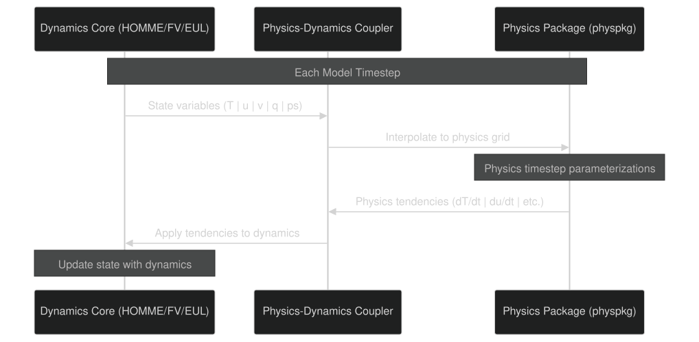

# Dynamics Cores

Relevant source files

- [LICENSE](https://github.com/jingtao-lbl/E3SM/blob/389f40b9/LICENSE)
- [README.md](https://github.com/jingtao-lbl/E3SM/blob/389f40b9/README.md)
- [cime_config/allactive/config_compsets.xml](https://github.com/jingtao-lbl/E3SM/blob/389f40b9/cime_config/allactive/config_compsets.xml)
- [cime_config/allactive/testlist_allactive.xml](https://github.com/jingtao-lbl/E3SM/blob/389f40b9/cime_config/allactive/testlist_allactive.xml)
- [cime_config/config_archive.xml](https://github.com/jingtao-lbl/E3SM/blob/389f40b9/cime_config/config_archive.xml)
- [cime_config/config_inputdata.xml](https://github.com/jingtao-lbl/E3SM/blob/389f40b9/cime_config/config_inputdata.xml)
- [cime_config/testmods_dirs/allactive/force_netcdf_pio/shell_commands](https://github.com/jingtao-lbl/E3SM/blob/389f40b9/cime_config/testmods_dirs/allactive/force_netcdf_pio/shell_commands)
- [cime_config/testmods_dirs/allactive/mach/pet/shell_commands](https://github.com/jingtao-lbl/E3SM/blob/389f40b9/cime_config/testmods_dirs/allactive/mach/pet/shell_commands)
- [cime_config/testmods_dirs/allactive/mach_mods/shell_commands](https://github.com/jingtao-lbl/E3SM/blob/389f40b9/cime_config/testmods_dirs/allactive/mach_mods/shell_commands)
- [cime_config/testmods_dirs/allactive/v1bgc/shell_commands](https://github.com/jingtao-lbl/E3SM/blob/389f40b9/cime_config/testmods_dirs/allactive/v1bgc/shell_commands)
- [cime_config/testmods_dirs/atmlndactive/rtm_off/README](https://github.com/jingtao-lbl/E3SM/blob/389f40b9/cime_config/testmods_dirs/atmlndactive/rtm_off/README)
- [cime_config/testmods_dirs/atmlndactive/rtm_off/user_nl_mosart](https://github.com/jingtao-lbl/E3SM/blob/389f40b9/cime_config/testmods_dirs/atmlndactive/rtm_off/user_nl_mosart)
- [cime_config/tests.py](https://github.com/jingtao-lbl/E3SM/blob/389f40b9/cime_config/tests.py)
- [components/eam/bld/build-namelist](https://github.com/jingtao-lbl/E3SM/blob/389f40b9/components/eam/bld/build-namelist)
- [components/eam/bld/config_files/definition.xml](https://github.com/jingtao-lbl/E3SM/blob/389f40b9/components/eam/bld/config_files/definition.xml)
- [components/eam/bld/config_files/horiz_grid.xml](https://github.com/jingtao-lbl/E3SM/blob/389f40b9/components/eam/bld/config_files/horiz_grid.xml)
- [components/eam/bld/configure](https://github.com/jingtao-lbl/E3SM/blob/389f40b9/components/eam/bld/configure)
- [components/eam/bld/namelist_files/namelist_defaults_eam.xml](https://github.com/jingtao-lbl/E3SM/blob/389f40b9/components/eam/bld/namelist_files/namelist_defaults_eam.xml)
- [components/eam/bld/namelist_files/namelist_definition.xml](https://github.com/jingtao-lbl/E3SM/blob/389f40b9/components/eam/bld/namelist_files/namelist_definition.xml)
- [components/eam/bld/namelist_files/use_cases/1950_MMF-1mom_CMIP6.xml](https://github.com/jingtao-lbl/E3SM/blob/389f40b9/components/eam/bld/namelist_files/use_cases/1950_MMF-1mom_CMIP6.xml)
- [components/eam/bld/namelist_files/use_cases/20TR_MMF-1mom_CMIP6.xml](https://github.com/jingtao-lbl/E3SM/blob/389f40b9/components/eam/bld/namelist_files/use_cases/20TR_MMF-1mom_CMIP6.xml)
- [components/eam/cime_config/config_component.xml](https://github.com/jingtao-lbl/E3SM/blob/389f40b9/components/eam/cime_config/config_component.xml)
- [components/eam/cime_config/config_compsets.xml](https://github.com/jingtao-lbl/E3SM/blob/389f40b9/components/eam/cime_config/config_compsets.xml)
- [components/eam/cime_config/testdefs/testmods_dirs/eam/hommexx/shell_commands](https://github.com/jingtao-lbl/E3SM/blob/389f40b9/components/eam/cime_config/testdefs/testmods_dirs/eam/hommexx/shell_commands)
- [components/eam/cime_config/testdefs/testmods_dirs/eam/thetahy_ftype2_energy/shell_commands](https://github.com/jingtao-lbl/E3SM/blob/389f40b9/components/eam/cime_config/testdefs/testmods_dirs/eam/thetahy_ftype2_energy/shell_commands)
- [components/eam/cime_config/testdefs/testmods_dirs/eam/thetahy_ftype2_energy/user_nl_eam](https://github.com/jingtao-lbl/E3SM/blob/389f40b9/components/eam/cime_config/testdefs/testmods_dirs/eam/thetahy_ftype2_energy/user_nl_eam)
- [components/eam/src/chemistry/mozart/chemistry.F90](https://github.com/jingtao-lbl/E3SM/blob/389f40b9/components/eam/src/chemistry/mozart/chemistry.F90)
- [components/eam/src/chemistry/mozart/lin_strat_chem.F90](https://github.com/jingtao-lbl/E3SM/blob/389f40b9/components/eam/src/chemistry/mozart/lin_strat_chem.F90)
- [components/eam/src/chemistry/mozart/linoz_data.F90](https://github.com/jingtao-lbl/E3SM/blob/389f40b9/components/eam/src/chemistry/mozart/linoz_data.F90)
- [components/eam/src/chemistry/mozart/mo_chm_diags.F90](https://github.com/jingtao-lbl/E3SM/blob/389f40b9/components/eam/src/chemistry/mozart/mo_chm_diags.F90)
- [components/eam/src/chemistry/mozart/mo_extfrc.F90](https://github.com/jingtao-lbl/E3SM/blob/389f40b9/components/eam/src/chemistry/mozart/mo_extfrc.F90)
- [components/eam/src/chemistry/mozart/mo_gas_phase_chemdr.F90](https://github.com/jingtao-lbl/E3SM/blob/389f40b9/components/eam/src/chemistry/mozart/mo_gas_phase_chemdr.F90)
- [components/eam/src/chemistry/mozart/mo_neu_wetdep.F90](https://github.com/jingtao-lbl/E3SM/blob/389f40b9/components/eam/src/chemistry/mozart/mo_neu_wetdep.F90)
- [components/eam/src/chemistry/mozart/mo_photo.F90](https://github.com/jingtao-lbl/E3SM/blob/389f40b9/components/eam/src/chemistry/mozart/mo_photo.F90)
- [components/eam/src/chemistry/mozart/mo_setext.F90](https://github.com/jingtao-lbl/E3SM/blob/389f40b9/components/eam/src/chemistry/mozart/mo_setext.F90)
- [components/eam/src/chemistry/utils/aircraft_emit.F90](https://github.com/jingtao-lbl/E3SM/blob/389f40b9/components/eam/src/chemistry/utils/aircraft_emit.F90)
- [components/eam/src/chemistry/utils/tracer_data.F90](https://github.com/jingtao-lbl/E3SM/blob/389f40b9/components/eam/src/chemistry/utils/tracer_data.F90)
- [components/eam/src/dynamics/fv/dyn_grid.F90](https://github.com/jingtao-lbl/E3SM/blob/389f40b9/components/eam/src/dynamics/fv/dyn_grid.F90)
- [components/eam/src/physics/cam/check_energy.F90](https://github.com/jingtao-lbl/E3SM/blob/389f40b9/components/eam/src/physics/cam/check_energy.F90)
- [components/eam/src/physics/cam/co2_cycle.F90](https://github.com/jingtao-lbl/E3SM/blob/389f40b9/components/eam/src/physics/cam/co2_cycle.F90)
- [components/eam/src/physics/cam/co2_data_flux.F90](https://github.com/jingtao-lbl/E3SM/blob/389f40b9/components/eam/src/physics/cam/co2_data_flux.F90)
- [components/eam/src/physics/cam/co2_diagnostics.F90](https://github.com/jingtao-lbl/E3SM/blob/389f40b9/components/eam/src/physics/cam/co2_diagnostics.F90)
- [components/eam/src/physics/cam/nudging.F90](https://github.com/jingtao-lbl/E3SM/blob/389f40b9/components/eam/src/physics/cam/nudging.F90)
- [components/eam/src/physics/cam/phys_control.F90](https://github.com/jingtao-lbl/E3SM/blob/389f40b9/components/eam/src/physics/cam/phys_control.F90)
- [components/eam/src/physics/cam/physics_types.F90](https://github.com/jingtao-lbl/E3SM/blob/389f40b9/components/eam/src/physics/cam/physics_types.F90)
- [components/eam/src/physics/cam/physpkg.F90](https://github.com/jingtao-lbl/E3SM/blob/389f40b9/components/eam/src/physics/cam/physpkg.F90)
- [components/eam/src/physics/cam/qneg4.F90](https://github.com/jingtao-lbl/E3SM/blob/389f40b9/components/eam/src/physics/cam/qneg4.F90)
- [components/eam/src/physics/cam/tropopause.F90](https://github.com/jingtao-lbl/E3SM/blob/389f40b9/components/eam/src/physics/cam/tropopause.F90)
- [driver-mct/cime_config/config_component_e3sm.xml](https://github.com/jingtao-lbl/E3SM/blob/389f40b9/driver-mct/cime_config/config_component_e3sm.xml)

## Purpose and Scope

This page describes the atmospheric dynamics cores available in EAM (E3SM Atmosphere Model), their configuration options, build-time selection, and runtime parameters. The dynamics core solves the fluid dynamics equations governing atmospheric motion on the model grid.

For information about EAM physics parameterizations that interact with the dynamics, see [Physics Parameterizations](#3.1.2) . For details on grid configurations that work with specific dynamics cores, see [Grid and Resolution Configuration](#2.2) .

## Available Dynamics Cores

EAM supports three primary dynamics cores, selected at build time via the `CAM_DYCORE` configuration variable:

| Dycore ID | Name | Description | Grid Type | 
| --- | --- | --- | --- |
| se | HOMME Spectral Element | High-order spectral element method on cubed-sphere | Unstructured (ne* grids) | 
| fv | Finite Volume | Flux-form finite volume method | Structured lat-lon | 
| eul | Eulerian | Spectral transform method | Gaussian grid (T* grids) | 

The Spectral Element (SE) dycore using the HOMME (High Order Method Modeling Environment) framework is the primary dycore for modern E3SM configurations and supports variable-resolution meshes.

Sources:  [components/eam/cime_config/config_component.xml 24-35](https://github.com/jingtao-lbl/E3SM/blob/389f40b9/components/eam/cime_config/config_component.xml#L24-L35)

## Build-Time Dynamics Core Selection

Diagram: Dynamics Core Selection Logic

The dynamics core is determined automatically from the grid specification or can be set explicitly via the `CAM_DYCORE` configuration option in `config_component.xml` .

Sources:  [components/eam/cime_config/config_component.xml 24-35](https://github.com/jingtao-lbl/E3SM/blob/389f40b9/components/eam/cime_config/config_component.xml#L24-L35)

## HOMME Spectral Element Formulations

When `CAM_DYCORE=se` is selected, the `CAM_TARGET` variable specifies the HOMME formulation and computational backend:

Diagram: HOMME Formulation Options

### CAM_TARGET Values

| Target | Formulation | Backend | Use Case | 
| --- | --- | --- | --- |
| preqx | Primitive equations | Fortran | Legacy configurations | 
| preqx_kokkos | Primitive equations | Kokkos | Performance portability | 
| preqx_acc | Primitive equations | OpenACC | GPU acceleration | 
| theta-l | Potential temperature | Fortran | Default for modern E3SM | 
| theta-l_kokkos | Potential temperature | Kokkos | GPU/advanced architectures | 

The theta-l formulation is the default and recommended option for E3SM v2 and later. It uses potential temperature as a prognostic variable and provides better energy conservation properties.

Sources:  [components/eam/cime_config/config_component.xml 37-44](https://github.com/jingtao-lbl/E3SM/blob/389f40b9/components/eam/cime_config/config_component.xml#L37-L44)

## Dynamics Timestep Configuration

The dynamics timestep ( `dtime` ) is automatically configured based on the dynamics core and grid resolution:

### Timestep Defaults by Dycore and Grid

Diagram: Timestep Scaling with Resolution

Higher resolution grids require smaller timesteps to maintain numerical stability. The spectral element dycore timestep scales approximately with grid spacing.

Key Code Entities:

- `dtime`Variable: in namelist
- `namelist_defaults_eam.xml`Configuration file:
- Settings for SE grids: Lines 11-27 define resolution-specific timesteps

Sources:  [components/eam/bld/namelist_files/namelist_defaults_eam.xml 5-30](https://github.com/jingtao-lbl/E3SM/blob/389f40b9/components/eam/bld/namelist_files/namelist_defaults_eam.xml#L5-L30)

## Regionally Refined Meshes (RRM)

The spectral element dycore supports variable-resolution grids with regional refinement. These grids use the naming convention `ne0np4_<region>_<refinement>` :

| Grid Example | Description | Timestep | 
| --- | --- | --- |
| ne0np4_conus_x4v1_lowcon | CONUS 4x refinement | 900s | 
| ne0np4_northamericax4v1 | North America 4x | 900s | 
| ne0np4_antarcticax4v1 | Antarctic 4x | 900s | 
| ne0np4_arcticx4v1 | Arctic 4x | 900s | 

Regional refinement allows high resolution over areas of interest while maintaining coarser resolution globally, improving computational efficiency.

Sources:  [components/eam/bld/namelist_files/namelist_defaults_eam.xml 19-27](https://github.com/jingtao-lbl/E3SM/blob/389f40b9/components/eam/bld/namelist_files/namelist_defaults_eam.xml#L19-L27)  [components/eam/bld/namelist_files/namelist_defaults_eam.xml 114-125](https://github.com/jingtao-lbl/E3SM/blob/389f40b9/components/eam/bld/namelist_files/namelist_defaults_eam.xml#L114-L125)

## Testing Different Dycore Formulations

E3SM includes comprehensive test suites for different dycore formulations and physics-dynamics coupling options:

Diagram: Dycore Test Coverage

### Test Modifier Meanings

- **ftype**
- `ftype0``ftype1``ftype2``ftype4`, , , : Different physics-dynamics coupling methods

(forcing type): Controls how physics tendencies are applied to dynamics
- **pg2**: Physics grid version 2 (alternative grid staggering)
- **sl**: Semi-Lagrangian tracer advection
- **nh**: Non-hydrostatic formulation

Example test specification:

This runs a smoke test with the theta-l hydrostatic dycore using ftype2 coupling on the ne4pg2 grid.

Sources:  [cime_config/tests.py 454-491](https://github.com/jingtao-lbl/E3SM/blob/389f40b9/cime_config/tests.py#L454-L491)

## Physics-Dynamics Coupling

The dynamics core and physics parameterizations are coupled through standardized interfaces. The coupling frequency and method depend on the formulation:

Diagram: Dynamics-Physics Coupling Sequence

The coupling method (ftype) determines how physics tendencies are temporally and spatially integrated with the dynamical core's prognostic equations.

Sources:  [components/eam/bld/namelist_files/namelist_definition.xml 345-432](https://github.com/jingtao-lbl/E3SM/blob/389f40b9/components/eam/bld/namelist_files/namelist_definition.xml#L345-L432)

## Performance and Portability

### Kokkos Backend

The Kokkos-enabled dycore variants ( `preqx_kokkos` , `theta-l_kokkos` ) provide performance portability across CPU and GPU architectures:

- **CPU**: OpenMP threading
- **NVIDIA GPUs**: CUDA backend
- **AMD GPUs**: HIP backend
- **Intel GPUs**: SYCL backend

Kokkos is configured at build time through the cmake system. See [GPU Support and Performance Portability](#8.1) for details.

### HOMMEXX

The `eam-hommexx` test modifier indicates use of the C++ rewrite of HOMME with Kokkos support, designed for exascale GPU systems.

Sources:  [cime_config/tests.py 109](https://github.com/jingtao-lbl/E3SM/blob/389f40b9/cime_config/tests.py#L109-L109)  [components/eam/cime_config/config_component.xml 37-44](https://github.com/jingtao-lbl/E3SM/blob/389f40b9/components/eam/cime_config/config_component.xml#L37-L44)

## Initial Conditions and Topography

Each dynamics core requires compatible initial condition files and topography datasets:

### Topography Files

The topography dataset is resolution-specific and set via the `bnd_topo` namelist variable:

- **SE grids**`USGS-gtopo30_ne<res>np4_*`: files
- **FV grids**: Resolution-specific lat-lon files
- **npg parameter**: Physics grid variant (0=GLL, 2=PG2, 3=PG3, 4=PG4)

Example for ne30 with PG2:

### Initial Conditions

Initial conditions ( `ncdata` ) must match:

Example:

Sources:  [components/eam/bld/namelist_files/namelist_defaults_eam.xml 127-163](https://github.com/jingtao-lbl/E3SM/blob/389f40b9/components/eam/bld/namelist_files/namelist_defaults_eam.xml#L127-L163)  [components/eam/bld/namelist_files/namelist_defaults_eam.xml 32-103](https://github.com/jingtao-lbl/E3SM/blob/389f40b9/components/eam/bld/namelist_files/namelist_defaults_eam.xml#L32-L103)

## Configuration Examples

### Example 1: Standard E3SM v3 Configuration

This configures:

- Dycore: Spectral element (default theta-l formulation)
- Grid: 1-degree (ne30) with standard physics grid
- Vertical: 80 levels
- Chemistry: ChemUCI with Linoz v3 and MAM5 aerosols

### Example 2: High-Resolution RRM

This configures a regionally refined mesh with 4x refinement over North America.

### Example 3: Finite Volume Dycore

This uses the finite volume dycore on a 2-degree lat-lon grid.

Sources:  [components/eam/bld/configure 1-100](https://github.com/jingtao-lbl/E3SM/blob/389f40b9/components/eam/bld/configure#L1-L100)

## Summary

The choice of dynamics core in EAM involves:

The spectral element dycore with theta-l formulation is the primary configuration for modern E3SM versions, supporting both uniform and variable-resolution grids with options for GPU acceleration through Kokkos.

Sources:  [components/eam/cime_config/config_component.xml 24-44](https://github.com/jingtao-lbl/E3SM/blob/389f40b9/components/eam/cime_config/config_component.xml#L24-L44)  [cime_config/tests.py 454-491](https://github.com/jingtao-lbl/E3SM/blob/389f40b9/cime_config/tests.py#L454-L491)