# Physics Parameterizations

Relevant source files

- [cime_config/allactive/config_compsets.xml](https://github.com/jingtao-lbl/E3SM/blob/389f40b9/cime_config/allactive/config_compsets.xml)
- [cime_config/allactive/testlist_allactive.xml](https://github.com/jingtao-lbl/E3SM/blob/389f40b9/cime_config/allactive/testlist_allactive.xml)
- [cime_config/config_archive.xml](https://github.com/jingtao-lbl/E3SM/blob/389f40b9/cime_config/config_archive.xml)
- [cime_config/config_inputdata.xml](https://github.com/jingtao-lbl/E3SM/blob/389f40b9/cime_config/config_inputdata.xml)
- [cime_config/testmods_dirs/allactive/force_netcdf_pio/shell_commands](https://github.com/jingtao-lbl/E3SM/blob/389f40b9/cime_config/testmods_dirs/allactive/force_netcdf_pio/shell_commands)
- [cime_config/testmods_dirs/allactive/mach/pet/shell_commands](https://github.com/jingtao-lbl/E3SM/blob/389f40b9/cime_config/testmods_dirs/allactive/mach/pet/shell_commands)
- [cime_config/testmods_dirs/allactive/mach_mods/shell_commands](https://github.com/jingtao-lbl/E3SM/blob/389f40b9/cime_config/testmods_dirs/allactive/mach_mods/shell_commands)
- [cime_config/testmods_dirs/allactive/v1bgc/shell_commands](https://github.com/jingtao-lbl/E3SM/blob/389f40b9/cime_config/testmods_dirs/allactive/v1bgc/shell_commands)
- [cime_config/testmods_dirs/atmlndactive/rtm_off/README](https://github.com/jingtao-lbl/E3SM/blob/389f40b9/cime_config/testmods_dirs/atmlndactive/rtm_off/README)
- [cime_config/testmods_dirs/atmlndactive/rtm_off/user_nl_mosart](https://github.com/jingtao-lbl/E3SM/blob/389f40b9/cime_config/testmods_dirs/atmlndactive/rtm_off/user_nl_mosart)
- [cime_config/tests.py](https://github.com/jingtao-lbl/E3SM/blob/389f40b9/cime_config/tests.py)
- [components/eam/bld/build-namelist](https://github.com/jingtao-lbl/E3SM/blob/389f40b9/components/eam/bld/build-namelist)
- [components/eam/bld/config_files/definition.xml](https://github.com/jingtao-lbl/E3SM/blob/389f40b9/components/eam/bld/config_files/definition.xml)
- [components/eam/bld/config_files/horiz_grid.xml](https://github.com/jingtao-lbl/E3SM/blob/389f40b9/components/eam/bld/config_files/horiz_grid.xml)
- [components/eam/bld/configure](https://github.com/jingtao-lbl/E3SM/blob/389f40b9/components/eam/bld/configure)
- [components/eam/bld/namelist_files/namelist_defaults_eam.xml](https://github.com/jingtao-lbl/E3SM/blob/389f40b9/components/eam/bld/namelist_files/namelist_defaults_eam.xml)
- [components/eam/bld/namelist_files/namelist_definition.xml](https://github.com/jingtao-lbl/E3SM/blob/389f40b9/components/eam/bld/namelist_files/namelist_definition.xml)
- [components/eam/bld/namelist_files/use_cases/1950_MMF-1mom_CMIP6.xml](https://github.com/jingtao-lbl/E3SM/blob/389f40b9/components/eam/bld/namelist_files/use_cases/1950_MMF-1mom_CMIP6.xml)
- [components/eam/bld/namelist_files/use_cases/20TR_MMF-1mom_CMIP6.xml](https://github.com/jingtao-lbl/E3SM/blob/389f40b9/components/eam/bld/namelist_files/use_cases/20TR_MMF-1mom_CMIP6.xml)
- [components/eam/cime_config/config_component.xml](https://github.com/jingtao-lbl/E3SM/blob/389f40b9/components/eam/cime_config/config_component.xml)
- [components/eam/cime_config/config_compsets.xml](https://github.com/jingtao-lbl/E3SM/blob/389f40b9/components/eam/cime_config/config_compsets.xml)
- [components/eam/cime_config/testdefs/testmods_dirs/eam/hommexx/shell_commands](https://github.com/jingtao-lbl/E3SM/blob/389f40b9/components/eam/cime_config/testdefs/testmods_dirs/eam/hommexx/shell_commands)
- [components/eam/cime_config/testdefs/testmods_dirs/eam/thetahy_ftype2_energy/shell_commands](https://github.com/jingtao-lbl/E3SM/blob/389f40b9/components/eam/cime_config/testdefs/testmods_dirs/eam/thetahy_ftype2_energy/shell_commands)
- [components/eam/cime_config/testdefs/testmods_dirs/eam/thetahy_ftype2_energy/user_nl_eam](https://github.com/jingtao-lbl/E3SM/blob/389f40b9/components/eam/cime_config/testdefs/testmods_dirs/eam/thetahy_ftype2_energy/user_nl_eam)
- [components/eam/src/chemistry/mozart/chemistry.F90](https://github.com/jingtao-lbl/E3SM/blob/389f40b9/components/eam/src/chemistry/mozart/chemistry.F90)
- [components/eam/src/chemistry/mozart/lin_strat_chem.F90](https://github.com/jingtao-lbl/E3SM/blob/389f40b9/components/eam/src/chemistry/mozart/lin_strat_chem.F90)
- [components/eam/src/chemistry/mozart/linoz_data.F90](https://github.com/jingtao-lbl/E3SM/blob/389f40b9/components/eam/src/chemistry/mozart/linoz_data.F90)
- [components/eam/src/chemistry/mozart/mo_chm_diags.F90](https://github.com/jingtao-lbl/E3SM/blob/389f40b9/components/eam/src/chemistry/mozart/mo_chm_diags.F90)
- [components/eam/src/chemistry/mozart/mo_extfrc.F90](https://github.com/jingtao-lbl/E3SM/blob/389f40b9/components/eam/src/chemistry/mozart/mo_extfrc.F90)
- [components/eam/src/chemistry/mozart/mo_gas_phase_chemdr.F90](https://github.com/jingtao-lbl/E3SM/blob/389f40b9/components/eam/src/chemistry/mozart/mo_gas_phase_chemdr.F90)
- [components/eam/src/chemistry/mozart/mo_neu_wetdep.F90](https://github.com/jingtao-lbl/E3SM/blob/389f40b9/components/eam/src/chemistry/mozart/mo_neu_wetdep.F90)
- [components/eam/src/chemistry/mozart/mo_photo.F90](https://github.com/jingtao-lbl/E3SM/blob/389f40b9/components/eam/src/chemistry/mozart/mo_photo.F90)
- [components/eam/src/chemistry/mozart/mo_setext.F90](https://github.com/jingtao-lbl/E3SM/blob/389f40b9/components/eam/src/chemistry/mozart/mo_setext.F90)
- [components/eam/src/chemistry/utils/aircraft_emit.F90](https://github.com/jingtao-lbl/E3SM/blob/389f40b9/components/eam/src/chemistry/utils/aircraft_emit.F90)
- [components/eam/src/chemistry/utils/tracer_data.F90](https://github.com/jingtao-lbl/E3SM/blob/389f40b9/components/eam/src/chemistry/utils/tracer_data.F90)
- [components/eam/src/dynamics/fv/dyn_grid.F90](https://github.com/jingtao-lbl/E3SM/blob/389f40b9/components/eam/src/dynamics/fv/dyn_grid.F90)
- [components/eam/src/physics/cam/check_energy.F90](https://github.com/jingtao-lbl/E3SM/blob/389f40b9/components/eam/src/physics/cam/check_energy.F90)
- [components/eam/src/physics/cam/co2_cycle.F90](https://github.com/jingtao-lbl/E3SM/blob/389f40b9/components/eam/src/physics/cam/co2_cycle.F90)
- [components/eam/src/physics/cam/co2_data_flux.F90](https://github.com/jingtao-lbl/E3SM/blob/389f40b9/components/eam/src/physics/cam/co2_data_flux.F90)
- [components/eam/src/physics/cam/co2_diagnostics.F90](https://github.com/jingtao-lbl/E3SM/blob/389f40b9/components/eam/src/physics/cam/co2_diagnostics.F90)
- [components/eam/src/physics/cam/nudging.F90](https://github.com/jingtao-lbl/E3SM/blob/389f40b9/components/eam/src/physics/cam/nudging.F90)
- [components/eam/src/physics/cam/phys_control.F90](https://github.com/jingtao-lbl/E3SM/blob/389f40b9/components/eam/src/physics/cam/phys_control.F90)
- [components/eam/src/physics/cam/physics_types.F90](https://github.com/jingtao-lbl/E3SM/blob/389f40b9/components/eam/src/physics/cam/physics_types.F90)
- [components/eam/src/physics/cam/physpkg.F90](https://github.com/jingtao-lbl/E3SM/blob/389f40b9/components/eam/src/physics/cam/physpkg.F90)
- [components/eam/src/physics/cam/qneg4.F90](https://github.com/jingtao-lbl/E3SM/blob/389f40b9/components/eam/src/physics/cam/qneg4.F90)
- [components/eam/src/physics/cam/shoc.F90](https://github.com/jingtao-lbl/E3SM/blob/389f40b9/components/eam/src/physics/cam/shoc.F90)
- [components/eam/src/physics/cam/tropopause.F90](https://github.com/jingtao-lbl/E3SM/blob/389f40b9/components/eam/src/physics/cam/tropopause.F90)
- [driver-mct/cime_config/config_component_e3sm.xml](https://github.com/jingtao-lbl/E3SM/blob/389f40b9/driver-mct/cime_config/config_component_e3sm.xml)

## Purpose and Scope

This page documents the physical parameterizations in the E3SM Atmosphere Model (EAM), which represent subgrid-scale processes that cannot be explicitly resolved by the dynamical core. These parameterizations include turbulence and boundary layer mixing, convection, cloud microphysics, and radiation. For information about the dynamical cores that provide the resolved flow, see [Dynamics Cores](#3.1.1) . For chemistry and aerosol processes, see [Chemistry and Aerosols](#3.1.3) .

## Overview of Physics Parameterizations

EAM's physics parameterizations are organized into several functional categories, each addressing different physical processes:

Sources:  [components/eam/src/physics/cam/physpkg.F90 1-107](https://github.com/jingtao-lbl/E3SM/blob/389f40b9/components/eam/src/physics/cam/physpkg.F90#L1-L107)  [components/eam/src/physics/cam/phys_control.F90 1-30](https://github.com/jingtao-lbl/E3SM/blob/389f40b9/components/eam/src/physics/cam/phys_control.F90#L1-L30)

## Physics Driver Architecture

The physics driver in EAM follows a two-phase execution strategy, separating moist physics from radiation and chemistry calculations.

### Execution Flow

The separation into `phys_run1` and `phys_run2` allows moist physics to be computed first, which may occur multiple times per dynamics timestep (macro/microphysics subcycling), while radiation is typically computed less frequently.

Sources:  [components/eam/src/physics/cam/physpkg.F90 90-107](https://github.com/jingtao-lbl/E3SM/blob/389f40b9/components/eam/src/physics/cam/physpkg.F90#L90-L107)

### Physics State and Tendency Management

Physics routines interact with the model state through standardized data structures:

| Data Structure | Purpose | Key Components | 
| --- | --- | --- |
| physics_state | Input state variables | t, q, u, v, pmid, pint, zi, zm | 
| physics_tend | Accumulated tendencies | dtdt, dudt, dvdt, dqdt for all constituents | 
| physics_ptend | Individual parameterization tendency | Tendency contribution from single physics routine | 
| cam_in_t | Surface boundary conditions | Surface fluxes, temperatures from coupler | 
| cam_out_t | Surface flux outputs | Fluxes sent to surface components | 

Sources:  [components/eam/src/physics/cam/physics_types.F90 1-23](https://github.com/jingtao-lbl/E3SM/blob/389f40b9/components/eam/src/physics/cam/physics_types.F90#L1-L23)  [components/eam/src/physics/cam/physpkg.F90 19-23](https://github.com/jingtao-lbl/E3SM/blob/389f40b9/components/eam/src/physics/cam/physpkg.F90#L19-L23)

## Turbulence and Boundary Layer Schemes

EAM provides two primary options for representing turbulence and subgrid-scale (SGS) processes:

### SHOC (Simplified Higher-Order Closure)

SHOC is a unified turbulence and shallow convection scheme that uses a PDF-based approach for diagnosing clouds and parameterizing turbulent mixing.

SHOC configuration is controlled through:

- `-clubb_sgs``CAM_CONFIG_OPTS`Build-time: in (enables SHOC as default for E3SM v2/v3)
- `shoc.F90``thl2tune``qw2tune``w2tune``length_fac``Ckh``Ckm`Runtime: Tunable parameters in including , , , , ,

Key Features:

- Unified treatment of turbulence and shallow convection
- Prognostic TKE with higher-order closure
- PDF-based cloud fraction and liquid water
- Applicable from surface through PBL to free troposphere

Sources:  [components/eam/src/physics/cam/shoc.F90 1-134](https://github.com/jingtao-lbl/E3SM/blob/389f40b9/components/eam/src/physics/cam/shoc.F90#L1-L134)  [components/eam/cime_config/config_component.xml 6-10](https://github.com/jingtao-lbl/E3SM/blob/389f40b9/components/eam/cime_config/config_component.xml#L6-L10)

### CLUBB (Cloud Layers Unified By Binormals)

CLUBB is an alternative unified turbulence parameterization that also handles shallow convection using a double-Gaussian PDF approach.

Configuration via `CAM_CONFIG_OPTS` :

- `-clubb_sgs`: Enable CLUBB

Sources:  [components/eam/cime_config/config_component.xml 6-10](https://github.com/jingtao-lbl/E3SM/blob/389f40b9/components/eam/cime_config/config_component.xml#L6-L10)

### Turbulence Scheme Selection

The choice between SHOC and CLUBB is made at build time through configuration options:

| Configuration | Turbulence Scheme | Typical Use | 
| --- | --- | --- |
| -clubb_sgs | SHOC (default in v2/v3) | Standard E3SM configurations | 
| -clubb_sgs with CLUBB-specific options | CLUBB | Alternative turbulence treatment | 
| Neither | CAM default schemes | Legacy configurations | 

Sources:  [components/eam/cime_config/config_component.xml 6-10](https://github.com/jingtao-lbl/E3SM/blob/389f40b9/components/eam/cime_config/config_component.xml#L6-L10)

## Convection Parameterizations

Convection schemes in EAM handle both deep and shallow convective processes. The schemes are selected at build time and can have significant impacts on tropical precipitation and circulation patterns.

### Deep Convection Schemes

Zhang-McFarlane (ZM) Deep Convection:

- Mass flux scheme with CAPE-based closure
- Trigger function based on buoyancy
- 
- Convective microphysics for precipitation efficiency
- DCAPE (Downdraft CAPE) trigger for improved initiation
- Enhanced momentum transport

Optional enhancements include:

Test configurations demonstrate ZM options:

- `eam-zm_enhancements`: Tests with ZM enhancements enabled
- `eam-condidiag_dcape`: DCAPE diagnostics and triggering

Sources:  [cime_config/tests.py 132-143](https://github.com/jingtao-lbl/E3SM/blob/389f40b9/cime_config/tests.py#L132-L143)  [components/eam/src/physics/cam/physpkg.F90 35-36](https://github.com/jingtao-lbl/E3SM/blob/389f40b9/components/eam/src/physics/cam/physpkg.F90#L35-L36)

### Shallow Convection

Shallow convection is often handled by the turbulence scheme (SHOC or CLUBB) in unified parameterizations, but can also be treated separately.

Sources:  [components/eam/src/physics/cam/physpkg.F90 99-100](https://github.com/jingtao-lbl/E3SM/blob/389f40b9/components/eam/src/physics/cam/physpkg.F90#L99-L100)

## Microphysics Schemes

Microphysics parameterizations handle the formation, growth, and removal of cloud droplets and precipitation particles.

### Available Schemes

Configuration:

- `CAM_CONFIG_OPTS`
- `-microphys mg2`: MG2 scheme (default for E3SM v2)
- `-microphys p3`: P3 scheme (default for E3SM v3)

Build-time selection via :

MG2 (Morrison-Gettelman 2-moment):

- Two-moment scheme with prognostic mass and number
- Separate categories: liquid, ice, rain, snow
- Aerosol-aware activation and ice nucleation
- Used in E3SM v1 and v2

P3 (Predicted Particle Properties):

- Single ice category with prognostic properties
- Predicts rime mass fraction and density
- Smooth transition between ice habits
- Reduced computational cost vs. multiple ice categories
- Default for E3SM v3

Test configurations:

- `eam-p3`: Tests using P3 microphysics
- Standard tests use MG2 by default

Sources:  [components/eam/cime_config/config_component.xml 8-9](https://github.com/jingtao-lbl/E3SM/blob/389f40b9/components/eam/cime_config/config_component.xml#L8-L9)  [cime_config/tests.py 149-164](https://github.com/jingtao-lbl/E3SM/blob/389f40b9/cime_config/tests.py#L149-L164)  [components/eam/src/physics/cam/physpkg.F90 101](https://github.com/jingtao-lbl/E3SM/blob/389f40b9/components/eam/src/physics/cam/physpkg.F90#L101-L101)

### Macro/Microphysics Subcycling

EAM supports subcycling of cloud macrophysics and microphysics for numerical stability:

The namelist variable `cld_macmic_num_steps` controls the number of substeps.

Sources:  [components/eam/src/physics/cam/physpkg.F90 102](https://github.com/jingtao-lbl/E3SM/blob/389f40b9/components/eam/src/physics/cam/physpkg.F90#L102-L102)

## Radiation Schemes

Radiation calculations in EAM compute shortwave and longwave fluxes and heating rates. These are computationally expensive and often called less frequently than other physics.

### Available Radiation Schemes

Configuration:

- `-rad rrtmg``-rad rrtmgp``CAM_CONFIG_OPTS`Build-time: or in
- `-rrtmgpxx`Additional option: for C++ implementation
- MMF configurations use RRTMGP by default

RRTMG:

- Standard radiation scheme for E3SM v1 and v2
- Two-stream solver with correlated-k gas absorption
- Coupled to aerosol and cloud optical properties

RRTMGP:

- Modernized version with improved performance
- Better suited for GPU architectures
- Default for E3SM v3 and MMF configurations
- Optional C++ implementation (RRTMGPXX) for performance portability

Test configurations:

- `eam-rrtmgp`: Tests using RRTMGP radiation
- `eam-rrtmgpxx`: Tests using C++ RRTMGP implementation

Sources:  [components/eam/cime_config/config_component.xml 10](https://github.com/jingtao-lbl/E3SM/blob/389f40b9/components/eam/cime_config/config_component.xml#L10-L10)  [cime_config/tests.py 180-181](https://github.com/jingtao-lbl/E3SM/blob/389f40b9/cime_config/tests.py#L180-L181)  [components/eam/cime_config/config_component.xml 74-81](https://github.com/jingtao-lbl/E3SM/blob/389f40b9/components/eam/cime_config/config_component.xml#L74-L81)

### Radiation Frequency

Radiation calculations can be expensive, so EAM provides options to call radiation less frequently than the physics timestep. This is controlled through namelist variables and can significantly impact performance.

Sources:  [components/eam/src/physics/cam/physpkg.F90 33-34](https://github.com/jingtao-lbl/E3SM/blob/389f40b9/components/eam/src/physics/cam/physpkg.F90#L33-L34)

## Configuration System for Physics Options

Physics parameterizations in EAM are configured through a hierarchical system involving build-time configuration, namelists, and use cases.

### Build-Time Configuration

Build-time physics configuration is specified via `CAM_CONFIG_OPTS` in the component configuration file. Key options include:

| Option | Values | Purpose | 
| --- | --- | --- |
| -nlev | 72, 80, 128 | Number of vertical levels | 
| -clubb_sgs | (flag) | Enable SHOC/CLUBB turbulence | 
| -microphys | mg2, p3 | Select microphysics scheme | 
| -rad | rrtmg, rrtmgp | Select radiation scheme | 
| -rrtmgpxx | (flag) | Use C++ RRTMGP implementation | 
| -chem | linoz_mam4_resus_mom_soag, etc. | Chemistry and aerosol package | 

Example configurations from compsets:

E3SM v2 (default):

E3SM v3 (CMIP6):

Sources:  [components/eam/cime_config/config_component.xml 6-106](https://github.com/jingtao-lbl/E3SM/blob/389f40b9/components/eam/cime_config/config_component.xml#L6-L106)

### Namelist Configuration

Runtime behavior is controlled through namelist variables defined in the `cam_inparm` , `physconst` , and other namelist groups.

Key physics namelist files:

- `namelist_definition.xml`: Defines all valid namelist variables
- `namelist_defaults_eam.xml`: Provides default values based on configuration
- `20TR_MMF-1mom_CMIP6.xml`Use case files (e.g., ): Scenario-specific settings

Common physics namelist variables:

| Namelist Variable | Purpose | Typical Values | 
| --- | --- | --- |
| deep_scheme | Deep convection scheme | 'ZM', 'off' | 
| shallow_scheme | Shallow convection scheme | 'CLUBB', 'UW' | 
| macrop_scheme | Macrophysics scheme | 'CLUBB' | 
| microp_scheme | Microphysics scheme | 'MG', 'P3' | 
| radiation_scheme | Radiation scheme | 'rrtmg', 'rrtmgp' | 
| cld_macmic_num_steps | Macro/micro substeps | 1, 3, 6 | 

Sources:  [components/eam/bld/namelist_files/namelist_definition.xml 1-53](https://github.com/jingtao-lbl/E3SM/blob/389f40b9/components/eam/bld/namelist_files/namelist_definition.xml#L1-L53)  [components/eam/bld/namelist_files/namelist_defaults_eam.xml 1-106](https://github.com/jingtao-lbl/E3SM/blob/389f40b9/components/eam/bld/namelist_files/namelist_defaults_eam.xml#L1-L106)

### Use Cases

Use cases provide pre-configured sets of namelist values for specific scenarios (e.g., pre-industrial 1850, historical 20TR, present-day 2010, future scenarios).

Use cases set parameters such as:

- Greenhouse gas concentrations
- Aerosol emissions
- Solar forcing
- Prescribed oxidants for chemistry

Example use case:  `20TR_MMF-1mom_CMIP6.xml` specifies settings for historical transient simulations with MMF (Multiscale Modeling Framework).

Sources:  [components/eam/bld/namelist_files/use_cases/20TR_MMF-1mom_CMIP6.xml 1-3](https://github.com/jingtao-lbl/E3SM/blob/389f40b9/components/eam/bld/namelist_files/use_cases/20TR_MMF-1mom_CMIP6.xml#L1-L3)  [components/eam/cime_config/config_component.xml 108-174](https://github.com/jingtao-lbl/E3SM/blob/389f40b9/components/eam/cime_config/config_component.xml#L108-L174)

## Physics Control Interface

The `phys_control` module provides a centralized interface for querying physics configuration at runtime.

### Key Functions

This interface allows physics routines to check configuration options without directly accessing namelist variables.

Sources:  [components/eam/src/physics/cam/phys_control.F90 1-30](https://github.com/jingtao-lbl/E3SM/blob/389f40b9/components/eam/src/physics/cam/phys_control.F90#L1-L30)

## Conservation and Energy Diagnostics

EAM includes extensive diagnostics to monitor energy and water conservation within the physics parameterizations.

### Energy Conservation Checking

The `check_energy` module provides utilities for tracking energy conservation:

Key diagnostic variables:

- `check_energy_gmean`: Global mean energy conservation
- Energy density calculation corrected in 2020
- Water conservation includes all hydrometeor species (liquid, ice, rain, snow)

Sources:  [components/eam/src/physics/cam/check_energy.F90 1-28](https://github.com/jingtao-lbl/E3SM/blob/389f40b9/components/eam/src/physics/cam/check_energy.F90#L1-L28)  [components/eam/src/physics/cam/physpkg.F90 56-71](https://github.com/jingtao-lbl/E3SM/blob/389f40b9/components/eam/src/physics/cam/physpkg.F90#L56-L71)

## Physics-Dynamics Coupling

Physics parameterizations must couple to the dynamical core through standardized interfaces. This includes handling differences in grid structure and variable definitions.

### Coupling Strategy

The `physics_update` module handles the application of physics tendencies to the state variables:

Sources:  [components/eam/src/physics/cam/physpkg.F90 23](https://github.com/jingtao-lbl/E3SM/blob/389f40b9/components/eam/src/physics/cam/physpkg.F90#L23-L23)  [components/eam/src/physics/cam/physics_types.F90 1-23](https://github.com/jingtao-lbl/E3SM/blob/389f40b9/components/eam/src/physics/cam/physics_types.F90#L1-L23)

This page has documented the major physics parameterizations in EAM, their organization within the physics driver, and the configuration system that controls their behavior. For related information on the dynamical cores that provide the resolved atmospheric flow, see [Dynamics Cores](#3.1.1) . For chemistry and aerosol processes that interact with these physics schemes, see [Chemistry and Aerosols](#3.1.3) .